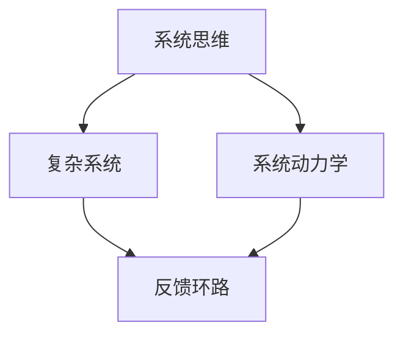

                 

关键词：系统思考，管理者，领导力，决策，复杂系统，战略规划

> 摘要：本文旨在探讨管理者如何提升系统思考能力，以应对复杂多变的管理环境和挑战。通过介绍系统思考的核心概念、方法论和实用技巧，并结合实际案例，文章为管理者提供了提升系统思考能力的路径和方法，助力他们在快速变化的时代中做出更加明智的决策。

## 1. 背景介绍

在当今全球化和信息化的时代，管理者和组织面临着前所未有的复杂性和不确定性。传统线性思维和局部优化策略已经难以应对这种复杂的局面。系统思考（Systems Thinking）作为一种应对复杂问题的思考方法，逐渐受到管理者和学术界的关注。系统思考强调从整体视角理解和分析问题，识别问题背后的结构和因果关系，从而提出更加全面和长远的解决方案。

然而，许多管理者在系统思考能力的培养和应用方面仍然存在诸多挑战。一方面，管理者常常受限于自身的经验和知识结构，难以跳出传统的思维框架。另一方面，系统思考需要管理者具备较强的跨学科知识背景和逻辑思维能力，这对许多管理者来说是一个巨大的挑战。因此，本文将探讨如何通过系统思考提升管理者的决策能力和领导力。

## 2. 核心概念与联系

### 2.1 系统思维

系统思维是一种将事物视为一个整体、考虑事物之间相互关系的思维方式。系统思维不仅关注局部优化，更强调整体优化，追求系统内部各部分的协同和平衡。在管理实践中，系统思维有助于管理者从全局角度审视问题，识别潜在的风险和机会，从而做出更加明智的决策。

### 2.2 复杂系统

复杂系统是由多个相互作用的子系统组成的，具有高度复杂性和不确定性的系统。在复杂系统中，各个子系统之间存在复杂的相互作用关系，导致系统行为具有不可预测性。管理者需要具备系统思维，以理解和应对复杂系统的动态变化。

### 2.3 系统动力学

系统动力学是一种研究复杂系统动态行为的科学方法。通过建立数学模型，系统动力学可以帮助管理者识别系统中的反馈环路和延迟效应，从而更好地理解系统行为的动态变化。

### 2.4 Mermaid 流程图

Mermaid 是一种简单易用的图形描述语言，可用于绘制流程图、UML 图、时序图等。以下是一个简化的 Mermaid 流程图，用于展示系统思维、复杂系统和系统动力学之间的关系：



## 3. 核心算法原理 & 具体操作步骤

### 3.1 算法原理概述

系统思考的核心算法原理是建立系统模型，通过分析系统内部各部分的相互作用关系，识别问题的主要驱动因素和潜在解决方案。具体操作步骤如下：

1. 确定问题：明确需要解决的管理问题，界定问题的范围和关键要素。
2. 收集数据：收集与问题相关的数据，包括历史数据、实时数据和专家意见等。
3. 建立系统模型：使用系统动力学方法建立系统模型，模拟系统内部各部分的相互作用关系。
4. 分析模型：分析系统模型，识别问题的主要驱动因素和潜在解决方案。
5. 评估解决方案：评估不同解决方案的可行性和效果，选择最优方案。
6. 实施方案：实施所选方案，并跟踪效果，根据实际情况进行调整。

### 3.2 算法步骤详解

1. **确定问题**

   首先，管理者需要明确需要解决的管理问题，例如：如何提高销售额、如何降低成本、如何提升员工满意度等。明确问题后，管理者可以进一步界定问题的范围和关键要素。

2. **收集数据**

   收集与问题相关的数据，包括历史数据、实时数据和专家意见等。这些数据可以为管理者提供问题的背景信息和现状，帮助管理者更好地理解问题。

3. **建立系统模型**

   使用系统动力学方法建立系统模型。系统模型可以包括各个子系统、子系统之间的关系、反馈环路和延迟效应等。通过系统模型，管理者可以模拟系统内部各部分的相互作用关系，分析问题的主要驱动因素和潜在解决方案。

4. **分析模型**

   分析系统模型，识别问题的主要驱动因素和潜在解决方案。管理者可以通过分析模型，了解系统内部各部分的相互作用关系，从而找到解决问题的关键因素。

5. **评估解决方案**

   评估不同解决方案的可行性和效果，选择最优方案。管理者可以根据系统模型的分析结果，评估不同解决方案的优缺点，选择最适合当前实际情况的方案。

6. **实施方案**

   实施所选方案，并跟踪效果，根据实际情况进行调整。管理者需要根据实际情况对方案进行调整，确保方案的顺利实施并达到预期效果。

### 3.3 算法优缺点

**优点：**

- 帮助管理者从全局角度审视问题，识别问题的主要驱动因素和潜在解决方案。
- 提高决策的准确性和有效性，降低决策风险。
- 促进管理者对系统内部各部分之间相互作用关系的理解和把握。

**缺点：**

- 建立系统模型需要较强的跨学科知识背景和逻辑思维能力。
- 分析模型和评估解决方案需要大量时间和精力。

### 3.4 算法应用领域

系统思考算法在管理实践中具有广泛的应用领域，包括：

- 战略规划：帮助管理者制定长期战略规划，识别潜在的风险和机会。
- 项目管理：提高项目管理的效率和效果，降低项目失败的风险。
- 人力资源管理：优化员工结构，提高员工满意度，降低员工流失率。
- 财务管理：提高财务管理的准确性和有效性，降低财务风险。

## 4. 数学模型和公式 & 详细讲解 & 举例说明

### 4.1 数学模型构建

系统思考中的数学模型通常基于系统动力学的原理，包括以下几个关键部分：

1. **变量定义**：确定系统中的关键变量，例如：销售额、成本、员工满意度等。
2. **函数关系**：建立变量之间的函数关系，例如：销售额与成本、员工满意度与员工流失率等。
3. **反馈环路**：识别系统中的反馈环路，例如：销售额的增加可能导致成本的上升，进而影响销售额。
4. **延迟效应**：考虑系统中的延迟效应，例如：员工满意度的提高可能需要一段时间才能转化为员工流失率的降低。

### 4.2 公式推导过程

以下是一个简单的数学模型示例，用于描述销售额与成本之间的关系：

$$
\text{成本} = f(\text{销售额}, \text{成本函数})
$$

其中，\( f \) 为成本函数，可以表示为：

$$
f(x) = a \cdot x + b
$$

其中，\( a \) 和 \( b \) 为参数，\( x \) 为销售额。

### 4.3 案例分析与讲解

假设一个公司要预测未来的销售额，并根据销售额预测来制定成本预算。我们可以构建一个简单的系统动力学模型，用于描述销售额、成本和员工满意度之间的关系。

1. **变量定义**：

   - \( S \)：销售额
   - \( C \)：成本
   - \( E \)：员工满意度

2. **函数关系**：

   - 销售额 \( S \) 与成本 \( C \) 的关系：

     $$
     C = a \cdot S + b
     $$

     其中，\( a \) 为成本函数的斜率，\( b \) 为常数。

   - 员工满意度 \( E \) 与销售额 \( S \) 的关系：

     $$
     E = g(S)
     $$

     其中，\( g \) 为员工满意度函数。

3. **反馈环路**：

   - 销售额的增加可能导致成本的上升，进而影响销售额：
     $$
     S \rightarrow C \rightarrow S
     $$
   - 员工满意度的提高可能需要一段时间才能转化为员工流失率的降低：
     $$
     E \rightarrow \text{延迟} \rightarrow \text{员工流失率}
     $$

4. **延迟效应**：

   - 假设员工满意度的提高需要 6 个月才能对员工流失率产生影响，我们可以将延迟效应表示为：
     $$
     E(t) = E(t-6)
     $$

   其中，\( t \) 为当前时间。

通过以上模型，我们可以分析销售额、成本和员工满意度之间的动态关系，预测未来的发展趋势，为管理者的决策提供依据。

## 5. 项目实践：代码实例和详细解释说明

### 5.1 开发环境搭建

在本文的项目实践中，我们将使用 Python 编程语言和相关的数学库，例如 NumPy 和 Matplotlib，来构建和模拟系统动力学模型。以下是搭建开发环境的基本步骤：

1. 安装 Python（3.8 或更高版本）。
2. 使用 pip 工具安装 NumPy 和 Matplotlib：
   $$
   pip install numpy matplotlib
   $$

### 5.2 源代码详细实现

以下是一个简单的 Python 代码示例，用于模拟系统动力学模型中的销售额、成本和员工满意度之间的关系：

```python
import numpy as np
import matplotlib.pyplot as plt

# 参数设置
a = 0.1  # 成本函数斜率
b = 100  # 成本函数常数
g = 0.05  # 员工满意度函数斜率
delay = 6  # 员工满意度延迟效应

# 时间序列
time = np.arange(0, 60, 1)  # 模拟时间从 0 到 60 个月

# 销售额、成本和员工满意度初始化
S = 500  # 初始销售额
C = a * S + b  # 初始成本
E = g * S  # 初始员工满意度

# 初始化列表存储模拟结果
S_values = [S]
C_values = [C]
E_values = [E]

# 模拟过程
for t in range(1, len(time)):
    # 销售额更新
    S_new = S + 0.01 * np.random.normal()  # 假设销售额每月增长 1%
    S_values.append(S_new)
    
    # 成本更新
    C_new = a * S_new + b
    C_values.append(C_new)
    
    # 员工满意度更新
    E_new = E + (g * S_new - E) / delay  # 员工满意度每月更新
    E_values.append(E_new)
    
    # 延迟效应处理
    if t > delay:
        E_new = E_values[t - delay]

    S = S_new
    C = C_new
    E = E_new

# 结果可视化
plt.figure(figsize=(10, 5))
plt.plot(time, S_values, label='Sales')
plt.plot(time, C_values, label='Cost')
plt.plot(time, E_values, label='Employee Satisfaction')
plt.xlabel('Time (Months)')
plt.ylabel('Value')
plt.title('System Dynamics Simulation')
plt.legend()
plt.show()
```

### 5.3 代码解读与分析

1. **参数设置**：

   - `a` 和 `b` 分别表示成本函数的斜率和常数。
   - `g` 表示员工满意度函数的斜率。
   - `delay` 表示员工满意度更新的延迟时间。

2. **时间序列**：

   - `time` 是一个表示时间序列的 NumPy 数组，用于记录模拟过程中的时间点。

3. **销售额、成本和员工满意度初始化**：

   - `S`、`C` 和 `E` 分别表示初始销售额、初始成本和初始员工满意度。

4. **模拟过程**：

   - 循环遍历时间序列，每次迭代更新销售额、成本和员工满意度。
   - 使用随机数生成器模拟销售额的每月增长。
   - 根据成本函数和员工满意度函数更新成本和员工满意度。
   - 考虑员工满意度的延迟效应，将延迟时间之前的员工满意度值用于当前时间的更新。

5. **结果可视化**：

   - 使用 Matplotlib 库将销售额、成本和员工满意度的模拟结果可视化。

通过以上代码示例，我们可以直观地了解系统动力学模型在 Python 环境下的实现过程，并分析销售额、成本和员工满意度之间的关系。

## 6. 实际应用场景

### 6.1 战略规划

在战略规划过程中，管理者可以通过系统思考方法识别企业面临的关键挑战和机遇，从而制定更加科学和长远的战略规划。例如，通过系统动力学模型，管理者可以分析市场竞争、产品创新、人才引进等因素对企业战略发展的影响，为决策提供有力支持。

### 6.2 项目管理

在项目管理过程中，系统思考方法可以帮助管理者识别项目中的关键风险和关键路径，从而制定更加有效的项目计划和管理策略。例如，通过系统动力学模型，管理者可以分析项目进度、资源分配、质量控制等因素之间的相互作用关系，确保项目按计划顺利进行。

### 6.3 人力资源管理

在人力资源管理过程中，系统思考方法可以帮助管理者优化员工结构，提高员工满意度，降低员工流失率。例如，通过系统动力学模型，管理者可以分析员工满意度、薪酬福利、职业发展等因素之间的相互作用关系，制定更加科学的员工激励机制。

### 6.4 财务管理

在财务管理过程中，系统思考方法可以帮助管理者识别企业财务风险，优化财务结构，提高企业盈利能力。例如，通过系统动力学模型，管理者可以分析企业收入、成本、投资等因素之间的相互作用关系，制定更加有效的财务策略。

## 7. 工具和资源推荐

### 7.1 学习资源推荐

- 《系统思考》（作者：彼得·圣吉）：系统思考领域的经典著作，详细介绍了系统思考的基本原理和应用方法。
- 《第五项修炼：学习型组织的艺术与实践》（作者：彼得·圣吉）：探讨学习型组织的建设，系统思考在其中起到关键作用。
- 《复杂系统导论》（作者：约翰·霍兰）：介绍复杂系统的基础理论和应用方法，有助于理解系统思考和系统动力学。

### 7.2 开发工具推荐

- Python：适合初学者入门的编程语言，具有丰富的库和工具支持系统思考模型的实现。
- Golang：适合系统编程的编程语言，具有良好的并发性能和稳定性，适合构建复杂系统模型。
- MATLAB：专业的数值计算软件，适用于科学计算和系统仿真，支持多种数学模型和算法。

### 7.3 相关论文推荐

- "Systems Thinking for Sustainability and Management"（作者：Adler，L.，& Mezirow，J.）
- "The Fifth Discipline Fieldbook: Strategies and Tools for Building a Learning Organization"（作者：Senge，P.，et al.）
- "Dynamics in Leadership: Theoretical Insights from System Dynamics"（作者：Meyers，L.，& Saint-Onge，H.）

## 8. 总结：未来发展趋势与挑战

### 8.1 研究成果总结

系统思考作为一种应对复杂问题的思考方法，在管理实践中已取得显著成果。通过系统思考，管理者能够从全局角度审视问题，识别问题的主要驱动因素和潜在解决方案，提高决策的准确性和有效性。同时，系统动力学作为一种研究复杂系统动态行为的科学方法，为管理者提供了定量分析工具，有助于深入理解系统内部各部分的相互作用关系。

### 8.2 未来发展趋势

1. **跨学科融合**：系统思考与人工智能、大数据、物联网等新兴技术的融合，将为系统思考提供更丰富的数据资源和更强大的计算能力，推动系统思考方法的进一步发展。
2. **决策支持系统**：基于系统思考的决策支持系统将成为企业管理的重要工具，为管理者提供实时、全面的决策信息，提高决策效率和质量。
3. **教育培训**：系统思考方法将被更多管理者所掌握，成为企业管理培训的重要内容，培养具备系统思考能力的管理人才。

### 8.3 面临的挑战

1. **知识门槛**：系统思考方法涉及多个学科领域，对管理者的跨学科知识背景和逻辑思维能力要求较高，需要不断学习和提升。
2. **模型构建**：建立准确、有效的系统动力学模型需要大量的数据支持和专业的建模技术，对管理者的数据分析能力和建模技能提出较高要求。
3. **应用推广**：系统思考方法在管理实践中的推广和应用受到传统思维模式的制约，需要不断推动管理理念的更新和变革。

### 8.4 研究展望

1. **方法优化**：结合人工智能、大数据等新兴技术，开发更高效、更准确的系统思考方法和工具，提高系统思考的精度和效率。
2. **跨学科研究**：加强系统思考与其他学科领域的交叉研究，探索系统思考在不同领域的应用，推动系统思考的多元化发展。
3. **人才培养**：注重系统思考能力在企业管理培训中的培养，推动管理人才的素质提升，为企业的可持续发展提供人才保障。

## 9. 附录：常见问题与解答

### 9.1 什么是系统思考？

系统思考是一种将事物视为一个整体、考虑事物之间相互关系的思维方式，强调从全局角度理解和分析问题，识别问题背后的结构和因果关系，从而提出更加全面和长远的解决方案。

### 9.2 系统动力学是什么？

系统动力学是一种研究复杂系统动态行为的科学方法，通过建立数学模型，模拟系统内部各部分的相互作用关系，分析系统行为的动态变化，帮助管理者理解和预测系统的未来发展趋势。

### 9.3 系统思考在管理中的应用有哪些？

系统思考在管理中的应用广泛，包括战略规划、项目管理、人力资源管理、财务管理等方面，有助于管理者从全局角度审视问题，提高决策的准确性和有效性，降低决策风险。

### 9.4 如何培养系统思考能力？

培养系统思考能力需要从以下几个方面入手：

1. **学习相关理论**：阅读系统思考领域的经典著作，了解系统思考的基本原理和应用方法。
2. **实践应用**：结合实际工作，运用系统思考方法分析和解决实际问题，不断积累经验。
3. **跨学科学习**：学习相关学科领域的知识，提高跨学科知识背景和逻辑思维能力。
4. **团队协作**：与他人合作，共同探讨问题，从不同角度思考问题，提高系统思考能力。

### 9.5 系统思考与线性思维有何区别？

线性思维强调事物之间的因果关系，追求局部优化；而系统思考则强调事物之间的相互作用关系，追求整体优化。线性思维适用于简单问题，而系统思考适用于复杂问题。

### 9.6 系统动力学模型如何构建？

构建系统动力学模型需要以下几个步骤：

1. **确定问题**：明确需要解决的问题和目标。
2. **收集数据**：收集与问题相关的数据，包括历史数据、实时数据和专家意见等。
3. **建立模型**：使用系统动力学方法建立系统模型，包括变量定义、函数关系、反馈环路和延迟效应等。
4. **分析模型**：分析系统模型，识别问题的主要驱动因素和潜在解决方案。
5. **验证模型**：通过模拟和实验验证模型的有效性和准确性。
6. **优化模型**：根据验证结果对模型进行调整和优化。

### 9.7 系统思考在项目管理中的应用有哪些？

系统思考在项目管理中的应用包括：

1. **识别关键风险**：通过系统思考方法，管理者可以识别项目中的关键风险，制定有效的风险管理策略。
2. **优化项目计划**：通过系统思考方法，管理者可以分析项目进度、资源分配、质量控制等因素之间的相互作用关系，制定更加科学的项目计划。
3. **提高项目效率**：通过系统思考方法，管理者可以优化项目团队协作，提高项目效率和质量。
4. **预测项目趋势**：通过系统动力学模型，管理者可以预测项目的未来发展趋势，为决策提供有力支持。

