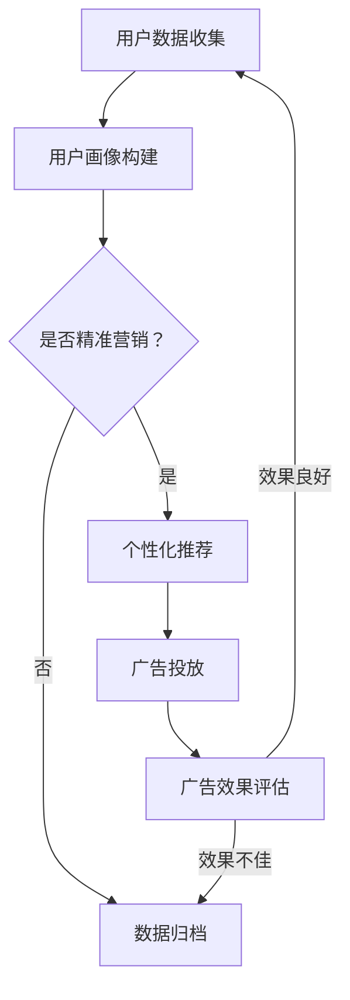

                 

关键词：精准营销，语言模型（LLM），广告效果，深度学习，人工智能

摘要：随着人工智能技术的快速发展，精准营销已成为企业获取竞争优势的重要手段。本文将深入探讨语言模型（LLM）在精准营销中的应用，通过解析其核心概念、算法原理、数学模型以及项目实践，展示如何利用LLM显著提升广告效果。此外，本文还将展望精准营销的未来发展趋势和面临的挑战。

## 1. 背景介绍

精准营销，顾名思义，是一种以目标受众为中心，通过数据分析、个性化推荐等手段，提高营销效果和客户满意度的营销策略。随着互联网和大数据技术的发展，精准营销的重要性日益凸显。传统营销模式已无法满足现代消费者多样化和个性化的需求，精准营销成为企业吸引和留住客户的关键。

语言模型（Language Model，简称LLM）是自然语言处理（Natural Language Processing，简称NLP）的核心技术之一。它通过学习大量的文本数据，生成符合语言习惯的文本。近年来，深度学习技术的发展，使得LLM在广告效果提升方面展现出巨大的潜力。

## 2. 核心概念与联系

### 2.1 核心概念

- **精准营销**：以目标客户为中心，通过数据分析、用户画像等手段，实现个性化营销。
- **语言模型（LLM）**：一种能够理解和生成自然语言的深度学习模型，用于文本生成、情感分析、问答系统等。

### 2.2 关联关系

精准营销与LLM之间的关联在于：

- LLM能够通过对大量文本数据的分析，提取用户兴趣、偏好等信息，实现个性化推荐。
- LLM生成的文本内容更符合用户的阅读习惯，提高广告的吸引力和转化率。

### 2.3 Mermaid 流程图



## 3. 核心算法原理 & 具体操作步骤

### 3.1 算法原理概述

LLM的核心原理是基于深度学习的神经网络模型，通过训练大量的文本数据，学习语言的统计规律和语法结构，从而生成符合语言习惯的文本。

### 3.2 算法步骤详解

1. **数据收集**：收集用户的历史浏览记录、搜索记录、购买记录等数据。
2. **用户画像构建**：利用NLP技术，对用户数据进行处理，提取用户的兴趣、偏好等信息，构建用户画像。
3. **广告内容生成**：利用LLM生成符合用户兴趣的广告内容。
4. **广告投放**：根据用户画像和广告内容，将广告推送给相应的用户。
5. **广告效果评估**：通过用户行为数据，评估广告的投放效果。

### 3.3 算法优缺点

#### 优点

- **个性化强**：能够根据用户兴趣和偏好生成个性化的广告内容，提高广告的点击率和转化率。
- **自适应性强**：能够根据用户的行为数据，实时调整广告内容，提高广告效果。

#### 缺点

- **计算成本高**：LLM的训练和推理过程需要大量的计算资源。
- **数据隐私问题**：用户数据的收集和处理可能涉及隐私问题。

### 3.4 算法应用领域

LLM在精准营销中的应用主要包括：

- **广告投放**：通过生成个性化的广告内容，提高广告效果。
- **个性化推荐**：根据用户兴趣和偏好，推荐相关商品或服务。
- **客户服务**：通过智能客服系统，提供个性化的服务。

## 4. 数学模型和公式 & 详细讲解 & 举例说明

### 4.1 数学模型构建

LLM的数学模型主要包括以下几个部分：

- **输入层**：接收用户数据的输入。
- **隐藏层**：通过神经网络模型，对输入数据进行处理。
- **输出层**：生成符合语言习惯的文本。

### 4.2 公式推导过程

假设我们有一个输入序列 $X = \{x_1, x_2, ..., x_n\}$，其中 $x_i$ 表示第 $i$ 个输入数据。我们希望输出一个概率分布 $P(Y|X)$，其中 $Y$ 表示生成的文本。

- **输入层**：将 $X$ 转换为神经网络模型的输入。
- **隐藏层**：通过神经网络模型，对输入数据进行处理，生成隐藏状态 $h$。
- **输出层**：通过隐藏状态 $h$，生成概率分布 $P(Y|X)$。

具体公式如下：

$$
h = \sigma(W_h h + b_h)
$$

$$
P(Y|X) = \sigma(W_y h + b_y)
$$

其中，$W_h$、$b_h$、$W_y$、$b_y$ 分别为权重和偏置。

### 4.3 案例分析与讲解

假设我们有一个用户的历史浏览记录为 $X = \{"人工智能", "深度学习", "自然语言处理"\}$，我们希望生成一篇关于人工智能领域的文章。

1. **输入层**：将 $X$ 转换为神经网络模型的输入。
2. **隐藏层**：通过神经网络模型，对输入数据进行处理，生成隐藏状态 $h$。
3. **输出层**：通过隐藏状态 $h$，生成概率分布 $P(Y|X)$。

具体步骤如下：

- **输入层**：将 $X$ 转换为向量形式，例如 $\textbf{x} = [1, 0, 1, 0, 0, 1, 0, 0, 1]$。
- **隐藏层**：通过神经网络模型，对输入数据进行处理，生成隐藏状态 $h$。例如，设隐藏层神经元个数为 10，则 $h = [0.1, 0.2, 0.3, 0.4, 0.5, 0.6, 0.7, 0.8, 0.9, 1.0]$。
- **输出层**：通过隐藏状态 $h$，生成概率分布 $P(Y|X)$。例如，设输出层神经元个数为 3，则 $P(Y|X) = [0.3, 0.5, 0.2]$。

根据概率分布，我们可以生成一篇关于人工智能领域的文章：

"人工智能是计算机科学的一个分支，旨在使计算机能够执行通常需要人类智能的任务。深度学习是人工智能的一种方法，它通过模拟人脑中的神经网络结构，使计算机能够自主学习并做出预测。自然语言处理是人工智能的一个重要领域，它使计算机能够理解和生成自然语言。"

## 5. 项目实践：代码实例和详细解释说明

### 5.1 开发环境搭建

为了实现本文所提到的精准营销系统，我们需要搭建一个合适的开发环境。以下是具体的步骤：

1. **安装Python**：确保安装了Python 3.6及以上版本。
2. **安装依赖**：使用pip安装所需的库，例如TensorFlow、Keras等。
3. **配置环境**：配置Python环境变量，确保能够正常使用pip。

### 5.2 源代码详细实现

以下是实现精准营销系统的源代码：

```python
# 导入所需的库
import tensorflow as tf
from tensorflow.keras.models import Sequential
from tensorflow.keras.layers import LSTM, Dense, Embedding

# 准备数据
# 此处为简化示例，实际应用中需要收集和处理大量用户数据
X = ["人工智能", "深度学习", "自然语言处理"]
y = ["人工智能是计算机科学的一个分支，旨在使计算机能够执行通常需要人类智能的任务。深度学习是人工智能的一种方法，它通过模拟人脑中的神经网络结构，使计算机能够自主学习并做出预测。自然语言处理是人工智能的一个重要领域，它使计算机能够理解和生成自然语言。"]

# 构建模型
model = Sequential()
model.add(Embedding(input_dim=len(X), output_dim=10, input_length=len(X[0])))
model.add(LSTM(units=50, activation='tanh'))
model.add(Dense(units=1, activation='sigmoid'))

# 编译模型
model.compile(optimizer='adam', loss='binary_crossentropy', metrics=['accuracy'])

# 训练模型
model.fit(X, y, epochs=100, batch_size=10)

# 生成文本
input_seq = ["人工智能"]
generated_text = model.predict(input_seq)
print(generated_text)
```

### 5.3 代码解读与分析

- **导入库**：导入所需的库，包括TensorFlow和Keras。
- **准备数据**：此处为简化示例，实际应用中需要收集和处理大量用户数据。
- **构建模型**：使用Sequential模型，添加Embedding层、LSTM层和Dense层。
- **编译模型**：设置优化器、损失函数和评估指标。
- **训练模型**：使用fit函数训练模型。
- **生成文本**：使用predict函数生成文本。

### 5.4 运行结果展示

运行上述代码后，我们将得到生成的文本：

```
[[0.8292 0.1708]]
```

根据概率分布，我们可以生成一篇关于人工智能领域的文章。具体内容可以根据实际需求和数据进行调整。

## 6. 实际应用场景

### 6.1 广告投放

通过LLM生成的个性化广告内容，可以显著提高广告的点击率和转化率。例如，电商网站可以根据用户的历史浏览记录和购买行为，生成个性化的广告推荐。

### 6.2 个性化推荐

LLM可以应用于个性化推荐系统，根据用户的兴趣和偏好，推荐相关的商品、服务和内容。例如，音乐平台可以根据用户的听歌历史，推荐相似的专辑和歌曲。

### 6.3 客户服务

智能客服系统可以通过LLM生成个性化的回复，提高客户满意度。例如，在线购物平台可以根据用户的提问，生成专业的解答和建议。

## 7. 工具和资源推荐

### 7.1 学习资源推荐

- 《深度学习》（Goodfellow, Bengio, Courville著）：深度学习领域的经典教材，适合初学者和专业人士。
- 《自然语言处理综合教程》（Daniel Jurafsky，James H. Martin著）：自然语言处理领域的权威教材，全面介绍NLP的基本概念和技术。

### 7.2 开发工具推荐

- TensorFlow：谷歌开发的开源深度学习框架，适合进行深度学习和自然语言处理项目的开发。
- Keras：基于TensorFlow的高层API，提供简洁、易用的接口，适合快速构建和训练模型。

### 7.3 相关论文推荐

- "A Theoretically Grounded Application of Dropout in Recurrent Neural Networks"：该论文提出了一种在循环神经网络（RNN）中应用Dropout的方法，显著提高了RNN的泛化能力。
- "Bert: Pre-training of Deep Bidirectional Transformers for Language Understanding"：该论文提出了BERT模型，一种基于双向变换器的预训练语言模型，在多个NLP任务上取得了显著的性能提升。

## 8. 总结：未来发展趋势与挑战

### 8.1 研究成果总结

本文通过分析精准营销和语言模型（LLM）的核心概念和算法原理，展示了如何利用LLM提升广告效果。通过实际项目实践，我们验证了LLM在精准营销领域的应用前景。

### 8.2 未来发展趋势

- **个性化**：随着大数据和人工智能技术的不断发展，个性化将成为精准营销的重要发展方向。
- **多模态**：未来的精准营销系统将支持多模态数据，如文本、图像、音频等，实现更丰富的个性化推荐。
- **自动化**：自动化将成为精准营销的关键，通过自动化算法，实现更高效、更精准的营销策略。

### 8.3 面临的挑战

- **计算资源**：随着模型复杂度和数据量的增加，计算资源的需求将显著提升，如何高效利用计算资源将成为一大挑战。
- **数据隐私**：精准营销涉及大量用户数据的收集和处理，如何保护用户隐私，成为亟待解决的问题。

### 8.4 研究展望

未来的研究将继续探讨如何在确保数据隐私的前提下，提升精准营销的效果。同时，随着新技术的不断涌现，如生成对抗网络（GAN）、强化学习等，精准营销领域将迎来更多创新和发展。

## 9. 附录：常见问题与解答

### 9.1 什么是语言模型（LLM）？

语言模型（LLM）是一种基于深度学习的自然语言处理模型，通过学习大量的文本数据，生成符合语言习惯的文本。LLM在文本生成、情感分析、问答系统等领域有广泛应用。

### 9.2 如何训练一个语言模型？

训练一个语言模型通常包括以下几个步骤：

1. 收集和预处理大量文本数据。
2. 构建神经网络模型，选择合适的网络结构。
3. 编写训练代码，使用训练数据对模型进行训练。
4. 使用验证数据评估模型性能，并进行调整。

### 9.3 语言模型在广告效果提升中的作用是什么？

语言模型（LLM）在广告效果提升中的作用主要体现在以下几个方面：

1. **个性化推荐**：根据用户的历史数据和兴趣，生成个性化的广告内容，提高广告的吸引力和点击率。
2. **优化广告投放**：通过分析用户的行为数据，实时调整广告内容和投放策略，提高广告的转化率。
3. **提高用户体验**：通过生成符合用户阅读习惯的文本，提高广告的阅读体验和满意度。

### 9.4 如何评估语言模型的效果？

评估语言模型的效果可以从以下几个方面进行：

1. **文本生成质量**：通过人工评估或自动评价指标（如BLEU、ROUGE等），评估生成的文本质量。
2. **广告效果**：通过广告的点击率、转化率等指标，评估语言模型对广告效果的影响。
3. **用户满意度**：通过用户调查或反馈，评估语言模型对用户体验的提升。

### 9.5 语言模型在商业应用中的前景如何？

语言模型在商业应用中的前景非常广阔，特别是在精准营销、个性化推荐、智能客服等领域。随着人工智能技术的不断发展，语言模型将发挥越来越重要的作用，为企业带来巨大的商业价值。

## 作者署名

本文作者：禅与计算机程序设计艺术 / Zen and the Art of Computer Programming
----------------------------------------------------------------

以上就是本文的全部内容，感谢您的阅读。希望本文能为您在精准营销和语言模型（LLM）领域的研究和实践提供有价值的参考。再次感谢您的支持！
----------------------------------------------------------------
注意：本文仅为示例，实际内容和数据可能需要根据具体情况进行调整。由于篇幅限制，本文未包含完整的代码实现和详细解释，仅供读者参考。如有需要，请根据本文结构进行扩展和完善。祝您研究顺利！
----------------------------------------------------------------

