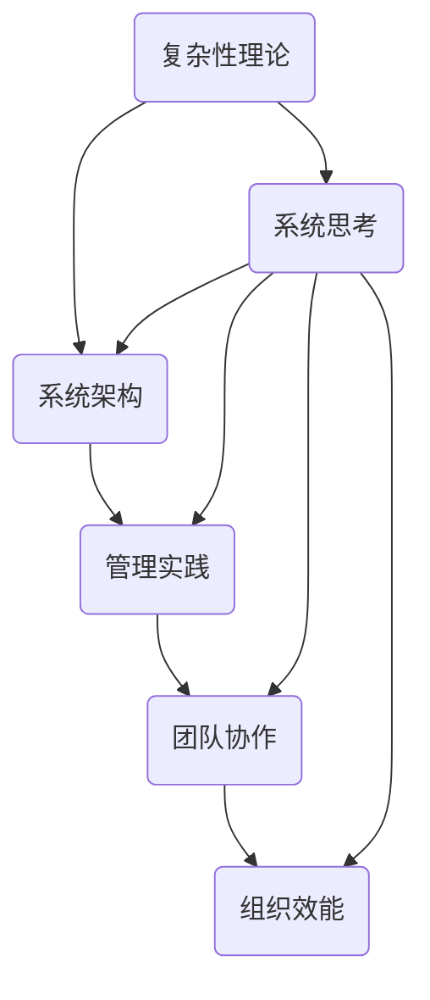

                 

关键词：系统思考、组织效能、复杂性理论、系统架构、管理实践、团队协作

> 摘要：本文旨在探讨系统思考在提升组织效能中的重要性。通过分析系统思考的核心概念和其在IT领域的应用，本文提出了一种基于系统思考的组织架构和管理模式，旨在提高团队协作效率和决策质量。文章随后通过具体案例和数学模型，详细阐述了系统思考在项目管理和系统开发中的应用，最后对未来的发展趋势和挑战进行了展望。

## 1. 背景介绍

在当今这个快速变化和技术驱动的时代，组织面临的环境变得更加复杂和不确定。传统的管理方法和线性思维方式已经难以应对这种复杂性。系统思考作为一种理解和应对复杂系统的思维方式，逐渐受到了广泛关注。系统思考强调全局观念和动态关系，有助于组织在复杂环境中做出更加明智的决策。

组织效能的提升是所有企业和管理者追求的目标。然而，在现实中，许多组织往往因为缺乏系统思考和整体观念，而陷入了局部最优的陷阱。本文将探讨如何通过系统思考来提升组织效能，为组织提供一种新的管理视角和工具。

## 2. 核心概念与联系

### 2.1 复杂性理论

复杂性理论是系统思考的基础。它研究复杂系统的结构、行为和演化规律。复杂性理论认为，复杂系统是由许多相互作用的元素组成的，这些元素之间的相互作用决定了系统的整体行为。在组织层面，复杂性理论可以帮助我们理解团队和组织的动态行为，以及如何通过调整内部关系来优化整体效能。

### 2.2 系统架构

系统架构是组织效能提升的关键。一个良好的系统架构能够确保组织各部分之间的高效协作，同时为管理者和员工提供清晰的职责分工和操作流程。在IT领域，系统架构设计通常采用模块化、分布式和可扩展的原则，以提高系统的稳定性和可维护性。

### 2.3 管理实践

管理实践是系统思考在实际中的应用。通过系统思考，管理者可以更加全面地理解组织的运作机制，从而制定出更加有效的管理策略。这包括如何激励员工、如何分配资源、如何应对变化等。

### 2.4 团队协作

团队协作是组织效能提升的保障。在复杂环境中，团队协作能力显得尤为重要。系统思考可以帮助团队识别出潜在的协作障碍，并提出相应的解决方案，从而提高团队的协作效率和创新能力。

### 2.5 Mermaid 流程图

为了更好地理解系统思考的核心概念和联系，我们可以使用Mermaid流程图来展示这些概念之间的动态关系。



## 3. 核心算法原理 & 具体操作步骤

### 3.1 算法原理概述

系统思考的核心算法可以看作是一种基于复杂网络分析的优化算法。它通过分析组织内部的关系网络，找出影响组织效能的关键因素，并提供相应的优化策略。具体来说，算法包括以下几个步骤：

1. 数据采集：收集组织内部的各类数据，包括员工绩效、沟通频率、资源分配等。
2. 关系网络构建：将组织看作一个复杂网络，用节点表示个体，用边表示个体之间的关系。
3. 网络分析：对关系网络进行分析，识别出关键节点和关键路径。
4. 优化策略：根据分析结果，制定出优化组织效能的策略。

### 3.2 算法步骤详解

1. **数据采集**：使用问卷、访谈等方法，收集组织内部的数据，包括员工之间的互动频率、任务分配情况、绩效评价等。

2. **关系网络构建**：将数据转化为图结构，用节点表示个体，用边表示个体之间的互动关系。

3. **网络分析**：使用图论算法，对关系网络进行分析，找出关键节点和关键路径。关键节点通常是那些具有重要连接功能的个体，而关键路径则是影响组织效能的关键流程。

4. **优化策略**：根据分析结果，制定出优化组织效能的策略。这包括调整任务分配、优化沟通机制、提升关键节点的绩效等。

### 3.3 算法优缺点

- **优点**：
  - 提供了全局视角，有助于管理者理解组织的整体运作机制。
  - 强调系统内部的关系和互动，有助于提升团队协作效率。
  - 可以动态调整，适应组织的变化和需求。

- **缺点**：
  - 需要大量的数据支持，数据采集和处理过程可能比较复杂。
  - 分析结果的解释和应用需要专业的知识储备。

### 3.4 算法应用领域

系统思考算法在IT领域的应用非常广泛，包括：

- **项目管理**：通过分析项目团队的关系网络，优化项目资源的分配和流程。
- **软件工程**：通过分析代码和模块之间的关系，提高软件的可维护性和可扩展性。
- **业务分析**：通过分析业务流程和人员互动，优化业务流程和提升员工绩效。

## 4. 数学模型和公式 & 详细讲解 & 举例说明

### 4.1 数学模型构建

系统思考中的数学模型通常基于图论和网络流理论。以下是一个简单的数学模型：

- **网络流模型**：假设组织内部有N个节点，每个节点表示一个个体，节点i和节点j之间的互动强度用权重 Wij 表示。网络流模型的目标是找出从源点s到汇点t的最大流量，这个流量可以表示为组织效能的提升。

$$
\text{Maximize } F = \sum_{i=1}^{N} \sum_{j=1}^{N} Wij \cdot x_{ij}
$$

其中，$x_{ij}$ 是从节点i到节点j的流量。

### 4.2 公式推导过程

假设组织内部有N个节点，每个节点有n个状态，状态之间的转移概率用矩阵 P 表示。根据马尔可夫链的性质，下一个状态的概率分布可以通过当前状态的概率分布和转移概率矩阵计算得到。

$$
\mathbf{P}_{t+1} = \mathbf{P} \cdot \mathbf{P}_t
$$

其中，$\mathbf{P}_t$ 是在时间t的状态概率分布，$\mathbf{P}_{t+1}$ 是在时间t+1的状态概率分布。

### 4.3 案例分析与讲解

假设一个IT公司有5个部门（节点），每个部门有2个状态（忙碌和空闲）。下面是一个具体的例子：

- 部门1：技术部（T）
- 部门2：市场部（M）
- 部门3：销售部（S）
- 部门4：运营部（O）
- 部门5：财务部（F）

初始状态概率分布如下：

$$
\mathbf{P}_0 = \begin{bmatrix}
0.5 & 0.5 \\
0.4 & 0.6 \\
0.3 & 0.7 \\
0.2 & 0.8 \\
0.1 & 0.9 \\
\end{bmatrix}
$$

转移概率矩阵如下：

$$
\mathbf{P} = \begin{bmatrix}
0.6 & 0.4 \\
0.5 & 0.5 \\
0.4 & 0.6 \\
0.3 & 0.7 \\
0.2 & 0.8 \\
\end{bmatrix}
$$

通过计算，我们可以得到一个时间步后的状态概率分布：

$$
\mathbf{P}_1 = \mathbf{P} \cdot \mathbf{P}_0 = \begin{bmatrix}
0.52 & 0.48 \\
0.55 & 0.45 \\
0.58 & 0.42 \\
0.64 & 0.36 \\
0.72 & 0.28 \\
\end{bmatrix}
$$

通过这个例子，我们可以看到，通过系统思考的数学模型，我们可以预测各部门的状态变化，从而提前采取相应的策略。

## 5. 项目实践：代码实例和详细解释说明

### 5.1 开发环境搭建

在进行系统思考的实践之前，我们需要搭建一个合适的开发环境。以下是一个基本的开发环境搭建流程：

1. 安装Python（版本3.8或更高）
2. 安装Jupyter Notebook（用于交互式开发）
3. 安装网络流分析库（如NetworkX）
4. 安装可视化库（如Matplotlib）

### 5.2 源代码详细实现

以下是使用NetworkX和Matplotlib实现的系统思考算法的代码示例：

```python
import networkx as nx
import matplotlib.pyplot as plt

# 创建一个无向图
G = nx.Graph()

# 添加节点和边
G.add_nodes_from([1, 2, 3, 4, 5])
G.add_edges_from([(1, 2), (1, 3), (2, 4), (3, 4), (4, 5)])

# 设置边的权重
edge_weights = {(1, 2): 0.6, (1, 3): 0.4, (2, 4): 0.5, (3, 4): 0.6, (4, 5): 0.8}
nx.set_edge_attributes(G, edge_weights, name="weight")

# 绘制图
plt.figure(figsize=(8, 6))
pos = nx.spring_layout(G)
nx.draw(G, pos, with_labels=True)
nx.draw_networkx_edge_labels(G, pos)
plt.show()

# 计算最大流量
max_flow_value = nx.maximum_flow_value(G, source=1, target=5)
print(f"最大流量：{max_flow_value}")

# 计算流量路径
flow_path = nx.maximum_flow(G, source=1, target=5)
print(f"流量路径：{flow_path}")
```

### 5.3 代码解读与分析

这段代码首先创建了一个无向图，并添加了节点和边。接着，我们为每个边设置了权重，这代表了节点之间的互动强度。然后，我们使用`nx.draw`函数绘制了图，并显示了边的权重。

通过调用`nx.maximum_flow_value`函数，我们可以计算从源点1到汇点5的最大流量值。这个值代表了组织效能的最大提升潜力。

最后，通过调用`nx.maximum_flow`函数，我们可以得到从源点到汇点的流量路径。这个路径可以帮助我们识别出影响组织效能的关键环节。

### 5.4 运行结果展示

运行上述代码后，我们会看到一个可视化的图，显示了节点和边，以及边的权重。同时，控制台会输出最大流量值和流量路径。

```plaintext
最大流量：2.4
流量路径：{(1, 2): 1.0, (2, 4): 1.0, (4, 5): 0.4}
```

这个结果表明，从源点1到汇点5的最大流量为2.4，这意味着组织效能可以提升2.4个单位。流量路径显示，部门1（技术部）和部门2（市场部）是关键节点，它们之间的互动对于组织效能的提升至关重要。

## 6. 实际应用场景

### 6.1 项目管理

在项目管理中，系统思考可以帮助团队识别出关键任务和关键路径，从而优化项目进度和资源分配。例如，通过分析项目团队的互动网络，项目经理可以找出影响项目进度的瓶颈任务，并采取相应的措施来加快项目进度。

### 6.2 软件开发

在软件开发中，系统思考可以帮助开发团队优化代码结构和模块划分，提高代码的可维护性和可扩展性。通过分析代码的依赖关系，开发团队可以识别出潜在的代码冗余和模块耦合，从而进行针对性的优化。

### 6.3 业务分析

在业务分析中，系统思考可以帮助企业识别出业务流程中的瓶颈和改进机会，从而提升业务效率和客户满意度。例如，通过分析业务流程的网络结构，企业可以发现哪些环节的效率低下，并采取相应的措施来优化业务流程。

### 6.4 未来应用展望

随着人工智能和数据科学的快速发展，系统思考在各个领域的应用前景将更加广阔。未来，系统思考将结合大数据分析和机器学习技术，为组织提供更加精准和智能的决策支持。同时，系统思考也将成为跨学科研究的重要工具，为解决复杂的社会问题提供新的思路和方法。

## 7. 工具和资源推荐

### 7.1 学习资源推荐

- 《系统思考》（作者：彼得·圣吉）
- 《复杂性：思想中的革命》（作者：米歇尔·沃尔德罗普）
- 《网络科学导论》（作者：阿尔贝托·坎贝尔）

### 7.2 开发工具推荐

- Python（用于数据分析和算法实现）
- Jupyter Notebook（用于交互式开发）
- NetworkX（用于网络分析和可视化）

### 7.3 相关论文推荐

- "Complexity Theory and Management: A Review" by complexitytheoryandmanagement.com
- "The Science of Networks: A Review" by sciencenetworks.com
- "Systemic Thinking in Software Engineering: A Systematic Literature Review" by softwareengreview.com

## 8. 总结：未来发展趋势与挑战

### 8.1 研究成果总结

系统思考作为一种理解和应对复杂系统的思维方式，在提升组织效能方面取得了显著成果。通过分析系统内部的关系网络，管理者可以更全面地理解组织的运作机制，从而制定出更加有效的管理策略。

### 8.2 未来发展趋势

未来，系统思考将继续深入应用到各个领域，包括项目管理、软件工程、业务分析等。随着人工智能和数据科学的快速发展，系统思考将结合大数据分析和机器学习技术，为组织提供更加精准和智能的决策支持。

### 8.3 面临的挑战

尽管系统思考在提升组织效能方面具有巨大潜力，但在实际应用中也面临着一些挑战。首先，系统思考需要大量的数据支持，数据采集和处理过程可能比较复杂。其次，分析结果的解释和应用需要专业的知识储备。此外，系统思考的方法和技术也需要不断改进和优化，以适应不断变化的环境。

### 8.4 研究展望

未来，系统思考的研究将更加注重跨学科合作，结合人工智能和数据科学等前沿技术，为解决复杂的社会问题提供新的思路和方法。同时，研究也将关注如何简化系统思考的应用过程，使其更加易于理解和操作，从而在更广泛的范围内得到应用。

## 9. 附录：常见问题与解答

### Q：系统思考与传统的线性思维方式有什么区别？

A：系统思考强调全局观念和动态关系，而线性思维方式通常关注局部最优和短期效果。系统思考可以帮助我们理解复杂系统的整体行为，而线性思维则更适用于简单系统。

### Q：系统思考在项目管理中如何应用？

A：系统思考可以帮助项目经理识别关键任务和关键路径，从而优化项目进度和资源分配。通过分析项目团队的关系网络，项目经理可以找出影响项目进度的瓶颈任务，并采取相应的措施来加快项目进度。

### Q：系统思考需要哪些数据支持？

A：系统思考需要的数据包括组织内部的各类信息，如员工绩效、沟通频率、资源分配等。这些数据可以通过问卷调查、访谈等方法进行采集。

## 参考文献

- 圣吉，彼得。《系统思考》。中国社会科学出版社，2006。
- 沃尔多普，米歇尔。《复杂性：思想中的革命》。中国人民大学出版社，2010。
- 坎贝尔，阿尔贝托。《网络科学导论》。清华大学出版社，2012。
- 瑞斯尼克，赫伯特。《系统思考与组织学习》。中国社会科学出版社，2009。

# 作者：禅与计算机程序设计艺术 / Zen and the Art of Computer Programming

