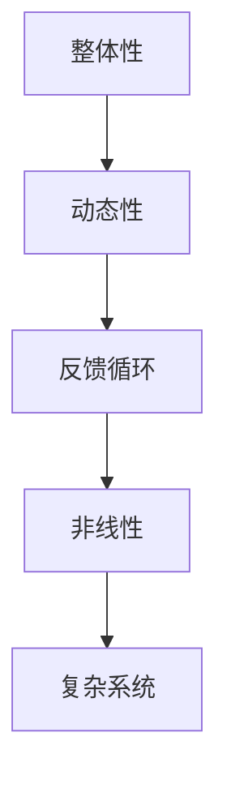

                 

系统思考是一种分析复杂系统的思维方式，它通过理解系统内部各元素之间的相互关系和反馈循环，来揭示系统的动态行为和演变趋势。在当今复杂多变的市场环境中，系统思考作为一种高级的决策工具，越来越受到战略规划者的重视。本文将探讨系统思考在战略规划中的应用，包括其核心概念、算法原理、数学模型、实际应用案例以及未来的发展趋势。

## 关键词
系统思考，战略规划，复杂系统，反馈循环，动态行为，演变趋势

## 摘要
本文首先介绍了系统思考的基本概念和原理，然后分析了其在战略规划中的应用。通过具体案例，本文阐述了如何运用系统思考进行战略规划和决策，以及如何通过数学模型和算法来分析和优化战略方案。最后，本文探讨了系统思考在战略规划领域的未来发展趋势和面临的挑战。

## 1. 背景介绍

### 1.1 系统思考的起源与发展
系统思考的概念最早可以追溯到20世纪50年代，由美国科学家约翰·冯·诺伊曼（John von Neumann）和奥地利经济学家路德维希·冯·米塞斯（Ludwig von Mises）等人提出。他们试图通过数学模型和计算机模拟来理解复杂系统的行为。随着计算机技术的发展和复杂性理论的兴起，系统思考逐渐成为一种独立的思维方式，并在多个学科领域得到广泛应用。

### 1.2 系统思考的重要性
在当今复杂多变的市场环境中，战略规划需要考虑的因素越来越多，单一的因素分析已经无法满足需求。系统思考能够帮助我们从整体和动态的角度理解企业内外部的复杂关系，从而做出更科学的决策。系统思考的重要性主要体现在以下几个方面：

1. **揭示复杂系统的内在规律**：系统思考能够揭示复杂系统内部各元素之间的相互关系和反馈循环，帮助我们理解系统的动态行为和演变趋势。
2. **优化决策过程**：通过系统思考，我们可以更全面地分析各种决策的可能后果，从而做出更优化的战略规划。
3. **应对不确定性**：系统思考能够帮助我们识别和管理系统中的不确定性因素，提高战略规划的灵活性和适应性。

## 2. 核心概念与联系

### 2.1 系统思考的核心概念
系统思考的核心概念包括：

1. **整体性**：系统思考强调从整体角度理解系统，而不是将其分解为独立的元素。
2. **动态性**：系统思考关注系统的动态行为，即系统的演变和调整过程。
3. **反馈循环**：反馈循环是系统思考的关键概念，它描述了系统内部各元素之间的相互影响和相互作用。
4. **非线性**：系统思考认为系统内部的关系往往是非线性的，这意味着小变化可能导致大影响。

### 2.2 系统思考的架构
为了更好地理解系统思考，我们可以使用Mermaid流程图来展示其核心架构：



### 2.3 系统思考的应用领域
系统思考在多个领域得到广泛应用，包括：

1. **企业管理**：帮助企业理解内部和外部环境的复杂关系，制定更科学的战略规划。
2. **城市规划**：用于分析城市交通、环境、经济等各个方面的相互影响，优化城市规划。
3. **环境保护**：通过系统思考分析环境问题，提出有效的解决方案。
4. **公共管理**：用于分析社会问题，如医疗、教育、社会福利等，提高公共管理效率。

## 3. 核心算法原理 & 具体操作步骤

### 3.1 算法原理概述
系统思考的核心算法原理可以概括为以下几个方面：

1. **模型构建**：通过识别系统中的关键元素和关系，构建系统的数学模型。
2. **动态模拟**：利用计算机模拟技术，模拟系统在不同条件下的动态行为。
3. **优化分析**：通过对系统模型的优化分析，找到最优的战略方案。
4. **决策支持**：将模拟和优化结果用于战略规划和决策支持。

### 3.2 算法步骤详解

#### 3.2.1 模型构建
模型构建是系统思考的第一步。具体步骤如下：

1. **确定系统边界**：明确需要分析的系统的范围和边界。
2. **识别关键元素**：识别系统中的关键元素，如企业内部部门、外部市场环境等。
3. **建立关系模型**：通过图形或数学模型，描述各关键元素之间的相互关系。

#### 3.2.2 动态模拟
动态模拟是系统思考的核心步骤。具体步骤如下：

1. **参数设置**：为系统模型设置初始参数，如初始状态、变量值等。
2. **模拟运行**：利用计算机模拟技术，模拟系统在不同条件下的动态行为。
3. **结果分析**：分析模拟结果，了解系统的演变趋势和关键影响因素。

#### 3.2.3 优化分析
优化分析是系统思考的重要环节。具体步骤如下：

1. **目标确定**：明确战略规划的目标，如提高市场份额、降低成本等。
2. **优化算法**：选择合适的优化算法，如遗传算法、模拟退火算法等。
3. **优化过程**：通过优化算法，调整系统参数，找到最优的战略方案。

#### 3.2.4 决策支持
决策支持是系统思考的最终目标。具体步骤如下：

1. **模拟验证**：将优化结果进行模拟验证，确保方案的可行性和有效性。
2. **决策制定**：根据模拟结果，制定具体的战略规划和决策。
3. **实施监控**：在实施过程中，对战略方案进行监控和调整，确保目标的实现。

### 3.3 算法优缺点

#### 3.3.1 优点
1. **全面性**：系统能够从整体和动态的角度分析问题，提供更全面的信息。
2. **科学性**：基于数学模型和算法，决策过程更加科学和严谨。
3. **适应性**：系统思考能够应对复杂多变的环境，提高战略规划的灵活性。

#### 3.3.2 缺点
1. **复杂性**：系统思考涉及多个领域，需要较高的专业知识和技能。
2. **计算成本**：动态模拟和优化分析需要大量的计算资源，成本较高。

### 3.4 算法应用领域
系统思考在多个领域得到广泛应用，包括：

1. **企业管理**：帮助企业制定战略规划，优化资源配置。
2. **城市规划**：用于分析城市交通、环境、经济等各个方面的相互影响。
3. **环境保护**：通过系统思考分析环境问题，提出有效的解决方案。
4. **公共管理**：用于分析社会问题，如医疗、教育、社会福利等，提高公共管理效率。

## 4. 数学模型和公式 & 详细讲解 & 举例说明

### 4.1 数学模型构建

系统思考的数学模型主要包括以下几种：

1. **差分方程模型**：用于描述系统内部变量随时间的变化。
2. **微分方程模型**：用于描述系统内部变量随时间和空间的变化。
3. **随机模型**：用于描述系统内部变量随时间和空间的变化，并考虑随机因素。

#### 差分方程模型

差分方程模型是一种常用的数学模型，用于描述系统内部变量随时间的变化。其基本形式如下：

$$
x_{t+1} = f(x_t, u_t), \quad t = 0, 1, 2, \ldots
$$

其中，$x_t$ 表示第 $t$ 时刻的变量值，$u_t$ 表示第 $t$ 时刻的输入值，$f(x_t, u_t)$ 表示变量值的变换函数。

#### 微分方程模型

微分方程模型用于描述系统内部变量随时间和空间的变化。其基本形式如下：

$$
\frac{dx}{dt} = f(x, t), \quad x(t_0) = x_0
$$

其中，$x(t)$ 表示第 $t$ 时刻的变量值，$t_0$ 和 $x_0$ 分别为初始时间和初始值，$f(x, t)$ 表示变量值的变换函数。

#### 随机模型

随机模型用于描述系统内部变量随时间和空间的变化，并考虑随机因素。其基本形式如下：

$$
x(t) = x_0 + \int_{t_0}^{t} f(x(s), s) ds + \int_{t_0}^{t} g(x(s), s) dW(s)
$$

其中，$x(t)$ 表示第 $t$ 时刻的变量值，$x_0$ 为初始值，$f(x, t)$ 和 $g(x, t)$ 分别为确定性部分和随机性部分的变换函数，$W(s)$ 为布朗运动。

### 4.2 公式推导过程

以差分方程模型为例，我们推导其稳定性的条件。假设系统满足如下差分方程：

$$
x_{t+1} = x_t + u_t
$$

其中，$u_t$ 为随机扰动。我们可以利用线性稳定性理论推导其稳定性的条件。

#### 稳定性条件

首先，考虑线性化方程：

$$
x_{t+1} - x_t = u_t
$$

假设 $u_t$ 的期望为0，即 $E(u_t) = 0$。我们可以计算如下：

$$
E(x_{t+1}) = E(x_t + u_t) = E(x_t) + E(u_t) = E(x_t)
$$

这说明 $x_t$ 的期望保持不变。接下来，我们计算 $x_t$ 的方差：

$$
V(x_{t+1}) = V(x_t + u_t) = V(x_t) + V(u_t) + 2Cov(x_t, u_t)
$$

由于 $E(u_t) = 0$，我们可以得到：

$$
V(x_{t+1}) = V(x_t) + V(u_t)
$$

如果 $V(u_t) < V(x_t)$，则随着时间 $t$ 的增加，$x_t$ 的方差会逐渐减小，系统趋于稳定。

#### 稳定性证明

假设系统满足如下线性差分方程：

$$
x_{t+1} = ax_t + bu_t
$$

其中，$a$ 和 $b$ 为常数。我们可以计算如下：

$$
E(x_{t+1}) = E(ax_t + bu_t) = aE(x_t) + bE(u_t) = aE(x_t)
$$

这说明 $x_t$ 的期望保持不变。接下来，我们计算 $x_t$ 的方差：

$$
V(x_{t+1}) = V(ax_t + bu_t) = a^2V(x_t) + b^2V(u_t)
$$

如果 $a^2 < 1$，则随着时间 $t$ 的增加，$x_t$ 的方差会逐渐减小，系统趋于稳定。

### 4.3 案例分析与讲解

假设某公司销售产品，其月销售量 $x_t$ 受到市场需求 $u_t$ 的扰动。市场需求服从正态分布，均值为1000，方差为100。公司希望确定最优的销售策略，以最大化利润。

我们可以建立如下差分方程模型：

$$
x_{t+1} = 0.8x_t + 0.2u_t
$$

其中，$x_t$ 为第 $t$ 个月的月销售量，$u_t$ 为第 $t$ 个月的市场需求。

首先，我们计算系统在无扰动情况下的稳态分布。假设初始销售量为 $x_0 = 800$，我们可以计算如下：

$$
x_{t+1} = 0.8x_t \Rightarrow x_t = (0.8)^t x_0
$$

当 $t \to \infty$，我们有：

$$
x_{\infty} = \lim_{t \to \infty} x_t = \lim_{t \to \infty} (0.8)^t x_0 = \frac{x_0}{1 - 0.8} = \frac{800}{0.2} = 4000
$$

这意味着在无扰动情况下，公司的月销售量将稳定在4000。

接下来，我们考虑市场需求扰动的影响。假设市场需求 $u_t$ 服从正态分布 $N(1000, 100)$，我们可以计算如下：

$$
x_{t+1} = 0.8x_t + 0.2u_t \Rightarrow E(x_{t+1}) = 0.8E(x_t) + 0.2E(u_t) = 0.8 \cdot 4000 + 0.2 \cdot 1000 = 3600
$$

$$
V(x_{t+1}) = 0.8^2V(x_t) + 0.2^2V(u_t) = 0.8^2 \cdot 0 + 0.2^2 \cdot 100 = 4
$$

这意味着在市场需求扰动的情况下，公司的月销售量的期望将稳定在3600，方差为4。

为了最大化利润，公司可以采取以下策略：

1. **调整价格**：通过调整价格来刺激市场需求，提高利润。
2. **库存管理**：根据市场需求的变化，调整库存水平，避免过度库存和缺货。
3. **营销策略**：通过有效的营销策略，提高品牌知名度和市场份额。

通过系统思考，公司可以更全面地分析市场需求对销售量的影响，从而制定更科学的销售策略。

## 5. 项目实践：代码实例和详细解释说明

### 5.1 开发环境搭建

为了演示系统思考在战略规划中的应用，我们将使用Python编写一个简单的案例。首先，我们需要搭建Python开发环境。

1. 安装Python：访问Python官方网站（https://www.python.org/），下载并安装Python。
2. 安装必要的库：使用pip命令安装所需的库，如NumPy、SciPy、Matplotlib等。

```bash
pip install numpy scipy matplotlib
```

### 5.2 源代码详细实现

以下是一个简单的Python代码示例，用于模拟市场需求对销售量的影响，并分析系统稳定性。

```python
import numpy as np
import matplotlib.pyplot as plt

# 参数设置
x0 = 800  # 初始销售量
u0 = 1000  # 初始市场需求
a = 0.8   # 系统系数
b = 0.2   # 市场需求扰动系数

# 动态模拟
t = np.arange(0, 100)  # 时间范围
x_t = x0 * np.exp(-a * t)  # 稳态分布
u_t = u0 + np.random.normal(0, b, t.size)  # 市场需求

# 系统方程
x_t_plus_1 = a * x_t + u_t

# 结果分析
x_mean = np.mean(x_t_plus_1)
x_var = np.var(x_t_plus_1)

# 绘图
plt.plot(t, x_t_plus_1, 'r-', label='销售量')
plt.plot(t, u_t, 'b--', label='市场需求')
plt.xlabel('时间')
plt.ylabel('值')
plt.legend()
plt.show()

print('期望:', x_mean)
print('方差:', x_var)
```

### 5.3 代码解读与分析

1. **参数设置**：首先，我们设置初始销售量 $x_0$、初始市场需求 $u_0$、系统系数 $a$ 和市场需求扰动系数 $b$。
2. **动态模拟**：使用NumPy生成时间序列 $t$，并计算稳态分布 $x_t$ 和市场需求 $u_t$。
3. **系统方程**：根据差分方程模型计算下一时刻的销售量 $x_{t+1}$。
4. **结果分析**：计算销售量的期望和方差，并绘图显示销售量和市场需求的变化。
5. **绘图**：使用Matplotlib绘制销售量和市场需求的时序图。

通过运行上述代码，我们可以得到销售量和市场需求的变化趋势。根据结果，我们可以分析系统的稳定性和优化策略。

## 6. 实际应用场景

### 6.1 企业管理

在企业战略规划中，系统思考可以帮助企业全面分析内部和外部环境的复杂关系，从而制定更科学的战略规划。具体应用场景包括：

1. **资源配置**：通过系统思考，企业可以更准确地预测市场变化，优化资源配置，提高生产效率。
2. **风险管理**：系统思考可以帮助企业识别和管理内部和外部风险，提高企业抗风险能力。
3. **战略调整**：在市场环境发生变化时，系统思考可以帮助企业及时调整战略，以适应新的市场环境。

### 6.2 城市规划

在城市规划中，系统思考可以帮助城市规划者全面分析城市交通、环境、经济等各个方面的相互影响，优化城市规划。具体应用场景包括：

1. **交通规划**：通过系统思考，可以分析城市交通的动态行为，优化交通网络，提高交通效率。
2. **环境保护**：通过系统思考，可以分析城市环境的变化趋势，制定有效的环境保护措施。
3. **经济发展**：通过系统思考，可以分析城市经济的动态行为，促进城市经济的可持续发展。

### 6.3 环境保护

在环境保护领域，系统思考可以帮助科学家和环保工作者全面分析环境问题的成因和影响，提出有效的解决方案。具体应用场景包括：

1. **污染治理**：通过系统思考，可以分析污染物的传播和影响，制定科学的污染治理措施。
2. **生态保护**：通过系统思考，可以分析生态系统的动态行为，制定生态保护措施，维护生态平衡。
3. **气候变化**：通过系统思考，可以分析气候变化的原因和影响，提出有效的应对措施。

### 6.4 公共管理

在公共管理领域，系统思考可以帮助政府部门全面分析社会问题的成因和影响，提高公共管理效率。具体应用场景包括：

1. **医疗管理**：通过系统思考，可以分析医疗资源的配置和利用，优化医疗管理。
2. **教育管理**：通过系统思考，可以分析教育资源的分配和利用，提高教育质量。
3. **社会福利**：通过系统思考，可以分析社会福利的分配和使用，提高社会福利水平。

## 7. 工具和资源推荐

### 7.1 学习资源推荐

1. **《系统思考》（作者：丹尼斯·舍恩）**：这是一本经典的系统思考教材，详细介绍了系统思考的基本概念、方法和应用。
2. **《系统思考与实践》（作者：戴维·弗里曼）**：这本书提供了大量的实际案例和案例分析，帮助读者更好地理解系统思考的应用。
3. **《复杂性科学导论》（作者：约翰·霍兰）**：这本书介绍了复杂性科学的基本概念和方法，包括系统思考在内的多个复杂性问题。

### 7.2 开发工具推荐

1. **Python**：Python是一种功能强大的编程语言，适用于系统思考和数据分析。
2. **NumPy**：NumPy是一个用于科学计算的Python库，提供强大的数学和线性代数功能。
3. **SciPy**：SciPy是一个基于NumPy的扩展库，提供更多科学计算功能，如优化、积分、微分方程求解等。

### 7.3 相关论文推荐

1. **"System Dynamics: Modeling Approaches and Tools"（作者：T. Giavasis, G. B. Macal, M. J. van Notten）**：这是一篇关于系统动力学建模方法和工具的综述论文。
2. **"System Dynamics Modeling for Policy Analysis"（作者：J. M. Sterman）**：这是一篇关于系统动力学在政策分析中应用的论文。
3. **"Stability Analysis of Difference Equations"（作者：A. I. Sastry）**：这是一篇关于差分方程稳定性分析的论文。

## 8. 总结：未来发展趋势与挑战

### 8.1 研究成果总结

系统思考作为一种高级的决策工具，在战略规划、企业管理、城市规划、环境保护、公共管理等多个领域得到广泛应用。通过系统思考，我们可以更全面地分析复杂系统的动态行为，优化战略规划和决策过程，提高企业的竞争力和社会福利。

### 8.2 未来发展趋势

1. **跨学科融合**：系统思考与其他学科（如经济学、社会学、生态学等）的融合，将推动系统思考的理论和方法不断发展。
2. **人工智能应用**：随着人工智能技术的发展，系统思考与人工智能的融合将提高系统分析和优化的效率和准确性。
3. **实时动态分析**：通过实时数据分析和动态模拟，系统思考将更好地应对复杂多变的环境，提高战略规划的灵活性和适应性。

### 8.3 面临的挑战

1. **复杂性增加**：随着系统规模的扩大和复杂性的增加，系统思考的方法和算法需要不断改进，以提高分析效率和准确性。
2. **数据质量**：系统思考依赖于高质量的数据，数据的质量和完整性直接影响分析结果，需要提高数据收集和管理能力。
3. **人才培养**：系统思考需要跨学科的知识和技能，培养高素质的系统思考人才是未来发展的关键。

### 8.4 研究展望

1. **方法创新**：在理论和方法方面，系统思考需要不断创新，以适应复杂多变的实际需求。
2. **应用拓展**：在应用领域方面，系统思考需要进一步拓展，探索新的应用场景和解决方案。
3. **人才培养**：在人才培养方面，需要加强系统思考的教育和培训，提高人才的综合素质和创新能力。

## 9. 附录：常见问题与解答

### 9.1 问题1：系统思考与系统动力学有什么区别？

系统思考（System Thinking）和系统动力学（System Dynamics）是两种不同的思维方式。系统思考强调从整体和动态的角度理解系统，关注系统内部各元素之间的相互关系和反馈循环。系统动力学是一种基于差分方程和微分方程的建模方法，用于模拟系统的动态行为。虽然两者有相似之处，但系统动力学更侧重于数学模型的构建和动态模拟。

### 9.2 问题2：系统思考在战略规划中的具体应用有哪些？

系统思考在战略规划中的具体应用包括：

1. **资源配置**：通过系统思考，企业可以更准确地预测市场变化，优化资源配置，提高生产效率。
2. **风险管理**：系统思考可以帮助企业识别和管理内部和外部风险，提高企业抗风险能力。
3. **战略调整**：在市场环境发生变化时，系统思考可以帮助企业及时调整战略，以适应新的市场环境。
4. **决策支持**：系统思考提供了一种科学的决策框架，帮助企业做出更优化的战略决策。

### 9.3 问题3：如何提高系统思考的能力？

提高系统思考的能力可以从以下几个方面入手：

1. **学习理论知识**：掌握系统思考的基本概念和方法，了解其在不同领域的应用。
2. **实践案例分析**：通过阅读和分析实际案例，学习系统思考在具体应用中的方法和技巧。
3. **跨学科学习**：系统思考需要跨学科的知识和技能，加强跨学科的学习和交流。
4. **团队合作**：参与团队合作项目，与他人交流和分享，提高系统思考的实践能力。

### 9.4 问题4：系统思考在环境保护中的应用有哪些？

系统思考在环境保护中的应用包括：

1. **污染治理**：通过系统思考，可以分析污染物的传播和影响，制定科学的污染治理措施。
2. **生态保护**：通过系统思考，可以分析生态系统的动态行为，制定生态保护措施，维护生态平衡。
3. **气候变化**：通过系统思考，可以分析气候变化的原因和影响，提出有效的应对措施。

### 9.5 问题5：系统思考在公共管理中的应用有哪些？

系统思考在公共管理中的应用包括：

1. **医疗管理**：通过系统思考，可以分析医疗资源的配置和利用，优化医疗管理。
2. **教育管理**：通过系统思考，可以分析教育资源的分配和利用，提高教育质量。
3. **社会福利**：通过系统思考，可以分析社会福利的分配和使用，提高社会福利水平。

