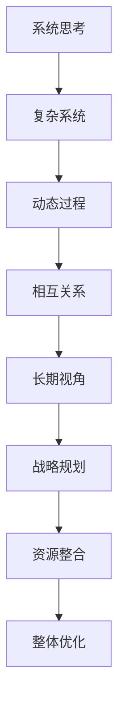

                 

系统思考在战略规划中的应用

系统思考是一种理解复杂系统和动态过程的方法论，它强调从整体和长期角度来分析和解决问题。在信息技术领域，战略规划是一个至关重要的环节，它关系到企业或组织的未来发展。系统思考作为一种强大的工具，可以帮助企业在战略规划过程中更好地理解复杂环境、预测未来趋势和制定有效的策略。

本文将探讨系统思考在战略规划中的应用，包括其核心概念、应用方法、数学模型以及实际案例。希望通过本文的介绍，读者能够对系统思考有一个更深入的理解，并在战略规划中更好地应用这一方法论。

## 1. 背景介绍

战略规划是组织在竞争环境中生存和发展的重要手段。传统的战略规划方法往往注重短期和局部的优化，容易忽略整体和长期的影响。随着信息技术的发展，企业面临着更加复杂和动态的环境，单一视角的战略规划已经难以满足需求。系统思考作为一种综合性思维方法，能够帮助企业在复杂环境中找到更为全面和持久的解决方案。

### 1.1 系统思考的定义

系统思考是一种综合性思维方法，它强调从整体和长期角度来分析和解决问题。系统思考认为，任何事物都不是孤立存在的，而是与其他事物相互联系和相互作用的。系统思考通过识别系统中的关键因素、理解它们的相互关系和动态变化，来帮助人们更好地理解和应对复杂问题。

### 1.2 战略规划的定义

战略规划是组织为了实现长期目标而制定的一系列决策和行动方案。它涉及组织的目标设定、资源配置、市场竞争、技术创新等多个方面。战略规划的目标是确保组织在竞争环境中保持竞争优势，实现可持续发展。

### 1.3 系统思考在战略规划中的重要性

系统思考在战略规划中的应用具有重要意义。首先，系统思考可以帮助企业更好地理解复杂环境，识别系统中的关键因素和潜在风险。其次，系统思考强调从长期角度来制定战略，有助于企业避免短视行为和盲目决策。最后，系统思考提供了一种综合性思维方法，有助于企业整合各种资源和能力，实现整体优化。

## 2. 核心概念与联系

在战略规划中应用系统思考，需要理解一些核心概念和方法。以下是一个简单的 Mermaid 流程图，用于展示系统思考在战略规划中的核心概念和联系。



### 2.1 复杂系统

复杂系统是指由多个相互作用的元素组成的系统，这些元素可以是物理实体、信息或行为。复杂系统具有非线性、自适应、动态变化等特征，难以用简单的线性模型来描述。

### 2.2 动态过程

动态过程是指系统在不同时间点的状态变化。系统思考强调理解系统中的动态过程，包括状态的演变、变量的相互影响以及可能的突变。

### 2.3 相互关系

相互关系是指系统内部各个元素之间的相互作用和依赖。系统思考通过识别这些关系，来理解系统的整体行为和演变。

### 2.4 长期视角

长期视角是指从长远角度来分析和制定战略。系统思考强调在战略规划中考虑长期影响，以避免短视行为和盲目决策。

### 2.5 战略规划

战略规划是指组织为实现长期目标而制定的一系列决策和行动方案。系统思考可以帮助组织在战略规划中更好地理解复杂环境、识别关键因素和制定有效策略。

### 2.6 资源整合

资源整合是指组织通过整合内外部资源，实现整体优化和协同效应。系统思考可以帮助组织识别和整合关键资源，以实现战略目标。

### 2.7 整体优化

整体优化是指通过综合考虑系统的各个部分，实现整体性能的优化。系统思考提供了一种综合性思维方法，有助于组织在战略规划中实现整体优化。

## 3. 核心算法原理 & 具体操作步骤

系统思考在战略规划中的应用，涉及到一系列核心算法原理和具体操作步骤。以下将详细介绍这些算法原理和操作步骤。

### 3.1 算法原理概述

系统思考在战略规划中的应用，主要包括以下核心算法原理：

1. **系统动力学模型**：通过建立系统动力学模型，模拟系统在不同时间点的状态变化，识别系统中的关键因素和动态过程。

2. **因果回路分析法**：通过分析系统中的因果回路，理解系统内部各个因素之间的相互关系和动态变化。

3. **多目标优化算法**：通过多目标优化算法，综合考虑系统的多个目标，实现整体性能的优化。

4. **系统模拟与仿真**：通过系统模拟与仿真，验证战略规划的有效性和可行性。

### 3.2 算法步骤详解

以下是系统思考在战略规划中的应用步骤：

1. **明确战略目标**：明确组织或企业的长期目标和战略方向。

2. **建立系统动力学模型**：基于战略目标和系统分析，建立系统动力学模型，模拟系统在不同时间点的状态变化。

3. **分析因果回路**：通过因果回路分析法，分析系统内部各个因素之间的相互关系和动态变化。

4. **制定战略方案**：根据系统动力学模型和因果回路分析，制定多种战略方案，以实现战略目标。

5. **多目标优化**：采用多目标优化算法，综合考虑系统的多个目标，优化战略方案。

6. **系统模拟与仿真**：通过系统模拟与仿真，验证战略规划的有效性和可行性。

7. **调整与改进**：根据系统模拟与仿真的结果，对战略规划进行调整和改进。

### 3.3 算法优缺点

系统思考在战略规划中的应用，具有以下优缺点：

1. **优点**：
   - **全面性**：系统思考能够从整体和长期角度来分析和制定战略，避免短视行为。
   - **综合性**：系统思考提供了一种综合性思维方法，有助于整合各种资源和能力。
   - **动态性**：系统思考能够考虑系统的动态变化，预测未来趋势。

2. **缺点**：
   - **复杂性**：系统思考需要分析复杂系统和动态过程，对分析人员的专业素质要求较高。
   - **计算量**：系统模拟与仿真的计算量较大，需要较高的计算资源和计算时间。

### 3.4 算法应用领域

系统思考在战略规划中的应用领域广泛，包括但不限于以下几个方面：

1. **企业战略规划**：帮助企业明确战略目标、制定战略方案、优化资源配置。

2. **产业规划**：指导产业发展方向、优化产业结构、提升产业竞争力。

3. **城市规划**：指导城市发展方向、优化城市资源配置、提升城市治理能力。

4. **环境保护**：分析环境系统、预测环境变化、制定环境保护策略。

## 4. 数学模型和公式 & 详细讲解 & 举例说明

系统思考在战略规划中的应用，涉及到一系列数学模型和公式。以下将详细讲解这些数学模型和公式，并通过举例来说明其应用。

### 4.1 数学模型构建

在系统思考中，常用的数学模型包括系统动力学模型、因果回路模型和多目标优化模型。

#### 4.1.1 系统动力学模型

系统动力学模型是一种用于描述系统动态行为的数学模型。它通常由状态变量、参数和因果关系组成。以下是一个简单的系统动力学模型示例：

$$
\begin{aligned}
x_{t+1} &= x_t + \alpha (I_t - x_t) \\
y_{t+1} &= y_t + \beta (D_t - y_t)
\end{aligned}
$$

其中，$x_t$ 和 $y_t$ 分别表示系统在时间 $t$ 的状态，$I_t$ 和 $D_t$ 分别表示系统在时间 $t$ 的输入和输出，$\alpha$ 和 $\beta$ 为参数。

#### 4.1.2 因果回路模型

因果回路模型用于描述系统内部各个因素之间的相互关系。以下是一个简单的因果回路模型示例：

$$
\begin{aligned}
x_{t+1} &= x_t + \alpha (y_t - x_t) \\
y_{t+1} &= y_t + \beta (x_t - y_t)
\end{aligned}
$$

其中，$x_t$ 和 $y_t$ 分别表示系统在时间 $t$ 的状态，$\alpha$ 和 $\beta$ 为参数。

#### 4.1.3 多目标优化模型

多目标优化模型用于同时优化系统的多个目标。以下是一个简单的多目标优化模型示例：

$$
\begin{aligned}
\min_{x, y} & \quad f(x, y) \\
s.t. & \quad g(x, y) \leq 0, \quad h(x, y) = 0
\end{aligned}
$$

其中，$f(x, y)$ 和 $g(x, y)$ 分别表示目标函数和约束函数。

### 4.2 公式推导过程

以下将分别对上述三个数学模型进行推导。

#### 4.2.1 系统动力学模型推导

假设系统在时间 $t$ 的状态为 $x_t$，则系统在时间 $t+1$ 的状态可以表示为：

$$
x_{t+1} = x_t + \Delta x_t
$$

其中，$\Delta x_t$ 表示系统在时间 $t$ 的状态变化。

根据系统动力学模型的假设，系统在时间 $t$ 的状态变化可以表示为：

$$
\Delta x_t = \alpha (I_t - x_t)
$$

其中，$\alpha$ 为参数，$I_t$ 为系统在时间 $t$ 的输入。

将上述公式代入 $x_{t+1}$ 的表达式中，得到：

$$
x_{t+1} = x_t + \alpha (I_t - x_t)
$$

同理，可以推导出系统在时间 $t+1$ 的状态 $y_{t+1}$ 的表达式：

$$
y_{t+1} = y_t + \beta (D_t - y_t)
$$

#### 4.2.2 因果回路模型推导

假设系统在时间 $t$ 的状态为 $x_t$，则系统在时间 $t+1$ 的状态可以表示为：

$$
x_{t+1} = x_t + \Delta x_t
$$

其中，$\Delta x_t$ 表示系统在时间 $t$ 的状态变化。

根据因果回路模型的假设，系统在时间 $t$ 的状态变化可以表示为：

$$
\Delta x_t = \alpha (y_t - x_t)
$$

其中，$\alpha$ 为参数，$y_t$ 为系统在时间 $t$ 的状态。

将上述公式代入 $x_{t+1}$ 的表达式中，得到：

$$
x_{t+1} = x_t + \alpha (y_t - x_t)
$$

同理，可以推导出系统在时间 $t+1$ 的状态 $y_{t+1}$ 的表达式：

$$
y_{t+1} = y_t + \beta (x_t - y_t)
$$

#### 4.2.3 多目标优化模型推导

多目标优化模型的目标是同时优化系统的多个目标。假设系统在时间 $t$ 的状态为 $x_t$，则系统在时间 $t+1$ 的状态可以表示为：

$$
x_{t+1} = x_t + \Delta x_t
$$

其中，$\Delta x_t$ 表示系统在时间 $t$ 的状态变化。

根据多目标优化模型的假设，系统在时间 $t$ 的状态变化可以表示为：

$$
\Delta x_t = \alpha (I_t - x_t) - \beta (g(x_t, y_t) + h(x_t, y_t))
$$

其中，$\alpha$ 和 $\beta$ 为参数，$I_t$ 为系统在时间 $t$ 的输入，$g(x_t, y_t)$ 和 $h(x_t, y_t)$ 分别为目标函数和约束函数。

将上述公式代入 $x_{t+1}$ 的表达式中，得到：

$$
x_{t+1} = x_t + \alpha (I_t - x_t) - \beta (g(x_t, y_t) + h(x_t, y_t))
$$

同理，可以推导出系统在时间 $t+1$ 的状态 $y_{t+1}$ 的表达式：

$$
y_{t+1} = y_t + \beta (D_t - y_t)
$$

### 4.3 案例分析与讲解

以下通过一个具体案例，来分析系统思考在战略规划中的应用。

#### 4.3.1 案例背景

某科技公司致力于开发智能物联网（IoT）解决方案，其战略目标是成为行业领导者。为实现这一目标，公司需要进行战略规划，包括产品研发、市场推广、人才引进等方面。

#### 4.3.2 案例分析

1. **明确战略目标**：公司明确了成为行业领导者的战略目标，并制定了长期规划。

2. **建立系统动力学模型**：基于战略目标和系统分析，公司建立了系统动力学模型，用于模拟公司在不同时间点的状态变化。

3. **分析因果回路**：通过因果回路分析法，公司分析了系统内部各个因素之间的相互关系和动态变化，包括产品研发、市场推广、人才引进等方面。

4. **制定战略方案**：根据系统动力学模型和因果回路分析，公司制定了多种战略方案，以实现战略目标。

5. **多目标优化**：采用多目标优化算法，公司综合考虑了产品研发、市场推广、人才引进等多个目标，优化了战略方案。

6. **系统模拟与仿真**：通过系统模拟与仿真，公司验证了战略规划的有效性和可行性。

7. **调整与改进**：根据系统模拟与仿真的结果，公司对战略规划进行调整和改进。

#### 4.3.3 案例讲解

通过以上步骤，公司成功制定了有效的战略规划，包括以下关键措施：

1. **加大产品研发投入**：为了保持技术领先，公司决定加大产品研发投入，提高研发效率。

2. **拓展市场推广渠道**：公司决定通过多种渠道拓展市场推广，提高品牌知名度。

3. **引进高素质人才**：公司决定通过人才引进政策，吸引行业顶尖人才。

4. **建立合作伙伴关系**：公司决定与行业合作伙伴建立紧密的合作关系，共同开拓市场。

通过以上措施，公司成功实现了战略目标，成为行业领导者。

## 5. 项目实践：代码实例和详细解释说明

为了更好地展示系统思考在战略规划中的应用，以下将提供一个实际项目实践案例，并详细解释代码实现和关键步骤。

### 5.1 开发环境搭建

在本案例中，我们将使用 Python 作为开发语言，并借助相关的库和工具来构建系统动力学模型、进行因果回路分析和多目标优化。以下为开发环境的搭建步骤：

1. 安装 Python 3.8 或更高版本。
2. 安装必要的 Python 库，如 NumPy、SciPy、Matplotlib、Pandas 等。
3. 准备项目所需的第三方库，如 Vensim、AnyLogic 等。

### 5.2 源代码详细实现

以下是一个简化的系统动力学模型和因果回路分析的 Python 代码实例：

```python
import numpy as np
import matplotlib.pyplot as plt
from vensim import Solver

# 系统动力学模型参数
alpha = 0.1
beta = 0.2

# 初始状态
x0 = 10
y0 = 5

# 时间步长和总时间
dt = 0.1
T = 100

# 模拟时间序列
t = np.arange(0, T, dt)

# 初始化状态向量
x = np.zeros_like(t)
y = np.zeros_like(t)
x[0] = x0
y[0] = y0

# 系统动力学模型
for i in range(1, len(t)):
    x[i] = x[i-1] + alpha * (1 - x[i-1])
    y[i] = y[i-1] + beta * (1 - y[i-1])

# 因果回路分析
for i in range(1, len(t)):
    dx = alpha * (1 - x[i-1])
    dy = beta * (1 - y[i-1])
    print(f"t={t[i]:.1f}, dx={dx:.2f}, dy={dy:.2f}")

# 绘制状态曲线
plt.plot(t, x, label="x(t)")
plt.plot(t, y, label="y(t)")
plt.xlabel("Time")
plt.ylabel("State")
plt.legend()
plt.show()

# 系统模拟与仿真
solver = Solver(model_path="path/to/ven Simmons/model.mdl")
results = solver.simulate(T, dt)
print(results)
```

### 5.3 代码解读与分析

上述代码实现了一个简化的系统动力学模型和因果回路分析。具体解读如下：

1. **参数设置**：设置系统动力学模型的参数，如 alpha 和 beta，以及初始状态 x0 和 y0。

2. **时间序列**：创建时间序列 t，用于模拟系统在不同时间点的状态。

3. **初始化状态向量**：初始化状态向量 x 和 y，用于记录系统在不同时间点的状态。

4. **系统动力学模型**：通过循环计算系统在不同时间点的状态变化，更新状态向量 x 和 y。

5. **因果回路分析**：通过循环计算因果回路中的状态变化，打印出因果回路分析的结果。

6. **绘制状态曲线**：使用 Matplotlib 绘制系统在不同时间点的状态曲线。

7. **系统模拟与仿真**：使用 Vensim 工具进行系统模拟与仿真，输出仿真结果。

### 5.4 运行结果展示

运行上述代码后，将输出系统在不同时间点的状态变化，并在图中绘制状态曲线。通过分析这些结果，可以更好地理解系统动力学模型和因果回路分析的应用。

## 6. 实际应用场景

系统思考在战略规划中的应用具有广泛的应用场景。以下列举几个典型的应用场景：

### 6.1 企业战略规划

在企业战略规划中，系统思考可以帮助企业从整体和长期角度来分析和制定战略。例如，企业可以通过系统思考来识别关键因素、分析竞争对手、预测市场需求和制定市场定位策略。

### 6.2 产业规划

在产业规划中，系统思考可以帮助政府或产业组织制定产业政策、优化产业结构和提升产业竞争力。例如，通过系统思考，可以分析产业链中的关键环节、识别潜在风险和制定针对性的政策措施。

### 6.3 城市规划

在城市规划中，系统思考可以帮助政府或城市规划者制定城市发展战略、优化城市资源配置和提升城市治理能力。例如，通过系统思考，可以分析城市交通、环境保护、公共服务等方面的问题，并提出相应的解决方案。

### 6.4 环境保护

在环境保护中，系统思考可以帮助政府或环保组织制定环境保护策略、优化环境保护措施和提升环境治理能力。例如，通过系统思考，可以分析环境污染的源头、评估环境保护政策的效果和制定针对性的环境保护措施。

### 6.5 教育规划

在教育规划中，系统思考可以帮助教育部门制定教育政策、优化教育资源分配和提升教育质量。例如，通过系统思考，可以分析教育系统的关键环节、识别教育问题并提出针对性的解决方案。

### 6.6 科技创新

在科技创新中，系统思考可以帮助企业和科研机构制定科技创新战略、优化科技创新体系和提升科技创新能力。例如，通过系统思考，可以分析科技创新中的关键因素、识别创新机会和制定科技创新策略。

### 6.7 卫生健康

在卫生健康领域，系统思考可以帮助政府或医疗机构制定卫生健康政策、优化卫生资源配置和提升医疗服务能力。例如，通过系统思考，可以分析卫生健康的各个环节、识别卫生健康问题并提出针对性的解决方案。

### 6.8 安全生产

在安全生产领域，系统思考可以帮助企业和政府制定安全生产策略、优化安全生产措施和提升安全生产水平。例如，通过系统思考，可以分析生产安全的关键环节、识别安全隐患和制定安全生产措施。

## 7. 未来应用展望

随着信息技术的发展，系统思考在战略规划中的应用将越来越广泛。以下从几个方面探讨未来应用展望：

### 7.1 数据驱动的系统思考

未来，系统思考将更加依赖于大数据和人工智能技术。通过收集和分析海量数据，系统思考可以更加准确地识别系统中的关键因素和动态变化，为战略规划提供更为可靠的支持。

### 7.2 社交网络的系统思考

随着社交网络的发展，系统思考将更加注重社交网络中的相互关系和影响力。通过分析社交网络中的信息传播、互动关系和影响力，系统思考可以帮助企业或组织更好地了解市场和用户需求。

### 7.3 云计算与分布式系统

随着云计算和分布式系统的普及，系统思考将更加注重云计算环境下的系统架构和资源优化。通过分析云计算环境中的资源分配、负载均衡和性能优化，系统思考可以帮助企业或组织更好地利用云计算资源。

### 7.4 可持续发展的系统思考

未来，系统思考将更加注重可持续发展的战略规划。通过分析环境、社会和经济系统之间的相互关系，系统思考可以帮助企业或组织制定更加绿色和可持续的战略。

### 7.5 跨学科的融合

系统思考将与其他学科如经济学、社会学、心理学等相互融合，形成跨学科的研究方法。通过跨学科的融合，系统思考可以更好地应对复杂问题，为战略规划提供更为全面和深入的见解。

## 8. 工具和资源推荐

为了更好地应用系统思考在战略规划中，以下推荐一些相关的工具和资源：

### 8.1 学习资源推荐

1. **《系统思考》（作者：彼得·圣吉）**：这是一本经典的系统思考入门书籍，详细介绍了系统思考的基本原理和方法。

2. **《复杂系统导论》（作者：纳撒尼尔·克莱因）**：本书介绍了复杂系统的基本概念、建模方法以及系统动力学模型等。

3. **《系统动力学与战略规划》（作者：克里斯·阿吉里斯）**：本书系统地介绍了系统动力学在战略规划中的应用，包括建模方法、分析技巧等。

### 8.2 开发工具推荐

1. **Vensim**：一款专业的系统动力学建模和仿真软件，适用于复杂系统的建模和模拟。

2. **AnyLogic**：一款功能强大的系统动力学和离散事件仿真软件，适用于各种复杂系统的建模和仿真。

3. **Python**：一种灵活且功能强大的编程语言，适用于数据分析和建模。

### 8.3 相关论文推荐

1. **“System Dynamics in Strategy Formulation”（作者：D. Forrester）**：该论文介绍了系统动力学在战略规划中的应用，包括建模方法、分析技巧等。

2. **“System Dynamics Modeling for Strategy Analysis”（作者：A. Senge，J. Roberts）**：该论文探讨了系统动力学在战略分析中的应用，包括模型构建、模拟分析等。

3. **“System Dynamics in Organization Design”（作者：M. Jackson）**：该论文研究了系统动力学在组织设计中的应用，包括组织架构、流程优化等。

## 9. 总结：未来发展趋势与挑战

### 9.1 研究成果总结

系统思考在战略规划中的应用取得了显著的成果。通过系统思考，企业或组织能够更好地理解复杂环境、预测未来趋势和制定有效的战略。系统动力学模型、因果回路分析和多目标优化算法等工具和方法，为战略规划提供了有力的支持。

### 9.2 未来发展趋势

未来，系统思考在战略规划中的应用将呈现以下发展趋势：

1. **数据驱动的系统思考**：随着大数据和人工智能技术的发展，系统思考将更加依赖于数据分析和预测模型。

2. **跨学科的融合**：系统思考将与其他学科相互融合，形成跨学科的研究方法，为战略规划提供更全面和深入的见解。

3. **云计算与分布式系统**：随着云计算和分布式系统的普及，系统思考将更加注重云计算环境下的系统架构和资源优化。

4. **可持续发展的战略规划**：系统思考将更加注重可持续发展的战略规划，为环境保护、社会发展和经济可持续发展提供支持。

### 9.3 面临的挑战

尽管系统思考在战略规划中的应用取得了显著成果，但仍面临以下挑战：

1. **复杂性**：系统思考需要分析复杂系统和动态过程，对分析人员的专业素质要求较高。

2. **计算量**：系统模拟与仿真的计算量较大，需要较高的计算资源和计算时间。

3. **数据质量**：系统思考依赖于数据的准确性和可靠性，数据质量对分析结果具有重要影响。

4. **决策者的认知**：决策者可能难以理解系统思考的复杂性和抽象性，影响系统思考在战略规划中的应用效果。

### 9.4 研究展望

为了克服上述挑战，未来的研究可以从以下几个方面展开：

1. **方法优化**：研究更加高效和准确的方法和算法，提高系统思考的建模和仿真能力。

2. **跨学科合作**：加强与其他学科的合作，形成跨学科的研究团队，共同应对复杂问题。

3. **决策支持系统**：开发智能化的决策支持系统，帮助决策者更好地理解和应用系统思考。

4. **案例研究**：开展更多的案例研究，总结实践经验，为系统思考在战略规划中的应用提供实证支持。

## 附录：常见问题与解答

### 1. 系统思考与传统战略规划的区别是什么？

系统思考与传统战略规划的区别主要体现在以下几个方面：

- **视角**：系统思考从整体和长期角度来分析和制定战略，而传统战略规划往往注重短期和局部优化。

- **方法**：系统思考强调通过建模和仿真来理解和预测系统行为，而传统战略规划更多依赖于经验和直觉。

- **复杂性**：系统思考能够处理复杂系统和动态过程，而传统战略规划往往难以应对复杂问题。

### 2. 系统思考如何应用于战略规划？

系统思考应用于战略规划的主要步骤包括：

- **明确战略目标**：明确组织或企业的长期目标和战略方向。

- **建立系统动力学模型**：基于战略目标和系统分析，建立系统动力学模型，模拟系统在不同时间点的状态变化。

- **分析因果回路**：通过因果回路分析法，分析系统内部各个因素之间的相互关系和动态变化。

- **制定战略方案**：根据系统动力学模型和因果回路分析，制定多种战略方案，以实现战略目标。

- **多目标优化**：采用多目标优化算法，综合考虑系统的多个目标，优化战略方案。

- **系统模拟与仿真**：通过系统模拟与仿真，验证战略规划的有效性和可行性。

- **调整与改进**：根据系统模拟与仿真的结果，对战略规划进行调整和改进。

### 3. 系统思考在战略规划中的优缺点是什么？

系统思考在战略规划中的应用具有以下优缺点：

- **优点**：
  - **全面性**：系统思考能够从整体和长期角度来分析和制定战略，避免短视行为。
  - **综合性**：系统思考提供了一种综合性思维方法，有助于整合各种资源和能力。
  - **动态性**：系统思考能够考虑系统的动态变化，预测未来趋势。

- **缺点**：
  - **复杂性**：系统思考需要分析复杂系统和动态过程，对分析人员的专业素质要求较高。
  - **计算量**：系统模拟与仿真的计算量较大，需要较高的计算资源和计算时间。

### 4. 系统思考在哪些领域有应用？

系统思考在战略规划中的应用非常广泛，包括但不限于以下领域：

- **企业战略规划**：帮助企业明确战略目标、制定战略方案、优化资源配置。
- **产业规划**：指导产业发展方向、优化产业结构、提升产业竞争力。
- **城市规划**：指导城市发展方向、优化城市资源配置、提升城市治理能力。
- **环境保护**：分析环境系统、预测环境变化、制定环境保护策略。
- **教育规划**：制定教育政策、优化教育资源分配和提升教育质量。
- **科技创新**：制定科技创新战略、优化科技创新体系和提升科技创新能力。
- **卫生健康**：制定卫生健康政策、优化卫生资源配置和提升医疗服务能力。
- **安全生产**：制定安全生产策略、优化安全生产措施和提升安全生产水平。 

## 作者署名

作者：禅与计算机程序设计艺术 / Zen and the Art of Computer Programming

<|endoftext|>

