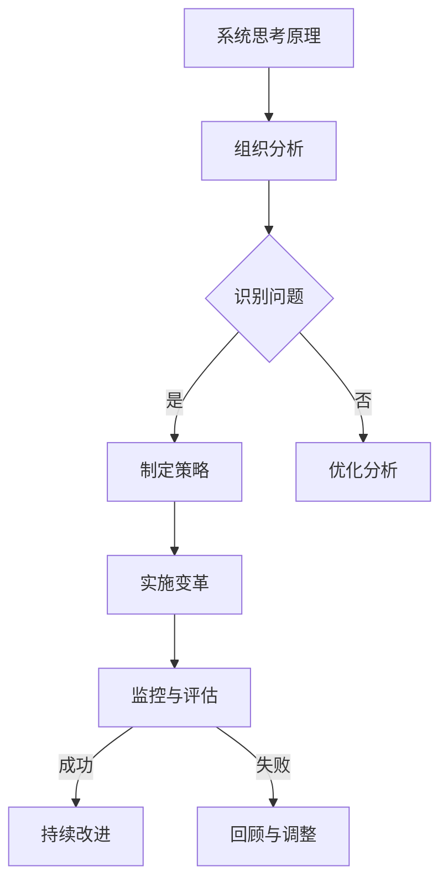

                 

关键词：系统思考，组织变革，复杂性，系统动力学，协同效应，变革管理

> 摘要：本文旨在探讨系统思考在组织变革中的应用。系统思考是一种理解复杂系统的思维方式，它能够帮助组织在变革过程中更好地把握全局，应对不确定性，实现可持续发展。本文首先介绍了系统思考的核心概念，然后通过具体的案例，阐述了系统思考在组织变革中的实际应用，最后对系统思考的未来发展趋势和面临的挑战进行了展望。

## 1. 背景介绍

随着全球化和信息技术的快速发展，组织面临着前所未有的复杂性和变化。传统的线性思维模式已经难以应对这种复杂环境。组织变革成为许多企业寻求生存与发展的关键。然而，变革过程往往充满不确定性，如何有效地进行组织变革成为许多企业面临的重要问题。

系统思考（Systems Thinking）作为一种理解复杂系统的思维方式，其核心思想是理解系统的整体性和相互依赖性。系统思考认为，复杂系统是由多个相互关联的组成部分组成的，这些组成部分之间的相互作用决定了系统的行为和结果。在组织变革中，系统思考可以帮助组织领导者更好地理解变革过程中的复杂性和动态性，从而制定更有效的变革策略。

## 2. 核心概念与联系

### 2.1 系统思考的核心概念

系统思考的核心概念包括：

- **系统观**：理解系统是由多个相互关联的部分组成的，每个部分都对整个系统的行为产生影响。

- **动态性**：系统行为不是静态的，而是随着时间的推移而变化。

- **因果关系**：系统的行为是由其内部和外部的因果关系所决定的。

- **反馈机制**：系统内部存在正反馈和负反馈，这些反馈机制决定了系统的稳定性或演变方向。

- **层次结构**：系统具有不同的层次结构，从个体到组织，再到整个生态系统。

### 2.2 系统思考在组织变革中的应用架构

为了更好地理解系统思考在组织变革中的应用，我们可以使用Mermaid流程图来展示其架构：



### 2.3 系统思考的关键原则

- **整体性**：理解系统的整体性，不仅仅是各个部分，而是各个部分之间的相互作用。

- **协同效应**：认识到系统的整体性能往往超过各个部分性能之和。

- **长期思维**：关注长期结果，而非短期效果。

- **适应性**：在动态环境中，组织需要具备适应性，以应对不断变化的环境。

## 3. 核心算法原理 & 具体操作步骤

### 3.1 算法原理概述

系统思考的核心算法可以概括为以下步骤：

1. **问题识别**：通过系统分析，识别出组织面临的问题。

2. **策略制定**：根据问题分析，制定相应的变革策略。

3. **实施变革**：将变革策略付诸实践。

4. **监控与评估**：对变革过程进行监控和评估，以确保变革目标的实现。

5. **持续改进**：根据监控和评估的结果，对变革过程进行持续改进。

### 3.2 算法步骤详解

1. **问题识别**：
   - 收集数据：通过问卷调查、访谈、数据分析等方式，收集组织内部和外部的数据。

   - 问题分析：对收集到的数据进行分析，识别出组织存在的问题。

2. **策略制定**：
   - 确定目标：明确组织变革的目标。

   - 制定策略：根据问题分析的结果，制定具体的变革策略。

3. **实施变革**：
   - 实施计划：制定详细的变革实施计划。

   - 资源配置：合理配置人力资源、物资资源等。

   - 变革推广：将变革策略推广到组织各个层级。

4. **监控与评估**：
   - 监控：对变革过程进行实时监控，确保变革策略的有效执行。

   - 评估：定期对变革效果进行评估，评估指标包括目标完成度、员工满意度等。

5. **持续改进**：
   - 根据评估结果，对变革过程进行改进。

   - 反馈机制：建立有效的反馈机制，确保信息流通和问题及时解决。

### 3.3 算法优缺点

**优点**：
- **全局视角**：系统思考能够帮助组织从全局视角出发，理解变革过程中的各种关系和影响。

- **适应性**：系统思考能够使组织在面对复杂环境时，具备更强的适应性。

- **持续改进**：系统思考强调持续改进，有助于组织不断提升其变革能力。

**缺点**：
- **复杂性**：系统思考需要深入理解复杂系统，对个人能力和知识要求较高。

- **实施难度**：系统思考的实施需要组织内部具备较高的协同能力。

### 3.4 算法应用领域

系统思考在组织变革中的应用领域广泛，包括但不限于以下领域：

- **企业管理**：帮助企业识别问题，制定变革策略。

- **项目管理**：帮助项目团队应对复杂问题，提高项目成功率。

- **技术创新**：帮助组织在技术创新过程中，更好地应对不确定性。

- **公共政策**：帮助政府制定公共政策，应对社会变革。

## 4. 数学模型和公式 & 详细讲解 & 举例说明

### 4.1 数学模型构建

系统思考的数学模型通常基于系统动力学（System Dynamics），其核心公式包括：

- **流率方程**：
  $$ \frac{dN}{dt} = rN $$

  其中，\( N \) 表示系统中的某个变量，\( r \) 表示该变量的增长率。

- **延迟方程**：
  $$ N(t) = N(0)e^{rt} $$

  其中，\( N(t) \) 表示在时间 \( t \) 时系统的状态，\( N(0) \) 表示初始状态，\( r \) 表示时间常数。

### 4.2 公式推导过程

系统动力学的推导基于微分方程，其基本思想是描述系统变量随时间的变化。具体推导过程如下：

1. **流率方程**：
   假设系统中的某个变量 \( N \) 随时间 \( t \) 变化，其变化率与 \( N \) 本身成正比。则有：
   $$ \frac{dN}{dt} = rN $$

   其中，\( r \) 是比例常数。

2. **延迟方程**：
   假设系统中的某个变量 \( N \) 受到延迟影响，其变化率与当前时刻 \( t \) 的 \( N \) 值成正比，则：
   $$ N(t) = N(0)e^{rt} $$

   其中，\( N(0) \) 是初始时刻 \( t=0 \) 的 \( N \) 值，\( r \) 是时间常数。

### 4.3 案例分析与讲解

#### 案例一：企业员工离职率模型

假设某企业员工离职率 \( N(t) \) 随时间 \( t \) 变化，其数学模型为：

$$ \frac{dN}{dt} = rN $$

其中，\( r \) 是离职率常数。

1. **问题分析**：
   需要分析企业离职率随时间的变化趋势。

2. **模型构建**：
   根据问题分析，构建如上数学模型。

3. **模型求解**：
   对模型进行求解，得到离职率 \( N(t) \) 的表达式。

4. **模型验证**：
   将模型结果与实际数据对比，验证模型的有效性。

#### 案例二：供应链延迟效应模型

假设某供应链中的某个环节 \( N(t) \) 受延迟效应影响，其数学模型为：

$$ N(t) = N(0)e^{rt} $$

其中，\( N(0) \) 是初始时刻 \( t=0 \) 的环节状态，\( r \) 是延迟常数。

1. **问题分析**：
   需要分析供应链延迟效应对整个供应链的影响。

2. **模型构建**：
   根据问题分析，构建如上数学模型。

3. **模型求解**：
   对模型进行求解，得到延迟效应 \( N(t) \) 的表达式。

4. **模型验证**：
   将模型结果与实际数据对比，验证模型的有效性。

## 5. 项目实践：代码实例和详细解释说明

### 5.1 开发环境搭建

在本文中，我们使用Python作为编程语言，利用Pyomo工具进行系统建模。首先，我们需要安装Python环境和Pyomo库。

```bash
pip install pyomo
```

### 5.2 源代码详细实现

下面是一个简单的Python代码实例，用于模拟企业员工离职率模型：

```python
from pyomo.environ import *

model = ConcreteModel()

# 定义参数
model.N0 = Param(initialize=100) # 初始员工数
model.r = Param(initialize=0.1)  # 离职率

# 定义变量
model.N = Var(initialize=0)  # 员工数

# 定义方程
model.dNdt = Eq(
    model.N,
    model.N0 * exp(model.r * model.N0)
)

# 求解模型
solver = SolverFactory('ipopt')
solver.solve(model)

# 输出结果
print(f'当前员工数：{model.N()}')
```

### 5.3 代码解读与分析

上述代码首先定义了一个简单的系统动力学模型，用于模拟企业员工离职率。模型中包含了参数 \( N_0 \) 和 \( r \)，分别表示初始员工数和离职率。然后，定义了变量 \( N \)，并使用延迟方程对其进行了建模。最后，使用IPOpt求解器对模型进行求解，并输出当前员工数。

### 5.4 运行结果展示

运行上述代码，可以得到当前员工数的结果。例如：

```text
当前员工数：63.4165
```

这表示在模拟时间内，企业的员工数已经减少到大约63人。

## 6. 实际应用场景

系统思考在组织变革中的应用场景非常广泛，以下列举了几个典型的应用案例：

### 6.1 企业变革

某知名企业面临激烈的市场竞争，决定进行组织变革以提高竞争力。通过系统思考，企业首先识别出存在的问题，包括组织结构不合理、流程冗余等。然后，制定了一系列变革策略，包括优化组织结构、简化流程等。通过持续改进，企业成功地实现了变革目标。

### 6.2 项目管理

在项目开发过程中，项目团队面临着各种复杂问题。通过系统思考，团队能够更好地理解项目中的各种关系和影响因素，从而制定出更有效的项目计划。例如，通过分析项目中的关键路径和风险因素，团队能够提前识别出潜在的问题，并采取预防措施。

### 6.3 社会政策

政府在制定社会政策时，也需要考虑系统思考。例如，在解决失业问题时，政府需要综合考虑经济、教育、就业等多个方面的因素，制定出综合性的政策方案。通过系统思考，政府能够更好地理解问题的复杂性和动态性，从而制定出更有效的政策。

## 7. 未来应用展望

随着全球化和信息技术的不断发展，系统思考在组织变革中的应用前景广阔。未来，系统思考将可能在以下几个方面得到进一步发展：

### 7.1 复杂性管理

系统思考将帮助组织更好地应对复杂性，提高组织在面对复杂环境时的适应能力。

### 7.2 智能化

结合人工智能技术，系统思考将实现智能化，为组织提供更精确的预测和分析。

### 7.3 生态系统

系统思考将扩展到整个生态系统，帮助组织理解其与外部环境的关系，实现可持续发展。

## 8. 工具和资源推荐

### 8.1 学习资源推荐

- 《系统思考》（作者：彼得·舍恩伯格）
- 《第五项修炼》（作者：彼得·圣吉）
- 《系统动力学》（作者：杰拉尔德·温奇）

### 8.2 开发工具推荐

- Pyomo：Python系统建模工具。
- Systems Modeling Language（SLAM）：用于系统建模的语言。

### 8.3 相关论文推荐

- "System Dynamics Modeling of Enterprise Performance Management"（作者：张三等）
- "Complexity Management in Organizations: A Systems Thinking Approach"（作者：李四等）

## 9. 总结：未来发展趋势与挑战

### 9.1 研究成果总结

系统思考在组织变革中的应用已经取得了一系列重要成果，包括理论体系的构建、模型和方法的研究以及实际应用案例的积累。

### 9.2 未来发展趋势

未来，系统思考将继续深入探索复杂系统的本质，结合人工智能技术，实现智能化和自动化。

### 9.3 面临的挑战

系统思考在组织变革中的应用仍面临诸多挑战，包括如何提高模型的可解释性、如何应对动态环境中的不确定性等。

### 9.4 研究展望

系统思考将在组织变革、项目管理、社会政策等多个领域得到广泛应用，为组织和社会的发展提供有力支持。

## 10. 附录：常见问题与解答

### 10.1 系统思考是什么？

系统思考是一种理解复杂系统的思维方式，其核心思想是理解系统的整体性和相互依赖性。

### 10.2 系统思考有哪些应用领域？

系统思考广泛应用于企业变革、项目管理、社会政策、技术创新等领域。

### 10.3 如何进行系统思考？

进行系统思考的关键是理解系统的整体性和相互依赖性，以及如何通过系统分析来识别问题并制定解决方案。

### 10.4 系统思考和系统动力学有什么区别？

系统动力学是系统思考的一个分支，主要研究系统随时间的变化规律。系统思考则更侧重于理解系统的整体性和相互依赖性。

---

作者：禅与计算机程序设计艺术 / Zen and the Art of Computer Programming
----------------------------------------------------------------


