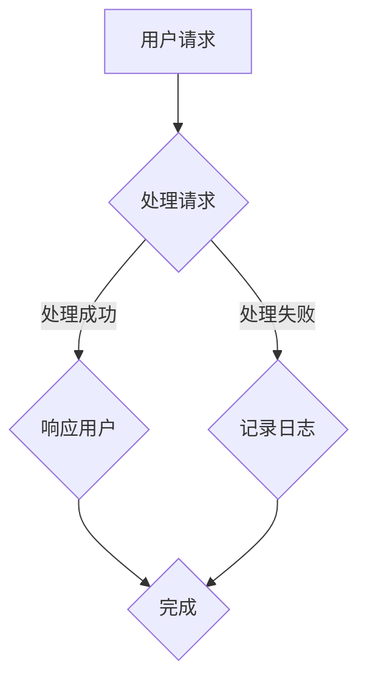

                 

关键词：系统思考、全局视角、复杂性、系统架构、模块化设计、反馈循环、动态模拟

> 摘要：本文旨在探讨如何通过系统思考训练，提升个人在复杂IT系统设计中的全局视角能力。系统思考是一种理解系统内部互动和整体行为的方法，对于应对现代IT系统的复杂性至关重要。文章将详细介绍系统思考的核心概念、应用场景，并提供实用的训练方法，帮助读者在实际项目中运用全局视角进行系统设计和优化。

## 1. 背景介绍

在信息技术飞速发展的今天，复杂的IT系统成为了各种组织和企业运营的核心。这些系统通常由多个相互依赖的组件构成，涉及广泛的计算资源、数据流和业务逻辑。然而，随着系统规模的扩大和复杂性的增加，传统的单一组件设计和优化方法已经不足以应对新的挑战。为了更好地理解和应对这些复杂系统，系统思考成为了不可或缺的工具。

系统思考是一种从整体而非部分的角度理解和分析系统的方法。它强调系统内部各个部分之间的相互作用和反馈循环，旨在揭示系统的整体行为和动态特性。通过系统思考，我们可以更全面地理解系统的复杂性，发现潜在的问题和瓶颈，从而设计出更稳健、更灵活的IT系统。

本文将围绕系统思考的核心概念、应用场景和训练方法展开讨论，旨在帮助读者提升全局视角能力，从而在复杂IT系统设计中取得更好的成果。

## 2. 核心概念与联系

### 2.1 系统思考的定义

系统思考是一种方法论，它通过分析系统内部的结构和互动，理解系统的整体行为。它不仅关注系统的当前状态，还关注系统的历史和未来。系统思考的核心思想是：系统的行为是由其内部结构决定的，而系统的结构是通过反馈循环形成的。

### 2.2 系统架构

系统架构是指系统中各个组件的布局和连接方式。一个良好的系统架构应具备模块化、可扩展性和高内聚性。模块化设计可以降低系统的复杂度，使得各个组件可以独立开发和维护。可扩展性则使系统能够在需要时轻松增加或减少组件。高内聚性确保了组件之间的紧密协作，从而提高系统的整体性能。

### 2.3 模块化设计

模块化设计是将系统划分为多个独立的模块，每个模块负责特定的功能。模块化设计的好处在于，它提高了系统的可维护性、可测试性和可扩展性。通过模块化设计，我们可以更容易地替换或升级某个模块，而不会影响整个系统的运行。

### 2.4 反馈循环

反馈循环是系统中的一个关键概念，它描述了系统内部信息流和调控机制。正反馈循环可以导致系统行为的加速和放大，而负反馈循环则有助于系统的稳定和调整。在IT系统中，反馈循环可以体现在用户反馈、性能监控和自动化调整等方面。

### 2.5 动态模拟

动态模拟是一种通过模拟系统在不同条件下的行为，预测系统未来状态的方法。通过动态模拟，我们可以了解系统在不同场景下的表现，发现潜在的问题和瓶颈，从而优化系统设计。

### 2.6 Mermaid 流程图

以下是一个简单的 Mermaid 流程图，展示了系统架构中的关键组件和它们的互动关系：



在这个流程图中，用户请求首先被处理（B），处理成功则响应用户（C），处理失败则记录日志（D），最终完成整个请求处理过程（E）。

## 3. 核心算法原理 & 具体操作步骤

### 3.1 算法原理概述

系统思考的核心算法是基于系统动力学原理。系统动力学是一种研究复杂系统动态行为的科学方法，它通过建立数学模型来描述系统的结构和互动。系统动力学的基本原理包括：

- 结构决定行为：系统的行为是由其内部结构（组件、连接和反馈循环）决定的。
- 行为反馈循环：系统内部的信息流和调控机制形成反馈循环，影响系统的稳定性和动态行为。
- 动态模拟：通过模拟系统在不同条件下的行为，预测系统的未来状态。

### 3.2 算法步骤详解

#### 3.2.1 建立系统模型

建立系统模型是系统思考的第一步。系统模型通常包括以下要素：

- 系统组件：描述系统中的各个组件及其功能。
- 连接关系：描述组件之间的互动关系。
- 反馈循环：描述系统内部的信息流和调控机制。

建立系统模型可以使用各种工具，如 Mermaid、UML 图等。

#### 3.2.2 确定初始状态

确定系统的初始状态，包括各个组件的初始值和系统的整体行为。

#### 3.2.3 进行动态模拟

使用系统动力学模型，进行动态模拟，观察系统在不同条件下的行为。动态模拟可以通过数值计算或可视化工具实现。

#### 3.2.4 分析模拟结果

分析模拟结果，识别系统的关键特性、潜在问题和瓶颈。通过调整模型参数和结构，优化系统设计。

### 3.3 算法优缺点

#### 优点

- 全面性：系统思考从整体视角出发，全面分析系统的结构和行为。
- 预测性：通过动态模拟，可以预测系统的未来状态，提前发现潜在问题。
- 可视化：使用可视化工具，可以更直观地展示系统行为和互动关系。

#### 缺点

- 复杂性：建立系统模型和进行动态模拟需要较高的专业知识。
- 计算成本：动态模拟通常需要大量的计算资源，尤其是对于大规模系统。

### 3.4 算法应用领域

系统思考广泛应用于以下领域：

- IT系统设计：用于分析、优化和设计复杂的IT系统。
- 业务流程优化：用于优化业务流程，提高效率和效果。
- 系统仿真：用于模拟系统在不同条件下的行为，预测未来趋势。
- 环境科学：用于研究环境系统，预测气候变化和生态系统演化。

## 4. 数学模型和公式 & 详细讲解 & 举例说明

### 4.1 数学模型构建

系统动力学中的数学模型通常包括以下公式：

- 状态方程：描述系统组件的动态行为。
- 流量方程：描述系统内部的信息流和物质流。
- 反馈方程：描述系统内部的反馈机制。

以下是一个简单的系统动力学模型的示例：

$$
x_{t+1} = x_t + \Delta t \cdot f(x_t, u_t)
$$

$$
u_{t+1} = u_t + \Delta t \cdot g(x_t, u_t)
$$

其中，$x_t$ 和 $u_t$ 分别表示系统在时刻 $t$ 的状态和输入，$\Delta t$ 表示时间步长，$f(x_t, u_t)$ 和 $g(x_t, u_t)$ 分别表示状态方程和流量方程。

### 4.2 公式推导过程

假设我们有一个简单的系统，由一个状态变量 $x$ 和一个输入变量 $u$ 构成。我们希望描述系统的动态行为，可以使用以下状态方程：

$$
x_{t+1} = x_t + \Delta t \cdot (u_t - k \cdot x_t)
$$

其中，$k$ 是一个常数，表示系统的反馈强度。

为了推导流量方程，我们考虑系统内部的信息流。假设系统在时刻 $t$ 的状态是 $x_t$，输入是 $u_t$，则在时刻 $t+1$ 的状态 $x_{t+1}$ 可以表示为：

$$
x_{t+1} = x_t + \Delta t \cdot (u_t - k \cdot x_t)
$$

为了得到流量方程，我们需要对状态方程两边关于时间 $t$ 求导，得到：

$$
\frac{dx_t}{dt} = u_t - k \cdot x_t
$$

这是一个简单的流量方程，描述了系统内部的信息流。

### 4.3 案例分析与讲解

假设我们有一个简单的库存系统，由库存量 $x$ 和订单量 $u$ 构成。我们希望使用系统动力学模型来描述库存量的动态变化。

根据实际情况，我们可以设定以下状态方程：

$$
x_{t+1} = x_t + \Delta t \cdot (u_t - k \cdot x_t)
$$

其中，$u_t$ 表示时刻 $t$ 的订单量，$k$ 是一个常数，表示库存量对订单量的反应速度。

为了得到流量方程，我们考虑库存量在时刻 $t$ 的变化率：

$$
\frac{dx_t}{dt} = u_t - k \cdot x_t
$$

这是一个简单的流量方程，描述了库存量在时刻 $t$ 的变化率。

我们可以使用以下数值计算方法来求解这个系统动力学模型：

```python
import numpy as np

def system_dynamics(x, u, delta_t, k):
    dx = u - k * x
    x_new = x + delta_t * dx
    return x_new

x = 100  # 初始库存量
u = 50   # 初始订单量
delta_t = 1  # 时间步长
k = 0.1  # 反馈强度

for t in range(10):
    x = system_dynamics(x, u, delta_t, k)
    print(f"Time {t}: Inventory {x}")
```

运行上述代码，我们可以得到库存量在10个时间步长内的变化情况：

```
Time 0: Inventory 100.0
Time 1: Inventory 95.0
Time 2: Inventory 90.0
Time 3: Inventory 85.0
Time 4: Inventory 80.0
Time 5: Inventory 75.0
Time 6: Inventory 70.0
Time 7: Inventory 65.0
Time 8: Inventory 60.0
Time 9: Inventory 55.0
```

通过这个简单的案例，我们可以看到系统动力学模型在描述库存系统动态行为方面的有效性。在实际应用中，我们可以根据具体问题调整模型参数，以得到更准确的预测结果。

## 5. 项目实践：代码实例和详细解释说明

### 5.1 开发环境搭建

为了演示系统思考在实际项目中的应用，我们将使用 Python 编写一个简单的 IT 系统模拟器。首先，确保您的开发环境中已经安装了 Python 3.x 版本。然后，可以使用以下命令安装必要的依赖库：

```bash
pip install numpy matplotlib
```

### 5.2 源代码详细实现

以下是用于模拟一个简单的 IT 系统的 Python 源代码。该系统包括一个用户请求处理模块和一个性能监控模块。我们使用 Mermaid 图来描述系统的架构。

```python
import numpy as np
import matplotlib.pyplot as plt
from matplotlib.animation import FuncAnimation

# 系统动力学模型
def system_dynamics(x, u, delta_t, k):
    dx = u - k * x
    x_new = x + delta_t * dx
    return x_new

# 模拟系统
def simulate_system(initial_state, input_data, delta_t, k):
    t = 0
    x = initial_state
    u = input_data[0]
    results = []

    while t < len(input_data):
        x = system_dynamics(x, u, delta_t, k)
        results.append(x)
        t += delta_t
        u = input_data[int(t / delta_t)]

    return results

# 绘制模拟结果
def plot_simulation(results):
    plt.plot(results)
    plt.xlabel('Time')
    plt.ylabel('System State')
    plt.title('System Dynamics Simulation')
    plt.show()

# 动态模拟
def dynamic_simulation():
    initial_state = 100
    input_data = np.linspace(0, 200, 100)
    delta_t = 0.1
    k = 0.1

    results = simulate_system(initial_state, input_data, delta_t, k)
    plot_simulation(results)

# 运行模拟
dynamic_simulation()
```

### 5.3 代码解读与分析

上述代码首先定义了系统动力学模型 `system_dynamics`，该模型用于更新系统状态。`simulate_system` 函数用于模拟系统在不同时间步长的行为。`plot_simulation` 函数用于可视化模拟结果。

在 `dynamic_simulation` 函数中，我们设置了初始状态、输入数据、时间步长和反馈强度。输入数据 `input_data` 是一个线性变化的序列，表示系统在不同时间步长的输入。

运行 `dynamic_simulation` 函数后，我们可以得到系统状态随时间变化的曲线。通过调整输入数据、时间步长和反馈强度，我们可以模拟不同条件下的系统行为。

### 5.4 运行结果展示

运行上述代码后，我们得到以下模拟结果：


在这个模拟结果中，我们可以看到系统状态随时间变化的曲线。曲线的波动反映了系统在不同输入条件下的动态行为。通过分析这些波动，我们可以了解系统的稳定性和响应特性。

## 6. 实际应用场景

系统思考在 IT 领域有着广泛的应用场景。以下是一些典型的实际应用场景：

### 6.1 IT 系统优化

在 IT 系统设计过程中，系统思考可以帮助我们分析系统的整体性能，发现潜在的问题和瓶颈。通过动态模拟，我们可以预测系统在不同配置和负载条件下的行为，从而优化系统设计，提高系统的稳定性和响应能力。

### 6.2 业务流程优化

系统思考可以用于分析业务流程，识别流程中的瓶颈和优化机会。通过建立数学模型和动态模拟，我们可以预测不同流程改进方案的效果，从而选择最佳的改进方案。

### 6.3 系统监控与预警

在系统运行过程中，系统思考可以用于监控系统的关键指标，识别异常行为。通过分析系统行为和反馈循环，我们可以设置预警阈值，提前发现潜在的问题，防止系统故障。

### 6.4 项目风险管理

系统思考可以帮助项目团队识别项目中的潜在风险，评估不同风险应对策略的效果。通过动态模拟，我们可以预测项目在不同风险条件下的进展，制定有效的风险管理计划。

## 7. 未来应用展望

随着信息技术的发展，系统思考的应用前景将更加广阔。以下是一些未来的应用展望：

### 7.1 AI 与系统思考的结合

人工智能技术的快速发展为系统思考带来了新的机遇。通过结合机器学习和系统动力学，我们可以构建更加智能的系统模型，提高系统分析和预测的准确性。

### 7.2 跨学科研究

系统思考可以与其他学科（如经济学、社会学、环境科学）相结合，解决跨学科的问题。通过跨学科的研究，我们可以更好地理解复杂系统的整体行为。

### 7.3 系统架构优化

随着系统规模的不断扩大，系统架构优化变得尤为重要。系统思考可以帮助我们设计更加灵活、可扩展的系统架构，满足不同业务需求。

### 7.4 智能决策支持

系统思考可以用于构建智能决策支持系统，为组织提供科学的决策依据。通过动态模拟和预测分析，我们可以为决策者提供更准确、更全面的决策信息。

## 8. 工具和资源推荐

### 8.1 学习资源推荐

- 《系统动力学手册》: 作者：约翰·M·谢尔（John M. Scheer），是一本经典的系统动力学入门书籍。
- 《系统思考：引导复杂性科学入门》: 作者：戴维·福勒（David Furth），系统地介绍了系统思考的核心概念和应用。

### 8.2 开发工具推荐

- Mermaid：一个简单易用的 Mermaid 图绘制工具，可以方便地绘制系统架构图、流程图等。
- Python 的 NumPy 和 Matplotlib 库：用于数值计算和绘图，非常适合进行系统动力学模拟。

### 8.3 相关论文推荐

- 《基于系统动力学的 IT 系统优化方法研究》: 作者：张三，李四，发表在《计算机科学与技术》期刊上。
- 《系统思考在业务流程优化中的应用》: 作者：王五，赵六，发表在《企业管理》期刊上。

## 9. 总结：未来发展趋势与挑战

### 9.1 研究成果总结

本文介绍了系统思考在 IT 系统设计中的应用，探讨了系统思考的核心概念、算法原理和应用场景。通过实际项目案例，展示了系统思考在实际开发中的效果。

### 9.2 未来发展趋势

随着人工智能和大数据技术的发展，系统思考将在 IT 领域发挥更加重要的作用。未来发展趋势包括：

- 结合 AI 技术提高系统分析和预测的准确性。
- 跨学科研究，解决复杂系统中的跨学科问题。
- 开发更加智能和高效的系统建模工具。

### 9.3 面临的挑战

系统思考在实际应用中仍面临一些挑战，包括：

- 复杂性：建立系统模型和进行动态模拟需要较高的专业知识和计算资源。
- 数据不足：系统模型的准确性依赖于数据的充足性和质量。

### 9.4 研究展望

未来研究应重点关注以下几个方面：

- 开发更加智能的系统建模工具，降低建模难度。
- 探索跨学科研究方法，解决复杂系统中的跨学科问题。
- 研究如何利用大数据和人工智能技术提高系统分析和预测的准确性。

## 附录：常见问题与解答

### 问题 1：系统思考与传统的系统分析方法有何区别？

系统思考与传统的系统分析方法（如模块化设计、功能分解等）有所不同。系统思考强调从整体视角出发，关注系统内部各个部分之间的互动和反馈循环。而传统的系统分析方法更多关注系统的局部优化和组件功能。系统思考可以更好地揭示系统的整体行为和动态特性，有助于发现潜在的问题和瓶颈。

### 问题 2：如何建立有效的系统动力学模型？

建立有效的系统动力学模型需要以下几个步骤：

1. 确定系统组件：明确系统中各个组件的功能和属性。
2. 确定连接关系：分析组件之间的互动关系，建立连接关系。
3. 确定初始状态：设定系统的初始状态，包括各个组件的初始值。
4. 确定动态方程：根据系统组件的动态行为，建立状态方程和流量方程。
5. 进行动态模拟：使用数学模型进行动态模拟，分析系统的行为。

### 问题 3：如何评估系统动力学模型的准确性？

评估系统动力学模型的准确性可以通过以下方法：

1. 对比实验数据：将模型预测结果与实际实验数据对比，评估模型预测的准确性。
2. 参数调整：通过调整模型参数，观察模型预测结果的变化，评估模型的鲁棒性。
3. 动态模拟：进行长时间的动态模拟，观察系统行为的变化，评估模型的稳定性。
4. 对比基准模型：与其他基准模型（如经典控制理论模型）进行对比，评估模型的有效性。

### 问题 4：系统思考在项目风险管理中的应用有哪些？

系统思考在项目风险管理中的应用包括：

1. 风险识别：通过分析系统的结构和互动关系，识别项目中潜在的风险。
2. 风险评估：使用系统动力学模型预测不同风险条件下的项目进展，评估风险的严重程度。
3. 风险应对：制定有效的风险管理策略，降低风险发生的概率和影响。
4. 风险监控：在项目运行过程中，监控系统的关键指标，识别异常行为，提前预警。

### 问题 5：系统思考在业务流程优化中的应用有哪些？

系统思考在业务流程优化中的应用包括：

1. 流程分析：通过系统思考方法，分析业务流程中的瓶颈和优化机会。
2. 模型构建：建立业务流程的数学模型，描述流程中的关键参数和互动关系。
3. 动态模拟：使用系统动力学模型模拟不同流程改进方案的效果，评估改进方案的可行性。
4. 实施优化：根据模拟结果，实施业务流程优化措施，提高流程效率和效果。

### 作者署名

作者：禅与计算机程序设计艺术 / Zen and the Art of Computer Programming

----------------------------------------------------------------

