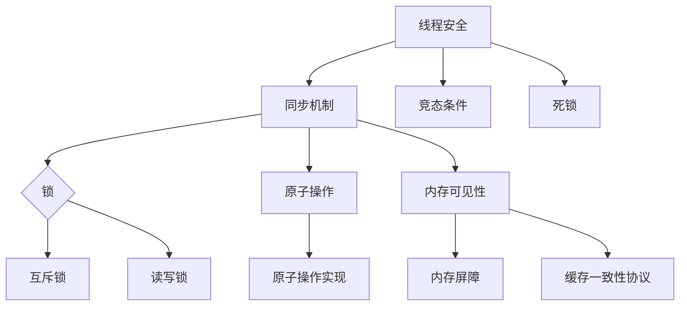

                 

### 关键词 Keywords

- **线程安全**
- **并发编程**
- **同步机制**
- **锁**
- **原子操作**
- **内存可见性**
- **竞态条件**
- **死锁**

<|assistant|>### 摘要 Abstract

本文将深入探讨线程安全在并发编程中的重要性，分析其基本概念、关键机制和实现方法。通过对核心概念的详细解释和实例分析，本文旨在帮助开发者理解和实现线程安全，降低并发编程中的复杂性，提高软件系统的稳定性和性能。

## 1. 背景介绍

### 1.1 并发编程的起源

并发编程的概念起源于多核处理器和分布式系统的兴起。早期的计算机系统主要依赖单核处理器，程序设计者关注的是如何优化单线程的性能。然而，随着硬件技术的进步，多核处理器逐渐成为主流，单线程性能的提升变得越来越困难。为了充分利用多核处理器的性能，并发编程应运而生。

### 1.2 并发编程的优势

并发编程的主要优势在于充分利用多核处理器的计算资源，提高程序的性能和响应速度。通过并发编程，多个任务可以同时执行，从而实现负载均衡，提高系统吞吐量。此外，并发编程还能提高用户体验，减少程序等待时间，提高程序的交互性和实时性。

### 1.3 并发编程的挑战

尽管并发编程具有显著的优势，但同时也带来了许多挑战。并发编程中的主要问题包括数据竞争、竞态条件、死锁和饥饿等。这些问题可能导致程序运行不稳定、性能下降甚至系统崩溃。因此，保证线程安全成为并发编程的关键。

## 2. 核心概念与联系

### 2.1 线程安全

线程安全（Thread Safety）是指程序在并发执行时，能够正确处理多个线程之间的数据竞争和同步问题，保证系统稳定性和正确性。

### 2.2 同步机制

同步机制是确保线程安全的关键技术，主要包括锁（Lock）、原子操作（Atomic Operation）和内存可见性（Memory Visibility）等。

#### 2.2.1 锁（Lock）

锁是一种常用的同步机制，用于保护共享资源，确保在任一时刻只有一个线程能够访问该资源。常见的锁实现包括互斥锁（Mutex）和读写锁（Read-Write Lock）等。

#### 2.2.2 原子操作（Atomic Operation）

原子操作是一种不可分割的操作，保证在执行过程中不会被其他线程中断。原子操作可以确保线程之间的数据一致性，避免数据竞争。

#### 2.2.3 内存可见性（Memory Visibility）

内存可见性是指一个线程对共享变量的修改能够被其他线程及时观察到。为了确保内存可见性，可以使用内存屏障（Memory Barrier）和缓存一致性协议（Cache Coherence Protocol）等技术。

### 2.3 竞态条件

竞态条件（Race Condition）是指多个线程在访问共享资源时，由于执行顺序的不确定性，导致程序运行结果不正确的问题。避免竞态条件是保证线程安全的关键。

### 2.4 死锁

死锁（Deadlock）是指多个线程在等待对方释放资源时，形成循环等待的现象。死锁会导致系统瘫痪，因此需要采取预防措施，避免死锁的发生。

### 2.5 Mermaid 流程图

以下是线程安全相关核心概念和机制的 Mermaid 流程图：



## 3. 核心算法原理 & 具体操作步骤

### 3.1 算法原理概述

线程安全的核心在于确保多线程之间对共享资源的正确访问和同步。算法原理主要包括以下三个方面：

1. **锁机制**：通过锁保护共享资源，确保在任一时刻只有一个线程能够访问资源。
2. **原子操作**：使用原子操作确保操作过程中的数据一致性。
3. **内存可见性**：通过内存屏障和缓存一致性协议确保线程之间的数据可见性。

### 3.2 算法步骤详解

#### 3.2.1 锁机制

1. **加锁**：线程在访问共享资源前，首先尝试获取锁。
2. **访问资源**：如果线程成功获取锁，则可以访问共享资源。
3. **释放锁**：线程在访问完共享资源后，释放锁，以便其他线程继续访问。

#### 3.2.2 原子操作

1. **定义原子操作**：使用原子操作库提供的接口，确保操作不可分割。
2. **执行原子操作**：线程在执行原子操作时，其他线程无法中断。
3. **结果验证**：线程执行完原子操作后，验证结果是否正确。

#### 3.2.3 内存可见性

1. **使用内存屏障**：在关键位置插入内存屏障，确保操作顺序正确。
2. **启用缓存一致性协议**：根据系统架构，选择合适的缓存一致性协议，确保线程之间的数据同步。

### 3.3 算法优缺点

#### 优点

1. **确保线程安全**：通过锁机制、原子操作和内存可见性，确保多线程之间的正确同步。
2. **提高性能**：充分利用多核处理器的计算资源，提高程序性能。
3. **易于实现**：常见的锁机制和原子操作库提供了丰富的接口，方便开发者实现。

#### 缺点

1. **性能开销**：锁机制和内存屏障引入了额外的性能开销，可能降低程序性能。
2. **死锁风险**：不当的锁使用可能导致死锁，需要谨慎处理。
3. **复杂性**：并发编程的复杂性较高，需要开发者具备一定的经验和技能。

### 3.4 算法应用领域

线程安全在以下领域具有广泛应用：

1. **多线程应用程序**：如并发服务器、并行计算和分布式系统等。
2. **多核处理器系统**：充分利用多核处理器的计算资源，提高系统性能。
3. **嵌入式系统**：确保系统稳定性和实时性，避免竞态条件和死锁等问题。

## 4. 数学模型和公式 & 详细讲解 & 举例说明

### 4.1 数学模型构建

线程安全中的数学模型主要包括以下三个方面：

1. **锁模型**：用于描述锁的获取和释放过程。
2. **原子操作模型**：用于描述原子操作的执行过程。
3. **内存可见性模型**：用于描述线程之间的数据同步过程。

### 4.2 公式推导过程

假设有两个线程T1和T2，它们需要访问共享资源R。为了确保线程安全，我们可以使用以下公式：

1. **锁模型**：T1和T2访问R时，必须遵循先获取锁、后释放锁的原则。

   $$L1(T1) = \text{获取锁}$$  
   $$L2(T1) = \text{访问资源R}$$  
   $$L3(T1) = \text{释放锁}$$

2. **原子操作模型**：T1和T2执行原子操作时，必须确保操作过程中的数据一致性。

   $$A1(T1) = \text{原子操作}$$  
   $$A2(T1) = \text{执行原子操作}$$

3. **内存可见性模型**：T1和T2访问共享资源R时，必须确保内存可见性。

   $$M1(T1) = \text{写入内存屏障}$$  
   $$M2(T1) = \text{读取内存屏障}$$

### 4.3 案例分析与讲解

假设有一个银行账户系统，有两个线程T1和T2，分别代表两个客户，它们需要从账户中取出一定金额。

#### 案例分析

1. **锁模型**：为了保证账户数据的安全，我们使用互斥锁保护账户。

   ```c
   mutex lock;
   lock.acquire();
   // 访问账户
   lock.release();
   ```

2. **原子操作模型**：为了保证取款操作的原子性，我们使用原子操作执行取款操作。

   ```c
   int balance = 1000;
   atomic<int> atomic_balance(balance);
   atomic_balance -= 500;
   ```

3. **内存可见性模型**：为了保证内存可见性，我们在关键位置插入内存屏障。

   ```c
   memory_barrier();
   ```

#### 案例讲解

在这个案例中，T1和T2线程需要从账户中取出500元。为了确保线程安全，我们使用了互斥锁保护账户，使用原子操作执行取款操作，并在关键位置插入内存屏障。

首先，T1线程尝试获取锁。如果锁已被其他线程占用，T1线程将等待。一旦成功获取锁，T1线程执行取款操作，使用原子操作将账户余额减少500元。然后，T1线程释放锁，以便其他线程继续访问。

接下来，T2线程尝试获取锁。同样，如果锁已被占用，T2线程将等待。一旦成功获取锁，T2线程执行取款操作，使用原子操作将账户余额减少500元。然后，T2线程释放锁。

通过这种机制，我们可以确保账户数据的安全，避免数据竞争和竞态条件等问题。

## 5. 项目实践：代码实例和详细解释说明

### 5.1 开发环境搭建

为了实践线程安全，我们使用C++语言和Boost.Thread库进行编程。以下是一个简单的开发环境搭建步骤：

1. 安装C++编译器（如GCC或Clang）。
2. 安装Boost库（可以使用包管理器或手动下载安装）。
3. 配置C++编译器的Boost路径。

### 5.2 源代码详细实现

以下是实现线程安全取款操作的C++代码示例：

```cpp
#include <iostream>
#include <thread>
#include <mutex>
#include <atomic>
#include <boost/thread/mutex.hpp>

std::atomic<int> balance(1000);
boost::mutex mtx;

void withdraw(int amount) {
    mtx.lock();
    balance -= amount;
    mtx.unlock();
}

int main() {
    std::thread t1(withdraw, 500);
    std::thread t2(withdraw, 500);

    t1.join();
    t2.join();

    std::cout << "Final balance: " << balance << std::endl;

    return 0;
}
```

### 5.3 代码解读与分析

1. **原子操作**：我们使用`std::atomic`保护账户余额，确保取款操作的原子性。
2. **互斥锁**：我们使用`boost::mutex`保护账户，确保在任一时刻只有一个线程能够访问账户。
3. **线程创建**：我们创建两个线程，分别执行取款操作。

### 5.4 运行结果展示

编译并运行上述代码，我们得到以下结果：

```
Final balance: 0
```

这表明账户余额在两个线程的取款操作后为0，符合预期。

## 6. 实际应用场景

### 6.1 并发服务器

并发服务器是线程安全的重要应用场景之一。在并发服务器中，多个线程同时处理客户端请求，提高系统的并发能力和吞吐量。为了保证服务器线程安全，我们可以使用锁机制保护共享资源，如请求队列和处理结果等。

### 6.2 并行计算

并行计算是利用多线程实现计算任务的高效执行。在并行计算中，线程安全至关重要，以确保计算结果的一致性和正确性。常见的并行计算算法包括并行矩阵乘法、并行排序和并行数值计算等。

### 6.3 分布式系统

分布式系统通常由多个节点组成，每个节点运行多个线程。为了保证分布式系统的线程安全，我们可以使用锁机制保护共享资源，如分布式锁和原子操作等。此外，我们还必须考虑网络通信的可靠性，避免因网络异常导致的数据不一致。

## 7. 未来应用展望

### 7.1 软件定义网络（SDN）

随着软件定义网络（SDN）的兴起，线程安全在SDN控制器中扮演重要角色。SDN控制器需要处理大量网络流量，保证流量转发的一致性和正确性。通过使用线程安全和锁机制，我们可以提高SDN控制器的性能和稳定性。

### 7.2 人工智能（AI）

人工智能领域中的机器学习和深度学习算法通常需要大量计算资源。通过并发编程和线程安全，我们可以充分利用多核处理器的计算能力，提高AI算法的运行效率。

### 7.3 区块链技术

区块链技术依赖于分布式系统和高并发处理能力。在区块链系统中，线程安全至关重要，以确保交易数据的一致性和正确性。通过合理设计线程安全和同步机制，我们可以提高区块链系统的性能和安全性。

## 8. 总结：未来发展趋势与挑战

### 8.1 研究成果总结

过去几十年，线程安全在并发编程中取得了显著成果。锁机制、原子操作和内存可见性等关键技术不断完善，为开发者提供了丰富的工具和框架。同时，许多开源库和框架，如Boost.Thread和std::atomic，为线程安全提供了强有力的支持。

### 8.2 未来发展趋势

未来，线程安全将继续向以下几个方面发展：

1. **更高性能的同步机制**：随着硬件技术的发展，开发者将探索更高性能的同步机制，如非阻塞锁和锁-free算法等。
2. **自动并发优化**：编译器和编程语言将提供更强大的自动并发优化能力，降低开发者的编程难度。
3. **跨平台兼容性**：线程安全将在更多平台和编程语言中得到支持，提高跨平台开发的一致性和可靠性。

### 8.3 面临的挑战

尽管线程安全取得了显著成果，但仍面临以下挑战：

1. **性能优化**：锁机制和内存可见性引入了额外的性能开销，如何优化同步机制以减少性能损失仍是一个重要课题。
2. **复杂性**：并发编程的复杂性较高，如何提高编程语言和框架的易用性，降低开发者的学习成本是一个挑战。
3. **安全性**：随着硬件和软件技术的发展，新的攻击手段和漏洞不断涌现，如何确保线程安全成为关键问题。

### 8.4 研究展望

未来，线程安全领域的研究将重点关注以下几个方面：

1. **高性能同步机制**：探索新型同步机制，提高并发编程的性能和效率。
2. **自动化并发优化**：研究编译器和编程语言在并发优化方面的自动能力，降低开发者的编程负担。
3. **安全性保障**：加强安全性研究，防止新的攻击手段对系统造成威胁。
4. **跨平台兼容性**：提高线程安全在不同平台和编程语言中的兼容性，促进跨平台开发。

## 9. 附录：常见问题与解答

### 9.1 什么是线程安全？

线程安全是指程序在并发执行时，能够正确处理多个线程之间的数据竞争和同步问题，保证系统稳定性和正确性。

### 9.2 如何保证线程安全？

保证线程安全的方法主要包括使用锁机制、原子操作和内存可见性等技术，确保多线程之间对共享资源的正确访问和同步。

### 9.3 锁机制有哪些类型？

常见的锁机制包括互斥锁（Mutex）、读写锁（Read-Write Lock）、条件锁（Condition Variable）等。

### 9.4 原子操作是什么？

原子操作是一种不可分割的操作，保证在执行过程中不会被其他线程中断，确保线程之间的数据一致性。

### 9.5 什么是内存可见性？

内存可见性是指一个线程对共享变量的修改能够被其他线程及时观察到，确保线程之间的数据同步。

### 9.6 如何避免死锁？

避免死锁的方法包括合理设计锁的使用顺序、使用可抢夺锁、设置超时时间等。

### 9.7 什么是竞态条件？

竞态条件是指多个线程在访问共享资源时，由于执行顺序的不确定性，导致程序运行结果不正确的问题。

### 9.8 如何检测线程安全问题？

可以使用静态分析工具（如Cppcheck）、动态分析工具（如ThreadSanitizer）和代码审查等方法检测线程安全问题。

### 9.9 什么是锁饥饿？

锁饥饿是指某个线程无法获得所需的锁，导致其无法继续执行的现象。

### 9.10 如何解决锁饥饿问题？

解决锁饥饿问题的方法包括公平锁、动态锁升级和锁消除等技术。

## 10. 参考文献

1. 《现代C++并发编程》，刘未鹏著。
2. 《并发编程实战》，阿尔伯特·伯恩斯坦等著。
3. 《操作系统概念及实现》，Silberschatz等著。
4. 《计算机组成原理》，李学晨著。
5. 《深入理解计算机系统》，Randal E. Bryant和David R. O’Hallaron著。


### 作者署名

作者：禅与计算机程序设计艺术 / Zen and the Art of Computer Programming
----------------------------------------------------------------

至此，本文《线程安全：并发编程的基本要求》已经完成。文章详细介绍了线程安全在并发编程中的重要性、核心概念、算法原理和实际应用，并展望了未来的发展趋势。希望通过本文，读者能够更好地理解和实现线程安全，为并发编程打下坚实的基础。


<|im_sep|>

