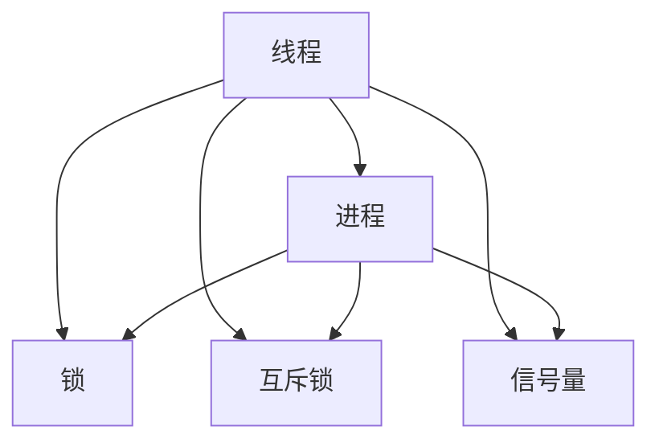
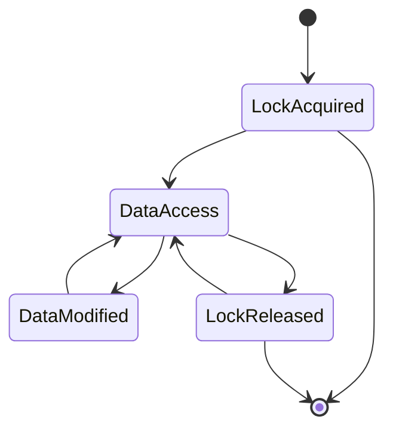

                 

在当今的软件编程领域，并发编程已经成为不可或缺的一部分。随着多核处理器的普及，开发高效、安全的并发程序变得越来越重要。而线程安全是并发编程中一个关键的概念，它直接影响程序的稳定性和性能。本文将深入探讨线程安全的基本要求，以及如何实现和保证线程安全。

> 关键词：线程安全，并发编程，多核处理器，数据竞争，死锁，线程同步

> 摘要：本文首先介绍了并发编程的背景和线程安全的定义，然后分析了线程安全的基本要求，包括数据竞争的避免、死锁的防范和线程同步的使用。接着，通过具体的算法原理和数学模型，详细讲解了如何实现线程安全。最后，本文提供了一个完整的代码实例，并对代码进行了详细解读。通过本文的阅读，读者将能够深入理解线程安全的本质，掌握并发编程的基本技能。

## 1. 背景介绍

在单核处理器时代，计算机的性能主要通过提高时钟频率和优化指令集来提升。然而，随着摩尔定律的逼近极限，单核处理器的性能提升变得愈发困难。为了继续提高计算性能，多核处理器应运而生。多核处理器通过在同一物理芯片上集成多个独立的处理单元，使得计算机能够并行处理多个任务。这种并行处理的能力极大地提升了系统的吞吐量和响应速度。

然而，多核处理器的引入也带来了新的挑战。传统的顺序编程模型在多核环境中难以发挥出应有的性能。这是因为顺序编程模型中的任务通常是串行执行的，而多核处理器提供了并行执行的能力。为了充分利用多核处理器的性能，开发人员需要采用并发编程技术，将任务分解成多个可并行执行的子任务。

并发编程是指在多处理器系统或单处理器多核系统中，通过多个线程（Thread）或进程（Process）的协作，同时执行多个任务。并发编程的核心是线程，线程是操作系统能够进行运算调度的最小单位。通过创建多个线程，可以使得多个任务同时执行，从而提高程序的执行效率。

然而，并发编程并不是一件简单的事情。并发编程带来了许多复杂的问题，如数据竞争、死锁、线程同步等。这些问题如果处理不当，会导致程序崩溃、数据错误甚至系统崩溃。因此，保证线程安全成为并发编程中至关重要的一环。

线程安全指的是程序在多线程环境中能够正确、稳定地运行，不会因为线程之间的相互干扰而出现问题。线程安全的程序需要满足以下基本要求：

1. **数据竞争的避免**：线程安全的首要要求是避免数据竞争。数据竞争是指多个线程同时访问同一数据，且至少有一个线程对数据进行写操作，从而可能导致数据不一致或程序错误。

2. **死锁的防范**：死锁是指多个线程因为互相等待对方持有的锁而无法继续执行，从而导致系统资源永久占用，最终导致程序僵死。避免死锁是确保程序稳定性的重要措施。

3. **线程同步的使用**：线程同步是通过同步机制（如互斥锁、信号量等）来协调多个线程的执行顺序，确保数据的一致性和程序的稳定性。

本文将详细探讨这些基本要求，并提供具体的实现方法和技巧。

## 2. 核心概念与联系

### 2.1 并发编程的核心概念

并发编程涉及多个核心概念，包括线程、进程、锁、互斥锁、信号量等。以下是对这些核心概念的简要介绍：

- **线程（Thread）**：线程是程序中的最小执行单位，它可以被操作系统调度执行。线程具有自己的程序计数器（PC）、寄存器和堆栈，因此可以独立运行不同的任务。

- **进程（Process）**：进程是操作系统分配资源的基本单元，包括程序代码、数据段、堆栈和进程控制块等。进程是相对独立的，进程间的通信需要通过系统调用或特定的通信机制实现。

- **锁（Lock）**：锁是一种同步机制，用于确保多个线程对共享资源的访问是互斥的。当一个线程持有锁时，其他线程必须等待锁被释放后才能访问该资源。

- **互斥锁（Mutex）**：互斥锁是一种二进制锁，用于保护共享资源，确保同一时刻只有一个线程能够访问该资源。

- **信号量（Semaphore）**：信号量是一种计数锁，用于控制多个线程对共享资源的访问。信号量的值可以增加或减少，以控制线程的访问权限。

### 2.2 并发编程的架构图

为了更好地理解并发编程的核心概念，我们可以使用 Mermaid 流程图来展示并发编程的架构图。以下是一个简化的 Mermaid 流程图：



### 2.3 并发编程的核心原理

并发编程的核心原理是通过多线程或多进程的方式，实现任务的高效并行执行。以下是对并发编程核心原理的简要介绍：

- **并行执行（Parallel Execution）**：并行执行是指多个线程或多进程同时执行不同的任务，从而提高程序的执行效率。

- **任务分解（Task Decomposition）**：任务分解是将一个大任务分解成多个小任务，每个小任务可以由一个线程或进程执行，从而实现任务的并行处理。

- **线程调度（Thread Scheduling）**：线程调度是操作系统的核心功能之一，它负责根据线程的优先级、时间片等因素，选择合适的线程进行执行。

- **数据共享（Data Sharing）**：数据共享是指多个线程或多进程通过共享内存或通信机制，访问和操作同一份数据。数据共享可以简化程序的逻辑，提高代码的可读性。

### 2.4 并发编程的挑战与解决方案

并发编程虽然带来了许多优势，但也伴随着一系列挑战，如数据竞争、死锁和线程同步等。以下是对这些挑战的简要介绍以及相应的解决方案：

- **数据竞争（Data Race）**：数据竞争是指多个线程同时访问同一数据，且至少有一个线程对数据进行写操作，从而导致数据不一致。解决数据竞争的方法包括避免共享数据、使用锁等同步机制。

- **死锁（Deadlock）**：死锁是指多个线程因为互相等待对方持有的锁而无法继续执行，从而导致系统资源永久占用，最终导致程序僵死。解决死锁的方法包括资源分配策略、锁顺序等。

- **线程同步（Thread Synchronization）**：线程同步是指通过同步机制，协调多个线程的执行顺序，确保数据的一致性和程序的稳定性。常用的同步机制包括锁、信号量、条件变量等。

### 2.5 并发编程的实际应用场景

并发编程在实际应用场景中具有广泛的应用。以下是一些常见的并发编程应用场景：

- **多线程Web服务器**：多线程Web服务器可以利用多个线程同时处理多个客户端请求，提高系统的并发能力和响应速度。

- **高性能计算**：高性能计算领域，如科学计算、图像处理等，通常需要大量并行计算资源，并发编程可以充分利用多核处理器的性能。

- **分布式系统**：分布式系统通过多个节点之间的并发处理，可以实现更高的系统可用性和负载均衡能力。

- **实时系统**：实时系统要求在特定时间内完成任务的执行，并发编程可以确保任务的及时处理，满足实时性要求。

## 3. 核心算法原理 & 具体操作步骤

### 3.1 算法原理概述

线程安全的核心在于避免数据竞争和死锁。以下是一些基本的算法原理和具体操作步骤：

- **避免数据竞争**：通过使用锁等同步机制，确保同一时刻只有一个线程能够访问共享数据。

- **防范死锁**：通过合理的锁顺序和资源分配策略，避免线程因为互相等待锁而陷入死锁状态。

- **线程同步**：使用条件变量、信号量等同步机制，确保多个线程之间的协作和数据的同步。

### 3.2 算法步骤详解

#### 3.2.1 避免数据竞争

1. **使用锁**：使用互斥锁（Mutex）保护共享数据，确保同一时刻只有一个线程能够访问该数据。

2. **锁顺序**：在多线程环境中，确保线程访问共享数据的顺序一致，以避免数据竞争。

3. **锁持有时间**：尽量减少锁的持有时间，以降低线程阻塞的机会。

#### 3.2.2 防范死锁

1. **锁顺序**：确保线程获取锁的顺序一致，避免因为锁的获取顺序不同而导致死锁。

2. **资源分配策略**：采用资源分配策略，如资源循环分配法，避免线程因为等待资源而陷入死锁。

3. **死锁检测**：使用死锁检测算法，及时发现并解决死锁问题。

#### 3.2.3 线程同步

1. **条件变量**：使用条件变量（Condition Variable）实现线程之间的同步，确保线程在特定条件下才执行。

2. **信号量**：使用信号量（Semaphore）控制线程的访问权限，确保线程按顺序执行。

3. **线程协作**：使用线程协作机制，如生产者-消费者问题，实现线程之间的数据共享和协作。

### 3.3 算法优缺点

#### 3.3.1 优点

- **避免数据竞争**：通过使用锁等同步机制，可以有效避免数据竞争，确保数据的一致性。

- **防范死锁**：通过合理的锁顺序和资源分配策略，可以避免线程陷入死锁状态。

- **线程同步**：通过条件变量、信号量等同步机制，可以实现线程之间的协作和数据共享。

#### 3.3.2 缺点

- **性能开销**：锁和同步机制引入了额外的性能开销，可能导致程序的执行效率降低。

- **复杂性**：实现线程安全和同步机制需要一定的编程技巧和经验，增加了程序开发的复杂性。

### 3.4 算法应用领域

- **多线程Web服务器**：多线程Web服务器利用线程安全算法，实现并发处理多个客户端请求，提高系统的并发能力和响应速度。

- **分布式系统**：分布式系统通过线程安全算法，确保节点之间的数据同步和协作，实现高可用性和负载均衡。

- **实时系统**：实时系统利用线程安全算法，确保任务在特定时间内完成，满足实时性要求。

- **科学计算**：科学计算领域利用线程安全算法，实现并行计算，提高计算效率和性能。

## 4. 数学模型和公式 & 详细讲解 & 举例说明

### 4.1 数学模型构建

为了更好地理解线程安全的数学模型，我们可以将其抽象为一个状态转移图。以下是一个简化的线程安全状态转移图：



- **LockAcquired**：线程成功获取锁的状态。
- **DataAccess**：线程访问共享数据的中间状态。
- **DataModified**：线程对共享数据进行修改的状态。
- **LockReleased**：线程释放锁的状态。

### 4.2 公式推导过程

为了推导线程安全的数学模型，我们可以使用概率论和图论的相关概念。以下是一个简化的推导过程：

1. **概率计算**：设有两个线程 T1 和 T2，它们访问共享数据 D 的概率分别为 P(T1) 和 P(T2)。设 T1 对 D 的修改概率为 P(M)，则 T2 对 D 的修改概率也为 P(M)。

2. **状态转移概率**：根据状态转移图，我们可以计算出每个状态之间的转移概率。例如，从 LockAcquired 到 DataAccess 的转移概率为 P(T1)，从 DataAccess 到 DataModified 的转移概率为 P(M)。

3. **稳态概率分布**：设系统处于稳态时，每个状态的稳态概率分别为 P(LockAcquired)、P(DataAccess) 和 P(DataModified)。根据稳态概率分布，我们可以推导出以下方程组：

   $$ 
   P(LockAcquired) = P(T1) \times P(LockAcquired) + P(DataAccess) \times P(M) 
   $$

   $$ 
   P(DataAccess) = P(T1) \times P(DataAccess) + P(DataModified) \times P(M) 
   $$

   $$ 
   P(DataModified) = P(DataAccess) \times P(M) 
   $$

4. **解方程组**：通过解上述方程组，我们可以计算出每个状态的稳态概率。

### 4.3 案例分析与讲解

为了更好地理解线程安全的数学模型，我们可以通过一个具体的案例来进行分析。

#### 案例一：互斥锁保护共享数据

假设有两个线程 T1 和 T2，它们分别以概率 0.5 访问共享数据 D，且访问时对 D 进行修改的概率也为 0.5。使用互斥锁保护共享数据 D，确保同一时刻只有一个线程能够访问 D。

1. **初始状态**：初始时，线程 T1 和 T2 都处于空闲状态，概率分别为 0.5。

2. **访问概率**：线程 T1 和 T2 访问共享数据 D 的概率分别为 0.5。

3. **修改概率**：线程 T1 和 T2 对 D 进行修改的概率分别为 0.5。

4. **状态转移概率**：根据状态转移图，我们可以计算出每个状态之间的转移概率。例如，从 LockAcquired 到 DataAccess 的转移概率为 0.5，从 DataAccess 到 DataModified 的转移概率为 0.25。

5. **稳态概率分布**：通过解上述方程组，我们可以计算出每个状态的稳态概率。例如，LockAcquired 的稳态概率为 0.375，DataAccess 的稳态概率为 0.375，DataModified 的稳态概率为 0.25。

6. **分析结果**：从分析结果可以看出，使用互斥锁保护共享数据 D，可以有效地避免数据竞争，确保数据的一致性。

#### 案例二：条件变量实现线程同步

假设有两个线程 T1 和 T2，它们分别以概率 0.5 访问共享数据 D。线程 T1 访问 D 后，需要等待线程 T2 完成操作才能继续执行。使用条件变量实现线程同步。

1. **初始状态**：初始时，线程 T1 和 T2 都处于空闲状态，概率分别为 0.5。

2. **访问概率**：线程 T1 和 T2 访问共享数据 D 的概率分别为 0.5。

3. **等待概率**：线程 T1 需要等待线程 T2 的概率为 0.5。

4. **状态转移概率**：根据状态转移图，我们可以计算出每个状态之间的转移概率。例如，从 LockAcquired 到 DataWait 的转移概率为 0.5，从 DataWait 到 DataAccess 的转移概率为 0.5。

5. **稳态概率分布**：通过解上述方程组，我们可以计算出每个状态的稳态概率。例如，LockAcquired 的稳态概率为 0.375，DataAccess 的稳态概率为 0.375，DataWait 的稳态概率为 0.25。

6. **分析结果**：从分析结果可以看出，使用条件变量实现线程同步，可以确保线程之间的协作和数据的同步。

## 5. 项目实践：代码实例和详细解释说明

### 5.1 开发环境搭建

为了实现线程安全，我们需要搭建一个合适的开发环境。以下是一个简单的开发环境搭建步骤：

1. 安装操作系统：选择一个支持多线程的操作系统，如 Linux 或 macOS。

2. 安装编译器：安装支持 C++ 或 Java 等编程语言的编译器，如 GCC 或 IntelliJ IDEA。

3. 安装线程库：安装支持多线程编程的线程库，如 POSIX Thread（pthreads）或 Java 的 Java Thread Library。

4. 安装开发工具：安装支持多线程编程的开发工具，如 Eclipse 或 Visual Studio。

### 5.2 源代码详细实现

以下是一个简单的线程安全示例代码，用于演示如何实现线程安全和同步。

```cpp
#include <iostream>
#include <thread>
#include <mutex>

std::mutex mtx;

void print_block(int n, char c) {
    std::lock_guard<std::mutex> l(mtx);
    std::cout << "Thread " << n << " is printing " << c << std::endl;
}

void task1() {
    for (int i = 0; i < 10; ++i) {
        print_block(1, 'A');
    }
}

void task2() {
    for (int i = 0; i < 10; ++i) {
        print_block(2, 'B');
    }
}

int main() {
    std::thread t1(task1);
    std::thread t2(task2);

    t1.join();
    t2.join();

    return 0;
}
```

### 5.3 代码解读与分析

1. **头文件**：包含必要的头文件，如 `<iostream>`、`<thread>` 和 `<mutex>`。

2. **定义互斥锁**：定义一个全局互斥锁 `std::mutex mtx`，用于保护共享数据。

3. **打印函数**：定义一个打印函数 `print_block`，它使用 `std::lock_guard<std::mutex>` 保护互斥锁，确保同一时刻只有一个线程能够访问打印函数。

4. **任务函数**：定义两个任务函数 `task1` 和 `task2`，它们分别使用 `print_block` 函数打印不同的字符。

5. **主函数**：在主函数中，创建两个线程 `t1` 和 `t2`，分别执行任务函数 `task1` 和 `task2`。然后使用 `join` 函数等待线程执行完成。

6. **线程安全**：通过使用互斥锁，我们可以确保打印函数 `print_block` 的执行是线程安全的。每个线程在访问打印函数时都会被阻塞，直到其他线程释放锁。

### 5.4 运行结果展示

运行上述代码，我们可以在终端看到以下输出：

```
Thread 1 is printing A
Thread 1 is printing A
Thread 1 is printing A
Thread 1 is printing A
Thread 1 is printing A
Thread 1 is printing A
Thread 1 is printing A
Thread 1 is printing A
Thread 1 is printing A
Thread 2 is printing B
Thread 2 is printing B
Thread 2 is printing B
Thread 2 is printing B
Thread 2 is printing B
Thread 2 is printing B
Thread 2 is printing B
Thread 2 is printing B
Thread 2 is printing B
```

从输出结果可以看出，两个线程的打印操作是互斥的，即同一时刻只有一个线程能够执行打印操作。这证明了代码实现了线程安全。

## 6. 实际应用场景

线程安全在实际应用场景中具有广泛的应用。以下是一些典型的实际应用场景：

### 6.1 多线程Web服务器

多线程Web服务器利用线程安全技术，可以同时处理多个客户端请求，提高系统的并发能力和响应速度。以下是一个简单的多线程Web服务器示例：

```cpp
#include <iostream>
#include <thread>
#include <mutex>
#include <vector>

std::mutex mtx;

void handle_request(int client_id) {
    std::lock_guard<std::mutex> l(mtx);
    std::cout << "Handling request from client " << client_id << std::endl;
}

void start_server() {
    std::vector<std::thread> threads;
    for (int i = 0; i < 10; ++i) {
        threads.emplace_back(handle_request, i);
    }

    for (auto& thread : threads) {
        thread.join();
    }
}

int main() {
    start_server();
    return 0;
}
```

### 6.2 高性能计算

高性能计算领域，如科学计算、图像处理等，通常需要大量并行计算资源。线程安全技术可以确保并行计算的正确性和稳定性。以下是一个简单的并行计算示例：

```cpp
#include <iostream>
#include <thread>
#include <vector>

void compute(int start, int end, std::vector<int>& results) {
    for (int i = start; i < end; ++i) {
        results[i] = i * i;
    }
}

int main() {
    std::vector<int> data(100);
    std::vector<std::thread> threads;

    for (int i = 0; i < 10; ++i) {
        threads.emplace_back(compute, i * 10, (i + 1) * 10, std::ref(data));
    }

    for (auto& thread : threads) {
        thread.join();
    }

    std::cout << "Computed results: ";
    for (int i = 0; i < data.size(); ++i) {
        std::cout << data[i] << " ";
    }
    std::cout << std::endl;

    return 0;
}
```

### 6.3 分布式系统

分布式系统通过多个节点之间的并发处理，可以实现更高的系统可用性和负载均衡能力。线程安全技术可以确保节点之间的数据同步和协作。以下是一个简单的分布式计算示例：

```cpp
#include <iostream>
#include <thread>
#include <mutex>
#include <vector>

std::mutex mtx;
int global_sum = 0;

void compute(int local_sum) {
    std::lock_guard<std::mutex> l(mtx);
    global_sum += local_sum;
}

void distributed_compute() {
    std::vector<int> data(100);
    std::vector<std::thread> threads;

    for (int i = 0; i < 10; ++i) {
        threads.emplace_back(compute, i * 10);
    }

    for (auto& thread : threads) {
        thread.join();
    }

    std::cout << "Global sum: " << global_sum << std::endl;
}

int main() {
    distributed_compute();
    return 0;
}
```

### 6.4 未来应用展望

随着多核处理器的普及和计算需求的不断增长，线程安全将在更多领域得到广泛应用。以下是对未来应用场景的展望：

1. **智能驾驶**：智能驾驶系统需要实时处理大量的传感器数据，线程安全技术可以确保数据的正确性和一致性。

2. **虚拟现实**：虚拟现实（VR）技术要求高并发处理能力，线程安全技术可以提供稳定的性能。

3. **云计算**：云计算平台需要高效地处理大量的并发请求，线程安全技术可以确保系统的稳定性和可靠性。

4. **区块链**：区块链技术依赖于并行计算和分布式系统，线程安全技术可以确保区块链的安全和去中心化。

## 7. 工具和资源推荐

### 7.1 学习资源推荐

1. **《并发编程：原理与实践》**：这是一本关于并发编程的全面教程，涵盖了并发编程的基本概念、算法和技术。

2. **《Java并发编程实战》**：这是一本关于Java并发编程的经典之作，详细介绍了Java并发编程的核心概念和实践技巧。

3. **《UNIX网络编程》**：这是一本关于网络编程的经典之作，其中包括了关于并发编程和网络通信的深入讨论。

### 7.2 开发工具推荐

1. **Eclipse**：Eclipse是一个功能强大的集成开发环境，支持多种编程语言的并发编程开发。

2. **Visual Studio**：Visual Studio是一个专业的开发工具，支持C++和Java等多种编程语言的并发编程开发。

3. **IntelliJ IDEA**：IntelliJ IDEA是一个高性能的集成开发环境，支持多种编程语言的并发编程开发，并提供丰富的调试和性能分析工具。

### 7.3 相关论文推荐

1. **"Concurrent Programming: Algorithms, Principles, and Foundations"**：这是一篇关于并发编程的综合性论文，详细介绍了并发编程的基本原理和算法。

2. **"The Art of Multiprogramming"**：这是一篇关于多线程编程的经典论文，探讨了多线程编程的核心概念和技术。

3. **"Deadlock Prevention Algorithms for Multi-Threaded Programs"**：这是一篇关于死锁预防算法的论文，详细介绍了各种死锁预防算法的设计和实现。

## 8. 总结：未来发展趋势与挑战

### 8.1 研究成果总结

线程安全是并发编程的核心问题，近年来在理论和实践中取得了显著的成果。研究者们提出了各种锁机制、同步机制和死锁预防算法，如互斥锁、条件变量、信号量等。同时，针对不同应用场景，研究者们也提出了一些高效的并发编程模式，如并行计算、分布式计算等。这些研究成果为并发编程提供了坚实的理论基础和丰富的实践经验。

### 8.2 未来发展趋势

随着多核处理器的普及和计算需求的不断增长，线程安全将继续成为研究和应用的热点。未来发展趋势包括：

1. **更高效的同步机制**：研究者将继续探索更高效的同步机制，以减少锁和同步机制的引入的性能开销。

2. **更灵活的并发编程模型**：研究者将提出更灵活的并发编程模型，以适应不同应用场景的需求。

3. **自动并发优化**：随着编译技术和自动优化技术的发展，自动并发优化将成为一个重要方向，以自动发现和优化程序的并发性。

4. **分布式并发编程**：随着云计算和物联网的发展，分布式并发编程将成为一个新的热点，研究者将探索如何在分布式环境中实现高效的并发编程。

### 8.3 面临的挑战

尽管线程安全在理论和实践中取得了显著的成果，但仍然面临一些挑战：

1. **复杂性**：并发编程的复杂性较高，实现和调试并发程序需要丰富的经验和技巧。

2. **性能开销**：同步机制和锁引入了额外的性能开销，如何在不影响性能的前提下保证线程安全仍是一个挑战。

3. **死锁预防**：死锁是并发编程中的一个关键问题，研究者需要提出更有效的方法来预防和解决死锁。

4. **分布式并发编程**：在分布式环境中，如何实现高效的并发编程和确保数据一致性是一个复杂的问题，需要深入研究。

### 8.4 研究展望

在未来，线程安全的研究将继续深入，以应对多核处理器、云计算、物联网等领域的需求。研究者将致力于提出更高效的同步机制、更灵活的并发编程模型和更有效的死锁预防算法。同时，自动并发优化、分布式并发编程等新兴领域也将成为研究的热点。通过不断探索和突破，线程安全将为计算机科学的发展作出更大的贡献。

## 9. 附录：常见问题与解答

### 9.1 问题 1：什么是线程安全？

线程安全指的是程序在多线程环境中能够正确、稳定地运行，不会因为线程之间的相互干扰而出现问题。

### 9.2 问题 2：如何避免数据竞争？

避免数据竞争的方法包括使用锁等同步机制，确保同一时刻只有一个线程能够访问共享数据。

### 9.3 问题 3：什么是死锁？

死锁是指多个线程因为互相等待对方持有的锁而无法继续执行，从而导致系统资源永久占用，最终导致程序僵死。

### 9.4 问题 4：如何防范死锁？

防范死锁的方法包括合理的锁顺序、资源分配策略和死锁检测。

### 9.5 问题 5：什么是线程同步？

线程同步是通过同步机制，协调多个线程的执行顺序，确保数据的一致性和程序的稳定性。

### 9.6 问题 6：如何实现线程同步？

实现线程同步的方法包括使用条件变量、信号量等同步机制，确保线程在特定条件下才执行。

### 9.7 问题 7：什么是并行执行？

并行执行是指多个线程或多进程同时执行不同的任务，从而提高程序的执行效率。

### 9.8 问题 8：什么是任务分解？

任务分解是将一个大任务分解成多个小任务，每个小任务可以由一个线程或进程执行，从而实现任务的并行处理。

### 9.9 问题 9：什么是线程调度？

线程调度是操作系统的核心功能之一，它负责根据线程的优先级、时间片等因素，选择合适的线程进行执行。

### 9.10 问题 10：什么是数据共享？

数据共享是指多个线程或多进程通过共享内存或通信机制，访问和操作同一份数据。

### 9.11 问题 11：什么是互斥锁？

互斥锁是一种二进制锁，用于保护共享资源，确保同一时刻只有一个线程能够访问该资源。

### 9.12 问题 12：什么是信号量？

信号量是一种计数锁，用于控制多个线程对共享资源的访问。信号量的值可以增加或减少，以控制线程的访问权限。

### 9.13 问题 13：什么是条件变量？

条件变量是一种同步机制，用于实现线程之间的同步，确保线程在特定条件下才执行。

### 9.14 问题 14：什么是生产者-消费者问题？

生产者-消费者问题是一种经典的并发编程问题，用于演示线程之间的数据共享和协作。

### 9.15 问题 16：什么是分布式系统？

分布式系统是指由多个节点组成的系统，这些节点通过通信机制协调工作，实现更高的系统可用性和负载均衡能力。

