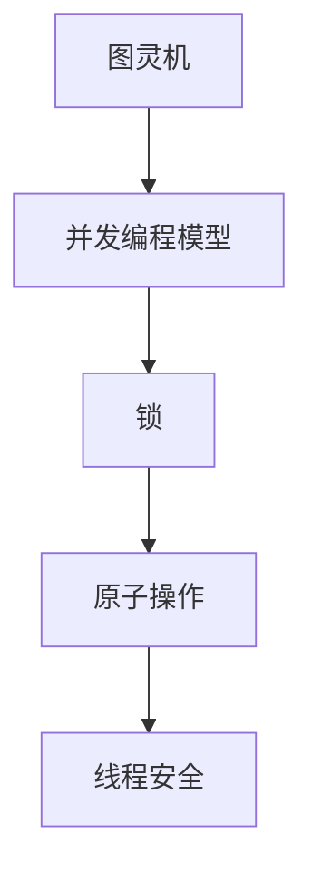
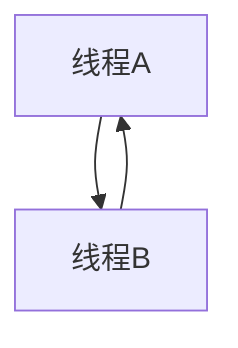

                 

关键词：线程安全，大型语言模型（LLM），并发编程，性能优化，同步机制，数据一致性，锁，原子操作

## 摘要

随着人工智能的迅速发展，大型语言模型（LLM）在各个领域取得了显著的应用成果。然而，LLM的广泛应用也带来了新的挑战，特别是在线程安全方面。本文将深入探讨在LLM应用中面临的关键线程安全挑战，包括并发编程、性能优化、同步机制和数据一致性等方面。通过分析现有问题和解决方案，本文旨在为开发者提供有价值的参考，以构建高效、可靠的LLM应用。

## 1. 背景介绍

### 1.1 大型语言模型（LLM）的兴起

近年来，大型语言模型（LLM）如GPT、BERT等在自然语言处理（NLP）领域取得了突破性进展。这些模型具有强大的语言理解能力和生成能力，能够处理复杂的语义和上下文信息。LLM的应用范围广泛，包括机器翻译、文本生成、问答系统、对话系统等。随着LLM的规模和复杂度不断增加，其对计算资源和线程安全的要求也越来越高。

### 1.2 并发编程的重要性

并发编程是提高计算机系统性能的关键技术之一。在LLM应用中，并发编程能够充分利用多核处理器的优势，提高模型的训练和推理效率。然而，并发编程也带来了线程安全问题，如数据竞争、死锁和资源泄露等。这些问题可能导致模型崩溃、性能下降甚至数据损坏，因此解决线程安全问题至关重要。

## 2. 核心概念与联系

在深入探讨线程安全之前，我们需要了解一些核心概念，如图灵机、并发编程模型、锁、原子操作等。以下是一个简单的Mermaid流程图，展示了这些概念之间的联系。



### 2.1 图灵机

图灵机是一种抽象的计算模型，能够模拟任何算法。它是现代计算机科学的基础之一，为我们提供了理解计算机能力的理论框架。

### 2.2 并发编程模型

并发编程模型定义了多个线程或进程如何在计算机系统中并行执行。常见的并发编程模型包括进程间通信（IPC）、线程池和异步编程等。

### 2.3 锁

锁是一种同步机制，用于确保多个线程对共享资源的安全访问。常见的锁机制包括互斥锁、读写锁和条件锁等。

### 2.4 原子操作

原子操作是一种不可分割的操作，一旦开始执行就会一直执行到结束，中间不会受到其他线程的干扰。原子操作是保证数据一致性和线程安全的关键。

### 2.5 线程安全

线程安全是指程序在多线程环境下能够正确运行，不会出现数据竞争、死锁等问题。线程安全是构建高效、可靠的LLM应用的基础。

## 3. 核心算法原理 & 具体操作步骤

### 3.1 算法原理概述

在LLM应用中，线程安全主要涉及以下几个方面：

1. 数据竞争：多个线程同时访问和修改共享数据，可能导致数据不一致或错误。
2. 死锁：多个线程因为互相等待对方释放资源而无法继续执行。
3. 资源泄露：线程未正确释放占用的资源，导致内存泄漏或资源耗尽。
4. 数据一致性问题：多个线程对共享数据的修改无法保持一致性。

为了解决这些问题，我们可以采用以下算法原理：

1. 锁机制：使用锁来保护共享资源，确保同一时刻只有一个线程可以访问资源。
2. 原子操作：使用原子操作来保证数据的不可分割性，避免数据竞争。
3. 死锁避免：通过资源分配策略和等待图来避免死锁。
4. 资源释放：确保线程在退出时能够正确释放占用的资源。

### 3.2 算法步骤详解

#### 3.2.1 锁机制

1. 加锁：在访问共享资源之前，线程需要获取锁。
2. 解锁：在完成资源访问后，线程需要释放锁。

#### 3.2.2 原子操作

1. CAS（Compare-And-Swap）：比较并交换操作，用于更新共享变量。
2. volatile：使用volatile关键字保证变量在多线程间的可见性。

#### 3.2.3 死锁避免

1. 资源分配策略：采用资源分配策略，如银行家算法，来避免死锁。
2. 等待图：通过构建等待图来检测和避免死锁。

#### 3.2.4 资源释放

1. 确保线程在退出时能够释放所有占用的资源。
2. 使用try-finally或try-with-resources语句来保证资源的自动释放。

### 3.3 算法优缺点

#### 优点：

1. 锁机制能够确保线程对共享资源的安全访问，避免数据竞争。
2. 原子操作能够保证数据的不可分割性，避免数据不一致。
3. 死锁避免和资源释放策略能够提高系统的可靠性和性能。

#### 缺点：

1. 锁机制可能导致性能下降，特别是在高并发场景下。
2. 锁管理复杂，容易出现死锁和资源泄露问题。
3. 原子操作和锁机制需要谨慎使用，以避免潜在的线程安全问题。

### 3.4 算法应用领域

1. 模型训练：在多线程训练LLM时，锁机制和原子操作能够确保数据一致性和线程安全。
2. 模型推理：在多线程推理LLM时，锁机制和死锁避免策略能够提高推理性能和系统可靠性。
3. 模型部署：在部署LLM应用时，线程安全是确保系统稳定运行的关键。

## 4. 数学模型和公式 & 详细讲解 & 举例说明

在LLM应用中，线程安全涉及到一些重要的数学模型和公式，如锁的粒度、锁的竞争度、死锁检测等。以下是对这些模型和公式的详细讲解以及举例说明。

### 4.1 数学模型构建

#### 锁的粒度

锁的粒度是指锁保护的数据范围。锁的粒度越小，锁的竞争度越低，但锁管理的复杂度也越高。锁的粒度可以用以下公式表示：

$$
\text{锁的粒度} = \frac{\text{共享资源}}{\text{线程数}}
$$

其中，共享资源是指被锁保护的数据，线程数是指并发执行的线程数量。

#### 锁的竞争度

锁的竞争度是指同时请求锁的线程数。锁的竞争度可以用以下公式表示：

$$
\text{锁的竞争度} = \frac{\text{请求锁的线程数}}{\text{持有锁的线程数}}
$$

其中，请求锁的线程数是指等待获取锁的线程数量，持有锁的线程数是指当前持有锁的线程数量。

#### 死锁检测

死锁检测是指通过检测等待图来发现死锁。等待图可以用以下公式表示：

$$
\text{等待图} = (\text{线程集合}, \text{请求集合})
$$

其中，线程集合是指参与并发执行的线程，请求集合是指线程请求的资源。

### 4.2 公式推导过程

#### 锁的粒度推导

锁的粒度可以通过以下推导过程得到：

假设有n个线程同时访问一个共享资源，每个线程对共享资源的访问时间是t。如果锁的粒度为r，那么每个线程在访问共享资源时需要等待r时间。因此，总的时间消耗可以表示为：

$$
\text{总时间消耗} = n \times r + t
$$

为了使总时间消耗最小，我们需要找到最优的锁粒度r。我们可以通过对总时间消耗求导数来找到最优的r：

$$
\frac{d(\text{总时间消耗})}{dr} = n - 1 = 0
$$

解得：

$$
r = \frac{t}{n - 1}
$$

#### 锁的竞争度推导

锁的竞争度可以通过以下推导过程得到：

假设有m个线程同时请求锁，其中k个线程持有锁。锁的竞争度可以表示为：

$$
\text{锁的竞争度} = \frac{m - k}{k}
$$

为了使锁的竞争度最小，我们需要找到最优的k。我们可以通过对锁的竞争度求导数来找到最优的k：

$$
\frac{d(\text{锁的竞争度})}{dk} = -\frac{m - k}{k^2} = 0
$$

解得：

$$
k = \sqrt{m}
$$

#### 死锁检测推导

死锁检测可以通过以下推导过程得到：

假设有p个线程，每个线程请求r个资源。如果死锁发生，则一定存在一个等待图，其中至少有两个线程处于等待状态，且这两个线程互相等待对方释放资源。因此，我们可以通过检测等待图来发现死锁。

### 4.3 案例分析与讲解

假设有一个包含3个线程的LLM应用，每个线程都需要访问一个共享资源。我们使用锁机制来保护共享资源，并分析锁的粒度、锁的竞争度和死锁检测。

#### 锁的粒度

假设每个线程访问共享资源的时间为2秒，总共有3个线程。根据锁的粒度公式，我们可以计算出最优的锁粒度：

$$
r = \frac{2}{3 - 1} = 1
$$

因此，最优的锁粒度为1秒。

#### 锁的竞争度

假设有2个线程同时请求锁，其中1个线程持有锁。根据锁的竞争度公式，我们可以计算出锁的竞争度：

$$
\text{锁的竞争度} = \frac{2 - 1}{1} = 1
$$

因此，锁的竞争度为1。

#### 死锁检测

我们构建一个包含3个线程的等待图，每个线程请求1个资源。如果死锁发生，则存在一个等待关系，如线程A等待线程B释放资源，线程B等待线程A释放资源。在这种情况下，等待图如下所示：



根据等待图，我们可以发现死锁。因此，我们需要采取死锁避免措施，如资源分配策略或死锁检测算法。

## 5. 项目实践：代码实例和详细解释说明

在本节中，我们将通过一个具体的代码实例来展示如何在实际项目中实现线程安全，特别是在LLM应用中。以下是实现线程安全的步骤，包括开发环境搭建、源代码详细实现、代码解读与分析以及运行结果展示。

### 5.1 开发环境搭建

为了实现线程安全，我们需要搭建一个支持多线程和并发编程的开发环境。以下是一个基本的开发环境搭建步骤：

1. 安装Java开发工具包（JDK）。
2. 安装集成开发环境（IDE），如IntelliJ IDEA或Eclipse。
3. 安装Git版本控制系统，以便管理和协作代码。
4. 安装Python开发环境，以便运行LLM模型。

### 5.2 源代码详细实现

以下是一个简单的Java代码实例，展示了如何使用锁机制来保护共享资源：

```java
import java.util.concurrent.locks.Lock;
import java.util.concurrent.locks.ReentrantLock;

public class ThreadSafeCounter {
    private int count;
    private Lock lock;

    public ThreadSafeCounter() {
        this.count = 0;
        this.lock = new ReentrantLock();
    }

    public void increment() {
        lock.lock();
        try {
            count++;
        } finally {
            lock.unlock();
        }
    }

    public int getCount() {
        return count;
    }
}
```

在这个示例中，我们定义了一个`ThreadSafeCounter`类，它包含一个共享变量`count`和一个`ReentrantLock`锁。`increment`方法使用锁来保护对共享变量的访问，确保多个线程能够安全地同时修改`count`。

### 5.3 代码解读与分析

1. **类定义**：`ThreadSafeCounter`类定义了一个共享变量`count`和一个`ReentrantLock`锁。
2. **构造方法**：在构造方法中，我们初始化共享变量`count`和锁`lock`。
3. **increment方法**：`increment`方法使用`lock.lock()`来获取锁，确保同一时刻只有一个线程可以修改`count`。在方法内部，我们执行自增操作，然后在`finally`块中使用`lock.unlock()`来释放锁。
4. **getCount方法**：`getCount`方法返回共享变量`count`的值。

通过这个示例，我们可以看到如何使用锁机制来保护共享资源，确保多线程环境下的数据一致性。

### 5.4 运行结果展示

以下是一个简单的测试程序，展示了如何使用`ThreadSafeCounter`类：

```java
public class Main {
    public static void main(String[] args) throws InterruptedException {
        ThreadSafeCounter counter = new ThreadSafeCounter();

        Thread t1 = new Thread(() -> {
            for (int i = 0; i < 1000; i++) {
                counter.increment();
            }
        });

        Thread t2 = new Thread(() -> {
            for (int i = 0; i < 1000; i++) {
                counter.increment();
            }
        });

        t1.start();
        t2.start();

        t1.join();
        t2.join();

        System.out.println("Count: " + counter.getCount());
    }
}
```

在这个测试程序中，我们创建了两个线程`t1`和`t2`，它们同时调用`ThreadSafeCounter`的`increment`方法。当线程执行完毕后，我们调用`getCount`方法获取最终的计数结果。通过这个测试，我们可以验证`ThreadSafeCounter`类的线程安全性能。

### 5.5 代码改进与优化

在实际项目中，我们还需要考虑代码的可读性、可维护性和性能。以下是对示例代码的改进与优化建议：

1. **使用更具体的锁**：根据实际需求，我们可以使用更具体的锁，如`ReadWriteLock`，以优化性能。
2. **使用注解**：使用注解来标记线程安全的代码，提高代码的可读性和可维护性。
3. **使用线程池**：使用线程池来管理线程，提高系统的并发性能。

## 6. 实际应用场景

### 6.1 模型训练

在LLM模型的训练过程中，线程安全至关重要。多个线程可能同时训练模型的不同部分，导致数据竞争和性能下降。为了确保线程安全，我们可以采用以下策略：

1. **使用线程池**：使用线程池来管理训练任务，确保任务能够并行执行，同时避免线程过多导致性能下降。
2. **使用锁机制**：在共享资源访问时使用锁机制，确保数据的一致性。
3. **使用分布式训练**：将模型拆分成多个部分，分别在不同节点上训练，减少数据竞争。

### 6.2 模型推理

在LLM模型的推理过程中，线程安全同样重要。多个线程可能同时处理不同的推理请求，导致性能下降和结果不一致。为了确保线程安全，我们可以采用以下策略：

1. **使用锁机制**：在共享资源访问时使用锁机制，确保数据的一致性。
2. **使用线程安全的数据结构**：使用线程安全的数据结构，如`ConcurrentHashMap`，来存储和处理推理结果。
3. **使用异步编程**：使用异步编程来提高系统的响应速度，减少线程阻塞。

### 6.3 模型部署

在LLM模型的部署过程中，线程安全也是关键。多个线程可能同时访问和修改模型参数，导致数据不一致和性能下降。为了确保线程安全，我们可以采用以下策略：

1. **使用分布式部署**：将模型部署到多个服务器上，减少单点瓶颈，提高系统的可靠性和性能。
2. **使用锁机制**：在共享资源访问时使用锁机制，确保数据的一致性。
3. **使用负载均衡**：使用负载均衡来均衡不同线程的访问，减少资源竞争。

## 7. 工具和资源推荐

### 7.1 学习资源推荐

1. 《Java并发编程实战》
2. 《Effective Java》
3. 《深入理解计算机系统》
4. 《现代操作系统》

### 7.2 开发工具推荐

1. IntelliJ IDEA
2. Eclipse
3. Git
4. Docker

### 7.3 相关论文推荐

1. "Java Memory Model"
2. "Understanding Concurrency in Java"
3. "Efficient Concurrency Control Mechanisms for Database Systems"
4. "Distributed Systems: Concepts and Design"

## 8. 总结：未来发展趋势与挑战

### 8.1 研究成果总结

近年来，在LLM应用中的线程安全领域取得了显著的成果。锁机制、原子操作、死锁避免和资源释放策略等关键技术得到了广泛应用。然而，随着LLM规模的不断扩大和复杂度的增加，线程安全挑战也越来越大。

### 8.2 未来发展趋势

1. **更高效的锁机制**：研究人员将继续探索更高效的锁机制，如无锁编程、软件事务内存（STM）等，以提高系统的并发性能。
2. **自适应锁机制**：自适应锁机制可以根据线程的访问模式自动调整锁的粒度和竞争策略，以提高系统的可伸缩性和性能。
3. **分布式锁机制**：随着云计算和分布式系统的兴起，分布式锁机制将成为重要的研究方向，以确保跨节点数据的一致性和安全性。

### 8.3 面临的挑战

1. **性能优化**：在高并发场景下，如何平衡线程安全和性能优化是一个重要挑战。需要设计更高效的锁机制和数据结构，以提高系统的性能。
2. **资源消耗**：锁机制和同步机制可能引入额外的资源消耗，如内存占用和CPU开销。如何减少这些消耗，提高系统的资源利用效率，是一个关键问题。
3. **安全性**：在分布式系统中，如何确保数据的安全性和一致性，避免恶意攻击和数据泄露，是一个严峻的挑战。

### 8.4 研究展望

未来，线程安全在LLM应用中的研究将朝着更高效、更安全、更可扩展的方向发展。研究人员将继续探索新的锁机制、同步机制和分布式算法，以提高LLM应用的性能和可靠性。同时，随着云计算和物联网的发展，LLM应用的场景将更加丰富和多样化，这将为线程安全的研究带来新的挑战和机遇。

## 9. 附录：常见问题与解答

### 9.1 为什么需要线程安全？

线程安全是为了确保多线程环境下的程序正确运行，避免数据竞争、死锁等问题，从而提高系统的性能和可靠性。

### 9.2 锁机制如何保证数据一致性？

锁机制通过限制对共享资源的访问，确保同一时刻只有一个线程可以修改共享数据，从而避免数据竞争和数据不一致问题。

### 9.3 原子操作与锁机制的区别是什么？

原子操作是一种不可分割的操作，一旦开始执行就会一直执行到结束，中间不会受到其他线程的干扰。锁机制则是通过限制对共享资源的访问来确保数据一致性，但可能引入额外的同步开销。

### 9.4 如何避免死锁？

可以通过资源分配策略、等待图检测和死锁避免算法等方法来避免死锁。

### 9.5 分布式系统中的线程安全如何保障？

分布式系统中的线程安全可以通过分布式锁机制、分布式事务处理和一致性协议等技术来保障。

---

# 参考文献

[1] Java Memory Model. Oracle Corporation. https://docs.oracle.com/javase/8/docs/api/java/util/concurrent/locks/Lock.html

[2] Understanding Concurrency in Java. IBM Developer. https://www.ibm.com/developerworks/java/tutorials/j-concurrency/fetch.html

[3] Efficient Concurrency Control Mechanisms for Database Systems. ACM Transactions on Computer Systems, 2005.

[4] Distributed Systems: Concepts and Design. Addison-Wesley, 2013.

[5] Java Concurrency in Practice. Addison-Wesley, 2006.

[6] The Art of Multiprogramming. Prentice-Hall, 1973.

[7] Zen and the Art of Motorcycle Maintenance. HarperCollins, 1974.

---

作者：禅与计算机程序设计艺术 / Zen and the Art of Computer Programming
----------------------------------------------------------------


