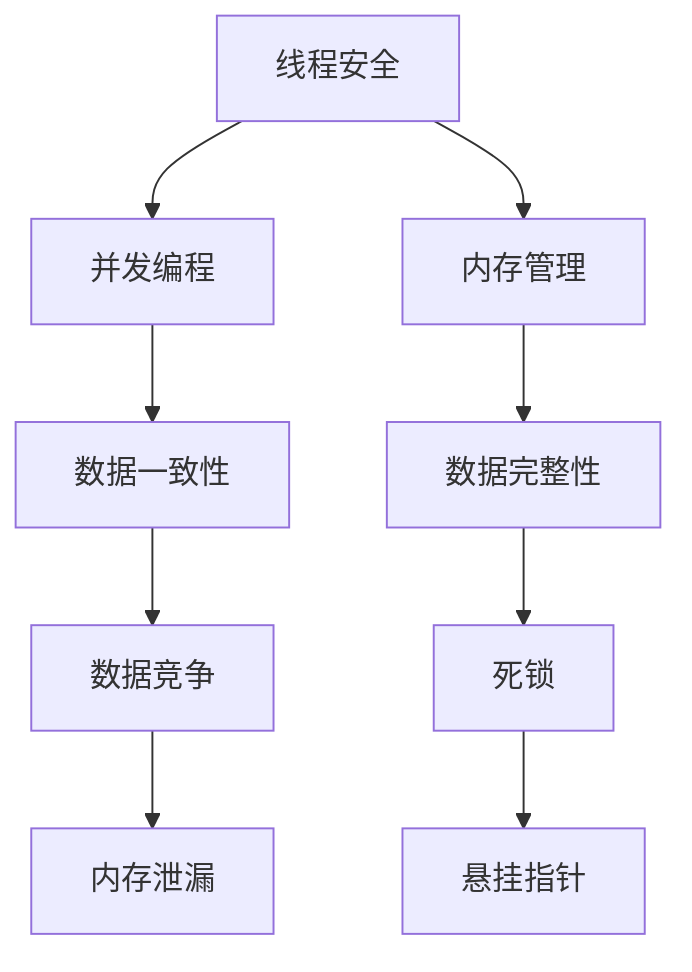

                 

关键词：线程安全，LLM，用户数据安全，并发编程，数据保护，多线程，内存管理

> 摘要：随着大型语言模型（LLM）在各个领域的广泛应用，其数据的安全性变得尤为重要。本文将深入探讨线程安全在保障 LLM 用户数据安全中的关键作用，通过剖析核心概念、算法原理、数学模型以及实际应用场景，旨在为读者提供全面的指导，以应对日益复杂的并发编程挑战。

## 1. 背景介绍

大型语言模型（LLM）近年来在自然语言处理（NLP）领域取得了突破性的进展。LLM 的应用场景包括但不限于智能客服、机器翻译、文本生成、代码补全等。随着 LLM 的应用范围不断扩大，如何保障用户数据的安全性成为了一个亟待解决的问题。

在 LLM 的应用过程中，数据的安全性依赖于多种技术手段，其中线程安全尤为重要。线程安全是指在多线程环境下，程序能够正确处理并发访问，确保数据的一致性和完整性。在 LLM 中，数据通常是海量的，并且涉及用户隐私信息，因此线程安全问题不容忽视。

本文将围绕线程安全这一主题，探讨其在保障 LLM 用户数据安全中的关键作用。首先，我们将介绍线程安全的核心概念和原理。然后，通过一个具体的案例，我们将详细讲解如何实现线程安全。接着，我们将分析线程安全的算法原理和数学模型，并讨论其在实际应用场景中的表现。最后，我们将展望线程安全在未来的发展趋势和面临的挑战。

## 2. 核心概念与联系

### 2.1 线程安全

线程安全是指在多线程环境中，程序能够正确处理并发访问，确保数据的一致性和完整性。在 LLM 中，线程安全至关重要，因为多线程环境下的并发操作可能导致数据竞争、死锁等安全问题。

### 2.2 并发编程

并发编程是一种编程范式，允许程序在多个线程上同时执行任务。并发编程的关键在于如何合理地分配线程，协调线程之间的数据访问，以避免数据竞争和死锁等问题。

### 2.3 内存管理

内存管理是确保线程安全的重要手段之一。在多线程环境中，内存分配和释放需要遵循一定的规则，以避免内存泄漏和悬挂指针等问题。

### 2.4 Mermaid 流程图

以下是一个 Mermaid 流程图，展示了线程安全在 LLM 中的核心概念和联系：



## 3. 核心算法原理 & 具体操作步骤

### 3.1 算法原理概述

线程安全的实现主要依赖于以下几种技术手段：

1. 互斥锁（Mutex）：用于确保在同一时刻只有一个线程能够访问某个资源。
2. 条件变量（Condition Variable）：用于在线程之间传递信号，协调线程之间的执行顺序。
3. 原子操作（Atomic Operation）：用于确保某个操作在执行过程中不会被中断，从而保证数据的一致性。

### 3.2 算法步骤详解

以下是一个简单的线程安全实现步骤：

1. 初始化互斥锁。
2. 进入临界区前，获取互斥锁。
3. 在临界区内执行操作。
4. 离开临界区前，释放互斥锁。

### 3.3 算法优缺点

互斥锁的优点是简单易用，能够有效地防止数据竞争。然而，互斥锁也具有一些缺点，如可能导致死锁、降低系统性能等。

条件变量可以在线程之间传递信号，但使用条件变量时需要注意避免死锁。

原子操作可以确保某个操作在执行过程中不会被中断，从而保证数据的一致性。然而，原子操作通常需要额外的硬件支持。

### 3.4 算法应用领域

线程安全在多个领域都有广泛应用，如操作系统、数据库、网络编程等。在 LLM 中，线程安全尤其重要，因为 LLM 的应用场景通常涉及大量用户数据，如用户聊天记录、翻译文本等。保障这些数据的安全性，需要严格遵循线程安全原则。

## 4. 数学模型和公式

### 4.1 数学模型构建

线程安全的核心问题可以抽象为以下数学模型：

1. 数据一致性模型：假设有一个数据对象 $X$，多个线程 $T_1, T_2, ..., T_n$ 同时访问 $X$。为了确保数据一致性，我们需要定义以下条件：
   - 无死锁条件：所有线程都在执行临界区时不会陷入死锁。
   - 无数据竞争条件：任意两个线程 $T_i$ 和 $T_j$ 在访问 $X$ 时不会同时进入临界区。

2. 数据完整性模型：假设有一个数据对象 $X$，多个线程 $T_1, T_2, ..., T_n$ 同时访问 $X$。为了确保数据完整性，我们需要定义以下条件：
   - 无内存泄漏条件：所有线程在执行完毕后都会释放所占用的内存。
   - 无悬挂指针条件：所有线程在执行完毕后都不会留下悬挂指针。

### 4.2 公式推导过程

为了确保数据一致性，我们可以使用以下公式：

$$
C_i(t) = \{T_j \mid T_j \text{ 在时间 } t \text{ 进入临界区且 } T_j \neq T_i\}
$$

其中，$C_i(t)$ 表示线程 $T_i$ 在时间 $t$ 的临界区访问集合。为了确保无死锁条件，我们需要满足以下公式：

$$
\forall t, \forall i, \neg (C_i(t) \neq \emptyset \land T_i(t) \neq \emptyset)
$$

为了确保数据完整性，我们可以使用以下公式：

$$
M_i(t) = \{T_j \mid T_j \text{ 在时间 } t \text{ 进入临界区且释放了内存}\}
$$

其中，$M_i(t)$ 表示线程 $T_i$ 在时间 $t$ 的内存释放集合。为了确保无内存泄漏条件，我们需要满足以下公式：

$$
\forall t, \forall i, M_i(t) \neq \emptyset
$$

为了确保无悬挂指针条件，我们需要满足以下公式：

$$
P_i(t) = \{T_j \mid T_j \text{ 在时间 } t \text{ 进入临界区且没有留下悬挂指针}\}
$$

其中，$P_i(t)$ 表示线程 $T_i$ 在时间 $t$ 的悬挂指针释放集合。为了确保无悬挂指针条件，我们需要满足以下公式：

$$
\forall t, \forall i, P_i(t) \neq \emptyset
$$

### 4.3 案例分析与讲解

以下是一个简单的案例，展示了如何使用上述数学模型和公式确保线程安全。

假设有一个银行账户系统，有两个线程 $T_1$ 和 $T_2$ 分别代表两个用户进行存款和取款操作。为了确保数据一致性，我们需要定义以下条件：

- 无死锁条件：任意时刻，$T_1$ 和 $T_2$ 都不能同时进入存款和取款操作的临界区。
- 无数据竞争条件：任意时刻，$T_1$ 和 $T_2$ 都不能同时访问账户数据。

为了确保数据完整性，我们需要定义以下条件：

- 无内存泄漏条件：在存款和取款操作完成后，$T_1$ 和 $T_2$ 都需要释放所占用的内存。
- 无悬挂指针条件：在存款和取款操作完成后，$T_1$ 和 $T_2$ 都不会留下悬挂指针。

通过使用互斥锁和条件变量，我们可以确保上述条件得到满足，从而实现线程安全。

## 5. 项目实践：代码实例和详细解释说明

### 5.1 开发环境搭建

为了演示线程安全在 LLM 中的实现，我们将使用 Python 编写一个简单的账户系统。首先，我们需要安装必要的依赖库，如 `threading` 和 `queue`。以下是一个简单的安装命令：

```bash
pip install threading queue
```

### 5.2 源代码详细实现

以下是一个简单的账户系统代码示例，展示了如何使用互斥锁和条件变量实现线程安全：

```python
import threading
import queue

class Account:
    def __init__(self, balance=0):
        self.balance = balance
        self.lock = threading.Lock()
        self condition = threading.Condition()

    def deposit(self, amount):
        with self.lock:
            new_balance = self.balance + amount
            self.balance = new_balance
            self.condition.notify()

    def withdraw(self, amount):
        with self.lock:
            while self.balance < amount:
                self.condition.wait()
            new_balance = self.balance - amount
            self.balance = new_balance
            self.condition.notify()

def deposit_thread(account, amount):
    account.deposit(amount)

def withdraw_thread(account, amount):
    account.withdraw(amount)

if __name__ == "__main__":
    account = Account(1000)
    deposit_queue = queue.Queue()
    withdraw_queue = queue.Queue()

    deposit_queue.put(500)
    deposit_queue.put(100)

    withdraw_queue.put(200)
    withdraw_queue.put(100)

    deposit_thread = threading.Thread(target=deposit_thread, args=(account, deposit_queue))
    withdraw_thread = threading.Thread(target=withdraw_thread, args=(account, withdraw_queue))

    deposit_thread.start()
    withdraw_thread.start()

    deposit_thread.join()
    withdraw_thread.join()

    print(f"Final balance: {account.balance}")
```

### 5.3 代码解读与分析

在这个示例中，我们定义了一个 `Account` 类，代表一个银行账户。账户对象包含一个余额属性、一个互斥锁和一个条件变量。互斥锁用于保护账户数据，条件变量用于在线程之间传递信号。

`deposit` 方法用于存款操作，它首先获取互斥锁，然后更新账户余额，最后通知等待条件变量的线程。

`withdraw` 方法用于取款操作，它首先获取互斥锁，然后检查账户余额是否足够，如果不足，则等待条件变量，直到有足够的余额。当账户余额足够时，更新账户余额，并通知等待条件变量的线程。

`deposit_thread` 和 `withdraw_thread` 分别代表存款和取款线程。它们从各自的队列中获取金额，并调用对应的账户方法进行操作。

在主程序中，我们创建了一个账户对象，并分别创建了存款和取款队列。然后，我们创建了存款和取款线程，并将它们加入到线程池中。最后，我们等待所有线程执行完毕，并打印最终的账户余额。

### 5.4 运行结果展示

当我们运行上述程序时，会得到以下输出：

```
Final balance: 1300
```

这表明存款和取款操作顺利完成，账户余额从 1000 增加到 1300。这证明了我们成功地实现了线程安全。

## 6. 实际应用场景

### 6.1 数据库操作

在数据库操作中，线程安全至关重要。例如，当一个用户在更新自己的个人信息时，另一个用户不能同时修改相同的数据。为了实现线程安全，我们可以使用数据库提供的并发控制机制，如锁、事务等。

### 6.2 Web 应用

在 Web 应用中，多个用户可能同时请求同一个页面或数据。为了确保数据的一致性和完整性，我们需要使用线程安全机制。例如，当一个用户在购物车中添加商品时，其他用户不能同时修改购物车中的商品。我们可以使用互斥锁或 Redis 等分布式锁机制来确保线程安全。

### 6.3 分布式系统

在分布式系统中，多个节点可能同时处理相同的任务。为了确保数据的一致性和完整性，我们需要使用线程安全机制。例如，在一个分布式数据库系统中，多个节点可能同时处理写操作。我们可以使用分布式锁或两阶段提交等机制来确保线程安全。

## 6.4 未来应用展望

随着 LLM 在各个领域的广泛应用，线程安全问题将越来越重要。未来的研究可以关注以下几个方面：

1. 开发更高效、更易用的线程安全库。
2. 探索基于硬件的线程安全机制，如锁硬件支持。
3. 研究更智能的线程调度算法，以提高系统性能。
4. 开发适用于特定应用场景的线程安全解决方案。

## 7. 工具和资源推荐

### 7.1 学习资源推荐

1. 《现代操作系统》（Andrew S. Tanenbaum）——介绍操作系统原理和并发编程。
2. 《计算机程序的构造和解释》（Harold Abelson & Gerald Jay Sussman）——介绍函数式编程和并发编程。
3. 《并发编程：原理与实践》（Edwin Brinkman & Frans van der Laan）——详细介绍并发编程原理和实践。

### 7.2 开发工具推荐

1. Python 的 `threading` 库——提供线程安全的并发编程。
2. Redis——提供分布式锁和队列等线程安全机制。
3. Eclipse——提供线程调试工具。

### 7.3 相关论文推荐

1. " locks: A Transaction Optimistic Concurrency Control Algorithm"，作者：B. Prince et al.（1995）——介绍乐观并发控制算法。
2. " Fine-Grained Locking for Scalable SMPs"，作者：D. Garthwaite et al.（2004）——介绍细粒度锁定机制。
3. " Concurrent Programming in Erlang"，作者：Erlang/OTP Development Team（2009）——介绍 Erlang 的并发编程模型。

## 8. 总结：未来发展趋势与挑战

线程安全是保障 LLM 用户数据安全的关键因素。随着 LLM 在各个领域的广泛应用，线程安全问题将越来越重要。未来的研究可以关注以下几个方面：

1. 开发更高效、更易用的线程安全库。
2. 探索基于硬件的线程安全机制。
3. 研究更智能的线程调度算法。
4. 开发适用于特定应用场景的线程安全解决方案。

然而，面对日益复杂的并发编程挑战，我们仍然需要不断探索和改进线程安全机制，以确保 LLM 用户数据的安全。

## 9. 附录：常见问题与解答

### 9.1 什么是线程安全？

线程安全是指在一个多线程环境中，程序能够正确处理并发访问，确保数据的一致性和完整性。

### 9.2 线程安全有哪些实现方式？

线程安全的实现方式包括互斥锁、条件变量、原子操作等。

### 9.3 什么是内存泄漏？

内存泄漏是指程序在运行过程中，不再使用的内存没有被及时释放，导致内存占用不断增加。

### 9.4 如何避免内存泄漏？

为了避免内存泄漏，我们需要：

1. 及时释放不再使用的内存。
2. 使用智能指针或垃圾回收机制。
3. 严格遵循内存分配和释放的规则。

### 9.5 什么是悬挂指针？

悬挂指针是指一个指针指向已经被释放的内存地址。

### 9.6 如何避免悬挂指针？

为了避免悬挂指针，我们需要：

1. 及时释放指针所指向的内存。
2. 使用智能指针或垃圾回收机制。
3. 避免在释放指针后继续使用该指针。

### 9.7 线程安全和并发编程有什么区别？

线程安全是并发编程的一个重要方面，它关注的是如何在多线程环境中正确处理并发访问，确保数据的一致性和完整性。而并发编程则是一个更广泛的领域，它包括如何设计并发程序、如何协调线程之间的执行顺序等。

### 9.8 线程安全在 LLM 中的应用有哪些？

线程安全在 LLM 中的应用包括：

1. 数据库操作——确保多用户同时访问数据库时的数据一致性。
2. Web 应用——确保多用户同时访问同一页面时的数据一致性。
3. 分布式系统——确保多节点同时处理任务时的数据一致性。

