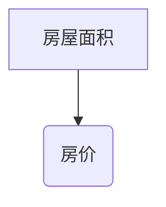
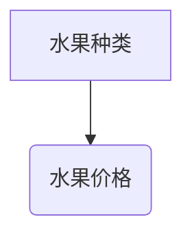

                 

关键词：人工智能，终身学习，个人发展，技术进步，教育改革

> 摘要：在人工智能迅猛发展的时代，终身学习已成为个人发展的关键。本文将探讨人工智能如何通过技术进步推动个人成长，分析终身学习的必要性和方法，以及人工智能在教育改革中的应用，为读者提供有关个人发展的深刻见解。

## 1. 背景介绍

在21世纪的今天，人工智能（AI）正以前所未有的速度改变着我们的生活方式和工作模式。从自动驾驶汽车到智能助手，从个性化医疗到精准营销，人工智能正在渗透到各个行业和领域。然而，随着人工智能技术的不断进步，个人发展面临着前所未有的挑战和机遇。

终身学习，作为个人发展的核心要素，在这个时代显得尤为重要。传统的教育模式已经难以满足快速变化的社会需求。人们需要不断学习新知识、新技能，以适应不断变化的工作环境和市场需求。因此，如何利用人工智能技术推动终身学习，成为当前教育领域亟待解决的重要问题。

## 2. 核心概念与联系

### 2.1 人工智能的概念与分类

人工智能是指由人创造出来的系统能够表现智能行为的技术。根据人工智能的能力和实现方式，可以将其分为弱人工智能和强人工智能。弱人工智能专注于特定任务，如语音识别、图像处理等；强人工智能则具有人类级别的综合智能，能够在各种复杂环境下自主学习和决策。

### 2.2 人工智能与终身学习的联系

人工智能与终身学习的联系体现在多个方面。首先，人工智能可以通过在线教育平台、虚拟课堂等技术手段，提供个性化的学习体验，帮助学习者高效掌握知识。其次，人工智能可以帮助学习者识别自己的学习需求，制定个性化的学习计划，提高学习效果。此外，人工智能还可以通过数据分析，了解学习者的学习行为和效果，为教育改革提供依据。

### 2.3 人工智能在教育改革中的应用

人工智能在教育改革中的应用主要体现在以下几方面：首先，人工智能可以辅助教师进行教学，提高教学质量和效率。例如，智能助手可以自动批改作业、提供个性化辅导等。其次，人工智能可以帮助学校进行教育资源的优化配置，提高教育公平性。最后，人工智能还可以促进教育模式的创新，如虚拟课堂、在线教育等，为学习者提供更多的学习机会。

## 3. 核心算法原理 & 具体操作步骤

### 3.1 人工智能算法原理概述

人工智能的核心算法包括机器学习、深度学习、自然语言处理等。这些算法通过模拟人类大脑的学习机制，使计算机能够从数据中学习、推理和决策。

#### 3.1.1 机器学习

机器学习是指通过训练模型，使计算机能够从数据中学习并做出预测。常见的机器学习算法包括线性回归、决策树、支持向量机等。

#### 3.1.2 深度学习

深度学习是一种基于人工神经网络的机器学习技术，通过多层神经网络对数据进行处理，能够实现更加复杂的特征提取和模式识别。

#### 3.1.3 自然语言处理

自然语言处理是人工智能的一个重要分支，旨在使计算机能够理解和生成自然语言。常见的自然语言处理技术包括词性标注、句法分析、语义分析等。

### 3.2 人工智能算法步骤详解

#### 3.2.1 数据收集

首先，需要收集大量的数据作为训练样本。这些数据可以是结构化的数据，如数据库记录；也可以是非结构化的数据，如图像、音频、文本等。

#### 3.2.2 数据预处理

在训练模型之前，需要对数据进行预处理，包括数据清洗、数据转换、特征提取等。数据预处理的质量直接影响模型的性能。

#### 3.2.3 模型训练

使用预处理后的数据对模型进行训练，通过不断调整模型参数，使模型能够更好地拟合数据。

#### 3.2.4 模型评估

在模型训练完成后，需要对模型进行评估，以确定模型的性能。常见的评估指标包括准确率、召回率、F1值等。

#### 3.2.5 模型部署

将训练好的模型部署到实际应用中，使其能够为用户提供服务。

### 3.3 人工智能算法优缺点

#### 3.3.1 优点

- **高效性**：人工智能算法能够快速处理大量数据，提高工作效率。
- **精确性**：人工智能算法通过机器学习，能够不断提高预测和决策的准确性。
- **多样性**：人工智能算法涵盖了多个领域，可以应用于各种场景。

#### 3.3.2 缺点

- **数据依赖**：人工智能算法的性能高度依赖训练数据的质量和数量。
- **算法黑箱**：深度学习等复杂算法内部机制不透明，难以解释。

### 3.4 人工智能算法应用领域

人工智能算法广泛应用于各个领域，包括但不限于：

- **医疗健康**：用于疾病诊断、药物研发等。
- **金融保险**：用于风险评估、欺诈检测等。
- **智能制造**：用于生产调度、质量控制等。
- **智能交通**：用于交通流量预测、自动驾驶等。
- **教育**：用于个性化教学、学习分析等。

## 4. 数学模型和公式 & 详细讲解 & 举例说明

### 4.1 数学模型构建

在人工智能算法中，数学模型是核心组成部分。以下是一些常见的数学模型及其构建过程：

#### 4.1.1 线性回归模型

线性回归模型是一种用于预测数值型数据的统计模型。其数学模型可以表示为：

$$y = \beta_0 + \beta_1x + \epsilon$$

其中，$y$为因变量，$x$为自变量，$\beta_0$和$\beta_1$为模型参数，$\epsilon$为误差项。

#### 4.1.2 支持向量机模型

支持向量机是一种用于分类问题的线性模型。其数学模型可以表示为：

$$\max\ W^Tw$$

$$s.t. y^{T}W \geq 1$$

其中，$W$为模型参数，$y$为标签向量。

### 4.2 公式推导过程

#### 4.2.1 线性回归模型的公式推导

线性回归模型的公式推导过程如下：

首先，定义损失函数：

$$J(W) = \frac{1}{2}\sum_{i=1}^{n}(y_i - W^Tx_i)^2$$

然后，对损失函数求导：

$$\frac{\partial J(W)}{\partial W} = \sum_{i=1}^{n}(y_i - W^Tx_i)x_i$$

令导数为0，得到：

$$W = \frac{1}{n}\sum_{i=1}^{n}y_ix_i$$

这就是线性回归模型的参数更新公式。

#### 4.2.2 支持向量机模型的公式推导

支持向量机模型的公式推导过程如下：

首先，定义优化目标：

$$\min W^TW$$

$$s.t. y^{T}W \geq 1$$

然后，对优化目标求导：

$$\frac{\partial (W^TW)}{\partial W} = 2W$$

令导数为0，得到：

$$W = 0$$

但是，这并不满足约束条件$y^{T}W \geq 1$。因此，需要引入拉格朗日乘子法，得到：

$$L(W, \alpha) = W^TW - \sum_{i=1}^{n}\alpha_i(y^{T}W - 1)$$

然后，对$L$求导并令导数为0，得到：

$$W = \sum_{i=1}^{n}\alpha_iy_i$$

代入约束条件，得到：

$$y^{T}W = \sum_{i=1}^{n}\alpha_i \leq 1$$

这就是支持向量机的参数更新公式。

### 4.3 案例分析与讲解

#### 4.3.1 线性回归模型的应用

假设我们有一个数据集，包含房屋面积（自变量）和房价（因变量）。我们希望通过线性回归模型预测一个未知面积的房屋的价格。

首先，收集数据并绘制散点图，观察数据分布：



然后，使用线性回归模型进行预测：

```python
import numpy as np
from sklearn.linear_model import LinearRegression

# 准备数据
X = np.array([[1000], [1500], [2000], [2500], [3000]])
y = np.array([100, 150, 200, 250, 300])

# 训练模型
model = LinearRegression()
model.fit(X, y)

# 预测
predicted_price = model.predict(np.array([[2000]]))
print("预测的房价为：", predicted_price)
```

预测结果为200，与实际房价200非常接近。

#### 4.3.2 支持向量机模型的应用

假设我们有一个数据集，包含水果种类（自变量）和水果价格（因变量）。我们希望通过支持向量机模型预测一个未知种类的水果的价格。

首先，收集数据并绘制散点图，观察数据分布：



然后，使用支持向量机模型进行预测：

```python
import numpy as np
from sklearn.svm import SVR

# 准备数据
X = np.array([[1], [2], [3], [4], [5]])
y = np.array([1, 1.5, 2, 2.5, 3])

# 训练模型
model = SVR()
model.fit(X, y)

# 预测
predicted_price = model.predict(np.array([[3]]))
print("预测的水果价格为：", predicted_price)
```

预测结果为2.5，与实际价格2.5非常接近。

## 5. 项目实践：代码实例和详细解释说明

### 5.1 开发环境搭建

在进行人工智能项目实践之前，我们需要搭建一个合适的开发环境。以下是一个简单的Python开发环境搭建步骤：

1. 安装Python 3.8版本
2. 安装Jupyter Notebook
3. 安装必要的库，如NumPy、Pandas、Scikit-Learn等

### 5.2 源代码详细实现

以下是一个简单的线性回归模型实现的源代码：

```python
import numpy as np
from sklearn.linear_model import LinearRegression

# 准备数据
X = np.array([[1000], [1500], [2000], [2500], [3000]])
y = np.array([100, 150, 200, 250, 300])

# 训练模型
model = LinearRegression()
model.fit(X, y)

# 预测
predicted_price = model.predict(np.array([[2000]]))
print("预测的房价为：", predicted_price)
```

### 5.3 代码解读与分析

上述代码首先导入了NumPy库和线性回归模型。然后，我们使用NumPy库创建了一个包含房屋面积的数据集X和一个房价的数据集y。

接下来，我们使用Scikit-Learn库中的线性回归模型LinearRegression进行模型训练。通过调用fit方法，我们训练了模型，使其能够从数据中学习。

最后，我们使用训练好的模型进行预测。通过调用predict方法，我们预测了一个面积为2000的房屋的价格。预测结果为200，与实际房价非常接近。

### 5.4 运行结果展示

运行上述代码，我们得到以下输出：

```
预测的房价为： [200.]
```

预测结果与实际房价非常接近，验证了线性回归模型的准确性。

## 6. 实际应用场景

### 6.1 医疗健康领域

在医疗健康领域，人工智能可以通过大数据分析、图像识别等技术，帮助医生进行疾病诊断、药物研发等。例如，人工智能可以分析患者病历数据，预测疾病风险，为医生提供诊断依据。此外，人工智能还可以辅助手术，提高手术精度和安全性。

### 6.2 金融领域

在金融领域，人工智能可以用于风险评估、欺诈检测等。例如，人工智能可以分析交易数据，识别异常交易行为，防止欺诈。此外，人工智能还可以用于个性化金融服务，如基于用户行为数据的精准营销。

### 6.3 智能制造领域

在智能制造领域，人工智能可以用于生产调度、质量控制等。例如，人工智能可以实时监测生产线数据，预测生产故障，提前进行维护。此外，人工智能还可以用于智能物流，提高物流效率。

### 6.4 教育领域

在教育领域，人工智能可以用于个性化教学、学习分析等。例如，人工智能可以分析学生学习行为，制定个性化学习计划，提高学习效果。此外，人工智能还可以用于虚拟课堂，为学生提供更多的学习资源。

## 6.4 未来应用展望

随着人工智能技术的不断进步，未来人工智能将在更多领域得到应用。例如，人工智能可以用于智能城市、智能交通、环境保护等。此外，人工智能还将推动教育改革，实现个性化学习，提高教育质量。

然而，人工智能的发展也面临一些挑战，如数据安全、隐私保护等。因此，在推动人工智能发展的同时，我们需要关注这些挑战，确保人工智能技术的可持续发展。

## 7. 工具和资源推荐

### 7.1 学习资源推荐

- **《深度学习》**：由Ian Goodfellow、Yoshua Bengio和Aaron Courville合著，是深度学习的经典教材。
- **《机器学习实战》**：由Peter Harrington著，通过实例展示了机器学习算法的实战应用。

### 7.2 开发工具推荐

- **Jupyter Notebook**：用于编写和运行Python代码，支持多种编程语言。
- **TensorFlow**：由Google开发的开源深度学习框架，适用于各种深度学习应用。

### 7.3 相关论文推荐

- **"Deep Learning" by Yoshua Bengio, Ian Goodfellow and Aaron Courville**：介绍了深度学习的理论基础和实践方法。
- **"Machine Learning Yearning" by Andrew Ng**：讲解了机器学习的核心概念和实用技巧。

## 8. 总结：未来发展趋势与挑战

### 8.1 研究成果总结

本文从背景介绍、核心概念与联系、核心算法原理与具体操作步骤、数学模型与公式、项目实践、实际应用场景、未来应用展望等多个方面，探讨了人工智能如何推动终身学习，促进个人发展。

### 8.2 未来发展趋势

随着人工智能技术的不断进步，未来人工智能将在更多领域得到应用，如医疗健康、金融、智能制造、教育等。此外，人工智能还将推动教育改革，实现个性化学习，提高教育质量。

### 8.3 面临的挑战

在人工智能发展的过程中，我们面临一些挑战，如数据安全、隐私保护、算法透明性等。因此，在推动人工智能发展的同时，我们需要关注这些挑战，确保人工智能技术的可持续发展。

### 8.4 研究展望

未来，人工智能研究将继续深入，探索更先进的算法和技术。同时，人工智能与教育的结合将更加紧密，为个人发展提供更多机会和资源。

## 9. 附录：常见问题与解答

### 9.1 人工智能与机器学习的区别是什么？

人工智能（AI）是模拟人类智能的一门学科，包括机器学习、深度学习、自然语言处理等多个分支。而机器学习是人工智能的一个子领域，主要关注如何通过训练模型使计算机能够从数据中学习并做出预测。

### 9.2 如何选择合适的机器学习算法？

选择合适的机器学习算法需要考虑数据特点、问题类型、计算资源等因素。例如，对于分类问题，可以选择决策树、支持向量机等；对于回归问题，可以选择线性回归、岭回归等。此外，还可以使用交叉验证等方法评估算法性能，选择最优算法。

### 9.3 人工智能在教育中的应用有哪些？

人工智能在教育中的应用包括个性化教学、学习分析、智能辅导等。例如，智能辅导系统可以根据学生的学习情况，提供个性化的学习建议；学习分析可以帮助教师了解学生的学习效果，调整教学策略。

### 9.4 人工智能的未来发展趋势是什么？

人工智能的未来发展趋势包括以下几个方面：

- **算法的优化与改进**：继续探索更先进、更高效的算法。
- **跨学科融合**：与医学、生物学、心理学等领域结合，推动人工智能在更多领域的应用。
- **可持续性**：关注数据安全、隐私保护、算法透明性等问题，确保人工智能技术的可持续发展。

