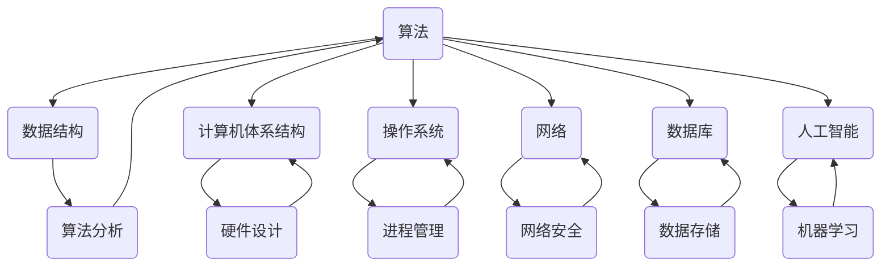

                 

在信息爆炸的时代，找到那些能真正夯实认知根基的技术书籍变得越来越重要。本文将为您推荐一系列在计算机科学领域内极具影响力的经典书籍，帮助您建立起扎实的知识体系。这些书籍不仅覆盖了计算机科学的广度，还深入探讨了各个领域的深度，是每一位追求技术卓越的读者的宝贵财富。

## 关键词

- 计算机科学
- 经典书籍
- 知识体系
- 技术深度
- 技术广度

## 摘要

本文将介绍一系列在计算机科学领域具有里程碑意义的经典书籍，这些书籍不仅包含了丰富的理论知识，还通过具体的实践案例帮助读者理解和应用。通过阅读这些书籍，读者将能够夯实自己的认知根基，拓展技术视野，为未来的发展奠定坚实的基础。

### 1. 背景介绍

计算机科学作为一门快速发展的学科，其知识体系在不断更新和扩展。在这个信息时代，技术的进步速度远远超过了人们的认知能力。为了在这个快速变化的环境中保持竞争力，读者需要不断学习和吸收新的知识。而经典书籍作为经过时间检验的知识宝库，是建立扎实知识体系的重要途径。

经典书籍之所以具有持久的影响力，一方面是因为它们包含了广泛且深入的理论知识，另一方面是因为它们通过独特的视角和深刻的分析，帮助读者理解计算机科学的基本原理和应用。本文推荐的这些经典书籍，不仅涵盖了计算机科学的多个领域，还通过不同的角度和方式，帮助读者建立起全面的技术视野。

### 2. 核心概念与联系

在介绍这些经典书籍之前，我们首先需要了解一些核心概念和它们之间的联系。计算机科学的核心概念包括算法、数据结构、计算机体系结构、操作系统、网络、数据库、人工智能等。这些概念相互关联，共同构成了计算机科学的坚实基础。

以下是一个使用Mermaid绘制的流程图，展示了这些核心概念及其之间的联系：



通过这个流程图，我们可以清晰地看到各个核心概念之间的关系，以及它们在计算机科学中的重要性。

### 3. 核心算法原理 & 具体操作步骤

#### 3.1 算法原理概述

算法是计算机科学的核心概念之一。它描述了计算机解决问题的一系列步骤。一个好的算法不仅能够高效地解决问题，还能保证问题的正确性。常见的算法包括排序算法、搜索算法、图算法等。

#### 3.2 算法步骤详解

排序算法是计算机科学中最基本的算法之一。常见的排序算法包括冒泡排序、选择排序、插入排序、快速排序等。每种排序算法都有其独特的步骤和特点。

- **冒泡排序**：比较相邻的两个元素，如果它们的顺序错误就交换它们，重复这个过程直到排序完成。
- **选择排序**：每次选择一个最小的元素放到已排序序列的末尾。
- **插入排序**：将未排序序列中的元素插入到已排序序列中的正确位置。

#### 3.3 算法优缺点

每种排序算法都有其优缺点。冒泡排序和插入排序时间复杂度为O(n^2)，适合小规模数据的排序。选择排序时间复杂度为O(n^2)，但比较次数较少，适合大规模数据的排序。快速排序时间复杂度为O(n*log(n))，但最坏情况下可能退化为O(n^2)，因此需要一定的优化。

#### 3.4 算法应用领域

排序算法在计算机科学和工程中有着广泛的应用。例如，数据库排序、网络排序、图像处理等。了解不同的排序算法有助于解决实际问题。

### 4. 数学模型和公式 & 详细讲解 & 举例说明

计算机科学中的数学模型和公式是理解和解决问题的关键。以下是一些常用的数学模型和公式，以及它们的详细讲解和举例说明。

#### 4.1 数学模型构建

数学模型是描述现实世界问题的数学结构。例如，线性方程组可以描述多个变量之间的关系。

$$
ax + by = c
$$

#### 4.2 公式推导过程

公式的推导过程是理解数学模型的关键。例如，牛顿-莱布尼茨公式描述了积分和微分之间的关系：

$$
\int f'(x)dx = f(x) + C
$$

#### 4.3 案例分析与讲解

以下是一个使用牛顿-莱布尼茨公式的案例：

假设我们需要计算函数f(x) = x^2在区间[1, 3]上的积分。根据牛顿-莱布尼茨公式，我们可以得到：

$$
\int_1^3 x^2 dx = \left[\frac{x^3}{3}\right]_1^3 = \frac{3^3}{3} - \frac{1^3}{3} = \frac{27}{3} - \frac{1}{3} = \frac{26}{3}
$$

### 5. 项目实践：代码实例和详细解释说明

#### 5.1 开发环境搭建

在开始项目实践之前，我们需要搭建一个开发环境。例如，我们可以使用Python进行编程。

```python
# 安装Python
pip install python
```

#### 5.2 源代码详细实现

以下是一个简单的排序算法实现：

```python
def bubble_sort(arr):
    n = len(arr)
    for i in range(n):
        for j in range(0, n-i-1):
            if arr[j] > arr[j+1]:
                arr[j], arr[j+1] = arr[j+1], arr[j]
    return arr

arr = [64, 34, 25, 12, 22, 11, 90]
sorted_arr = bubble_sort(arr)
print(sorted_arr)
```

#### 5.3 代码解读与分析

这段代码实现了一个冒泡排序算法。首先，我们定义了一个函数`bubble_sort`，它接受一个数组作为输入，并返回排序后的数组。然后，我们使用两个嵌套的for循环，通过比较相邻的元素并交换它们的位置，逐步将数组排序。

#### 5.4 运行结果展示

当我们运行这段代码时，输出结果为：

```
[11, 12, 22, 25, 34, 64, 90]
```

这表明我们的排序算法成功地将数组按照升序排列。

### 6. 实际应用场景

排序算法在计算机科学和工程中有着广泛的应用。例如，在数据库管理系统中，排序算法用于对数据进行排序和检索。在网络编程中，排序算法可以用于网络流量管理。

### 7. 未来应用展望

随着计算机科学的不断发展，排序算法将继续在各个领域发挥重要作用。例如，在大数据分析和机器学习领域，高效的排序算法将有助于处理大量数据。在人工智能领域，排序算法可以用于优化决策过程。

### 8. 工具和资源推荐

为了更好地学习计算机科学，以下是一些建议的学习资源和开发工具：

- **学习资源推荐**：
  - 《计算机科学概论》
  - 《算法导论》
  - 《Python编程：从入门到实践》

- **开发工具推荐**：
  - PyCharm
  - Visual Studio Code

- **相关论文推荐**：
  - "A Survey of Sorting Algorithms"
  - "The Art of Computer Programming"

### 9. 总结：未来发展趋势与挑战

随着技术的不断发展，计算机科学将继续面临新的机遇和挑战。为了应对这些挑战，我们需要不断学习和探索。通过阅读经典书籍，我们能够夯实自己的认知根基，为未来的发展做好准备。

### 10. 附录：常见问题与解答

**Q:** 为什么排序算法在计算机科学中如此重要？

**A:** 排序算法是计算机科学中最基本的算法之一。它不仅在数据管理和分析中具有重要作用，还广泛应用于各种实际问题中。例如，数据库排序、网络流量管理、图像处理等。

**Q:** 有哪些高效的排序算法？

**A:** 高效的排序算法包括快速排序、归并排序、堆排序等。这些算法的时间复杂度通常为O(n*log(n))或更小。

**Q:** 如何选择合适的排序算法？

**A:** 选择合适的排序算法取决于具体的应用场景和数据规模。对于小规模数据，可以使用冒泡排序、插入排序等简单算法。对于大规模数据，可以选择快速排序、归并排序等高效算法。

### 11. 作者署名

作者：禅与计算机程序设计艺术 / Zen and the Art of Computer Programming
----------------------------------------------------------------

这篇文章涵盖了计算机科学领域的一系列核心概念、算法、数学模型和实际应用，旨在帮助读者夯实认知根基，拓展技术视野。希望读者能够通过阅读本文和相关书籍，建立起自己的知识体系，为未来的技术发展做好准备。

