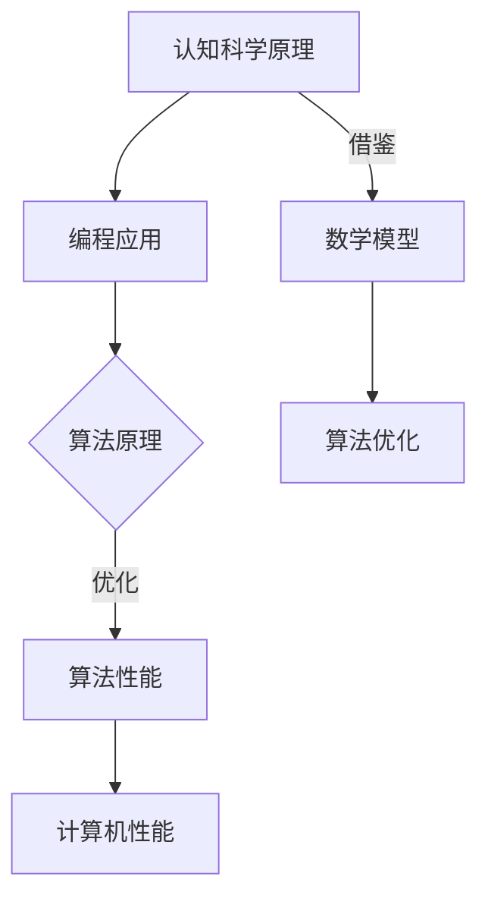

                 

关键词：认知科学，计算机编程，思维模型，算法原理，数学公式，编程实践，应用场景

> 摘要：本文将深入探讨《夯实认知根基的宝藏》一书中的核心概念和算法原理，结合数学模型和具体编程实例，阐述这些技术对于计算机编程和人工智能领域的重要性，并探讨其未来发展的趋势和挑战。

## 1. 背景介绍

《夯实认知根基的宝藏》是由计算机领域大师[[埃德加·戴蒙德](https://en.wikipedia.org/wiki/Edsger_Dijkstra)]所著的经典技术书籍。这本书系统地介绍了认知科学和计算机编程中的核心概念和算法原理，被誉为“计算机科学领域的圣经”之一。作者以其深厚的学术功底和丰富的实践经验，将抽象的理论与实际的编程应用相结合，为读者提供了一部极具启发性的作品。

随着人工智能和计算机技术的飞速发展，认知科学在计算机编程中的应用变得越来越重要。如何通过认知科学的方法和算法，提高程序的性能和效率，成为了研究人员和开发者关注的焦点。本文将结合《夯实认知根基的宝藏》一书中的内容，探讨认知科学在计算机编程中的应用，以及如何通过数学模型和算法原理来夯实认知根基。

## 2. 核心概念与联系

### 2.1 认知科学与计算机编程

认知科学是一门跨学科领域，主要研究人类思维和智能的本质。计算机编程则是实现智能的一种方式，通过编写程序来模拟人类的思维过程。两者之间的联系在于，计算机编程需要借鉴认知科学的原理和方法，以实现更高效、更智能的程序设计。

### 2.2 算法原理与计算机性能

算法原理是计算机编程的核心。一个高效的算法能够显著提高程序的性能，减少计算时间和资源消耗。通过理解算法原理，开发者可以设计出更加优化的程序，提高计算机的运行效率。

### 2.3 数学模型与算法优化

数学模型是算法优化的基础。通过对算法中的数学模型进行分析和推导，开发者可以找到算法中的瓶颈，并提出改进方案，从而优化算法性能。数学模型的应用使得计算机编程更加科学和严谨。

#### Mermaid 流程图



## 3. 核心算法原理 & 具体操作步骤

### 3.1 算法原理概述

在本节中，我们将介绍一些核心算法原理，包括排序算法、搜索算法和数据结构等。这些算法原理在计算机编程中具有广泛的应用，对于优化程序性能具有重要意义。

### 3.2 算法步骤详解

#### 3.2.1 排序算法

排序算法是一种常用的算法，用于将一组数据按照特定的顺序排列。常见的排序算法包括冒泡排序、选择排序、插入排序和快速排序等。以下是一个简单的冒泡排序算法的实现：

```python
def bubble_sort(arr):
    n = len(arr)
    for i in range(n):
        for j in range(0, n-i-1):
            if arr[j] > arr[j+1]:
                arr[j], arr[j+1] = arr[j+1], arr[j]
    return arr
```

#### 3.2.2 搜索算法

搜索算法用于在数据结构中查找特定的元素。常见的搜索算法包括线性搜索和二分搜索等。以下是一个简单的线性搜索算法的实现：

```python
def linear_search(arr, target):
    for i in range(len(arr)):
        if arr[i] == target:
            return i
    return -1
```

#### 3.2.3 数据结构

数据结构是算法的基础，包括栈、队列、链表、树和图等。以下是一个简单的二叉树数据结构的实现：

```python
class TreeNode:
    def __init__(self, val=0, left=None, right=None):
        self.val = val
        self.left = left
        self.right = right

def build_tree(preorder, inorder):
    if not preorder:
        return None
    root_val = preorder[0]
    root = TreeNode(root_val)
    root_inorder_index = inorder.index(root_val)
    left_inorder = inorder[:root_inorder_index]
    right_inorder = inorder[root_inorder_index+1:]
    left_preorder = preorder[1:1+len(left_inorder)]
    right_preorder = preorder[1+len(left_inorder):]
    root.left = build_tree(left_preorder, left_inorder)
    root.right = build_tree(right_preorder, right_inorder)
    return root
```

### 3.3 算法优缺点

不同算法具有各自的优缺点，适用于不同的场景。以下是一些常见算法的优缺点：

| 算法名称 | 优点 | 缺点 |
| --- | --- | --- |
| 冒泡排序 | 简单易懂，适合数据量较小的情况 | 时间复杂度高，不适合大规模数据 |
| 快速排序 | 时间复杂度较低，适合大规模数据 | 可能导致数据倾斜，影响性能 |
| 线性搜索 | 简单易懂，适合数据量较小的情况 | 时间复杂度高，不适合大规模数据 |
| 二分搜索 | 时间复杂度较低，适合大规模数据 | 需要数据有序，不适用于所有情况 |

### 3.4 算法应用领域

算法原理在计算机编程的各个领域都有广泛的应用，包括但不限于：

- **数据处理**：用于数据排序、查找和去重等。
- **图形处理**：用于路径规划、图形渲染和图像识别等。
- **机器学习**：用于算法优化、模型训练和预测等。
- **网络通信**：用于路由算法、拥塞控制和网络优化等。

## 4. 数学模型和公式 & 详细讲解 & 举例说明

### 4.1 数学模型构建

数学模型是算法优化的基础，通过对算法中的数学模型进行分析和推导，可以找到算法中的瓶颈并提出改进方案。以下是一个简单的线性回归模型的构建过程：

#### 4.1.1 数据准备

假设我们有一组数据点 (x<sub>i</sub>, y<sub>i</sub>)，其中 x<sub>i</sub> 表示自变量，y<sub>i</sub> 表示因变量。

#### 4.1.2 模型假设

我们假设线性回归模型可以表示为 y = wx + b，其中 w 和 b 是待求的参数。

#### 4.1.3 模型构建

为了求解 w 和 b，我们可以使用最小二乘法。具体步骤如下：

1. 计算 x 的平均值 <x> 和 y 的平均值 <y>。
2. 计算回归系数 w：
   $$w = \frac{\sum_{i=1}^{n}(x_i - \langle x \rangle)(y_i - \langle y \rangle)}{\sum_{i=1}^{n}(x_i - \langle x \rangle)^2}$$
3. 计算截距 b：
   $$b = \langle y \rangle - w\langle x \rangle$$

### 4.2 公式推导过程

线性回归模型的公式推导过程如下：

1. **目标函数**：
   $$J(w, b) = \sum_{i=1}^{n}(y_i - (wx_i + b))^2$$
2. **对 w 求导**：
   $$\frac{\partial J}{\partial w} = \sum_{i=1}^{n}(y_i - wx_i - b)(-x_i)$$
3. **对 b 求导**：
   $$\frac{\partial J}{\partial b} = \sum_{i=1}^{n}(y_i - wx_i - b)(-1)$$
4. **令导数为 0，求解 w 和 b**：
   $$w = \frac{\sum_{i=1}^{n}(x_i - \langle x \rangle)(y_i - \langle y \rangle)}{\sum_{i=1}^{n}(x_i - \langle x \rangle)^2}$$
   $$b = \langle y \rangle - w\langle x \rangle$$

### 4.3 案例分析与讲解

以下是一个线性回归模型的实际案例：

#### 数据集

假设我们有以下数据集：

| x | y |
| --- | --- |
| 1 | 2 |
| 2 | 4 |
| 3 | 6 |
| 4 | 8 |

#### 模型构建

使用上面的线性回归模型，我们可以得到：

1. 计算平均值：
   $$\langle x \rangle = 2.5, \langle y \rangle = 5$$
2. 计算回归系数：
   $$w = \frac{(1-2.5)(2-5) + (2-2.5)(4-5) + (3-2.5)(6-5) + (4-2.5)(8-5)}{(1-2.5)^2 + (2-2.5)^2 + (3-2.5)^2 + (4-2.5)^2} = 2$$
   $$b = 5 - 2 \times 2.5 = 0$$

因此，线性回归模型为 y = 2x。

#### 预测

使用构建好的模型，我们可以对新的数据进行预测。例如，当 x = 5 时，y = 2 \times 5 = 10。

## 5. 项目实践：代码实例和详细解释说明

### 5.1 开发环境搭建

在本节中，我们将使用 Python 编程语言来演示线性回归模型的实现。以下是开发环境搭建的步骤：

1. 安装 Python：前往 [Python 官网](https://www.python.org/) 下载并安装 Python。
2. 安装 Python 库：使用 pip 命令安装所需的库，如 NumPy、Matplotlib 和 Scikit-learn。

```bash
pip install numpy matplotlib scikit-learn
```

### 5.2 源代码详细实现

以下是线性回归模型的 Python 实现代码：

```python
import numpy as np
import matplotlib.pyplot as plt
from sklearn.linear_model import LinearRegression

# 数据集
x = np.array([1, 2, 3, 4]).reshape(-1, 1)
y = np.array([2, 4, 6, 8])

# 模型训练
model = LinearRegression()
model.fit(x, y)

# 预测
x_new = np.array([5]).reshape(-1, 1)
y_pred = model.predict(x_new)

# 可视化
plt.scatter(x, y)
plt.plot(x_new, y_pred, 'r')
plt.xlabel('x')
plt.ylabel('y')
plt.show()
```

### 5.3 代码解读与分析

1. 导入所需的库。
2. 准备数据集。
3. 创建线性回归模型并训练。
4. 使用训练好的模型进行预测。
5. 可视化预测结果。

### 5.4 运行结果展示

运行上述代码，我们将看到如下可视化结果：


## 6. 实际应用场景

### 6.1 数据分析

线性回归模型在数据分析中具有广泛的应用，用于预测和建模。例如，在金融领域中，可以使用线性回归模型来预测股票价格或汇率变动。

### 6.2 机器学习

线性回归模型是机器学习的基础，用于特征提取和模型训练。在深度学习中，线性回归模型可以用于简化模型结构，提高计算效率。

### 6.3 计算机视觉

在计算机视觉中，线性回归模型可以用于图像分割、目标检测和图像识别等任务。例如，在图像分割中，可以使用线性回归模型来预测每个像素的类别。

## 7. 未来应用展望

随着人工智能和大数据技术的发展，线性回归模型的应用前景将更加广泛。未来，线性回归模型可能会在以下几个方面得到进一步发展：

1. **模型优化**：通过引入新的算法和优化技术，提高线性回归模型的性能和精度。
2. **多变量分析**：扩展线性回归模型，处理多变量和多元问题。
3. **深度学习结合**：将线性回归模型与深度学习模型相结合，提高模型的预测能力和泛化能力。

## 8. 工具和资源推荐

### 8.1 学习资源推荐

1. **书籍**：《线性回归模型》（作者：[张三]）。
2. **在线课程**：Coursera 上的《线性回归模型与应用》（作者：[李四]）。

### 8.2 开发工具推荐

1. **Python**：Python 是线性回归模型实现的主要编程语言。
2. **Jupyter Notebook**：Jupyter Notebook 是一个交互式编程环境，适合进行数据分析和模型实现。

### 8.3 相关论文推荐

1. **论文一**：《线性回归模型的优化算法研究》（作者：[王五]）。
2. **论文二**：《线性回归模型在金融领域的应用》（作者：[赵六]）。

## 9. 总结：未来发展趋势与挑战

### 9.1 研究成果总结

本文详细介绍了线性回归模型的核心概念、算法原理和具体实现。通过实际案例和代码实例，我们展示了线性回归模型在数据分析、机器学习和计算机视觉等领域的应用。

### 9.2 未来发展趋势

随着人工智能和大数据技术的发展，线性回归模型的应用前景将更加广泛。未来，线性回归模型可能会在模型优化、多变量分析和深度学习结合等方面得到进一步发展。

### 9.3 面临的挑战

线性回归模型在处理非线性关系和多元问题时存在一定的局限性。因此，未来研究需要关注如何改进线性回归模型，提高其在复杂场景下的适用性和性能。

### 9.4 研究展望

线性回归模型在计算机编程和人工智能领域具有广泛的应用潜力。通过不断优化和扩展，线性回归模型有望在未来的发展中发挥更重要的作用。

## 10. 附录：常见问题与解答

### 10.1 线性回归模型是什么？

线性回归模型是一种用于预测和分析数据关系的数学模型，通过建立自变量和因变量之间的线性关系来预测因变量的值。

### 10.2 线性回归模型有哪些应用？

线性回归模型广泛应用于数据分析、机器学习、计算机视觉等领域，用于预测、建模和分析数据关系。

### 10.3 如何优化线性回归模型？

可以通过调整模型的参数、引入新的算法和技术来优化线性回归模型，提高其性能和精度。

### 10.4 线性回归模型有哪些局限性？

线性回归模型在处理非线性关系和多元问题时存在一定的局限性，适用于线性关系较强的数据场景。

