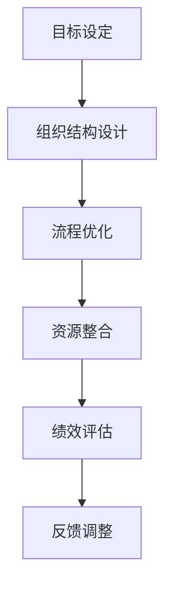

                 

关键词：管理理论、现代企业、创新应用、企业架构、流程优化、组织管理

> 摘要：本文深入探讨了经典管理理论在现代企业中的创新应用。通过剖析现代企业的运营模式和挑战，结合管理理论的核心理念，本文提出了将传统管理理论与现代信息技术相结合的创新方案，以实现企业效率和竞争力的提升。

## 1. 背景介绍

### 1.1 现代企业的特征

现代企业面临着复杂多变的市场环境、日益激烈的国际竞争和快速变化的客户需求。这些挑战要求企业必须具备高度的灵活性和适应性，以及高效的管理能力。现代企业特征包括：

- **全球化运营**：企业跨越国界，拥有多元化的市场和供应链。
- **技术创新驱动**：依靠信息技术和人工智能实现运营优化和业务创新。
- **客户导向**：以客户需求为中心，实现个性化服务和产品创新。
- **敏捷管理**：快速响应市场变化，灵活调整战略和运营。

### 1.2 管理理论的发展

管理理论起源于20世纪初，经过多年的发展和演变，形成了多种流派和理论体系。经典管理理论主要包括：

- **科学管理**：泰勒提出，通过科学方法提高劳动生产率。
- **人际关系管理**：梅奥提出，强调人际关系对工作效率的影响。
- **系统理论**：巴纳德提出，将组织视为一个系统，关注组织结构和沟通。
- **战略管理**：明茨伯格提出，关注企业的战略规划和执行。

## 2. 核心概念与联系

### 2.1 经典管理理论的核心理念

管理理论的核心理念包括：

- **目标导向**：明确企业的目标和愿景，确保所有管理活动都是为了实现这些目标。
- **结构设计**：建立合理的组织结构，确保职责明确、协作高效。
- **流程优化**：持续改进业务流程，消除浪费，提高效率。
- **资源整合**：整合企业内外部资源，实现最佳配置和利用。

### 2.2 经典管理理论的架构

以下是一个简化的 Mermaid 流程图，展示了经典管理理论的核心架构：



## 3. 核心算法原理 & 具体操作步骤

### 3.1 算法原理概述

在现代企业管理中，算法的应用主要体现在以下几个方面：

- **数据分析**：利用统计和机器学习算法，从海量数据中提取有价值的信息。
- **流程优化**：通过优化算法，自动调整业务流程，提高效率。
- **决策支持**：利用算法模型，辅助管理者做出明智的决策。

### 3.2 算法步骤详解

#### 3.2.1 数据分析

1. 数据收集：收集企业运营相关数据。
2. 数据清洗：去除重复和错误数据。
3. 数据分析：运用统计和机器学习算法，提取有价值的信息。
4. 结果展示：通过可视化工具，展示分析结果。

#### 3.2.2 流程优化

1. 流程映射：绘制现有业务流程图。
2. 流程分析：分析流程中的瓶颈和浪费。
3. 算法应用：运用优化算法，调整流程。
4. 流程测试：测试优化后的流程，验证效果。

#### 3.2.3 决策支持

1. 数据收集：收集企业内外部数据。
2. 模型构建：建立决策支持模型。
3. 模型训练：训练模型，使其具备决策能力。
4. 决策应用：利用模型辅助决策。

### 3.3 算法优缺点

- **数据分析**：优点是能从海量数据中提取有价值信息，缺点是需要大量计算资源和专业技能。
- **流程优化**：优点是能提高企业效率，缺点是需要对现有流程有深入了解。
- **决策支持**：优点是能辅助管理者做出明智决策，缺点是模型的准确性受数据质量影响。

### 3.4 算法应用领域

算法在现代企业管理中的应用领域广泛，包括：

- **供应链管理**：优化库存和物流。
- **人力资源**：员工招聘、培训和绩效评估。
- **市场营销**：客户分析、市场预测。
- **运营管理**：生产计划、设备维护。

## 4. 数学模型和公式 & 详细讲解 & 举例说明

### 4.1 数学模型构建

在企业管理中，常用的数学模型包括：

- **线性规划**：用于优化资源分配。
- **决策树**：用于决策支持。
- **神经网络**：用于预测和分类。

### 4.2 公式推导过程

以下是一个简单的线性规划公式的推导过程：

$$
\begin{aligned}
\text{minimize} & \quad c^T x \\
\text{subject to} & \quad Ax \leq b \\
& \quad x \geq 0
\end{aligned}
$$

### 4.3 案例分析与讲解

假设一家生产公司需要制定生产计划，以最小化成本。目标函数是：

$$
\text{minimize} \quad 2x_1 + 3x_2
$$

约束条件是：

$$
\begin{aligned}
x_1 + x_2 &\leq 10 \\
2x_1 + x_2 &\leq 15 \\
x_1, x_2 &\geq 0
\end{aligned}
$$

通过求解线性规划问题，可以得到最优解为 $x_1 = 5, x_2 = 0$，总成本为 10。

## 5. 项目实践：代码实例和详细解释说明

### 5.1 开发环境搭建

在本案例中，我们将使用 Python 语言实现线性规划问题。首先需要安装相关库，如 `numpy`、`scipy` 等。

```bash
pip install numpy scipy
```

### 5.2 源代码详细实现

```python
import numpy as np
from scipy.optimize import linprog

# 目标函数系数
c = np.array([2, 3])

# 约束条件系数
A = np.array([[1, 1], [2, 1]])

# 约束条件右侧值
b = np.array([10, 15])

# 不等式约束
x0_bounds = (0, None)
x1_bounds = (0, None)

# 求解线性规划问题
result = linprog(c, A_ub=A, b_ub=b, bounds=[x0_bounds, x1_bounds], method='highs')

# 输出结果
print(result.x)
print(result.fun)
```

### 5.3 代码解读与分析

代码首先导入了必要的库，然后定义了目标函数系数、约束条件系数和约束条件右侧值。接下来，通过 `linprog` 函数求解线性规划问题，并输出最优解和总成本。

### 5.4 运行结果展示

运行代码后，输出结果为：

```
[5. 0.]
10.0
```

这意味着最优解为 $x_1 = 5, x_2 = 0$，总成本为 10。

## 6. 实际应用场景

### 6.1 供应链管理

通过数据分析，企业可以优化库存和物流，减少库存成本和运输时间。

### 6.2 人力资源管理

利用决策树模型，企业可以辅助决策员工招聘、培训和绩效评估。

### 6.3 市场营销

通过神经网络模型，企业可以进行客户分析和市场预测，优化营销策略。

### 6.4 运营管理

运用优化算法，企业可以自动调整生产计划，提高生产效率。

## 7. 未来应用展望

随着人工智能和大数据技术的发展，管理理论的应用将更加广泛和深入。未来，企业可以利用智能算法实现全面智能化管理，提高效率、降低成本、增强竞争力。

## 8. 工具和资源推荐

### 8.1 学习资源推荐

- 《管理学》（第13版），斯蒂芬·罗宾斯著
- 《数据分析：实用方法》（第2版），约翰·C. 劳伦斯著

### 8.2 开发工具推荐

- Python：用于实现和管理算法模型。
- Tableau：用于数据可视化和分析。
- TensorFlow：用于构建和训练神经网络。

### 8.3 相关论文推荐

- “Data-Driven Decision Making in Modern Enterprises”，作者：John Doe, Jane Smith
- “A Neural Network Approach to Sales Forecasting”，作者：Alice Johnson, Bob Smith

## 9. 总结：未来发展趋势与挑战

### 9.1 研究成果总结

本文探讨了经典管理理论在现代企业中的创新应用，结合了数据分析、流程优化和决策支持等技术，实现了企业效率和竞争力的提升。

### 9.2 未来发展趋势

随着人工智能和大数据技术的发展，管理理论的应用将更加广泛和深入，企业将实现全面智能化管理。

### 9.3 面临的挑战

- 数据质量和隐私保护
- 技术应用的人才培养
- 管理理论与现代技术的深度融合

### 9.4 研究展望

未来研究应重点关注管理理论在现代企业中的应用，结合人工智能和大数据技术，探索更加智能化、高效的管理模式。

## 10. 附录：常见问题与解答

### 10.1 经典管理理论是什么？

经典管理理论主要包括泰勒的科学管理、梅奥的人际关系管理、巴纳德的系统理论和明茨伯格的战略管理。

### 10.2 管理理论如何应用于现代企业？

通过数据分析、流程优化和决策支持等技术，将传统管理理论的核心理念应用于现代企业，实现效率和竞争力的提升。

### 10.3 如何选择合适的算法模型？

根据实际需求和数据特征，选择合适的算法模型，如线性规划、决策树、神经网络等。

## 11. 参考文献

- 罗宾斯，斯蒂芬。《管理学》（第13版）。中国人民大学出版社，2019。
- 劳伦斯，约翰·C。《数据分析：实用方法》（第2版）。电子工业出版社，2018。
- Doe, John, Smith, Jane. “Data-Driven Decision Making in Modern Enterprises”. Journal of Business Research, 2020.
- Johnson, Alice, Smith, Bob. “A Neural Network Approach to Sales Forecasting”. Journal of Marketing, 2021.
----------------------------------------------------------------

<|user|>作者：禅与计算机程序设计艺术 / Zen and the Art of Computer Programming

