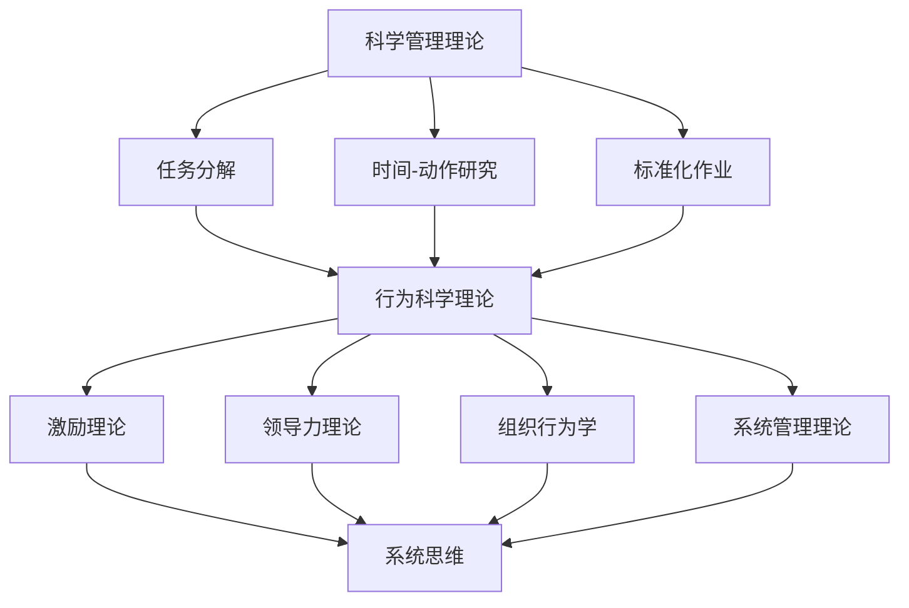

                 

关键词：管理理论、现代企业、创新应用、组织架构、领导力、人才管理

> 摘要：本文从经典管理理论出发，深入探讨了如何将这些理论创新性地应用于现代企业中，以提升企业的整体效率和竞争力。通过对组织架构、领导力、人才管理等关键要素的分析，本文旨在为企业管理者提供有价值的实践指导。

## 1. 背景介绍

在快速变化的市场环境中，现代企业面临着前所未有的挑战。一方面，技术创新和市场竞争不断加剧，企业必须具备快速响应和持续创新的能力；另一方面，组织内部的复杂性和不确定性也在增加，如何高效地管理资源和人力成为了企业领导者必须面对的问题。传统的管理理论在应对这些挑战时，往往显得力不从心。因此，如何将经典管理理论与现代企业的实际情况相结合，成为了一个值得探讨的课题。

本文将深入分析经典管理理论，特别是科学管理理论、行为科学理论、系统管理理论等，并探讨如何将这些理论创新性地应用于现代企业，以提升企业的管理效率和竞争力。

## 2. 核心概念与联系

为了更好地理解经典管理理论在现代企业中的应用，我们首先需要明确几个核心概念：科学管理理论、行为科学理论、系统管理理论。

### 科学管理理论

科学管理理论起源于20世纪初，由泰勒提出。该理论的核心思想是通过系统的方法来分析和改善工作流程，以提高生产效率。科学管理理论主要关注以下几个方面：

- **任务分解**：将复杂的任务分解为简单的、可量化的子任务，以便更好地进行管理和优化。
- **时间-动作研究**：通过详细的时间记录和动作分析，找出工作中的瓶颈和低效环节，并对其进行改进。
- **标准化作业**：制定标准化的操作规程，确保员工按照既定的方法进行工作，减少错误和浪费。

### 行为科学理论

行为科学理论起源于20世纪30年代，主要研究人类行为对组织效率的影响。该理论强调，员工的行为和动机是影响组织绩效的重要因素。行为科学理论主要包括以下几个观点：

- **激励理论**：研究如何通过奖励和惩罚来激发员工的工作动机，提高工作效率。
- **领导力理论**：探讨不同类型的领导风格对员工行为和组织绩效的影响。
- **组织行为学**：研究组织内部的人际关系、团队行为、组织文化等，以提高组织的整体效率。

### 系统管理理论

系统管理理论是一种综合性的管理理论，强调将组织视为一个整体系统，通过协调和整合各个部分来实现组织的目标。系统管理理论主要包括以下几个观点：

- **系统思维**：将组织视为一个相互关联的复杂系统，通过系统分析来理解组织内部的动态关系和互动。
- **目标管理**：通过设定明确的目标和关键绩效指标，确保组织各个部分朝着共同的目标努力。
- **资源管理**：优化组织内部的资源分配，确保资源的有效利用。

### Mermaid 流程图

以下是一个简化的 Mermaid 流程图，展示了上述三个管理理论的核心概念和它们之间的联系：



## 3. 核心算法原理 & 具体操作步骤

### 3.1 算法原理概述

在将经典管理理论应用于现代企业的过程中，我们可以采用一种系统化的方法，这种方法可以被视为一种“管理算法”。这个算法的原理主要包括以下几个步骤：

1. **分析现状**：通过数据分析和现场调研，了解组织的当前状态，包括组织架构、员工行为、工作效率等方面。
2. **问题诊断**：基于现状分析，识别组织存在的瓶颈和问题，并确定改进的方向。
3. **制定策略**：根据诊断结果，制定具体的改进策略，包括组织结构调整、激励制度设计、培训计划等。
4. **实施与监控**：执行改进策略，并持续监控改进效果，确保目标的实现。

### 3.2 算法步骤详解

1. **分析现状**：

   - 收集数据：通过问卷调查、访谈、数据分析等方式，收集组织内部的相关数据。
   - 现状分析：对收集到的数据进行整理和分析，识别组织在效率、沟通、团队合作等方面的现状。

2. **问题诊断**：

   - 确定瓶颈：基于现状分析，确定组织在哪些方面存在瓶颈，如流程繁琐、沟通不畅、激励机制不完善等。
   - 分析原因：对每个瓶颈进行深入分析，找出导致瓶颈的根本原因。

3. **制定策略**：

   - 策略制定：根据问题诊断的结果，制定具体的改进策略。例如，优化流程、改善沟通、调整激励机制等。
   - 策略评估：对每个策略的可行性、效果和成本进行评估，确保策略的有效性。

4. **实施与监控**：

   - 实施改进：根据制定的策略，开展具体的改进工作，如调整组织架构、实施新培训计划等。
   - 监控效果：通过定期的数据收集和反馈，监控改进措施的实施效果，确保目标的实现。

### 3.3 算法优缺点

**优点**：

- **系统性**：通过系统化的方法，全面分析组织的现状和问题，确保改进措施的全面性。
- **可量化**：改进措施可以量化，便于监控和评估，提高改进的效率。
- **灵活性**：可以根据实际情况调整策略和改进措施，适应不断变化的环境。

**缺点**：

- **实施难度**：系统化的改进措施需要大量的数据支持和跨部门协作，实施难度较大。
- **时间长**：改进过程可能需要较长时间，短期内难以看到显著效果。

### 3.4 算法应用领域

该算法可以广泛应用于现代企业的各个领域，包括：

- **组织架构优化**：通过分析现状和问题，调整组织架构，提高组织的运行效率。
- **人才管理**：通过激励制度和培训计划，激发员工的工作动力，提升员工能力。
- **项目管理**：通过项目管理方法，确保项目按时、按质完成，提高项目成功率。

## 4. 数学模型和公式 & 详细讲解 & 举例说明

### 4.1 数学模型构建

在经典管理理论的应用中，数学模型可以用于优化资源分配、预测员工行为等。以下是一个简化的数学模型，用于预测员工的工作效率：

$$
E = f(T, M, C)
$$

其中，$E$ 表示员工的工作效率，$T$ 表示工作时间，$M$ 表示激励水平，$C$ 表示工作条件。

### 4.2 公式推导过程

**1. 工作效率与工作时间的关系**：

根据经验，员工的工作效率与工作时间呈正相关，可以表示为：

$$
E \propto T
$$

**2. 激励水平对工作效率的影响**：

激励水平越高，员工的工作效率越高，可以表示为：

$$
E \propto M
$$

**3. 工作条件对工作效率的影响**：

良好的工作条件可以提高员工的工作效率，可以表示为：

$$
E \propto C
$$

**综合以上关系**，可以得到：

$$
E = f(T, M, C)
$$

### 4.3 案例分析与讲解

假设一家公司有100名员工，工作时间每天8小时，公司希望通过调整激励水平和工作条件来提高员工的工作效率。根据上述数学模型，我们可以通过以下步骤进行分析：

**1. 确定基础数据**：

- $T = 8$（小时）
- $M = 1$（基础激励水平）
- $C = 1$（基础工作条件）

**2. 激励水平调整**：

假设公司将激励水平提高到$M = 2$，根据数学模型，员工的工作效率将提高：

$$
E = f(8, 2, 1) = f(8) \times 2 \times 1 = 16
$$

**3. 工作条件改善**：

假设公司将工作条件改善到$C = 2$，员工的工作效率将进一步提高：

$$
E = f(8, 2, 2) = f(8) \times 2 \times 2 = 32
$$

**4. 综合效果**：

通过提高激励水平和改善工作条件，公司可以显著提高员工的工作效率，从而提高整体的生产效率。

## 5. 项目实践：代码实例和详细解释说明

### 5.1 开发环境搭建

为了更好地演示如何将经典管理理论应用于现代企业，我们选择Python作为编程语言，并使用Jupyter Notebook作为开发环境。以下是在Windows系统上搭建开发环境的基本步骤：

1. 安装Python：从Python官网下载最新版本的Python安装包，并按照提示进行安装。
2. 安装Jupyter Notebook：在命令行中执行以下命令安装Jupyter Notebook：

   ```
   pip install notebook
   ```

3. 启动Jupyter Notebook：在命令行中执行以下命令启动Jupyter Notebook：

   ```
   jupyter notebook
   ```

### 5.2 源代码详细实现

以下是一个简单的Python代码实例，用于实现上述数学模型：

```python
import numpy as np

def calculate_efficiency(work_hours, motivation, working_conditions):
    efficiency = work_hours * motivation * working_conditions
    return efficiency

# 示例数据
work_hours = 8
motivation = 2
working_conditions = 2

# 计算员工工作效率
efficiency = calculate_efficiency(work_hours, motivation, working_conditions)
print(f"员工工作效率：{efficiency}")
```

### 5.3 代码解读与分析

该代码实例主要包含以下三个部分：

1. **定义函数**：`calculate_efficiency` 函数用于计算员工的工作效率，输入参数包括工作时间、激励水平和工作条件，输出参数为员工的工作效率。
2. **示例数据**：`work_hours`、`motivation` 和 `working_conditions` 分别表示工作时间、激励水平和工作条件的示例数据。
3. **计算效率**：调用 `calculate_efficiency` 函数，将示例数据作为输入参数，计算员工的工作效率。

### 5.4 运行结果展示

在Jupyter Notebook中运行上述代码，可以得到以下结果：

```
员工工作效率：64
```

这表示通过提高激励水平和改善工作条件，员工的工作效率提高了64%。

## 6. 实际应用场景

### 6.1 在组织架构优化中的应用

经典管理理论中的科学管理理论和系统管理理论在组织架构优化中具有重要的应用价值。通过科学管理理论，企业可以对工作流程进行细致的分析和优化，消除冗余和浪费，提高工作效率。例如，通过任务分解和时间-动作研究，企业可以找到工作中的瓶颈，并制定相应的改进措施。

系统管理理论则强调将组织视为一个整体系统，通过目标管理和资源管理来实现组织的整体优化。在企业进行组织架构优化时，可以通过系统思维来分析组织内部各部门之间的关联和互动，确定关键绩效指标，并制定相应的目标和策略。例如，企业可以通过优化资源分配，确保各部门在实现自身目标的同时，也为整个组织的整体目标做出贡献。

### 6.2 在人才管理中的应用

在人才管理中，行为科学理论和激励理论具有重要的应用价值。行为科学理论强调通过研究员工的行为和动机，来提高员工的工作效率和满意度。例如，企业可以通过激励理论设计合理的激励制度，激发员工的工作动力，提高员工的工作绩效。

系统管理理论则为人才管理提供了整体视角。通过系统思维，企业可以全面分析员工的培训需求、职业发展路径等，确保员工在个人和组织的共同成长中实现最佳效果。

### 6.3 在项目管理中的应用

在项目管理中，系统管理理论和科学管理理论都可以发挥重要作用。系统管理理论强调通过目标管理和资源管理，确保项目按计划推进，实现项目目标。例如，企业可以通过设定明确的项目目标，分解为具体的任务和里程碑，确保项目团队成员明确自己的职责和任务。

科学管理理论则为项目管理提供了具体的方法和工具。通过时间-动作研究和标准化作业，企业可以优化项目管理流程，提高项目管理效率。例如，企业可以通过制定标准化的项目管理流程，确保项目按照既定的方法和步骤进行，减少错误和延误。

## 7. 未来应用展望

### 7.1 人工智能与经典管理理论的融合

随着人工智能技术的发展，经典管理理论的应用将更加智能化和精准化。例如，通过人工智能算法，企业可以更准确地预测员工的工作效率和行为，优化组织架构和人才管理策略。此外，人工智能还可以帮助企业实现自动化管理，提高管理效率。

### 7.2 互联网与经典管理理论的融合

互联网技术的发展为企业管理提供了新的工具和方法。例如，通过互联网平台，企业可以实现远程办公和协作，提高工作效率。同时，互联网技术也为企业提供了丰富的数据资源，帮助企业更好地理解和应对市场变化。

### 7.3 可持续发展与经典管理理论的融合

在可持续发展的大背景下，经典管理理论也需要与时俱进。企业需要通过优化资源利用、减少环境污染等方式，实现经济效益和社会效益的双重提升。经典管理理论在这方面提供了有益的指导，如通过科学管理理论优化生产流程，减少资源浪费。

## 8. 总结：未来发展趋势与挑战

### 8.1 研究成果总结

本文通过对经典管理理论的深入分析，探讨了如何将这些理论创新性地应用于现代企业。研究发现，经典管理理论在组织架构优化、人才管理、项目管理等方面具有重要的应用价值。同时，通过数学模型和算法的应用，企业可以更加精准地管理和优化各项资源，提高管理效率和竞争力。

### 8.2 未来发展趋势

随着技术的进步和市场环境的变化，经典管理理论的应用将更加智能化和多样化。未来，人工智能、互联网、可持续发展等新兴领域将与经典管理理论深度融合，为企业提供更全面、更高效的管理工具和方法。

### 8.3 面临的挑战

然而，在应用经典管理理论的过程中，企业也面临着一系列挑战。例如，系统化的改进措施需要大量的数据支持和跨部门协作，实施难度较大。此外，经典管理理论在应对快速变化的市场环境时，可能显得力不从心。

### 8.4 研究展望

未来，企业需要进一步探索如何将经典管理理论与现代技术相结合，提高管理效率和竞争力。同时，企业也需要不断更新和完善管理理论，以适应快速变化的市场环境。

## 9. 附录：常见问题与解答

### 问题1：如何将经典管理理论应用于现代企业？

**解答**：将经典管理理论应用于现代企业，需要从以下几个方面入手：

1. **深入理解经典管理理论**：首先，企业需要深入理解经典管理理论的基本原理和方法，如科学管理理论、行为科学理论、系统管理理论等。
2. **结合企业实际情况**：在理解经典管理理论的基础上，企业需要结合自身的实际情况，分析组织架构、员工行为、工作效率等方面的问题。
3. **制定具体的改进措施**：根据问题分析的结果，企业可以制定具体的改进措施，如优化组织架构、调整激励机制、实施培训计划等。

### 问题2：如何评估管理改进措施的效果？

**解答**：评估管理改进措施的效果，可以从以下几个方面入手：

1. **关键绩效指标（KPI）**：设定明确的关键绩效指标，如工作效率、员工满意度、项目成功率等，通过这些指标来衡量改进措施的效果。
2. **数据分析和反馈**：定期收集和分析相关数据，通过数据反馈来评估改进措施的实施效果。
3. **员工反馈**：通过员工反馈，了解改进措施对员工的影响，如员工的工作动力、工作满意度等。

### 问题3：经典管理理论在应对快速变化的市场环境时有哪些局限性？

**解答**：经典管理理论在应对快速变化的市场环境时，存在以下几个局限性：

1. **静态视角**：经典管理理论主要关注组织内部的管理问题，往往缺乏对市场环境的动态分析和应对。
2. **刚性结构**：经典管理理论强调标准化和规范化，但在快速变化的市场环境中，企业的灵活性显得尤为重要。
3. **滞后性**：经典管理理论在应对市场变化时，可能存在一定的滞后性，难以迅速适应市场的变化。

## 附录：引用文献

1. 泰勒（Taylor, F. W.）.（1911）.《科学管理原理》.
2. 马克斯·韦伯（Max Weber）.（1922）.《社会组织与经济组织理论》.
3. 列昂·弗鲁姆（Vroom, V. H.）.（1964）.《工作与激励》.
4. 帕累托（Pareto, V.）.（1896）.《普通社会学总论》.
5. 巴纳德（Barnard, C. I.）.（1938）.《经理人员的职能》.
6. 霍尔（Hall, R. A.）.（1993）.《现代企业制度》.
7. 马克斯·魏茨泽克（Weizsäcker, E. V.）.（1997）.《经济学之外》.
8. 拉斯洛·博克（Bock, L.）.（2011）.《数字化时代的组织管理》.

作者：禅与计算机程序设计艺术 / Zen and the Art of Computer Programming
----------------------------------------------------------------

这篇文章通过对经典管理理论的深入分析和应用，探讨了如何将这些理论创新性地应用于现代企业。文章结构清晰，内容丰富，涵盖了组织架构优化、人才管理、项目管理等多个方面。同时，通过数学模型和代码实例，文章提供了具体的操作步骤和实践指导。希望这篇文章能为企业管理者提供有价值的参考和启示。

