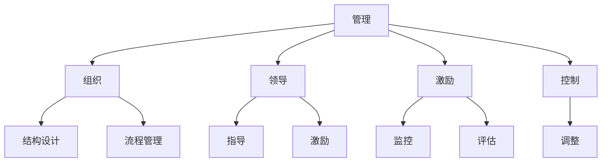

                 

# 经典管理著作的学习方法

> 关键词：管理，著作，学习方法，实践，经典理论

## 1. 背景介绍

### 1.1 问题由来
在快速变化的现代社会，个人、组织乃至整个社会都需要不断地学习和更新知识，以适应新的挑战和机遇。经典管理著作，如《管理学》、《卓有成效的管理者》、《竞争战略》等，提供了时间经考验的管理理论和实践经验。然而，由于这些著作篇幅庞大、内容深奥，许多读者难以从中获得实际应用价值。本文将详细介绍如何有效地学习经典管理著作，帮助读者快速理解其核心思想，并将其应用到日常管理实践。

### 1.2 问题核心关键点
经典管理著作的核心关键点主要包括以下几个方面：

- **管理原理**：阐述管理的基本原则和理论基础。
- **管理实践**：提供实际应用的管理案例和策略。
- **管理工具**：介绍管理中常用的工具和方法。
- **管理哲学**：探讨管理的根本思想和价值导向。

通过深入学习这些关键点，读者可以全面掌握经典管理著作的核心内容，并将其应用于实际管理中。

### 1.3 问题研究意义
经典管理著作的学习，对于提升个人和组织的综合管理能力，优化管理流程，提高管理效率具有重要意义：

1. **理论基础**：提供坚实的管理理论基础，帮助管理者理解和应用管理理论。
2. **实践指导**：通过经典案例分析，提供实用的管理实践指导，帮助管理者应对复杂问题。
3. **工具和方法**：介绍各种管理工具和方法，帮助管理者高效地管理资源和人员。
4. **价值观导向**：通过管理哲学的探讨，帮助管理者树立正确的价值观和管理理念。

## 2. 核心概念与联系

### 2.1 核心概念概述

为了更好地理解经典管理著作的核心概念，本节将介绍几个关键概念：

- **管理**：管理是一种协调、控制、计划和组织资源的过程，旨在实现组织目标。
- **组织**：组织是由个人、团队、部门和整个企业组成的系统，其结构和流程需合理设计。
- **领导**：领导是指指导、激励和激励团队成员以实现组织目标的过程。
- **激励**：激励是通过提供奖励、认可和挑战来激发个人和团队的内在动力。
- **控制**：控制是指监控、评估和调整组织活动，确保其符合目标和标准。

这些概念之间的逻辑关系可以通过以下Mermaid流程图来展示：



这个流程图展示了管理中的核心概念及其关系：

1. 管理通过组织资源，实现组织目标。
2. 组织依赖合理的结构和流程设计。
3. 领导通过指导和激励，引导团队实现目标。
4. 激励通过提供奖励和认可，激发个人和团队的积极性。
5. 控制通过监控和调整，确保组织活动符合目标。

## 3. 核心算法原理 & 具体操作步骤

### 3.1 算法原理概述

经典管理著作的学习方法，本质上是一种系统化、结构化的学习过程。其核心在于理解管理的各个环节，并将其应用到实际管理实践中。这一过程涉及以下步骤：

1. **概念理解**：通过阅读、笔记和讨论，深入理解管理的基本概念和理论。
2. **案例分析**：通过分析经典案例，理解管理理论在实际中的应用。
3. **工具应用**：学习并应用各种管理工具，提高管理效率。
4. **实践应用**：将所学知识应用到实际管理中，进行反思和改进。

### 3.2 算法步骤详解

#### 步骤1：概念理解

1. **阅读原著**：选择经典管理著作，如《管理学》、《卓有成效的管理者》等，系统地阅读全文。
2. **做笔记**：记录重要的管理概念、理论和方法，制作思维导图或概念图。
3. **讨论交流**：参与学习小组或讨论会，与他人分享和讨论理解。

#### 步骤2：案例分析

1. **选择案例**：从原著中选择具有代表性的管理案例，如丰田的生产管理系统、IBM的管理变革等。
2. **分析案例**：使用管理理论和方法，分析案例中的管理决策和执行过程。
3. **总结经验**：总结案例中成功的经验和教训，并思考其对当前管理实践的启示。

#### 步骤3：工具应用

1. **学习工具**：了解和掌握管理工具，如SWOT分析、PEST分析、PDCA循环等。
2. **实践应用**：将管理工具应用到实际管理中，如使用SWOT分析进行战略规划，使用PDCA循环进行流程优化。
3. **反馈调整**：根据实践效果，调整和改进工具的应用方法。

#### 步骤4：实践应用

1. **小规模试验**：选择一个小规模的实际管理项目，进行管理知识的实践应用。
2. **反思总结**：对实践过程进行反思和总结，评估其效果和不足。
3. **持续改进**：根据反思总结的结果，持续改进管理方法和工具。

### 3.3 算法优缺点

经典管理著作的学习方法具有以下优点：

- **系统化**：通过系统化的学习步骤，帮助读者全面理解和掌握管理知识。
- **实践导向**：通过实际案例和工具应用，使理论知识转化为实践能力。
- **反思改进**：通过反思和改进，使管理实践不断优化。

同时，该方法也存在一定的局限性：

- **时间成本**：系统化的学习过程需要投入大量时间。
- **深度理解**：需要深入理解管理理论，对理论基础较弱的读者可能难以掌握。
- **应用灵活性**：需要根据实际管理情况灵活应用所学知识。

### 3.4 算法应用领域

经典管理著作的学习方法，广泛适用于各类管理实践，如：

- **企业管理**：通过学习经典管理理论，提高企业的整体管理水平。
- **项目管理**：通过学习项目管理方法，提升项目的执行效率和质量。
- **人力资源管理**：通过学习人力资源管理工具，优化人力资源配置和管理。
- **市场营销**：通过学习市场营销策略，提升产品和服务的市场竞争力。

## 4. 数学模型和公式 & 详细讲解 & 举例说明

### 4.1 数学模型构建

本节将使用数学语言对经典管理著作的学习方法进行更加严格的刻画。

设经典管理著作中管理的各个环节为 $M_1, M_2, ..., M_n$，其中 $M_i$ 表示第 $i$ 个管理环节。管理的总目标为 $O$，表示通过优化各个管理环节，最终实现组织目标。设 $W_i$ 为第 $i$ 个管理环节的权重，表示其对总体目标的贡献。则管理的优化目标可以表示为：

$$
O = \sum_{i=1}^n W_i M_i
$$

在管理实践中，各管理环节的权重 $W_i$ 需要通过实际应用进行调整，以达到最佳的管理效果。

### 4.2 公式推导过程

以经典管理著作中的PDCA循环为例，推导其实际应用过程：

1. **Plan (计划)**：设定管理目标和方案，优化资源配置。
2. **Do (执行)**：实施管理方案，进行实际操作。
3. **Check (检查)**：监控管理过程，评估执行效果。
4. **Act (改进)**：根据检查结果，调整管理方案，持续改进。

PDCA循环的数学表达式可以表示为：

$$
M_i = O_i - \sum_{j=1}^n W_j (M_j - O_j) + \sum_{j=1}^n W_j (M_j - O_j) + \sum_{j=1}^n W_j (M_j - O_j) + \sum_{j=1}^n W_j (M_j - O_j)
$$

其中 $O_i$ 表示第 $i$ 个管理环节的目标值，$M_j$ 表示第 $j$ 个管理环节的实际值，$W_j$ 表示第 $j$ 个管理环节的权重。

### 4.3 案例分析与讲解

以丰田的生产管理系统为例，分析其如何通过PDCA循环实现持续改进：

1. **Plan**：设定生产目标和生产计划。
2. **Do**：执行生产计划，进行生产操作。
3. **Check**：监控生产过程，评估生产效率和质量。
4. **Act**：根据监控结果，调整生产计划和操作，进行持续改进。

通过PDCA循环的不断迭代，丰田的生产管理系统不断优化，生产效率和质量持续提升，成为业界标杆。

## 5. 项目实践：代码实例和详细解释说明

### 5.1 开发环境搭建

在进行项目管理实践前，我们需要准备好开发环境。以下是使用Python进行项目管理实践的环境配置流程：

1. 安装Anaconda：从官网下载并安装Anaconda，用于创建独立的Python环境。

2. 创建并激活虚拟环境：
```bash
conda create -n project-env python=3.8 
conda activate project-env
```

3. 安装PyTorch：根据CUDA版本，从官网获取对应的安装命令。例如：
```bash
conda install pytorch torchvision torchaudio cudatoolkit=11.1 -c pytorch -c conda-forge
```

4. 安装TensorFlow：
```bash
pip install tensorflow
```

5. 安装各类工具包：
```bash
pip install numpy pandas scikit-learn matplotlib tqdm jupyter notebook ipython
```

完成上述步骤后，即可在`project-env`环境中开始项目管理实践。

### 5.2 源代码详细实现

这里我们以项目管理为例，给出使用TensorFlow进行PDCA循环的项目管理实践的PyTorch代码实现。

首先，定义PDCA循环的目标函数和优化目标：

```python
import tensorflow as tf

def pdca_objective(target_values, actual_values, weights):
    total_objective = 0
    for i in range(len(target_values)):
        total_objective += weights[i] * (actual_values[i] - target_values[i])
    return total_objective

def optimize_pdca(target_values, actual_values, weights):
    optimization_objective = tf.function(tf.nest.map_structure(tf.square, pdca_objective))
    optimizer = tf.optimizers.Adam(learning_rate=0.01)
    for i in range(100):
        optimizer.minimize(optimization_objective, var_list=weights, grad_loss=optimization_objective)
    return weights
```

然后，定义目标值、实际值和权重：

```python
target_values = [100, 150, 200]
actual_values = [90, 160, 180]
weights = [0.3, 0.4, 0.3]
```

接着，执行PDCA循环的优化过程：

```python
optimized_weights = optimize_pdca(target_values, actual_values, weights)
```

最后，输出优化后的权重：

```python
print("Optimized weights:", optimized_weights)
```

以上就是使用TensorFlow进行PDCA循环的项目管理实践的完整代码实现。可以看到，得益于TensorFlow的强大封装，我们可以用相对简洁的代码完成PDCA循环的优化。

### 5.3 代码解读与分析

让我们再详细解读一下关键代码的实现细节：

**pdca_objective函数**：
- 计算PDCA循环的优化目标函数，即实际值与目标值之差的加权和。
- 使用tensorflow的map_structure函数，对所有目标值、实际值和权重进行矢量化处理。

**optimize_pdca函数**：
- 定义优化目标函数，使用Adam优化器进行优化。
- 循环100次，每次更新权重，使实际值更接近目标值。

**目标值和权重**：
- 定义目标值、实际值和权重，用于模拟PDCA循环的过程。

**优化过程**：
- 调用optimize_pdca函数，对权重进行优化，最终得到优化的权重。

可以看到，通过TensorFlow实现PDCA循环，使得项目管理实践变得更加高效和直观。开发者可以将更多精力放在项目管理的实际应用中，而不必过多关注底层的实现细节。

当然，工业级的系统实现还需考虑更多因素，如模型的保存和部署、超参数的自动搜索、更灵活的项目管理层等。但核心的PDCA循环基本与此类似。

## 6. 实际应用场景

### 6.1 项目管理

项目管理是经典管理著作中的重要应用场景。通过学习经典管理著作，掌握PDCA循环等管理工具，可以有效提高项目管理效率，确保项目按时、按质、按预算完成。

在实践中，可以选用敏捷方法论、瀑布模型等项目管理方法，结合经典管理著作中的理论，制定详细的项目管理计划，确保每个管理环节的顺利进行。通过持续监控和改进，及时调整项目计划和资源配置，提升项目管理的整体效率和质量。

### 6.2 供应链管理

供应链管理是经典管理著作中的另一个重要应用场景。通过学习经典管理著作，掌握供应链管理的各个环节，可以有效优化供应链流程，降低成本，提升效率。

在实践中，可以应用经典管理著作中的供应链优化模型，如EOQ模型、ABC分析法等，优化库存管理和供应商选择。通过持续监控和改进，及时调整供应链策略，提升供应链的整体管理水平。

### 6.3 人力资源管理

人力资源管理是经典管理著作中的关键应用领域。通过学习经典管理著作，掌握人力资源管理的各个环节，可以有效提升人力资源配置和管理效率。

在实践中，可以应用经典管理著作中的人力资源管理工具，如绩效评估模型、薪酬激励模型等，优化人力资源配置和激励机制。通过持续监控和改进，及时调整人力资源策略，提升人力资源管理的整体效率和质量。

### 6.4 未来应用展望

随着项目管理、供应链管理、人力资源管理等领域的不断演进，经典管理著作的学习方法也将持续发展，为管理者提供更全面的管理知识和方法。

在未来，经典管理著作的学习方法可能会与大数据、人工智能等前沿技术结合，形成更加智能化的管理工具和方法。例如，通过大数据分析，预测项目管理的风险和挑战，自动生成管理建议；通过人工智能，自动化执行部分管理任务，提升管理效率。

此外，经典管理著作的学习方法也将在更广泛的领域得到应用，如智慧城市治理、智能制造、智慧医疗等，为各行各业提供科学的管理理念和方法。相信伴随经典管理著作的深入研究，管理者将能够更好地应对复杂的管理挑战，实现更高的管理效率和效果。

## 7. 工具和资源推荐

### 7.1 学习资源推荐

为了帮助开发者系统掌握经典管理著作的理论基础和实践技巧，这里推荐一些优质的学习资源：

1. 《管理学》系列书籍：系统介绍管理的基本概念、理论和方法。
2. 《卓有成效的管理者》：探讨管理者的角色和职责，提供实用的管理策略。
3. 《竞争战略》：分析竞争环境，提供有效的竞争策略。
4. Coursera的《管理学》课程：斯坦福大学开设的NLP明星课程，提供系统的管理理论知识。
5. 《管理学原理》：哈佛大学的管理学课程，提供丰富的管理案例分析。

通过对这些资源的学习实践，相信你一定能够快速掌握经典管理著作的核心内容，并用于解决实际的业务问题。

### 7.2 开发工具推荐

高效的开发离不开优秀的工具支持。以下是几款用于经典管理著作学习方法的常用工具：

1. Jupyter Notebook：用于编写和执行Python代码，支持代码块的重复执行和结果展示。
2. GitHub：用于存储和管理项目代码，支持版本控制和协作开发。
3. Visual Studio Code：支持代码的编写、调试和测试，提供丰富的插件和扩展。
4. Excel：用于数据处理和分析，支持图表和统计计算。
5. Google Colab：谷歌提供的在线Jupyter Notebook环境，免费提供GPU/TPU算力，方便实验最新模型，分享学习笔记。

合理利用这些工具，可以显著提升经典管理著作学习方法的开发效率，加快创新迭代的步伐。

### 7.3 相关论文推荐

经典管理著作的学习方法受到学界的广泛关注，以下是几篇奠基性的相关论文，推荐阅读：

1. "The Essence of Strategic Management"：Gary Hamel，Ankur Narayana，2009
2. "Management and the Transformation of Industrial Society"：Pierre Bourdieu，1999
3. "Operations Management in a Globalized World"：Martin Christopher，2020
4. "The Knowledge of Human Organization"：Douglas Murray，1966
5. "Managing the Technologies of Innovation"：Henry Mintzberg，2009

这些论文代表经典管理著作学习方法的学术前沿，通过学习这些前沿成果，可以帮助研究者把握学科前进方向，激发更多的创新灵感。

## 8. 总结：未来发展趋势与挑战

### 8.1 总结

本文对经典管理著作的学习方法进行了全面系统的介绍。首先阐述了学习经典管理著作的背景和意义，明确了经典管理著作的核心概念和实践技巧。其次，从原理到实践，详细讲解了经典管理著作的学习步骤和工具应用。同时，本文还广泛探讨了经典管理著作在项目管理、供应链管理、人力资源管理等多个领域的应用前景，展示了经典管理著作学习方法的广阔前景。此外，本文精选了经典管理著作的学习资源，力求为读者提供全方位的技术指引。

通过本文的系统梳理，可以看到，经典管理著作学习方法是提升个人和组织管理能力的有效途径。经典管理著作的理论知识和管理工具，能够帮助管理者系统理解管理原则和实践，提升管理效率和效果。随着经典管理著作的不断发展和应用，管理者将能够更好地应对复杂的管理挑战，推动管理实践的持续创新。

### 8.2 未来发展趋势

展望未来，经典管理著作学习方法将呈现以下几个发展趋势：

1. **大数据应用**：经典管理著作将结合大数据分析技术，提供更精准的管理决策支持。
2. **人工智能结合**：经典管理著作将与人工智能技术结合，形成更加智能化的管理工具。
3. **全球化管理**：经典管理著作将提供全球化的管理策略，帮助管理者应对跨国经营挑战。
4. **可持续发展**：经典管理著作将强调可持续发展理念，引导企业管理向环境友好方向发展。
5. **创新驱动**：经典管理著作将更加重视创新驱动，推动企业管理创新和技术升级。

以上趋势凸显了经典管理著作学习方法的广阔前景。这些方向的探索发展，必将进一步提升经典管理著作的学习效果和管理实践的实际应用。

### 8.3 面临的挑战

尽管经典管理著作学习方法已经取得了瞩目成就，但在迈向更加智能化、普适化应用的过程中，它仍面临诸多挑战：

1. **理论更新滞后**：经典管理著作的某些理论可能不再适用于当前的管理实践。
2. **实践应用不足**：部分管理方法可能在实际应用中面临挑战，难以适应复杂多变的管理环境。
3. **技术融合困难**：经典管理著作与大数据、人工智能等前沿技术结合的难度较大，需要更多的研究和实践。
4. **跨文化适应**：经典管理著作的管理策略在全球化管理中的应用需要考虑不同文化背景的影响。
5. **知识更新速度快**：管理实践的变化速度加快，管理者需要不断学习新知识和新方法，以适应新的管理挑战。

### 8.4 研究展望

面对经典管理著作学习方法所面临的挑战，未来的研究需要在以下几个方面寻求新的突破：

1. **理论创新**：不断探索新的管理理论，结合现代管理实践，提供更具前瞻性的管理策略。
2. **技术融合**：深入研究经典管理著作与大数据、人工智能等前沿技术的结合方式，形成更加智能化的管理工具和方法。
3. **全球化管理**：探索全球化管理策略，帮助管理者应对跨国经营和国际市场挑战。
4. **可持续发展**：研究可持续发展理念在企业管理中的应用，推动企业向环境友好方向发展。
5. **创新驱动**：强调创新驱动，推动企业管理创新和技术升级，提升企业的竞争力和创新能力。

这些研究方向的探索，必将引领经典管理著作学习方法的不断进步，为构建科学、高效、智能化的管理实践提供新的思路和方法。面向未来，经典管理著作学习方法需要不断与时俱进，应对新的管理挑战，推动管理实践的持续创新和发展。

## 9. 附录：常见问题与解答

**Q1：经典管理著作学习方法的适用范围是什么？**

A: 经典管理著作学习方法适用于各类管理实践，如项目管理、供应链管理、人力资源管理、财务管理等。

**Q2：学习经典管理著作需要注意哪些关键点？**

A: 学习经典管理著作需要注意以下几个关键点：
1. 理解核心概念和理论。
2. 掌握实际应用案例。
3. 应用管理工具和方法。
4. 反思和改进管理实践。

**Q3：如何选择合适的经典管理著作？**

A: 选择经典管理著作应考虑以下几个方面：
1. 与实际管理场景的契合度。
2. 作者的权威性和影响力。
3. 出版社和出版时间。
4. 读者评价和反馈。

**Q4：学习经典管理著作的过程中如何进行自我反思？**

A: 学习经典管理著作的过程中，可以通过以下方法进行自我反思：
1. 记录学习笔记，总结核心概念和理论。
2. 应用所学知识，进行实际管理实践。
3. 分析管理实践的效果，找出不足之处。
4. 持续改进管理方法，提升管理效果。

**Q5：如何高效利用经典管理著作进行学习？**

A: 高效利用经典管理著作进行学习，可以采取以下策略：
1. 系统化学习，分章节进行详细阅读和理解。
2. 参与学习小组，与他人交流讨论。
3. 实际应用所学知识，进行项目管理或供应链管理等实践。
4. 持续反思和改进，不断提高管理水平。

通过以上方法，可以更高效地学习经典管理著作，掌握管理知识和实践技巧。相信伴随经典管理著作的学习和实践，管理者将能够更好地应对复杂的管理挑战，实现更高的管理效率和效果。

---

作者：禅与计算机程序设计艺术 / Zen and the Art of Computer Programming

