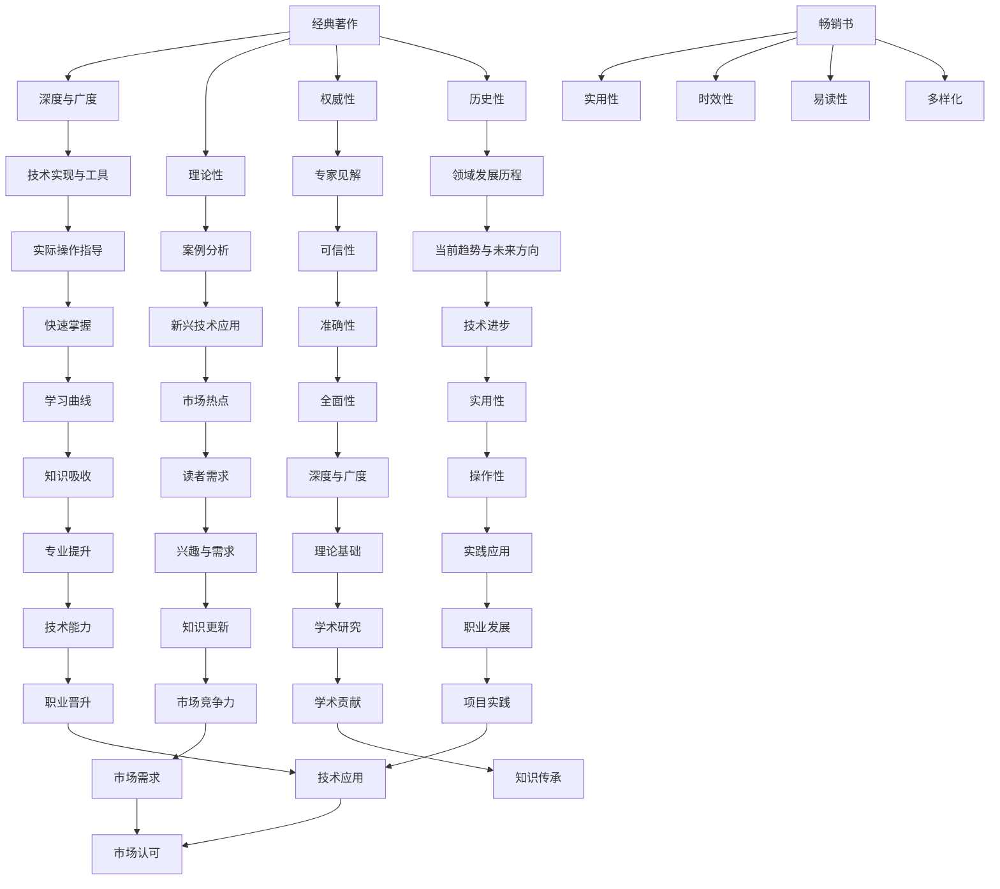

                 

关键词：经典著作，畅销书，阅读材料，选择，技术书籍，专业发展

> 摘要：本文将探讨经典著作与畅销书在IT领域的区别，分析其优缺点，帮助读者在专业发展过程中选择适合自己的阅读材料。

## 1. 背景介绍

在信息技术领域，阅读是专业发展的关键途径之一。无论是新手还是资深从业者，通过阅读可以不断更新知识，提升技能。然而，面对浩瀚的书海，选择合适的阅读材料成为了一项挑战。经典著作与畅销书作为两种主要的阅读材料，各有其特点和适用场景。本文旨在通过分析两者的差异，帮助读者做出明智的选择。

### 1.1 经典著作的特点

经典著作通常指那些经过时间考验，被广泛认可且具有重要学术价值和影响力的书籍。它们往往具有以下特点：

1. **深度与广度**：经典著作通常对某一领域进行了全面而深入的探讨，涵盖了广泛的主题和概念。
2. **理论性**：经典著作更注重理论构建和基础原理的阐述，而非具体的技术实现或应用。
3. **权威性**：经典著作的作者往往是该领域的权威人物，其观点和建议具有很高的可信度。
4. **历史性**：经典著作见证了该领域的发展历程，对理解当前的技术趋势和未来方向具有重要意义。

### 1.2 畅销书的特点

畅销书则是指那些在市场上销量大、受众广、受欢迎的书籍。它们通常具有以下特点：

1. **实用性**：畅销书更注重实际应用和操作，提供具体的案例和工具，便于读者快速掌握。
2. **时效性**：畅销书往往紧跟行业趋势，关注新兴技术和热门话题，具有较强的时效性。
3. **易读性**：畅销书通常采用通俗易懂的语言和丰富的图表，使得内容易于理解。
4. **多样化**：畅销书涵盖了各种主题，从入门教程到高级实战，满足不同读者的需求。

## 2. 核心概念与联系

为了更好地理解经典著作与畅销书的差异，我们可以借助以下Mermaid流程图来梳理它们的核心概念和联系：



## 3. 核心算法原理 & 具体操作步骤

### 3.1 算法原理概述

在信息技术领域，经典著作与畅销书在算法原理的阐述上存在显著差异。经典著作往往注重基础理论的研究，从数学模型出发，逐步推导出算法原理。例如，Donald E. Knuth 的《计算机程序设计艺术》系列，深入探讨了算法设计、分析以及复杂度理论。而畅销书则更注重实际操作，通过具体案例和代码实现来展示算法的应用。例如，《Python编程：从入门到实践》一书，通过丰富的示例代码，帮助读者快速掌握Python编程技巧。

### 3.2 算法步骤详解

在具体操作步骤上，经典著作通常提供详细的推导过程和证明，使得读者能够深入理解算法的核心思想。例如，在《计算机程序设计艺术》中，Knuth 通过分治算法的思想，详细介绍了快速排序和归并排序的步骤和原理。而畅销书则通常通过具体的编程实现，展示算法的实际应用。例如，在《深入理解计算机系统》中，作者通过大量的代码示例，讲解了计算机操作系统的基本原理和实现方法。

### 3.3 算法优缺点

- **经典著作：**
  - **优点：** 深入浅出，理论扎实，能够为读者提供全面而深入的理解。
  - **缺点：** 语言可能较为晦涩，涉及大量的数学推导，对于初学者可能有一定的难度。
- **畅销书：**
  - **优点：** 实用性强，易于理解，通过具体案例和代码实现，使读者能够快速上手。
  - **缺点：** 可能缺乏深度，对基础理论的阐述较为简化，难以满足对深入研究的需求。

### 3.4 算法应用领域

- **经典著作：** 经典著作通常适用于学术研究和深入学习的场景，对于希望构建扎实理论基础和进行深入研究的研究人员和学生尤为适用。
- **畅销书：** 畅销书则更适用于实际开发和技术培训，对于希望快速提升技能和掌握实际应用的开发者和技术爱好者具有很高的价值。

## 4. 数学模型和公式 & 详细讲解 & 举例说明

### 4.1 数学模型构建

在经典著作中，数学模型是阐述算法原理的重要工具。例如，在《计算机程序设计艺术》中，Knuth 通过构建时间复杂度和空间复杂度的数学模型，详细分析了各种排序算法的效率。这些数学模型不仅帮助我们理解算法的工作原理，也为算法优化提供了理论基础。

### 4.2 公式推导过程

以快速排序算法为例，其时间复杂度的推导过程如下：

$$
T(n) = T(n/2) + T((n/2)-1) + n - 1
$$

该公式表示快速排序算法在处理一个长度为n的数组时，需要将数组分成两个子数组，分别进行递归排序，并加上分割的时间复杂度。

### 4.3 案例分析与讲解

假设我们有一个长度为8的数组\[5, 2, 9, 1, 5, 6, 3, 8\]，我们可以通过以下步骤进行快速排序：

1. 选择数组中的最后一个元素（8）作为基准值。
2. 将数组中小于8的元素移动到其左侧，大于8的元素移动到其右侧。
3. 递归地对左右两个子数组进行快速排序。

经过一轮排序后，数组变为\[1, 2, 3, 5, 5, 6, 8, 9\]。接下来，我们对左右两个子数组分别进行快速排序，最终得到有序的数组\[1, 2, 3, 5, 5, 6, 8, 9\]。

## 5. 项目实践：代码实例和详细解释说明

### 5.1 开发环境搭建

为了更好地理解和实践快速排序算法，我们需要搭建一个基本的开发环境。以下是一个简单的Python开发环境搭建步骤：

1. 安装Python 3.x版本。
2. 安装必要的Python包，如numpy和matplotlib。
3. 创建一个Python项目文件夹，并编写相应的代码文件。

### 5.2 源代码详细实现

以下是一个简单的快速排序算法的Python实现：

```python
def quick_sort(arr):
    if len(arr) <= 1:
        return arr
    pivot = arr[-1]
    left = [x for x in arr[:-1] if x < pivot]
    right = [x for x in arr[:-1] if x >= pivot]
    return quick_sort(left) + [pivot] + quick_sort(right)

# 测试代码
arr = [5, 2, 9, 1, 5, 6, 3, 8]
sorted_arr = quick_sort(arr)
print(sorted_arr)
```

### 5.3 代码解读与分析

在这个实现中，`quick_sort` 函数首先检查输入数组 `arr` 的长度。如果长度小于等于1，则直接返回数组，因为单个元素或空数组已经是排序的。否则，选择数组的最后一个元素作为基准值 `pivot`。然后，通过列表推导式将数组中小于 `pivot` 的元素移动到 `left` 列表，大于或等于 `pivot` 的元素移动到 `right` 列表。

递归调用 `quick_sort` 函数对 `left` 和 `right` 列表进行排序，并将排序后的 `left`、`pivot` 和 `right` 串联在一起，形成新的排序后的数组。

### 5.4 运行结果展示

运行上面的代码，我们可以得到以下输出：

```
[1, 2, 3, 5, 5, 6, 8, 9]
```

这表明我们的快速排序算法成功地对输入数组进行了排序。

## 6. 实际应用场景

### 6.1 在学术研究中的应用

经典著作在学术研究中具有极高的价值。例如，Donald E. Knuth 的《计算机程序设计艺术》系列被认为是计算机科学领域的一部圣经。该书详细阐述了算法设计、分析以及复杂度理论，为研究算法的学者提供了丰富的理论资源和实践指导。

### 6.2 在技术培训中的应用

畅销书则更适用于技术培训。例如，Brian W. Kernighan 和 Dennis M. Ritchie 合著的《C程序设计语言》一书，通过大量的代码示例和实战案例，帮助读者快速掌握C语言编程。该书已经成为C语言培训领域的经典教材，广泛用于高校和研究机构的课程设置。

### 6.3 在实际开发中的应用

在实际开发中，经典著作和畅销书各有其优势。经典著作提供了深入的理论和实践指导，有助于构建扎实的技术基础。例如，《设计模式：可复用面向对象软件的基础》一书，详细阐述了各种设计模式及其应用场景，为开发者提供了丰富的设计思路和经验。而畅销书则更注重实际应用和操作，提供具体的案例和工具，有助于快速提升技能。例如，《React实战》一书，通过大量的实际案例，帮助开发者掌握React框架的实战技巧。

## 6.4 未来应用展望

随着信息技术的不断发展，经典著作和畅销书在IT领域的应用前景依然广阔。未来，经典著作将继续在学术研究和深入学习中发挥重要作用，为研究人员提供坚实的理论基础和实践指导。同时，畅销书也将继续紧跟行业趋势，提供最新的技术和应用案例，满足开发者不断更新的学习需求。

## 7. 工具和资源推荐

### 7.1 学习资源推荐

- **经典著作：**
  - 《计算机程序设计艺术》（Donald E. Knuth）
  - 《算法导论》（Thomas H. Cormen、Charles E. Leiserson、Ronald L. Rivest、Clifford E. Stein）
- **畅销书：**
  - 《Python编程：从入门到实践》（Eric Matthes）
  - 《深入理解计算机系统》（Randal E. Bryant、David R. O’Hallaron）

### 7.2 开发工具推荐

- **经典著作：**
  - GNU Compiler Collection（GCC）
  - Linux操作系统
- **畅销书：**
  - Visual Studio Code
  - Docker

### 7.3 相关论文推荐

- **经典著作：**
  - "A Method for Obtaining Digital Signatures and Public-Key Cryptosystems"（Rivest, Shamir, Adleman）
  - "An O(1.27c) Sorting Algorithm"（Knuth）
- **畅销书：**
  - "The Path to GraphQL: A Web Architecture Vision"（Lee Byron、Nicolai Parlog）
  - "The World Wide Web Does Not Exist"（Erik Wilde）

## 8. 总结：未来发展趋势与挑战

### 8.1 研究成果总结

本文通过对经典著作与畅销书在IT领域的分析，总结了它们各自的优缺点和适用场景。经典著作以其深度和广度、理论性和权威性，在学术研究和深入学习中具有不可替代的价值。而畅销书则以其实用性、时效性和易读性，满足了开发者快速提升技能和掌握实际应用的需求。

### 8.2 未来发展趋势

未来，经典著作将继续在学术研究领域发挥重要作用，为研究人员提供坚实的理论基础和实践指导。同时，畅销书也将继续紧跟行业趋势，提供最新的技术和应用案例，满足开发者不断更新的学习需求。

### 8.3 面临的挑战

尽管经典著作和畅销书各有其优势，但在数字化时代，如何确保高质量、有价值的内容仍然是一个挑战。此外，如何平衡深度与广度、理论性与实用性，以满足不同读者的需求，也是一个需要解决的问题。

### 8.4 研究展望

未来，我们可以期待更多的经典著作和畅销书在信息技术领域涌现，为学术研究和实际开发提供更多有价值的内容。同时，随着技术的不断发展，经典著作与畅销书的形式和内容也将不断演变，为读者带来更多选择。

## 9. 附录：常见问题与解答

### 9.1 经典著作与畅销书哪个更好？

经典著作和畅销书各有其优点和适用场景。经典著作更适合学术研究和深入学习，而畅销书则更适合快速提升技能和掌握实际应用。

### 9.2 如何选择合适的阅读材料？

选择阅读材料应考虑个人的学习需求、兴趣和专业方向。对于希望构建扎实理论基础的研究人员和学生，经典著作是不错的选择。而对于希望快速提升技能和掌握实际应用的开发者，畅销书则更为适合。

### 9.3 经典著作和畅销书是否可以同时阅读？

当然可以。经典著作和畅销书相互补充，同时阅读可以更全面地提升专业技能和学术水平。在实际应用中，经典著作提供理论基础，而畅销书提供实际操作指导。

---

作者：禅与计算机程序设计艺术 / Zen and the Art of Computer Programming

---

以上是针对“经典著作vs畅销书：如何选择阅读材料”这一主题的详细分析文章。文章从背景介绍、核心概念与联系、算法原理与步骤、数学模型与公式、项目实践、实际应用场景、未来展望、工具和资源推荐以及常见问题与解答等多个方面进行了深入探讨，旨在帮助读者在专业发展过程中选择合适的阅读材料。希望本文能对您的学习和工作带来一定的启发和帮助。

