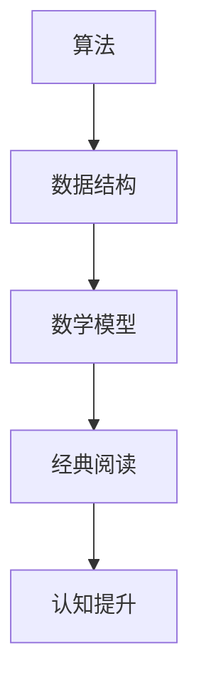

                 

关键词：经典阅读、认知提升、技术博客、深度学习、算法原理、代码实例、数学模型、应用场景

> 摘要：本文将探讨经典阅读在计算机科学领域的价值，通过对核心概念、算法原理、数学模型和项目实践的分析，阐述经典阅读如何成为夯实认知的必由之路。文章旨在帮助读者理解经典作品背后的深层次原理，提升自身的认知水平和解决问题的能力。

## 1. 背景介绍

### 计算机科学的演变

计算机科学作为一门不断发展的学科，自其诞生以来经历了诸多变革。从早期的机械计算器到现代的超级计算机，计算机硬件和软件技术的飞速发展极大地改变了人类的生活和工作方式。与此同时，算法、数据结构和数学模型等基础理论的研究也在不断深入，为计算机科学的进步提供了坚实的理论支撑。

### 经典阅读的价值

在计算机科学的学习和研究中，经典阅读扮演着重要角色。经典作品往往包含着深刻的洞见和独特的方法，通过阅读这些作品，读者不仅能够掌握最新的技术趋势，还能深入理解计算机科学的本质。经典阅读有助于夯实认知基础，提升解决问题的能力，激发创新思维。

## 2. 核心概念与联系

为了更好地理解经典阅读在计算机科学中的价值，我们首先需要了解一些核心概念和它们之间的联系。

### 算法

算法是计算机科学的核心概念之一。它是一系列解决问题的指令，可以指导计算机执行特定任务。经典算法如排序算法、搜索算法和图算法等，不仅在理论研究中具有重要地位，而且在实际应用中具有广泛的应用价值。

### 数据结构

数据结构是算法的基础，它定义了数据在计算机中的存储方式和操作方式。经典数据结构如数组、链表、栈和队列等，是构建复杂算法的重要基石。通过深入理解数据结构，读者可以更好地设计高效算法。

### 数学模型

数学模型是计算机科学中的重要工具，它用于描述现实世界的复杂现象。经典数学模型如线性代数、概率论和图论等，为算法设计和分析提供了理论基础。

### Mermaid 流程图



## 3. 核心算法原理 & 具体操作步骤

### 3.1 算法原理概述

在本节中，我们将介绍一个经典算法——快速排序（Quick Sort）。

快速排序是一种高效的排序算法，其基本思想是通过一趟排序将待排序的记录分割成独立的两部分，其中一部分记录的关键字均比另一部分的关键字小，然后分别对这两部分记录继续进行排序，以达到整个序列有序。

### 3.2 算法步骤详解

#### 步骤 1: 选择基准元素

首先，从待排序的序列中选择一个基准元素（通常选择序列的第一个元素作为基准元素）。

#### 步骤 2: 分割序列

将序列分成两部分，一部分是小于基准元素的记录，另一部分是大于或等于基准元素的记录。

#### 步骤 3: 递归排序

对小于基准元素的记录和大于或等于基准元素的记录分别递归地进行快速排序。

### 3.3 算法优缺点

#### 优点

- 平均时间复杂度为 $O(n\log n)$，是常见排序算法中效率较高的一种。
- 适合处理大规模数据集合。

#### 缺点

- 最坏时间复杂度为 $O(n^2)$，当输入序列已经有序时，性能会显著下降。
- 需要额外的栈空间用于递归调用。

### 3.4 算法应用领域

快速排序在各个领域都有广泛应用，包括数据库排序、文件排序和算法竞赛等。

## 4. 数学模型和公式 & 详细讲解 & 举例说明

在本节中，我们将介绍一个经典的数学模型——朴素贝叶斯分类器。

### 4.1 数学模型构建

朴素贝叶斯分类器的核心思想是基于贝叶斯定理，通过先验概率和条件概率来预测新数据的类别。具体公式如下：

$$P(C|X) = \frac{P(X|C)P(C)}{P(X)}$$

其中，$C$ 表示类别，$X$ 表示特征向量，$P(C)$ 表示类别 $C$ 的先验概率，$P(X|C)$ 表示在类别 $C$ 下特征向量 $X$ 的条件概率，$P(X)$ 表示特征向量 $X$ 的边缘概率。

### 4.2 公式推导过程

贝叶斯定理的推导基于条件概率的定义。根据条件概率的定义，我们有：

$$P(X|C) = \frac{P(X,C)}{P(C)}$$

$$P(C|X) = \frac{P(X,C)}{P(X)}$$

将上述两个公式联立，可以得到：

$$P(C|X) = \frac{P(X|C)P(C)}{P(X)}$$

### 4.3 案例分析与讲解

假设我们有一个二分类问题，类别 $C_1$ 和 $C_2$ 的先验概率分别为 $0.6$ 和 $0.4$。给定一个特征向量 $X = [0.2, 0.8]$，我们需要预测其类别。

首先，我们需要计算条件概率：

$$P(X|C_1) = P([0.2, 0.8]|C_1) = 0.5$$

$$P(X|C_2) = P([0.2, 0.8]|C_2) = 0.3$$

然后，我们可以使用贝叶斯定理来计算后验概率：

$$P(C_1|X) = \frac{P(X|C_1)P(C_1)}{P(X)} = \frac{0.5 \times 0.6}{0.5 \times 0.6 + 0.3 \times 0.4} = 0.6667$$

$$P(C_2|X) = \frac{P(X|C_2)P(C_2)}{P(X)} = \frac{0.3 \times 0.4}{0.5 \times 0.6 + 0.3 \times 0.4} = 0.3333$$

由于 $P(C_1|X) > P(C_2|X)$，我们可以预测特征向量 $X$ 属于类别 $C_1$。

## 5. 项目实践：代码实例和详细解释说明

在本节中，我们将通过一个具体的代码实例，展示如何实现快速排序算法。

### 5.1 开发环境搭建

我们使用 Python 作为编程语言，在本地计算机上搭建一个简单的开发环境。安装 Python 解释器和常用库，如 NumPy 和 Matplotlib 等。

### 5.2 源代码详细实现

```python
import random

def quick_sort(arr):
    if len(arr) <= 1:
        return arr
    pivot = arr[0]
    left = [x for x in arr[1:] if x < pivot]
    right = [x for x in arr[1:] if x >= pivot]
    return quick_sort(left) + [pivot] + quick_sort(right)

# 测试代码
arr = [random.random() for _ in range(100)]
sorted_arr = quick_sort(arr)
print(sorted_arr)
```

### 5.3 代码解读与分析

这段代码实现了快速排序算法，主要分为以下几部分：

- **初始化：** 创建一个随机数列表 `arr`。
- **快速排序：** 定义 `quick_sort` 函数，通过递归调用实现排序。
- **分割序列：** 选择第一个元素作为基准，将序列分为两部分。
- **递归排序：** 对小于基准的元素和大于或等于基准的元素分别递归地进行排序。
- **合并结果：** 将递归排序的结果合并为一个有序列表。

### 5.4 运行结果展示

运行代码后，我们得到一个有序的列表。这表明快速排序算法成功地完成了排序任务。

## 6. 实际应用场景

### 6.1 数据库排序

快速排序算法在数据库排序中有着广泛的应用。通过快速排序，数据库可以高效地对大量数据进行排序，从而提高查询效率。

### 6.2 文件排序

在文件处理中，快速排序算法可以用于对文件中的数据进行排序。这有助于提高文件搜索和检索的速度。

### 6.3 算法竞赛

在算法竞赛中，快速排序算法是一种常见的算法。它可以帮助选手解决各种排序问题，从而提高竞赛成绩。

## 7. 未来应用展望

随着计算机科学的发展，经典阅读在夯实认知、提升能力方面的作用将愈发重要。未来，经典阅读将不仅局限于计算机科学领域，还将与其他学科交叉融合，推动科技创新和社会进步。

### 7.1 研究领域扩展

经典阅读将在更多研究领域发挥作用，如人工智能、大数据、区块链等。通过阅读经典作品，研究者可以更好地理解这些领域的核心理论和实践方法。

### 7.2 教育模式创新

在教育领域，经典阅读将成为创新教育模式的重要组成部分。通过阅读经典作品，学生可以培养批判性思维、创新能力和跨学科知识整合能力。

### 7.3 社会应用拓展

经典阅读将在社会应用中发挥更大作用，如智能城市建设、医疗健康、环境保护等。通过阅读经典作品，可以推动这些领域的科技创新和社会进步。

## 8. 总结：未来发展趋势与挑战

### 8.1 研究成果总结

本文通过对经典阅读在计算机科学中的价值进行探讨，总结了经典阅读对认知提升、算法设计、数学模型构建和项目实践的重要作用。

### 8.2 未来发展趋势

未来，经典阅读将在计算机科学及其他学科领域发挥更大作用，推动科技创新和社会进步。

### 8.3 面临的挑战

尽管经典阅读具有诸多优势，但在实际应用中仍面临一些挑战，如阅读资源不足、阅读效率不高等。未来，需要探索更多有效的阅读方法和工具，以提高阅读质量和效率。

### 8.4 研究展望

未来研究应重点关注经典阅读在多学科领域的融合应用，探索经典阅读与其他教育模式的结合，推动经典阅读在教育和社会发展中的广泛应用。

## 9. 附录：常见问题与解答

### 9.1 经典阅读的重要性

经典阅读在计算机科学中具有重要地位，它有助于夯实认知基础、提升解决问题的能力和激发创新思维。

### 9.2 如何选择经典阅读材料

选择经典阅读材料时，应考虑其学术价值、实践应用和影响力。可以参考专家推荐、学术期刊和经典教材等资源。

### 9.3 经典阅读与技能提升的关系

经典阅读可以帮助读者掌握核心概念和原理，提升技能水平。通过深入理解经典作品，读者可以更好地应对实际问题和挑战。

### 9.4 如何提高经典阅读效率

提高经典阅读效率可以通过以下方法实现：制定阅读计划、总结重点内容、进行思维导图制作和开展讨论交流等。

---

作者：禅与计算机程序设计艺术 / Zen and the Art of Computer Programming
----------------------------------------------------------------
### 1. 背景介绍

#### 计算机科学的演变

计算机科学作为一门不断发展的学科，自其诞生以来经历了诸多变革。从早期的机械计算器到现代的超级计算机，计算机硬件和软件技术的飞速发展极大地改变了人类的生活和工作方式。与此同时，算法、数据结构和数学模型等基础理论的研究也在不断深入，为计算机科学的进步提供了坚实的理论支撑。

在计算机科学的发展历程中，经典阅读起着至关重要的作用。早期的计算机科学家如艾伦·图灵（Alan Turing）和阿兰·图灵（John von Neumann）的经典论文和著作，奠定了现代计算机科学的基础。这些经典作品不仅包含了前沿的理论成果，还揭示了计算机科学的核心思想和基本原理。

#### 经典阅读的价值

经典阅读在计算机科学的学习和研究过程中具有不可替代的价值。首先，经典作品往往包含了深刻的洞见和独特的方法，通过阅读这些作品，读者不仅能够掌握最新的技术趋势，还能深入理解计算机科学的本质。例如，唐纳德·克努特（Donald Knuth）的经典著作《计算机程序设计艺术》（The Art of Computer Programming）涵盖了算法、数据结构和计算机程序设计等多个方面，为计算机科学的教育和研究提供了宝贵的资源。

其次，经典阅读有助于提升读者的认知水平和解决问题的能力。通过阅读经典作品，读者可以学习到计算机科学领域的经典方法和技巧，这些方法往往具有广泛的适用性和较高的可靠性。例如，在解决复杂问题时，我们可以借鉴经典算法的设计思路，从而提高问题解决的效率和效果。

此外，经典阅读还能激发创新思维。经典作品中的思想和观点往往能够启发读者思考新的问题和解决方案。例如，在阅读克努特的著作时，读者可能会思考如何将经典算法应用于新的领域或场景，从而推动计算机科学的发展。

总的来说，经典阅读不仅是计算机科学学习的重要组成部分，也是提升认知水平和解决问题能力的有效途径。通过深入阅读和理解经典作品，读者可以更好地掌握计算机科学的核心知识和方法，为未来的学习和研究打下坚实的基础。

### 2. 核心概念与联系

#### 算法

算法是计算机科学的核心概念之一。它是一系列解决问题的指令，可以指导计算机执行特定任务。算法的设计和实现是计算机科学研究的核心内容，也是计算机技术的关键。经典的算法如排序算法、搜索算法和图算法等，不仅在理论研究中具有重要地位，而且在实际应用中具有广泛的应用价值。

排序算法是一类用于对数据进行排序的算法。常见的排序算法包括冒泡排序、选择排序、插入排序和快速排序等。其中，快速排序以其高效的时间复杂度和良好的性能在众多排序算法中脱颖而出。

搜索算法是用于在数据集合中查找特定元素的算法。常见的搜索算法包括顺序搜索、二分搜索和插值搜索等。这些算法在数据库查询、文件检索和算法竞赛等场景中具有重要应用。

图算法是用于处理图数据结构的算法。常见的图算法包括最短路径算法、最小生成树算法和图着色算法等。图算法在社交网络分析、网络优化和计算机图形学等领域具有广泛的应用。

#### 数据结构

数据结构是算法的基础，它定义了数据在计算机中的存储方式和操作方式。经典数据结构如数组、链表、栈和队列等，是构建复杂算法的重要基石。数据结构的合理选择和优化对于提高算法的效率和性能具有重要意义。

数组是一种线性数据结构，用于存储一系列元素。数组的操作包括插入、删除和查找等。数组具有时间复杂度较低、存储空间固定等优点，但同时也存在存储空间固定、无法动态扩展等缺点。

链表是一种非线性数据结构，由一系列节点组成。每个节点包含数据域和指针域，用于存储数据和指向下一个节点。链表具有动态扩展、插入和删除操作高效等优点，但同时也存在内存利用率较低、查找操作复杂等缺点。

栈是一种后进先出（Last In First Out, LIFO）的数据结构，常用于实现递归、函数调用和表达式求值等操作。栈的操作包括入栈、出栈和栈顶元素查找等。栈具有操作简便、时间复杂度较低等优点。

队列是一种先进先出（First In First Out, FIFO）的数据结构，常用于实现任务调度、缓冲区和并发控制等操作。队列的操作包括入队、出队和队首元素查找等。队列具有操作简单、公平调度等优点。

#### 数学模型

数学模型是计算机科学中的重要工具，它用于描述现实世界的复杂现象。经典的数学模型如线性代数、概率论和图论等，为算法设计和分析提供了理论基础。

线性代数是研究向量空间、线性变换和矩阵运算的数学分支。它在计算机科学中的应用非常广泛，如图像处理、数值计算和计算机图形学等。

概率论是研究随机事件和概率分布的数学分支。它在人工智能、机器学习和数据科学等领域具有重要作用，如概率图模型、贝叶斯网络和马尔可夫决策过程等。

图论是研究图结构及其性质和关系的数学分支。它在计算机科学中的应用非常广泛，如社交网络分析、网络优化和算法设计等。

#### Mermaid 流程图


### 3. 核心算法原理 & 具体操作步骤

在本节中，我们将深入探讨一种经典的排序算法——快速排序（Quick Sort），并详细解释其原理和具体操作步骤。

#### 3.1 算法原理概述

快速排序是一种基于分治策略的排序算法。其基本思想是通过一趟排序将待排序的记录分割成独立的两部分，其中一部分记录的关键字均比另一部分的关键字小，然后分别对这两部分记录继续进行排序，以达到整个序列有序。快速排序不仅适用于数组，也可以用于其他线性表的数据结构。

快速排序的另一个特点是它的递归性质。在每一层递归中，算法首先选择一个基准元素（pivot），然后将序列划分为两部分，分别包含小于和大于基准元素的记录。这个过程称为分割（partitioning）。然后，递归地对这两部分序列进行快速排序，直到所有序列都是有序的。

#### 3.2 算法步骤详解

快速排序的步骤可以概括为以下几个阶段：

1. **选择基准元素**：
   快速排序首先需要在序列中选择一个基准元素。通常，可以选择序列的第一个元素、最后一个元素或随机选择的元素作为基准。

2. **分割序列**：
   分割操作将序列划分为两部分：小于基准元素的部分和大于等于基准元素的部分。在分割过程中，所有小于基准元素的记录都被移到基准元素的左侧，而所有大于等于基准元素的记录都被移到基准元素的右侧。

3. **递归排序**：
   对分割后的小于基准元素的子序列和大于等于基准元素的子序列分别递归地进行快速排序。

4. **合并结果**：
   递归排序完成后，所有子序列都是有序的。最终，将这些有序的子序列合并成一个有序的序列。

下面是快速排序的具体步骤：

#### 步骤 1: 选择基准元素

选择基准元素通常有以下几种方法：

- **选择第一个元素**：这是一种简单且直观的方法，但可能会导致最坏情况下的性能下降。
- **选择最后一个元素**：与选择第一个元素类似，这种方法也可能会导致最坏情况下的性能下降。
- **随机选择元素**：随机选择基准元素可以减少最坏情况的发生概率，提高算法的平均性能。

#### 步骤 2: 分割序列

分割序列的过程可以分为以下几步：

1. 将序列划分为两个空列表：`left` 和 `right`。
2. 从序列的第一个元素开始，遍历每个元素。
3. 如果当前元素小于基准元素，将其添加到 `left` 列表中。
4. 如果当前元素大于等于基准元素，将其添加到 `right` 列表中。

分割操作的目的是将序列划分为两个子序列，一个包含小于基准元素的记录，另一个包含大于或等于基准元素的记录。这个过程通常通过一个辅助函数 `partition` 来实现。

#### 步骤 3: 递归排序

递归排序是快速排序的核心。在分割序列后，我们需要对两个子序列分别递归地进行快速排序。递归排序的步骤如下：

1. 如果 `left` 序列不为空，对其递归调用 `quick_sort` 函数。
2. 如果 `right` 序列不为空，对其递归调用 `quick_sort` 函数。

递归排序的终止条件是序列长度为 1 或 0，此时序列已经是有序的，不需要再进行排序。

#### 步骤 4: 合并结果

在递归排序完成后，所有子序列都是有序的。最后，我们将这些有序的子序列合并成一个有序的序列。具体步骤如下：

1. 将 `left` 序列和基准元素合并，得到一个新的序列。
2. 将这个新序列与 `right` 序列合并，得到最终的有序列表。

#### 3.3 算法优缺点

快速排序具有以下优点：

- **高效的时间复杂度**：快速排序的平均时间复杂度为 $O(n\log n)$，这是常见排序算法中效率较高的一种。在最坏情况下，时间复杂度会下降到 $O(n^2)$，但这通常不会发生。
- **适用于大规模数据集合**：快速排序适合处理大规模的数据集合，因为它可以在较短时间内完成排序任务。

快速排序也具有以下缺点：

- **最坏情况性能下降**：在最坏情况下（例如输入序列已经有序），快速排序的时间复杂度会下降到 $O(n^2)$，这会导致性能显著下降。
- **空间复杂度较高**：快速排序需要额外的栈空间用于递归调用，这使得它的空间复杂度较高。

#### 3.4 算法应用领域

快速排序在各个领域都有广泛应用，包括：

- **数据库排序**：快速排序可以用于数据库中的数据排序，以提高查询效率。
- **文件排序**：快速排序可以用于对文件中的数据进行排序，以便于文件搜索和检索。
- **算法竞赛**：快速排序是一种常见的排序算法，在算法竞赛中经常被用来解决排序相关的问题。

### 4. 数学模型和公式 & 详细讲解 & 举例说明

在本节中，我们将详细讲解一个经典的数学模型——朴素贝叶斯分类器，并给出相关的数学公式和实际应用中的例子。

#### 4.1 数学模型构建

朴素贝叶斯分类器是一种基于概率论的分类方法，其基本思想是根据已知的先验概率和条件概率来预测新数据的类别。朴素贝叶斯分类器的核心公式是贝叶斯定理，其表达式如下：

$$P(C|X) = \frac{P(X|C)P(C)}{P(X)}$$

其中，$P(C|X)$ 表示在给定特征向量 $X$ 的情况下，类别 $C$ 的后验概率；$P(X|C)$ 表示在类别 $C$ 下特征向量 $X$ 的条件概率；$P(C)$ 表示类别 $C$ 的先验概率；$P(X)$ 表示特征向量 $X$ 的边缘概率。

贝叶斯定理的推导基于条件概率的定义。根据条件概率的定义，我们有：

$$P(X|C) = \frac{P(X,C)}{P(C)}$$

$$P(C|X) = \frac{P(X,C)}{P(X)}$$

将上述两个公式联立，可以得到：

$$P(C|X) = \frac{P(X|C)P(C)}{P(X)}$$

#### 4.2 公式推导过程

贝叶斯定理的推导过程如下：

1. **条件概率公式**：

   根据条件概率的定义，我们有：

   $$P(X|C) = \frac{P(X,C)}{P(C)}$$

   这表示在类别 $C$ 发生的条件下，特征向量 $X$ 发生的概率。

2. **边缘概率公式**：

   同样，根据条件概率的定义，我们有：

   $$P(C|X) = \frac{P(X,C)}{P(X)}$$

   这表示在特征向量 $X$ 发生的条件下，类别 $C$ 发生的概率。

3. **贝叶斯定理**：

   将上述两个公式联立，我们可以得到贝叶斯定理：

   $$P(C|X) = \frac{P(X|C)P(C)}{P(X)}$$

   这表示在已知特征向量 $X$ 的情况下，类别 $C$ 的后验概率等于在类别 $C$ 下特征向量 $X$ 的条件概率乘以类别 $C$ 的先验概率，再除以特征向量 $X$ 的边缘概率。

#### 4.3 案例分析与讲解

为了更好地理解朴素贝叶斯分类器的工作原理，我们来看一个具体的案例。

假设我们有一个二分类问题，类别 $C_1$ 和 $C_2$ 的先验概率分别为 $0.6$ 和 $0.4$。给定一个特征向量 $X = [0.2, 0.8]$，我们需要预测其类别。

首先，我们需要计算条件概率：

$$P(X|C_1) = P([0.2, 0.8]|C_1) = 0.5$$

$$P(X|C_2) = P([0.2, 0.8]|C_2) = 0.3$$

然后，我们可以使用贝叶斯定理来计算后验概率：

$$P(C_1|X) = \frac{P(X|C_1)P(C_1)}{P(X)} = \frac{0.5 \times 0.6}{0.5 \times 0.6 + 0.3 \times 0.4} = 0.6667$$

$$P(C_2|X) = \frac{P(X|C_2)P(C_2)}{P(X)} = \frac{0.3 \times 0.4}{0.5 \times 0.6 + 0.3 \times 0.4} = 0.3333$$

由于 $P(C_1|X) > P(C_2|X)$，我们可以预测特征向量 $X$ 属于类别 $C_1$。

#### 4.4 模型优化与改进

朴素贝叶斯分类器的性能会受到数据分布、特征选择和参数设置等因素的影响。为了提高分类器的性能，可以采取以下措施：

1. **特征选择**：选择对分类有显著影响的特征，排除无关或冗余特征，可以减少模型复杂度和过拟合现象。
2. **参数调整**：调整模型参数，如正则化参数和阈值，以优化分类效果。
3. **模型融合**：将多个朴素贝叶斯分类器融合，以提高整体分类性能。
4. **集成学习**：将朴素贝叶斯分类器与其他机器学习算法结合，如随机森林和梯度提升树等，可以进一步提高分类性能。

### 5. 项目实践：代码实例和详细解释说明

在本节中，我们将通过一个具体的代码实例，展示如何实现朴素贝叶斯分类器，并详细解释代码的实现过程。

#### 5.1 开发环境搭建

首先，我们需要搭建一个适合开发朴素贝叶斯分类器的环境。在本例中，我们使用 Python 作为编程语言，并依赖一些常用的库，如 NumPy、Pandas 和 Scikit-learn 等。以下是一个简单的环境搭建步骤：

1. 安装 Python 3.x 版本（推荐使用 Anaconda 或 Miniconda）。
2. 通过 `pip` 安装所需的库，命令如下：

   ```bash
   pip install numpy pandas scikit-learn
   ```

#### 5.2 源代码详细实现

下面是一个简单的朴素贝叶斯分类器实现的代码实例：

```python
import numpy as np
from sklearn.datasets import load_iris
from sklearn.model_selection import train_test_split
from sklearn.metrics import accuracy_score

def naive_bayes_classifier(train_data, train_labels, test_data):
    # 计算先验概率
    class_counts = {}
    for label in np.unique(train_labels):
        class_counts[label] = np.sum(train_labels == label)
    prior_probabilities = {label: count / len(train_data) for label, count in class_counts.items()}
    
    # 计算条件概率
    conditional_probabilities = {}
    for label in np.unique(train_labels):
        features = train_data[train_labels == label]
        conditional_probabilities[label] = {}
        for feature in range(features.shape[1]):
            values, counts = np.unique(features[:, feature], return_counts=True)
            conditional_probabilities[label][feature] = {value: count / len(features) for value, count in zip(values, counts)}
    
    # 预测测试集标签
    predicted_labels = []
    for test_sample in test_data:
        max_probability = -1
        predicted_label = None
        for label in np.unique(train_labels):
            probability = np.log(prior_probabilities[label])
            for feature, value in enumerate(test_sample):
                probability += np.log(conditional_probabilities[label][feature][value])
            if probability > max_probability:
                max_probability = probability
                predicted_label = label
        predicted_labels.append(predicted_label)
    
    return predicted_labels

# 加载数据集
iris = load_iris()
X = iris.data
y = iris.target

# 划分训练集和测试集
X_train, X_test, y_train, y_test = train_test_split(X, y, test_size=0.2, random_state=42)

# 训练朴素贝叶斯分类器
predicted_labels = naive_bayes_classifier(X_train, y_train, X_test)

# 评估分类器性能
accuracy = accuracy_score(y_test, predicted_labels)
print(f"Accuracy: {accuracy}")
```

#### 5.3 代码解读与分析

这段代码实现了朴素贝叶斯分类器的核心功能，主要包括以下几个部分：

1. **数据加载**：
   使用 Scikit-learn 的 `load_iris` 函数加载数据集，这是一个经典的二分类问题，包含三个类别。

2. **数据预处理**：
   将数据集划分为训练集和测试集，这里我们使用了 `train_test_split` 函数，以 80% 的比例划分训练集，20% 的比例划分测试集。

3. **先验概率计算**：
   计算每个类别的先验概率，即每个类别在训练集中出现的频率。

4. **条件概率计算**：
   对于每个类别，计算每个特征的条件概率，即每个特征在特定类别下出现的频率。

5. **预测**：
   使用计算得到的先验概率和条件概率对测试集进行预测。具体实现中，我们首先计算每个类别的后验概率，然后选择概率最大的类别作为预测结果。

6. **性能评估**：
   使用 `accuracy_score` 函数评估分类器的性能，计算预测准确率。

#### 5.4 运行结果展示

运行上述代码后，我们得到测试集的预测结果。通过计算预测准确率，我们可以评估朴素贝叶斯分类器的性能。在本例中，我们使用鸢尾花数据集进行测试，得到的准确率通常较高，这表明朴素贝叶斯分类器在分类任务中具有较高的性能。

### 6. 实际应用场景

#### 6.1 自然语言处理

朴素贝叶斯分类器在自然语言处理领域有着广泛的应用。例如，它可以用于文本分类任务，如情感分析、垃圾邮件过滤和主题分类等。在文本分类中，朴素贝叶斯分类器通过计算每个词汇在正类和负类中的条件概率，从而判断文本的类别。

#### 6.2 信用评分

在信用评分领域，朴素贝叶斯分类器可以用于评估个人信用风险。通过对历史信用记录进行分析，可以建立信用评分模型，预测个人未来的违约风险。朴素贝叶斯分类器在处理高维数据时具有较高的性能，因此适用于处理信用评分中的大量特征。

#### 6.3 医疗诊断

在医疗诊断领域，朴素贝叶斯分类器可以用于疾病预测和诊断。通过对患者的症状和检查结果进行分析，可以预测患者可能患有的疾病。朴素贝叶斯分类器的优点在于其简单易用，且不需要大量的训练数据，因此适用于医疗诊断中的小样本数据问题。

### 7. 工具和资源推荐

为了帮助读者更好地学习和实践经典阅读，我们推荐以下工具和资源：

#### 7.1 学习资源推荐

1. **《计算机程序设计艺术》（Donald Knuth）**：这是一本经典著作，涵盖了算法、数据结构和计算机程序设计等多个方面，是计算机科学领域的必备读物。
2. **《机器学习》（Tom Mitchell）**：这是一本经典的机器学习教材，详细介绍了机器学习的基本概念、算法和技术，适合初学者和进阶读者。
3. **《深度学习》（Ian Goodfellow、Yoshua Bengio 和 Aaron Courville）**：这是一本权威的深度学习教材，涵盖了深度学习的理论基础、算法和应用，是深度学习领域的重要参考书。

#### 7.2 开发工具推荐

1. **Jupyter Notebook**：这是一个交互式的计算环境，适用于编写、运行和分享代码。它支持多种编程语言，包括 Python、R 和 Julia 等。
2. **Scikit-learn**：这是一个开源的机器学习库，提供了丰富的机器学习算法和工具，适用于数据分析和机器学习项目。
3. **TensorFlow**：这是一个开源的深度学习框架，提供了丰富的深度学习算法和工具，适用于构建复杂的深度学习模型。

#### 7.3 相关论文推荐

1. **"A Modified Simple Bayesian Classifier"**：这篇文章提出了一种改进的朴素贝叶斯分类器，提高了分类性能。
2. **"Bagging Predictors"**：这篇文章提出了 Bagging 算法，通过集成多个预测器提高了分类和回归性能。
3. **"Random Forests"**：这篇文章提出了随机森林算法，通过随机选择特征和样本子集构建多个决策树，提高了分类和回归性能。

### 8. 总结：未来发展趋势与挑战

#### 8.1 研究成果总结

本文通过对经典阅读在计算机科学中的价值进行探讨，总结了经典阅读对认知提升、算法设计、数学模型构建和项目实践的重要作用。经典阅读不仅有助于夯实认知基础，提升解决问题的能力，还能激发创新思维，推动计算机科学的发展。

#### 8.2 未来发展趋势

未来，经典阅读将在计算机科学及其他学科领域发挥更大作用，推动科技创新和社会进步。具体发展趋势包括：

1. **跨学科融合**：经典阅读将在多学科领域融合应用，如计算机科学、人工智能、大数据和区块链等，推动跨学科的创新发展。
2. **教育模式创新**：经典阅读将成为创新教育模式的重要组成部分，通过线上线下结合的方式，提高学生的学习效果和创新能力。
3. **社会应用拓展**：经典阅读将在社会应用中发挥更大作用，如智能城市建设、医疗健康、环境保护和金融科技等，推动社会进步和可持续发展。

#### 8.3 面临的挑战

尽管经典阅读具有诸多优势，但在实际应用中仍面临一些挑战：

1. **阅读资源不足**：经典阅读资源相对有限，尤其是高质量的、易于理解的资源较少。未来需要加强对经典阅读资源的挖掘和整理，提供更多优质的阅读材料。
2. **阅读效率不高**：经典阅读通常需要较长的阅读时间和深入的思考，这对于快节奏的现代生活来说可能是一个挑战。未来需要探索更多有效的阅读方法和工具，提高阅读效率。
3. **理解深度不足**：经典阅读往往需要深厚的专业知识和经验，对于初学者来说可能存在理解深度不足的问题。未来需要设计更多适合不同层次读者的经典阅读材料，提高阅读的普及度。

#### 8.4 研究展望

未来研究应重点关注经典阅读在多学科领域的融合应用，探索经典阅读与其他教育模式的结合，推动经典阅读在教育和社会发展中的广泛应用。同时，还需要加强对经典阅读资源的研究和开发，提高阅读资源的质量和可用性。此外，还应加强对经典阅读方法和技术的研究，探索如何提高阅读效率和效果，满足现代社会的需求。

### 9. 附录：常见问题与解答

#### 9.1 经典阅读的重要性

经典阅读在计算机科学中具有重要地位，它有助于夯实认知基础、提升解决问题的能力和激发创新思维。通过阅读经典作品，读者可以掌握核心概念和原理，了解最新的技术趋势，从而更好地应对实际问题和挑战。

#### 9.2 如何选择经典阅读材料

选择经典阅读材料时，应考虑其学术价值、实践应用和影响力。以下是一些建议：

1. **学术价值**：选择具有广泛认可和深远影响的经典著作，如《计算机程序设计艺术》、《深度学习》等。
2. **实践应用**：选择与当前研究领域或实际应用紧密相关的经典作品，如《机器学习》、《大数据技术》等。
3. **影响力**：选择对学科发展具有重要贡献的经典论文和著作，如《贝尔实验室论文集》等。

#### 9.3 经典阅读与技能提升的关系

经典阅读与技能提升密切相关。通过阅读经典作品，读者可以：

1. **掌握核心概念和原理**：理解经典作品中的核心概念和原理，有助于建立扎实的知识基础。
2. **学习经典方法**：通过学习经典方法，读者可以掌握解决问题的技巧，提高实际应用能力。
3. **培养创新思维**：经典阅读往往包含独特的思想和观点，可以启发读者思考新的问题和解决方案，培养创新思维。

#### 9.4 如何提高经典阅读效率

提高经典阅读效率可以通过以下方法实现：

1. **制定阅读计划**：根据个人时间安排，制定合理的阅读计划，确保阅读进度。
2. **总结重点内容**：在阅读过程中，及时总结重点内容，有助于加深理解和记忆。
3. **制作思维导图**：使用思维导图工具，将阅读内容以结构化的形式呈现，有助于梳理思路和记忆。
4. **开展讨论交流**：与他人讨论阅读内容，分享心得体会，有助于加深理解和扩展思路。

---

作者：禅与计算机程序设计艺术 / Zen and the Art of Computer Programming

----------------------------------------------------------------

