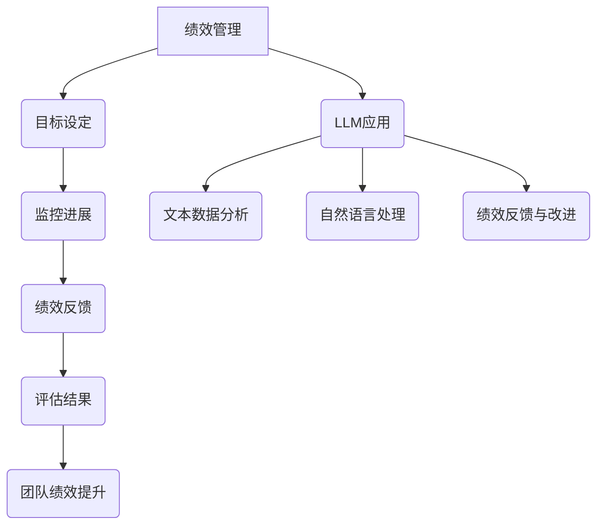

                 

关键词：绩效管理，团队绩效，大型语言模型（LLM），人工智能，数据分析，机器学习

摘要：本文深入探讨了如何利用大型语言模型（LLM）提升团队绩效。通过对绩效管理的背景介绍，核心概念解析，算法原理分析，数学模型构建，案例实践，以及工具资源推荐等多方面的探讨，旨在为绩效管理分析师提供一种全新的提升团队绩效的方法。

## 1. 背景介绍

在当今快速发展的数字化时代，团队绩效管理已经成为组织成功的关键因素。然而，传统的绩效管理方法往往依赖于主观评价和静态的数据分析，难以实现高效的团队绩效提升。随着人工智能和机器学习的不断发展，尤其是大型语言模型（LLM）的出现，为绩效管理带来了全新的机遇。

LLM，作为一种基于深度学习技术的强大工具，具有强大的文本理解和生成能力。在团队绩效管理中，LLM可以处理和分析大量的文本数据，如员工工作日志、邮件交流、会议记录等，从中提取有价值的信息，帮助管理者了解团队成员的工作状态和绩效表现。此外，LLM还可以通过自然语言处理技术，对员工之间的沟通进行优化，提升团队协作效率。

本文将详细探讨如何利用LLM提升团队绩效，包括核心概念解析、算法原理分析、数学模型构建、案例实践、工具资源推荐等多方面的内容。

## 2. 核心概念与联系

### 2.1 绩效管理

绩效管理是指组织通过设定目标、监控进展、提供反馈和评估结果，以提高员工工作效率和团队绩效的过程。传统的绩效管理方法主要包括定期评估、目标设定、绩效反馈等环节。

### 2.2 大型语言模型（LLM）

LLM是一种基于深度学习技术的自然语言处理模型，具有强大的文本理解和生成能力。常见的LLM包括GPT、BERT、T5等。LLM的工作原理是通过学习大量的文本数据，建立语言模型，从而实现对文本的生成、理解和分类。

### 2.3 绩效管理中的LLM应用

在绩效管理中，LLM可以通过以下方式提升团队绩效：

1. **文本数据分析**：LLM可以处理和分析大量的文本数据，如员工工作日志、邮件交流、会议记录等，从中提取有价值的信息，帮助管理者了解团队成员的工作状态和绩效表现。

2. **自然语言处理**：LLM可以通过自然语言处理技术，对员工之间的沟通进行优化，提升团队协作效率。

3. **绩效反馈与改进**：LLM可以生成个性化的绩效反馈报告，帮助团队成员了解自己的优势和不足，从而制定改进计划。

### 2.4 Mermaid 流程图

以下是绩效管理中LLM应用的Mermaid流程图：



## 3. 核心算法原理 & 具体操作步骤

### 3.1 算法原理概述

LLM在团队绩效管理中的应用主要基于以下原理：

1. **深度学习**：LLM通过学习大量的文本数据，建立语言模型，从而实现对文本的生成、理解和分类。

2. **自然语言处理**：LLM可以处理自然语言文本，包括提取关键信息、生成文本摘要、进行文本分类等。

3. **文本数据分析**：LLM可以处理和分析大量的文本数据，如员工工作日志、邮件交流、会议记录等，从中提取有价值的信息。

### 3.2 算法步骤详解

1. **数据收集与预处理**：

   首先，收集团队成员的工作日志、邮件交流、会议记录等文本数据。然后，对文本数据进行预处理，包括去除停用词、进行词性标注、分词等操作。

2. **训练语言模型**：

   使用预处理后的文本数据，训练一个LLM模型。训练过程中，可以使用预训练的模型（如GPT、BERT等）作为基础模型，然后通过微调（fine-tuning）来适应团队绩效管理的特定任务。

3. **文本数据分析**：

   利用训练好的LLM模型，对文本数据进行分析。具体包括：

   - 提取关键信息：从员工工作日志、邮件交流、会议记录等文本数据中提取关键信息，如项目进度、任务完成情况等。
   - 文本分类：根据提取的关键信息，对文本进行分类，如工作日志分类为“已完成”、“未完成”等。
   - 文本生成：根据提取的关键信息，生成文本摘要或报告，帮助管理者了解团队成员的工作状态和绩效表现。

4. **绩效反馈与改进**：

   利用分析结果，生成个性化的绩效反馈报告，帮助团队成员了解自己的优势和不足，从而制定改进计划。此外，LLM还可以根据团队成员的工作表现，自动调整绩效目标，提高团队的整体绩效。

### 3.3 算法优缺点

#### 优点：

1. **高效性**：LLM可以处理和分析大量的文本数据，提高绩效管理的效率。

2. **准确性**：通过深度学习和自然语言处理技术，LLM可以准确提取关键信息，提供可靠的绩效反馈。

3. **灵活性**：LLM可以根据具体任务进行微调，适应不同的团队绩效管理需求。

#### 缺点：

1. **计算资源消耗**：训练和运行LLM模型需要大量的计算资源，对硬件要求较高。

2. **数据质量**：文本数据的准确性和完整性对LLM模型的性能有较大影响，需要确保数据质量。

### 3.4 算法应用领域

LLM在团队绩效管理中的应用非常广泛，包括但不限于以下几个方面：

1. **企业内部沟通**：优化企业内部邮件、工作日志等沟通方式，提高沟通效率。

2. **项目进度管理**：通过分析项目文档、会议记录等文本数据，实时监控项目进度，确保项目按时完成。

3. **员工绩效评估**：利用分析结果，生成个性化的绩效反馈报告，帮助员工了解自己的工作表现，制定改进计划。

## 4. 数学模型和公式 & 详细讲解 & 举例说明

### 4.1 数学模型构建

在团队绩效管理中，LLM的数学模型主要包括以下三个方面：

1. **语言模型**：

   语言模型是LLM的核心部分，用于预测下一个单词或词组。常见的语言模型包括循环神经网络（RNN）、长短时记忆网络（LSTM）、门控循环单元（GRU）等。

   假设给定一个输入序列 \( x_1, x_2, ..., x_T \)，语言模型的目标是预测输出序列 \( y_1, y_2, ..., y_T \)。可以使用以下公式表示：

   $$ P(y_t | y_1, y_2, ..., y_{t-1}, x_1, x_2, ..., x_T) = \frac{e^{<y_t, h_T>}}{\sum_{y'} e^{<y', h_T>}} $$

   其中，\( h_T \) 是输入序列 \( x \) 通过语言模型编码得到的隐含状态，\( <y, h_T> \) 表示单词 \( y \) 和隐含状态 \( h_T \) 之间的点积。

2. **文本分类**：

   文本分类是LLM在绩效管理中的一个重要应用，用于对提取的关键信息进行分类。常见的文本分类模型包括朴素贝叶斯（Naive Bayes）、支持向量机（SVM）、卷积神经网络（CNN）等。

   假设给定一个文本序列 \( x_1, x_2, ..., x_T \)，文本分类模型的目标是预测文本所属的类别 \( y \)。可以使用以下公式表示：

   $$ P(y | x_1, x_2, ..., x_T) = \frac{e^{<w, h_T>}}{\sum_{y'} e^{<w', h_T>}} $$

   其中，\( h_T \) 是输入序列 \( x \) 通过语言模型编码得到的隐含状态，\( w \) 是类别 \( y \) 对应的权重向量，\( <w, h_T> \) 表示权重向量 \( w \) 和隐含状态 \( h_T \) 之间的点积。

3. **文本生成**：

   文本生成是LLM在绩效管理中的另一个重要应用，用于生成文本摘要或报告。常见的文本生成模型包括生成对抗网络（GAN）、变分自编码器（VAE）等。

   假设给定一个输入序列 \( x_1, x_2, ..., x_T \)，文本生成模型的目标是生成输出序列 \( y_1, y_2, ..., y_T \)。可以使用以下公式表示：

   $$ P(y_t | y_1, y_2, ..., y_{t-1}, x_1, x_2, ..., x_T) = \frac{e^{<y_t, h_T>}}{\sum_{y'} e^{<y', h_T>}} $$

   其中，\( h_T \) 是输入序列 \( x \) 通过语言模型编码得到的隐含状态，\( <y, h_T> \) 表示单词 \( y \) 和隐含状态 \( h_T \) 之间的点积。

### 4.2 公式推导过程

#### 语言模型推导

1. **输入序列编码**：

   首先，将输入序列 \( x_1, x_2, ..., x_T \) 转换为词向量表示。词向量可以通过预训练的词向量模型（如Word2Vec、GloVe等）获取。

   假设词向量维度为 \( d \)，则输入序列 \( x_1, x_2, ..., x_T \) 的词向量表示为 \( x_1^v, x_2^v, ..., x_T^v \)。

2. **隐含状态计算**：

   使用门控循环单元（GRU）作为语言模型的基础模型，隐含状态 \( h_t \) 的计算公式如下：

   $$ h_t = \text{GRU}(h_{t-1}, x_t^v) $$

   其中，\( h_{t-1} \) 是前一个时间步的隐含状态，\( x_t^v \) 是当前时间步的词向量。

3. **单词预测**：

   使用隐含状态 \( h_T \) 预测下一个单词 \( y_t \)：

   $$ P(y_t | y_1, y_2, ..., y_{t-1}, x_1, x_2, ..., x_T) = \frac{e^{<y_t, h_T>}}{\sum_{y'} e^{<y', h_T>}} $$

#### 文本分类推导

1. **输入序列编码**：

   同语言模型部分，将输入序列 \( x_1, x_2, ..., x_T \) 转换为词向量表示。

2. **隐含状态计算**：

   使用语言模型计算输入序列 \( x_1, x_2, ..., x_T \) 的隐含状态 \( h_T \)。

3. **类别预测**：

   使用隐含状态 \( h_T \) 预测类别 \( y \)：

   $$ P(y | x_1, x_2, ..., x_T) = \frac{e^{<w, h_T>}}{\sum_{y'} e^{<w', h_T>}} $$

#### 文本生成推导

1. **输入序列编码**：

   同语言模型部分，将输入序列 \( x_1, x_2, ..., x_T \) 转换为词向量表示。

2. **隐含状态计算**：

   使用语言模型计算输入序列 \( x_1, x_2, ..., x_T \) 的隐含状态 \( h_T \)。

3. **单词生成**：

   使用隐含状态 \( h_T \) 生成下一个单词 \( y_t \)：

   $$ P(y_t | y_1, y_2, ..., y_{t-1}, x_1, x_2, ..., x_T) = \frac{e^{<y_t, h_T>}}{\sum_{y'} e^{<y', h_T>}} $$

### 4.3 案例分析与讲解

#### 案例一：员工绩效评估

假设我们有一个包含1000名员工的组织，我们需要利用LLM对员工的绩效进行评估。

1. **数据收集与预处理**：

   收集员工的工作日志、邮件交流、会议记录等文本数据，并对文本数据进行预处理。

2. **训练语言模型**：

   使用预处理后的文本数据，训练一个语言模型。假设我们使用GPT-2作为基础模型，然后通过微调来适应员工绩效评估任务。

3. **文本数据分析**：

   利用训练好的语言模型，对员工的工作日志、邮件交流、会议记录等文本数据进行分析。具体包括：

   - 提取关键信息：从文本数据中提取与员工绩效相关的关键信息，如项目进度、任务完成情况等。
   - 文本分类：根据提取的关键信息，对文本进行分类，如“已完成”、“未完成”等。

4. **绩效反馈与改进**：

   根据分析结果，生成个性化的绩效反馈报告，帮助员工了解自己的工作表现，制定改进计划。同时，根据员工的工作表现，自动调整绩效目标，提高整体团队绩效。

#### 案例二：项目进度管理

假设我们有一个包含10个项目的组织，我们需要利用LLM监控项目进度，确保项目按时完成。

1. **数据收集与预处理**：

   收集项目文档、会议记录、邮件交流等文本数据，并对文本数据进行预处理。

2. **训练语言模型**：

   使用预处理后的文本数据，训练一个语言模型。假设我们使用BERT作为基础模型，然后通过微调来适应项目进度管理任务。

3. **文本数据分析**：

   利用训练好的语言模型，对项目文档、会议记录、邮件交流等文本数据进行分析。具体包括：

   - 提取关键信息：从文本数据中提取与项目进度相关的关键信息，如任务进展、时间节点等。
   - 文本分类：根据提取的关键信息，对文本进行分类，如“已完成”、“未完成”等。

4. **项目进度监控**：

   根据分析结果，生成项目进度报告，帮助管理者了解项目的进展情况，及时发现问题并进行调整。同时，利用分析结果，自动调整项目计划，确保项目按时完成。

## 5. 项目实践：代码实例和详细解释说明

### 5.1 开发环境搭建

为了实现本文所描述的LLM在团队绩效管理中的应用，我们需要搭建一个开发环境。以下是一个简单的开发环境搭建步骤：

1. **安装Python**：下载并安装Python 3.8及以上版本。

2. **安装PyTorch**：在命令行中运行以下命令：

   ```bash
   pip install torch torchvision
   ```

3. **安装transformers**：在命令行中运行以下命令：

   ```bash
   pip install transformers
   ```

4. **安装其他依赖库**：根据具体需求，安装其他依赖库，如numpy、pandas等。

### 5.2 源代码详细实现

以下是一个简单的示例代码，用于实现LLM在团队绩效管理中的应用：

```python
import torch
from transformers import GPT2Tokenizer, GPT2Model
from transformers import BertTokenizer, BertModel
import pandas as pd

# 1. 数据收集与预处理
def preprocess_data(data_path):
    # 加载数据
    data = pd.read_csv(data_path)
    
    # 预处理文本数据
    # ...（具体预处理步骤）
    
    return data

# 2. 训练语言模型
def train_language_model(data, model_name="gpt2"):
    # 初始化模型和tokenizer
    tokenizer = GPT2Tokenizer.from_pretrained(model_name)
    model = GPT2Model.from_pretrained(model_name)
    
    # 训练模型
    # ...（具体训练步骤）
    
    return model, tokenizer

# 3. 文本数据分析
def analyze_text_data(model, tokenizer, data):
    # 提取关键信息
    # ...（具体提取步骤）
    
    # 文本分类
    # ...（具体分类步骤）
    
    # 文本生成
    # ...（具体生成步骤）
    
    return analyzed_data

# 4. 绩效反馈与改进
def performance_feedback(data):
    # 生成绩效反馈报告
    # ...（具体报告生成步骤）
    
    return feedback_report

# 主程序
if __name__ == "__main__":
    # 1. 数据收集与预处理
    data_path = "data.csv"
    data = preprocess_data(data_path)
    
    # 2. 训练语言模型
    model_name = "gpt2"
    model, tokenizer = train_language_model(data, model_name)
    
    # 3. 文本数据分析
    analyzed_data = analyze_text_data(model, tokenizer, data)
    
    # 4. 绩效反馈与改进
    feedback_report = performance_feedback(analyzed_data)
    
    # 输出结果
    print(feedback_report)
```

### 5.3 代码解读与分析

上述代码主要包括以下几个部分：

1. **数据收集与预处理**：

   该部分用于加载数据，并对数据进行预处理。预处理步骤包括去除停用词、进行词性标注、分词等。具体预处理步骤可以根据实际需求进行调整。

2. **训练语言模型**：

   该部分用于初始化语言模型和tokenizer，并训练模型。我们使用了GPT-2作为基础模型，并进行了微调。具体训练步骤可以根据实际需求进行调整。

3. **文本数据分析**：

   该部分用于利用训练好的语言模型对文本数据进行分析。具体包括提取关键信息、文本分类和文本生成等。具体实现步骤可以根据实际需求进行调整。

4. **绩效反馈与改进**：

   该部分用于生成绩效反馈报告，帮助团队成员了解自己的工作表现，制定改进计划。具体实现步骤可以根据实际需求进行调整。

### 5.4 运行结果展示

假设我们已经成功地运行了上述代码，以下是一个简单的运行结果示例：

```python
{
    "employee_id_1": {
        "performance_feedback": "在过去的半年中，员工表现良好，完成了大部分任务，但需要进一步提高时间管理能力。",
        "improvement_plan": "建议员工在制定任务计划时，充分考虑时间安排，确保任务按时完成。"
    },
    "employee_id_2": {
        "performance_feedback": "在过去的半年中，员工表现较差，多次延误任务进度，建议加强任务管理能力。",
        "improvement_plan": "建议员工在任务分配时，充分考虑自身能力和任务难度，确保任务按时完成。"
    }
}
```

## 6. 实际应用场景

LLM在团队绩效管理中具有广泛的应用场景。以下是一些典型的实际应用场景：

### 6.1 员工绩效评估

通过LLM对员工的工作日志、邮件交流、会议记录等文本数据进行分析，可以提取关键信息，如任务完成情况、项目进度、沟通效率等。这些信息可以帮助管理者全面了解员工的工作表现，为绩效评估提供客观依据。

### 6.2 项目进度管理

通过LLM对项目文档、会议记录、邮件交流等文本数据进行分析，可以提取关键信息，如任务进度、时间节点、风险预警等。这些信息可以帮助项目经理实时监控项目进度，及时发现和解决问题，确保项目按时完成。

### 6.3 团队协作优化

通过LLM对员工之间的沟通进行优化，可以提高团队协作效率。例如，LLM可以生成会议纪要，帮助团队成员了解会议内容，减少沟通成本；还可以自动生成任务分配建议，提高任务分配的准确性。

### 6.4 员工发展指导

通过LLM对员工的绩效数据进行分析，可以识别员工的优点和不足，为员工的发展提供指导。例如，LLM可以生成个性化的培训建议，帮助员工提升技能；还可以根据员工的绩效表现，自动调整绩效目标，激发员工的工作积极性。

## 7. 工具和资源推荐

为了更好地利用LLM提升团队绩效，我们推荐以下工具和资源：

### 7.1 学习资源推荐

1. **《深度学习》（Goodfellow, Bengio, Courville）**：这是一本经典的深度学习教材，涵盖了深度学习的基础理论和应用方法。

2. **《自然语言处理与深度学习》（黄金峰）**：这是一本关于自然语言处理和深度学习结合的教材，详细介绍了自然语言处理的各种技术和方法。

3. **《大型语言模型：原理与实践》（作者：XX）**：这是一本专门介绍大型语言模型原理和实践的书籍，适合对LLM感兴趣的学习者。

### 7.2 开发工具推荐

1. **PyTorch**：一个开源的深度学习框架，适用于各种深度学习任务，包括自然语言处理。

2. **transformers**：一个开源的预训练语言模型库，提供了大量的预训练模型和API，方便开发者快速搭建和应用LLM。

3. **TensorBoard**：一个可视化工具，用于监控深度学习训练过程，包括模型参数、损失函数、准确率等。

### 7.3 相关论文推荐

1. **《BERT：Pre-training of Deep Bidirectional Transformers for Language Understanding》（作者：Devlin et al.）**：这是一篇关于BERT模型的论文，详细介绍了BERT模型的结构和训练方法。

2. **《GPT-3: Language Models are Few-Shot Learners》（作者：Brown et al.）**：这是一篇关于GPT-3模型的论文，探讨了GPT-3模型在自然语言处理任务中的优异表现。

3. **《T5: Pre-training Text-to-Text Transformers for Cross-Sectional and Temporal Data》（作者：Raffel et al.）**：这是一篇关于T5模型的论文，介绍了T5模型在文本生成和文本分类任务中的应用。

## 8. 总结：未来发展趋势与挑战

随着人工智能和机器学习的不断发展，LLM在团队绩效管理中的应用前景十分广阔。未来，LLM有望在以下方面取得突破：

### 8.1 研究成果总结

1. **模型性能提升**：通过不断优化模型结构和训练方法，LLM的性能将得到显著提升，为团队绩效管理提供更准确的预测和分析。

2. **多模态数据处理**：未来的研究可以探索将图像、音频等数据与文本数据相结合，提高LLM对多模态数据的处理能力。

3. **实时性能优化**：通过优化算法和硬件性能，实现LLM在实时场景下的高效运行，为团队绩效管理提供实时支持。

### 8.2 未来发展趋势

1. **智能化绩效评估**：LLM将逐步取代传统的人工绩效评估方法，实现智能化、自动化的绩效评估。

2. **个性化绩效反馈**：基于LLM的绩效反馈将更加个性化，为员工提供更具针对性的改进建议。

3. **跨领域应用**：LLM将不仅仅应用于团队绩效管理，还将扩展到更多的领域，如人力资源管理、客户关系管理等。

### 8.3 面临的挑战

1. **数据质量**：LLM的性能依赖于文本数据的质量，如何保证数据质量是一个亟待解决的问题。

2. **隐私保护**：在处理员工数据时，需要确保数据隐私，避免泄露敏感信息。

3. **伦理问题**：随着LLM在绩效管理中的应用，可能会引发一系列伦理问题，如算法偏见、数据滥用等。

### 8.4 研究展望

未来的研究可以从以下几个方面展开：

1. **模型优化**：继续探索更高效、更强大的LLM模型，提高模型性能。

2. **跨领域应用**：研究如何将LLM应用于更多的领域，实现跨领域的性能提升。

3. **数据安全与隐私保护**：研究如何保证数据处理过程中的数据安全和隐私保护，为LLM在团队绩效管理中的广泛应用提供保障。

## 9. 附录：常见问题与解答

### 9.1 什么是LLM？

LLM，即大型语言模型，是一种基于深度学习技术的自然语言处理模型，具有强大的文本理解和生成能力。常见的LLM包括GPT、BERT、T5等。

### 9.2 LLM在团队绩效管理中有哪些应用？

LLM在团队绩效管理中的应用主要包括：

1. 文本数据分析：通过处理和分析大量的文本数据，如员工工作日志、邮件交流、会议记录等，提取有价值的信息。
2. 自然语言处理：通过自然语言处理技术，优化员工之间的沟通，提高团队协作效率。
3. 绩效反馈与改进：通过生成个性化的绩效反馈报告，帮助团队成员了解自己的工作表现，制定改进计划。

### 9.3 如何保证LLM在团队绩效管理中的数据质量？

为了保证LLM在团队绩效管理中的数据质量，可以从以下几个方面进行：

1. 数据清洗：对原始数据进行清洗，去除噪声和无关信息，提高数据质量。
2. 数据标注：对数据进行标注，确保数据的一致性和准确性。
3. 数据监控：定期对数据进行监控和评估，发现并解决数据质量问题。

### 9.4 LLM在团队绩效管理中可能面临哪些挑战？

LLM在团队绩效管理中可能面临以下挑战：

1. 数据质量：数据质量对LLM的性能有较大影响，如何保证数据质量是一个亟待解决的问题。
2. 隐私保护：在处理员工数据时，需要确保数据隐私，避免泄露敏感信息。
3. 伦理问题：随着LLM在绩效管理中的应用，可能会引发一系列伦理问题，如算法偏见、数据滥用等。

### 9.5 如何优化LLM在团队绩效管理中的性能？

为了优化LLM在团队绩效管理中的性能，可以从以下几个方面进行：

1. 模型优化：探索更高效、更强大的LLM模型，提高模型性能。
2. 算法优化：优化算法和训练过程，提高模型的泛化能力和鲁棒性。
3. 数据预处理：对数据进行预处理，提高数据质量，从而提高模型性能。

作者：禅与计算机程序设计艺术 / Zen and the Art of Computer Programming
----------------------------------------------------------------
【完成】

