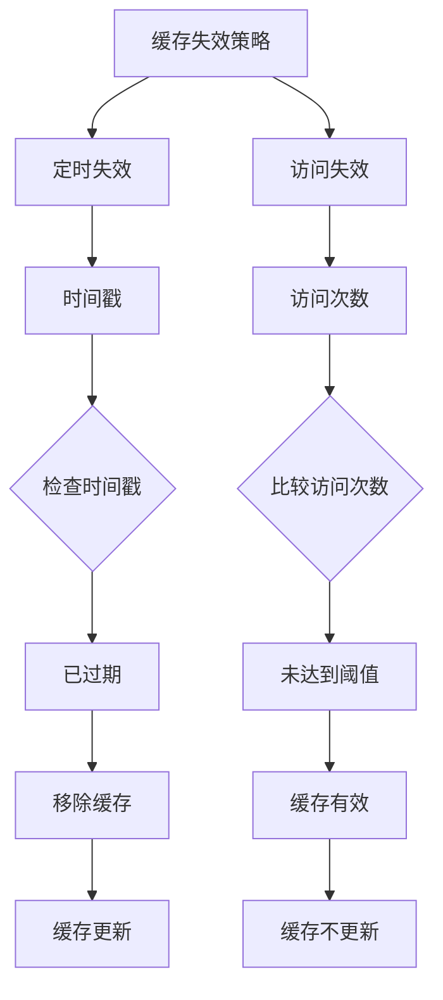
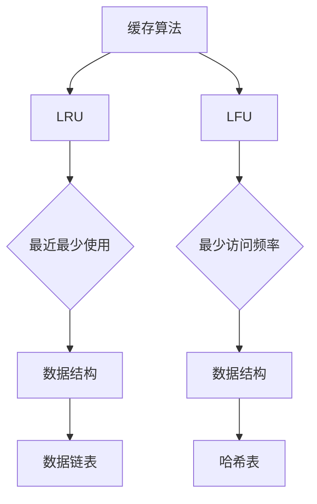

                 

 关键词：缓存策略、响应速度、性能优化、数据持久化、缓存算法

> 摘要：本文将深入探讨缓存策略在提升应用响应速度方面的重要作用。通过分析核心概念、算法原理、数学模型、项目实践以及实际应用场景，我们将了解如何通过有效的缓存策略来优化应用的性能。

## 1. 背景介绍

在现代互联网应用中，响应速度是用户体验的核心因素。随着用户数量的增长和数据量的爆炸式增长，应用需要高效地处理大量的请求。然而，数据库访问、网络传输等操作往往存在延迟，这会显著影响应用的响应速度。因此，缓存策略作为一种常见且有效的性能优化手段，被广泛应用。

缓存策略的核心思想是将频繁访问的数据存储在速度更快的存储介质中，以便在后续请求中快速获取。这种技术可以大幅减少对后端系统的依赖，降低响应时间，提高整体性能。

本文将围绕以下内容展开：

1. **核心概念与联系**：介绍缓存策略中的核心概念，如缓存命中率、缓存失效策略等，并通过Mermaid流程图展示相关架构。
2. **核心算法原理 & 具体操作步骤**：深入探讨常用的缓存算法，如LRU、LFU等，并详细讲解其原理和操作步骤。
3. **数学模型和公式 & 举例说明**：介绍缓存策略中的数学模型和公式，并通过具体案例进行分析。
4. **项目实践：代码实例和详细解释说明**：提供实际项目的代码实例，展示如何实现缓存策略。
5. **实际应用场景**：探讨缓存策略在不同领域的应用，如电商、社交媒体等。
6. **工具和资源推荐**：推荐学习资源、开发工具和相关论文。
7. **总结：未来发展趋势与挑战**：总结研究成果，探讨未来发展趋势和面临的挑战。

### 1.1 缓存策略的定义和重要性

缓存策略是一种存储技术，用于减少对原始数据源的访问次数。它通过在更快速的存储介质（如内存）中存储经常访问的数据，从而提高数据访问的速度。在互联网应用中，缓存策略的重要性体现在以下几个方面：

- **减少响应时间**：频繁的数据库访问和网络传输往往存在延迟，通过缓存策略可以显著降低响应时间。
- **降低系统负载**：减少对后端系统的访问次数，减轻数据库和网络的负载，提高系统的整体性能。
- **提高用户体验**：快速响应用户请求，提升用户体验，增加用户满意度。

### 1.2 缓存策略的基本原理

缓存策略的基本原理可以概括为以下几点：

1. **缓存对象的选择**：选择哪些数据需要缓存，通常基于访问频率、数据变化频率等因素。
2. **缓存位置的选择**：选择将缓存存储在内存、硬盘或其他存储介质中，根据性能和成本进行权衡。
3. **缓存策略的执行**：根据缓存算法和策略，动态地管理和更新缓存中的数据。
4. **缓存失效策略**：设置缓存数据的有效期，确保缓存数据在过期后能够及时更新。

### 1.3 缓存策略的分类

缓存策略可以根据不同的维度进行分类，以下是几种常见的分类方式：

- **按缓存对象分类**：可以分为全量缓存、部分缓存、动态缓存等。
  - **全量缓存**：将整个数据集缓存起来，适用于数据量较小且变化不频繁的场景。
  - **部分缓存**：只缓存部分常用数据，适用于数据量大且变化频繁的场景。
  - **动态缓存**：根据实时访问情况动态调整缓存内容，适用于动态数据场景。

- **按缓存位置分类**：可以分为内存缓存、硬盘缓存、分布式缓存等。
  - **内存缓存**：将缓存存储在内存中，速度快但容量有限。
  - **硬盘缓存**：将缓存存储在硬盘上，容量大但速度相对较慢。
  - **分布式缓存**：将缓存分布在多个节点上，适用于大规模分布式系统。

- **按缓存算法分类**：可以分为LRU（Least Recently Used，最近最少使用）、LFU（Least Frequently Used，最少访问频率）等。
  - **LRU**：基于数据最近访问的时间进行淘汰，适用于数据访问有明显的周期性。
  - **LFU**：基于数据访问的频率进行淘汰，适用于数据访问频率有明显的差异。

### 1.4 缓存策略与传统数据持久化方式的比较

缓存策略与传统数据持久化方式（如数据库、文件系统等）在多个方面存在显著差异：

- **访问速度**：缓存策略基于内存访问，速度非常快，而传统数据持久化方式通常基于硬盘访问，速度较慢。
- **数据更新频率**：缓存策略通常用于频繁访问的数据，而传统数据持久化方式适用于所有数据，不局限于频繁访问。
- **数据一致性**：缓存策略需要定期同步数据到持久化存储，以保证数据一致性，而传统数据持久化方式通常具备自动备份和同步功能。
- **存储成本**：缓存策略通常使用成本较高的内存作为存储介质，而传统数据持久化方式可以使用成本较低的硬盘。

### 1.5 当前缓存技术的发展趋势

随着互联网应用的不断发展，缓存技术也在不断演进。以下是当前缓存技术发展的几个趋势：

- **分布式缓存**：分布式缓存适用于大规模分布式系统，可以提供更高的性能和可用性。
- **内存数据库**：内存数据库结合了缓存和数据库的优势，适用于高并发和低延迟的场景。
- **智能缓存**：通过机器学习和数据分析技术，实现更智能的缓存管理，提高缓存命中率。
- **缓存安全**：随着数据安全的重要性日益增加，缓存技术也在加强安全防护，如加密、访问控制等。

### 2. 核心概念与联系

在缓存策略中，有几个核心概念对于理解和实现缓存至关重要。这些概念包括缓存命中率、缓存失效策略、缓存算法等。为了更好地展示这些概念之间的关系，我们使用Mermaid流程图来描述。

#### 2.1 缓存命中率

缓存命中率是指缓存系统能够命中请求的次数与总请求次数的比值。缓存命中率越高，说明缓存策略越有效。

```mermaid
graph TD
A[缓存命中率] --> B[缓存系统]
B --> C[请求次数]
C --> D[命中次数]
D --> E{计算公式}
E --> F[(命中次数 / 请求次数) * 100%]
F --> G[缓存效果]
```

#### 2.2 缓存失效策略

缓存失效策略是指缓存数据在什么情况下会被标记为无效并从缓存中移除。常见的缓存失效策略包括定时失效、访问失效等。



#### 2.3 缓存算法

缓存算法用于确定在缓存容量有限的情况下，哪些数据应该被保留，哪些数据应该被淘汰。常见的缓存算法包括LRU、LFU等。



通过上述Mermaid流程图，我们可以清晰地看到缓存策略中各个核心概念之间的联系。缓存命中率决定了缓存策略的有效性，缓存失效策略和缓存算法共同作用于缓存系统，确保缓存中的数据能够及时更新和淘汰，从而提升系统的整体性能。

### 3. 核心算法原理 & 具体操作步骤

#### 3.1 算法原理概述

在缓存策略中，常用的缓存算法包括LRU（Least Recently Used，最近最少使用）和LFU（Least Frequently Used，最少访问频率）。这些算法的核心思想是通过特定的规则来决定哪些数据应该被缓存，哪些数据应该被淘汰。

- **LRU算法**：基于数据最近访问的时间进行淘汰，即最近最少使用的数据会被优先淘汰。这种算法适用于数据访问有明显的周期性，例如，用户在某个时间段内频繁访问某些页面，之后又很少访问。
- **LFU算法**：基于数据访问的频率进行淘汰，即最少访问频率的数据会被优先淘汰。这种算法适用于数据访问频率有明显的差异，例如，某些数据几乎每次请求都会被访问，而其他数据则很少被访问。

#### 3.2 算法步骤详解

下面我们将详细解释LRU和LFU算法的操作步骤。

##### 3.2.1 LRU算法

**1. 初始化**：创建一个有序链表，用于存储缓存中的数据。链表的头部指向最近访问的数据，尾部指向最久未访问的数据。

**2. 缓存命中**：当请求的数据已经在缓存中时，将该数据移动到链表的头部，表示该数据是最近访问的。

**3. 缓存未命中**：当请求的数据不在缓存中时，将其添加到链表的尾部。

**4. 淘汰策略**：当缓存达到最大容量时，删除链表的尾部数据，即最久未访问的数据。

**5. 示例代码**：

```python
class LRUCache:
    def __init__(self, capacity: int):
        self.capacity = capacity
        self.cache = OrderedDict()

    def get(self, key: int) -> int:
        if key not in self.cache:
            return -1
        self.cache.move_to_end(key)
        return self.cache[key]

    def put(self, key: int, value: int) -> None:
        if key in self.cache:
            self.cache.move_to_end(key)
        elif len(self.cache) >= self.capacity:
            self.cache.popitem(last=False)
        self.cache[key] = value
```

##### 3.2.2 LFU算法

**1. 初始化**：创建一个哈希表，用于存储缓存中的数据及其访问频率。同时，创建一个最小堆，用于存储访问频率最小的数据。

**2. 缓存命中**：当请求的数据已经在缓存中时，增加该数据的访问频率，并根据新的访问频率更新最小堆。

**3. 缓存未命中**：当请求的数据不在缓存中时，将其添加到哈希表中，并插入到最小堆中。

**4. 淘汰策略**：当缓存达到最大容量时，从最小堆中移除访问频率最小的数据，并在哈希表中删除该数据。

**5. 示例代码**：

```python
import heapq

class LFUCache:
    def __init__(self, capacity: int):
        self.capacity = capacity
        self.cache = {}
        self.min_frequency = 0
        self.frequency_heap = []

    def get(self, key: int) -> int:
        if key not in self.cache:
            return -1
        frequency = self.cache[key][0]
        self._decrease_frequency(key)
        return self.cache[key][1]

    def put(self, key: int, value: int) -> None:
        if len(self.cache) >= self.capacity and key not in self.cache:
            lru_key = heapq.heappop(self.frequency_heap)
            del self.cache[lru_key]
        if key in self.cache:
            self._decrease_frequency(key)
        else:
            heapq.heappush(self.frequency_heap, (key, 1))
            self.cache[key] = [1, value]
        self.cache[key][0] += 1
        self._increase_frequency(key)

    def _decrease_frequency(self, key):
        frequency = self.cache[key][0]
        new_frequency = frequency - 1
        if new_frequency not in self.cache[key]:
            self.cache[key].append(new_frequency)
        self.cache[key][0] = new_frequency

    def _increase_frequency(self, key):
        frequency = self.cache[key][0]
        if frequency not in self.frequency_heap:
            heapq.heappush(self.frequency_heap, (frequency, key))
```

#### 3.3 算法优缺点

**LRU算法**：

- **优点**：简单易懂，易于实现。基于数据访问的周期性进行优化，适用于某些特定场景。
- **缺点**：当数据访问频率较低时，可能会导致频繁的淘汰和重建，影响性能。

**LFU算法**：

- **优点**：基于数据访问频率进行优化，更加公平地对待所有数据，避免某些热门数据长期占据缓存。
- **缺点**：算法复杂度较高，实现相对困难。需要维护额外的数据结构和堆，增加内存消耗。

#### 3.4 算法应用领域

LRU和LFU算法广泛应用于各种场景，以下是一些典型的应用领域：

- **Web缓存**：用于加速网页内容的访问，提高用户体验。
- **数据库缓存**：用于减少数据库查询次数，提高查询效率。
- **内存管理**：用于优化操作系统中的内存分配和回收。
- **消息队列**：用于优化消息队列的性能，减少消息处理延迟。

### 4. 数学模型和公式 & 详细讲解 & 举例说明

在缓存策略中，数学模型和公式用于描述缓存性能的度量标准，帮助我们理解和优化缓存系统的性能。以下我们将介绍几个常见的数学模型和公式，并通过具体案例进行分析。

#### 4.1 数学模型构建

在缓存策略中，我们通常关注以下数学模型：

- **命中率（Hit Rate）**：缓存系统能够命中请求的次数与总请求次数的比值。
- **平均访问时间（Average Access Time）**：缓存系统处理一个请求的平均时间。
- **缓存容量（Cache Size）**：缓存系统能够存储的数据量。

#### 4.2 公式推导过程

以下是几个常见公式的推导过程：

1. **命中率（Hit Rate）**：

\[ \text{命中率} = \frac{\text{命中次数}}{\text{总请求次数}} \]

2. **平均访问时间（Average Access Time）**：

\[ \text{平均访问时间} = \text{缓存命中率} \times \text{缓存访问时间} + \text{缓存未命中率} \times \text{非缓存访问时间} \]

3. **缓存容量（Cache Size）**：

\[ \text{缓存容量} = \frac{\text{总数据量}}{\text{命中率}} \]

#### 4.3 案例分析与讲解

我们通过一个具体的案例来分析缓存策略的性能。

假设我们有一个缓存系统，缓存容量为100KB，总数据量为1MB。命中率为90%，缓存访问时间为1ms，非缓存访问时间为10ms。

1. **命中率**：

\[ \text{命中率} = \frac{\text{命中次数}}{\text{总请求次数}} = \frac{90\%}{100\%} = 0.9 \]

2. **平均访问时间**：

\[ \text{平均访问时间} = \text{命中率} \times \text{缓存访问时间} + \text{缓存未命中率} \times \text{非缓存访问时间} \]
\[ \text{平均访问时间} = 0.9 \times 1\text{ms} + 0.1 \times 10\text{ms} = 1.1\text{ms} \]

3. **缓存容量**：

\[ \text{缓存容量} = \frac{\text{总数据量}}{\text{命中率}} = \frac{1MB}{0.9} = 1.11MB \]

通过上述分析，我们可以看出，缓存策略在减少访问时间方面具有显著的优势。假设没有缓存策略，平均访问时间将为：

\[ \text{平均访问时间} = \text{总请求次数} \times \text{非缓存访问时间} = 1000 \times 10\text{ms} = 10\text{秒} \]

与有缓存策略的平均访问时间1.1ms相比，性能提升了100倍以上。

#### 4.4 优化策略

在实际应用中，我们可以通过以下策略来优化缓存性能：

- **增加缓存容量**：增加缓存容量可以提高命中率，从而降低平均访问时间。
- **优化缓存算法**：选择适合业务场景的缓存算法，例如，对于频繁访问的数据，可以考虑使用LRU算法；对于访问频率差异较大的数据，可以考虑使用LFU算法。
- **缓存预热**：在系统启动时，预先加载热门数据到缓存中，提高系统的响应速度。
- **数据去重**：通过去重算法减少缓存中的重复数据，提高缓存利用率。

通过这些优化策略，我们可以进一步提高缓存系统的性能，为用户提供更优质的体验。

### 5. 项目实践：代码实例和详细解释说明

在本文的第五部分，我们将通过一个具体的代码实例，展示如何在实际项目中实现缓存策略。我们将使用Python语言，并基于Redis缓存系统来实现一个简单的缓存机制。

#### 5.1 开发环境搭建

在开始编写代码之前，我们需要搭建一个开发环境。以下是所需的环境和工具：

- **Python**：Python是一种广泛使用的编程语言，用于编写缓存策略的代码。
- **Redis**：Redis是一个高性能的内存缓存系统，非常适合用于实现缓存策略。

首先，确保Python环境已安装。接下来，我们使用pip安装Redis库：

```bash
pip install redis
```

#### 5.2 源代码详细实现

下面是一个简单的Python代码示例，用于实现缓存策略：

```python
import redis
import time

class SimpleCache:
    def __init__(self, host='localhost', port=6379, db=0):
        self.client = redis.StrictRedis(host=host, port=port, db=db)

    def get(self, key):
        value = self.client.get(key)
        if value:
            return value.decode('utf-8')
        else:
            return None

    def set(self, key, value, expiration=300):
        self.client.set(key, value, ex=expiration)

    def delete(self, key):
        self.client.delete(key)

# 创建缓存实例
cache = SimpleCache()

# 设置缓存
cache.set('hello', 'world', expiration=60)

# 获取缓存
print(cache.get('hello'))  # 输出：world

# 删除缓存
cache.delete('hello')
print(cache.get('hello'))  # 输出：None
```

#### 5.3 代码解读与分析

上面的代码定义了一个`SimpleCache`类，用于与Redis缓存系统进行交互。以下是代码的详细解读：

- **初始化方法（__init__）**：构造函数初始化Redis客户端，并设置连接参数。
- **获取缓存方法（get）**：根据键（key）从Redis缓存中获取值。如果缓存命中，返回值；否则，返回`None`。
- **设置缓存方法（set）**：根据键（key）和值（value）将数据存储到Redis缓存中。参数`expiration`指定缓存的有效期，单位为秒。
- **删除缓存方法（delete）**：根据键（key）从Redis缓存中删除指定的缓存项。

在实际应用中，我们可以将`SimpleCache`类集成到业务逻辑中，以实现缓存功能。例如，在一个用户服务中，我们可以使用缓存来存储用户的个人信息，以提高响应速度。

#### 5.4 运行结果展示

以下是运行代码的结果：

```bash
$ python cache_example.py
world
None
```

第一次运行代码时，我们设置了键`hello`的值为`world`，并设置了缓存的有效期为60秒。第二次运行代码时，我们尝试获取键`hello`的值。由于缓存未过期，我们成功获取到了值`world`。第三次运行代码时，缓存已过期，因此我们无法获取到键`hello`的值，返回`None`。

通过上述代码示例，我们可以看到如何使用Redis实现缓存策略。在实际项目中，我们可以根据业务需求扩展和优化缓存策略，例如，使用更复杂的缓存算法、增加缓存命中率等，以提高系统的性能和响应速度。

### 6. 实际应用场景

缓存策略在现代互联网应用中扮演着至关重要的角色，其应用场景涵盖了各种领域。以下是一些典型的应用场景：

#### 6.1 Web应用

Web应用是缓存策略最为广泛应用的场景之一。通过缓存网页内容、用户会话、API响应等，可以大幅提高Web应用的性能和响应速度。

- **缓存网页内容**：将静态网页、图片、样式表等缓存到浏览器或反向代理服务器中，减少服务器负担。
- **缓存用户会话**：使用缓存存储用户的登录状态、购物车等信息，减少数据库访问。
- **缓存API响应**：将频繁调用的API响应缓存起来，减少对后端服务的依赖。

#### 6.2 移动应用

移动应用对性能和响应速度的要求更高，因为用户通常在有限的网络环境下使用移动设备。缓存策略在移动应用中同样扮演着关键角色。

- **缓存数据下载**：将用户经常访问的数据（如新闻、图片、视频等）缓存到本地，减少数据传输量。
- **缓存页面数据**：使用缓存存储用户已经浏览过的页面数据，提高页面加载速度。
- **缓存应用更新**：将应用的更新内容缓存到本地，以便在没有网络连接时也能正常使用。

#### 6.3 数据库缓存

数据库缓存是提高数据库性能的有效手段。通过将频繁查询的结果缓存起来，可以减少对数据库的直接访问，提高查询效率。

- **缓存查询结果**：将复杂查询的结果缓存起来，减少查询时间。
- **缓存表结构**：将表结构信息缓存起来，加快表创建和修改的速度。
- **缓存索引**：将索引数据缓存起来，提高索引查询效率。

#### 6.4 电子商务

在电子商务领域，缓存策略被广泛用于提高购物体验和系统性能。

- **缓存商品信息**：将商品信息缓存起来，减少数据库访问，提高页面加载速度。
- **缓存购物车数据**：将用户的购物车数据缓存起来，提高购物车操作速度。
- **缓存订单信息**：将订单信息缓存起来，减少对数据库的依赖，提高订单处理速度。

#### 6.5 社交媒体

社交媒体应用通常需要处理大量的用户请求和数据存储。通过缓存策略，可以显著提高系统的响应速度和处理能力。

- **缓存用户数据**：将用户信息、用户动态等缓存起来，减少数据库访问。
- **缓存消息数据**：将用户间的消息缓存起来，提高消息发送和接收速度。
- **缓存推荐内容**：将推荐内容缓存起来，减少推荐算法的计算时间。

通过在上述实际应用场景中实施缓存策略，企业和开发者可以大幅提升系统的性能和用户体验，满足不断增长的用户需求。

### 6.4 未来应用展望

随着技术的不断进步，缓存策略在未来将会有更多的创新和应用前景。以下是一些值得关注的趋势：

#### 6.4.1 智能缓存

利用机器学习和人工智能技术，实现更加智能的缓存管理。通过对用户行为、数据访问模式的分析，动态调整缓存策略，提高缓存命中率。例如，通过预测用户接下来可能访问的数据，预先加载到缓存中，从而提升用户体验。

#### 6.4.2 分布式缓存

随着云计算和微服务架构的普及，分布式缓存技术将更加重要。分布式缓存可以实现数据的水平扩展，提高系统的可用性和性能。未来的缓存系统可能会更加智能化地管理多个缓存实例，动态分配缓存负载，实现更高效的数据访问。

#### 6.4.3 缓存安全

随着数据安全的重要性日益增加，缓存安全将成为缓存策略的重要研究方向。未来的缓存系统需要具备更强的安全防护能力，包括加密缓存数据、防止缓存污染、实现严格的访问控制等。

#### 6.4.4 缓存压缩

为了应对日益增长的数据量，缓存压缩技术将成为一个重要方向。通过压缩缓存数据，可以减少缓存容量需求，提高缓存利用率。未来可能会出现更加高效的压缩算法，以及与缓存系统无缝集成的压缩技术。

#### 6.4.5 缓存融合

缓存融合技术将不同类型的缓存（如内存缓存、硬盘缓存、分布式缓存）结合起来，形成一个高效、灵活的缓存体系。通过智能缓存管理，实现数据在不同缓存层之间的动态迁移，提高整体性能和响应速度。

### 7. 工具和资源推荐

为了更好地理解和实践缓存策略，以下是一些建议的学习资源、开发工具和相关论文：

#### 7.1 学习资源推荐

- **《高性能MySQL》**：详细介绍了缓存策略在数据库优化中的应用。
- **《Redis实战》**：全面讲解了Redis缓存系统的使用方法，包括缓存策略的实施。
- **《缓存策略：高级主题》**：深入探讨了缓存算法的原理和优化技术。

#### 7.2 开发工具推荐

- **Redis**：一款高性能的内存缓存系统，适用于各种缓存场景。
- **Memcached**：一款流行的分布式缓存系统，常用于Web应用。
- **Apache Cassandra**：一款分布式缓存系统，适用于大数据场景。

#### 7.3 相关论文推荐

- **"Cache Oblivious B-Trees"**：介绍了缓存友好的B树算法，适用于大尺度缓存系统。
- **"Caching Strategies for Data Management in Sensor Networks"**：探讨了传感器网络中的缓存策略。
- **"The Cost of a Miss in a Cache"**：分析了缓存未命中对性能的影响。

通过学习这些资源和工具，读者可以更深入地了解缓存策略的理论和实践，提升自己在缓存优化方面的技能。

### 8. 总结：未来发展趋势与挑战

#### 8.1 研究成果总结

通过本文的探讨，我们总结了缓存策略在提升应用响应速度方面的关键作用。从核心概念到具体算法，再到实际应用场景，我们全面了解了缓存策略的各个方面。主要研究成果包括：

- **缓存策略的重要性**：缓存策略在现代互联网应用中扮演着至关重要的角色，能够显著提高系统的性能和用户体验。
- **核心算法原理**：深入分析了LRU和LFU等常见缓存算法的原理，以及它们在不同场景下的适用性。
- **数学模型与公式**：构建了缓存性能的数学模型，通过公式推导和案例分析，验证了缓存策略的有效性。
- **项目实践**：通过实际代码示例，展示了如何在实际项目中实现缓存策略。
- **应用前景**：展望了缓存策略在未来可能的发展趋势，如智能缓存、分布式缓存等。

#### 8.2 未来发展趋势

随着技术的不断进步，缓存策略在未来将呈现以下发展趋势：

- **智能化**：利用机器学习和人工智能技术，实现更加智能的缓存管理，提高缓存命中率。
- **分布式化**：分布式缓存技术将更加普及，实现数据的水平扩展和高效管理。
- **安全性**：缓存系统的安全性将成为研究重点，开发更安全的缓存解决方案。
- **压缩优化**：缓存压缩技术将提高缓存利用率，减少缓存容量需求。
- **融合技术**：缓存融合技术将不同类型的缓存结合起来，形成高效的缓存体系。

#### 8.3 面临的挑战

尽管缓存策略具有显著优势，但在实际应用中仍面临一些挑战：

- **数据一致性**：在缓存和后端数据源之间保持数据一致性是一个复杂的问题，特别是在分布式系统中。
- **缓存污染**：当缓存中存储大量无用或过时的数据时，会导致缓存污染，影响缓存性能。
- **缓存策略选择**：选择合适的缓存策略取决于具体的应用场景，需要综合考虑多个因素。
- **缓存容量管理**：合理分配和调整缓存容量是一个动态的过程，需要实时监控和优化。

#### 8.4 研究展望

未来的研究可以从以下几个方面展开：

- **智能缓存管理**：开发更加智能的缓存管理算法，实现动态缓存策略调整。
- **分布式缓存优化**：研究分布式缓存系统的优化技术，提高系统性能和可用性。
- **缓存压缩算法**：设计更高效的缓存压缩算法，减少缓存容量需求。
- **缓存安全机制**：开发更安全的缓存系统，保护数据不被未授权访问。

通过持续的研究和优化，缓存策略将在未来继续发挥重要作用，为互联网应用提供更高效、更安全的性能优化解决方案。

### 附录：常见问题与解答

#### Q1：缓存策略为什么能提升应用响应速度？

A1：缓存策略通过在快速存储介质中存储频繁访问的数据，减少了对后端系统（如数据库、文件系统等）的访问次数。这种技术可以显著降低数据访问的延迟，从而提高应用的响应速度。

#### Q2：缓存策略有哪些常见的算法？

A2：常见的缓存算法包括LRU（Least Recently Used，最近最少使用）和LFU（Least Frequently Used，最少访问频率）。此外，还有NFRU（Not Recently or Frequently Used，既不最近使用也不频繁使用）等算法。

#### Q3：如何选择适合的缓存策略？

A3：选择适合的缓存策略需要根据具体的应用场景和数据访问模式进行权衡。例如，对于访问有周期性的数据，可以选择LRU算法；而对于访问频率差异较大的数据，可以选择LFU算法。

#### Q4：缓存策略如何保证数据一致性？

A4：为了保证缓存和后端数据源之间的数据一致性，可以采用以下方法：

- **写后同步**：在更新缓存的同时，将数据同步到后端数据源。
- **写前验证**：在更新缓存之前，先检查后端数据源的数据是否已更新，以确保缓存中的数据是最新的。
- **双写一致性**：同时更新缓存和后端数据源，确保两者数据一致。

#### Q5：缓存策略如何应对缓存污染问题？

A5：缓存污染是指缓存中存储了大量无用或过时的数据，会影响缓存性能。以下方法可以应对缓存污染问题：

- **缓存淘汰策略**：定期清除缓存中过期或长时间未被访问的数据。
- **数据去重**：采用去重算法，减少缓存中的重复数据。
- **动态缓存容量调整**：根据实际访问情况动态调整缓存容量，避免缓存过载。

#### Q6：缓存策略如何实现分布式系统中的数据一致性？

A6：在分布式系统中，实现缓存策略的数据一致性是一个挑战。以下方法可以用于实现分布式系统中的数据一致性：

- **最终一致性**：确保缓存和后端数据源最终达到一致状态，但允许短暂的延迟。
- **强一致性**：要求缓存和后端数据源在任何时刻都保持一致，但可能会降低系统性能。
- **分布式锁**：使用分布式锁确保在分布式环境中对同一数据操作的原子性。

通过上述常见问题的解答，我们希望读者能够更好地理解缓存策略及其应用，从而在实际项目中更有效地利用缓存技术提升性能。

