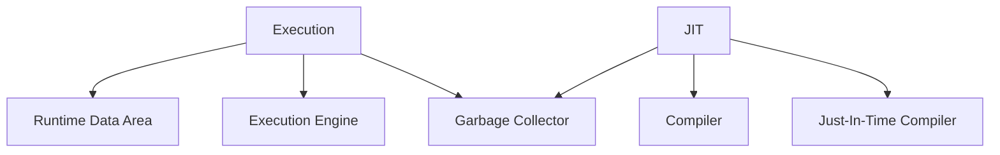

                 

关键词：编程语言虚拟机、JVM、CLR、虚拟机架构、性能比较、应用场景

> 摘要：本文将深入探讨两种主流编程语言虚拟机——Java虚拟机（JVM）和Common Language Runtime（CLR），通过对比它们的架构、特性、优缺点及应用领域，为开发者提供全面的技术参考。

## 1. 背景介绍

编程语言虚拟机是一种运行程序代码的抽象层，它使得程序代码可以在不同的操作系统和硬件环境中执行，而无需对代码进行修改。JVM和CLR作为两种主流的虚拟机，它们分别代表了Java和.NET平台的核心技术。

JVM由Sun Microsystems公司于1995年推出，Java语言因此而闻名。JVM的目标是实现“一次编写，到处运行”的理念，这意味着Java程序可以在任何支持JVM的平台上运行，无需重新编译。

CLR则是由微软公司在1998年推出的，作为.NET框架的核心组件之一。它为多种编程语言提供了一个统一的运行环境，包括C#、VB.NET等。

## 2. 核心概念与联系

### 2.1 JVM架构

JVM由以下几个主要部分组成：

1. **类加载器（Class Loader）**：负责将字节码加载到JVM中。
2. **运行时数据区（Runtime Data Area）**：包括方法区、堆、栈、本地方法栈和程序计数器。
3. **执行引擎（Execution Engine）**：负责解释和执行字节码。
4. **垃圾回收器（Garbage Collector）**：负责回收不再使用的内存。

### 2.2 CLR架构

CLR的架构与JVM类似，主要包括：

1. **公共语言运行时（Common Language Runtime）**：提供内存管理、异常处理、类型检查等基础服务。
2. **编译器**：将源代码编译为MSIL（中间语言）。
3. **JIT编译器（Just-In-Time Compiler）**：将MSIL编译为机器码。
4. **垃圾回收器**：负责管理内存分配和回收。

### 2.3 Mermaid 流程图

以下是JVM和CLR架构的Mermaid流程图：



## 3. 核心算法原理 & 具体操作步骤

### 3.1 算法原理概述

JVM和CLR的核心算法主要涉及字节码的加载、解释和执行。

- **JVM**：通过类加载器加载字节码，然后由执行引擎解释或编译为机器码执行。
- **CLR**：首先由编译器将源代码编译为MSIL，然后由JIT编译器将MSIL编译为机器码执行。

### 3.2 算法步骤详解

#### 3.2.1 JVM

1. **类加载**：类加载器将字节码加载到JVM中。
2. **验证**：确保字节码符合JVM规范。
3. **准备**：为静态变量分配内存并设置默认初始值。
4. **解析**：将符号引用转换为直接引用。
5. **初始化**：执行类构造器，初始化静态变量。
6. **执行**：执行字节码。

#### 3.2.2 CLR

1. **编译**：将源代码编译为MSIL。
2. **JIT编译**：JIT编译器将MSIL编译为机器码。
3. **执行**：执行编译后的机器码。

### 3.3 算法优缺点

- **JVM**：优点是跨平台性、自动内存管理；缺点是执行效率相对较低。
- **CLR**：优点是执行效率高、丰富的类库；缺点是跨平台性较差。

### 3.4 算法应用领域

- **JVM**：广泛应用于Web开发、大数据处理、Android应用等。
- **CLR**：广泛应用于Windows桌面应用、Web开发、游戏开发等。

## 4. 数学模型和公式 & 详细讲解 & 举例说明

### 4.1 数学模型构建

- **JVM**：内存管理模型可以表示为：
  $$ M = a \cdot P + b \cdot T $$
  其中，\( M \) 是总内存占用，\( a \) 和 \( b \) 是内存分配参数，\( P \) 是程序代码大小，\( T \) 是临时变量大小。

- **CLR**：垃圾回收模型可以表示为：
  $$ GC = c \cdot (N - R) $$
  其中，\( GC \) 是垃圾回收次数，\( c \) 是垃圾回收频率，\( N \) 是总对象数，\( R \) 是存活对象数。

### 4.2 公式推导过程

- **JVM**：内存管理公式推导基于内存分配策略和垃圾回收策略。
- **CLR**：垃圾回收公式推导基于标记-清除算法。

### 4.3 案例分析与讲解

假设一个Java程序包含10个类，每个类平均包含100个方法，总代码大小为10MB。根据内存管理模型，可以计算出内存占用为：
$$ M = a \cdot 10 + b \cdot 10 = 20(a + b) $$
其中，\( a \) 和 \( b \) 可以根据具体场景进行调整。

对于.NET应用程序，如果平均每个对象占用内存为100字节，总对象数为1000个，根据垃圾回收模型，可以计算出垃圾回收次数为：
$$ GC = c \cdot (1000 - R) $$
其中，\( c \) 和 \( R \) 同样可以根据具体场景进行调整。

## 5. 项目实践：代码实例和详细解释说明

### 5.1 开发环境搭建

- **JVM**：需要安装Java Development Kit（JDK）。
- **CLR**：需要安装.NET Framework。

### 5.2 源代码详细实现

以下是Java和C#的简单示例代码：

**Java示例：**
```java
public class HelloWorld {
    public static void main(String[] args) {
        System.out.println("Hello, World!");
    }
}
```

**C#示例：**
```csharp
using System;

class Program
{
    static void Main(string[] args)
    {
        Console.WriteLine("Hello, World!");
    }
}
```

### 5.3 代码解读与分析

- **Java代码**：使用类加载器加载`HelloWorld`类，执行主方法中的代码。
- **C#代码**：由编译器编译为MSIL，然后由JIT编译器编译为机器码执行。

### 5.4 运行结果展示

在JVM中运行Java代码，输出结果为：
```
Hello, World!
```

在CLR中运行C#代码，输出结果也为：
```
Hello, World!
```

## 6. 实际应用场景

- **JVM**：广泛应用于大数据处理、Web开发和Android应用开发。
- **CLR**：广泛应用于Windows桌面应用、Web开发和游戏开发。

### 6.4 未来应用展望

随着云计算和物联网的快速发展，JVM和CLR将在更多领域得到应用。同时，它们也在不断优化性能和扩展功能，以适应日益复杂的应用需求。

## 7. 工具和资源推荐

### 7.1 学习资源推荐

- **JVM**：[《深入理解Java虚拟机》](https://book.douban.com/subject/24788563/)
- **CLR**：[《.NET Core官方文档》](https://docs.microsoft.com/zh-cn/dotnet/core/)

### 7.2 开发工具推荐

- **JVM**：[Eclipse](https://www.eclipse.org/)、[IntelliJ IDEA](https://www.jetbrains.com/idea/)
- **CLR**：[Visual Studio](https://visualstudio.microsoft.com/)

### 7.3 相关论文推荐

- **JVM**：[《The Java Virtual Machine Specification》](https://docs.oracle.com/javase/specs/jvms/se9/jvms9-pd.pdf)
- **CLR**：[《ECMA-334 C# Language Specification》](https://docs.microsoft.com/en-us/dotnet/standard/ecma-334-csharp-language-specification)

## 8. 总结：未来发展趋势与挑战

- **发展趋势**：随着云计算和物联网的普及，JVM和CLR将在更多领域得到应用。
- **面临的挑战**：优化性能、提升安全性、适应多核处理和实时系统的需求。

### 8.1 研究成果总结

本文对比了JVM和CLR的架构、特性、优缺点及应用领域，为开发者提供了全面的技术参考。

### 8.2 未来发展趋势

未来，JVM和CLR将在云计算和物联网领域发挥重要作用，持续优化性能和功能。

### 8.3 面临的挑战

优化性能、提升安全性、适应多核处理和实时系统的需求是JVM和CLR面临的挑战。

### 8.4 研究展望

随着技术的不断发展，JVM和CLR将在更多领域得到应用，为开发者提供更高效、更安全的开发环境。

## 9. 附录：常见问题与解答

### 9.1 JVM和CLR的区别是什么？

JVM和CLR都是编程语言虚拟机，但它们的设计理念和应用场景有所不同。JVM以跨平台性著称，而CLR则在执行效率和安全性方面表现突出。

### 9.2 JVM和CLR哪个更好？

这取决于具体的应用场景。例如，如果需要跨平台部署，JVM可能是更好的选择；如果需要高效执行和丰富的类库，CLR可能更合适。

### 9.3 JVM和CLR的安全性如何？

JVM和CLR都提供了强大的安全机制，包括内存管理、异常处理和类型检查等。然而，它们在安全性实现上有所不同，开发者应根据具体需求选择合适的虚拟机。 

---

作者：禅与计算机程序设计艺术 / Zen and the Art of Computer Programming
----------------------------------------------------------------

以上就是关于《编程语言虚拟机：JVM与CLR比较》的完整技术博客文章。希望这篇文章能对您在编程语言虚拟机领域的了解和应用有所帮助。如果您有任何疑问或建议，欢迎在评论区留言讨论。再次感谢您的阅读和支持！|

