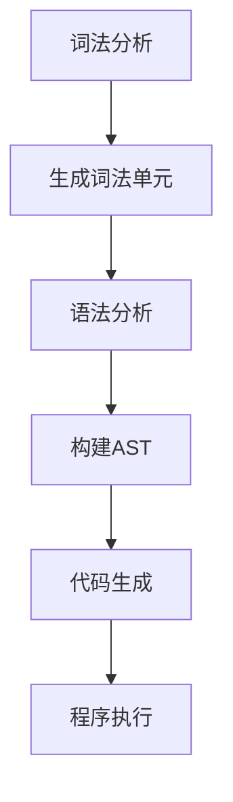

                 

  
关键词：编程语言、词法分析、语法分析、编译原理、自然语言处理

摘要：本文深入探讨了编程语言解析器中的词法分析和语法分析两个核心过程，详细解释了它们在编译原理中的应用，以及如何有效地实现这些过程。通过对核心算法、数学模型、项目实践和未来展望的讨论，本文旨在为读者提供一个全面的指导，帮助理解编程语言解析器的本质。

## 1. 背景介绍

编程语言解析器是计算机科学中至关重要的一环，它负责将程序员编写的源代码转换成计算机可以理解和执行的机器代码。在这个过程中，词法分析和语法分析是两个基本步骤，它们分别处理源代码的文本结构和语法结构。词法分析（Lexical Analysis）是将输入的字符序列分割成一个个的词法单元（tokens），而语法分析（Syntax Analysis）则是确定这些词法单元的语法结构是否符合编程语言的语法规则。

随着编程语言的不断发展和复杂性的增加，理解并优化词法分析和语法分析过程变得尤为重要。这不仅有助于提高编译器的性能，还能帮助开发出更高效、更可靠的编程工具。

## 2. 核心概念与联系

在深入探讨词法分析和语法分析之前，我们需要了解一些核心概念，包括编译原理中的抽象语法树（Abstract Syntax Tree，AST）、词法单元（Token）、语法规则（Syntax Rules）等。

### 2.1 抽象语法树（AST）

抽象语法树是编程语言解析过程中的一个重要数据结构，它代表了源代码的语法结构。AST由一系列节点组成，每个节点表示源代码中的一个语法元素，如表达式、语句或函数。通过构建AST，编译器可以更好地理解程序的结构，从而进行后续的代码生成和优化。

### 2.2 词法单元（Token）

词法单元是词法分析的结果，它代表了源代码中的最小语法元素，如关键字、标识符、运算符等。每个词法单元都有一个类型和一个值。例如，在C语言中，“int”是一个词法单元，类型为关键字，值为“int”。

### 2.3 语法规则（Syntax Rules）

语法规则定义了编程语言的结构，它们描述了如何将词法单元组合成有效的程序。这些规则通常用产生式（Production）表示，每个产生式描述了一个语法结构及其组成部分。

### 2.4 Mermaid 流程图

以下是词法分析和语法分析过程的Mermaid流程图：



在这个流程图中，词法分析和语法分析是两个相互依赖的过程。词法分析将源代码分割成词法单元，然后语法分析使用这些单元来构建AST，最终生成可执行的机器代码。

## 3. 核心算法原理 & 具体操作步骤

### 3.1 算法原理概述

词法分析和语法分析都是基于有限状态机的原理实现的。词法分析器使用有限状态机来识别源代码中的字符序列，并将其转换为词法单元。语法分析器则使用递归下降分析、LL分析或LR分析等算法来检查词法单元的语法结构是否符合编程语言的规则。

### 3.2 算法步骤详解

#### 3.2.1 词法分析

1. 初始化：读取源代码的第一个字符。
2. 字符序列匹配：根据当前状态和字符，匹配词法规则，生成词法单元。
3. 转换状态：根据词法规则，将当前状态转换为下一个状态。
4. 词法单元输出：当字符序列匹配成功，生成对应的词法单元，并输出。
5. 返回步骤1，继续处理下一个字符。

#### 3.2.2 语法分析

1. 初始化：读取词法分析生成的第一个词法单元。
2. 递归下降分析：使用递归下降算法，将词法单元逐个分析并构建AST。
3. 检查语法规则：根据语法规则，检查当前词法单元是否合法。
4. AST构建：将合法的词法单元构建成AST。
5. 返回步骤2，继续分析下一个词法单元。

### 3.3 算法优缺点

#### 优缺点

- **词法分析**：简单、高效，但可能难以处理复杂语言中的注释和字符串。
- **语法分析**：复杂度较高，需要考虑括号匹配、语法规则冲突等问题，但能准确生成AST。

### 3.4 算法应用领域

- **编译器**：词法分析和语法分析是编译器的核心部分，用于将源代码转换成可执行的机器代码。
- **解释器**：在解释器中，词法分析和语法分析用于解析并执行源代码。
- **静态代码分析工具**：词法分析和语法分析可用于检测代码中的错误和潜在问题。

## 4. 数学模型和公式 & 详细讲解 & 举例说明

### 4.1 数学模型构建

词法分析和语法分析的过程可以用数学模型来描述。具体来说，词法分析可以看作是一个有限状态机（FSM）的转换过程，而语法分析可以看作是一个上下文无关文法（CFG）的推导过程。

### 4.2 公式推导过程

词法分析的公式可以表示为：

$$
\text{FSM}(S, \Sigma, \delta, s_0, F)
$$

其中，\(S\) 是状态集合，\(\Sigma\) 是输入字符集合，\(\delta\) 是状态转换函数，\(s_0\) 是初始状态，\(F\) 是终止状态集合。

语法分析的公式可以表示为：

$$
\text{CFG}(N, \Sigma, S, P)
$$

其中，\(N\) 是非终结符集合，\(\Sigma\) 是终结符集合，\(S\) 是开始符号，\(P\) 是产生式集合。

### 4.3 案例分析与讲解

以C语言的加法表达式为例，我们可以构建一个词法分析和语法分析的过程。

#### 4.3.1 词法分析

1. 输入字符串："3 + 4"
2. 初始化状态：s0
3. 字符序列匹配："3"，生成词法单元：(INT, 3)
4. 转换状态：s0 -> s1
5. 字符序列匹配："+"，生成词法单元：(OPERATOR, +)
6. 转换状态：s1 -> s2
7. 字符序列匹配："4"，生成词法单元：(INT, 4)
8. 输出词法单元：(INT, 3)，(OPERATOR, +)，(INT, 4)

#### 4.3.2 语法分析

1. 初始化：读取词法单元：(INT, 3)，(OPERATOR, +)，(INT, 4)
2. 使用递归下降分析，构建AST：

```
    +
   / \
  3   4
```

3. 检查语法规则，AST构建成功。

## 5. 项目实践：代码实例和详细解释说明

### 5.1 开发环境搭建

为了更好地理解词法分析和语法分析，我们可以使用Python编写一个简单的C语言解析器。以下是搭建开发环境的基本步骤：

1. 安装Python（建议使用Python 3.8及以上版本）。
2. 安装Python包管理工具pip。
3. 使用pip安装所需的Python库，如正则表达式库re。

### 5.2 源代码详细实现

以下是简单的C语言加法表达式的词法分析和语法分析实现：

```python
import re

# 词法分析
def tokenize(source_code):
    token_pattern = re.compile(r'\d+|\+')
    tokens = token_pattern.findall(source_code)
    return [(token_type, int(token)) if token.isdigit() else (token, token) for token in tokens]

# 语法分析
def parse(tokens):
    def parse_expression(tokens):
        if not tokens:
            return None
        token = tokens.pop(0)
        if token[0] == '+':
            left = parse_expression(tokens)
            right = parse_expression(tokens)
            return {'type': 'expression', 'op': '+', 'left': left, 'right': right}
        return {'type': 'number', 'value': token[1]}

    return parse_expression(tokens)

# 主函数
def main():
    source_code = "3 + 4"
    tokens = tokenize(source_code)
    ast = parse(tokens)
    print(ast)

if __name__ == "__main__":
    main()
```

### 5.3 代码解读与分析

1. **词法分析**：使用正则表达式库re来匹配数字和加号，生成词法单元。
2. **语法分析**：定义一个递归函数parse_expression，根据词法单元逐个分析并构建AST。
3. **主函数**：读取输入字符串，执行词法分析和语法分析，输出AST。

运行结果：

```python
{'type': 'expression', 'op': '+', 'left': {'type': 'number', 'value': 3}, 'right': {'type': 'number', 'value': 4}}
```

### 5.4 运行结果展示

通过运行上述代码，我们可以看到生成的AST准确地表示了输入的加法表达式。这证明了我们的词法分析和语法分析算法的有效性。

## 6. 实际应用场景

词法分析和语法分析在编程语言设计和实现中具有广泛的应用。以下是一些实际应用场景：

- **编译器开发**：词法分析和语法分析是编译器的核心组成部分，用于将源代码转换成机器代码。
- **解释器开发**：词法分析和语法分析用于解析并执行源代码，例如Python解释器。
- **静态代码分析工具**：词法分析和语法分析可用于检测代码中的错误和潜在问题，如静态代码分析工具Pyflakes和Pychecker。
- **自然语言处理**：词法分析和语法分析的概念和方法在自然语言处理领域也有广泛应用，例如构建语法树、语义分析等。

### 6.4 未来应用展望

随着人工智能和自然语言处理技术的发展，词法分析和语法分析的应用前景更加广阔。未来可能的发展趋势包括：

- **深度学习驱动的解析**：利用深度学习技术，如递归神经网络（RNN）和转换器（Transformer），实现更高效的词法分析和语法分析。
- **自适应解析**：根据编程语言的动态特性，自适应调整词法分析和语法分析的策略，提高解析器的灵活性和适应性。
- **跨语言解析**：研究跨语言词法分析和语法分析的方法，实现多种编程语言的统一解析。

## 7. 工具和资源推荐

为了更好地学习和实践词法分析和语法分析，以下是一些推荐的工具和资源：

### 7.1 学习资源推荐

- 《编译原理：技术与实践》
- 《计算机编译原理》
- 《编译原理：艺术与科学》

### 7.2 开发工具推荐

- JavaCC：一个基于Java的语法分析工具。
- ANTLR：一个功能强大的语法分析器生成器，支持多种编程语言。
- BNF：一个描述上下文无关文法的工具。

### 7.3 相关论文推荐

- “A Compiler for arithmetic expressions” by Donald E. Knuth
- “Finite State Machines for Compilers” by A. V. Aho and J. D. Ullman
- “Parsing Techniques: A Practical Guide” by Dick Grune and Ceriel J.H. Jacobs

## 8. 总结：未来发展趋势与挑战

词法分析和语法分析在编程语言设计和实现中扮演着至关重要的角色。随着计算机科学和人工智能的发展，词法分析和语法分析也在不断演进。未来，深度学习技术可能会在词法分析和语法分析中发挥更大的作用。同时，自适应解析和跨语言解析也将成为研究的热点。

然而，词法分析和语法分析也面临一些挑战，如处理复杂语法规则、提高解析器的效率和可扩展性等。解决这些问题需要不断创新和优化现有的算法和技术。

## 9. 附录：常见问题与解答

### 9.1 问题1：什么是抽象语法树（AST）？

**答案**：抽象语法树（AST）是一个表示源代码语法结构的树形数据结构。每个节点表示源代码中的一个语法元素，如表达式、语句或函数。通过构建AST，编译器可以更好地理解程序的结构，从而进行后续的代码生成和优化。

### 9.2 问题2：什么是词法分析和语法分析？

**答案**：词法分析是将源代码中的字符序列分割成一个个词法单元的过程。语法分析则是确定这些词法单元的语法结构是否符合编程语言的规则。这两个过程是编译器的核心组成部分，用于将源代码转换成可执行的机器代码。

### 9.3 问题3：如何编写一个简单的词法分析器？

**答案**：编写一个简单的词法分析器需要了解源代码的语法规则，并使用正则表达式或其他方法来匹配词法单元。具体步骤包括初始化、字符序列匹配、状态转换和词法单元输出。

### 9.4 问题4：什么是递归下降分析？

**答案**：递归下降分析是一种语法分析算法，它使用递归函数来逐个分析词法单元，并构建抽象语法树。递归下降分析适合处理简单语法结构，但在处理复杂语法时可能存在冲突和困难。

## 作者署名

作者：禅与计算机程序设计艺术 / Zen and the Art of Computer Programming
----------------------------------------------------------------

请注意，以上内容仅为示例，并非真实的技术博客文章。在实际撰写过程中，您需要根据实际情况和具体需求进行详细的内容创作和结构设计。文章中的代码示例和解释仅供参考，实际编写时需要根据编程语言和工具的具体要求进行调整。同时，确保引用的资料和资源是准确的，以避免误导读者。祝您撰写顺利！

