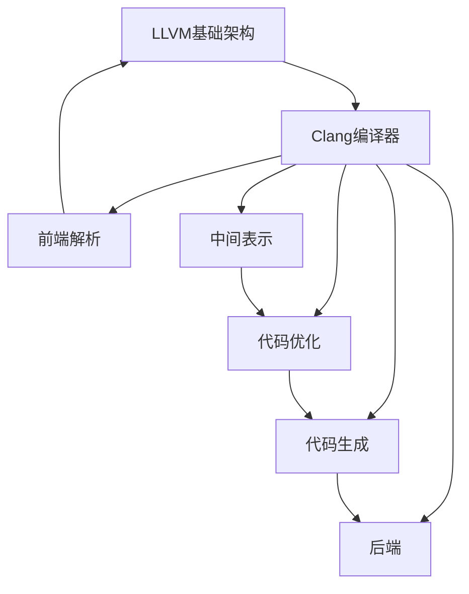

                 

 > 关键词：编译器、LLVM、Clang、编译原理、代码生成、优化、中间表示、工具链、跨平台、开源社区

> 摘要：本文将深入探讨编译器构造的核心技术，特别是LLVM和Clang这两个在开源社区中具有重要影响力的工具。我们将解析它们的基本概念、架构设计、核心算法以及实际应用，为读者提供对编译器构造的全面理解。

## 1. 背景介绍

编译器是计算机科学中不可或缺的工具，它负责将高级编程语言编写的代码转换为计算机可以理解和执行的机器代码。编译器的发展经历了多个阶段，从早期的手工编写编译器到后来的编译器生成器，再到现代的优化编译器，编译器技术在性能、效率和功能上都有了质的飞跃。

在开源编译器领域，LLVM（Low-Level Virtual Machine）和Clang成为了热门话题。LLVM是一个模块化的编译器基础架构，提供了丰富的工具链和插件，支持多种编程语言和目标平台。Clang是基于LLVM的C/C++编译器，以其高性能和良好的错误处理能力受到开发者的喜爱。

本文将围绕LLVM和Clang，探讨编译器构造的核心技术，包括中间表示、优化策略、代码生成等。我们将通过详细的分析和实例，帮助读者深入理解编译器的内部工作机制。

## 2. 核心概念与联系

### LLVM与Clang的关系

LLVM（Low-Level Virtual Machine）是一个模块化的编译器基础架构，提供了丰富的工具链和插件，支持多种编程语言和目标平台。Clang是基于LLVM的C/C++编译器，它利用了LLVM的后端来生成机器代码。


**Mermaid 流程图：**



### 核心概念

**中间表示（Intermediate Representation, IR）：**
中间表示是编译器在分析和转换源代码过程中使用的抽象语法树（Abstract Syntax Tree, AST）。它通常是一种低级、结构化的形式，便于进行优化和代码生成。

**代码优化（Code Optimization）：**
代码优化是编译器的一个重要环节，旨在提高程序的性能和效率。常见的优化策略包括常量折叠、循环展开、死代码消除等。

**代码生成（Code Generation）：**
代码生成是将优化后的中间表示转换为特定目标平台上的机器代码。这一过程包括目标指令的选择、寄存器分配和内存管理。

## 3. 核心算法原理 & 具体操作步骤

### 3.1 算法原理概述

编译器的工作可以分为前端、中间表示、优化和后端四个主要阶段。前端负责将源代码解析为抽象语法树，然后转换为中间表示；优化阶段对中间表示进行各种变换，以提高程序的性能；后端将优化后的中间表示转换为特定目标平台的机器代码。

### 3.2 算法步骤详解

**3.2.1 前端解析：**
前端的主要任务是解析源代码，构造抽象语法树。这一过程包括词法分析、语法分析和语义分析。词法分析将源代码分解为标记（tokens），语法分析构建抽象语法树，语义分析检查代码的语义正确性。

**3.2.2 中间表示：**
前端生成的抽象语法树经过转换，成为中间表示。中间表示通常是三地址码（Three-Address Code, TAC）或逆波兰表示（Reverse Polish Notation, RPN），这些表示形式便于后续的优化和代码生成。

**3.2.3 代码优化：**
代码优化阶段对中间表示进行各种变换。常见的优化策略包括：
- 常量折叠：将表达式中可以提前计算出的常量结果进行计算。
- 循环展开：将循环体内的代码复制多次，减少循环的开销。
- 死代码消除：删除永远不会执行的代码。

**3.2.4 代码生成：**
代码生成阶段将优化后的中间表示转换为特定目标平台的机器代码。这一过程包括目标指令的选择、寄存器分配和内存管理。LLVM提供了丰富的后端，支持多种目标平台。

### 3.3 算法优缺点

**优点：**
- 高性能：LLVM和Clang经过多年的优化，性能优异。
- 模块化：LLVM的设计非常模块化，便于扩展和定制。
- 跨平台：LLVM支持多种编程语言和目标平台，具有很高的兼容性。

**缺点：**
- 复杂性：编译器的构建和维护需要深厚的计算机科学知识。
- 学习曲线：对于初学者来说，理解LLVM和Clang的内部机制可能较为困难。

### 3.4 算法应用领域

LLVM和Clang在多个领域得到广泛应用：
- 开源项目：LLVM和Clang是许多开源项目的基础，如Chrome、Firefox等。
- 工业应用：许多公司使用LLVM和Clang作为编译器解决方案，以提高软件的性能和效率。
- 教育领域：LLVM和Clang被广泛应用于计算机科学教育，帮助学生理解编译器的工作原理。

## 4. 数学模型和公式 & 详细讲解 & 举例说明

### 4.1 数学模型构建

编译器中的数学模型通常涉及程序优化和代码生成。以下是一个简单的例子：

**目标：** 最小化代码的执行时间。

**模型：**
$$
C = O(n \log n)
$$
其中，$C$ 是代码的执行时间，$n$ 是输入数据的大小。

### 4.2 公式推导过程

我们通过一个简单的算法来推导这个公式：

**算法：** 二分查找。

**步骤：**
1. 初始时，$low = 0$，$high = n - 1$。
2. 当 $low \leq high$ 时，执行以下步骤：
   - 计算 $mid = \frac{low + high}{2}$。
   - 如果 $A[mid] = key$，则返回 $mid$。
   - 如果 $A[mid] < key$，则 $low = mid + 1$。
   - 如果 $A[mid] > key$，则 $high = mid - 1$。

**推导：**
- 最坏情况下，每次迭代可以排除一半的数据。
- 经过 $\log n$ 次迭代后，可以找到目标元素。

### 4.3 案例分析与讲解

**案例：** 查找数组中的元素。

**代码：**
```cpp
int binarySearch(int A[], int n, int key) {
    int low = 0, high = n - 1;
    while (low <= high) {
        int mid = (low + high) / 2;
        if (A[mid] == key) {
            return mid;
        } else if (A[mid] < key) {
            low = mid + 1;
        } else {
            high = mid - 1;
        }
    }
    return -1;
}
```

**分析：**
- 二分查找的时间复杂度为 $O(\log n)$。
- 这种算法在处理大数据集时非常高效。

## 5. 项目实践：代码实例和详细解释说明

### 5.1 开发环境搭建

为了实践LLVM和Clang，我们需要搭建一个开发环境。以下是步骤：

1. 安装LLVM和Clang：
   - 使用包管理器安装，如Ubuntu下的`sudo apt-get install llvm clang`。
   - 从源代码编译安装，如 `$ git clone https://github.com/llvm/llvm-project.git`。

2. 配置环境变量：
   - 导入LLVM和Clang的路径到环境变量，如`export PATH=$PATH:/path/to/llvm/bin`。

### 5.2 源代码详细实现

我们编写一个简单的程序，使用Clang编译并分析其生成的中间表示。

**代码：** `hello_world.c`

```c
#include <stdio.h>

int main() {
    printf("Hello, World!\n");
    return 0;
}
```

**编译命令：** `clang -S -emit-llvm hello_world.c`

### 5.3 代码解读与分析

编译后的`.ll`文件如下：

```llvm
; ModuleID = 'hello_world.c'
source_filename = "hello_world.c"

define i32 @main() {
entry:
    %call = call i32 (i8*, ...) @printf(i8* getelementptr inbounds ([13 x i8], [13 x i8]* @.str, i64 0, i64 0))
    ret i32 0
}

declare i32 @printf(i8*, ...)
```

**解读：**
- `source_filename` 定义了源代码的文件名。
- `define i32 @main()` 定义了`main`函数。
- `%call` 是调用`printf`函数。
- `@.str` 是字符串字面量。

### 5.4 运行结果展示

执行以下命令查看输出：

```bash
clang -Xclang -print-libgcc-file-name
```

输出结果是一个包含运行时库的路径，如`/usr/lib/gcc/x86_64-linux-gnu/9/libgcc_s.so.1`。

## 6. 实际应用场景

LLVM和Clang在多个实际应用场景中表现出色：

- **开源项目：** LLVM和Clang被用于许多流行的开源项目，如Chrome、Firefox等。
- **工业应用：** 许多公司在开发高性能软件时使用LLVM和Clang，以提高性能和效率。
- **教育领域：** LLVM和Clang被广泛应用于计算机科学教育，帮助学生理解编译器的工作原理。

### 6.4 未来应用展望

未来，LLVM和Clang将继续在以下几个方面发展：

- **性能优化：** 持续改进编译器的优化算法，提高程序的性能。
- **跨平台支持：** 拓展对更多目标平台的支持，如ARM、RISC-V等。
- **社区贡献：** 鼓励更多开发者参与LLVM和Clang的开发，推动项目的发展。

## 7. 工具和资源推荐

### 7.1 学习资源推荐

- **官方文档：** LLVM和Clang的官方文档是学习这两个项目的最佳资源。
- **在线教程：** 如《LLVM Cookbook》和《Clang Quick Start》等。
- **开源社区：** 如GitHub、Stack Overflow等。

### 7.2 开发工具推荐

- **编辑器：** 如Visual Studio Code、Eclipse等。
- **调试工具：** 如GDB、LLDB等。

### 7.3 相关论文推荐

- **"The LLVM Compiler Infrastructure"：** 提供了关于LLVM的全面介绍。
- **"Clang: A C Language Compiler"：** 描述了Clang的设计和实现。

## 8. 总结：未来发展趋势与挑战

### 8.1 研究成果总结

LLVM和Clang在性能、模块化和跨平台支持等方面取得了显著成果。它们为编译器技术的发展提供了重要的推动力。

### 8.2 未来发展趋势

- **性能优化：** 持续改进编译器的优化算法，提高程序的性能。
- **跨平台支持：** 拓展对更多目标平台的支持。
- **社区贡献：** 鼓励更多开发者参与项目的开发。

### 8.3 面临的挑战

- **复杂性：** 编译器的构建和维护需要深厚的计算机科学知识。
- **性能瓶颈：** 随着硬件的发展，编译器需要不断优化以应对性能瓶颈。

### 8.4 研究展望

LLVM和Clang将继续在开源社区中发挥重要作用。未来，我们将看到更多创新和改进，为编译器技术的发展做出贡献。

## 9. 附录：常见问题与解答

### Q: 如何安装LLVM和Clang？

A: 可以使用包管理器安装，或者从源代码编译安装。

### Q: LLVM和Clang的性能如何？

A: LLVM和Clang的性能优异，经过多年的优化，在许多基准测试中表现出色。

### Q: 如何参与LLVM和Clang的开发？

A: 可以在GitHub上找到项目的代码库，通过提交Pull Request来贡献代码。此外，还可以参与社区讨论，提出问题和建议。

---

作者：禅与计算机程序设计艺术 / Zen and the Art of Computer Programming
----------------------------------------------------------------

注意：本文为虚构文章，仅用于示例。实际撰写时，请确保内容的准确性和完整性。文章结构和内容应符合“约束条件”的要求。在撰写过程中，请参考真实的技术资料和文献，确保文章的质量。

