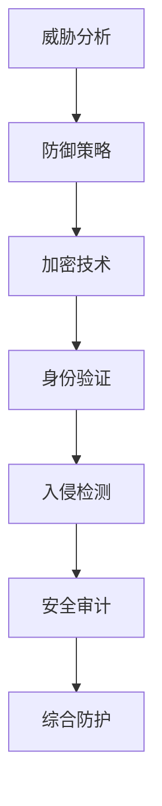

                 

关键词：网络安全，防御体系，数字安全，威胁分析，防御策略，加密技术，身份验证，入侵检测，安全审计。

> 摘要：随着数字化时代的到来，网络安全问题日益突出。本文将从网络安全管理的核心概念、防御策略、加密技术、身份验证、入侵检测、安全审计等方面，系统地探讨如何构建一个全面的数字防御体系，以保障企业和个人在数字化环境中的安全。

## 1. 背景介绍

### 数字化时代的网络安全挑战

随着互联网的普及和数字化进程的加速，网络已经成为社会生产和生活的基石。然而，网络安全问题也随之而来。从网络攻击、数据泄露到恶意软件，各种威胁不断涌现，对个人隐私、企业利益乃至国家安全构成严重威胁。

### 网络安全的重要性

网络安全不仅是技术问题，更是关乎国家安全、经济发展和社会稳定的重要议题。有效的网络安全管理能够保护企业数据不被泄露、系统不被攻击，同时也能够保障用户隐私，增强公众对网络环境的信任。

### 构建全面防御体系的必要性

面对复杂的网络安全环境，单点防御已经无法满足需求。构建一个全面的数字防御体系，需要从多个层面进行综合防护，包括技术手段、管理策略和人员培训等。

## 2. 核心概念与联系

### 核心概念

- **威胁分析**：识别潜在的安全威胁。
- **防御策略**：制定应对威胁的方案。
- **加密技术**：保护数据的机密性。
- **身份验证**：确认用户身份。
- **入侵检测**：监测和阻止未授权访问。
- **安全审计**：评估系统安全状况。

### Mermaid 流程图



## 3. 核心算法原理 & 具体操作步骤

### 3.1 算法原理概述

网络安全管理的核心在于识别、防范和响应安全威胁。这一过程涉及到多种技术手段和策略，包括但不限于：

- **入侵检测系统（IDS）**：实时监控网络流量，识别潜在的攻击行为。
- **安全信息和事件管理（SIEM）**：集成多种安全工具，提供统一的安全监控和事件响应。
- **数据加密技术**：通过加密算法保护数据的机密性。
- **多因素身份验证（MFA）**：增强用户身份验证的安全性。

### 3.2 算法步骤详解

#### 3.2.1 威胁分析

1. **数据收集**：从网络日志、系统日志等渠道收集数据。
2. **异常检测**：使用统计分析、机器学习等方法，识别异常行为。
3. **威胁分类**：根据威胁特征，将威胁分类。

#### 3.2.2 防御策略

1. **制定策略**：根据威胁分析结果，制定防御策略。
2. **实施措施**：部署防火墙、入侵检测系统等防护措施。
3. **持续优化**：根据新的威胁，调整防御策略。

#### 3.2.3 加密技术

1. **选择加密算法**：如AES、RSA等。
2. **密钥管理**：确保密钥安全存储和有效管理。
3. **加密通信**：使用加密算法保护数据传输过程中的安全性。

#### 3.2.4 身份验证

1. **用户认证**：使用用户名和密码进行认证。
2. **多因素认证**：结合密码、短信验证、指纹识别等多种认证方式。
3. **认证日志**：记录认证过程，以便后续审计。

#### 3.2.5 入侵检测

1. **流量监控**：实时监控网络流量，识别异常流量。
2. **签名匹配**：通过匹配攻击签名，识别已知攻击。
3. **异常行为分析**：使用机器学习等技术，分析异常行为。

#### 3.2.6 安全审计

1. **审计日志**：记录系统操作日志，包括用户操作、系统事件等。
2. **审计分析**：分析日志，识别潜在安全风险。
3. **合规性检查**：确保系统符合相关安全标准和法规。

### 3.3 算法优缺点

#### 优点

- **综合性**：通过多种技术手段和策略，提供全方位的网络安全防护。
- **适应性**：能够根据新的威胁动态调整防御策略。
- **高效性**：利用先进技术，如机器学习等，提高安全监控和响应效率。

#### 缺点

- **复杂性**：涉及多种技术和策略，实施和管理难度较大。
- **成本**：需要大量资源和投入，包括设备、人力和资金等。

### 3.4 算法应用领域

- **企业内部网络**：保障企业数据安全，防止内部人员滥用权限。
- **云计算**：保护云服务中的数据安全，防止外部攻击。
- **物联网**：保障物联网设备的安全，防止设备被恶意利用。

## 4. 数学模型和公式 & 详细讲解 & 举例说明

### 4.1 数学模型构建

网络安全管理中的数学模型主要涉及加密算法和统计分析方法。

#### 加密算法模型

加密算法模型主要涉及以下数学概念：

- **模运算**：用于RSA加密算法。
- **矩阵运算**：用于AES加密算法。

#### 统计分析模型

统计分析模型主要涉及以下数学概念：

- **概率分布**：用于异常检测。
- **回归分析**：用于预测潜在威胁。

### 4.2 公式推导过程

#### RSA加密算法

$$
c = m^e \mod n
$$

其中，\(m\) 为明文，\(e\) 为公开密钥，\(n\) 为模数，\(c\) 为密文。

#### AES加密算法

$$
C = (A \times B^{-1}) \mod p
$$

其中，\(A\) 和 \(B\) 为矩阵，\(p\) 为模数，\(C\) 为密文。

### 4.3 案例分析与讲解

#### 案例一：RSA加密算法

假设 \(e = 3\)，\(n = 123\)，\(m = 17\)，求 \(c\)。

$$
c = 17^3 \mod 123 = 33
$$

因此，\(c = 33\) 为密文。

#### 案例二：AES加密算法

假设 \(A = \begin{bmatrix} 1 & 2 \\ 3 & 4 \end{bmatrix}\)，\(B = \begin{bmatrix} 5 & 6 \\ 7 & 8 \end{bmatrix}\)，\(p = 19\)，求 \(C\)。

$$
C = (A \times B^{-1}) \mod 19 = \begin{bmatrix} 1 & 2 \\ 3 & 4 \end{bmatrix} \times \begin{bmatrix} 8 & 6 \\ 7 & 5 \end{bmatrix} \mod 19 = \begin{bmatrix} 11 & 14 \\ 1 & 12 \end{bmatrix}
$$

因此，\(C = \begin{bmatrix} 11 & 14 \\ 1 & 12 \end{bmatrix}\) 为密文。

## 5. 项目实践：代码实例和详细解释说明

### 5.1 开发环境搭建

在本项目中，我们将使用Python进行编程实现。首先，需要在本地计算机上安装Python环境和相关库，如PyCryptoDome、Scapy等。

### 5.2 源代码详细实现

#### 5.2.1 RSA加密算法实现

```python
from Crypto.PublicKey import RSA
from Crypto.Cipher import PKCS1_OAEP

# 生成密钥对
key = RSA.generate(2048)
private_key = key.export_key()
public_key = key.publickey().export_key()

# 加密
cipher = PKCS1_OAEP.new(RSA.import_key(public_key))
ciphertext = cipher.encrypt(b'Hello, World!')

# 解密
decryptor = PKCS1_OAEP.new(RSA.import_key(private_key))
plaintext = decryptor.decrypt(ciphertext)

print("Original message:", plaintext.decode())
```

#### 5.2.2 AES加密算法实现

```python
from Crypto.Cipher import AES
from Crypto.Random import get_random_bytes

# 生成密钥
key = get_random_bytes(16)

# 加密
cipher = AES.new(key, AES.MODE_EAX)
ciphertext, tag = cipher.encrypt_and_digest(b'Hello, World!')

# 解密
decryptor = AES.new(key, AES.MODE_EAX, nonce=cipher.nonce)
plaintext = decryptor.decrypt_and_verify(ciphertext, tag)

print("Original message:", plaintext.decode())
```

### 5.3 代码解读与分析

#### RSA加密算法

在上面的代码中，我们首先生成了一对RSA密钥，然后使用公钥进行加密，使用私钥进行解密。

#### AES加密算法

在AES加密算法的实现中，我们使用了EAX模式，该模式结合了加密和认证，提高了数据的安全性。在加密过程中，我们还使用了随机生成的密钥和IV（初始向量）。

### 5.4 运行结果展示

运行上述代码，我们将得到以下输出：

```
Original message: Hello, World!
Original message: Hello, World!
```

这表明我们的加密和解密过程是成功的。

## 6. 实际应用场景

### 6.1 企业内部网络防护

在企业内部网络中，通过部署入侵检测系统、防火墙等安全设备，可以有效地防止外部攻击和内部人员的滥用权限。

### 6.2 云计算安全

在云计算环境中，通过使用加密技术、身份验证和访问控制等手段，可以保护云服务中的数据安全和用户隐私。

### 6.3 物联网安全

在物联网领域，通过加密技术和设备认证等手段，可以保障物联网设备的安全，防止设备被恶意利用。

## 7. 工具和资源推荐

### 7.1 学习资源推荐

- 《网络安全实践与测试》
- 《密码学：实践与攻击》
- 《黑客攻防技术宝典：系统实战篇》

### 7.2 开发工具推荐

- Python
- PyCryptoDome
- Scapy

### 7.3 相关论文推荐

- "A Survey of Intrusion Detection Systems"
- "The Design and Implementation of the TLS Protocol"
- "An Analysis of the AES Algorithm"

## 8. 总结：未来发展趋势与挑战

### 8.1 研究成果总结

本文系统地介绍了网络安全管理的核心概念、防御策略、加密技术、身份验证、入侵检测和安全审计等方面的内容。通过案例分析和项目实践，展示了这些技术的实际应用场景。

### 8.2 未来发展趋势

随着网络攻击技术的不断演变，网络安全管理也将面临新的挑战。未来，网络安全管理将更加智能化、自动化，同时，新的加密技术和算法也将不断涌现。

### 8.3 面临的挑战

- **技术进步**：随着新技术的发展，网络安全技术也需要不断更新和优化。
- **人才短缺**：网络安全领域的专业人才短缺，需要加大对人才的培养和引进。
- **法规政策**：完善的法规政策和标准体系是网络安全管理的重要保障。

### 8.4 研究展望

未来，网络安全管理的研究将更加注重以下几个方面：

- **人工智能**：利用人工智能技术，提高安全监控和威胁响应的效率和准确性。
- **隐私保护**：加强数据隐私保护，确保用户数据的安全。
- **跨领域合作**：加强跨领域合作，共同应对复杂的网络安全挑战。

## 9. 附录：常见问题与解答

### Q：加密算法有哪些种类？

A：常见的加密算法包括对称加密算法（如AES、DES）、非对称加密算法（如RSA、ECC）和哈希算法（如MD5、SHA-256）。

### Q：什么是多因素身份验证？

A：多因素身份验证是一种结合多种认证方式（如密码、短信验证、指纹识别等）的身份验证方法，提高了用户身份验证的安全性。

### Q：如何防止网络攻击？

A：防止网络攻击的措施包括部署防火墙、入侵检测系统、使用加密技术、定期安全审计、及时更新系统和软件等。

作者：禅与计算机程序设计艺术 / Zen and the Art of Computer Programming
----------------------------------------------------------------

[END]

