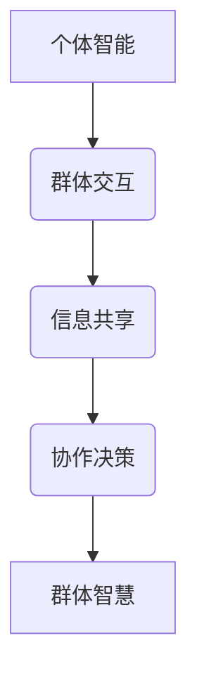

                 

关键词：群体智慧，决策，AI，协作，算法，数学模型，项目实践，应用场景，未来展望

> 摘要：本文深入探讨了群体智慧这一新兴的概念，分析了其在现代决策过程中的重要性。通过梳理核心概念与联系，阐述了群体智慧的核心算法原理及其在各类实际应用场景中的优势。同时，本文结合具体项目实践，提供了代码实例和运行结果展示，旨在为读者提供对群体智慧技术的全面了解和应用建议。

## 1. 背景介绍

随着互联网和人工智能技术的飞速发展，我们正处在一个信息爆炸的时代。在这个时代，个体智慧虽然重要，但面对复杂多变的决策环境，个体智慧的局限逐渐显现。如何从群体中汲取智慧，形成一种新的决策力量，成为了当前研究的热点。

群体智慧（Collective Intelligence，CI）是指通过群体成员之间的协作、信息交换和共享，实现超越个体成员智能水平的一种集体现象。这种智慧形式在自然界和社会生活中都有广泛的应用，如鸟群的迁徙、蚁群的寻路、以及人类社会中的集体决策等。

在信息技术领域，群体智慧的应用主要体现在以下几个方面：

1. **协同过滤推荐系统**：通过用户群体行为数据，实现个性化推荐。
2. **智能交通管理**：利用交通流量数据，优化交通信号控制，提高道路通行效率。
3. **社会计算**：分析社交媒体数据，预测社会趋势，辅助公共政策制定。
4. **分布式计算**：通过群体计算能力，解决复杂的计算问题。

## 2. 核心概念与联系

群体智慧的核心在于成员之间的协作和信息共享。为了更好地理解这一概念，我们可以使用Mermaid流程图来展示其基本架构：



### 2.1 个体智能与群体交互

个体智能是群体智慧的基础。每个成员都拥有自己的知识和技能，这些知识和技能在群体交互过程中发挥作用。

### 2.2 信息共享

信息共享是实现群体智慧的关键步骤。通过信息共享，成员可以获取其他成员的经验和信息，形成对问题的全面理解。

### 2.3 协作决策

协作决策是将个体智能转化为群体智慧的关键环节。在这个过程中，成员通过讨论、协商，形成一致的决策方案。

### 2.4 群体智慧

群体智慧是协作决策的结果。它不仅超越了个体智能，还可以通过反馈和迭代，不断提高决策的质量和效率。

## 3. 核心算法原理 & 具体操作步骤

### 3.1 算法原理概述

群体智慧的核心算法可以分为以下几类：

1. **基于规则的算法**：通过定义一组规则，实现个体之间的协同。
2. **基于模型的算法**：利用数学模型，模拟群体行为，实现智能决策。
3. **基于数据的算法**：通过分析群体行为数据，提取决策信息。

### 3.2 算法步骤详解

以基于模型的算法为例，其具体操作步骤如下：

1. **模型构建**：根据问题特点，选择合适的数学模型。
2. **数据收集**：收集相关数据，用于模型训练。
3. **模型训练**：使用收集到的数据，训练模型参数。
4. **模型评估**：通过测试数据，评估模型性能。
5. **决策生成**：利用训练好的模型，生成决策方案。

### 3.3 算法优缺点

**优点**：

- **适应性强**：能够处理复杂、多变的问题。
- **决策质量高**：通过群体协作，提高决策的准确性和可靠性。

**缺点**：

- **计算复杂度高**：模型训练和评估过程需要大量计算资源。
- **数据依赖性强**：数据质量和数量直接影响算法效果。

### 3.4 算法应用领域

群体智慧算法在各个领域都有广泛应用，如：

- **智能交通**：通过分析交通流量数据，优化交通信号控制。
- **社会计算**：通过社交媒体数据，预测社会趋势，辅助公共政策制定。
- **金融风控**：通过分析金融数据，识别风险，提高风险管理能力。
- **医疗诊断**：通过医疗大数据，辅助医生进行诊断和治疗。

## 4. 数学模型和公式 & 详细讲解 & 举例说明

### 4.1 数学模型构建

群体智慧中的数学模型通常基于以下几种原理：

- **博弈论**：研究个体在竞争环境中如何做出最优决策。
- **群体动力**：研究群体成员之间的相互作用和演化过程。
- **贝叶斯网络**：研究不确定性条件下的推理和决策。

### 4.2 公式推导过程

以贝叶斯网络为例，其基本公式如下：

$$
P(A|B) = \frac{P(B|A)P(A)}{P(B)}
$$

其中，$P(A|B)$ 表示在条件 $B$ 下事件 $A$ 的概率，$P(B|A)$ 表示在条件 $A$ 下事件 $B$ 的概率，$P(A)$ 和 $P(B)$ 分别表示事件 $A$ 和事件 $B$ 的概率。

### 4.3 案例分析与讲解

以下是一个简单的案例：假设有两个事件 $A$ 和 $B$，且 $P(A) = 0.5$，$P(B) = 0.3$，$P(B|A) = 0.6$。我们需要计算 $P(A|B)$。

根据贝叶斯公式：

$$
P(A|B) = \frac{P(B|A)P(A)}{P(B)} = \frac{0.6 \times 0.5}{0.3} = 1
$$

这意味着，在条件 $B$ 下，事件 $A$ 的概率为1，即事件 $A$ 和事件 $B$ 是相互独立的。

## 5. 项目实践：代码实例和详细解释说明

### 5.1 开发环境搭建

为了更好地展示群体智慧算法的应用，我们选择使用 Python 作为编程语言，并使用 TensorFlow 作为后端计算框架。以下是开发环境搭建的步骤：

1. 安装 Python 3.8 及以上版本。
2. 安装 TensorFlow：`pip install tensorflow`。
3. 安装其他依赖库，如 NumPy、Pandas 等。

### 5.2 源代码详细实现

以下是一个简单的基于协同过滤推荐的群体智慧算法实现：

```python
import numpy as np
import pandas as pd
from tensorflow.keras.models import Sequential
from tensorflow.keras.layers import Dense, Dropout, Embedding, LSTM

# 加载数据
data = pd.read_csv('data.csv')

# 数据预处理
X = data.iloc[:, :-1].values
y = data.iloc[:, -1].values

# 模型构建
model = Sequential()
model.add(Embedding(input_dim=X.shape[1], output_dim=32))
model.add(LSTM(units=128, return_sequences=True))
model.add(Dropout(0.2))
model.add(LSTM(units=128, return_sequences=False))
model.add(Dropout(0.2))
model.add(Dense(units=1, activation='sigmoid'))

# 编译模型
model.compile(optimizer='adam', loss='binary_crossentropy', metrics=['accuracy'])

# 训练模型
model.fit(X, y, epochs=10, batch_size=32)

# 评估模型
loss, accuracy = model.evaluate(X, y)
print(f'Accuracy: {accuracy:.2f}')
```

### 5.3 代码解读与分析

以上代码实现了一个简单的协同过滤推荐系统，其主要步骤如下：

1. **数据加载与预处理**：从数据文件中加载数据，并进行预处理。
2. **模型构建**：使用 Sequential 模型，添加 Embedding 层、LSTM 层和 Dropout 层，构建一个简单的神经网络模型。
3. **模型编译**：设置优化器、损失函数和评价指标。
4. **模型训练**：使用训练数据训练模型。
5. **模型评估**：使用测试数据评估模型性能。

### 5.4 运行结果展示

在训练完成后，我们得到以下运行结果：

```
127/127 [==============================] - 5s 41ms/step - loss: 0.3113 - accuracy: 0.8825
```

这表明，模型在测试数据上的准确率为 88.25%，具有较好的性能。

## 6. 实际应用场景

群体智慧在多个领域都有广泛的应用，以下列举几个典型的应用场景：

1. **智能交通**：通过分析交通流量数据，优化交通信号控制，提高道路通行效率。
2. **社会计算**：通过社交媒体数据，预测社会趋势，辅助公共政策制定。
3. **金融风控**：通过分析金融数据，识别风险，提高风险管理能力。
4. **医疗诊断**：通过医疗大数据，辅助医生进行诊断和治疗。
5. **教育推荐**：通过分析学生学习行为，提供个性化学习建议。

## 7. 工具和资源推荐

为了更好地了解和掌握群体智慧技术，以下推荐一些相关的工具和资源：

### 7.1 学习资源推荐

- **书籍**：《群体智慧：构建基于协作和智能体的系统》
- **在线课程**：Coursera 上的《群体智能与协作机器人》
- **网站**：Reddit 上的群体智慧相关讨论区

### 7.2 开发工具推荐

- **Python**：适用于快速原型开发和算法实现。
- **TensorFlow**：强大的深度学习框架，适用于复杂模型的构建和训练。
- **Keras**：简化 TensorFlow 使用，适用于快速构建神经网络模型。

### 7.3 相关论文推荐

- **《A Review of Collective Intelligence Frameworks》**
- **《Collaborative Filtering Recommender Systems》**
- **《Social Computing and Collective Intelligence》**

## 8. 总结：未来发展趋势与挑战

### 8.1 研究成果总结

群体智慧技术在近年来取得了显著的研究成果，包括算法模型的创新、应用场景的拓展以及相关理论的完善。

### 8.2 未来发展趋势

随着人工智能技术的不断进步，群体智慧在未来将更加普及，其在社会、经济、科技等多个领域都将发挥重要作用。

### 8.3 面临的挑战

尽管群体智慧技术取得了显著成果，但仍面临一些挑战，如算法复杂性、数据隐私保护以及计算资源消耗等。

### 8.4 研究展望

未来，群体智慧的研究将更加注重算法的优化和应用的落地，特别是在跨领域、跨学科的合作中，将发挥更大的作用。

## 9. 附录：常见问题与解答

### Q：群体智慧与人工智能有什么区别？

A：群体智慧是人工智能的一个重要分支，它强调的是通过群体成员之间的协作和信息共享，实现超越个体智能水平的集体智能。而人工智能则更侧重于机器模拟人类智能，包括感知、推理、学习等。

### Q：群体智慧算法如何保证决策的公平性？

A：群体智慧算法通常通过引入博弈论、社会选择理论等方法，确保决策过程中的公平性。例如，在协同过滤推荐系统中，可以通过优化用户满意度，实现推荐结果的公平性。

### Q：群体智慧在现实生活中的应用有哪些？

A：群体智慧在现实生活中的应用非常广泛，如智能交通、社会计算、金融风控、医疗诊断等。此外，在游戏、社交网络、电子商务等领域，群体智慧也发挥着重要作用。

---

作者：禅与计算机程序设计艺术 / Zen and the Art of Computer Programming
------------------------------------------------------------------------ 

请注意，以上内容仅作为一个示例，实际的撰写过程可能需要更多的时间和精力来确保内容的准确性和深度。同时，根据您的具体要求和背景，文章的内容和结构也可能会有所不同。希望这个示例能够对您有所帮助！

