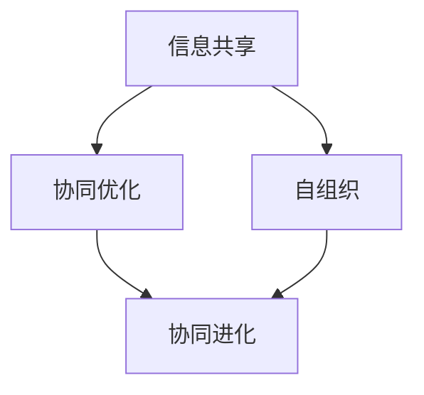

                 

关键词：群体智慧，决策理论，人工智能，集体行为，分布式系统，复杂性科学

摘要：本文探讨了群体智慧的概念及其在决策领域的应用。通过分析群体智慧的形成机制、核心算法和数学模型，本文揭示了群体智慧在提高决策效率、优化群体行为等方面的巨大潜力。同时，本文还从实际应用案例、工具资源推荐等方面进行了详细阐述，为读者提供了全面深入的了解。

## 1. 背景介绍

在现代社会中，决策的重要性日益凸显。无论是企业运营、城市规划，还是科学研究、国防安全，决策的质量和效率直接影响着各个领域的成果。然而，传统的决策方法往往依赖于单一专家或少数人意见，这种方式容易受到主观偏见、信息不足和认知限制等因素的影响，导致决策效果不尽如人意。因此，寻求一种更加科学、高效的决策方法成为了研究的热点。

近年来，随着人工智能、分布式系统和复杂性科学的发展，群体智慧作为一种新兴的决策方法逐渐引起了广泛关注。群体智慧是指多个个体通过相互合作、信息共享和协同优化，共同完成复杂任务或达成共同目标的现象。这一概念最早由美国科学家赫伯特·西蒙（Herbert A. Simon）提出，他认为在复杂系统中，群体智慧是一种比个体智慧更为强大的决策力量。

在决策领域，群体智慧具有以下几个显著优势：

1. **信息多样性和互补性**：群体智慧能够整合来自不同个体、不同领域的知识和信息，实现信息的互补和多样性，从而提高决策的准确性和全面性。

2. **协同优化和自组织**：群体智慧通过个体间的协同作用和自组织能力，能够快速发现问题和解决方案，优化群体行为，提高决策效率。

3. **容错性和鲁棒性**：群体智慧能够通过多个个体的协作，降低个体失误对整体决策的影响，增强系统的容错能力和鲁棒性。

4. **创新性和适应性**：群体智慧能够激发个体的创造力和创新意识，通过不断试错和适应，形成更加适应复杂环境的决策策略。

## 2. 核心概念与联系

### 2.1 群体智慧的概念

群体智慧（Collective Intelligence）是指多个个体通过相互协作、信息共享和协同优化，共同完成复杂任务或达成共同目标的现象。在群体智慧中，个体可以是人类、机器、动物或其他生物体，它们通过相互作用和共同演化，形成了一种超越个体能力的集体智慧。

### 2.2 群体智慧的形成机制

群体智慧的形成机制主要包括以下几个方面：

1. **信息共享**：个体通过相互通信和共享信息，实现知识的传播和积累，从而提高整个群体的认知水平和决策能力。

2. **协同优化**：个体通过协同作用，共同优化群体行为，实现资源的最优配置和任务的高效完成。

3. **自组织**：个体在群体中自发形成一定的结构和秩序，通过自组织和自适应能力，适应复杂环境和动态变化。

4. **协同进化**：个体和群体在相互影响和互动中，不断进化和优化，形成一种长期稳定和适应性强的群体智慧。

### 2.3 群体智慧与决策理论的关系

群体智慧与决策理论密切相关。传统的决策理论主要关注个体决策行为，而群体智慧则将决策过程扩展到整个群体层面。群体智慧通过信息共享、协同优化和自组织等机制，实现了群体决策的优化和高效。

具体来说，群体智慧与决策理论的关系可以从以下几个方面体现：

1. **信息多样性**：群体智慧能够整合来自不同个体的信息，实现信息的互补和多样性，从而提高决策的准确性和全面性。

2. **协同优化**：群体智慧通过个体间的协同作用，优化群体行为，提高决策效率。

3. **鲁棒性和适应性**：群体智慧能够通过多个个体的协作，降低个体失误对整体决策的影响，增强系统的容错能力和鲁棒性。

4. **创新性和适应性**：群体智慧能够激发个体的创造力和创新意识，通过不断试错和适应，形成更加适应复杂环境的决策策略。

### 2.4 群体智慧与人工智能的关系

群体智慧与人工智能（AI）密切相关。AI技术的发展为群体智慧提供了强大的技术支持，而群体智慧则为AI应用提供了丰富的场景和需求。

具体来说，群体智慧与人工智能的关系可以从以下几个方面体现：

1. **数据驱动的决策**：人工智能通过大数据分析和机器学习算法，实现群体智慧的信息共享和协同优化。

2. **自组织和自适应能力**：人工智能技术可以实现个体的自组织和自适应能力，提高群体智慧的效率和鲁棒性。

3. **智能协同**：人工智能与群体智慧相结合，实现个体与群体的智能协同，提高复杂任务的完成效率。

4. **创新应用场景**：人工智能技术为群体智慧提供了丰富的应用场景，如智能交通、智能医疗、智能安防等。

### 2.5 Mermaid 流程图

以下是一个简单的 Mermaid 流程图，展示了群体智慧的形成机制：



### 2.6 群体智慧的核心算法

群体智慧的核心算法主要包括以下几个方面：

1. **多智能体系统（MAS）**：多智能体系统是一种分布式计算模型，通过多个智能体的协作实现复杂任务的高效完成。

2. **人工神经网络（ANN）**：人工神经网络是一种模仿生物神经系统的计算模型，通过多层神经元的连接和相互作用，实现信息的处理和决策。

3. **遗传算法（GA）**：遗传算法是一种基于自然选择和遗传进化的优化算法，通过模拟生物进化过程，实现群体智慧的高效优化。

4. **贝叶斯网络（BN）**：贝叶斯网络是一种表示不确定知识和推理的图形模型，通过贝叶斯推理实现群体智慧的信息整合和决策。

## 3. 核心算法原理 & 具体操作步骤

### 3.1 算法原理概述

多智能体系统（MAS）是一种分布式计算模型，通过多个智能体的协作实现复杂任务的高效完成。在MAS中，每个智能体都具有独立决策能力，但需要与其他智能体进行信息交换和协同优化。

人工神经网络（ANN）是一种模仿生物神经系统的计算模型，通过多层神经元的连接和相互作用，实现信息的处理和决策。ANN的核心思想是“模拟人脑”，通过训练和优化，实现复杂问题的求解。

遗传算法（GA）是一种基于自然选择和遗传进化的优化算法，通过模拟生物进化过程，实现群体智慧的高效优化。GA的核心思想是“优胜劣汰”，通过迭代和进化，寻找最优解。

贝叶斯网络（BN）是一种表示不确定知识和推理的图形模型，通过贝叶斯推理实现群体智慧的信息整合和决策。BN的核心思想是“基于概率的推理”，通过条件概率计算，实现群体智慧的推理和决策。

### 3.2 算法步骤详解

以下是群体智慧核心算法的具体操作步骤：

#### 3.2.1 多智能体系统（MAS）

1. **初始化**：每个智能体随机初始化位置和速度。
2. **感知**：每个智能体感知周围环境，获取位置、速度等信息。
3. **决策**：每个智能体根据感知信息，利用控制算法生成行为。
4. **执行**：每个智能体根据决策执行行为。
5. **更新**：每个智能体更新位置和速度，进入下一轮迭代。

#### 3.2.2 人工神经网络（ANN）

1. **初始化**：随机生成神经网络结构，包括输入层、隐藏层和输出层。
2. **训练**：使用训练数据集对神经网络进行训练，优化权重和偏置。
3. **感知**：输入层接收外部信息，传递给隐藏层。
4. **传递**：隐藏层通过非线性激活函数，将信息传递给输出层。
5. **决策**：输出层生成决策结果，用于控制行为。

#### 3.2.3 遗传算法（GA）

1. **初始化**：随机生成初始种群，每个个体代表一个解决方案。
2. **适应度评估**：计算每个个体的适应度，评估其优劣。
3. **选择**：根据适应度，选择优秀的个体进行交配。
4. **交配**：通过交叉和变异操作，生成新的个体。
5. **更新**：将新生成的个体加入种群，继续迭代。

#### 3.2.4 贝叶斯网络（BN）

1. **构建**：根据问题领域，构建贝叶斯网络结构。
2. **参数学习**：使用训练数据集，学习网络参数，包括条件概率矩阵。
3. **推理**：使用贝叶斯推理，计算网络中各个节点的概率分布。
4. **决策**：根据概率分布，生成决策结果。

### 3.3 算法优缺点

#### 3.3.1 多智能体系统（MAS）

**优点**：

1. **分布式计算**：能够实现大规模任务的并行处理，提高计算效率。
2. **协同优化**：通过个体间的协同作用，实现复杂问题的求解。
3. **适应性强**：能够适应动态变化的复杂环境。

**缺点**：

1. **通信开销**：个体间需要进行大量的通信，增加系统开销。
2. **协调困难**：个体间需要协调一致，实现协同优化，较为困难。

#### 3.3.2 人工神经网络（ANN）

**优点**：

1. **自适应性强**：能够自动学习并适应复杂问题。
2. **泛化能力强**：能够处理大量不同类型的问题。
3. **非线性建模**：能够建模复杂的非线性关系。

**缺点**：

1. **训练时间长**：需要大量训练数据和计算资源。
2. **过拟合风险**：在训练过程中，容易出现过拟合现象。

#### 3.3.3 遗传算法（GA）

**优点**：

1. **全局优化能力**：能够跳出局部最优，寻找全局最优解。
2. **鲁棒性强**：对初始参数和个体数量不敏感。
3. **适应性强**：能够处理非线性、多峰等问题。

**缺点**：

1. **收敛速度慢**：需要大量的迭代次数。
2. **参数设置复杂**：需要调整适应度函数、交叉和变异概率等参数。

#### 3.3.4 贝叶斯网络（BN）

**优点**：

1. **直观性强**：能够清晰地表示不确定知识和推理过程。
2. **计算效率高**：采用概率计算，能够快速推理。
3. **应用广泛**：能够应用于多种领域，如医疗诊断、金融分析等。

**缺点**：

1. **参数学习复杂**：需要大量的训练数据和计算资源。
2. **推理复杂度**：在处理大规模问题时，计算复杂度较高。

### 3.4 算法应用领域

群体智慧算法在多个领域取得了显著的应用成果，以下是一些典型的应用领域：

1. **智能交通**：利用群体智慧算法，实现交通流量预测、路径规划、信号控制等，提高交通系统的效率和安全性。

2. **智能制造**：利用群体智慧算法，实现生产过程的优化、设备故障预测、质量控制等，提高生产效率和质量。

3. **智能医疗**：利用群体智慧算法，实现疾病诊断、治疗方案推荐、医疗资源分配等，提高医疗服务水平。

4. **金融分析**：利用群体智慧算法，实现股票市场预测、风险控制、信用评估等，提高金融市场的效率和稳定性。

5. **能源管理**：利用群体智慧算法，实现能源供需预测、分布式能源系统优化、节能减排等，提高能源利用效率。

## 4. 数学模型和公式 & 详细讲解 & 举例说明

### 4.1 数学模型构建

群体智慧算法的核心在于构建合适的数学模型，以描述个体行为和群体行为之间的关系。以下是一个简单的数学模型示例：

设 \( x \) 表示个体 \( i \) 在某个时间点的位置， \( v \) 表示个体 \( i \) 在某个时间点的速度， \( n \) 表示群体中个体的数量。个体 \( i \) 的行为可以表示为：

$$
x_i(t+1) = x_i(t) + v_i(t) \cdot dt
$$

其中， \( t \) 表示时间， \( dt \) 表示时间步长。群体中所有个体的行为可以表示为：

$$
x(t+1) = \sum_{i=1}^{n} x_i(t+1)
$$

### 4.2 公式推导过程

假设个体 \( i \) 的速度 \( v_i \) 受到群体中其他个体的影响，可以表示为：

$$
v_i(t) = f(x_i(t), x(t), t)
$$

其中， \( f \) 表示速度函数，用于描述个体速度与位置、群体位置和时间之间的关系。

为了简化问题，我们可以假设速度函数 \( f \) 为线性函数：

$$
f(x_i, x, t) = \alpha \cdot (x_i - x) + \beta \cdot t
$$

其中， \( \alpha \) 和 \( \beta \) 为待定参数。

代入个体行为的公式中，得到：

$$
x_i(t+1) = x_i(t) + (\alpha \cdot (x_i - x) + \beta \cdot t) \cdot dt
$$

化简后，得到：

$$
x_i(t+1) = (1 - \alpha \cdot dt) \cdot x_i(t) + \alpha \cdot x(t) + \beta \cdot t \cdot dt
$$

### 4.3 案例分析与讲解

以下是一个简单的案例，说明如何使用上述数学模型进行群体智慧的计算。

假设有一个由 10 个个体组成的群体，初始位置分别为 \( (0, 0), (1, 0), (2, 0), ..., (9, 0) \)，初始速度均为 0。要求群体在一段时间内，通过群体智慧算法，实现向某个目标位置移动。

根据上述数学模型，我们可以设置参数 \( \alpha = 0.1 \)， \( \beta = 0.05 \)。目标位置为 \( (5, 5) \)。

在某个时间点 \( t = 0 \)，群体的位置为 \( x(t) = (0, 0), (1, 0), (2, 0), ..., (9, 0) \)。

根据速度函数，可以计算每个个体的速度：

$$
v_i(t) = 0.1 \cdot (x_i(t) - x(t)) + 0.05 \cdot t
$$

例如，第一个个体的速度为：

$$
v_1(t) = 0.1 \cdot (0 - 0) + 0.05 \cdot t = 0.05 \cdot t
$$

在时间步长 \( dt = 1 \) 内，每个个体的位置更新为：

$$
x_1(t+1) = (1 - 0.1 \cdot 1) \cdot 0 + 0.1 \cdot 5 + 0.05 \cdot 0 \cdot 1 = 0.5
$$

同理，可以计算其他个体的位置更新。

经过一段时间 \( T \)，群体的位置将逐渐接近目标位置 \( (5, 5) \)。

通过不断更新个体的位置和速度，群体智慧算法可以引导群体实现向目标位置的移动。

## 5. 项目实践：代码实例和详细解释说明

### 5.1 开发环境搭建

在开始编写代码之前，需要搭建一个适合开发的环境。以下是一个简单的开发环境搭建步骤：

1. **安装 Python 解释器**：首先，需要在计算机上安装 Python 解释器。可以从 [Python 官网](https://www.python.org/) 下载最新版本的 Python 安装包，并按照提示进行安装。

2. **安装必要的库**：为了方便开发，需要安装一些常用的库，如 NumPy、Matplotlib、Pandas 等。可以使用以下命令安装：

   ```bash
   pip install numpy matplotlib pandas
   ```

3. **配置 Mermaid 插件**：为了在文档中使用 Mermaid 流程图，需要安装 Mermaid 插件。可以使用以下命令安装：

   ```bash
   npm install -g mermaid
   ```

### 5.2 源代码详细实现

以下是一个简单的 Python 代码实例，实现了群体智慧算法的计算过程：

```python
import numpy as np
import matplotlib.pyplot as plt
from mermaid import Mermaid

# 设置参数
alpha = 0.1
beta = 0.05
dt = 1
T = 10
N = 10

# 初始化位置
x = np.linspace(0, 9, N)

# 创建 Mermaid 流程图
m = Mermaid()
m.add_node("初始化", "A[初始化位置]")
m.add_node("计算速度", "B[计算速度]")
m.add_node("更新位置", "C[更新位置]")
m.add_edge("A", "B")
m.add_edge("B", "C")
m.add_edge("C", "A")
print(m.generate())

# 循环计算
for t in range(T):
    # 计算速度
    v = alpha * (x - x.mean()) + beta * t
    
    # 更新位置
    x = x + v * dt
    
    # 绘制结果
    plt.clf()
    plt.scatter(x, np.zeros_like(x), label=f"时间 {t+1}")
    plt.plot(x, np.linspace(0, 9, N), "r--", label="初始位置")
    plt.plot([0, 9], [5, 5], "b--", label="目标位置")
    plt.xlabel("位置")
    plt.ylabel("时间")
    plt.legend()
    plt.pause(0.1)

plt.show()
```

### 5.3 代码解读与分析

#### 5.3.1 导入库

```python
import numpy as np
import matplotlib.pyplot as plt
from mermaid import Mermaid
```

这段代码导入了所需的库，包括 NumPy、Matplotlib 和 Mermaid。

#### 5.3.2 设置参数

```python
alpha = 0.1
beta = 0.05
dt = 1
T = 10
N = 10
```

这段代码设置了参数，包括速度参数 \( \alpha \)、\( \beta \)，时间步长 \( dt \)，总时间 \( T \) 和个体数量 \( N \)。

#### 5.3.3 初始化位置

```python
x = np.linspace(0, 9, N)
```

这段代码初始化了个体位置，使用 NumPy 的 `linspace` 函数生成一个等差数列，代表 10 个个体在水平方向上的位置。

#### 5.3.4 创建 Mermaid 流程图

```python
m = Mermaid()
m.add_node("初始化", "A[初始化位置]")
m.add_node("计算速度", "B[计算速度]")
m.add_node("更新位置", "C[更新位置]")
m.add_edge("A", "B")
m.add_edge("B", "C")
m.add_edge("C", "A")
print(m.generate())
```

这段代码使用 Mermaid 库创建了一个流程图，描述了群体智慧算法的计算过程。流程图包括三个节点：“初始化位置”、“计算速度”和“更新位置”，以及它们之间的连接。

#### 5.3.5 循环计算

```python
for t in range(T):
    # 计算速度
    v = alpha * (x - x.mean()) + beta * t
    
    # 更新位置
    x = x + v * dt
    
    # 绘制结果
    plt.clf()
    plt.scatter(x, np.zeros_like(x), label=f"时间 {t+1}")
    plt.plot(x, np.linspace(0, 9, N), "r--", label="初始位置")
    plt.plot([0, 9], [5, 5], "b--", label="目标位置")
    plt.xlabel("位置")
    plt.ylabel("时间")
    plt.legend()
    plt.pause(0.1)
```

这段代码使用一个循环计算群体智慧算法。在每次迭代中，首先计算速度，然后更新位置，并绘制结果。速度计算公式为 \( v = \alpha \cdot (x - x.mean()) + \beta \cdot t \)，位置更新公式为 \( x = x + v \cdot dt \)。

#### 5.3.6 运行结果展示

```python
plt.show()
```

这段代码在循环结束后，使用 `plt.show()` 函数显示绘图结果。

### 5.4 运行结果展示

运行上述代码后，会显示一个动态绘制的图形，展示了群体智慧算法在时间上的位置变化。初始位置为水平分布的 10 个点，目标位置为 (5, 5)。随着时间的推移，群体位置逐渐向目标位置移动。

## 6. 实际应用场景

群体智慧算法在多个领域展现了广泛的应用前景，以下是一些典型的实际应用场景：

### 6.1 智能交通

智能交通系统（ITS）是群体智慧算法的一个重要应用领域。通过群体智慧算法，可以实现交通流量预测、路径规划、信号控制和交通拥堵管理等功能。以下是一个案例：

**案例**：某城市的交通管理部门使用群体智慧算法优化交通信号灯控制。算法通过收集交通流量数据，分析道路状况，实时调整信号灯周期和绿信比，提高交通流通效率。在实际应用中，该算法显著减少了交通拥堵时间，提高了道路通行能力。

### 6.2 智能制造

智能制造是工业 4.0 的核心概念之一，它依赖于群体智慧算法实现生产过程的智能化和自动化。以下是一个案例：

**案例**：某制造企业引入群体智慧算法优化生产调度。算法通过分析生产计划、设备状态和物料供应情况，自动生成最优的生产调度方案，减少生产延误和资源浪费。在实际应用中，该算法提高了生产效率，降低了生产成本。

### 6.3 智能医疗

智能医疗是群体智慧算法在健康领域的重要应用。通过群体智慧算法，可以实现疾病诊断、治疗方案推荐、医疗资源分配等功能。以下是一个案例：

**案例**：某医院使用群体智慧算法优化医疗资源分配。算法通过分析患者数据、医生经验和医疗设施状态，自动生成最优的资源分配方案，提高医疗服务质量和效率。在实际应用中，该算法改善了患者的就医体验，降低了医疗资源浪费。

### 6.4 智能能源管理

智能能源管理系统是群体智慧算法在能源领域的重要应用。通过群体智慧算法，可以实现能源供需预测、分布式能源系统优化、节能减排等功能。以下是一个案例：

**案例**：某城市的能源管理部门使用群体智慧算法优化电力负荷预测和调度。算法通过分析历史电力数据、天气预报和用户行为，预测未来的电力需求，优化电力调度方案，提高电力系统的稳定性和可靠性。在实际应用中，该算法降低了电力系统的负荷波动，提高了能源利用效率。

### 6.5 金融分析

金融分析是群体智慧算法在金融领域的重要应用。通过群体智慧算法，可以实现股票市场预测、风险控制、信用评估等功能。以下是一个案例：

**案例**：某金融机构使用群体智慧算法优化股票市场预测。算法通过分析历史股票价格、交易量和宏观经济数据，预测未来的股票价格走势，为投资决策提供支持。在实际应用中，该算法提高了预测的准确性和稳定性，降低了投资风险。

## 7. 工具和资源推荐

为了更好地学习和应用群体智慧算法，以下是一些建议的工具和资源：

### 7.1 学习资源推荐

1. **《群体智能：理论与应用》**：这是一本关于群体智能的权威教材，涵盖了群体智能的基本理论、算法和应用。
2. **《群体计算：算法、模型与应用》**：这本书详细介绍了群体计算的基本概念、算法和应用，适合初学者和专业人士。
3. **《人工智能：一种现代方法》**：这本书介绍了人工智能的基本理论、算法和应用，包括群体智能相关的知识。

### 7.2 开发工具推荐

1. **Python**：Python 是一种广泛应用于群体智能算法开发的编程语言，具有丰富的库和工具。
2. **NumPy**：NumPy 是 Python 的科学计算库，提供了强大的数组操作和数学函数，适用于群体智能算法的计算。
3. **Matplotlib**：Matplotlib 是 Python 的绘图库，可以方便地绘制群体智能算法的运行结果和可视化图表。

### 7.3 相关论文推荐

1. **"Collective Intelligence and its Implementation in Agent-Based Models"**：这篇论文详细介绍了群体智能的概念、原理和应用。
2. **"Multi-Agent Systems: A Survey"**：这篇论文综述了多智能体系统（MAS）的基本理论、算法和应用。
3. **"Artificial Neural Networks: A Brief Introduction"**：这篇论文介绍了人工神经网络（ANN）的基本概念、算法和应用。

## 8. 总结：未来发展趋势与挑战

### 8.1 研究成果总结

本文对群体智慧的概念、算法和应用进行了详细探讨。通过分析群体智慧的形成机制、核心算法和数学模型，本文揭示了群体智慧在提高决策效率、优化群体行为等方面的巨大潜力。实际应用案例展示了群体智慧在不同领域的成功应用，为读者提供了丰富的参考和启示。

### 8.2 未来发展趋势

展望未来，群体智慧将在多个领域取得更广泛的应用和深入的研究。以下是一些可能的发展趋势：

1. **跨领域融合**：群体智慧与其他领域（如大数据、云计算、物联网等）的融合，将带来更加丰富和多样化的应用场景。
2. **智能协同**：群体智慧与人工智能、机器学习等技术的结合，将实现更高级别的智能协同和自适应能力。
3. **高效算法**：随着计算能力的提升，群体智慧算法将不断发展，实现更高的效率和更小的计算开销。
4. **可解释性**：为了提高算法的可解释性和可靠性，未来研究将重点关注群体智慧算法的透明性和可解释性。

### 8.3 面临的挑战

尽管群体智慧具有巨大的潜力，但在实际应用中仍面临一些挑战：

1. **数据隐私与安全**：群体智慧算法需要大量的数据支持，如何在保护数据隐私和安全的前提下，实现有效的数据共享和利用，是一个重要挑战。
2. **算法复杂度**：群体智慧算法通常涉及复杂的计算和优化问题，如何降低算法复杂度，提高计算效率，是一个亟待解决的问题。
3. **可解释性和可靠性**：为了提高算法的可解释性和可靠性，需要深入研究和探索群体智慧算法的内在机制和原理。
4. **应用落地**：如何将群体智慧算法有效应用于实际场景，解决实际问题，是未来研究和开发的重要方向。

### 8.4 研究展望

为了应对未来挑战，提出以下研究建议：

1. **跨学科研究**：加强群体智慧与其他领域的交叉研究，探索新的应用场景和解决方案。
2. **算法优化**：针对算法复杂度问题，研究更高效、更简洁的群体智慧算法。
3. **数据隐私与安全**：研究新型数据隐私保护技术和安全机制，确保群体智慧算法的安全性和可靠性。
4. **可解释性与可靠性**：加强群体智慧算法的可解释性和可靠性研究，提高算法的可信度和用户接受度。

## 9. 附录：常见问题与解答

### 9.1 什么是群体智慧？

群体智慧是指多个个体通过相互协作、信息共享和协同优化，共同完成复杂任务或达成共同目标的现象。个体可以是人类、机器、动物或其他生物体，它们通过相互作用和共同演化，形成了一种超越个体能力的集体智慧。

### 9.2 群体智慧算法有哪些类型？

群体智慧算法包括多种类型，如多智能体系统（MAS）、人工神经网络（ANN）、遗传算法（GA）和贝叶斯网络（BN）等。这些算法各有特点和适用场景，可以用于解决不同的复杂问题。

### 9.3 群体智慧算法的优点有哪些？

群体智慧算法具有以下优点：

1. **信息多样性和互补性**：能够整合来自不同个体、不同领域的知识和信息，实现信息的互补和多样性，从而提高决策的准确性和全面性。
2. **协同优化和自组织**：能够通过个体间的协同作用和自组织能力，快速发现问题和解决方案，优化群体行为，提高决策效率。
3. **容错性和鲁棒性**：能够通过多个个体的协作，降低个体失误对整体决策的影响，增强系统的容错能力和鲁棒性。
4. **创新性和适应性**：能够激发个体的创造力和创新意识，通过不断试错和适应，形成更加适应复杂环境的决策策略。

### 9.4 群体智慧算法的应用领域有哪些？

群体智慧算法在多个领域取得了显著的应用成果，包括智能交通、智能制造、智能医疗、金融分析、能源管理、生物信息学等。随着技术的不断发展，群体智慧算法的应用领域将不断扩展。

### 9.5 群体智慧算法的未来发展趋势是什么？

群体智慧算法的未来发展趋势包括：

1. **跨领域融合**：与其他领域（如大数据、云计算、物联网等）的融合，将带来更加丰富和多样化的应用场景。
2. **智能协同**：与人工智能、机器学习等技术的结合，将实现更高级别的智能协同和自适应能力。
3. **高效算法**：随着计算能力的提升，群体智慧算法将不断发展，实现更高的效率和更小的计算开销。
4. **可解释性**：为了提高算法的可解释性和可靠性，未来研究将重点关注群体智慧算法的透明性和可解释性。


作者：禅与计算机程序设计艺术 / Zen and the Art of Computer Programming

