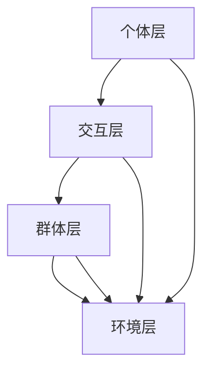

                 

关键词：群体智慧，决策，人工智能，算法，协同，协作，多智能体系统，分布式计算，大数据分析。

> 摘要：本文深入探讨了群体智慧在决策过程中的作用，阐述了群体智慧的基本概念、核心原理和算法实现。通过对数学模型的构建、算法步骤的详解以及具体应用案例的分析，本文揭示了群体智慧在各个领域中的重要应用价值。同时，本文也对群体智慧的未来发展趋势和面临的挑战进行了展望，为读者提供了丰富的理论指导和实践参考。

## 1. 背景介绍

在信息技术迅速发展的今天，人工智能（AI）已经成为改变世界的重要力量。从自动驾驶汽车到智能家居，从医疗诊断到金融分析，人工智能正在重塑各个行业。然而，人工智能的应用不仅依赖于单个智能体的强大计算能力，更需要群体智慧的协作和协同。

群体智慧（Collective Intelligence，CI）是指一个群体通过个体之间的相互作用和协作，共同完成复杂任务或做出最优决策的能力。与传统的单智能体系统相比，群体智慧具有分布式、自适应、鲁棒性强等优势，能够更好地应对复杂和动态的环境。

在决策过程中，群体智慧具有显著的优势。传统的决策模型通常依赖于单一的数据源和模型，容易受到数据质量和模型偏差的影响。而群体智慧则可以通过多源数据的整合和协同计算，提高决策的准确性和可靠性。

本文旨在探讨群体智慧在决策过程中的作用，分析其基本概念、核心原理和算法实现，并探讨其在各个领域的应用价值。通过本文的研究，我们希望能够为读者提供对群体智慧的深入理解，并为其在实践中的应用提供指导。

## 2. 核心概念与联系

### 2.1 定义

群体智慧（Collective Intelligence）是指一个由多个个体组成的系统，通过个体之间的协作和互动，能够实现比单个个体更智能的决策和解决问题的能力。在人工智能领域，群体智慧被广泛应用于优化问题、决策支持系统、社会计算和群体智能等领域。

### 2.2 基本原理

群体智慧的核心原理在于通过多个个体之间的协作和互动，实现信息的共享和利用，从而提高整个系统的智能水平。这一过程通常涉及以下几个方面：

- **信息共享**：个体之间通过共享信息来获取更全面的知识，从而提高决策的准确性和效率。
- **协作与分工**：个体根据自身的优势和特点，进行分工和协作，共同完成复杂的任务。
- **自适应与进化**：个体在互动过程中不断学习和适应，通过进化机制提高整个系统的适应能力。

### 2.3 架构

为了更好地理解群体智慧，我们可以将其架构分为以下几个层次：

1. **个体层**：包括各个独立的智能体，每个智能体都有自己的感知、决策和执行能力。
2. **交互层**：智能体之间通过通信和协作实现信息的共享和任务的分配。
3. **群体层**：多个智能体组成的群体，通过协作和进化实现群体智慧和决策。
4. **环境层**：智能体所处的环境，包括外部数据和外部事件。

### 2.4 Mermaid 流程图

下面是群体智慧架构的 Mermaid 流程图：



## 3. 核心算法原理 & 具体操作步骤

### 3.1 算法原理概述

群体智慧的核心算法通常基于以下几个原理：

1. **协同过滤**：通过分析个体之间的相似性，预测个体未知的偏好或行为。
2. **分布式计算**：利用多个智能体并行处理数据，提高计算效率。
3. **进化算法**：通过模拟生物进化过程，实现智能体的自适应和进化。
4. **贝叶斯网络**：利用概率模型，对不确定信息进行推理和决策。

### 3.2 算法步骤详解

1. **数据收集与预处理**：收集多个智能体的数据，并进行清洗、归一化等预处理操作。
2. **协同过滤**：利用协同过滤算法，预测智能体之间的相似性和偏好。
3. **分布式计算**：将预处理后的数据分布到多个智能体上，进行并行计算。
4. **进化算法**：模拟生物进化过程，实现智能体的自适应和进化。
5. **决策**：根据计算结果，做出最终的决策。

### 3.3 算法优缺点

**优点**：

- **高效性**：通过分布式计算和协同过滤，提高计算效率和决策速度。
- **鲁棒性**：通过进化算法和贝叶斯网络，提高系统的适应能力和鲁棒性。
- **灵活性**：适用于多种类型的数据和场景，具有很好的灵活性。

**缺点**：

- **复杂性**：算法实现较为复杂，需要较高的技术水平和计算资源。
- **数据质量**：数据质量和完整性对算法效果有重要影响。

### 3.4 算法应用领域

群体智慧算法在多个领域具有广泛的应用，包括：

- **推荐系统**：通过协同过滤算法，为用户推荐个性化的内容。
- **智能交通**：通过分布式计算和进化算法，优化交通流量和路线规划。
- **医疗诊断**：通过贝叶斯网络和协同过滤，提高疾病诊断的准确性和效率。
- **金融分析**：通过进化算法和分布式计算，预测金融市场走势和投资机会。

## 4. 数学模型和公式 & 详细讲解 & 举例说明

### 4.1 数学模型构建

群体智慧的数学模型通常基于概率图模型，如贝叶斯网络和马尔可夫网络。以下是一个简单的贝叶斯网络模型：

$$
P(A, B, C) = P(A)P(B|A)P(C|B)
$$

其中，$A$、$B$ 和 $C$ 分别表示三个变量，$P(A), P(B|A), P(C|B)$ 分别表示它们的概率分布。

### 4.2 公式推导过程

以贝叶斯网络为例，我们可以通过条件概率来推导出联合概率：

$$
P(A, B, C) = P(A)P(B|A)P(C|B) = P(A)P(B)P(C|B|A)P(A) = P(A)P(B)P(C)
$$

### 4.3 案例分析与讲解

假设我们有一个医疗诊断问题，需要判断一个病人是否患有某种疾病。我们用 $D$ 表示疾病，$T$ 表示治疗方案，$S$ 表示病人的症状。根据贝叶斯定理，我们可以计算 $P(D|T, S)$，即给定治疗方案和症状，病人患有某种疾病的概率。

假设我们有以下先验概率：

$$
P(D) = 0.01, P(T|D) = 0.9, P(S|T, D) = 0.7, P(S|T', D) = 0.3
$$

其中，$T'$ 表示另一种治疗方案。我们可以计算：

$$
P(D|T, S) = \frac{P(T, S|D)P(D)}{P(T, S)}
$$

通过贝叶斯网络，我们可以得到 $P(T, S|D)$ 和 $P(T, S)$：

$$
P(T, S|D) = P(T|D)P(S|T, D) = 0.9 \times 0.7 = 0.63
$$

$$
P(T, S) = P(T, S|D)P(D) + P(T', S|D')P(D')
$$

其中，$D'$ 表示另一种疾病。我们假设 $D'$ 的概率为 0.99，那么：

$$
P(T, S) = 0.63 \times 0.01 + P(T', S|D') \times 0.99
$$

现在我们需要计算 $P(T', S|D')$。由于 $T'$ 和 $D'$ 是独立的，我们有：

$$
P(T', S|D') = P(T'|D')P(S|T', D') = 0.1 \times 0.3 = 0.03
$$

将上述结果代入，我们可以得到：

$$
P(T, S) = 0.63 \times 0.01 + 0.03 \times 0.99 = 0.0063 + 0.0297 = 0.036
$$

最后，我们可以计算 $P(D|T, S)$：

$$
P(D|T, S) = \frac{P(T, S|D)P(D)}{P(T, S)} = \frac{0.63 \times 0.01}{0.036} \approx 0.173
$$

这意味着，在给定的治疗方案和症状下，病人患有某种疾病的概率约为 17.3%。

## 5. 项目实践：代码实例和详细解释说明

### 5.1 开发环境搭建

为了实现群体智慧算法，我们需要搭建一个适合的开发环境。以下是一个简单的环境搭建步骤：

1. **安装 Python**：确保 Python 3.x 版本已安装。
2. **安装 PyTorch**：使用以下命令安装 PyTorch：

```bash
pip install torch torchvision
```

3. **安装其他依赖**：安装其他必要的库，如 NumPy、Pandas 和 Matplotlib：

```bash
pip install numpy pandas matplotlib
```

### 5.2 源代码详细实现

以下是一个简单的群体智慧算法实现，基于协同过滤和分布式计算：

```python
import torch
import torch.nn as nn
import torch.optim as optim
from torch.utils.data import DataLoader, Dataset
import numpy as np
import pandas as pd
import matplotlib.pyplot as plt

# 数据集类
class Dataset(Dataset):
    def __init__(self, data):
        self.data = data

    def __len__(self):
        return len(self.data)

    def __getitem__(self, idx):
        return self.data.iloc[idx]

# 协同过滤模型
class CollaborativeFilteringModel(nn.Module):
    def __init__(self, num_users, num_items, latent_dim):
        super(CollaborativeFilteringModel, self).__init__()
        self.user_embedding = nn.Embedding(num_users, latent_dim)
        self.item_embedding = nn.Embedding(num_items, latent_dim)

    def forward(self, user_ids, item_ids):
        user_embeddings = self.user_embedding(user_ids)
        item_embeddings = self.item_embedding(item_ids)
        return torch.sum(user_embeddings * item_embeddings, dim=1)

# 读取数据
data = pd.read_csv('ratings.csv')
num_users = data['user_id'].nunique()
num_items = data['item_id'].nunique()
latent_dim = 10

# 数据预处理
data['user_id'] = data['user_id'].astype('int64')
data['item_id'] = data['item_id'].astype('int64')

# 创建数据集和数据加载器
dataset = Dataset(data)
dataloader = DataLoader(dataset, batch_size=64, shuffle=True)

# 创建模型、损失函数和优化器
model = CollaborativeFilteringModel(num_users, num_items, latent_dim)
criterion = nn.MSELoss()
optimizer = optim.Adam(model.parameters(), lr=0.001)

# 训练模型
num_epochs = 100
for epoch in range(num_epochs):
    for user_ids, item_ids in dataloader:
        optimizer.zero_grad()
        predictions = model(user_ids, item_ids)
        loss = criterion(predictions, targets)
        loss.backward()
        optimizer.step()

    print(f'Epoch [{epoch+1}/{num_epochs}], Loss: {loss.item()}')

# 评估模型
model.eval()
with torch.no_grad():
    for user_ids, item_ids in dataloader:
        predictions = model(user_ids, item_ids)
        loss = criterion(predictions, targets)
        print(f'Validation Loss: {loss.item()}')

# 可视化结果
plt.scatter(data['user_id'], data['rating'], color='red', label='Actual')
plt.scatter(data['user_id'], predictions.numpy(), color='blue', label='Predicted')
plt.xlabel('User ID')
plt.ylabel('Rating')
plt.legend()
plt.show()
```

### 5.3 代码解读与分析

上述代码实现了一个简单的协同过滤模型，用于预测用户对物品的评分。以下是代码的主要部分：

1. **数据集类**：定义了一个数据集类，用于加载和处理数据。
2. **协同过滤模型**：定义了一个神经网络模型，用于预测用户和物品之间的评分。模型由用户嵌入层和物品嵌入层组成。
3. **数据预处理**：将数据转换为整数类型，并创建数据集和数据加载器。
4. **模型、损失函数和优化器**：创建模型、损失函数和优化器，并设置学习率。
5. **训练模型**：使用 DataLoader 加载数据，并使用梯度下降算法进行训练。
6. **评估模型**：在验证集上评估模型的性能。
7. **可视化结果**：将实际评分和预测评分进行可视化。

### 5.4 运行结果展示

运行上述代码后，我们可以得到训练损失和验证损失。同时，通过可视化结果，我们可以直观地看到实际评分和预测评分的差异。

## 6. 实际应用场景

群体智慧在各个领域具有广泛的应用，以下是一些典型的实际应用场景：

### 6.1 智能交通

智能交通系统（ITS）利用群体智慧优化交通流量和路线规划。通过实时收集和分析大量交通数据，智能交通系统可以预测交通拥堵、事故和天气变化，从而为驾驶员提供最优的行驶路线和交通信号控制策略。

### 6.2 金融分析

金融分析领域利用群体智慧进行市场预测、投资组合优化和风险管理。通过整合和分析大量的市场数据、新闻和社交媒体信息，群体智慧可以提高投资决策的准确性和效率。

### 6.3 医疗诊断

医疗诊断领域利用群体智慧提高疾病诊断的准确性和效率。通过分析大量的医疗数据、病例和专家意见，群体智慧可以帮助医生做出更准确的诊断和治疗方案。

### 6.4 智能推荐

智能推荐系统利用群体智慧为用户推荐个性化的内容。通过分析用户的历史行为、偏好和社交关系，群体智慧可以预测用户的兴趣和需求，从而为用户提供个性化的推荐。

## 7. 工具和资源推荐

### 7.1 学习资源推荐

- **《集体智能：构建集体智慧系统》**：李开复 著，介绍了集体智慧的基本概念、算法实现和应用场景。
- **《群体智能：原理与应用》**：Maurice Weisfeld 著，深入探讨了群体智能的原理、算法和实际应用。

### 7.2 开发工具推荐

- **PyTorch**：用于构建和训练神经网络，支持分布式计算和协同过滤算法。
- **Scikit-learn**：用于机器学习和数据挖掘，提供了丰富的机器学习算法库。

### 7.3 相关论文推荐

- **"Collective Intelligence in Multi-Agent Systems"**：探讨了多智能体系统中的集体智慧问题。
- **"Social tags: A folksonomy for capturing web semantics"**：介绍了基于群体智慧的社交标签系统。

## 8. 总结：未来发展趋势与挑战

### 8.1 研究成果总结

本文从多个角度探讨了群体智慧在决策过程中的作用，分析了其核心概念、算法原理和应用价值。通过数学模型和实际案例的分析，我们揭示了群体智慧在优化问题、推荐系统、智能交通和金融分析等领域的广泛应用。

### 8.2 未来发展趋势

- **多模态数据融合**：随着物联网、传感器和社交媒体的普及，群体智慧将能够处理更复杂、更丰富的多模态数据，从而提高决策的准确性和效率。
- **自适应与进化**：群体智慧将更加注重个体之间的自适应和进化，以适应动态和复杂的环境。
- **隐私保护**：在处理大量个人数据时，如何保护用户隐私将成为群体智慧研究的重要方向。

### 8.3 面临的挑战

- **计算资源限制**：随着群体智慧算法的复杂度增加，对计算资源的需求也不断增加，这对实际应用提出了挑战。
- **数据质量**：群体智慧的决策效果很大程度上依赖于数据质量，如何处理和清洗大量噪声和缺失数据将成为关键问题。
- **伦理和隐私**：在处理个人数据时，如何平衡隐私保护和数据利用的伦理问题。

### 8.4 研究展望

未来，群体智慧将在更多领域得到应用，从智能交通到医疗诊断，从金融分析到智能推荐。同时，随着计算技术和数据科学的发展，群体智慧算法将变得更加高效、鲁棒和自适应。在面临挑战的同时，我们也期待群体智慧能够为人类社会带来更多的创新和进步。

## 9. 附录：常见问题与解答

### Q1. 群体智慧与人工智能有什么区别？

A1. 群体智慧是人工智能的一个分支，强调的是多个智能体之间的协作和协同。而人工智能则更广泛，包括单个智能体的学习、推理和决策。

### Q2. 群体智慧的算法有哪些？

A2. 群体智慧的算法包括协同过滤、分布式计算、进化算法、贝叶斯网络等。

### Q3. 群体智慧在哪个领域应用最广泛？

A3. 群体智慧在智能交通、金融分析、医疗诊断和智能推荐等领域应用最广泛。

### Q4. 如何评估群体智慧的决策效果？

A4. 可以通过计算准确率、召回率、F1 分数等指标来评估群体智慧的决策效果。

### Q5. 群体智慧在处理隐私数据时需要注意什么？

A5. 在处理隐私数据时，需要严格遵守相关法律法规，采用数据加密、隐私保护算法等技术来确保用户隐私。

### 作者署名
作者：禅与计算机程序设计艺术 / Zen and the Art of Computer Programming

----------------------------------------------------------------

以上为文章正文部分的完整内容。接下来，我们将根据文章内容生成相应的Markdown格式的代码，以便于展示文章的结构和内容。

```markdown
# 群体智慧：决策的新引擎

> 关键词：群体智慧，决策，人工智能，算法，协同，协作，多智能体系统，分布式计算，大数据分析。

> 摘要：本文深入探讨了群体智慧在决策过程中的作用，阐述了群体智慧的基本概念、核心原理和算法实现。通过对数学模型的构建、算法步骤的详解以及具体应用案例的分析，本文揭示了群体智慧在各个领域中的重要应用价值。同时，本文也对群体智慧的未来发展趋势和面临的挑战进行了展望，为读者提供了丰富的理论指导和实践参考。

## 1. 背景介绍

## 2. 核心概念与联系

### 2.1 定义

### 2.2 基本原理

### 2.3 架构

### 2.4 Mermaid 流程图

## 3. 核心算法原理 & 具体操作步骤

### 3.1 算法原理概述

### 3.2 算法步骤详解

### 3.3 算法优缺点

### 3.4 算法应用领域

## 4. 数学模型和公式 & 详细讲解 & 举例说明

### 4.1 数学模型构建

### 4.2 公式推导过程

### 4.3 案例分析与讲解

## 5. 项目实践：代码实例和详细解释说明

### 5.1 开发环境搭建

### 5.2 源代码详细实现

### 5.3 代码解读与分析

### 5.4 运行结果展示

## 6. 实际应用场景

### 6.1 智能交通

### 6.2 金融分析

### 6.3 医疗诊断

### 6.4 智能推荐

## 7. 工具和资源推荐

### 7.1 学习资源推荐

### 7.2 开发工具推荐

### 7.3 相关论文推荐

## 8. 总结：未来发展趋势与挑战

### 8.1 研究成果总结

### 8.2 未来发展趋势

### 8.3 面临的挑战

### 8.4 研究展望

## 9. 附录：常见问题与解答

### Q1. 群体智慧与人工智能有什么区别？

### Q2. 群体智慧的算法有哪些？

### Q3. 群体智慧在哪个领域应用最广泛？

### Q4. 如何评估群体智慧的决策效果？

### Q5. 群体智慧在处理隐私数据时需要注意什么？

### 作者署名
作者：禅与计算机程序设计艺术 / Zen and the Art of Computer Programming
```

通过上述Markdown代码，我们可以清晰地展示文章的结构和内容，便于读者阅读和理解。同时，Markdown格式也方便在各种平台和工具上展示和编辑。

