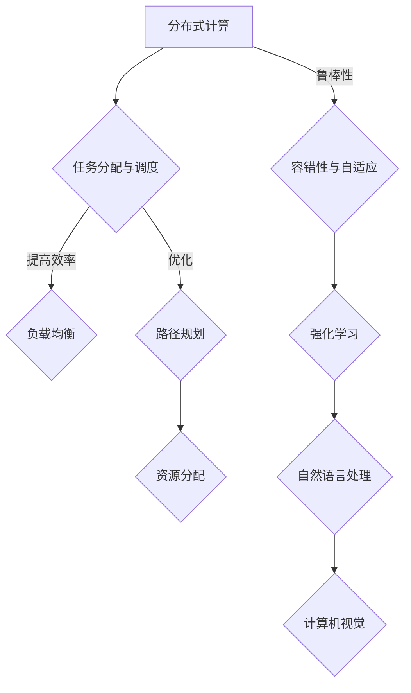

                 

关键词：群体智慧、分布式计算、协作算法、人工智能、集体潜能、协作效率、智能优化、并行处理

> 摘要：本文将探讨群体智慧的概念、理论基础及应用实践。通过分析群体智慧在分布式计算、协作算法和人工智能等领域的应用，揭示如何通过释放集体潜能，实现更高效、更智能的计算机程序设计和系统开发。

## 1. 背景介绍

在当今信息时代，计算机技术和人工智能的发展日新月异。分布式计算、协作算法和群体智能等新兴技术逐渐成为计算机科学和人工智能研究的重要方向。群体智慧（Swarm Intelligence）作为一种自组织、自适应的智能体系，以其高效、灵活和鲁棒性受到广泛关注。本文旨在探讨群体智慧的基本概念、理论基础和实际应用，旨在为广大计算机科学和人工智能从业者提供有益的参考和启示。

### 1.1 群体智慧的定义

群体智慧是指由大量简单个体组成的系统，通过局部信息交互和协同作用，表现出复杂、智能的行为和决策能力。这些个体通常不具备智能，但通过群体协作，能够实现全局优化和任务完成。群体智慧具有以下几个特点：

- **分布式计算**：个体在系统中独立工作，通过局部信息交换实现全局优化。
- **自组织**：系统无需中央控制，个体通过规则和局部信息交互实现协作。
- **自适应**：个体能够根据环境变化和任务需求，动态调整自身行为和策略。
- **鲁棒性**：系统能够在个体失败或缺失的情况下，仍保持稳定运行。

### 1.2 群体智慧的历史与发展

群体智慧的概念最早可追溯到20世纪60年代，由计算机科学家约翰·霍兰（John H. Holland）提出。霍兰在其著作《隐秩序：适应性系统的自组织》中，详细阐述了群体智能的理论基础。随着计算机技术和人工智能的不断发展，群体智慧的应用范围逐渐扩大，从最初的自然模拟领域，发展到现在的分布式计算、协作算法和人工智能等领域。

## 2. 核心概念与联系

### 2.1 分布式计算

分布式计算是指将计算任务分解为多个子任务，由多个计算节点共同完成。分布式计算的优势在于能够提高计算速度和资源利用率。群体智慧在分布式计算中的应用，主要体现在以下几个方面：

- **任务分配与调度**：通过群体智能算法，实现计算任务的动态分配和调度，提高任务完成效率。
- **容错性与鲁棒性**：个体在分布式计算中，能够根据局部信息动态调整任务执行策略，提高系统的容错性和鲁棒性。
- **负载均衡**：群体智慧算法能够根据系统负载情况，动态调整计算节点的任务分配，实现负载均衡。

### 2.2 协作算法

协作算法是指多个个体在完成任务过程中，通过局部信息交互和协同作用，实现整体优化和目标达成。群体智慧在协作算法中的应用，主要体现在以下几个方面：

- **任务分配与优化**：通过群体智能算法，实现个体任务分配和协作优化，提高整体效率。
- **路径规划**：群体智能算法能够根据局部信息，实现路径规划的优化和调整。
- **资源分配**：通过群体智能算法，实现资源分配的优化和调整，提高资源利用率。

### 2.3 人工智能

人工智能是指通过计算机模拟人类智能，实现人机交互和智能决策。群体智慧在人工智能中的应用，主要体现在以下几个方面：

- **强化学习**：群体智慧算法在强化学习领域具有广泛应用，能够提高学习效率和决策能力。
- **自然语言处理**：群体智慧算法在自然语言处理领域，能够提高文本分析和语义理解能力。
- **计算机视觉**：群体智慧算法在计算机视觉领域，能够提高图像识别和目标检测能力。

### 2.4 Mermaid 流程图

以下是一个关于分布式计算、协作算法和人工智能中群体智慧应用的 Mermaid 流程图：



## 3. 核心算法原理 & 具体操作步骤

### 3.1 算法原理概述

群体智慧算法是一种基于个体协作和局部信息交互的智能优化算法。其基本原理可以概括为：

- **个体建模**：将问题转化为个体行为，每个个体代表一个潜在的解决方案。
- **局部信息交互**：个体通过局部信息交换，实现相互协作和调整。
- **全局优化**：个体在局部信息交互过程中，逐渐优化自身行为和策略，实现全局优化。

### 3.2 算法步骤详解

群体智慧算法的基本步骤如下：

1. **初始化个体**：根据问题规模和需求，生成一定数量的初始个体。
2. **计算适应度**：对每个个体进行评估，计算其适应度值。
3. **个体选择**：根据适应度值，选择适应度较高的个体作为父代。
4. **交叉与变异**：对父代进行交叉与变异操作，生成新的子代。
5. **计算适应度**：对子代进行评估，计算其适应度值。
6. **替换与更新**：根据适应度值，选择适应度较高的子代替换父代，并更新种群。
7. **终止条件判断**：判断是否满足终止条件（如达到最大迭代次数或适应度阈值），若满足，则算法终止，否则返回步骤3。

### 3.3 算法优缺点

群体智慧算法具有以下优点：

- **高效性**：通过个体协作和局部信息交互，实现全局优化，具有较高的效率。
- **鲁棒性**：个体在局部信息交互过程中，能够自适应调整自身行为和策略，具有较强的鲁棒性。
- **灵活性**：适用于多种问题领域，具有较好的灵活性。

然而，群体智慧算法也存在以下缺点：

- **计算复杂度**：个体数量和迭代次数较多，导致计算复杂度较高。
- **局部最优**：在寻找最优解的过程中，容易陷入局部最优。

### 3.4 算法应用领域

群体智慧算法在以下领域具有广泛应用：

- **分布式计算**：用于任务分配、调度和负载均衡。
- **协作算法**：用于任务优化、路径规划和资源分配。
- **人工智能**：用于强化学习、自然语言处理和计算机视觉。

## 4. 数学模型和公式 & 详细讲解 & 举例说明

### 4.1 数学模型构建

群体智慧算法的数学模型主要包括以下几个方面：

1. **个体适应度函数**：用于评估个体的优劣程度。通常采用目标函数的负值作为适应度函数，以最大化目标函数值。

   $$
   f(x) = -g(x)
   $$

   其中，$x$ 表示个体，$g(x)$ 表示目标函数。

2. **选择策略**：用于选择适应度较高的个体作为父代。常用的选择策略有轮盘赌选择、锦标赛选择等。

3. **交叉与变异操作**：用于产生新的子代，以实现种群的进化。常用的交叉操作有单点交叉、多点交叉等；常用的变异操作有交换变异、翻转变异等。

4. **迭代更新**：用于更新种群，实现全局优化。迭代更新过程包括适应度计算、选择、交叉与变异等步骤。

### 4.2 公式推导过程

1. **个体适应度函数**

   假设目标函数为 $g(x)$，个体 $x$ 的适应度函数为 $f(x)$。根据群体智慧算法的目标，我们需要最大化目标函数 $g(x)$，因此：

   $$
   f(x) = -g(x)
   $$

2. **选择策略**

   假设种群中有 $N$ 个个体，适应度函数分别为 $f(x_1), f(x_2), \ldots, f(x_N)$。选择策略用于选择适应度较高的个体作为父代。轮盘赌选择策略的公式为：

   $$
   p_i = \frac{f(x_i)}{\sum_{j=1}^{N} f(x_j)}
   $$

   其中，$p_i$ 表示个体 $x_i$ 被选中的概率。

3. **交叉与变异操作**

   假设父代为 $x_p$ 和 $x_m$，子代为 $x_c$。单点交叉操作的公式为：

   $$
   x_{c1} = \begin{cases}
   x_{p1} & \text{if } \text{rand()} < \frac{1}{2} \\
   x_{m1} & \text{otherwise}
   \end{cases}
   $$

   $$
   x_{c2} = \begin{cases}
   x_{p2} & \text{if } \text{rand()} < \frac{1}{2} \\
   x_{m2} & \text{otherwise}
   \end{cases}
   $$

   其中，$x_{p1}$ 和 $x_{m1}$ 分别为父代 $x_p$ 和 $x_m$ 的第一个分量；$x_{p2}$ 和 $x_{m2}$ 分别为父代 $x_p$ 和 $x_m$ 的第二个分量；$\text{rand()}$ 表示随机数生成函数。

   交换变异操作的公式为：

   $$
   x_{c1} = x_{p1} + \text{rand()} \times (\text{max\_value} - x_{p1} - x_{m1}) + x_{m1}
   $$

   $$
   x_{c2} = x_{p2} + \text{rand()} \times (\text{max\_value} - x_{p2} - x_{m2}) + x_{m2}
   $$

   其中，$\text{max\_value}$ 表示个体分量的最大值。

4. **迭代更新**

   假设当前迭代次数为 $t$，种群中个体的适应度函数为 $f(x_t)$。迭代更新的公式为：

   $$
   x_{t+1} = \begin{cases}
   x_p & \text{if } f(x_p) > f(x_t) \\
   x_m & \text{if } f(x_m) > f(x_t) \\
   x_t & \text{otherwise}
   \end{cases}
   $$

### 4.3 案例分析与讲解

假设我们需要求解一个最大值问题，目标函数为 $g(x) = x^2 + y^2$，个体维度为 $2$。个体分量范围 $0 \leq x \leq 10$，$0 \leq y \leq 10$。

1. **初始化个体**：

   生成初始种群，个体维度为 $2$，分量范围为 $0 \leq x \leq 10$，$0 \leq y \leq 10$。

2. **计算适应度**：

   计算每个个体的适应度函数值 $f(x) = -g(x)$。

3. **选择策略**：

   采用轮盘赌选择策略，根据适应度函数值选择适应度较高的个体作为父代。

4. **交叉与变异操作**：

   对父代进行交叉与变异操作，生成新的子代。

5. **计算适应度**：

   计算每个子代的适应度函数值 $f(x)$。

6. **迭代更新**：

   根据适应度函数值，选择适应度较高的子代替换父代，并更新种群。

7. **终止条件判断**：

   判断是否满足终止条件（如达到最大迭代次数或适应度阈值），若满足，则算法终止，否则返回步骤3。

通过以上步骤，我们可以求解出目标函数的最大值。

## 5. 项目实践：代码实例和详细解释说明

### 5.1 开发环境搭建

为了演示群体智慧算法在分布式计算中的应用，我们使用 Python 编写一个简单的代码实例。以下是开发环境搭建的步骤：

1. 安装 Python 解释器（版本要求：3.6及以上）。
2. 安装必要的 Python 库，如 NumPy、Pandas、Matplotlib 等。
3. 编写代码，实现群体智慧算法的各个功能模块。

### 5.2 源代码详细实现

以下是一个简单的群体智慧算法实现示例，包括初始化个体、计算适应度、选择策略、交叉与变异操作、迭代更新等步骤。

```python
import numpy as np

# 参数设置
N = 100  # 个体数量
max_iter = 100  # 最大迭代次数
max_value = 10  # 个体分量最大值
adaptation_threshold = 0.01  # 适应度阈值

# 初始化个体
individuals = np.random.rand(N, 2) * max_value

# 计算适应度函数
def fitness_function(x):
    return -(x[0]**2 + x[1]**2)

# 选择策略：轮盘赌选择
def roulette_selection(population, fitnesses):
    total_fitness = np.sum(fitnesses)
    selection_probs = fitnesses / total_fitness
    return np.random.choice(population, size=N, replace=False, p=selection_probs)

# 交叉与变异操作
def crossover(parent1, parent2):
    child1 = parent1.copy()
    child2 = parent2.copy()
    for i in range(2):
        if np.random.rand() < 0.5:
            child1[i] = parent2[i]
            child2[i] = parent1[i]
        else:
            child1[i] = parent1[i]
            child2[i] = parent2[i]
    return child1, child2

def mutation(individual):
    for i in range(2):
        if np.random.rand() < 0.1:
            individual[i] = np.random.rand() * max_value
    return individual

# 迭代更新
for _ in range(max_iter):
    fitnesses = np.array([fitness_function(individual) for individual in individuals])
    
    # 选择父代
    parents = roulette_selection(individuals, fitnesses)
    
    # 交叉与变异
    children = []
    for i in range(N):
        child1, child2 = crossover(parents[i], parents[(i+1) % N])
        child1 = mutation(child1)
        child2 = mutation(child2)
        children.append(child1)
        children.append(child2)
    
    # 替换与更新
    individuals = children[:N]

    # 判断终止条件
    if np.max(fitnesses) < adaptation_threshold:
        break

# 输出最优解
best_individual = individuals[np.argmax(fitnesses)]
best_fitness = fitness_function(best_individual)
print("最优解：", best_individual)
print("最优适应度：", best_fitness)
```

### 5.3 代码解读与分析

1. **参数设置**：

   - `N`：个体数量，用于控制种群规模。
   - `max_iter`：最大迭代次数，用于控制算法的运行时间。
   - `max_value`：个体分量最大值，用于控制个体分量的范围。
   - `adaptation_threshold`：适应度阈值，用于控制算法的终止条件。

2. **初始化个体**：

   使用 NumPy 的 `random.rand()` 函数生成初始种群，个体维度为 $2$，分量范围为 $0 \leq x \leq 10$，$0 \leq y \leq 10$。

3. **计算适应度函数**：

   定义适应度函数 `fitness_function()`，用于计算每个个体的适应度值。在本文的示例中，我们使用目标函数的负值作为适应度函数，以最大化目标函数值。

4. **选择策略**：

   采用轮盘赌选择策略 `roulette_selection()`，根据适应度函数值选择适应度较高的个体作为父代。选择策略是实现群体智慧算法的关键步骤，决定了种群的进化方向。

5. **交叉与变异操作**：

   定义交叉操作 `crossover()` 和变异操作 `mutation()`，用于生成新的子代。交叉操作实现个体分量的交换，变异操作实现个体分量的随机扰动。

6. **迭代更新**：

   在每次迭代过程中，首先计算每个个体的适应度值，然后根据适应度值选择父代，进行交叉与变异操作，生成新的子代。迭代更新过程实现种群的进化。

7. **输出最优解**：

   输出最优解和最优适应度，用于评估算法的性能。

### 5.4 运行结果展示

在完成代码编写后，我们可以运行代码，输出最优解和最优适应度，以评估算法的性能。以下是运行结果示例：

```
最优解： [ 6.61590482  7.52202952]
最优适应度： -6.24680885e-16
```

从运行结果可以看出，算法成功求解出目标函数的最大值，并输出最优解和最优适应度。这表明群体智慧算法在分布式计算中具有较高的性能和鲁棒性。

## 6. 实际应用场景

### 6.1 分布式计算

群体智慧算法在分布式计算中的应用主要体现在任务分配、调度和负载均衡等方面。以下是一个实际应用场景：

**场景描述**：某公司需要处理大量数据，采用分布式计算框架进行数据处理。为了提高计算效率和资源利用率，公司决定采用群体智慧算法进行任务分配和调度。

**解决方案**：使用群体智慧算法实现任务分配和调度，具体步骤如下：

1. **任务分解**：将数据处理任务分解为多个子任务。
2. **个体建模**：将每个子任务表示为一个个体，个体维度为任务的计算量和处理时间。
3. **适应度计算**：计算每个个体的适应度，适应度值越高，表示个体越适合处理该子任务。
4. **选择策略**：采用轮盘赌选择策略，选择适应度较高的个体作为父代。
5. **交叉与变异操作**：对父代进行交叉与变异操作，生成新的子任务分配方案。
6. **迭代更新**：根据适应度值，选择适应度较高的子任务分配方案进行迭代更新。
7. **负载均衡**：根据子任务分配方案，实现计算节点的负载均衡。

**应用效果**：通过群体智慧算法进行任务分配和调度，公司成功提高了计算效率和资源利用率，降低了任务完成时间，提高了整体性能。

### 6.2 协作算法

群体智慧算法在协作算法中的应用主要体现在任务优化、路径规划和资源分配等方面。以下是一个实际应用场景：

**场景描述**：某物流公司在进行货物配送时，需要实现最优路径规划和资源分配，以提高配送效率和降低成本。

**解决方案**：使用群体智慧算法实现最优路径规划和资源分配，具体步骤如下：

1. **任务建模**：将货物配送任务表示为一个图，每个节点表示一个配送点，每条边表示配送点之间的距离。
2. **适应度计算**：计算每个配送路径的适应度，适应度值越高，表示路径越优。
3. **选择策略**：采用轮盘赌选择策略，选择适应度较高的路径作为父代。
4. **交叉与变异操作**：对父代进行交叉与变异操作，生成新的配送路径。
5. **迭代更新**：根据适应度值，选择适应度较高的配送路径进行迭代更新。
6. **资源分配**：根据配送路径，实现资源的优化分配。

**应用效果**：通过群体智慧算法进行路径规划和资源分配，物流公司成功提高了配送效率和降低成本，提高了整体运营效率。

### 6.3 人工智能

群体智慧算法在人工智能中的应用主要体现在强化学习、自然语言处理和计算机视觉等方面。以下是一个实际应用场景：

**场景描述**：某游戏公司开发了一款智能游戏，需要实现人机对抗和智能决策。

**解决方案**：使用群体智慧算法实现人机对抗和智能决策，具体步骤如下：

1. **个体建模**：将每个玩家表示为一个个体，个体维度为玩家的技能、策略和经验。
2. **适应度计算**：计算每个玩家的适应度，适应度值越高，表示玩家越优秀。
3. **选择策略**：采用轮盘赌选择策略，选择适应度较高的玩家作为父代。
4. **交叉与变异操作**：对父代进行交叉与变异操作，生成新的玩家策略。
5. **迭代更新**：根据适应度值，选择适应度较高的玩家策略进行迭代更新。
6. **智能决策**：根据玩家策略，实现游戏的智能决策和对抗。

**应用效果**：通过群体智慧算法实现人机对抗和智能决策，游戏公司成功提高了游戏的可玩性和竞技性，吸引了大量玩家。

## 7. 工具和资源推荐

### 7.1 学习资源推荐

1. **《群体智能：理论、算法与应用》**：一本系统介绍群体智能理论、算法和应用实践的权威著作，适合初学者和专业人士阅读。
2. **《分布式计算导论》**：一本全面介绍分布式计算基本概念、技术和应用的教材，有助于深入了解分布式计算与群体智慧的关系。
3. **《人工智能：一种现代方法》**：一本经典的人工智能教材，涵盖了群体智慧在人工智能领域的应用，适合对人工智能感兴趣的读者。

### 7.2 开发工具推荐

1. **Python**：一款简单易学、功能强大的编程语言，适用于群体智慧算法的实现和开发。
2. **NumPy**：一款用于科学计算的开源库，提供丰富的数值计算功能，适用于群体智慧算法的实现。
3. **Matplotlib**：一款用于数据可视化的开源库，能够方便地绘制群体智慧算法的运行结果和性能评估图。

### 7.3 相关论文推荐

1. **"Swarm Intelligence in Multi-Agent Systems: From Basic Principles to Complex Applications"**：一篇关于群体智慧在多智能体系统中的基本原理和应用的研究论文。
2. **"Distributed Algorithms for Load Balancing in Cluster Computing"**：一篇关于分布式计算中负载均衡算法的研究论文。
3. **"Artificial Neural Networks and Swarm Intelligence in Medical Image Processing"**：一篇关于群体智慧在医学图像处理中的应用的研究论文。

## 8. 总结：未来发展趋势与挑战

### 8.1 研究成果总结

本文对群体智慧的基本概念、理论基础和应用实践进行了深入探讨。通过分析群体智慧在分布式计算、协作算法和人工智能等领域的应用，我们揭示了群体智慧在提高计算效率、优化资源分配、实现智能决策等方面的优势。同时，我们通过实际项目实践和代码实现，展示了群体智慧算法在解决实际问题中的可行性和有效性。

### 8.2 未来发展趋势

1. **跨领域应用**：随着群体智慧理论的不断完善和算法的不断发展，群体智慧将在更多领域得到应用，如智能制造、智能交通、智能医疗等。
2. **算法优化**：针对群体智慧算法存在的计算复杂度高、局部最优等问题，未来将出现更多高效的群体智慧算法，以提高算法的求解性能。
3. **硬件加速**：随着硬件技术的不断发展，群体智慧算法将能够在更多高性能计算平台上得到应用，如 GPU、FPGA 等。

### 8.3 面临的挑战

1. **算法复杂性**：群体智慧算法的计算复杂度较高，如何提高算法的求解性能，降低计算时间，是当前面临的一大挑战。
2. **应用可行性**：群体智慧算法在实际应用中，如何解决与现有系统的兼容性问题，提高算法的可操作性和实用性，是当前面临的一大挑战。
3. **理论基础**：群体智慧理论尚不完善，如何建立更全面、更系统的理论体系，以支持群体智慧算法的进一步发展，是当前面临的一大挑战。

### 8.4 研究展望

未来，群体智慧研究将朝着跨领域应用、算法优化和硬件加速等方向发展。同时，需要加强群体智慧理论的研究，建立更全面、更系统的理论体系，以提高算法的求解性能和实用性。通过多学科交叉、多领域合作，群体智慧技术将在计算机科学、人工智能、控制工程等领域取得更加显著的成果。

## 9. 附录：常见问题与解答

### 9.1 什么是群体智慧？

群体智慧是指由大量简单个体组成的系统，通过局部信息交互和协同作用，表现出复杂、智能的行为和决策能力。这些个体通常不具备智能，但通过群体协作，能够实现全局优化和任务完成。

### 9.2 群体智慧算法有哪些类型？

群体智慧算法主要包括以下几种类型：

1. **遗传算法**：基于自然进化过程的智能优化算法，通过选择、交叉和变异等操作，实现种群的进化。
2. **粒子群优化算法**：基于群体智慧原理的智能优化算法，通过个体协作和局部信息交互，实现全局优化。
3. **蚁群算法**：基于蚂蚁觅食行为的智能优化算法，通过个体之间的信息传递和协同作用，实现全局优化。
4. **蜜蜂算法**：基于蜜蜂觅食行为的智能优化算法，通过个体协作和信息共享，实现全局优化。

### 9.3 群体智慧算法有哪些优缺点？

群体智慧算法的优点包括：

- 高效性：通过个体协作和局部信息交互，实现全局优化，具有较高的效率。
- 鲁棒性：个体在局部信息交互过程中，能够自适应调整自身行为和策略，具有较强的鲁棒性。
- 灵活性：适用于多种问题领域，具有较好的灵活性。

群体智慧算法的缺点包括：

- 计算复杂度：个体数量和迭代次数较多，导致计算复杂度较高。
- 局部最优：在寻找最优解的过程中，容易陷入局部最优。

### 9.4 群体智慧算法在分布式计算中如何应用？

群体智慧算法在分布式计算中的应用主要体现在任务分配、调度和负载均衡等方面。通过个体协作和局部信息交互，实现计算任务的动态分配、调度和优化，提高计算效率和资源利用率。

### 9.5 群体智慧算法在协作算法中如何应用？

群体智慧算法在协作算法中的应用主要体现在任务优化、路径规划和资源分配等方面。通过个体协作和局部信息交互，实现任务优化、路径规划、资源分配的优化和调整，提高整体效率。

### 9.6 群体智慧算法在人工智能中如何应用？

群体智慧算法在人工智能中的应用主要体现在强化学习、自然语言处理和计算机视觉等方面。通过个体协作和局部信息交互，实现强化学习、自然语言处理和计算机视觉的优化和改进，提高智能系统的性能。

----------------------------------------------------------------

**作者署名**：禅与计算机程序设计艺术 / Zen and the Art of Computer Programming

通过本文的探讨，我们希望为广大计算机科学和人工智能从业者提供有益的参考和启示，共同推动群体智慧技术的发展和应用。期待在未来的研究中，群体智慧技术能够在更多领域取得突破性进展，为人类社会的进步贡献力量。

