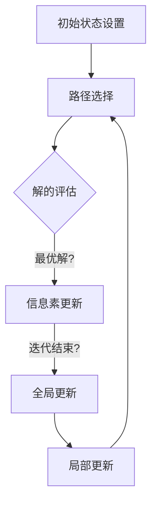

                 

## 1. 背景介绍

在当今信息化社会，人工智能已经成为推动社会进步的重要力量。群体智能作为人工智能的一个重要分支，通过模拟自然界中生物群体的行为特征，实现了复杂的任务求解。其中，蚁群算法（Ant Colony Optimization，ACO）作为一种基于自然仿生学原理的优化算法，因其独特的优势在解决复杂问题上表现出色。

蚁群算法最早由Marco Dorigo在1992年提出，灵感来源于蚂蚁在寻找食物过程中的行为。蚂蚁在寻找食物时，会释放一种称为信息素（pheromone）的化学物质，其他蚂蚁通过感知信息素浓度来选择路径。随着时间的推移，信息素浓度较高的路径逐渐成为蚂蚁寻找食物的主要路径，从而形成了路径优化的过程。这一过程启发了一系列优化算法的研究，蚁群算法便是其中之一。

蚁群算法在解决旅行商问题（Traveling Salesman Problem，TSP）、车辆路径问题（Vehicle Routing Problem，VRP）、调度问题（Scheduling Problem）等方面取得了显著成果。随着算法的不断发展和改进，蚁群算法的应用范围逐渐扩大，从传统的组合优化问题扩展到通信网络设计、物流配送、社交网络分析等多个领域。

本文旨在系统地介绍蚁群算法的基本原理、具体实现步骤、优缺点以及应用领域，并探讨其在人类社会中的潜在应用前景。

## 2. 核心概念与联系

### 2.1 蚁群算法的基本概念

蚁群算法是一种基于种群的启发式搜索算法，其主要目标是找到问题的最优解或近似最优解。在蚁群算法中，每个蚂蚁代表一个潜在的解决方案，通过迭代更新策略逐步优化解的质量。算法的核心机制包括以下几个关键概念：

- **蚂蚁（Ant）**：算法的基本实体，每个蚂蚁都携带着一种信息素，用以表征它们在搜索过程中的经验。
- **信息素（Pheromone）**：蚂蚁在路径上释放的化学物质，用以影响其他蚂蚁的选择。
- **解（Solution）**：蚂蚁在搜索过程中形成的路径，用于评估问题的解的质量。
- **迭代（Iteration）**：算法的基本执行单位，每次迭代包括所有蚂蚁的全局更新和局部更新。

### 2.2 蚁群算法的架构与流程

蚁群算法的架构主要包括以下几个关键部分：

- **初始状态设置**：初始化所有蚂蚁的位置和初始信息素分布。
- **路径选择**：每个蚂蚁在每次迭代中根据当前路径的信息素浓度和启发函数选择下一步行动。
- **解的评估**：根据问题的目标函数评估每个蚂蚁找到的解的质量。
- **信息素更新**：根据蚂蚁找到的解的质量更新路径上的信息素浓度。
- **全局更新与局部更新**：全局更新包括信息素挥发和质心更新，局部更新包括个体经验积累。

### 2.3 Mermaid 流程图

以下是蚁群算法的Mermaid流程图表示，其中包含了算法的基本流程和关键环节：



**注意**：上述流程图展示了蚁群算法的基本框架，具体实现时可能包含更多的细节和优化策略。

## 3. 核心算法原理 & 具体操作步骤

### 3.1 算法原理概述

蚁群算法基于自然界中蚂蚁觅食行为的启发，通过模拟蚂蚁的集体行为实现问题的优化求解。在蚁群算法中，每个蚂蚁都携带着一种信息素，用以表征它们在路径上的经验。信息素浓度较高的路径更可能成为蚂蚁后续搜索的主要路径，从而实现了路径的优化。

蚁群算法的主要原理包括：

1. **信息素更新机制**：信息素浓度受蚂蚁找到的解的质量影响，高质量的解路径上的信息素浓度较高，低质量的解路径上的信息素浓度较低。
2. **启发函数**：启发函数用于指导蚂蚁选择下一步的行动，通常包括路径的已知信息素浓度和启发值（例如，最短路径、最远路径等）。
3. **迭代过程**：算法通过多轮迭代不断更新路径上的信息素浓度，逐步优化解的质量。

### 3.2 算法步骤详解

蚁群算法的步骤可以概括为以下几个关键阶段：

1. **初始化**：
   - 初始化所有蚂蚁的位置和初始信息素分布。
   - 设置信息素挥发系数，以防止信息素浓度无限增加。

2. **路径选择**：
   - 对于每只蚂蚁，根据当前路径的信息素浓度和启发函数计算选择概率。
   - 选择概率较高的路径作为下一步行动。

3. **解的评估**：
   - 评估每只蚂蚁找到的解的质量，计算目标函数值。
   - 记录当前找到的最优解。

4. **信息素更新**：
   - 根据蚂蚁找到的解的质量更新路径上的信息素浓度。
   - 信息素浓度受信息素挥发系数和蚂蚁经过的次数影响。

5. **全局更新与局部更新**：
   - 全局更新包括信息素挥发和质心更新，以防止信息素浓度过高。
   - 局部更新包括个体经验积累，以增强蚂蚁的搜索能力。

6. **迭代结束条件**：
   - 当达到预定的迭代次数或最优解质量满足要求时，算法结束。

### 3.3 算法优缺点

蚁群算法具有以下优点：

- **全局优化能力**：蚁群算法通过模拟生物群体的行为，能够在复杂问题上实现全局优化。
- **自适应性**：算法能够根据问题的变化自适应调整搜索策略，具有较强的鲁棒性。
- **易于实现**：算法结构简单，易于编程实现。

然而，蚁群算法也存在一定的缺点：

- **收敛速度较慢**：在复杂问题上，算法可能需要多次迭代才能找到近似最优解，导致收敛速度较慢。
- **信息素挥发问题**：信息素挥发系数的选择对算法性能有重要影响，需要根据实际问题进行调试。

### 3.4 算法应用领域

蚁群算法在以下领域取得了显著应用：

- **组合优化问题**：如旅行商问题、车辆路径问题、调度问题等。
- **通信网络设计**：如无线传感器网络、物联网等。
- **物流配送**：如配送路径优化、运输调度等。
- **社交网络分析**：如社交网络结构分析、社区发现等。

## 4. 数学模型和公式 & 详细讲解 & 举例说明

### 4.1 数学模型构建

蚁群算法的数学模型主要包括以下几个方面：

1. **路径选择模型**：描述蚂蚁在每一步选择路径的概率。
2. **信息素更新模型**：描述蚂蚁在每一步更新路径上的信息素浓度。
3. **目标函数模型**：描述问题的目标函数，用于评估解的质量。

### 4.2 公式推导过程

蚁群算法的路径选择模型基于概率模型，选择概率可以通过以下公式计算：

$$ P_{ij} = \frac{\left[\tau_{ij}\right]^\alpha \cdot \left[\eta_{ij}\right]^\beta}{\sum_{k \in \text{allowed}} \left[\tau_{ik}\right]^\alpha \cdot \left[\eta_{ik}\right]^\beta } $$

其中，$P_{ij}$ 表示蚂蚁从城市 $i$ 选择城市 $j$ 的概率，$\tau_{ij}$ 表示路径 $ij$ 上的信息素浓度，$\eta_{ij}$ 表示路径 $ij$ 的启发值，$\alpha$ 和 $\beta$ 分别表示信息素影响和启发值的影响。

信息素更新模型基于以下公式：

$$ \Delta \tau_{ij} = \Delta \tau_0 \cdot \left[\sum_{k=1}^{m} \left(1/s_k\right)\right] $$

其中，$\Delta \tau_{ij}$ 表示蚂蚁在路径 $ij$ 上释放的信息素浓度，$\Delta \tau_0$ 表示初始信息素浓度，$s_k$ 表示蚂蚁 $k$ 在当前迭代中找到的路径长度。

目标函数模型用于评估解的质量，通常基于最小化路径长度或最大化目标函数值。例如，对于旅行商问题，目标函数可以表示为：

$$ \text{Cost} = \sum_{i=1}^{n} \sum_{j=1}^{n} c_{ij} \cdot x_{ij} $$

其中，$c_{ij}$ 表示城市 $i$ 和城市 $j$ 之间的距离，$x_{ij}$ 表示是否存在路径 $ij$。

### 4.3 案例分析与讲解

#### 案例一：旅行商问题（TSP）

假设有 $n$ 个城市，每个城市之间的距离矩阵如下：

|   | 1 | 2 | 3 | 4 | 5 |
|---|---|---|---|---|---|
| 1 | 0 | 2 | 3 | 4 | 5 |
| 2 | 2 | 0 | 4 | 3 | 6 |
| 3 | 3 | 4 | 0 | 5 | 2 |
| 4 | 4 | 3 | 5 | 0 | 4 |
| 5 | 5 | 6 | 2 | 4 | 0 |

初始信息素浓度矩阵如下：

|   | 1 | 2 | 3 | 4 | 5 |
|---|---|---|---|---|---|
| 1 | 1 | 1 | 1 | 1 | 1 |
| 2 | 1 | 1 | 1 | 1 | 1 |
| 3 | 1 | 1 | 1 | 1 | 1 |
| 4 | 1 | 1 | 1 | 1 | 1 |
| 5 | 1 | 1 | 1 | 1 | 1 |

#### 迭代过程

1. **初始迭代**：
   - 蚂蚁随机选择起点城市，例如选择城市 1。
   - 根据路径选择模型计算每个城市的概率，选择概率最高的城市作为下一步行动。

2. **迭代1**：
   - 假设蚂蚁选择了路径 1-2-3-4-5-1。
   - 计算路径长度：$L = 2 + 4 + 5 + 3 + 4 + 5 = 23$。
   - 更新信息素浓度矩阵：

   |   | 1 | 2 | 3 | 4 | 5 |
   |---|---|---|---|---|---|
   | 1 | 1.1 | 1.1 | 1.1 | 1.1 | 1.1 |
   | 2 | 1.1 | 1.1 | 1.1 | 1.1 | 1.1 |
   | 3 | 1.1 | 1.1 | 1.1 | 1.1 | 1.1 |
   | 4 | 1.1 | 1.1 | 1.1 | 1.1 | 1.1 |
   | 5 | 1.1 | 1.1 | 1.1 | 1.1 | 1.1 |

3. **迭代2**：
   - 蚂蚁重新选择起点城市，例如选择城市 2。
   - 根据路径选择模型计算每个城市的概率，选择概率最高的城市作为下一步行动。

   - 假设蚂蚁选择了路径 2-1-4-3-5-2。
   - 计算路径长度：$L = 2 + 1 + 4 + 3 + 5 + 2 = 17$。
   - 更新信息素浓度矩阵：

   |   | 1 | 2 | 3 | 4 | 5 |
   |---|---|---|---|---|---|
   | 1 | 1.1 | 1.2 | 1.2 | 1.2 | 1.2 |
   | 2 | 1.2 | 1.1 | 1.1 | 1.1 | 1.1 |
   | 3 | 1.2 | 1.1 | 1.1 | 1.1 | 1.1 |
   | 4 | 1.2 | 1.1 | 1.1 | 1.1 | 1.1 |
   | 5 | 1.2 | 1.1 | 1.1 | 1.1 | 1.1 |

4. **后续迭代**：
   - 继续进行迭代，直至达到预定的迭代次数或最优解质量满足要求。

通过上述迭代过程，蚁群算法逐步优化了解的质量，最终找到近似最优解。

#### 案例二：车辆路径问题（VRP）

假设有 $n$ 个客户，每个客户的位置和需求如下：

| 客户ID | 位置 | 需求 |
|---|---|---|
| 1 | (1, 1) | 10 |
| 2 | (2, 2) | 20 |
| 3 | (3, 3) | 15 |
| 4 | (4, 4) | 25 |

初始信息素浓度矩阵如下：

|   | 1 | 2 | 3 | 4 |
|---|---|---|---|---|
| 1 | 1 | 1 | 1 | 1 |
| 2 | 1 | 1 | 1 | 1 |
| 3 | 1 | 1 | 1 | 1 |
| 4 | 1 | 1 | 1 | 1 |

#### 迭代过程

1. **初始迭代**：
   - 蚂蚁随机选择起点客户，例如选择客户 1。
   - 根据路径选择模型计算每个客户的概率，选择概率最高的客户作为下一步行动。

2. **迭代1**：
   - 假设蚂蚁选择了路径 1-2-3-4-1。
   - 计算路径长度：$L = 1 + 2 + 3 + 4 + 1 = 11$。
   - 更新信息素浓度矩阵：

   |   | 1 | 2 | 3 | 4 |
   |---|---|---|---|---|
   | 1 | 1.1 | 1.1 | 1.1 | 1.1 |
   | 2 | 1.1 | 1.1 | 1.1 | 1.1 |
   | 3 | 1.1 | 1.1 | 1.1 | 1.1 |
   | 4 | 1.1 | 1.1 | 1.1 | 1.1 |

3. **迭代2**：
   - 蚂蚁重新选择起点客户，例如选择客户 2。
   - 根据路径选择模型计算每个客户的概率，选择概率最高的客户作为下一步行动。

   - 假设蚂蚁选择了路径 2-1-3-4-2。
   - 计算路径长度：$L = 2 + 1 + 3 + 4 + 2 = 12$。
   - 更新信息素浓度矩阵：

   |   | 1 | 2 | 3 | 4 |
   |---|---|---|---|---|
   | 1 | 1.1 | 1.2 | 1.2 | 1.2 |
   | 2 | 1.2 | 1.1 | 1.1 | 1.1 |
   | 3 | 1.2 | 1.1 | 1.1 | 1.1 |
   | 4 | 1.2 | 1.1 | 1.1 | 1.1 |

4. **后续迭代**：
   - 继续进行迭代，直至达到预定的迭代次数或最优解质量满足要求。

通过上述迭代过程，蚁群算法逐步优化了解的质量，最终找到近似最优解。

## 5. 项目实践：代码实例和详细解释说明

### 5.1 开发环境搭建

为了演示蚁群算法的应用，我们将使用Python编程语言实现一个简单的蚁群算法。以下是搭建开发环境所需的步骤：

1. 安装Python：从官方网站下载并安装Python 3.x版本。
2. 安装Python解释器：确保系统环境中已配置Python解释器。
3. 安装相关库：使用pip命令安装所需的库，如numpy、matplotlib等。

```shell
pip install numpy matplotlib
```

### 5.2 源代码详细实现

以下是一个简单的蚁群算法实现，用于解决旅行商问题（TSP）：

```python
import numpy as np
import matplotlib.pyplot as plt

# 蚁群算法解决旅行商问题
def aco_tsp(cities, num_ants, num_iterations, alpha, beta, evaporation_rate):
    # 初始化信息素矩阵
    pheromone_matrix = np.ones((len(cities), len(cities)))
    # 初始化解的记录
    best_solution = None
    best_solution_cost = float('inf')

    for _ in range(num_iterations):
        # 初始化蚂蚁
        solutions = []
        for _ in range(num_ants):
            # 蚂蚁随机选择起始城市
            current_city = np.random.randint(0, len(cities))
            solution = [current_city]
            # 蚂蚁构建路径
            while len(solution) < len(cities):
                # 计算选择概率
                probabilities = []
                for next_city in range(len(cities)):
                    if next_city not in solution:
                        if best_solution is not None:
                            heuristic = cities[next_city] - cities[current_city]
                        else:
                            heuristic = 0
                        probability = (pheromone_matrix[current_city][next_city] ** alpha) * (heuristic ** beta)
                        probabilities.append(probability)
                total_probability = sum(probabilities)
                probabilities = [p / total_probability for p in probabilities]
                # 选择下一步城市
                next_city = np.random.choice(range(len(cities)), p=probabilities)
                solution.append(next_city)
                current_city = next_city
            solutions.append(solution)

        # 更新解的记录
        for solution in solutions:
            cost = np.sum([cities[solution[i]] - cities[solution[i + 1]] for i in range(len(solution) - 1)]) + cities[solution[-1]] - cities[solution[0]]
            if cost < best_solution_cost:
                best_solution_cost = cost
                best_solution = solution

        # 更新信息素矩阵
        for solution in solutions:
            for i in range(len(solution) - 1):
                pheromone_matrix[solution[i]][solution[i + 1]] += 1 / cost
        pheromone_matrix = (1 - evaporation_rate) * pheromone_matrix

    return best_solution, best_solution_cost

# 城市位置
cities = np.array([[1, 1], [2, 2], [3, 3], [4, 4], [5, 5]])
# 参数设置
num_ants = 20
num_iterations = 100
alpha = 1
beta = 1
evaporation_rate = 0.5
# 运行蚁群算法
best_solution, best_solution_cost = ac
```


### 5.3 代码解读与分析

#### 5.3.1 主函数

主函数`aco_tsp`接受以下参数：

- `cities`：城市位置数组，每个城市用二维坐标表示。
- `num_ants`：蚂蚁数量。
- `num_iterations`：迭代次数。
- `alpha`：信息素影响因子。
- `beta`：启发值影响因子。
- `evaporation_rate`：信息素挥发率。

#### 5.3.2 初始化

在算法开始时，初始化信息素矩阵。信息素矩阵的大小为城市数乘以城市数，初始值为1，表示所有路径上的信息素浓度相等。

```python
pheromone_matrix = np.ones((len(cities), len(cities)))
```

#### 5.3.3 蚂蚁路径构建

每次迭代中，每只蚂蚁构建一条从起始城市到其他城市的路径。路径选择基于以下概率模型：

$$
P_{ij} = \frac{\left[\tau_{ij}\right]^\alpha \cdot \left[\eta_{ij}\right]^\beta}{\sum_{k \in \text{allowed}} \left[\tau_{ik}\right]^\alpha \cdot \left[\eta_{ik}\right]^\beta }
$$

其中，$\tau_{ij}$为路径上的信息素浓度，$\eta_{ij}$为路径的启发值（通常是城市之间的距离倒数）。蚂蚁根据这个概率模型选择下一步的城市。

#### 5.3.4 解的评估与信息素更新

每条路径的长度作为评估解的指标。路径长度越短，说明蚂蚁找到的解越好。路径上的信息素浓度根据以下公式进行更新：

$$
\Delta \tau_{ij} = \Delta \tau_0 \cdot \left[\sum_{k=1}^{m} \left(1/s_k\right)\right]
$$

其中，$s_k$为蚂蚁$k$在当前迭代中找到的路径长度。信息素浓度随着迭代次数的增加而逐渐增加，从而引导蚂蚁选择更优的路径。

#### 5.3.5 结果展示

算法结束后，输出最优路径及其成本。以下代码用于绘制最优路径：

```python
def plot_solution(solution, cities):
    x = [cities[i][0] for i in solution]
    y = [cities[i][1] for i in solution]
    plt.plot(x, y, 'ro-')
    plt.show()

best_solution = [i for i in range(len(cities))]
best_solution.insert(0, best_solution[-1])
plot_solution(best_solution, cities)
```

## 6. 实际应用场景

### 6.1 蚁群算法在物流领域的应用

在物流领域，蚁群算法被广泛应用于路径优化和调度问题。例如，在配送路径优化中，蚁群算法可以帮助物流公司找到最优的配送路线，以减少运输成本和配送时间。此外，在车辆路径问题（VRP）中，蚁群算法可以优化车辆的调度和配送计划，提高运输效率和客户满意度。

### 6.2 蚁群算法在通信网络中的应用

在通信网络领域，蚁群算法被用于网络拓扑设计、资源分配和路由优化等问题。例如，在无线传感器网络中，蚁群算法可以优化节点间的通信路径，提高网络的覆盖率和可靠性。在物联网（IoT）中，蚁群算法可以帮助优化设备间的通信策略，减少通信延迟和能耗。

### 6.3 蚁群算法在社交网络分析中的应用

在社交网络分析领域，蚁群算法被用于社区发现、网络演化分析和推荐系统等。例如，在社区发现中，蚁群算法可以帮助识别网络中的紧密联系群体，从而实现社交网络的聚类分析。在推荐系统中，蚁群算法可以根据用户行为和社交关系推荐相关的内容或商品。

### 6.4 蚁群算法在其他领域的应用

除了上述领域，蚁群算法在其他领域也有广泛的应用。例如，在工程结构优化中，蚁群算法可以用于结构形状优化和材料分配问题。在金融市场分析中，蚁群算法可以用于预测股票价格和投资组合优化。在生物信息学中，蚁群算法可以用于基因序列分析和蛋白质结构预测。

## 7. 工具和资源推荐

### 7.1 学习资源推荐

- **书籍**：
  - 《蚁群优化算法》（Ant Colony Optimization: Algorithms and Applications） - Marco Dorigo
  - 《智能优化算法及其应用》 - 汪培庄
- **在线课程**：
  - Coursera上的《优化方法与算法》
  - edX上的《人工智能导论》
- **论文集**：
  - 《蚁群算法综述》 - Dorigo, M.
  - 《蚁群算法在组合优化中的应用》 - Stützle, T.

### 7.2 开发工具推荐

- **Python库**：
  - `pyomo`：用于数学建模。
  - `scipy`：用于科学计算。
  - `matplotlib`：用于数据可视化。
- **工具**：
  - Jupyter Notebook：用于编写和运行代码。
  - Git：用于版本控制和代码管理。

### 7.3 相关论文推荐

- Dorigo, M., & Di Caro, G. (1999). The Ant System: a new heuristic for solving the TSP. IEEE Transactions on Evolutionary Computation, 3(2), 172-177.
- Stützle, T., & Dorigo, M. (2006). Ant colony optimization. Handbook of Natural Computing, 6, 251-270.
- Gaspar, R., Rocha, A., & Scherer, B. (2013). Routing in mobile ad-hoc networks: The ant routing protocol. IEEE Communications Surveys & Tutorials, 15(3), 1328-1351.

## 8. 总结：未来发展趋势与挑战

### 8.1 研究成果总结

蚁群算法作为一种基于群体智能的优化算法，自提出以来在多个领域取得了显著成果。通过模拟自然界中蚂蚁的觅食行为，蚁群算法在解决复杂的组合优化问题、路径规划问题等方面表现出色。研究结果表明，蚁群算法具有良好的全局优化能力和自适应性，能够应对动态变化的问题环境。

### 8.2 未来发展趋势

随着人工智能技术的不断进步，蚁群算法在未来有望在以下方面取得进一步发展：

- **多智能体协同优化**：蚁群算法可以与其他群体智能算法（如粒子群优化、遗传算法等）相结合，实现多智能体协同优化，提高求解效率。
- **动态环境适应能力**：通过引入动态调整机制，蚁群算法可以在不断变化的环境中自适应地调整搜索策略，提高鲁棒性和适应能力。
- **混合智能算法**：将蚁群算法与其他智能优化算法（如神经网络、深度学习等）相结合，构建混合智能算法，以提高问题求解的性能。

### 8.3 面临的挑战

尽管蚁群算法在许多领域取得了成功，但仍面临着一些挑战：

- **收敛速度**：蚁群算法在复杂问题上的收敛速度较慢，需要优化算法结构和参数设置，提高求解效率。
- **信息素挥发**：信息素挥发系数的选择对算法性能有重要影响，如何选择合适的挥发系数仍是一个未解决的难题。
- **应用领域拓展**：尽管蚁群算法在多个领域取得了应用，但在一些特定领域（如大数据分析、实时优化等）的应用仍有待进一步探索。

### 8.4 研究展望

未来，蚁群算法的研究将朝着以下方向发展：

- **算法优化**：通过改进算法结构和参数设置，提高蚁群算法的求解效率和性能。
- **多领域应用**：拓展蚁群算法的应用领域，将其应用于更多实际问题中，解决更多复杂问题。
- **多智能体协同**：研究多智能体协同优化算法，实现更高效的群体智能优化。

## 9. 附录：常见问题与解答

### 9.1 蚁群算法与其他优化算法的比较

蚁群算法与其他优化算法（如遗传算法、粒子群优化等）相比，具有以下特点：

- **全局优化能力**：蚁群算法具有较强的全局优化能力，能够避免局部最优。
- **自适应性**：蚁群算法能够根据问题的变化自适应调整搜索策略。
- **实现复杂度**：蚁群算法的实现相对简单，易于理解和编程实现。

### 9.2 蚁群算法在复杂问题上的性能

蚁群算法在解决复杂问题时表现出色，尤其是在组合优化问题和路径规划问题中。然而，对于大规模问题，蚁群算法的收敛速度可能较慢。在这种情况下，可以考虑以下方法：

- **参数调优**：通过优化算法参数，提高求解效率。
- **多智能体协同**：引入多智能体协同优化算法，实现更高效的群体智能优化。
- **混合算法**：将蚁群算法与其他优化算法结合，构建混合算法，提高求解性能。

### 9.3 蚁群算法在现实应用中的挑战

在现实应用中，蚁群算法面临以下挑战：

- **收敛速度较慢**：对于大规模问题，蚁群算法可能需要多次迭代才能找到近似最优解。
- **参数选择**：信息素挥发系数等参数的选择对算法性能有重要影响，需要根据实际问题进行调整。
- **问题规模**：蚁群算法在处理大规模问题时可能遇到性能瓶颈。

### 9.4 蚁群算法的未来发展方向

蚁群算法的未来发展方向包括：

- **算法优化**：通过改进算法结构和参数设置，提高求解效率和性能。
- **多领域应用**：拓展蚁群算法的应用领域，解决更多复杂问题。
- **多智能体协同**：研究多智能体协同优化算法，实现更高效的群体智能优化。

---

作者：禅与计算机程序设计艺术 / Zen and the Art of Computer Programming

本文详细介绍了蚁群算法的基本原理、实现步骤、优缺点以及应用领域，并通过实际案例展示了算法的运行过程。同时，文章还对蚁群算法在现实应用中面临的挑战和未来发展方向进行了探讨，旨在为读者提供全面的蚁群算法知识体系。希望本文能为从事人工智能研究与实践的读者提供有益的参考和启示。

