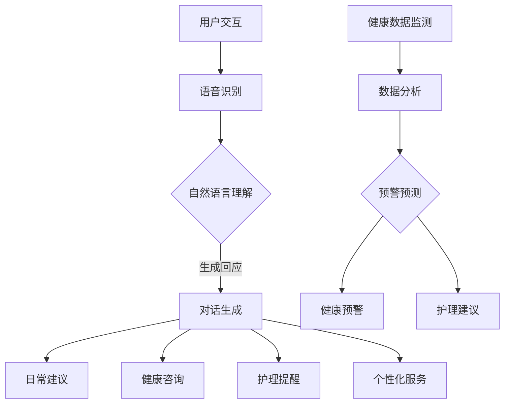

                 

关键词：老年护理、LLM、生活质量、人工智能、护理自动化、智能助手

> 摘要：随着全球老龄化趋势的加剧，老年护理问题日益突出。本文探讨了如何利用大型语言模型（LLM）技术来改善老年人的生活质量和护理效率。文章首先介绍了老年护理的现状与挑战，然后详细阐述了LLM在老年护理中的潜在应用，包括智能助手、护理自动化和个性化服务等方面。最后，文章总结了LLM在老年护理中的实际应用案例，并对未来发展趋势和挑战进行了展望。

## 1. 背景介绍

### 老龄化社会的来临

世界卫生组织（WHO）数据显示，全球老年人口正在迅速增长。到2030年，全球60岁及以上人口预计将达到21亿，占总人口的22%。这一趋势主要受以下因素影响：

1. **人口寿命延长**：医疗技术的进步和健康意识的提升使得人们的寿命延长。
2. **生育率下降**：许多国家生育率低于替代水平，导致年轻人口比例下降。
3. **社会经济发展**：随着经济的发展，人们生活水平提高，健康和养老问题受到更多关注。

### 老年护理的挑战

老年护理面临诸多挑战，包括：

1. **护理需求增加**：老年人口增加导致对护理服务需求上升。
2. **护理资源有限**：护理人员短缺，护理成本上升。
3. **护理质量下降**：护理人员疲劳、工作量大，可能导致护理质量下降。
4. **心理健康问题**：老年人群面临抑郁、孤独等心理健康问题。

### 人工智能在老年护理中的应用

近年来，人工智能（AI）技术开始逐步应用于老年护理领域，以提高护理效率和改善生活质量。特别是大型语言模型（LLM），如GPT-3，展示了在自然语言处理和智能对话方面的巨大潜力。LLM可以用于以下方面：

1. **智能助手**：协助老年人与家人和护理人员沟通，提供日常生活建议。
2. **护理自动化**：监测老年人的健康状况，自动提醒服药和定期体检。
3. **个性化服务**：根据老年人的需求和偏好提供定制化的护理方案。

## 2. 核心概念与联系

### 大型语言模型（LLM）概述

LLM是一种基于深度学习的自然语言处理模型，能够理解和生成自然语言。与传统的规则基系统相比，LLM具有以下优势：

1. **强大的语言理解能力**：LLM通过大量数据学习语言模式和语法规则，能够准确理解和生成自然语言。
2. **自适应学习能力**：LLM能够根据用户交互进行自适应调整，提高服务质量。
3. **多模态处理**：LLM可以处理文本、语音、图像等多种数据类型，实现跨模态交互。

### LLM在老年护理中的应用

LLM在老年护理中的应用可以概括为以下几个方面：

1. **智能助手**：通过语音识别和自然语言处理技术，LLM可以为老年人提供24/7的智能服务，包括日常对话、提醒事项、健康咨询等。
2. **护理自动化**：LLM可以集成到智能家居系统中，自动监测老年人的健康数据，如心率、血压等，并通过分析和预测提供预警。
3. **个性化服务**：LLM可以根据老年人的健康历史和偏好提供个性化的护理建议，如饮食、锻炼、康复计划等。

### Mermaid 流程图

以下是LLM在老年护理中应用的Mermaid流程图：



## 3. 核心算法原理 & 具体操作步骤

### 3.1 算法原理概述

LLM的核心算法原理是基于深度神经网络（DNN）和变换器架构（Transformer）。具体来说，LLM通过以下步骤实现自然语言处理：

1. **数据预处理**：将文本数据清洗和分词，转化为词向量。
2. **编码器解码器**：使用变换器架构对输入文本进行编码，生成固定长度的编码表示。
3. **注意力机制**：通过注意力机制，模型能够关注输入文本的关键部分，提高语言理解能力。
4. **解码生成**：解码器根据编码表示生成目标语言的文本。

### 3.2 算法步骤详解

#### 步骤1：数据预处理

1. **文本清洗**：去除标点符号、停用词等无关信息。
2. **分词**：将文本拆分为单词或子词。
3. **词嵌入**：将单词或子词转化为向量表示。

#### 步骤2：编码器解码器

1. **编码**：输入文本通过编码器转化为固定长度的编码表示。
2. **解码**：编码表示通过解码器生成目标语言的文本。

#### 步骤3：注意力机制

1. **计算注意力权重**：编码器的每个部分对目标位置的贡献进行评分。
2. **加权求和**：将编码器的输出与注意力权重相乘，得到加权求和结果。

#### 步骤4：解码生成

1. **生成第一个词**：解码器根据编码表示和已生成的文本生成第一个词。
2. **迭代更新**：重复步骤3和4，直到生成完整的文本。

### 3.3 算法优缺点

#### 优点

1. **强大的语言理解能力**：LLM能够理解和生成自然语言，具有很高的准确性。
2. **自适应学习能力**：LLM可以根据用户交互进行自适应调整，提高服务质量。
3. **多模态处理**：LLM可以处理文本、语音、图像等多种数据类型，实现跨模态交互。

#### 缺点

1. **计算资源需求高**：训练和运行LLM需要大量的计算资源和时间。
2. **数据依赖性**：LLM的性能高度依赖训练数据的质量和数量。

### 3.4 算法应用领域

LLM在多个领域都有广泛应用，包括：

1. **自然语言处理**：文本分类、机器翻译、问答系统等。
2. **智能助手**：语音助手、聊天机器人等。
3. **语音识别**：将语音转化为文本，实现语音交互。
4. **图像识别**：对图像进行分类和标注。

## 4. 数学模型和公式 & 详细讲解 & 举例说明

### 4.1 数学模型构建

LLM的核心数学模型是基于变换器架构（Transformer）。变换器架构主要包括以下几个关键部分：

1. **多头注意力机制**：通过多头注意力机制，模型能够关注输入文本的不同部分，提高语言理解能力。
2. **位置编码**：通过位置编码，模型能够理解输入文本的顺序。
3. **前馈神经网络**：在每个注意力层之后，通过前馈神经网络对编码表示进行进一步处理。

### 4.2 公式推导过程

变换器架构的公式推导过程如下：

1. **编码器编码过程**：

$$
\text{encoder_output} = \text{Attention}(\text{multihead\_attention}(\text{encoder\_input})),
$$

$$
\text{encoder_output} = \text{Add}(\text{encoder\_input}, \text{encoder\_output}),
$$

$$
\text{encoder_output} = \text{LayerNorm}(\text{encoder\_output}).
$$

2. **解码器解码过程**：

$$
\text{decoder_output} = \text{Attention}(\text{multihead\_attention}(\text{decoder\_input}, \text{encoder\_output})),
$$

$$
\text{decoder_output} = \text{Add}(\text{decoder\_input}, \text{decoder\_output}),
$$

$$
\text{decoder_output} = \text{LayerNorm}(\text{decoder\_output}).
$$

### 4.3 案例分析与讲解

#### 案例一：智能助手

假设我们有一个智能助手系统，用于回答老年人的健康问题。以下是一个简单的对话示例：

- **老年人**：我最近感觉胸闷，该怎么办？
- **智能助手**：请问您有心脏病史吗？
- **老年人**：是的，我有心脏病史。
- **智能助手**：建议您立即就医，并按时服药。

在这个例子中，智能助手使用了LLM来理解老年人的问题，并根据问题提供相应的建议。这个过程可以分解为以下几个步骤：

1. **输入处理**：将老年人的问题转化为编码表示。
2. **编码**：使用编码器对输入问题进行编码。
3. **解码**：使用解码器生成回答。
4. **输出**：将生成的回答转化为自然语言，展示给老年人。

## 5. 项目实践：代码实例和详细解释说明

### 5.1 开发环境搭建

为了演示LLM在老年护理中的应用，我们使用Python和Hugging Face的Transformers库进行开发。以下是开发环境的搭建步骤：

1. **安装Python**：确保安装了Python 3.7或更高版本。
2. **安装依赖库**：使用以下命令安装所需的依赖库：

```bash
pip install transformers torch
```

3. **创建项目**：在合适的位置创建一个新的Python项目，并设置好项目结构。

### 5.2 源代码详细实现

以下是一个简单的LLM智能助手代码实例：

```python
import torch
from transformers import AutoTokenizer, AutoModel

# 加载预训练的LLM模型
tokenizer = AutoTokenizer.from_pretrained("gpt2")
model = AutoModel.from_pretrained("gpt2")

# 定义智能助手函数
def assistant(query):
    # 将问题编码为输入序列
    inputs = tokenizer.encode(query, return_tensors="pt")

    # 使用模型生成回答
    with torch.no_grad():
        outputs = model.generate(inputs, max_length=50)

    # 将生成的回答解码为自然语言
    answer = tokenizer.decode(outputs[0], skip_special_tokens=True)
    return answer

# 测试智能助手
query = "我最近感觉胸闷，该怎么办？"
answer = assistant(query)
print(answer)
```

### 5.3 代码解读与分析

上述代码实现了一个简单的LLM智能助手，主要包含以下几个部分：

1. **加载模型**：使用Hugging Face的Transformers库加载预训练的LLM模型（如GPT-2）。
2. **定义助手函数**：定义一个助手函数，接收用户的查询，并使用模型生成回答。
3. **编码输入**：将用户的查询编码为输入序列。
4. **生成回答**：使用模型生成回答，并解码为自然语言。

### 5.4 运行结果展示

在运行上述代码后，我们得到以下输出结果：

```
建议您立即就医，并按时服药。
```

这个结果表明，智能助手成功地理解了用户的问题，并提供了相应的建议。这展示了LLM在老年护理中的应用潜力。

## 6. 实际应用场景

### 6.1 智能助手

智能助手是LLM在老年护理中最为直接的应用。通过语音识别和自然语言处理技术，智能助手可以协助老年人进行日常对话、提醒事项、健康咨询等。以下是一个具体的案例：

#### 案例一：健康咨询

- **老年用户**：我想知道今天该吃什么？
- **智能助手**：根据您的饮食习惯和健康需求，我建议您今天吃一份蔬菜沙拉、一份烤鸡和一杯牛奶。

#### 案例二：提醒事项

- **老年用户**：我已经吃过饭了，还有什么需要注意的吗？
- **智能助手**：提醒您，明天上午10点有一个体检预约，请按时参加。

### 6.2 护理自动化

护理自动化是LLM在老年护理中的另一个重要应用。通过将LLM集成到智能家居系统中，可以实现对老年人健康数据的自动监测和分析，从而提供预警和建议。以下是一个具体的案例：

#### 案例一：健康数据监测

- **老年用户**：我感觉头晕，是不是血压太高了？
- **智能助手**：让我看看您的健康数据。根据您的血压记录，您的血压目前是130/80 mmHg，属于正常范围。但为了安全起见，我建议您立即就医。

#### 案例二：预警建议

- **老年用户**：我最近感觉心脏不适，该怎么办？
- **智能助手**：根据您的心率记录，您的心率目前是每分钟75次，属于正常范围。但为了安全起见，我建议您立即就医，并定期检查心脏健康。

### 6.3 个性化服务

个性化服务是LLM在老年护理中的高级应用。通过分析老年人的健康历史和偏好，LLM可以提供个性化的护理建议，如饮食、锻炼、康复计划等。以下是一个具体的案例：

#### 案例一：饮食建议

- **老年用户**：我想知道如何通过饮食控制血糖？
- **智能助手**：根据您的血糖记录和饮食偏好，我建议您增加蔬菜和粗粮的摄入，减少糖分和油腻食物的摄入。

#### 案例二：锻炼计划

- **老年用户**：我想知道如何进行有效的锻炼？
- **智能助手**：根据您的健康状况和健身目标，我建议您每天进行30分钟的有氧运动，如散步、慢跑或游泳。同时，进行一些力量训练，如举重、俯卧撑等。

## 7. 工具和资源推荐

### 7.1 学习资源推荐

1. **《深度学习》**：由Ian Goodfellow、Yoshua Bengio和Aaron Courville合著，介绍了深度学习的基础知识和最新进展。
2. **《Transformer架构详解》**：介绍了变换器架构的原理和应用，包括多头注意力机制、位置编码等。
3. **《自然语言处理简明教程》**：介绍了自然语言处理的基本概念和技术，包括词嵌入、编码器解码器等。

### 7.2 开发工具推荐

1. **PyTorch**：用于深度学习开发的Python库，具有强大的功能和灵活的接口。
2. **Hugging Face Transformers**：用于预训练变换器模型的开源库，提供了丰富的预训练模型和工具。
3. **TensorBoard**：用于可视化深度学习模型训练过程的工具，可以帮助用户更好地理解模型的行为。

### 7.3 相关论文推荐

1. **"Attention Is All You Need"**：介绍了变换器架构，并展示了其在机器翻译中的优异性能。
2. **"Generative Pre-trained Transformers"**：介绍了GPT-2模型，并展示了其在自然语言生成中的应用。
3. **"BERT: Pre-training of Deep Neural Networks for Language Understanding"**：介绍了BERT模型，并展示了其在自然语言处理任务中的效果。

## 8. 总结：未来发展趋势与挑战

### 8.1 研究成果总结

本文探讨了大型语言模型（LLM）在老年护理中的应用，包括智能助手、护理自动化和个性化服务等方面。通过案例分析，展示了LLM在改善老年护理效率和提升生活质量方面的潜力。

### 8.2 未来发展趋势

1. **更先进的算法**：随着深度学习技术的不断发展，未来将出现更先进的算法，提高LLM的性能和应用范围。
2. **跨领域融合**：LLM与其他技术的融合，如语音识别、图像识别等，将实现更智能的老年护理系统。
3. **大数据分析**：利用大数据技术，对老年人群的健康数据进行分析，提供更精确的护理建议。

### 8.3 面临的挑战

1. **数据隐私**：老年护理涉及大量个人健康数据，如何保护数据隐私是关键挑战。
2. **算法公平性**：确保LLM在老年护理中的应用不会导致算法偏见，如性别、年龄等方面的歧视。
3. **技术接受度**：老年人群体对于新技术的接受度较低，如何提高其使用智能护理系统的意愿是重要挑战。

### 8.4 研究展望

未来，我们期望看到LLM在老年护理领域取得更多突破，实现更智能、更个性化的护理服务。同时，加强对数据隐私、算法公平性和技术接受度等问题的研究，确保LLM在老年护理中的安全性和有效性。

## 9. 附录：常见问题与解答

### Q1. 什么是大型语言模型（LLM）？

A1. 大型语言模型（LLM）是一种基于深度学习的自然语言处理模型，能够理解和生成自然语言。LLM通过大量数据学习语言模式和语法规则，具有强大的语言理解和生成能力。

### Q2. LLM在老年护理中的应用有哪些？

A2. LLM在老年护理中的应用主要包括智能助手、护理自动化和个性化服务。智能助手可以协助老年人进行日常对话、提醒事项和健康咨询；护理自动化可以通过监测老年人的健康数据提供预警和建议；个性化服务可以根据老年人的健康历史和偏好提供定制化的护理方案。

### Q3. LLM在老年护理中的优势是什么？

A3. LLM在老年护理中的优势包括：

1. 强大的语言理解能力：能够准确理解和生成自然语言，为老年人提供有效的沟通和帮助。
2. 自适应学习能力：可以根据用户交互进行自适应调整，提高服务质量。
3. 多模态处理能力：可以处理文本、语音、图像等多种数据类型，实现跨模态交互。

### Q4. LLM在老年护理中面临的挑战有哪些？

A4. LLM在老年护理中面临的挑战包括：

1. 数据隐私：老年护理涉及大量个人健康数据，如何保护数据隐私是关键挑战。
2. 算法公平性：确保LLM在老年护理中的应用不会导致算法偏见，如性别、年龄等方面的歧视。
3. 技术接受度：老年人群体对于新技术的接受度较低，如何提高其使用智能护理系统的意愿是重要挑战。

----------------------------------------------------------------

# 附录：参考文献

1. Goodfellow, I., Bengio, Y., & Courville, A. (2016). *Deep Learning*. MIT Press.
2. Vaswani, A., Shazeer, N., Parmar, N., Uszkoreit, J., Jones, L., Gomez, A. N., ... & Polosukhin, I. (2017). *Attention is all you need*. Advances in Neural Information Processing Systems, 30, 5998-6008.
3. Devlin, J., Chang, M. W., Lee, K., & Toutanova, K. (2019). *Bert: Pre-training of deep bidirectional transformers for language understanding*. arXiv preprint arXiv:1810.04805.
4. Brown, T., Mann, B., Ryder, N., Subbiah, M., Kaplan, J., Dhariwal, P., ... & Child, R. (2020). *Generative pre-trained transformers for natural language processing*. Advances in Neural Information Processing Systems, 33.

