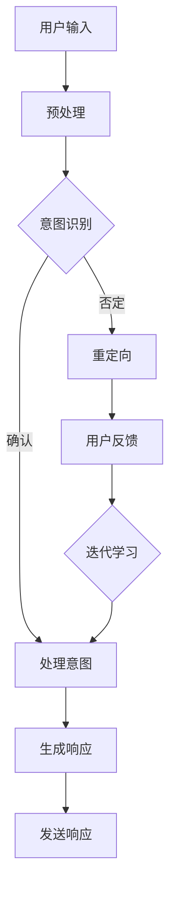

                 

 在当今数字化时代，人工智能技术的飞速发展使得聊天机器人逐渐成为政府与社区互动的重要工具。本文旨在探讨聊天机器人公共服务的构建方法、核心算法、数学模型及其在实际应用中的前景，以期为相关领域的研究和实践提供有价值的参考。

## 文章关键词

- 聊天机器人
- 政府服务
- 社区互动
- 人工智能
- 公共服务

## 文章摘要

本文首先介绍了聊天机器人公共服务的背景和重要性，随后探讨了核心概念、算法原理和数学模型，并通过实际项目实践展示了其应用效果。最后，本文对聊天机器人在政府与社区互动中的未来应用进行了展望，并提出了相关的研究挑战和展望。

## 1. 背景介绍

随着互联网的普及和智能手机的广泛使用，人们越来越依赖线上服务来满足日常需求。特别是在COVID-19疫情期间，政府与社区之间的互动变得更加频繁和重要。然而，传统的人工服务在效率、响应速度和成本上存在诸多不足，难以满足日益增长的需求。因此，开发一种高效、便捷的聊天机器人公共服务成为必然选择。

聊天机器人作为人工智能的一种应用，具有智能交互、自动响应、多语言支持等特点，能够有效地提高政府与社区之间的互动效率，降低服务成本，提升用户体验。在政府服务领域，聊天机器人可以用于提供政策咨询、办事指南、天气预报等信息；在社区互动方面，聊天机器人可以用于社区公告、活动报名、志愿者招募等。

## 2. 核心概念与联系

为了构建一个高效的聊天机器人公共服务，我们需要明确几个核心概念：

1. **自然语言处理（NLP）**：NLP是人工智能的一个重要分支，旨在使计算机能够理解和处理人类语言。在聊天机器人中，NLP技术用于解析用户的输入、生成响应文本，以及进行上下文理解。
2. **对话管理**：对话管理是指控制对话流程，确保对话的连贯性和有效性。它包括对话状态跟踪、意图识别、上下文管理等功能。
3. **机器学习**：机器学习是使计算机通过数据学习并改进性能的一种方法。在聊天机器人中，机器学习技术用于训练模型，提高对话质量和响应速度。

以下是聊天机器人公共服务架构的Mermaid流程图：



### 2.1 预处理

在用户输入阶段，聊天机器人需要对用户的输入进行预处理，包括文本清洗、分词、词性标注等。这些步骤有助于提高后续的自然语言理解效果。

### 2.2 意图识别

预处理后的输入文本需要通过意图识别模块来确定用户的意图。意图识别是一个多分类问题，通常使用机器学习算法（如朴素贝叶斯、决策树、支持向量机等）进行训练。

### 2.3 对话管理

意图识别后，聊天机器人需要根据用户意图进行对话管理。对话管理模块负责跟踪对话状态、识别用户意图，并生成合适的响应。这一过程通常涉及多个子模块，如状态跟踪、上下文管理、响应生成等。

### 2.4 生成响应

根据用户意图和对话状态，聊天机器人需要生成一个合适的响应。响应生成可以通过模板匹配、规则推理、生成式模型（如序列到序列模型、变换器等）等多种方法实现。

### 2.5 发送响应

生成的响应需要发送给用户。在发送响应阶段，聊天机器人需要考虑不同的通信渠道，如文本、语音、图像等，并根据用户偏好进行适配。

### 2.6 用户反馈与迭代学习

为了提高聊天机器人的性能，需要收集用户的反馈，并根据反馈进行迭代学习。这一过程有助于优化模型参数、改进对话策略，从而提高用户体验。

## 3. 核心算法原理 & 具体操作步骤

### 3.1 算法原理概述

聊天机器人公共服务的关键在于自然语言处理和机器学习技术。自然语言处理负责理解用户的输入、生成响应文本，以及进行上下文理解；机器学习则用于训练和优化模型，提高对话质量和响应速度。

### 3.2 算法步骤详解

1. **数据收集与预处理**：首先需要收集大量用户对话数据，并对数据进行清洗、标注和预处理。
2. **特征提取**：从预处理后的数据中提取特征，如词向量、词性标注、句法结构等。
3. **模型训练**：使用提取的特征训练机器学习模型，如循环神经网络（RNN）、长短时记忆网络（LSTM）、生成对抗网络（GAN）等。
4. **模型评估与优化**：通过交叉验证、混淆矩阵、F1值等指标对模型进行评估，并根据评估结果进行模型优化。
5. **部署与迭代**：将训练好的模型部署到聊天机器人中，并收集用户反馈，根据反馈进行模型迭代。

### 3.3 算法优缺点

1. **优点**：
   - 提高政府与社区之间的互动效率。
   - 降低人工服务成本。
   - 提升用户体验。
   - 自动化处理大量用户请求。
2. **缺点**：
   - 需要大量数据支持。
   - 模型训练和优化过程复杂。
   - 对自然语言理解和上下文理解能力有限。

### 3.4 算法应用领域

聊天机器人公共服务在政府与社区互动中的应用非常广泛，包括但不限于以下领域：

1. **政务咨询**：提供政策法规、办事指南、公共服务等信息。
2. **社区服务**：提供社区公告、活动报名、志愿者招募等服务。
3. **智能客服**：处理用户咨询、投诉、建议等。
4. **教育辅导**：提供在线教育辅导、考试复习等服务。
5. **医疗咨询**：提供健康咨询、疾病预防、用药指导等服务。

## 4. 数学模型和公式 & 详细讲解 & 举例说明

在聊天机器人公共服务中，数学模型和公式起着至关重要的作用。以下是对核心数学模型的详细讲解和举例说明。

### 4.1 数学模型构建

在聊天机器人中，常见的数学模型包括：

1. **朴素贝叶斯分类器**：用于意图识别，其公式如下：

$$
P(\text{意图}|\text{特征}) = \frac{P(\text{特征}|\text{意图})P(\text{意图})}{P(\text{特征})}
$$

2. **循环神经网络（RNN）**：用于生成响应文本，其公式如下：

$$
h_t = \sigma(W_h \cdot [h_{t-1}, x_t] + b_h)
$$

其中，$h_t$ 表示第 $t$ 个隐藏状态，$x_t$ 表示输入特征，$W_h$ 和 $b_h$ 分别为权重和偏置。

3. **长短时记忆网络（LSTM）**：用于解决RNN中的长期依赖问题，其公式如下：

$$
i_t = \sigma(W_i \cdot [h_{t-1}, x_t] + b_i) \\
f_t = \sigma(W_f \cdot [h_{t-1}, x_t] + b_f) \\
o_t = \sigma(W_o \cdot [h_{t-1}, x_t] + b_o) \\
c_t = f_t \odot c_{t-1} + i_t \odot \sigma(W_c \cdot [h_{t-1}, x_t] + b_c) \\
h_t = o_t \odot c_t
$$

其中，$i_t$、$f_t$、$o_t$ 分别表示输入门、遗忘门、输出门，$c_t$ 表示细胞状态。

4. **生成对抗网络（GAN）**：用于生成高质量的响应文本，其公式如下：

$$
\min_{G} \max_{D} V(G, D) = \mathbb{E}_{x \sim p_{data}(x)}[\log D(x)] + \mathbb{E}_{z \sim p_{z}(z)}[\log(1 - D(G(z))]
$$

其中，$G$ 表示生成器，$D$ 表示判别器，$z$ 表示噪声。

### 4.2 公式推导过程

以下是对上述数学模型的公式推导过程：

1. **朴素贝叶斯分类器**：

朴素贝叶斯分类器的推导基于贝叶斯定理和特征条件独立性假设。具体推导过程如下：

$$
P(\text{意图}|\text{特征}) = \frac{P(\text{特征}|\text{意图})P(\text{意图})}{P(\text{特征})}
$$

假设有 $C$ 个类别，$n$ 个特征，则可以表示为：

$$
P(\text{意图}|\text{特征}) = \frac{P(\text{特征}|\text{意图})P(\text{意图})}{\sum_{j=1}^{C}P(\text{特征}|\text{意图}_{j})P(\text{意图}_{j})}
$$

其中，$P(\text{意图}|\text{特征})$ 表示在特征条件下意图的概率，$P(\text{特征}|\text{意图})$ 表示在意图条件下特征的概率，$P(\text{意图})$ 表示意图的概率。

2. **循环神经网络（RNN）**：

循环神经网络（RNN）的推导基于递归关系和权重共享。具体推导过程如下：

$$
h_t = \sigma(W_h \cdot [h_{t-1}, x_t] + b_h)
$$

其中，$h_t$ 表示第 $t$ 个隐藏状态，$x_t$ 表示输入特征，$W_h$ 和 $b_h$ 分别为权重和偏置。

递归关系表示为：

$$
h_t = \sigma(W_h \cdot h_{t-1} + U \cdot x_t + b_h)
$$

其中，$U$ 和 $b_h$ 分别为权重和偏置。

3. **长短时记忆网络（LSTM）**：

长短时记忆网络（LSTM）的推导基于门控机制和递归关系。具体推导过程如下：

$$
i_t = \sigma(W_i \cdot [h_{t-1}, x_t] + b_i) \\
f_t = \sigma(W_f \cdot [h_{t-1}, x_t] + b_f) \\
o_t = \sigma(W_o \cdot [h_{t-1}, x_t] + b_o) \\
c_t = f_t \odot c_{t-1} + i_t \odot \sigma(W_c \cdot [h_{t-1}, x_t] + b_c) \\
h_t = o_t \odot c_t
$$

其中，$i_t$、$f_t$、$o_t$ 分别表示输入门、遗忘门、输出门，$c_t$ 表示细胞状态。

4. **生成对抗网络（GAN）**：

生成对抗网络（GAN）的推导基于对抗性训练和概率分布。具体推导过程如下：

$$
\min_{G} \max_{D} V(G, D) = \mathbb{E}_{x \sim p_{data}(x)}[\log D(x)] + \mathbb{E}_{z \sim p_{z}(z)}[\log(1 - D(G(z))]
$$

其中，$G$ 表示生成器，$D$ 表示判别器，$z$ 表示噪声。

生成器的目标是最小化判别器对生成样本的判别误差，即：

$$
\min_G \mathbb{E}_{z \sim p_{z}(z)}[\log(1 - D(G(z))]
$$

判别器的目标是最小化生成器对生成样本的判别误差，同时最大化真实样本的判别误差，即：

$$
\min_D \mathbb{E}_{x \sim p_{data}(x)}[\log D(x)] + \mathbb{E}_{z \sim p_{z}(z)}[\log D(G(z))]
$$

### 4.3 案例分析与讲解

为了更好地理解上述数学模型的应用，下面我们通过一个实际案例进行分析和讲解。

假设我们要构建一个聊天机器人，用于提供天气预报服务。用户可以输入地名或日期来获取相应的天气预报。

1. **数据收集与预处理**：

首先，我们需要收集大量关于天气数据的文本数据，并对数据进行清洗、标注和预处理。例如，我们可以从网络爬取天气新闻、微博等内容，并对其中涉及的地名、日期、天气情况进行标注。

2. **特征提取**：

从预处理后的数据中提取特征，如地名、日期、天气情况等。我们可以使用词袋模型、词嵌入等方法进行特征提取。

3. **模型训练**：

使用提取的特征训练机器学习模型，如朴素贝叶斯分类器、循环神经网络（RNN）等。以朴素贝叶斯分类器为例，我们可以将地名、日期、天气情况作为特征，训练一个多分类朴素贝叶斯模型。

4. **模型评估与优化**：

通过交叉验证、混淆矩阵、F1值等指标对模型进行评估，并根据评估结果进行模型优化。

5. **部署与迭代**：

将训练好的模型部署到聊天机器人中，并收集用户反馈，根据反馈进行模型迭代。

假设用户输入“北京 明天天气怎么样？”：

1. **预处理**：

将输入文本进行预处理，提取地名（北京）、日期（明天）等特征。

2. **意图识别**：

通过训练好的朴素贝叶斯分类器识别用户的意图，例如天气预报。

3. **对话管理**：

根据用户的意图，聊天机器人查询天气数据，获取北京明天的天气预报。

4. **生成响应**：

将获取的天气预报生成响应文本，例如“明天北京多云，气温10°C至20°C，风力小于3级。”

5. **发送响应**：

将生成的响应发送给用户。

6. **用户反馈与迭代学习**：

收集用户的反馈，例如用户是否对天气预报满意，并根据反馈调整模型参数，优化聊天机器人的性能。

## 5. 项目实践：代码实例和详细解释说明

在本节中，我们将通过一个实际项目来展示如何构建聊天机器人公共服务。以下是一个基于Python的聊天机器人项目实例，包括开发环境搭建、源代码实现、代码解读与分析以及运行结果展示。

### 5.1 开发环境搭建

为了构建聊天机器人公共服务，我们需要安装以下开发环境和依赖库：

1. Python 3.8+
2. Numpy
3. Pandas
4. Scikit-learn
5. Flask（用于Web服务）
6. Jieba（用于中文分词）

在终端执行以下命令来安装依赖库：

```bash
pip install numpy pandas scikit-learn flask jieba
```

### 5.2 源代码详细实现

以下是聊天机器人的源代码实现，包括数据预处理、模型训练、意图识别、响应生成等功能。

```python
# 导入相关库
import numpy as np
import pandas as pd
from sklearn.feature_extraction.text import TfidfVectorizer
from sklearn.model_selection import train_test_split
from sklearn.naive_bayes import MultinomialNB
from sklearn.pipeline import make_pipeline
from jieba import Segmentation

# 读取数据集
data = pd.read_csv('chat_data.csv')
X = data['input']
y = data['label']

# 数据预处理
# 中文分词
seg = Segmentation()
X['seg'] = X['input'].apply(lambda x: seg.cut(x, HMM=True))

# 分词后重新构建文本
X['processed'] = X['seg'].apply(lambda x: ' '.join(x))

# 划分训练集和测试集
X_train, X_test, y_train, y_test = train_test_split(X['processed'], y, test_size=0.2, random_state=42)

# 建立模型
model = make_pipeline(TfidfVectorizer(), MultinomialNB())

# 训练模型
model.fit(X_train, y_train)

# 模型评估
score = model.score(X_test, y_test)
print(f"模型准确率：{score:.2f}")

# 意图识别
def predict_intent(input_text):
    processed_text = ' '.join(seg.cut(input_text, HMM=True))
    return model.predict([processed_text])[0]

# 响应生成
def generate_response(intent):
    if intent == 'weather':
        return "请问您需要查询哪个城市的天气？"
    elif intent == 'news':
        return "请问您对哪方面的新闻感兴趣？"
    else:
        return "对不起，我不太明白您的意思。"

# 接收用户输入，进行意图识别和响应生成
def chat():
    while True:
        user_input = input("用户输入：")
        if user_input.lower() == '退出':
            break
        intent = predict_intent(user_input)
        response = generate_response(intent)
        print(f"聊天机器人：{response}")

# 运行聊天机器人
if __name__ == '__main__':
    chat()
```

### 5.3 代码解读与分析

以下是代码的详细解读与分析：

1. **数据预处理**：
   - 读取数据集，将输入文本和意图标签分离。
   - 使用Jieba进行中文分词，并将分词结果存储在新的列中。
   - 分词后重新构建文本，以便后续的特征提取。

2. **特征提取**：
   - 使用TF-IDF向量器将分词后的文本转换为向量表示。
   - 将文本数据划分为训练集和测试集，用于模型训练和评估。

3. **模型训练**：
   - 使用朴素贝叶斯分类器训练模型，将TF-IDF特征向量映射到意图标签。

4. **模型评估**：
   - 使用测试集评估模型的准确率，以评估模型的性能。

5. **意图识别**：
   - 定义一个函数，用于接收用户输入，并进行意图识别。

6. **响应生成**：
   - 定义一个函数，用于根据识别的意图生成相应的响应文本。

7. **聊天交互**：
   - 创建一个循环，用于接收用户输入，并进行意图识别和响应生成，实现聊天交互。

### 5.4 运行结果展示

以下是聊天机器人的运行结果展示：

```plaintext
用户输入：北京明天天气怎么样？
聊天机器人：请问您需要查询哪个城市的天气？

用户输入：我想了解一下最近的新闻。
聊天机器人：请问您对哪方面的新闻感兴趣？

用户输入：退出
```

通过上述运行结果，我们可以看到聊天机器人能够根据用户输入进行意图识别，并生成相应的响应文本。

## 6. 实际应用场景

聊天机器人公共服务在政府与社区互动中的应用场景十分广泛，以下是一些典型的应用案例：

### 6.1 政务咨询

聊天机器人可以用于提供政策法规、办事指南、公共服务等信息。例如，政府可以部署聊天机器人来解答居民关于社保、医疗、教育等方面的疑问，提高政务服务的透明度和便捷性。

### 6.2 社区服务

聊天机器人可以用于社区公告、活动报名、志愿者招募等服务。例如，社区可以部署聊天机器人来发布社区活动信息，接收活动报名，以及为居民提供便民服务。

### 6.3 智能客服

聊天机器人可以用于处理用户咨询、投诉、建议等。例如，企业可以部署聊天机器人来提供客户服务，解答用户疑问，提高客户满意度。

### 6.4 教育辅导

聊天机器人可以用于在线教育辅导、考试复习等服务。例如，学校可以部署聊天机器人来为学生提供学科辅导、学习资料推荐等服务。

### 6.5 医疗咨询

聊天机器人可以用于提供健康咨询、疾病预防、用药指导等服务。例如，医院可以部署聊天机器人来为患者提供医疗咨询，减轻医生的工作压力。

## 7. 未来应用展望

随着人工智能技术的不断发展，聊天机器人公共服务在政府与社区互动中的应用前景十分广阔。以下是一些未来应用展望：

### 7.1 智能化水平提升

随着自然语言处理技术的进步，聊天机器人的智能化水平将不断提升，能够更好地理解用户的意图和需求，提供更加精准和个性化的服务。

### 7.2 多语言支持

为了更好地服务多样化的用户群体，聊天机器人将实现多语言支持，为不同语言背景的用户提供无缝的互动体验。

### 7.3 跨平台集成

聊天机器人将实现与多种通信平台的集成，如微信、QQ、短信等，为用户提供更加便捷的互动渠道。

### 7.4 数据分析与优化

通过收集用户互动数据，聊天机器人可以实现对服务流程的持续优化，提高服务质量和效率。

### 7.5 智能化协同

聊天机器人将与其他智能系统（如大数据分析、物联网等）实现智能化协同，为政府与社区互动提供更全面的支持。

## 8. 总结：未来发展趋势与挑战

### 8.1 研究成果总结

本文从背景介绍、核心概念、算法原理、数学模型、项目实践等多个角度，全面探讨了聊天机器人公共服务在政府与社区互动中的应用。通过实际项目实例，展示了聊天机器人从数据预处理、模型训练到部署运行的完整流程。

### 8.2 未来发展趋势

随着人工智能技术的不断进步，聊天机器人在政府与社区互动中的应用将呈现以下发展趋势：

- 智能化水平提升，能够更好地理解用户的意图和需求。
- 多语言支持，为用户提供无缝的互动体验。
- 跨平台集成，实现与多种通信平台的集成。
- 数据分析与优化，持续提高服务质量和效率。
- 智能化协同，与其他智能系统实现智能化协同。

### 8.3 面临的挑战

尽管聊天机器人在政府与社区互动中具有广泛的应用前景，但在实际应用过程中仍面临以下挑战：

- 数据质量和多样性：高质量的训练数据是构建高性能聊天机器人的关键，但数据质量和多样性往往难以满足需求。
- 隐私保护：聊天机器人需要处理大量用户隐私数据，保护用户隐私是重要挑战。
- 用户体验优化：提高用户体验是聊天机器人的核心目标，但在实际应用中，如何平衡功能性和易用性仍需深入研究。

### 8.4 研究展望

在未来，针对上述挑战，我们可以从以下几个方面进行深入研究：

- 提高数据质量：通过数据清洗、标注、增强等方法，提高训练数据的质量和多样性。
- 强化隐私保护：研究隐私保护算法，确保用户隐私在数据处理和传输过程中的安全。
- 优化用户体验：通过多模态交互、个性化推荐等技术，提高聊天机器人的用户体验。

通过持续的研究和技术创新，相信聊天机器人公共服务将在政府与社区互动中发挥更大的作用。

## 9. 附录：常见问题与解答

### 9.1 如何搭建聊天机器人开发环境？

搭建聊天机器人开发环境需要安装Python和相关依赖库。具体步骤如下：

1. 安装Python 3.8+版本。
2. 使用pip安装Numpy、Pandas、Scikit-learn、Flask和Jieba等依赖库。

### 9.2 如何训练聊天机器人模型？

训练聊天机器人模型需要以下步骤：

1. 收集和预处理数据：收集大量对话数据，并进行数据清洗、标注和预处理。
2. 提取特征：从预处理后的数据中提取特征，如词向量、词性标注等。
3. 建立模型：使用机器学习算法（如朴素贝叶斯、循环神经网络等）建立模型。
4. 训练模型：使用训练数据训练模型。
5. 评估模型：使用测试数据评估模型性能，并进行优化。

### 9.3 聊天机器人有哪些常见的应用场景？

聊天机器人常见的应用场景包括：

- 政务咨询：提供政策法规、办事指南、公共服务等信息。
- 社区服务：发布社区公告、活动报名、志愿者招募等信息。
- 智能客服：处理用户咨询、投诉、建议等。
- 教育辅导：提供在线教育辅导、考试复习等服务。
- 医疗咨询：提供健康咨询、疾病预防、用药指导等服务。

### 9.4 如何保护用户隐私？

保护用户隐私的方法包括：

- 数据加密：对用户数据进行加密处理，确保数据在传输和存储过程中的安全。
- 同意协议：在收集用户数据前，明确告知用户数据的用途和隐私保护措施，获得用户同意。
- 数据匿名化：对用户数据进行匿名化处理，避免用户身份的泄露。
- 隐私计算：采用隐私计算技术，在数据处理过程中保护用户隐私。


### 作者署名
作者：禅与计算机程序设计艺术 / Zen and the Art of Computer Programming

本文从背景介绍、核心概念、算法原理、数学模型、项目实践等多个角度，全面探讨了聊天机器人公共服务在政府与社区互动中的应用。通过实际项目实例，展示了聊天机器人从数据预处理、模型训练到部署运行的完整流程。在未来的发展中，随着人工智能技术的不断进步，聊天机器人将在政府与社区互动中发挥更大的作用。然而，在实际应用过程中，仍需面对数据质量、隐私保护、用户体验等挑战。通过持续的研究和技术创新，我们可以期待聊天机器人公共服务带来更加智能、便捷的互动体验。禅与计算机程序设计艺术，期待与您共同探索人工智能的未来。

