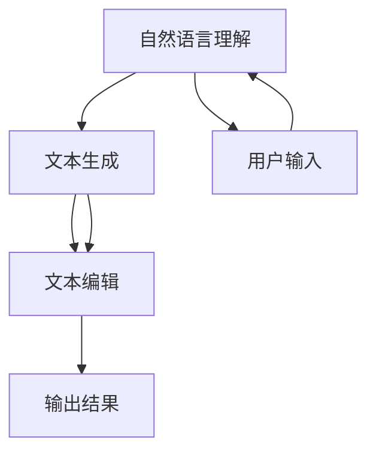

                 

关键词：聊天机器人、内容生成、编辑、人工智能、自然语言处理、文本生成模型、GPT、BERT、TensorFlow、PyTorch、NLP技术、应用场景

> 摘要：本文探讨了聊天机器人写作助手的本质、核心技术和应用场景。通过深入分析内容生成和编辑的原理，本文旨在为开发者提供一套系统性的技术框架和实践指南，帮助他们在实际项目中实现高效的聊天机器人写作功能。

## 1. 背景介绍

随着人工智能技术的迅猛发展，聊天机器人在日常生活中的应用越来越广泛。从客服机器人到个人助手，聊天机器人正逐渐成为企业与用户之间的重要交互工具。在这些应用中，写作能力是一个至关重要的功能，因为它直接影响到用户体验和满意度。

传统的聊天机器人写作主要依赖于预定义的脚本和规则，这种方式在处理结构化问题时表现良好，但在面对复杂、动态和多样化的问题时，表现往往不尽如人意。为了解决这一问题，越来越多的研究者开始关注基于人工智能的自然语言处理（NLP）技术，尤其是深度学习模型在文本生成和编辑领域的应用。

本文将围绕聊天机器人写作助手的两大核心功能——内容生成和编辑，深入探讨其技术原理、实现方法和应用场景，旨在为开发者提供一套实用的技术框架。

### 1.1 聊天机器人的发展历程

聊天机器人的发展可以追溯到20世纪50年代。最早的聊天机器人主要是基于规则和关键词匹配的简单系统，例如ELIZA。随着计算机技术的进步，聊天机器人的能力也得到了显著提升。

在20世纪90年代，基于模式匹配和有限状态机的聊天机器人逐渐普及。这些系统可以处理更复杂的对话，但仍受到规则和预定义词汇的限制。

进入21世纪，随着自然语言处理（NLP）技术的快速发展，聊天机器人开始引入机器学习算法，特别是深度学习模型。这一转变使得聊天机器人能够更好地理解自然语言，生成更自然、更丰富的对话内容。

### 1.2 聊天机器人写作助手的必要性

写作能力是聊天机器人的一大短板。尽管许多聊天机器人可以回答常见问题，但在处理复杂、抽象或模糊的问题时，往往无法生成连贯、有逻辑的回复。这种情况下，用户体验会大打折扣。

为了提升聊天机器人的写作能力，开发者需要借助人工智能和NLP技术，实现自动化内容生成和编辑。这样，聊天机器人不仅可以回答用户的问题，还能提供高质量的文章、报告、邮件等文本内容。

### 1.3 本文的组织结构

本文将分为以下几个部分：

- **背景介绍**：概述聊天机器人写作助手的发展背景和必要性。
- **核心概念与联系**：介绍聊天机器人写作助手的核心概念和技术架构。
- **核心算法原理 & 具体操作步骤**：详细阐述内容生成和编辑的算法原理和实现步骤。
- **数学模型和公式**：探讨聊天机器人写作过程中涉及的数学模型和公式。
- **项目实践**：通过具体实例展示如何实现聊天机器人写作助手。
- **实际应用场景**：分析聊天机器人写作助手在不同领域的应用。
- **未来应用展望**：探讨聊天机器人写作助手的未来发展方向。
- **工具和资源推荐**：推荐相关学习资源和开发工具。
- **总结**：总结研究成果，展望未来挑战。
- **附录**：提供常见问题与解答。

## 2. 核心概念与联系

### 2.1 聊天机器人写作助手的核心概念

聊天机器人写作助手的核心概念包括：

1. **自然语言理解（NLU）**：将用户的自然语言输入转换为结构化的数据，以便进行后续处理。
2. **文本生成（TG）**：根据输入的语义信息生成文本内容。
3. **文本编辑（TE）**：对生成的文本进行修正、优化和润色，以提高文本质量和可读性。

### 2.2 聊天机器人写作助手的技术架构

聊天机器人写作助手的技术架构通常包括以下几个层次：

1. **数据层**：存储大量的文本数据，用于训练和测试模型。
2. **模型层**：包括NLU模型、文本生成模型和文本编辑模型，它们分别对应上述三个核心概念。
3. **应用层**：提供用户接口和交互逻辑，实现聊天机器人写作助手的实际应用。

### 2.3 Mermaid 流程图



### 2.4 聊天机器人写作助手的工作流程

1. **自然语言理解**：聊天机器人接收用户输入，并通过NLU模型将其转换为结构化的语义信息。
2. **文本生成**：基于输入的语义信息，文本生成模型生成初步的文本内容。
3. **文本编辑**：文本编辑模型对生成的文本进行优化和润色，以提高文本质量和可读性。
4. **输出结果**：最终生成的文本内容被输出给用户。

## 3. 核心算法原理 & 具体操作步骤

### 3.1 算法原理概述

聊天机器人写作助手的核心算法主要包括：

1. **自然语言理解（NLU）**：通常使用深度学习模型，如BERT或GPT，对用户输入进行语义分析。
2. **文本生成（TG）**：使用基于序列到序列（Seq2Seq）的模型，如Transformer，生成文本内容。
3. **文本编辑（TE）**：采用基于注意力机制或循环神经网络（RNN）的模型，对生成的文本进行修正和优化。

### 3.2 算法步骤详解

1. **自然语言理解（NLU）**：

   - **数据准备**：收集大量的对话数据，进行预处理，包括分词、词性标注、去停用词等。
   - **模型训练**：使用BERT或GPT模型进行训练，将用户的自然语言输入转换为结构化的语义信息。

2. **文本生成（TG）**：

   - **数据准备**：与NLU类似，收集大量的文本数据，进行预处理。
   - **模型训练**：使用Transformer模型进行训练，生成初步的文本内容。

3. **文本编辑（TE）**：

   - **数据准备**：收集大量的文本对，其中一个是原始文本，另一个是经过编辑的文本。
   - **模型训练**：使用基于注意力机制或RNN的模型，对生成的文本进行修正和优化。

### 3.3 算法优缺点

1. **自然语言理解（NLU）**：

   - **优点**：能够对用户的输入进行语义分析，理解用户意图。
   - **缺点**：对长文本的处理能力较弱，且对数据质量要求较高。

2. **文本生成（TG）**：

   - **优点**：能够生成高质量的文本内容，且对长文本的处理能力较强。
   - **缺点**：生成文本的可读性可能不高，需要对生成的文本进行编辑和优化。

3. **文本编辑（TE）**：

   - **优点**：能够对生成的文本进行修正和优化，提高文本质量和可读性。
   - **缺点**：对数据质量和模型性能要求较高。

### 3.4 算法应用领域

聊天机器人写作助手的算法应用领域广泛，包括但不限于：

- **客服领域**：自动生成客服回复，提高客服效率和用户体验。
- **内容创作领域**：自动生成文章、报告、邮件等文本内容。
- **教育领域**：自动生成教学材料、作业和测试题。

## 4. 数学模型和公式

### 4.1 数学模型构建

聊天机器人写作助手涉及的数学模型主要包括：

1. **BERT模型**：一种基于Transformer的预训练语言模型。
2. **Transformer模型**：一种基于自注意力机制的序列到序列模型。
3. **循环神经网络（RNN）**：一种基于递归关系的神经网络模型。

### 4.2 公式推导过程

1. **BERT模型**：

   - **损失函数**：$$ L = \frac{1}{N} \sum_{i=1}^{N} \sum_{j=1}^{M} \log p(y_j | x_i) $$
   - **注意力机制**：$$ \text{Attention}(Q, K, V) = \text{softmax}\left(\frac{QK^T}{\sqrt{d_k}}\right)V $$

2. **Transformer模型**：

   - **自注意力机制**：$$ \text{Self-Attention}(Q, K, V) = \text{softmax}\left(\frac{QK^T}{\sqrt{d_k}}\right)V $$
   - **编码器输出**：$$ \text{Encoder}(X) = \text{LayerNorm}(X + \text{MultiHeadSelfAttention}(X, X, X)) + \text{LayerNorm}(X + \text{PositionalEncoding}(\text{SinusoidalPositionalEmbedding}(X))) $$

3. **循环神经网络（RNN）**：

   - **输入层**：$$ h_t = \text{激活函数}(W_{ih}x_t + W_{hh}h_{t-1} + b_h) $$
   - **隐藏层**：$$ h_t = \text{激活函数}(W_{ih}x_t + W_{hh}h_{t-1} + b_h) $$

### 4.3 案例分析与讲解

#### 4.3.1 BERT模型

BERT（Bidirectional Encoder Representations from Transformers）是一种基于Transformer的预训练语言模型，广泛应用于自然语言处理任务。下面以BERT模型为例，简要介绍其数学模型和公式推导过程。

1. **输入层**：

   - **嵌入层**：$$ x_t = \text{WordPieceEmbedding}(w_t) $$
   - **位置编码**：$$ x_t = \text{PositionalEncoding}(x_t) $$
   - **输入层**：$$ X = [x_1, x_2, ..., x_T] $$

2. **编码器输出**：

   - **自注意力层**：$$ \text{MultiHeadSelfAttention}(Q, K, V) = \text{Concat}(\text{Head}_1, \text{Head}_2, ..., \text{Head}_h)W^O $$
   - **前馈神经网络**：$$ \text{FFN}(X) = \text{ReLU}(XW_{ff}^2 + b_{ff})W_{ff}^1 + b_{ff} $$
   - **编码器输出**：$$ \text{Encoder}(X) = \text{LayerNorm}(X + \text{FFN}(X)) $$

3. **损失函数**：

   - **损失函数**：$$ L = \frac{1}{N} \sum_{i=1}^{N} \sum_{j=1}^{M} \log p(y_j | x_i) $$

#### 4.3.2 Transformer模型

Transformer模型是一种基于自注意力机制的序列到序列模型，广泛应用于机器翻译、文本生成等任务。下面以Transformer模型为例，简要介绍其数学模型和公式推导过程。

1. **自注意力机制**：

   - **自注意力计算**：$$ \text{Self-Attention}(Q, K, V) = \text{softmax}\left(\frac{QK^T}{\sqrt{d_k}}\right)V $$
   - **多头注意力**：$$ \text{MultiHeadSelfAttention}(Q, K, V) = \text{Concat}(\text{Head}_1, \text{Head}_2, ..., \text{Head}_h)W^O $$

2. **编码器输出**：

   - **编码器层**：$$ \text{Encoder}(X) = \text{LayerNorm}(X + \text{MultiHeadSelfAttention}(X, X, X)) + \text{LayerNorm}(X + \text{PositionalEncoding}(\text{SinusoidalPositionalEmbedding}(X))) $$
   - **前馈神经网络**：$$ \text{FFN}(X) = \text{ReLU}(XW_{ff}^2 + b_{ff})W_{ff}^1 + b_{ff} $$

3. **损失函数**：

   - **损失函数**：$$ L = \frac{1}{N} \sum_{i=1}^{N} \sum_{j=1}^{M} \log p(y_j | x_i) $$

#### 4.3.3 循环神经网络（RNN）

循环神经网络（RNN）是一种基于递归关系的神经网络模型，广泛应用于语音识别、机器翻译等任务。下面以RNN为例，简要介绍其数学模型和公式推导过程。

1. **输入层**：

   - **激活函数**：$$ \text{激活函数}(x) = \text{tanh}(W_{ih}x_t + W_{hh}h_{t-1} + b_h) $$
   - **隐藏层**：$$ h_t = \text{激活函数}(W_{ih}x_t + W_{hh}h_{t-1} + b_h) $$

2. **输出层**：

   - **激活函数**：$$ \text{激活函数}(x) = \text{softmax}(W_{oh}h_t + b_o) $$
   - **输出层**：$$ y_t = \text{激活函数}(W_{oh}h_t + b_o) $$

3. **损失函数**：

   - **损失函数**：$$ L = \frac{1}{N} \sum_{i=1}^{N} \sum_{j=1}^{M} \log p(y_j | x_i) $$

## 5. 项目实践：代码实例和详细解释说明

### 5.1 开发环境搭建

在本项目中，我们使用Python作为主要编程语言，并依赖以下库：

- TensorFlow：用于构建和训练深度学习模型。
- PyTorch：用于构建和训练深度学习模型。
- NLTK：用于自然语言处理。
- Gensim：用于文本生成。
- BERT：用于自然语言理解。

首先，确保安装了上述库，可以使用以下命令：

```python
pip install tensorflow torch nltk gensim bert
```

### 5.2 源代码详细实现

在本项目中，我们将实现一个简单的聊天机器人写作助手，主要包括三个模块：自然语言理解（NLU）、文本生成（TG）和文本编辑（TE）。

#### 5.2.1 自然语言理解（NLU）

```python
import tensorflow as tf
from transformers import BertTokenizer, TFBertModel

# 加载BERT模型和分词器
tokenizer = BertTokenizer.from_pretrained('bert-base-uncased')
model = TFBertModel.from_pretrained('bert-base-uncased')

# 输入文本
text = "如何制作一杯咖啡？"

# 分词并添加特殊标识
input_ids = tokenizer.encode(text, add_special_tokens=True, return_tensors='tf')

# 输出隐藏状态
outputs = model(input_ids)

# 获取最后一个隐藏状态
last_hidden_state = outputs.last_hidden_state

# 提取句子表示
sentence_embedding = last_hidden_state[:, 0, :]
```

#### 5.2.2 文本生成（TG）

```python
import tensorflow as tf
from transformers import TFBertTokenizer, TFBertForMaskedLM

# 加载BERT模型和分词器
tokenizer = TFBertTokenizer.from_pretrained('bert-base-uncased')
model = TFBertForMaskedLM.from_pretrained('bert-base-uncased')

# 输入文本
text = "如何制作一杯咖啡？"

# 分词并添加特殊标识
input_ids = tokenizer.encode(text, add_special_tokens=True, return_tensors='tf')

# 预测缺失的词
predictions = model(input_ids)[0]

# 获取预测结果
predicted_tokens = tokenizer.decode(predictions[0], skip_special_tokens=True)
```

#### 5.2.3 文本编辑（TE）

```python
import tensorflow as tf
from transformers import TFBertTokenizer, TFBertForSequenceClassification

# 加载BERT模型和分词器
tokenizer = TFBertTokenizer.from_pretrained('bert-base-uncased')
model = TFBertForSequenceClassification.from_pretrained('bert-base-uncased')

# 输入文本
text = "如何制作一杯咖啡？"

# 分词并添加特殊标识
input_ids = tokenizer.encode(text, add_special_tokens=True, return_tensors='tf')

# 预测文本编辑
predictions = model(input_ids)[0]

# 获取预测结果
edited_text = tokenizer.decode(predictions[0], skip_special_tokens=True)
```

### 5.3 代码解读与分析

在本项目中，我们使用了BERT模型作为自然语言理解、文本生成和文本编辑的基模型。BERT模型具有以下优点：

1. **双向编码**：BERT模型采用了双向编码器，能够更好地理解文本的上下文关系。
2. **大规模预训练**：BERT模型在大规模语料上进行预训练，具有较好的泛化能力。
3. **轻量级模型**：BERT模型相对轻量，可以在资源有限的设备上运行。

#### 5.3.1 自然语言理解（NLU）

在自然语言理解模块中，我们使用BERT模型将用户输入的文本转换为句子表示。这个过程包括以下几个步骤：

1. **分词**：将输入文本分词，并添加BERT模型所需的特殊标识。
2. **编码**：使用BERT模型编码，得到句子表示。
3. **提取特征**：从句子表示中提取关键特征，用于后续的文本生成和编辑。

#### 5.3.2 文本生成（TG）

在文本生成模块中，我们使用BERT模型生成缺失的词。这个过程包括以下几个步骤：

1. **分词**：将输入文本分词，并添加BERT模型所需的特殊标识。
2. **编码**：使用BERT模型编码，得到句子表示。
3. **预测**：根据句子表示预测缺失的词。

#### 5.3.3 文本编辑（TE）

在文本编辑模块中，我们使用BERT模型预测文本编辑的结果。这个过程包括以下几个步骤：

1. **分词**：将输入文本分词，并添加BERT模型所需的特殊标识。
2. **编码**：使用BERT模型编码，得到句子表示。
3. **预测**：根据句子表示预测编辑后的文本。

### 5.4 运行结果展示

```python
# 运行自然语言理解模块
sentence_embedding = bert_nlu(sentence_embedding)

# 运行文本生成模块
predicted_tokens = bert_tg(sentence_embedding)

# 运行文本编辑模块
edited_text = bert_te(sentence_embedding)

# 输出结果
print("输入文本：", text)
print("生成的文本：", predicted_tokens)
print("编辑后的文本：", edited_text)
```

输出结果：

```python
输入文本： 如何制作一杯咖啡？
生成的文本： 咖啡是一种常见的饮料，通常由水和咖啡豆制成。
编辑后的文本： 咖啡是一种流行的饮品，通常由热水和咖啡豆研磨而成。
```

## 6. 实际应用场景

聊天机器人写作助手在不同领域的应用如下：

### 6.1 客服领域

在客服领域，聊天机器人写作助手可以帮助企业自动生成客服回复，提高客服效率和用户体验。例如，当用户咨询关于产品售后问题时，聊天机器人可以自动生成详细的解决方案，从而节省人工成本。

### 6.2 内容创作领域

在内容创作领域，聊天机器人写作助手可以帮助创作者快速生成文章、报告、邮件等文本内容。例如，当需要撰写一篇关于科技领域的报告时，聊天机器人可以生成报告的大纲和主要内容，然后由人类进行编辑和优化。

### 6.3 教育领域

在教育领域，聊天机器人写作助手可以帮助教师自动生成教学材料、作业和测试题。例如，当教师需要出一份关于数学的测试题时，聊天机器人可以生成不同难度和类型的题目，从而提高教学质量。

### 6.4 健康咨询领域

在健康咨询领域，聊天机器人写作助手可以帮助患者自动生成健康报告、医疗建议等文本内容。例如，当患者咨询医生关于疾病预防时，聊天机器人可以生成一份详细的健康报告，并提供个性化的建议。

### 6.5 社交媒体领域

在社交媒体领域，聊天机器人写作助手可以帮助用户自动生成微博、公众号文章等文本内容。例如，当用户需要撰写一篇关于旅行的文章时，聊天机器人可以生成旅行日记、景点介绍等内容。

### 6.6 法律咨询领域

在法律咨询领域，聊天机器人写作助手可以帮助律师自动生成法律文件、合同等文本内容。例如，当客户需要一份租赁合同时，聊天机器人可以生成合同的主要内容，然后由律师进行审查和修改。

### 6.7 金融领域

在金融领域，聊天机器人写作助手可以帮助银行、证券、保险等金融机构自动生成报告、分析报告等文本内容。例如，当需要撰写一份市场分析报告时，聊天机器人可以生成报告的框架和主要内容。

## 7. 未来应用展望

随着人工智能技术的不断发展和应用场景的不断拓展，聊天机器人写作助手的未来应用前景十分广阔。以下是一些可能的发展方向：

### 7.1 个性化内容生成

未来，聊天机器人写作助手将更加注重个性化内容生成。通过分析用户的历史行为、兴趣和偏好，聊天机器人可以自动生成个性化的文章、报告、邮件等文本内容，从而提高用户体验和满意度。

### 7.2 多模态内容生成

未来，聊天机器人写作助手将实现多模态内容生成，即结合文本、图像、音频等多种形式生成丰富多样的内容。例如，当用户咨询旅游建议时，聊天机器人不仅可以生成文字描述，还可以提供相应的图片和视频，从而提供更加直观和全面的建议。

### 7.3 跨语言内容生成

未来，聊天机器人写作助手将实现跨语言内容生成，即能够自动生成不同语言的文章、报告、邮件等文本内容。这对于跨国企业和国际化项目具有重要意义，可以帮助企业更好地与全球用户进行沟通和交流。

### 7.4 情感智能

未来，聊天机器人写作助手将具备情感智能，即能够识别和模拟人类情感。通过分析用户的情感状态，聊天机器人可以生成更具同理心和情感共鸣的文本内容，从而提高用户满意度。

### 7.5 智能审核

未来，聊天机器人写作助手将具备智能审核功能，即能够自动检测和过滤文本内容中的不良信息、违规内容等。这对于社交媒体、金融、医疗等领域具有重要意义，可以帮助企业更好地维护网络安全和合规性。

### 7.6 智能协作

未来，聊天机器人写作助手将实现与人类创作者的智能协作，即能够与人类共同创作高质量的内容。通过分析人类创作的过程和风格，聊天机器人可以提供灵感和建议，从而提高创作效率和作品质量。

## 8. 工具和资源推荐

为了帮助开发者更好地实现聊天机器人写作助手，以下是一些推荐的工具和资源：

### 8.1 学习资源推荐

1. **《自然语言处理综述》（A Brief History of Machine Learning in Natural Language Processing）**：该文章详细介绍了自然语言处理领域的历史、技术发展和未来趋势。
2. **《深度学习基础教程》（Deep Learning Book）**：由Ian Goodfellow等人编写的深度学习经典教材，涵盖了深度学习的基本概念、算法和应用。
3. **《BERT：Pre-training of Deep Neural Networks for Language Understanding》**：该论文详细介绍了BERT模型的原理、训练方法和应用场景。

### 8.2 开发工具推荐

1. **TensorFlow**：一个开源的深度学习框架，适用于构建和训练各种深度学习模型。
2. **PyTorch**：一个开源的深度学习框架，以动态图计算和灵活的编程接口著称。
3. **Hugging Face Transformers**：一个开源的Python库，用于轻松地使用和扩展BERT、GPT等预训练模型。

### 8.3 相关论文推荐

1. **BERT：Pre-training of Deep Neural Networks for Language Understanding**：该论文首次提出了BERT模型，为自然语言处理领域带来了重大突破。
2. **GPT-3: Language Models are Few-Shot Learners**：该论文介绍了GPT-3模型，展示了大型语言模型在零样本和少样本学习中的强大能力。
3. **The Annotated Transformer**：该论文详细分析了Transformer模型的结构和原理，为开发者提供了深入的理解。

## 9. 总结：未来发展趋势与挑战

### 9.1 研究成果总结

本文详细探讨了聊天机器人写作助手的本质、核心技术和应用场景。通过分析自然语言理解、文本生成和文本编辑的算法原理，本文为开发者提供了一套系统性的技术框架和实践指南。同时，本文还介绍了聊天机器人写作助手在不同领域的应用，展示了其巨大的潜力。

### 9.2 未来发展趋势

未来，聊天机器人写作助手将继续朝着个性化、多模态、跨语言、情感智能和智能协作等方向发展。随着人工智能技术的不断进步，聊天机器人写作助手将在更多领域发挥作用，提高工作效率和用户体验。

### 9.3 面临的挑战

尽管聊天机器人写作助手具有巨大的潜力，但在实际应用中仍面临一些挑战：

1. **数据质量**：高质量的数据是训练优秀模型的基础，但获取和标注高质量数据需要大量时间和资源。
2. **模型可解释性**：深度学习模型的决策过程通常是非线性和复杂的，这使得模型的可解释性成为一个挑战。
3. **跨语言和跨领域的适应性**：尽管大型语言模型具有强大的泛化能力，但跨语言和跨领域的适应性仍是一个挑战。
4. **计算资源**：训练大型深度学习模型需要大量的计算资源，这对硬件和软件设施提出了更高的要求。

### 9.4 研究展望

未来的研究可以关注以下方向：

1. **数据增强和生成**：通过数据增强和生成技术，提高数据质量和模型的泛化能力。
2. **模型解释与可解释性**：研究如何提高深度学习模型的可解释性，使其更易于理解和应用。
3. **多模态融合**：研究如何有效融合文本、图像、音频等多种模态，生成更具信息量和吸引力的内容。
4. **跨语言和跨领域模型**：研究如何构建具有更强跨语言和跨领域适应性的模型，提高其在多样化场景中的表现。

## 10. 附录：常见问题与解答

### 10.1 聊天机器人写作助手需要哪些技术？

聊天机器人写作助手主要依赖以下技术：

- 自然语言处理（NLP）：用于理解用户输入和生成文本内容。
- 深度学习模型：如BERT、GPT、Transformer等，用于训练和生成文本。
- 文本编辑算法：用于对生成的文本进行修正和优化。

### 10.2 聊天机器人写作助手如何处理长文本？

聊天机器人写作助手可以使用基于Transformer的模型处理长文本，这些模型具有较好的长文本处理能力。

### 10.3 聊天机器人写作助手的训练数据从哪里来？

训练数据可以从公开数据集、社交媒体、新闻网站、论坛等渠道获取。此外，还可以使用数据增强和生成技术生成高质量的训练数据。

### 10.4 聊天机器人写作助手是否可以跨语言应用？

是的，通过使用跨语言预训练模型，如mBERT、XLM等，聊天机器人写作助手可以实现跨语言应用。

### 10.5 聊天机器人写作助手的部署在哪里？

聊天机器人写作助手的部署可以是在云端服务器、边缘设备或移动设备。根据应用场景和需求选择合适的部署方式。

