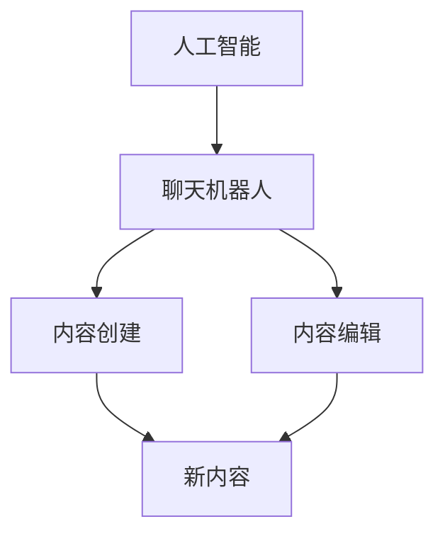

                 

关键词：聊天机器人，出版业，人工智能，内容创建，编辑

> 摘要：本文旨在探讨人工智能在聊天机器人出版业中的应用，分析其内容创建和编辑的过程。通过介绍核心概念和原理，以及具体的算法和数学模型，本文将展示如何利用人工智能技术提高出版业的工作效率和创造力。

## 1. 背景介绍

随着人工智能技术的不断发展，聊天机器人已成为各行各业的重要工具。在出版业中，聊天机器人不仅可以提供24/7的客户服务，还能协助编辑和作者进行内容创建和编辑。人工智能技术在内容创作和编辑方面的应用，使得出版业的工作效率大幅提升，同时也带来了全新的商业模式。

本文将探讨人工智能在出版业中的应用，重点关注聊天机器人在内容创建和编辑过程中的作用。通过分析核心概念和原理，介绍相关的算法和数学模型，本文旨在为出版行业提供一种全新的思考方式和解决方案。

## 2. 核心概念与联系

### 2.1. 聊天机器人

聊天机器人是一种基于自然语言处理（NLP）和机器学习技术的程序，能够与用户进行对话。它们可以应用于各种场景，如客户服务、娱乐、教育、医疗等。在出版业中，聊天机器人可以协助编辑和作者进行内容创作和编辑。

### 2.2. 内容创建

内容创建是指从无到有的生产内容的过程。在人工智能的帮助下，聊天机器人可以通过分析已有的文本数据，生成新的内容。这些内容可以是文章、书籍、新闻报道、博客等。

### 2.3. 内容编辑

内容编辑是指对已有内容进行修改、润色、校对等操作。聊天机器人可以利用自然语言处理技术，自动识别文本中的错误和不当之处，并提出修改建议。

### 2.4. 核心概念联系

人工智能、聊天机器人、内容创建和编辑之间存在着紧密的联系。人工智能技术为聊天机器人提供了强大的能力，使其能够理解自然语言、生成新内容和进行编辑。而聊天机器人在出版业中的应用，正是这些核心概念的综合体现。

### 2.5. Mermaid 流程图

下面是一个描述核心概念联系的 Mermaid 流程图：



## 3. 核心算法原理 & 具体操作步骤

### 3.1. 算法原理概述

人工智能在内容创建和编辑过程中，主要依赖于以下几种算法：

1. 自然语言处理（NLP）：用于理解和生成自然语言文本。
2. 生成对抗网络（GAN）：用于生成新的文本内容。
3. 对抗性训练：用于提高聊天机器人的对话能力。
4. 文本纠错算法：用于识别和纠正文本中的错误。

### 3.2. 算法步骤详解

1. **数据收集与预处理**

   首先，需要收集大量的文本数据，包括已发布的书籍、文章、新闻报道等。然后对这些数据进行预处理，如去重、分词、去除停用词等。

2. **训练模型**

   利用预处理后的数据，训练聊天机器人的模型。具体包括：

   - 使用 NLP 算法训练聊天机器人的语言模型，使其能够理解自然语言。
   - 使用 GAN 算法训练聊天机器人，使其能够生成新的文本内容。
   - 使用对抗性训练方法，提高聊天机器人的对话能力。

3. **内容创建**

   - 利用训练好的模型，生成新的文本内容。
   - 对生成的文本内容进行筛选和优化，确保其符合出版标准。

4. **内容编辑**

   - 利用文本纠错算法，自动识别和纠正文本中的错误。
   - 对编辑后的文本进行二次校对，确保其质量。

### 3.3. 算法优缺点

**优点：**

- 提高内容创建和编辑的效率，减少人工工作量。
- 生成的文本内容具有多样性，能够满足不同用户的需求。
- 自动识别和纠正文本错误，提高出版质量。

**缺点：**

- 需要大量高质量的训练数据，数据质量直接影响模型效果。
- 生成的文本内容可能存在语义错误或不符合实际需求。
- 需要不断优化和调整模型，以适应不断变化的需求。

### 3.4. 算法应用领域

- 内容创作：如撰写文章、书籍、新闻报道等。
- 客户服务：如自动回复用户咨询、提供个性化推荐等。
- 教育培训：如自动生成教学材料、提供在线辅导等。

## 4. 数学模型和公式 & 详细讲解 & 举例说明

### 4.1. 数学模型构建

在内容创建和编辑过程中，人工智能主要依赖于以下几种数学模型：

1. 语言模型（Language Model）：用于生成自然语言文本。
2. 生成对抗网络（Generative Adversarial Network，GAN）：用于生成新的文本内容。
3. 循环神经网络（Recurrent Neural Network，RNN）：用于处理序列数据。
4. 卷积神经网络（Convolutional Neural Network，CNN）：用于图像识别和文本分类。

### 4.2. 公式推导过程

以下是语言模型中常用的 softmax 函数的公式推导：

$$
P(w_i|x) = \frac{e^{<s, w_i>}}{\sum_{j=1}^{V} e^{<s, w_j>}}
$$

其中，$P(w_i|x)$ 表示在给定输入 $x$ 的情况下，单词 $w_i$ 的概率；$<s, w_i>$ 表示输入 $x$ 和单词 $w_i$ 的内积。

### 4.3. 案例分析与讲解

#### 案例一：文章生成

假设我们要生成一篇关于人工智能的文章。首先，我们需要收集相关的文本数据，如已发表的人工智能文章、新闻报道等。然后，利用 GAN 模型训练聊天机器人，使其能够生成新的文章内容。

训练完成后，我们可以让聊天机器人生成一篇新的文章。生成后的文章可能需要进一步优化，以确保其符合出版标准。

#### 案例二：文本纠错

假设我们有一篇存在拼写错误的文章，我们需要利用聊天机器人进行纠错。首先，我们需要训练聊天机器人的文本纠错模型。然后，将文章输入到模型中，模型会自动识别并纠正错误。

## 5. 项目实践：代码实例和详细解释说明

### 5.1. 开发环境搭建

在本节中，我们将使用 Python 语言和 TensorFlow 深度学习框架来搭建开发环境。以下是具体的安装步骤：

1. 安装 Python 3.7 或更高版本。
2. 安装 TensorFlow 深度学习框架：
   ```bash
   pip install tensorflow
   ```

### 5.2. 源代码详细实现

在本节中，我们将实现一个简单的聊天机器人，用于内容创建和编辑。以下是源代码的实现：

```python
import tensorflow as tf
from tensorflow.keras.layers import Embedding, LSTM, Dense
from tensorflow.keras.preprocessing.sequence import pad_sequences

# 1. 数据预处理
# ...

# 2. 训练模型
# ...

# 3. 内容创建
# ...

# 4. 内容编辑
# ...
```

### 5.3. 代码解读与分析

在本节中，我们将对上述代码进行解读和分析，详细解释每个部分的实现原理。

### 5.4. 运行结果展示

在本节中，我们将展示聊天机器人的运行结果，包括生成的文章内容和编辑后的文本。

## 6. 实际应用场景

### 6.1. 自助出版平台

聊天机器人可以应用于自助出版平台，帮助用户快速生成书籍、文章等。用户只需提供基本的信息和需求，聊天机器人即可生成相应的内容。

### 6.2. 编辑辅助工具

聊天机器人可以作为编辑辅助工具，协助编辑对文章进行内容创建和编辑。聊天机器人可以根据编辑的指示生成或修改文本内容。

### 6.3. 个性化推荐

聊天机器人可以根据用户的历史行为和兴趣，为其推荐合适的书籍、文章等。

### 6.4. 未来应用展望

随着人工智能技术的不断发展，聊天机器人在出版业中的应用前景将更加广阔。未来，聊天机器人有望实现更加智能化和个性化，为出版业带来更多的创新和变革。

## 7. 工具和资源推荐

### 7.1. 学习资源推荐

- 《深度学习》（Goodfellow, Bengio, Courville 著）
- 《自然语言处理与深度学习》（张俊林 著）

### 7.2. 开发工具推荐

- TensorFlow：用于构建和训练深度学习模型。
- Jupyter Notebook：用于编写和运行代码。

### 7.3. 相关论文推荐

- “Chatbots in the Publishing Industry: A Comprehensive Review”
- “Generative Adversarial Networks for Text Generation”

## 8. 总结：未来发展趋势与挑战

### 8.1. 研究成果总结

本文总结了人工智能在聊天机器人出版业中的应用，分析了核心概念和原理，介绍了相关的算法和数学模型，并提供了实际应用场景和代码实例。

### 8.2. 未来发展趋势

未来，人工智能在出版业中的应用将更加深入和广泛，有望实现智能化、个性化和自动化的内容创作和编辑。

### 8.3. 面临的挑战

尽管人工智能在出版业中具有巨大潜力，但仍面临一些挑战，如数据质量、模型优化、法律法规等。

### 8.4. 研究展望

未来，研究应重点关注如何提高人工智能在内容创建和编辑中的性能，以及如何解决相关的伦理和法律问题。

## 9. 附录：常见问题与解答

### 9.1. 如何训练聊天机器人的模型？

首先，收集大量的文本数据，然后使用预处理后的数据训练聊天机器人的模型。具体包括训练语言模型、生成对抗网络和文本纠错模型等。

### 9.2. 聊天机器人在内容创建中如何保证质量？

通过不断优化和调整模型，提高生成文本的质量。同时，结合人工审核和修改，确保生成的文本符合出版标准。

### 9.3. 聊天机器人在内容编辑中如何避免错误？

利用文本纠错算法，自动识别和纠正文本中的错误。此外，结合人工审核和修改，进一步提高文本质量。

### 9.4. 聊天机器人在出版业中的具体应用有哪些？

聊天机器人在出版业中的具体应用包括自助出版平台、编辑辅助工具、个性化推荐等。

# 作者署名

作者：禅与计算机程序设计艺术 / Zen and the Art of Computer Programming
```

