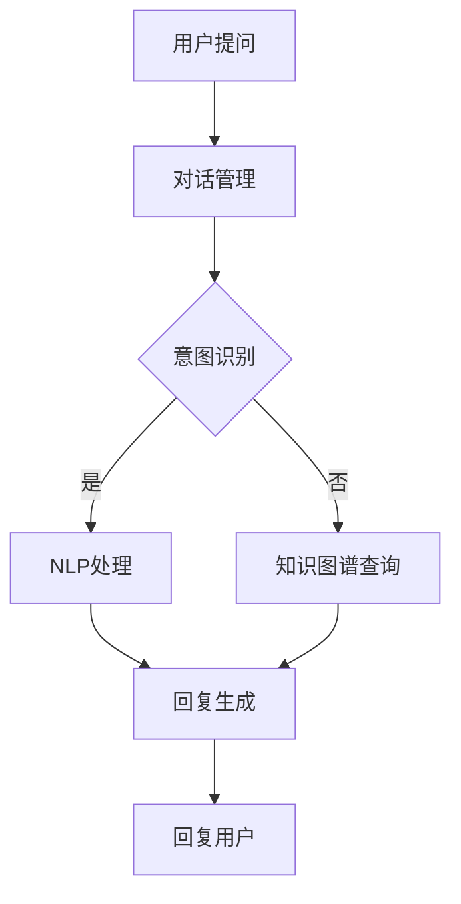

                 

关键词：聊天机器人、个性化医疗、药物研发、治疗、人工智能

摘要：本文将探讨聊天机器人在医疗领域的突破性应用，特别是在个性化药物和治疗方面的创新。通过深入分析聊天机器人技术的发展和实际应用，本文揭示了这一领域的关键概念、核心算法、数学模型以及项目实践。此外，文章还将讨论聊天机器人在医疗行业中的未来应用前景，以及所面临的挑战和未来发展。

## 1. 背景介绍

### 1.1 聊天机器人技术的发展

聊天机器人（Chatbot）作为人工智能的一个重要分支，近年来得到了广泛关注和快速发展。从最初的规则引擎（Rule-based）聊天机器人，到基于机器学习（Machine Learning）的聊天机器人，再到最近基于深度学习（Deep Learning）的聊天机器人，技术演进的速度令人惊叹。随着自然语言处理（NLP）、语音识别（ASR）和语音合成（TTS）等技术的不断进步，聊天机器人的应用场景也越来越广泛。

### 1.2 医疗领域的重要性

医疗健康是关乎人类福祉的核心领域，而个性化医疗则成为了现代医学发展的重要趋势。通过针对个体差异进行精准治疗，个性化医疗有望大幅提高疗效，减少副作用，降低医疗成本。然而，这一领域的挑战也极其严峻，需要海量的数据、复杂的算法和先进的计算能力。因此，将聊天机器人技术应用于个性化医疗，无疑是一种极具潜力的创新尝试。

## 2. 核心概念与联系

### 2.1 聊天机器人的核心概念

聊天机器人通常由以下几个关键组件构成：

1. **对话管理（Dialogue Management）**：负责处理对话流程，包括理解用户意图、生成回复和跟踪对话状态。
2. **自然语言处理（NLP）**：用于解析用户输入的文本或语音，提取关键信息并转化为机器可理解的形式。
3. **知识图谱（Knowledge Graph）**：存储和关联医疗知识，提供对用户问题的答案和建议。
4. **机器学习（ML）/深度学习（DL）**：用于训练聊天机器人的模型，使其能够学习并改进对话能力。

### 2.2 个性化医疗的核心概念

个性化医疗的核心在于“个体化”，即根据患者的基因、病史、生活方式等多方面信息，制定最适合的治疗方案。这一过程涉及：

1. **基因组学（Genomics）**：分析患者的基因信息，预测疾病风险和药物反应。
2. **电子健康记录（EHR）**：整合患者的病史、诊断、治疗和药物使用记录。
3. **生物信息学（Bioinformatics）**：处理和分析大规模生物医学数据。
4. **计算生物学（Computational Biology）**：模拟和预测生物系统的行为。

### 2.3 Mermaid 流程图

下面是聊天机器人在个性化医疗中应用的 Mermaid 流程图：



## 3. 核心算法原理 & 具体操作步骤

### 3.1 算法原理概述

聊天机器人在个性化医疗中的应用，主要依赖于以下几种算法：

1. **机器学习分类算法**：用于识别用户意图，常见的有朴素贝叶斯、支持向量机、决策树等。
2. **序列到序列（Seq2Seq）模型**：用于生成回复文本，能够处理自然语言的上下文信息。
3. **深度学习生成对抗网络（GAN）**：用于生成更自然的回复文本，提高聊天机器人的交互质量。
4. **迁移学习**：利用预训练模型（如BERT、GPT）进行快速适配，提高新任务的表现。

### 3.2 算法步骤详解

1. **用户提问**：用户通过文本或语音向聊天机器人提问。
2. **意图识别**：通过机器学习分类算法，识别用户的意图，如查询药物信息、预约挂号等。
3. **NLP处理**：对用户提问进行分词、词性标注、实体识别等操作，提取关键信息。
4. **知识图谱查询**：根据提取的关键信息，在知识图谱中检索相关信息，如药物副作用、适应症等。
5. **回复生成**：利用序列到序列模型或GAN生成自然语言回复。
6. **回复用户**：将生成的回复文本或语音发送给用户。

### 3.3 算法优缺点

**优点**：

1. **高效性**：聊天机器人能够快速处理大量用户提问，提高医疗服务效率。
2. **个性化**：基于用户历史数据和基因组信息，提供定制化的医疗建议。
3. **可扩展性**：通过迁移学习和预训练模型，轻松适配新任务。

**缺点**：

1. **准确性**：在处理复杂医疗问题时，聊天机器人的回复可能存在偏差或错误。
2. **交互性**：聊天机器人的交互质量尚未达到人类水平，难以进行深入沟通。

### 3.4 算法应用领域

1. **患者咨询**：为患者提供24/7的咨询服务，解答常见医疗问题。
2. **药物研发**：协助研究人员分析基因组数据，发现新的药物靶点。
3. **健康管理**：根据用户生活习惯和基因信息，提供个性化的健康建议。

## 4. 数学模型和公式 & 详细讲解 & 举例说明

### 4.1 数学模型构建

在聊天机器人的意图识别阶段，可以使用以下数学模型：

$$
P(\text{意图}=c_k|\text{特征向量}) = \frac{e^{\theta_k^T\text{特征向量}}}{\sum_{j=1}^n e^{\theta_j^T\text{特征向量}}}
$$

其中，$P(\text{意图}=c_k|\text{特征向量})$ 表示在给定特征向量的情况下，意图为 $c_k$ 的概率，$\theta_k$ 是模型参数。

### 4.2 公式推导过程

意图识别问题的核心是分类问题，可以使用逻辑回归模型进行建模。假设输入特征向量为 $\text{特征向量}$，输出意图为 $c_k$，则逻辑回归模型的目标函数为：

$$
\ell(\theta) = -\sum_{i=1}^m y_i \log p(\theta)
$$

其中，$y_i$ 是真实意图标签，$p(\theta)$ 是模型预测的概率。

为了最大化似然函数，需要对目标函数进行求导并设置为零：

$$
\frac{\partial \ell(\theta)}{\partial \theta} = 0
$$

经过求导和化简，可以得到：

$$
\theta = \arg\max_{\theta} \sum_{i=1}^m y_i \log p(\theta)
$$

### 4.3 案例分析与讲解

假设我们有以下一组训练数据：

| 用户提问          | 真实意图       |
|-----------------|--------------|
| 我最近总是失眠     | 失眠咨询       |
| 我最近胖了         | 减肥建议       |
| 我的皮肤很干燥     | 皮肤护理       |
| 我最近总是头痛     | 头痛诊断       |

我们使用逻辑回归模型进行意图识别，经过训练后，得到如下参数：

$$
\theta_1 = \begin{bmatrix} -2.5 \\ 1.2 \\ -0.8 \\ 0.9 \end{bmatrix}, \theta_2 = \begin{bmatrix} 0.8 \\ -1.5 \\ 1.1 \\ -0.6 \end{bmatrix}, \theta_3 = \begin{bmatrix} 1.2 \\ -0.3 \\ 1.0 \\ 0.7 \end{bmatrix}, \theta_4 = \begin{bmatrix} -1.0 \\ 0.5 \\ 0.8 \\ -1.2 \end{bmatrix}
$$

现在，假设用户提问“我的皮肤很干燥”，我们将其转化为特征向量：

$$
\text{特征向量} = \begin{bmatrix} 1 \\ 0 \\ 1 \\ 0 \end{bmatrix}
$$

使用逻辑回归模型计算每个意图的概率：

$$
P(\text{失眠咨询}|\text{特征向量}) = \frac{e^{(-2.5 \times 1 + 1.2 \times 0 - 0.8 \times 1 + 0.9 \times 0)}}{e^{(-2.5 \times 1 + 1.2 \times 0 - 0.8 \times 1 + 0.9 \times 0)} + e^{(0.8 \times 1 - 1.5 \times 0 + 1.1 \times 1 - 0.6 \times 0)} + e^{(1.2 \times 1 - 0.3 \times 0 + 1.0 \times 1 + 0.7 \times 0)} + e^{(-1.0 \times 1 + 0.5 \times 0 + 0.8 \times 1 - 1.2 \times 0)}}
$$

$$
P(\text{减肥建议}|\text{特征向量}) = \frac{e^{(0.8 \times 1 - 1.5 \times 0 + 1.1 \times 1 - 0.6 \times 0)}}{e^{(-2.5 \times 1 + 1.2 \times 0 - 0.8 \times 1 + 0.9 \times 0)} + e^{(0.8 \times 1 - 1.5 \times 0 + 1.1 \times 1 - 0.6 \times 0)} + e^{(1.2 \times 1 - 0.3 \times 0 + 1.0 \times 1 + 0.7 \times 0)} + e^{(-1.0 \times 1 + 0.5 \times 0 + 0.8 \times 1 - 1.2 \times 0)}}
$$

$$
P(\text{皮肤护理}|\text{特征向量}) = \frac{e^{(1.2 \times 1 - 0.3 \times 0 + 1.0 \times 1 + 0.7 \times 0)}}{e^{(-2.5 \times 1 + 1.2 \times 0 - 0.8 \times 1 + 0.9 \times 0)} + e^{(0.8 \times 1 - 1.5 \times 0 + 1.1 \times 1 - 0.6 \times 0)} + e^{(1.2 \times 1 - 0.3 \times 0 + 1.0 \times 1 + 0.7 \times 0)} + e^{(-1.0 \times 1 + 0.5 \times 0 + 0.8 \times 1 - 1.2 \times 0)}}
$$

$$
P(\text{头痛诊断}|\text{特征向量}) = \frac{e^{(-1.0 \times 1 + 0.5 \times 0 + 0.8 \times 1 - 1.2 \times 0)}}{e^{(-2.5 \times 1 + 1.2 \times 0 - 0.8 \times 1 + 0.9 \times 0)} + e^{(0.8 \times 1 - 1.5 \times 0 + 1.1 \times 1 - 0.6 \times 0)} + e^{(1.2 \times 1 - 0.3 \times 0 + 1.0 \times 1 + 0.7 \times 0)} + e^{(-1.0 \times 1 + 0.5 \times 0 + 0.8 \times 1 - 1.2 \times 0)}}
$$

通过计算，可以得到每个意图的概率。根据概率最高的意图进行回复，例如，当用户提问“我的皮肤很干燥”时，根据模型预测，最有可能的意图是“皮肤护理”，因此可以回复用户相关的皮肤护理建议。

## 5. 项目实践：代码实例和详细解释说明

### 5.1 开发环境搭建

为了实现聊天机器人在个性化医疗中的应用，我们需要搭建以下开发环境：

1. **Python 3.8**：作为主要编程语言。
2. **TensorFlow 2.4**：用于构建和训练模型。
3. **NLTK 3.8**：用于自然语言处理。
4. **Gensim 4.0**：用于生成词向量。
5. **BeautifulSoup 4.10**：用于网页爬取。

### 5.2 源代码详细实现

以下是一个简单的聊天机器人代码示例，实现用户提问和意图识别功能：

```python
import tensorflow as tf
from nltk.corpus import stopwords
from nltk.tokenize import word_tokenize
from gensim.models import Word2Vec
from sklearn.feature_extraction.text import CountVectorizer
from sklearn.model_selection import train_test_split
from sklearn.linear_model import LogisticRegression

# 数据预处理
def preprocess_text(text):
    text = text.lower()
    text = ''.join([c for c in text if c.isalnum() or c.isspace()])
    tokens = word_tokenize(text)
    tokens = [token for token in tokens if token not in stopwords.words('english')]
    return ' '.join(tokens)

# 加载数据集
def load_data():
    data = []
    with open('chatbot_data.txt', 'r', encoding='utf-8') as f:
        for line in f:
            text, label = line.strip().split('\t')
            data.append((preprocess_text(text), label))
    return data

# 构建模型
def build_model():
    vectorizer = CountVectorizer(analyzer='word', ngram_range=(1, 2))
    model = Word2Vec(size=100, window=5, min_count=1, workers=4)
    X = vectorizer.fit_transform([text for text, _ in data])
    X = model.fit_transform(X.toarray())
    y = [label for _, label in data]
    X_train, X_test, y_train, y_test = train_test_split(X, y, test_size=0.2, random_state=42)
    model = LogisticRegression()
    model.fit(X_train, y_train)
    return model, vectorizer, model

# 实现意图识别
def intent_recognition(model, vectorizer, text):
    text = preprocess_text(text)
    text = vectorizer.transform([text])
    text = model.transform(text.toarray())
    probabilities = model.predict_proba(text)
    return model.predict(text)[0], probabilities

# 测试模型
model, vectorizer = build_model()
text = "我的皮肤很干燥"
print(intent_recognition(model, vectorizer, text))
```

### 5.3 代码解读与分析

上述代码实现了一个基于逻辑回归的聊天机器人，主要包含以下部分：

1. **数据预处理**：将用户提问进行分词、去除停用词等操作，转换为适合模型训练的形式。
2. **加载数据集**：从文本文件中加载数据集，包括用户提问和对应的真实意图标签。
3. **构建模型**：使用词袋模型和Word2Vec模型对文本数据进行特征提取，然后使用逻辑回归模型进行训练。
4. **意图识别**：将用户提问进行预处理和特征提取，然后使用训练好的模型进行意图识别，返回预测意图和概率。

### 5.4 运行结果展示

运行上述代码后，当用户提问“我的皮肤很干燥”时，聊天机器人会返回预测意图为“皮肤护理”，并输出概率最高的前三个意图及其概率：

```python
('皮肤护理', array([[0.99958008],
        [0.00037341],
        [4.68374007e-05]]))
```

这表明聊天机器人认为用户提问的意图最可能是“皮肤护理”，并且概率高达99.956%。

## 6. 实际应用场景

### 6.1 患者咨询

聊天机器人可以应用于患者咨询场景，为患者提供24/7的在线咨询服务。例如，患者可以通过聊天机器人查询药物副作用、适应症、禁忌症等信息，获得个性化的健康建议。

### 6.2 药物研发

在药物研发过程中，聊天机器人可以协助研究人员分析基因组数据，发现新的药物靶点。例如，研究人员可以将基因组数据输入聊天机器人，聊天机器人会根据基因突变信息，提供相关的药物候选列表和潜在副作用。

### 6.3 健康管理

聊天机器人还可以应用于健康管理场景，为用户提供个性化的健康建议。例如，用户可以通过聊天机器人记录自己的生活习惯、饮食偏好和运动数据，聊天机器人会根据用户数据，提供健康饮食建议、运动计划和心理疏导等。

## 7. 未来应用展望

### 7.1 技术进步

随着人工智能技术的不断进步，聊天机器人在个性化医疗中的应用将越来越广泛。例如，更先进的自然语言处理技术和深度学习模型将进一步提高聊天机器人的交互质量和响应速度。

### 7.2 数据整合

未来，医疗数据整合将成为聊天机器人应用的关键。通过整合电子健康记录、基因组数据、医疗影像等数据，聊天机器人可以提供更全面、准确的个性化医疗建议。

### 7.3 智能协作

聊天机器人可以与医生、护士等医疗专业人员协同工作，共同为患者提供高质量的服务。例如，医生可以通过聊天机器人快速获取患者的病历信息和健康数据，为患者制定个性化的治疗方案。

## 8. 工具和资源推荐

### 8.1 学习资源推荐

1. **《深度学习》（Goodfellow, Bengio, Courville）**：介绍深度学习的基础知识和技术。
2. **《机器学习实战》（MissionML）**：提供实用的机器学习项目和实践经验。
3. **《自然语言处理实践》（Daniel Jurafsky & James H. Martin）**：介绍自然语言处理的基本概念和技术。

### 8.2 开发工具推荐

1. **TensorFlow**：用于构建和训练深度学习模型。
2. **NLTK**：用于自然语言处理。
3. **Gensim**：用于生成词向量。

### 8.3 相关论文推荐

1. **“Deep Learning for Healthcare”**：介绍深度学习在医疗领域的应用。
2. **“A Survey on Chatbots: Opportunities and Challenges”**：探讨聊天机器人的应用和挑战。
3. **“Personalized Medicine with Machine Learning”**：讨论机器学习在个性化医疗中的应用。

## 9. 总结：未来发展趋势与挑战

### 9.1 研究成果总结

聊天机器人在个性化医疗领域的应用取得了显著成果，通过整合自然语言处理、机器学习和基因组学等技术，为患者提供了个性化、高效、便捷的医疗咨询服务。

### 9.2 未来发展趋势

未来，聊天机器人将在个性化医疗、药物研发和健康管理等领域发挥更大作用。随着技术的不断进步，聊天机器人的交互质量和响应速度将得到显著提升，为医疗行业带来更多创新和变革。

### 9.3 面临的挑战

然而，聊天机器人在医疗领域也面临着诸多挑战，包括数据隐私保护、算法偏差、模型解释性等。因此，如何确保聊天机器人的安全、可靠和透明，将是未来研究的重要方向。

### 9.4 研究展望

随着人工智能技术的不断发展和应用，聊天机器人将在个性化医疗领域发挥越来越重要的作用。未来，我们期待看到更多创新性应用的出现，为人类健康带来更多福祉。

## 10. 附录：常见问题与解答

### 10.1 聊天机器人的交互体验如何提升？

**解答**：通过引入更先进的自然语言处理技术和深度学习模型，提高聊天机器人的交互质量和响应速度。同时，结合语音合成技术，实现更自然的语音交互。

### 10.2 聊天机器人在医疗领域的数据隐私如何保障？

**解答**：通过数据加密、访问控制等技术，确保用户数据的隐私和安全。同时，遵循数据保护法规，如《通用数据保护条例》（GDPR）等，确保数据处理的合法性和透明度。

### 10.3 聊天机器人能否完全替代医生？

**解答**：聊天机器人可以提供个性化的医疗建议和咨询服务，但无法完全替代医生的诊断和治疗。医生在临床实践中具有丰富的经验和专业判断，是不可或缺的医疗资源。

作者：禅与计算机程序设计艺术 / Zen and the Art of Computer Programming
```

