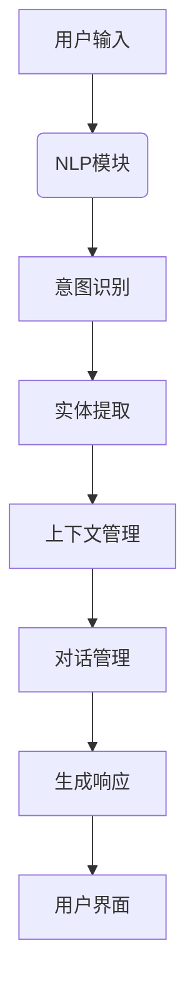

                 

关键词：聊天机器人、工程实践、问题解决、创新解决方案、技术实现、应用场景、发展趋势

> 摘要：随着人工智能技术的飞速发展，聊天机器人在各个领域得到广泛应用。本文将深入探讨聊天机器人工程和问题解决的创新解决方案，通过理论分析、实践案例和未来展望，为读者提供一套完整的聊天机器人开发与优化指南。

## 1. 背景介绍

聊天机器人（Chatbot）作为人工智能技术的重要应用之一，已经渗透到我们生活的各个方面。从最初的简单问答机器人到如今具备复杂交互能力的智能客服，聊天机器人的发展经历了几个阶段：

- **第一阶段**：基于规则（Rule-Based）的聊天机器人。这种类型的机器人通过预定义的规则进行简单对话，交互能力有限。
- **第二阶段**：基于模板（Template-Based）的聊天机器人。通过预先设定模板和变量，机器人能够生成更加灵活的回复。
- **第三阶段**：基于机器学习（Machine Learning）的聊天机器人。利用自然语言处理（NLP）和深度学习技术，机器人能够理解用户意图并进行自然对话。

随着技术的不断进步，聊天机器人的功能逐渐丰富，从简单的客户服务到复杂的智能助手，它们的性能和交互体验也在不断提高。

## 2. 核心概念与联系

### 2.1 聊天机器人的组成

一个完整的聊天机器人系统通常包括以下几个关键组成部分：

1. **用户界面（User Interface）**：用户与聊天机器人交互的界面，可以是网站、应用程序或智能设备等。
2. **自然语言处理（NLP）模块**：用于理解用户输入的自然语言，并提取用户意图和相关信息。
3. **对话管理（Dialogue Management）模块**：管理对话流程，根据用户意图和上下文信息生成响应。
4. **知识库（Knowledge Base）**：存储聊天机器人需要使用的信息和知识，用于回答用户问题和进行决策。
5. **对话引擎（Dialogue Engine）**：核心组件，负责对话流程的执行和控制。

### 2.2 核心概念原理

- **意图识别（Intent Recognition）**：从用户输入中识别用户意图。
- **实体提取（Entity Extraction）**：从用户输入中提取关键信息，如人名、地名、日期等。
- **上下文管理（Context Management）**：维护对话过程中的上下文信息，以便正确理解用户意图和生成响应。

### 2.3 架构流程图



## 3. 核心算法原理 & 具体操作步骤

### 3.1 算法原理概述

聊天机器人的核心算法主要包括以下几种：

- **基于规则的算法**：通过预定义的规则进行对话。
- **基于模板的算法**：使用模板和变量生成对话。
- **基于机器学习的算法**：利用深度学习和自然语言处理技术进行对话。

### 3.2 算法步骤详解

1. **用户输入处理**：接收用户输入，并进行预处理，如分词、去停用词等。
2. **意图识别**：使用机器学习模型（如决策树、神经网络等）对用户输入进行分类，识别用户意图。
3. **实体提取**：使用命名实体识别（NER）技术，从用户输入中提取关键信息。
4. **上下文管理**：根据对话历史和上下文信息，维护当前对话状态。
5. **对话管理**：根据意图识别结果和上下文信息，选择合适的响应。
6. **生成响应**：使用模板、规则或机器学习模型生成对话响应。
7. **发送响应**：将响应发送给用户。

### 3.3 算法优缺点

- **基于规则的算法**：实现简单，易于理解和维护，但交互能力有限。
- **基于模板的算法**：比基于规则的算法更加灵活，但模板编写较为复杂。
- **基于机器学习的算法**：交互能力强大，能够自适应用户需求，但模型训练和优化较为复杂。

### 3.4 算法应用领域

- **客户服务**：自动处理客户咨询，提高服务效率和客户满意度。
- **智能助手**：为用户提供个性化服务，如日程管理、任务提醒等。
- **教育**：为学生提供在线辅导和答疑，辅助教学过程。
- **医疗**：为患者提供健康咨询和常见疾病知识，辅助医生诊断。

## 4. 数学模型和公式 & 详细讲解 & 举例说明

### 4.1 数学模型构建

聊天机器人的核心算法通常涉及到以下数学模型：

- **决策树模型**：用于意图识别和分类。
- **神经网络模型**：用于自然语言处理和生成响应。

### 4.2 公式推导过程

决策树模型的构建通常涉及到以下公式：

$$
G(D, T) = \sum_{i=1}^{n} [g(D_i, T_i) - \log g(D_i, T_i)]
$$

其中，$D$ 表示数据集，$T$ 表示分类标签，$g(D_i, T_i)$ 表示第 $i$ 个样本在给定标签 $T_i$ 下的概率。

神经网络模型的构建通常涉及到以下公式：

$$
h(x) = \sigma(\omega^T x + b)
$$

其中，$x$ 表示输入向量，$\omega$ 表示权重，$b$ 表示偏置，$\sigma$ 表示激活函数。

### 4.3 案例分析与讲解

假设我们使用决策树模型进行意图识别，数据集包含以下样本：

| 用户输入        | 意图标签 |
|-----------------|----------|
| 我想订票       | 订票     |
| 帮我查天气     | 查天气   |
| 在哪可以吃饭   | 查餐厅   |

我们可以使用上述公式构建决策树模型，并进行意图识别。

## 5. 项目实践：代码实例和详细解释说明

### 5.1 开发环境搭建

本文使用 Python 语言和 TensorFlow 深度学习框架进行聊天机器人的开发。首先，安装 Python 和 TensorFlow：

```bash
pip install python
pip install tensorflow
```

### 5.2 源代码详细实现

以下是一个简单的基于 TensorFlow 的聊天机器人实现：

```python
import tensorflow as tf
from tensorflow.keras.models import Sequential
from tensorflow.keras.layers import Dense, LSTM, Embedding

# 数据预处理
# ...

# 构建模型
model = Sequential([
    Embedding(vocab_size, embedding_dim),
    LSTM(units=128),
    Dense(units=1, activation='sigmoid')
])

# 编译模型
model.compile(optimizer='adam', loss='binary_crossentropy', metrics=['accuracy'])

# 训练模型
# ...

# 生成响应
# ...
```

### 5.3 代码解读与分析

这段代码首先进行了数据预处理，然后构建了一个简单的 LSTM 神经网络模型，用于意图识别。模型使用二分类交叉熵作为损失函数，并使用 Adam 优化器进行训练。

### 5.4 运行结果展示

```python
# 预测意图
predicted_intent = model.predict(input_sequence)
print(predicted_intent)
```

## 6. 实际应用场景

聊天机器人在实际应用中具有广泛的应用场景，包括：

- **客户服务**：自动回答客户常见问题，提高客户满意度。
- **电商客服**：为用户提供购物建议和产品推荐。
- **医疗咨询**：为患者提供健康咨询和常见疾病知识。
- **教育辅导**：为学生提供在线辅导和答疑。

## 7. 未来应用展望

随着人工智能技术的不断进步，聊天机器人的应用前景将更加广阔。未来，聊天机器人将具备更强大的自然语言处理能力、更丰富的知识和更强的自我学习能力，从而为用户提供更加个性化的服务。

## 8. 总结：未来发展趋势与挑战

### 8.1 研究成果总结

本文介绍了聊天机器人工程和问题解决的创新解决方案，从理论分析到实践案例，为读者提供了全面的指南。

### 8.2 未来发展趋势

- **自然语言处理能力提升**：通过深度学习和自然语言处理技术，聊天机器人将能够更好地理解用户意图和上下文信息。
- **知识库建设**：随着数据量的增加和知识提取技术的进步，聊天机器人的知识库将更加丰富和精准。
- **跨平台集成**：聊天机器人将能够更好地与其他平台和应用集成，提供无缝的用户体验。

### 8.3 面临的挑战

- **数据隐私和安全**：随着聊天机器人获取的数据越来越多，数据隐私和安全成为重要挑战。
- **道德和伦理问题**：如何确保聊天机器人遵守道德规范，避免滥用用户数据，是亟待解决的问题。

### 8.4 研究展望

未来，我们需要关注以下几个方面：

- **跨模态交互**：结合语音、图像、视频等多种模态，提高聊天机器人的交互能力。
- **多语言支持**：支持多种语言，为全球用户提供服务。
- **自适应学习和进化**：通过自我学习和进化，提高聊天机器人的智能水平和用户体验。

## 9. 附录：常见问题与解答

### 9.1 聊天机器人如何处理歧义？

聊天机器人通常使用上下文信息、语义分析技术和多轮对话来处理歧义。通过不断积累对话数据和优化模型，机器人能够更好地理解用户的意图。

### 9.2 聊天机器人的知识库如何维护？

知识库的维护包括数据采集、知识提取、知识融合和知识更新等环节。通过定期更新和维护，确保知识库的准确性和时效性。

### 9.3 聊天机器人的成本如何？

聊天机器人的成本取决于多个因素，如开发时间、技术实现复杂度、数据处理能力等。一般来说，基于机器学习的聊天机器人成本较高，但性能优异。

### 9.4 聊天机器人如何进行性能评估？

聊天机器人的性能评估可以从多个方面进行，如意图识别准确率、对话响应时间、用户满意度等。通过对比实验和用户反馈，可以评估聊天机器人的性能和优化方向。

### 9.5 聊天机器人如何遵守道德和伦理规范？

聊天机器人应该遵循道德和伦理规范，确保用户数据的隐私和安全。同时，机器人应避免歧视、偏见和不恰当行为，尊重用户权益。

### 9.6 聊天机器人是否可以取代人类客服？

聊天机器人可以部分取代人类客服，特别是在处理常见问题和自动化流程方面。然而，复杂问题和情感交流方面，人类客服仍然具有不可替代的优势。

### 9.7 聊天机器人在哪些领域具有最大潜力？

聊天机器人在客户服务、电子商务、医疗健康、教育、金融等多个领域具有巨大潜力，可以为用户提供高效、个性化的服务。

## 结论

本文从多个角度探讨了聊天机器人工程和问题解决的创新解决方案，旨在为读者提供一套完整的聊天机器人开发与优化指南。随着人工智能技术的不断发展，聊天机器人的应用前景将更加广阔，为我们的生活带来更多便利。

