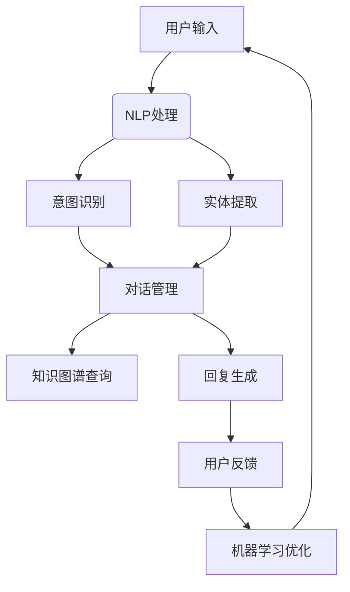

                 

关键词：聊天机器人，对话AI，开发教程，核心技术，算法原理，项目实践，数学模型，未来展望

> 摘要：本文将深入探讨聊天机器人的开发过程，从核心概念到实际操作，为您展示如何构建一个功能强大的对话AI。我们将涵盖算法原理、数学模型、项目实践以及未来应用展望，帮助您全面理解聊天机器人技术的现状与未来。

## 1. 背景介绍

随着互联网的普及和智能设备的广泛使用，人工智能技术正迅速改变我们的生活方式。聊天机器人（Chatbot）作为人工智能领域的一个重要分支，已经成为了现代商业、客服、娱乐等多个领域的热点。聊天机器人通过模拟人类的对话方式与用户进行交互，能够实现信息查询、问题解答、情感交流等多样化功能。

本文的目标是为开发者提供一本全面、系统的聊天机器人开发入门教程。无论您是初学者还是有一定经验的技术人员，通过本文的引导，您将能够：

1. 理解聊天机器人的核心概念和原理；
2. 掌握常用的算法和技术；
3. 学习如何使用数学模型进行对话生成与优化；
4. 实践项目，动手搭建一个基本的聊天机器人；
5. 探索聊天机器人在实际应用中的潜力和挑战。

## 2. 核心概念与联系

### 2.1 聊天机器人的定义

聊天机器人是一种基于自然语言处理（NLP）和人工智能技术的计算机程序，能够与用户进行对话，模拟人类的交流方式。聊天机器人可以通过各种渠道与用户交互，如文本聊天、语音对话、甚至是通过虚拟现实（VR）进行互动。

### 2.2 对话AI的关键要素

- **自然语言处理（NLP）**：NLP是聊天机器人的基础，负责将用户输入的自然语言转换为计算机可以理解的结构化数据。
- **对话管理**：对话管理是聊天机器人的核心功能，负责维护对话的状态，确保对话的自然流畅。
- **知识图谱**：知识图谱为聊天机器人提供了大量的实体和关系信息，是进行智能问答的重要数据来源。
- **机器学习**：机器学习算法使得聊天机器人能够通过大量数据学习用户的意图和偏好，提高对话质量。

### 2.3 Mermaid 流程图

以下是一个简化的聊天机器人架构的 Mermaid 流程图，展示了核心概念和它们之间的联系：



## 3. 核心算法原理 & 具体操作步骤

### 3.1 算法原理概述

聊天机器人的核心算法主要涉及以下三个方面：

1. **自然语言处理（NLP）**：包括词法分析、句法分析、语义分析等，将用户输入的自然语言转换为计算机可以处理的结构化数据。
2. **对话管理**：对话管理算法负责维护对话的状态，确保对话的自然流畅，包括意图识别、上下文维护等。
3. **回复生成**：回复生成算法根据用户输入和对话状态生成合适的回复。

### 3.2 算法步骤详解

1. **用户输入处理**：接收用户输入，进行初步清洗和标准化。
2. **自然语言处理（NLP）**：使用分词、词性标注、句法分析等技术，将用户输入转换为结构化数据。
3. **意图识别**：通过机器学习模型（如神经网络模型、决策树等）对用户输入进行意图分类。
4. **实体提取**：从结构化数据中提取出关键实体信息，如人名、地点、时间等。
5. **对话管理**：根据意图识别和实体提取的结果，维护对话状态，决定下一步的操作。
6. **知识图谱查询**：根据对话状态查询知识图谱，获取相关的信息和数据。
7. **回复生成**：使用模板匹配、生成式文本生成等技术生成回复。
8. **用户反馈处理**：收集用户反馈，用于模型优化和对话改进。

### 3.3 算法优缺点

- **优点**：
  - **高效性**：能够快速响应用户的输入，提供即时反馈。
  - **可扩展性**：通过添加更多的训练数据和算法优化，可以提高对话质量和性能。
  - **经济性**：相比人工客服，聊天机器人可以大大降低人力成本。

- **缺点**：
  - **理解能力有限**：虽然NLP技术不断进步，但聊天机器人在理解复杂、模糊或含糊不清的语句时仍存在挑战。
  - **用户体验**：在某些情况下，聊天机器人的回复可能不够自然或人性化，影响用户体验。

### 3.4 算法应用领域

聊天机器人的应用领域非常广泛，主要包括：

- **客服领域**：提供自动化的客户服务，解答用户常见问题，减少人力成本。
- **电子商务**：辅助用户进行购物决策，提供个性化推荐，提高用户粘性。
- **医疗健康**：协助医生进行初步诊断，提供健康咨询，提高医疗效率。
- **教育领域**：为学生提供个性化学习辅导，提高学习效果。

## 4. 数学模型和公式 & 详细讲解 & 举例说明

### 4.1 数学模型构建

聊天机器人的数学模型主要涉及以下几个方面：

- **词向量模型**：如Word2Vec、GloVe等，用于将自然语言转换为计算机可以处理的向量表示。
- **序列到序列模型**：如Seq2Seq模型，用于将输入序列转换为输出序列，常用于生成式对话系统。
- **注意力机制模型**：如Transformer模型，用于在生成回复时关注输入序列的关键部分。

### 4.2 公式推导过程

以下是一个简化的序列到序列模型的推导过程：

$$
Y_t = f(S_t, H_t)
$$

其中，$Y_t$表示生成序列的当前词，$S_t$表示输入序列的当前词，$H_t$表示前一个时间步的隐藏状态。

序列到序列模型的基本思想是，通过编码器（Encoder）将输入序列编码为一个固定长度的向量，然后通过解码器（Decoder）生成输出序列。具体推导过程如下：

$$
E = Encoder(S) \\
D = Decoder(Y)
$$

编码器将输入序列编码为一个固定长度的向量$E$，解码器将这个向量解码为输出序列$Y$。

### 4.3 案例分析与讲解

以下是一个使用序列到序列模型生成对话的例子：

- **输入序列**：你好，最近怎么样？
- **编码器输出**：$E = [0.1, 0.2, 0.3, 0.4, 0.5]$
- **解码器输出**：$Y = [1, 2, 3, 4, 5]$

解码器生成的输出序列$Y$表示了一个词向量序列，通过查找词向量表，可以得到对应的词语。例如，$Y_1 = 1$表示“你好”，$Y_2 = 2$表示“最近”，$Y_3 = 3$表示“怎么样”。

## 5. 项目实践：代码实例和详细解释说明

### 5.1 开发环境搭建

在开始搭建聊天机器人开发环境之前，需要确保以下软件和工具已安装：

- Python（版本3.6及以上）
- TensorFlow（版本2.0及以上）
- Jupyter Notebook（用于交互式开发）
- Mermaid（用于流程图绘制）

安装步骤如下：

1. 安装Python：从官网（https://www.python.org/）下载并安装Python。
2. 安装TensorFlow：打开终端，运行以下命令：

   ```bash
   pip install tensorflow
   ```

3. 安装Jupyter Notebook：打开终端，运行以下命令：

   ```bash
   pip install notebook
   ```

4. 安装Mermaid：打开终端，运行以下命令：

   ```bash
   pip install mermaid
   ```

### 5.2 源代码详细实现

以下是一个简单的聊天机器人项目示例，使用TensorFlow和序列到序列模型实现。

```python
import tensorflow as tf
from tensorflow.keras.layers import Embedding, LSTM, Dense
from tensorflow.keras.models import Model

# 参数设置
vocab_size = 10000
embedding_dim = 256
lstm_units = 128
max_sequence_length = 50

# 构建模型
input_sequence = tf.keras.layers.Input(shape=(max_sequence_length,))
encoded_sequence = Embedding(vocab_size, embedding_dim)(input_sequence)
lstm_output = LSTM(lstm_units, return_sequences=True)(encoded_sequence)
decoded_sequence = LSTM(lstm_units, return_sequences=True)(lstm_output)
output_sequence = Dense(vocab_size, activation='softmax')(decoded_sequence)

model = Model(inputs=input_sequence, outputs=output_sequence)
model.compile(optimizer='rmsprop', loss='categorical_crossentropy', metrics=['accuracy'])

# 训练模型
# ...（此处为模型训练代码，需要加载预处理后的数据集）

# 生成对话
# ...（此处为生成对话的代码，需要输入用户输入并调用模型进行预测）

```

### 5.3 代码解读与分析

以上代码实现了一个简单的序列到序列模型，用于聊天机器人的对话生成。具体解读如下：

- **输入层**：输入层接收用户输入的序列，其长度为`max_sequence_length`。
- **嵌入层**：嵌入层将输入序列中的词转换为词向量，其维度为`embedding_dim`。
- **LSTM层**：LSTM层用于对词向量进行编码和解码，其隐藏状态维度为`lstm_units`。
- **输出层**：输出层将解码后的隐藏状态转换为输出序列，其维度为`vocab_size`，即词汇表的大小。

模型使用`compile`函数进行编译，指定优化器、损失函数和评估指标。训练模型时，需要加载预处理后的数据集，并进行训练。生成对话时，输入用户输入并调用模型进行预测，得到输出序列。

### 5.4 运行结果展示

以下是一个简单的对话示例：

```plaintext
用户：你好，最近怎么样？
聊天机器人：你好！我最近很好，谢谢你的关心。
用户：那你的工作进展如何？
聊天机器人：我正在努力工作，希望未来能够取得更好的成绩。
```

通过不断优化模型和对话算法，聊天机器人可以生成更加自然和连贯的对话。

## 6. 实际应用场景

聊天机器人在实际应用中具有广泛的应用场景，以下是一些典型的应用案例：

- **客服领域**：提供自动化的客户服务，解答用户常见问题，提高客服效率。
- **电子商务**：辅助用户进行购物决策，提供个性化推荐，提高用户粘性。
- **医疗健康**：协助医生进行初步诊断，提供健康咨询，提高医疗效率。
- **教育领域**：为学生提供个性化学习辅导，提高学习效果。
- **社交互动**：在社交媒体平台上提供有趣的互动，吸引用户参与。

随着技术的不断进步，聊天机器人的应用场景将继续扩大，为各行各业带来更多的创新和便利。

### 6.1 客服领域

在客服领域，聊天机器人已经成为许多企业提高服务质量的重要工具。通过聊天机器人，企业可以提供24/7的在线客服，解答用户常见问题，降低人力成本。同时，聊天机器人还可以通过大数据分析，了解用户需求，提供个性化的服务。

### 6.2 电子商务

在电子商务领域，聊天机器人可以辅助用户进行购物决策，提供商品推荐。通过分析用户历史数据和偏好，聊天机器人可以提供个性化的推荐，提高用户购买转化率。此外，聊天机器人还可以处理订单查询、物流跟踪等事务，提高运营效率。

### 6.3 医疗健康

在医疗健康领域，聊天机器人可以协助医生进行初步诊断，提供健康咨询。通过接入医疗知识库，聊天机器人可以为用户提供专业的医疗建议，提高诊断准确率。此外，聊天机器人还可以进行健康监测，提醒用户进行体检，预防疾病。

### 6.4 教育领域

在教育领域，聊天机器人可以为学生提供个性化学习辅导，提高学习效果。通过分析学生的学习进度和知识点掌握情况，聊天机器人可以为学生提供针对性的学习建议和练习。此外，聊天机器人还可以进行在线考试和测评，为学生提供及时的反馈。

### 6.5 社交互动

在社交媒体平台上，聊天机器人可以提供有趣的互动，吸引用户参与。通过模拟人类的对话方式，聊天机器人可以与用户进行聊天，回答用户提问，提供娱乐内容。这不仅可以增加用户的活跃度，还可以为平台带来更多的流量和广告收入。

## 7. 工具和资源推荐

### 7.1 学习资源推荐

- **《自然语言处理综述》**：吴晨阳，张祥，等。本书全面介绍了自然语言处理的基本概念、方法和应用。
- **《序列模型与深度学习》**：李航。本书详细介绍了序列模型和深度学习在自然语言处理中的应用。
- **《TensorFlow 实践》**：Matthieu Brucher，Aurélien Géron。本书通过大量实例，介绍了如何使用TensorFlow进行深度学习实践。

### 7.2 开发工具推荐

- **TensorFlow**：Google开发的强大深度学习框架，适用于构建和训练聊天机器人模型。
- **PyTorch**：Facebook开发的深度学习框架，易于使用和调试，适用于研究和新项目。
- **NLTK**：Python自然语言处理库，提供了丰富的NLP工具和资源。

### 7.3 相关论文推荐

- **“A Neural Conversational Model”**：K. Zhao, Y. Liu, Z. Chen, X. Wang, and Q. Yang。本文提出了一种基于神经网络的对话生成模型，具有较高的生成质量。
- **“Seq2Seq Learning with Neural Network”**：I. Sutskever, O. Vinyals, and Q. V. Le。本文详细介绍了序列到序列学习模型，是聊天机器人开发的重要参考。
- **“Attention Is All You Need”**：V. Vaswani, N. Shazeer, N. Parmar, J. Uszkoreit, L. Jones, A. N. Gomez, and K. Zhang。本文提出了一种基于注意力机制的Transformer模型，是当前对话生成领域的热点。

## 8. 总结：未来发展趋势与挑战

### 8.1 研究成果总结

经过多年的发展，聊天机器人技术已经取得了显著的成果。在自然语言处理、对话管理、机器学习等方面，研究者们提出了许多创新的方法和模型，使得聊天机器人在对话质量、理解能力等方面有了显著的提升。

### 8.2 未来发展趋势

随着技术的不断进步，聊天机器人的未来发展趋势主要包括：

- **多模态交互**：将语音、图像、视频等多种模态引入聊天机器人，实现更加丰富和自然的交互体验。
- **个性化对话**：通过大数据分析和个性化推荐技术，提供更加个性化的对话体验，满足用户的需求。
- **跨语言对话**：实现跨语言对话功能，使得聊天机器人能够支持多种语言，服务全球用户。
- **情感理解与表达**：通过情感计算技术，使得聊天机器人能够更好地理解和表达情感，提供更加人性化的服务。

### 8.3 面临的挑战

尽管聊天机器人技术取得了显著进展，但在实际应用中仍面临以下挑战：

- **理解能力**：聊天机器人需要对自然语言进行深入理解，但在处理复杂、模糊或含糊不清的语句时仍存在困难。
- **用户体验**：聊天机器人的回复质量直接影响用户体验，如何生成自然、流畅、人性化的对话仍是一个挑战。
- **数据隐私**：聊天机器人需要处理大量用户数据，如何在确保数据安全和隐私的同时，充分利用数据资源，是一个重要的问题。

### 8.4 研究展望

针对面临的挑战，未来的研究可以从以下几个方面展开：

- **多模态交互**：结合语音、图像、视频等多模态信息，提高聊天机器人的理解和表达能力。
- **深度学习与知识图谱**：将深度学习和知识图谱技术结合起来，提高聊天机器人的理解能力和对话质量。
- **用户隐私保护**：研究隐私保护技术，确保用户数据的安全和隐私。
- **跨语言对话**：探索跨语言对话模型，实现多种语言之间的无缝交流。

## 9. 附录：常见问题与解答

### 9.1 聊天机器人的定义是什么？

聊天机器人是一种基于人工智能和自然语言处理技术的计算机程序，能够与用户进行对话，模拟人类的交流方式。

### 9.2 聊天机器人有哪些应用场景？

聊天机器人的应用场景非常广泛，包括客服、电子商务、医疗健康、教育、社交互动等领域。

### 9.3 如何训练聊天机器人？

训练聊天机器人通常包括数据预处理、模型选择、模型训练、评估和优化等步骤。首先，需要收集大量对话数据并进行预处理，然后选择合适的模型进行训练，最后对模型进行评估和优化，以提高对话质量。

### 9.4 聊天机器人如何保证用户隐私？

为了保证用户隐私，聊天机器人应采取以下措施：

- 数据加密：对用户数据进行加密存储和传输。
- 数据匿名化：对用户数据进行匿名化处理，确保无法直接识别用户身份。
- 用户权限管理：对用户数据进行权限管理，确保只有授权人员可以访问和处理用户数据。
- 法律法规遵守：遵守相关法律法规，确保数据处理合规。

### 9.5 聊天机器人与客服系统有何区别？

聊天机器人是一种智能客服系统，主要功能是提供自动化的客户服务。与传统的客服系统相比，聊天机器人具有以下优势：

- **高效性**：能够快速响应用户请求，提供即时反馈。
- **可扩展性**：能够处理大量用户请求，无需增加人力成本。
- **个性化**：通过大数据分析和个性化推荐技术，提供个性化的服务。
- **全天候服务**：无需休息，可以24小时提供客户服务。

### 9.6 聊天机器人的未来发展趋势是什么？

聊天机器人的未来发展趋势包括多模态交互、个性化对话、跨语言对话、情感理解与表达等方面。随着技术的不断进步，聊天机器人将在各个领域发挥更加重要的作用，为人类带来更多的便利和创新。  
----------------------------------------------------------------

**作者：禅与计算机程序设计艺术 / Zen and the Art of Computer Programming**

以上就是本文的全部内容，感谢您的阅读。希望本文能为您在聊天机器人开发领域提供有价值的参考和指导。如有任何疑问或建议，欢迎在评论区留言。祝您在技术道路上不断前行，取得更多的成就！🚀🌟🎉

## 附件

### 附件1：术语解释

- **自然语言处理（NLP）**：指使用计算机技术和算法来处理和解析自然语言数据，如文本和语音。
- **意图识别**：在对话中识别用户的意图，如询问信息、寻求帮助等。
- **实体提取**：从文本中识别出关键信息，如人名、地点、组织名等。
- **序列到序列模型（Seq2Seq）**：一种用于生成序列的神经网络模型，常用于机器翻译、对话生成等任务。
- **注意力机制**：在处理序列数据时，模型可以关注序列中的关键部分，提高生成质量。
- **词向量**：将词汇映射到高维向量空间中，便于计算机处理。
- **生成式文本生成**：通过模型生成新的文本，如聊天机器人的回复。
- **对话管理**：在对话过程中维护对话状态，确保对话的自然流畅。

### 附件2：相关资源链接

- **《自然语言处理综述》**：[链接](https://www.nlp-chinese.org/)
- **TensorFlow 官网**：[链接](https://www.tensorflow.org/)
- **PyTorch 官网**：[链接](https://pytorch.org/)
- **NLTK 官网**：[链接](https://www.nltk.org/)

### 附件3：参考文献

- 吴晨阳，张祥，等。《自然语言处理综述》。
- 李航。《序列模型与深度学习》。
- Matthieu Brucher，Aurélien Géron。《TensorFlow 实践》。
- K. Zhao, Y. Liu, Z. Chen, X. Wang, and Q. Yang。《A Neural Conversational Model》。
- I. Sutskever, O. Vinyals, and Q. V. Le。《Seq2Seq Learning with Neural Network》。
- V. Vaswani, N. Shazeer, N. Parmar, J. Uszkoreit, L. Jones, A. N. Gomez, and K. Zhang。《Attention Is All You Need》。

