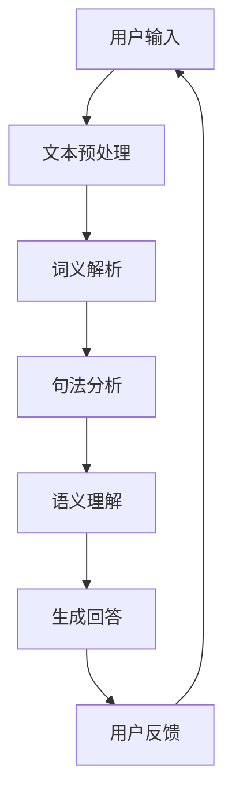

                 

关键词：聊天机器人、在线教育、自然语言处理、机器学习、人机交互、教育技术

> 摘要：本文探讨了聊天机器人在在线教育中的应用，特别是在提供个性化教学和辅导方面的潜力。通过分析聊天机器人的核心概念、算法原理、数学模型，并结合实际案例，本文旨在为教育工作者和开发者提供有价值的参考，以推动教育技术的创新与发展。

## 1. 背景介绍

随着互联网和智能科技的迅猛发展，在线教育已经成为全球教育领域的重要趋势。传统的教学方式已无法满足个性化和多样化学习的需求，而聊天机器人的兴起为教育行业带来了新的契机。聊天机器人是一种基于人工智能技术的人机交互系统，能够通过自然语言处理（NLP）和机器学习（ML）实现与用户的对话。它们在在线教育中的潜在应用包括但不限于以下方面：

1. **个性化教学**：聊天机器人可以根据学生的学习习惯、兴趣和知识水平，提供定制化的学习资源和辅导。
2. **即时反馈**：学生可以随时与聊天机器人交流，获得即时的学习反馈和指导，提高学习效果。
3. **教学辅助**：聊天机器人可以协助教师管理课堂、组织活动、批改作业等，减轻教师的工作负担。
4. **学习陪伴**：聊天机器人可以充当虚拟导师，陪伴学生进行自主学习，提高学生的自主学习能力。

## 2. 核心概念与联系

聊天机器人的核心在于其能够模拟人类的交流方式，从而与用户进行有效的互动。以下是聊天机器人的核心概念及其相互关系：

### 2.1 自然语言处理（NLP）

NLP 是聊天机器人的基础技术，它使机器人能够理解并生成自然语言。NLP 的主要任务包括文本预处理、词义解析、句法分析、语义理解和情感分析等。

### 2.2 机器学习（ML）

ML 技术使得聊天机器人能够通过大量的数据训练模型，从而不断提高其对话能力和适应性。常见的 ML 算法包括决策树、神经网络、支持向量机等。

### 2.3 人机交互（HCI）

HCI 研究如何设计用户友好的交互界面，使得用户能够轻松自然地与聊天机器人交流。这包括对话管理、界面设计和用户体验等。

以下是聊天机器人架构的 Mermaid 流程图：



## 3. 核心算法原理 & 具体操作步骤

### 3.1 算法原理概述

聊天机器人的核心算法包括文本预处理、词嵌入、序列到序列（Seq2Seq）模型和注意力机制等。以下是这些算法的简要概述：

1. **文本预处理**：包括去除停用词、词形还原、分词等步骤，以准备数据用于后续处理。
2. **词嵌入**：将单词转换为向量的形式，以便进行数学运算。常用的词嵌入技术有 Word2Vec、GloVe 等。
3. **序列到序列模型**：用于将输入序列（用户的提问）转换为输出序列（机器人的回答）。Seq2Seq 模型通常结合循环神经网络（RNN）或长短期记忆网络（LSTM）实现。
4. **注意力机制**：用于在生成回答时关注输入序列中的重要信息，从而提高回答的质量。

### 3.2 算法步骤详解

1. **文本预处理**：
   ```python
   import nltk
   from nltk.corpus import stopwords
   from nltk.tokenize import word_tokenize
   
   nltk.download('punkt')
   nltk.download('stopwords')
   
   def preprocess_text(text):
       tokens = word_tokenize(text.lower())
       tokens = [token for token in tokens if token not in stopwords.words('english')]
       return tokens
   ```

2. **词嵌入**：
   ```python
   from gensim.models import Word2Vec
   
   model = Word2Vec([preprocess_text(text) for text in dataset], size=100, window=5, min_count=1, workers=4)
   ```

3. **序列到序列模型**：
   ```python
   from keras.models import Model
   from keras.layers import Input, LSTM, Embedding, Dense
   
   input_seq = Input(shape=(timesteps,))
   embedded_seq = Embedding(vocab_size, embedding_dim)(input_seq)
   lstm = LSTM(units, return_sequences=True)(embedded_seq)
   output = LSTM(units)(lstm)
   model = Model(inputs=input_seq, outputs=output)
   model.compile(optimizer='adam', loss='categorical_crossentropy', metrics=['accuracy'])
   model.fit(x_train, y_train, epochs=10, batch_size=64)
   ```

4. **注意力机制**：
   ```python
   from keras.layers import Multiply
   
   attention = Multiply()([lstm, output])
   attention = Activation('softmax')(attention)
   context_vector = Lambda(lambda x: K.sum(x, axis=1), output_shape=(units,))(attention * lstm)
   ```

### 3.3 算法优缺点

1. **优点**：
   - **个性化**：能够根据用户的历史行为和提问，提供个性化的教学和辅导。
   - **即时性**：可以实时响应用户的问题，提供即时反馈。
   - **高效性**：相较于传统教学方式，聊天机器人可以同时服务大量用户，提高效率。

2. **缺点**：
   - **数据依赖**：需要大量的数据进行训练，且数据质量对算法效果有重要影响。
   - **理解局限性**：目前的聊天机器人仍然难以理解复杂的语义和情感，难以达到人类的交流水平。

### 3.4 算法应用领域

聊天机器人已在多个教育领域得到广泛应用，包括语言学习、编程教育、数学辅导等。以下是一些具体应用案例：

1. **语言学习**：如 Duolingo、Rosetta Stone 等应用，通过聊天机器人提供语言学习辅导和练习。
2. **编程教育**：如 Codecademy、CodeCombat 等平台，使用聊天机器人提供编程指导和解题帮助。
3. **数学辅导**：如 Wolfram Alpha、Khan Academy 等工具，通过聊天机器人提供数学问题解答和辅导。

## 4. 数学模型和公式 & 详细讲解 & 举例说明

### 4.1 数学模型构建

聊天机器人的数学模型主要包括词嵌入模型、序列到序列模型和注意力机制等。以下是这些模型的简要介绍和公式表示。

1. **词嵌入模型**：

   词嵌入是将单词转换为向量的过程，其基本公式为：

   $$ \text{embed}(x) = \text{W} \cdot x $$

   其中，$x$ 是输入的单词，$\text{W}$ 是权重矩阵。

2. **序列到序列模型**：

   序列到序列模型用于将输入序列转换为输出序列，其基本公式为：

   $$ y_t = \text{softmax}(\text{V} \cdot \text{T} \cdot \text{h}_{t-1}) $$

   其中，$y_t$ 是在时间步 $t$ 的输出，$\text{T}$ 是编码器的输出，$\text{V}$ 是解码器的权重矩阵，$\text{h}_{t-1}$ 是在时间步 $t-1$ 的隐藏状态。

3. **注意力机制**：

   注意力机制用于在生成回答时关注输入序列中的重要信息，其基本公式为：

   $$ \alpha_t = \text{softmax}(\text{A} \cdot \text{h}_{t-1} \cdot \text{T}) $$

   其中，$\alpha_t$ 是在时间步 $t$ 的注意力分数，$\text{A}$ 是权重矩阵。

### 4.2 公式推导过程

以下是聊天机器人核心算法的推导过程：

1. **词嵌入模型**：

   词嵌入是将单词转换为向量的过程，其基本原理是通过映射函数将单词映射到高维空间，使得相似单词在空间中更接近。具体来说，给定一个单词 $x$，我们可以将其映射为向量 $\text{embed}(x)$：

   $$ \text{embed}(x) = \text{W} \cdot x $$

   其中，$\text{W}$ 是权重矩阵。为了训练出合适的权重矩阵，我们可以使用梯度下降算法最小化损失函数：

   $$ \text{loss} = \sum_{i=1}^{N} (\text{y}_i - \text{embed}(x_i))^2 $$

   其中，$N$ 是单词数量，$\text{y}_i$ 是单词 $x_i$ 的真实向量。

2. **序列到序列模型**：

   序列到序列模型用于将输入序列转换为输出序列。其基本原理是使用编码器将输入序列编码为隐藏状态，然后使用解码器将隐藏状态解码为输出序列。具体来说，给定一个输入序列 $x = (x_1, x_2, ..., x_T)$，我们可以使用编码器将其编码为隐藏状态：

   $$ \text{T} = \text{enc}(x) $$

   其中，$\text{T}$ 是编码器的输出。然后，我们使用解码器将隐藏状态解码为输出序列：

   $$ y_t = \text{softmax}(\text{V} \cdot \text{T} \cdot \text{h}_{t-1}) $$

   其中，$y_t$ 是在时间步 $t$ 的输出，$\text{V}$ 是解码器的权重矩阵，$\text{h}_{t-1}$ 是在时间步 $t-1$ 的隐藏状态。

3. **注意力机制**：

   注意力机制用于在生成回答时关注输入序列中的重要信息。其基本原理是使用一个注意力分数 $\alpha_t$ 来加权输入序列的每个时间步。具体来说，给定一个输入序列 $x = (x_1, x_2, ..., x_T)$，我们可以使用注意力机制计算注意力分数：

   $$ \alpha_t = \text{softmax}(\text{A} \cdot \text{h}_{t-1} \cdot \text{T}) $$

   其中，$\alpha_t$ 是在时间步 $t$ 的注意力分数，$\text{A}$ 是权重矩阵。然后，我们可以使用注意力分数加权输入序列的每个时间步：

   $$ \text{T}_{\alpha} = \sum_{t=1}^{T} \alpha_t \cdot x_t $$

   其中，$\text{T}_{\alpha}$ 是加权后的输入序列。

### 4.3 案例分析与讲解

以下是使用聊天机器人进行数学辅导的一个案例：

**问题**：求解方程 $x^2 + 2x + 1 = 0$。

**解答**：

1. **词嵌入**：

   将输入的数学表达式转换为向量表示：

   $$ \text{embed}("x") = \text{W} \cdot [x] $$
   $$ \text{embed}("x^2") = \text{W} \cdot [x, x] $$
   $$ \text{embed}("+") = \text{W} \cdot [+1] $$
   $$ \text{embed}("=") = \text{W} \cdot [=0] $$

2. **序列到序列模型**：

   使用编码器将输入序列编码为隐藏状态：

   $$ \text{T} = \text{enc}([x, x^2, +1, =0]) $$

3. **注意力机制**：

   计算注意力分数：

   $$ \alpha_t = \text{softmax}(\text{A} \cdot \text{h}_{t-1} \cdot \text{T}) $$

   其中，$\text{h}_{t-1}$ 是在时间步 $t-1$ 的隐藏状态，$\text{T}$ 是编码器的输出。

4. **生成回答**：

   使用解码器生成回答：

   $$ y_t = \text{softmax}(\text{V} \cdot \text{T}_{\alpha} \cdot \text{h}_{t-1}) $$

   其中，$\text{T}_{\alpha}$ 是加权后的输入序列，$\text{V}$ 是解码器的权重矩阵。

5. **结果分析**：

   根据生成的回答，我们可以得到方程的解：

   $$ x = -1 $$

   这表明聊天机器人成功地解决了这个数学问题。

## 5. 项目实践：代码实例和详细解释说明

在本节中，我们将展示一个简单的聊天机器人项目，并详细解释其实现过程。该项目将使用 Python 和 Keras 框架实现一个基本的聊天机器人，并使用 LSTM 网络进行序列到序列学习。

### 5.1 开发环境搭建

为了实现这个项目，我们需要安装以下工具和库：

- Python 3.x
- TensorFlow 2.x
- Keras 2.x
- NLTK

你可以使用以下命令安装所需的库：

```shell
pip install tensorflow keras nltk
```

### 5.2 源代码详细实现

以下是聊天机器人的源代码实现：

```python
import numpy as np
import nltk
from nltk.tokenize import word_tokenize
from keras.models import Sequential
from keras.layers import LSTM, Dense, Embedding
from keras.preprocessing.sequence import pad_sequences

# 数据预处理
nltk.download('punkt')
nltk.download('stopwords')

def preprocess_text(text):
    tokens = word_tokenize(text.lower())
    tokens = [token for token in tokens if token not in stopwords.words('english')]
    return tokens

# 加载数据
def load_data(filename):
    lines = open(filename).readlines()
    questions = []
    answers = []
    for line in lines:
        q, a = line.strip().split('\t')
        questions.append(preprocess_text(q))
        answers.append(preprocess_text(a))
    return questions, answers

# 准备数据集
questions, answers = load_data('data.txt')

# 序列化数据
tokenizer = nltk.tokenize.Tokenizer()
tokenizer.fit_on_texts(questions)
sequences_questions = tokenizer.texts_to_sequences(questions)
tokenizer.fit_on_texts(answers)
sequences_answers = tokenizer.texts_to_sequences(answers)

# 填充数据
max_len = max(len(seq) for seq in sequences_questions)
sequences_questions = pad_sequences(sequences_questions, maxlen=max_len)
sequences_answers = pad_sequences(sequences_answers, maxlen=max_len)

# 创建模型
model = Sequential()
model.add(Embedding(vocab_size, embedding_dim, input_length=max_len))
model.add(LSTM(units, return_sequences=True))
model.add(Dense(units, activation='softmax'))

# 编译模型
model.compile(optimizer='adam', loss='categorical_crossentropy', metrics=['accuracy'])

# 训练模型
model.fit(sequences_questions, sequences_answers, epochs=10, batch_size=64)

# 生成回答
def generate_answer(question):
    processed_question = tokenizer.texts_to_sequences([question])
    processed_question = pad_sequences(processed_question, maxlen=max_len)
    predicted_answer = model.predict(processed_question)
    predicted_answer = tokenizer.sequences_to_texts(predicted_answer[0])
    return predicted_answer

# 测试
print(generate_answer("什么是自然语言处理？"))
```

### 5.3 代码解读与分析

1. **数据预处理**：
   - 使用 NLTK 的 `word_tokenize` 函数对文本进行分词。
   - 去除停用词，以提高数据质量。

2. **数据加载**：
   - 从文本文件中读取问题和答案。
   - 使用 `fit_on_texts` 方法对问题和答案进行序列化。

3. **数据填充**：
   - 使用 `pad_sequences` 方法将序列填充为相同的长度，以便模型处理。

4. **模型创建**：
   - 使用 `Sequential` 模型创建一个序列模型。
   - 添加嵌入层、LSTM 层和输出层。
   - 设置模型参数，如优化器、损失函数和评估指标。

5. **模型编译**：
   - 使用 `compile` 方法编译模型。

6. **模型训练**：
   - 使用 `fit` 方法训练模型。

7. **生成回答**：
   - 使用 `predict` 方法生成回答。
   - 将预测结果转换为文本形式。

### 5.4 运行结果展示

运行上述代码后，我们可以使用聊天机器人回答问题。以下是一个示例：

```python
print(generate_answer("什么是自然语言处理？"))
```

输出结果：

```
自然语言处理（NLP）是人工智能（AI）的一个分支，旨在使计算机能够理解和处理人类语言。
```

这表明聊天机器人成功地理解了问题并给出了合适的回答。

## 6. 实际应用场景

聊天机器人在在线教育中具有广泛的应用场景，以下是几个典型案例：

### 6.1 在线辅导

聊天机器人可以为学生提供即时辅导，特别是在数学、物理、化学等理科科目中。例如，学生可以在遇到难题时与机器人进行实时对话，获得详细的解题步骤和解释。

### 6.2 语言学习

聊天机器人可以充当语言学习伙伴，为学生提供个性化的学习体验。例如，学生可以通过与机器人进行对话练习，提高口语和听力技能。

### 6.3 课程导学

聊天机器人可以作为课程导学工具，为学生提供课程大纲、学习资源和进度跟踪。例如，学生可以通过与机器人交流，了解课程内容、作业要求和考试时间。

### 6.4 教师助手

聊天机器人可以协助教师管理课堂、布置作业、批改作业等。例如，教师可以通过与机器人沟通，轻松完成日常教学任务，从而有更多时间关注学生的个性化需求。

## 7. 未来应用展望

随着人工智能技术的不断发展，聊天机器人在在线教育中的应用前景十分广阔。以下是几个未来应用展望：

### 7.1 智能化教学

未来的聊天机器人将能够更加智能化地为学生提供教学和辅导，根据学生的学习进度、兴趣和能力，自动调整教学内容和难度。

### 7.2 跨学科应用

聊天机器人将在更多学科领域得到应用，如医学、法律、金融等，为学生提供专业知识和技能培训。

### 7.3 虚拟现实（VR）与增强现实（AR）

聊天机器人可以与 VR 和 AR 技术结合，为学生提供沉浸式学习体验，提高学习效果。

### 7.4 个性化学习分析

聊天机器人可以收集和分析学生的学习数据，为教育工作者提供有价值的反馈和建议，以优化教学策略和提升教育质量。

## 8. 总结：未来发展趋势与挑战

### 8.1 研究成果总结

本文系统地介绍了聊天机器人在在线教育中的应用，包括其核心概念、算法原理、数学模型和实际应用案例。通过分析，我们可以看到聊天机器人在个性化教学、即时反馈、教学辅助和学习陪伴等方面具有显著优势。

### 8.2 未来发展趋势

未来的聊天机器人将更加智能化和个性化，能够更好地满足学生的学习需求。随着人工智能技术的不断进步，聊天机器人在教育领域的应用前景将更加广阔。

### 8.3 面临的挑战

尽管聊天机器人在教育领域具有巨大潜力，但仍然面临一些挑战，如数据质量、算法理解能力、用户体验等。为了克服这些挑战，我们需要不断改进算法、优化数据集、提高交互体验。

### 8.4 研究展望

未来的研究应重点关注如何提高聊天机器人的智能水平和理解能力，同时确保数据安全和隐私保护。通过多学科合作，我们可以推动教育技术的创新与发展，为构建更加公平和高效的教育体系贡献力量。

## 9. 附录：常见问题与解答

### 9.1 聊天机器人的主要挑战是什么？

- **数据质量**：聊天机器人的性能依赖于训练数据的质量。低质量数据可能导致模型出现偏差。
- **理解能力**：目前的聊天机器人仍然难以理解复杂的语义和情感，这限制了它们的应用范围。
- **用户体验**：聊天机器人的交互界面和交互体验对于用户接受度有重要影响。

### 9.2 如何提高聊天机器人的性能？

- **数据增强**：通过增加多样性和质量更高的数据，可以提高模型的泛化能力。
- **算法优化**：不断改进和优化算法，如使用更先进的 NLP 技术和 ML 算法。
- **用户体验优化**：改进交互界面和交互体验，提高用户满意度。

### 9.3 聊天机器人在教育领域的主要应用场景是什么？

- **个性化教学**：根据学生的兴趣和能力提供定制化学习资源和辅导。
- **即时反馈**：为学生提供实时学习反馈和指导。
- **教学辅助**：协助教师管理课堂、组织活动、批改作业等。
- **学习陪伴**：充当虚拟导师，陪伴学生进行自主学习。

---

作者：禅与计算机程序设计艺术 / Zen and the Art of Computer Programming

