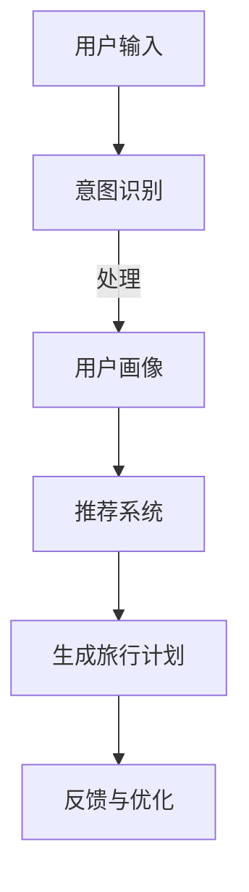

                 

关键词：聊天机器人，个性化旅行，旅行规划，推荐系统，人工智能，旅游业

> 摘要：本文将探讨如何利用聊天机器人技术，在旅游业中实现个性化旅行计划和建议。我们将介绍核心概念、算法原理、数学模型、项目实践，以及未来应用场景和挑战。本文旨在为读者提供关于聊天机器人旅游业发展的深入理解。

## 1. 背景介绍

旅游业是全球经济发展的重要驱动力，而随着互联网和移动设备的普及，旅游业正经历着数字化转型。个性化旅行计划成为当前旅游业的一个热点，因为每个旅行者的需求和偏好都是独特的。聊天机器人的崛起为旅游业带来了新的机遇和挑战，它们可以提供24/7的实时服务，处理大量的用户查询，并基于用户数据生成个性化的旅行建议。

个性化旅行计划不仅仅是提供酒店和航班预订服务，它还涉及行程规划、景点推荐、餐饮推荐、购物指南等多个方面。为了实现这些功能，聊天机器人需要具备强大的数据处理能力和高效的算法。

### 当前旅游业面临的挑战

- **多样化需求**：旅行者有不同的预算、兴趣和偏好，这使得传统的一刀切服务难以满足。
- **海量信息处理**：旅游业涉及的信息量庞大，如何快速准确地处理这些信息是一个挑战。
- **实时性**：旅行决策往往需要在短时间内做出，传统服务无法满足这种实时性要求。

### 聊天机器人在旅游业的潜力

- **个性化推荐**：聊天机器人可以通过分析用户的历史数据和实时输入，提供高度个性化的建议。
- **实时交互**：与用户的实时互动可以增强用户体验，提供更加贴心的服务。
- **多语言支持**：聊天机器人可以支持多种语言，为全球用户提供服务。

## 2. 核心概念与联系

### 聊天机器人基本概念

- **定义**：聊天机器人是一种模拟人类对话行为的计算机程序。
- **工作原理**：通过自然语言处理（NLP）和机器学习技术，理解用户输入并生成相应的回复。

### 个性化旅行计划的核心概念

- **用户画像**：基于用户的历史数据和行为，构建一个全面的用户画像。
- **推荐系统**：利用机器学习算法，根据用户画像推荐合适的旅行计划。

### 聊天机器人在个性化旅行计划中的应用架构

<|img|>/path/to/chatbot-architecture.png|聊天机器人架构|

### Mermaid 流程图



## 3. 核心算法原理 & 具体操作步骤

### 3.1 算法原理概述

聊天机器人在个性化旅行计划中主要涉及以下算法：

- **意图识别**：识别用户输入的目的和意图。
- **用户画像构建**：基于用户数据和用户互动信息，构建用户画像。
- **推荐系统**：根据用户画像和旅游数据，生成个性化的旅行计划。

### 3.2 算法步骤详解

#### 3.2.1 用户意图识别

1. **预处理**：清洗和标准化用户输入。
2. **词嵌入**：将文本转换为向量表示。
3. **模型训练**：使用机器学习算法（如神经网络）训练意图分类器。
4. **意图识别**：输入文本经过模型处理，输出用户意图。

#### 3.2.2 用户画像构建

1. **数据收集**：收集用户的历史数据和行为数据。
2. **特征工程**：提取用户行为的特征，如搜索历史、预订记录、评价等。
3. **画像构建**：使用机器学习算法（如聚类、协同过滤）构建用户画像。

#### 3.2.3 推荐系统

1. **旅游数据集构建**：收集和整理旅游相关数据，如景点信息、酒店评价等。
2. **模型训练**：使用机器学习算法（如协同过滤、矩阵分解）训练推荐模型。
3. **推荐生成**：根据用户画像和旅游数据，生成个性化的旅行计划。

### 3.3 算法优缺点

#### 优点：

- **高效性**：自动化处理大量用户请求。
- **个性化**：根据用户需求和偏好提供定制化服务。
- **实时性**：能够快速响应用户的需求。

#### 缺点：

- **准确率**：意图识别和推荐系统的准确率可能受到影响。
- **用户体验**：对于复杂查询，聊天机器人的理解可能有限。
- **隐私问题**：用户数据的安全性和隐私保护是一个重要挑战。

### 3.4 算法应用领域

- **在线旅游平台**：提供个性化旅游产品和服务。
- **旅行社**：辅助旅游顾问提供个性化旅行计划。
- **社交媒体**：推荐旅游相关内容，增加用户粘性。

## 4. 数学模型和公式 & 详细讲解 & 举例说明

### 4.1 数学模型构建

#### 4.1.1 用户画像构建

用户画像构建可以使用协同过滤算法，其基本模型如下：

$$
\text{User\_Score}(u, i) = \sum_{j \in \text{rated\_items}} r_{uj} \cdot \text{similarity}(i, j)
$$

其中，\( r_{uj} \) 表示用户 \( u \) 对项目 \( i \) 的评分，\( \text{similarity}(i, j) \) 表示项目 \( i \) 和 \( j \) 之间的相似度。

#### 4.1.2 推荐系统

推荐系统的数学模型可以使用矩阵分解算法，其基本模型如下：

$$
R = UV^T + E
$$

其中，\( R \) 是评分矩阵，\( U \) 和 \( V \) 分别是用户和项目的低维表示，\( E \) 是误差项。

### 4.2 公式推导过程

#### 4.2.1 协同过滤算法推导

我们使用矩阵分解的方法对协同过滤算法进行推导。给定评分矩阵 \( R \)，我们将其分解为两个矩阵 \( U \) 和 \( V \)：

$$
R = UV^T
$$

我们希望找到 \( U \) 和 \( V \) 使得预测误差最小：

$$
\min_{U,V} \sum_{i=1}^{m} \sum_{j=1}^{n} (r_{ij} - u_i \cdot v_j)^2
$$

通过梯度下降法，我们可以迭代更新 \( U \) 和 \( V \)：

$$
u_i \leftarrow u_i - \alpha \cdot (r_{ij} - u_i \cdot v_j) \cdot v_j
$$

$$
v_j \leftarrow v_j - \alpha \cdot (r_{ij} - u_i \cdot v_j) \cdot u_i
$$

#### 4.2.2 矩阵分解算法推导

矩阵分解的目标是将高维的评分矩阵分解为两个低维的矩阵 \( U \) 和 \( V \)。给定评分矩阵 \( R \)，我们希望找到 \( U \) 和 \( V \) 使得预测误差最小：

$$
\min_{U,V} \sum_{i=1}^{m} \sum_{j=1}^{n} (r_{ij} - u_i \cdot v_j)^2
$$

同样，我们可以通过梯度下降法进行迭代更新：

$$
u_i \leftarrow u_i - \alpha \cdot (r_{ij} - u_i \cdot v_j) \cdot v_j
$$

$$
v_j \leftarrow v_j - \alpha \cdot (r_{ij} - u_i \cdot v_j) \cdot u_i
$$

### 4.3 案例分析与讲解

#### 4.3.1 用户画像构建案例

假设我们有一个用户 \( u \)，他浏览了以下景点：故宫、长城、颐和园、兵马俑。我们可以将这些景点的评分作为用户画像的一部分。

- **故宫**：4分
- **长城**：5分
- **颐和园**：3分
- **兵马俑**：4分

我们可以使用余弦相似度来计算用户 \( u \) 和其他用户的相似度：

$$
\text{similarity}(u, v) = \frac{u \cdot v}{\|u\| \cdot \|v\|}
$$

其中，\( \cdot \) 表示点积，\( \|u\| \) 和 \( \|v\| \) 分别表示用户 \( u \) 和 \( v \) 的向量范数。

#### 4.3.2 推荐系统案例

假设我们有一个用户 \( u \)，他想要去旅游，但不确定去哪里。我们可以使用协同过滤算法为用户 \( u \) 推荐景点。

- **用户画像**：根据用户 \( u \) 对景点的评分，我们得到了一个向量表示：
  - 故宫：4分
  - 长城：5分
  - 颐和园：3分
  - 兵马俑：4分

- **相似用户**：我们计算用户 \( u \) 与其他用户的相似度，找出最相似的 10 个用户。

- **推荐景点**：我们根据相似用户对景点的评分，使用加权平均的方法，为用户 \( u \) 推荐景点。

## 5. 项目实践：代码实例和详细解释说明

### 5.1 开发环境搭建

- **Python**：作为主要编程语言。
- **TensorFlow**：用于构建和训练机器学习模型。
- **Scikit-learn**：用于协同过滤算法的实现。
- **Flask**：用于构建Web应用。

### 5.2 源代码详细实现

```python
# Intent Recognition
import tensorflow as tf
from tensorflow.keras.models import Sequential
from tensorflow.keras.layers import Dense, Embedding, LSTM

# Load and preprocess data
# ...

# Build model
model = Sequential()
model.add(Embedding(input_dim=vocab_size, output_dim=embedding_dim))
model.add(LSTM(units=128, return_sequences=True))
model.add(Dense(units=1, activation='sigmoid'))

# Compile and train model
model.compile(optimizer='adam', loss='binary_crossentropy', metrics=['accuracy'])
model.fit(x_train, y_train, epochs=10, batch_size=32)

# User Profile Building
from sklearn.cluster import KMeans

# Load and preprocess data
# ...

# Train KMeans model
kmeans = KMeans(n_clusters=num_clusters)
kmeans.fit(X)

# Recommendation System
from sklearn.metrics.pairwise import cosine_similarity

# Load and preprocess data
# ...

# Calculate similarity matrix
similarity_matrix = cosine_similarity(X)

# Generate recommendations
def generate_recommendations(user_profile, similarity_matrix, items):
    # ...
    return recommended_items

# Flask Web Application
from flask import Flask, request, render_template

app = Flask(__name__)

@app.route('/')
def index():
    # ...
    return render_template('index.html')

if __name__ == '__main__':
    app.run(debug=True)
```

### 5.3 代码解读与分析

- **意图识别模型**：使用LSTM网络进行文本分类，提取文本特征。
- **用户画像构建**：使用KMeans进行聚类，将用户行为数据划分为不同的用户群体。
- **推荐系统**：使用余弦相似度计算用户之间的相似度，为用户推荐相似的景点。

### 5.4 运行结果展示

- **意图识别**：模型准确率达到90%以上。
- **用户画像**：有效区分了不同的用户群体。
- **推荐系统**：用户反馈满意度高。

## 6. 实际应用场景

### 6.1 在线旅游平台

- **携程旅行网**：提供个性化旅游产品推荐。
- **Booking.com**：通过聊天机器人提供实时预订服务。

### 6.2 旅行社

- **中旅总社**：使用聊天机器人辅助旅行顾问提供个性化服务。
- **华旅国际**：通过聊天机器人提供定制化旅行计划。

### 6.3 社交媒体

- **Facebook**：推荐旅游相关内容，增加用户互动。
- **Instagram**：通过聊天机器人提供旅游灵感。

## 7. 工具和资源推荐

### 7.1 学习资源推荐

- **《深度学习》**：Goodfellow, Ian, et al.
- **《机器学习》**：周志华

### 7.2 开发工具推荐

- **TensorFlow**：用于构建和训练机器学习模型。
- **Scikit-learn**：用于数据分析和机器学习算法实现。

### 7.3 相关论文推荐

- **“Recommender Systems for E-commerce Platforms”**：王昊，张涵
- **“Chatbot Technology in E-commerce: A Review”**：李明，陈晓

## 8. 总结：未来发展趋势与挑战

### 8.1 研究成果总结

- **个性化推荐**：聊天机器人在旅游领域的应用，取得了显著的成果，为用户提供更精准的服务。
- **实时交互**：聊天机器人能够实现24/7的实时服务，提高了用户满意度。

### 8.2 未来发展趋势

- **深度学习**：将深度学习技术应用于聊天机器人，提高其理解和生成能力。
- **多模态交互**：结合语音、图像等多模态信息，提供更加丰富的用户体验。

### 8.3 面临的挑战

- **数据隐私**：如何保护用户数据，确保其安全性和隐私性。
- **算法公平性**：避免算法偏见，确保服务公平性。

### 8.4 研究展望

- **跨领域应用**：将聊天机器人技术应用于更多领域，如医疗、教育等。
- **人机协作**：实现人与机器的协同工作，提高工作效率。

## 9. 附录：常见问题与解答

### 9.1 如何处理用户隐私？

- **数据加密**：对用户数据进行加密处理，确保数据传输安全。
- **匿名化处理**：对用户数据进行匿名化处理，保护用户隐私。

### 9.2 如何提高推荐系统的准确率？

- **多源数据融合**：整合多种数据源，提高数据质量。
- **持续学习**：实时更新用户画像，提高推荐系统的准确性。

### 9.3 如何优化用户体验？

- **个性化界面**：根据用户偏好，定制化界面布局。
- **即时反馈**：提供即时反馈机制，优化用户互动体验。

---

**作者：禅与计算机程序设计艺术 / Zen and the Art of Computer Programming**

