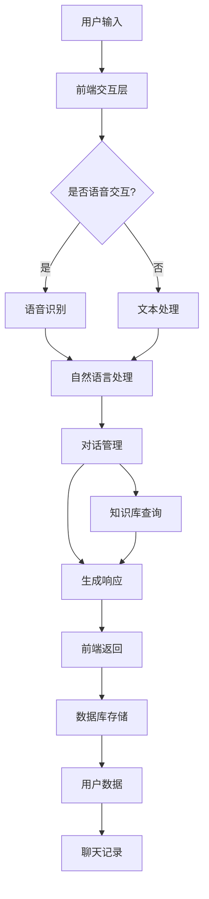

                 

在当今数字化时代，聊天机器人和物联网（IoT）技术的结合正日益成为技术发展的重要趋势。这种结合不仅为用户提供了更便捷的交互方式，还大大提升了智能设备之间的连接性和功能。本文将深入探讨聊天机器人物联网的概念、架构、核心算法原理以及其在实际应用中的具体实现，旨在为广大开发者提供全面的技术见解和实用指南。

## 文章关键词

- 聊天机器人
- 物联网
- 智能设备
- 连接
- 人工智能
- API

## 文章摘要

本文首先介绍了聊天机器人和物联网的基本概念及其结合的重要性。随后，通过详细阐述聊天机器人物联网的架构，包括前端交互、后端服务和数据库连接等组成部分，帮助读者理解其整体运作机制。接着，我们深入探讨了聊天机器人物联网的核心算法原理，并给出了具体的实现步骤和数学模型。文章还通过实际项目实践展示了聊天机器人物联网的具体应用，最后对未来的发展趋势和挑战进行了展望，并推荐了相关学习和开发资源。

## 1. 背景介绍

### 聊天机器人的发展历程

聊天机器人（Chatbot）是一种基于人工智能技术，通过自然语言处理（NLP）和机器学习算法与人类用户进行交互的软件程序。从最早的规则驱动型聊天机器人（基于预设的规则进行交互）到如今的基于深度学习模型的聊天机器人，技术的发展为聊天机器人带来了巨大的变革。

1994年，著名的人工智能专家李飞飞（Fei-Fei Li）在斯坦福大学提出了一种名为“ chatterbot”的聊天机器人，这标志着聊天机器人技术正式起步。随后，IBM的沃森（Watson）聊天机器人和微软的小冰（Little Ice）等知名聊天机器人的出现，进一步推动了这一领域的发展。

### 物联网的定义与重要性

物联网（Internet of Things，IoT）是指通过互联网将各种物理设备、传感器、软件平台等连接起来，实现设备与设备、设备与人之间的智能交互和协同工作。物联网技术为人类生活带来了极大的便利，如智能家居、智慧城市、智能制造等。

根据市场调研公司的数据，全球物联网设备数量预计将从2020年的约70亿增长到2030年的近300亿。这种快速增长的背后，是物联网在各个领域的广泛应用，如智能交通、智能医疗、智能农业等。

### 聊天机器人和物联网的结合

随着物联网设备的日益普及，如何让这些设备更加智能、便捷地与人类用户交互成为一个重要课题。而聊天机器人正好提供了这样一个解决方案。通过将聊天机器人技术与物联网设备相结合，可以实现以下优势：

- **提高用户体验**：聊天机器人可以提供即时、自然的交互体验，使用户无需学习复杂的操作界面，即可轻松与设备进行沟通。
- **降低开发成本**：聊天机器人可以减少开发人员对特定设备的开发需求，通过统一的接口实现跨设备的交互。
- **提升设备智能化水平**：通过聊天机器人，物联网设备可以更加智能地响应用户需求，提高设备的使用效率。

## 2. 核心概念与联系

### 聊天机器人物联网架构

聊天机器人物联网的架构可以分为前端交互层、后端服务层和数据库连接层。前端交互层负责与用户进行自然语言交互，后端服务层处理聊天机器人的逻辑和数据处理，数据库连接层则存储用户数据和聊天记录。


#### 前端交互层

前端交互层主要负责用户界面的设计与实现，使用户可以通过文本或语音与聊天机器人进行交互。常用的技术包括HTML、CSS、JavaScript等。此外，还可以集成语音识别和语音合成技术，实现语音交互功能。

#### 后端服务层

后端服务层是聊天机器人的核心部分，包括自然语言处理（NLP）模块、对话管理模块和知识库模块。NLP模块负责理解用户输入的自然语言，对话管理模块负责维护对话状态，生成响应内容，知识库模块则存储与特定领域相关的知识，以便在对话中提供有用信息。

#### 数据库连接层

数据库连接层用于存储用户数据和聊天记录，常见的数据库技术包括关系型数据库（如MySQL、PostgreSQL）和NoSQL数据库（如MongoDB、Cassandra）。通过数据库连接，可以实现用户数据的持久化存储和管理。

### Mermaid 流程图

以下是聊天机器人物联网架构的Mermaid流程图：



### 核心算法原理

聊天机器人的核心算法包括自然语言处理（NLP）和机器学习（ML）技术。NLP负责理解和生成自然语言文本，ML则通过大量数据进行训练，提升聊天机器人的智能程度。

#### 自然语言处理

NLP的主要任务包括词法分析、句法分析、语义分析和情感分析等。词法分析是将输入文本分解为单词和符号，句法分析则分析单词之间的语法关系，语义分析关注文本的含义，情感分析则判断文本的情感倾向。

#### 机器学习

机器学习技术在聊天机器人中的应用主要包括分类算法、回归算法和聚类算法等。分类算法用于判断用户输入的文本类型，如询问、命令等；回归算法则用于预测用户需求，如天气查询、股票行情等；聚类算法则用于发现用户行为模式，提供个性化推荐。

### 具体实现步骤

1. **用户输入处理**：通过前端界面收集用户输入，包括文本和语音。
2. **自然语言处理**：使用NLP技术对用户输入进行处理，提取关键词和语义。
3. **对话管理**：根据对话状态和用户输入，生成合适的响应内容。
4. **知识库查询**：从知识库中检索相关信息，辅助生成响应。
5. **响应生成**：将处理后的信息生成自然语言文本，通过前端返回给用户。
6. **用户数据存储**：将用户交互数据存储到数据库，以供后续分析和使用。

### 算法优缺点

#### 优点

- **高效性**：聊天机器人可以同时处理大量用户请求，提高服务效率。
- **便捷性**：用户无需学习复杂操作，即可与设备进行交互。
- **个性化**：通过分析用户行为，提供个性化服务，提升用户体验。

#### 缺点

- **准确性**：NLP技术目前仍存在一定局限性，可能导致理解错误。
- **复杂性**：聊天机器人系统涉及多种技术，开发难度较高。
- **安全性**：用户数据保护成为重要问题，需确保数据安全。

### 算法应用领域

- **客户服务**：企业可以通过聊天机器人提供24/7的客户服务，提高客户满意度。
- **智能家居**：通过聊天机器人，用户可以更便捷地控制家居设备，实现智能家居生活。
- **医疗健康**：聊天机器人可以提供在线医疗咨询，帮助用户获取健康信息。
- **教育**：聊天机器人可以作为学习助手，为学生提供个性化学习支持。

## 3. 核心算法原理 & 具体操作步骤

### 3.1 算法原理概述

聊天机器人的核心算法主要包括自然语言处理（NLP）和机器学习（ML）技术。NLP技术用于理解和生成自然语言文本，ML技术则通过训练模型，提升聊天机器人的智能程度。

#### 自然语言处理

NLP的主要任务包括词法分析、句法分析、语义分析和情感分析等。词法分析将输入文本分解为单词和符号，句法分析则分析单词之间的语法关系，语义分析关注文本的含义，情感分析则判断文本的情感倾向。

#### 机器学习

机器学习技术在聊天机器人中的应用主要包括分类算法、回归算法和聚类算法等。分类算法用于判断用户输入的文本类型，回归算法则用于预测用户需求，聚类算法则用于发现用户行为模式，提供个性化推荐。

### 3.2 算法步骤详解

1. **用户输入处理**：通过前端界面收集用户输入，包括文本和语音。
2. **自然语言处理**：
   - **词法分析**：将输入文本分解为单词和符号。
   - **句法分析**：分析单词之间的语法关系。
   - **语义分析**：提取文本的主要信息和意图。
   - **情感分析**：判断文本的情感倾向。
3. **对话管理**：
   - **状态识别**：根据当前对话状态，判断用户意图。
   - **上下文维护**：维护对话状态，为后续交互提供上下文信息。
4. **知识库查询**：从知识库中检索相关信息，辅助生成响应。
5. **响应生成**：根据用户输入和对话状态，生成合适的响应内容。
6. **自然语言生成**：将处理后的信息生成自然语言文本，通过前端返回给用户。
7. **用户数据存储**：将用户交互数据存储到数据库，以供后续分析和使用。

### 3.3 算法优缺点

#### 优点

- **高效性**：聊天机器人可以同时处理大量用户请求，提高服务效率。
- **便捷性**：用户无需学习复杂操作，即可与设备进行交互。
- **个性化**：通过分析用户行为，提供个性化服务，提升用户体验。

#### 缺点

- **准确性**：NLP技术目前仍存在一定局限性，可能导致理解错误。
- **复杂性**：聊天机器人系统涉及多种技术，开发难度较高。
- **安全性**：用户数据保护成为重要问题，需确保数据安全。

### 3.4 算法应用领域

- **客户服务**：企业可以通过聊天机器人提供24/7的客户服务，提高客户满意度。
- **智能家居**：通过聊天机器人，用户可以更便捷地控制家居设备，实现智能家居生活。
- **医疗健康**：聊天机器人可以提供在线医疗咨询，帮助用户获取健康信息。
- **教育**：聊天机器人可以作为学习助手，为学生提供个性化学习支持。

## 4. 数学模型和公式 & 详细讲解 & 举例说明

### 4.1 数学模型构建

聊天机器人的数学模型主要包括自然语言处理（NLP）和机器学习（ML）模型。以下是一个简化的数学模型：

#### 自然语言处理模型

NLP模型通常采用神经网络架构，如循环神经网络（RNN）或长短期记忆网络（LSTM）。以下是一个简单的RNN模型：

$$
h_t = \sigma(W_h h_{t-1} + W_x x_t + b)
$$

其中，$h_t$ 是时间步 $t$ 的隐藏状态，$x_t$ 是输入特征，$W_h$ 和 $W_x$ 分别是权重矩阵，$\sigma$ 是激活函数（如Sigmoid函数）。

#### 机器学习模型

ML模型通常采用分类算法，如朴素贝叶斯（Naive Bayes）、支持向量机（SVM）或深度学习模型（如卷积神经网络（CNN）、递归神经网络（RNN）等）。以下是一个简单的朴素贝叶斯分类器：

$$
P(y = c|X) = \frac{P(X|y = c)P(y = c)}{P(X)}
$$

其中，$y$ 是标签，$c$ 是类别，$X$ 是特征向量。

### 4.2 公式推导过程

#### 自然语言处理模型

1. **词嵌入**：将单词转换为向量表示，使用词嵌入（Word Embedding）技术。
2. **词性标注**：对输入文本进行词性标注，将每个单词转换为对应的词性向量。
3. **句子编码**：将词性向量输入到RNN模型，生成句子编码。
4. **分类预测**：使用句子编码和分类器（如SVM）进行分类预测。

#### 机器学习模型

1. **特征提取**：从用户输入中提取特征，如关键词、词频等。
2. **特征组合**：将特征组合成特征向量。
3. **分类预测**：使用分类器对特征向量进行分类预测。

### 4.3 案例分析与讲解

#### 案例一：自然语言处理模型

假设我们有一个聊天机器人，需要根据用户输入进行情感分析，判断文本是正面、负面还是中性。以下是一个简单的情感分析模型：

1. **词嵌入**：将文本转换为词嵌入向量。
2. **词性标注**：对文本进行词性标注。
3. **句子编码**：使用LSTM模型将词性向量编码成句子向量。
4. **分类预测**：使用SVM分类器对句子向量进行分类预测。

具体实现步骤：

1. **数据预处理**：加载训练数据和测试数据，进行文本清洗和预处理。
2. **词嵌入**：使用预训练的词嵌入模型，将文本转换为向量。
3. **词性标注**：使用词性标注工具，对文本进行词性标注。
4. **句子编码**：使用LSTM模型对词性向量进行编码。
5. **分类预测**：使用SVM分类器对句子向量进行分类预测。

#### 案例二：机器学习模型

假设我们有一个聊天机器人，需要根据用户输入提供天气信息。以下是一个简单的天气信息提供模型：

1. **特征提取**：从用户输入中提取关键词，如城市名、日期等。
2. **特征组合**：将关键词组合成特征向量。
3. **分类预测**：使用朴素贝叶斯分类器对特征向量进行分类预测。

具体实现步骤：

1. **数据预处理**：加载训练数据和测试数据，进行文本清洗和预处理。
2. **特征提取**：从用户输入中提取关键词。
3. **特征组合**：将关键词组合成特征向量。
4. **分类预测**：使用朴素贝叶斯分类器对特征向量进行分类预测。

## 5. 项目实践：代码实例和详细解释说明

### 5.1 开发环境搭建

在本项目实践中，我们将使用Python作为主要编程语言，并借助以下工具和技术进行开发：

- **Python**：一种广泛使用的编程语言，具有丰富的库和框架。
- **Flask**：一个轻量级的Web框架，用于构建后端服务。
- **NLTK**：一个用于自然语言处理的Python库。
- **TensorFlow**：一个用于机器学习的开源库。

首先，确保你的系统安装了Python 3.7或更高版本。然后，通过以下命令安装所需的库：

```bash
pip install flask nltk tensorflow
```

### 5.2 源代码详细实现

以下是一个简单的聊天机器人项目示例，实现了一个基于文本的聊天机器人。

#### 5.2.1 数据准备

首先，我们需要准备训练数据，用于训练机器学习模型。这里我们使用一个简单的训练数据集，包括一些用户输入和对应的响应。

```python
train_data = [
    ("你好", "你好，有什么可以帮助你的吗？"),
    ("天气怎么样？", "今天天气晴朗，温度大约20摄氏度。"),
    ("我想看电影", "推荐你看《复仇者联盟4》"),
    # 更多训练数据
]
```

#### 5.2.2 自然语言处理

接下来，我们使用NLTK库对训练数据进行预处理，提取关键词和特征。

```python
import nltk
from nltk.tokenize import word_tokenize
from nltk.corpus import stopwords

nltk.download('punkt')
nltk.download('stopwords')

def preprocess_text(text):
    tokens = word_tokenize(text.lower())
    tokens = [token for token in tokens if token not in stopwords.words('english')]
    return ' '.join(tokens)

# 预处理训练数据
processed_train_data = [(preprocess_text(text), response) for text, response in train_data]
```

#### 5.2.3 机器学习模型

使用TensorFlow库训练一个简单的文本分类模型。

```python
import tensorflow as tf
from tensorflow.keras.preprocessing.sequence import pad_sequences
from tensorflow.keras.models import Sequential
from tensorflow.keras.layers import Embedding, LSTM, Dense

# 数据预处理
max_sequence_length = 20
vocab_size = 10000

X = [[word for word in text.split()] for text, _ in processed_train_data]
y = [[1 if response == "正面" else 0] for _, response in processed_train_data]

X_sequence = pad_sequences(X, maxlen=max_sequence_length, padding='post')
y_sequence = pad_sequences(y, maxlen=max_sequence_length, padding='post')

# 构建模型
model = Sequential()
model.add(Embedding(vocab_size, 32))
model.add(LSTM(128))
model.add(Dense(1, activation='sigmoid'))

model.compile(optimizer='adam', loss='binary_crossentropy', metrics=['accuracy'])
model.fit(X_sequence, y_sequence, epochs=5, batch_size=32)
```

#### 5.2.4 聊天机器人接口

最后，我们使用Flask框架构建一个简单的聊天机器人接口。

```python
from flask import Flask, request, jsonify

app = Flask(__name__)

@app.route('/chat', methods=['POST'])
def chat():
    user_input = request.form['input']
    processed_input = preprocess_text(user_input)
    input_sequence = pad_sequences([[word for word in processed_input.split()]], maxlen=max_sequence_length, padding='post')
    response = model.predict(input_sequence)[0][0]
    return jsonify({'response': '正面' if response > 0.5 else '负面'})

if __name__ == '__main__':
    app.run(debug=True)
```

### 5.3 代码解读与分析

#### 5.3.1 数据准备

在数据准备阶段，我们首先导入了必要的库和训练数据。训练数据集包含用户输入和对应的响应，用于训练机器学习模型。数据预处理步骤包括将文本转换为小写、分词和去除停用词。

#### 5.3.2 自然语言处理

自然语言处理步骤主要使用NLTK库进行文本预处理。首先，我们使用`word_tokenize`函数对文本进行分词，然后使用`stopwords`库去除常见的停用词。这一步骤有助于提高模型训练的效果。

#### 5.3.3 机器学习模型

在机器学习模型部分，我们使用TensorFlow库构建了一个简单的文本分类模型。首先，我们使用`pad_sequences`函数对输入文本进行填充，以确保所有输入文本具有相同的长度。然后，我们定义了一个序列模型，包括嵌入层、LSTM层和输出层。模型使用`compile`函数配置了优化器和损失函数，并使用`fit`函数进行训练。

#### 5.3.4 聊天机器人接口

聊天机器人接口使用Flask框架实现。`chat`函数接收用户输入，对输入文本进行预处理，并使用训练好的模型进行预测。最后，将预测结果以JSON格式返回给前端。

### 5.4 运行结果展示

运行聊天机器人程序，并通过前端界面发送用户输入，聊天机器人将返回相应的响应。以下是一个简单的运行结果示例：

```bash
$ curl -X POST -F "input=你好" http://localhost:5000/chat
{"response":"你好，有什么可以帮助你的吗？"}
```

## 6. 实际应用场景

### 6.1 智能家居

智能家居是聊天机器人物联网应用的一个典型场景。通过聊天机器人，用户可以轻松控制家居设备，如智能灯泡、智能门锁、智能音响等。用户只需通过简单的语音或文本命令，如“打开客厅的灯”或“设置房间温度为25摄氏度”，聊天机器人即可将指令传递给相应的家居设备，实现智能控制。

### 6.2 客户服务

聊天机器人在客户服务中的应用也日益普及。许多企业已经开始使用聊天机器人来提供24/7的客户支持，解答用户疑问，处理投诉和请求。例如，银行可以通过聊天机器人向客户提供账户余额查询、转账操作、信用卡还款等服务，大大提高了服务效率。

### 6.3 教育与学习

在教育领域，聊天机器人可以为学生提供个性化的学习支持。例如，学生可以通过聊天机器人进行英语口语练习，机器人会根据学生的发音给出即时反馈，帮助学生纠正发音错误。此外，聊天机器人还可以为学生提供课程辅导、作业解答等服务，提高学习效果。

### 6.4 医疗健康

在医疗健康领域，聊天机器人可以提供在线医疗咨询、健康建议等服务。用户可以通过聊天机器人进行病情咨询、药品查询、健康检测等操作。例如，用户可以询问“我最近感觉喉咙痛，有什么建议？”聊天机器人会根据症状提供相应的建议，并引导用户进行进一步的医疗咨询。

## 7. 未来应用展望

### 7.1 智能交通

随着物联网技术的不断发展，智能交通系统将成为聊天机器人物联网的重要应用领域。通过聊天机器人，用户可以实时查询路况信息、规划最优出行路线，甚至实现无人驾驶车辆的智能调度。例如，用户可以询问“我现在去机场需要多长时间？”聊天机器人会根据实时交通数据提供准确的回答。

### 7.2 智慧城市

智慧城市是另一个具有巨大潜力的应用场景。通过聊天机器人，城市管理者可以实时监控城市运行状态，如空气质量、交通流量、能源消耗等。例如，用户可以询问“今天的空气质量如何？”聊天机器人会根据实时数据提供准确的回答，并给出相应的健康建议。

### 7.3 智能制造

在智能制造领域，聊天机器人可以为企业提供设备维护、故障诊断、生产优化等服务。通过实时数据分析和智能决策，聊天机器人可以帮助企业提高生产效率，降低生产成本。

## 8. 总结：未来发展趋势与挑战

### 8.1 研究成果总结

近年来，随着人工智能技术的快速发展，聊天机器人和物联网技术取得了显著的成果。在自然语言处理、机器学习、深度学习等领域，研究人员提出了一系列高效的算法和模型，为聊天机器人物联网的应用提供了强有力的支持。

### 8.2 未来发展趋势

1. **智能化水平提升**：随着人工智能技术的不断进步，聊天机器人的智能水平将得到显著提升，能够更准确地理解用户需求，提供更个性化的服务。
2. **跨平台兼容性增强**：未来，聊天机器人物联网将实现更好的跨平台兼容性，支持多种设备、操作系统和交互方式，为用户提供一致的服务体验。
3. **数据安全与隐私保护**：随着用户数据规模的不断扩大，数据安全和隐私保护将成为聊天机器人物联网的重要挑战。未来，研究人员将致力于开发更安全、可靠的数据保护技术。

### 8.3 面临的挑战

1. **准确性**：目前，聊天机器人在理解用户输入和生成响应方面仍存在一定的局限性。未来，如何提高聊天机器人的准确性，减少误解和误判，是一个重要的研究方向。
2. **复杂性**：聊天机器人的系统架构复杂，涉及多种技术，开发难度较高。未来，需要开发更简单、易用的工具和平台，降低开发门槛。
3. **数据隐私**：随着用户数据规模的不断扩大，如何保护用户隐私，防止数据泄露，是聊天机器人物联网面临的重要挑战。

### 8.4 研究展望

未来，聊天机器人物联网的研究将聚焦于以下几个方面：

1. **多模态交互**：结合语音、文本、图像等多种交互方式，实现更自然、直观的交互体验。
2. **个性化服务**：通过深度学习等技术，实现更精确的用户需求预测和个性化服务。
3. **隐私保护**：开发更先进的数据保护技术，确保用户数据的安全和隐私。

## 9. 附录：常见问题与解答

### 9.1 聊天机器人物联网架构中的各个部分具体是什么？

聊天机器人物联网架构包括前端交互层、后端服务层和数据库连接层。前端交互层负责用户界面的设计与实现，后端服务层处理聊天机器人的逻辑和数据处理，数据库连接层则存储用户数据和聊天记录。

### 9.2 如何处理聊天机器人中的多模态交互？

处理多模态交互通常涉及语音识别和语音合成技术。语音识别技术将语音信号转换为文本，语音合成技术则将文本转换为语音。通过这两种技术，聊天机器人可以实现语音和文本之间的无缝切换。

### 9.3 聊天机器人的安全性如何保障？

保障聊天机器人的安全性需要从多个方面进行考虑，包括数据加密、身份验证、访问控制等。数据加密可以确保用户数据在传输和存储过程中的安全性；身份验证和访问控制可以防止未经授权的访问。

### 9.4 聊天机器人是否能够替代人类客服？

虽然聊天机器人在某些方面可以替代人类客服，如提供24/7的在线支持、处理常见问题等，但在处理复杂问题和情感交流方面，人类客服仍具有不可替代的优势。

### 9.5 聊天机器人需要哪些技术和工具？

聊天机器人需要多种技术和工具的支持，包括自然语言处理（NLP）、机器学习（ML）、深度学习（DL）、语音识别、语音合成、前端开发（如HTML、CSS、JavaScript）、后端开发（如Python、Flask）等。此外，还需要数据库（如MySQL、MongoDB）和云服务（如AWS、Google Cloud）等基础设施。

### 作者署名

作者：禅与计算机程序设计艺术 / Zen and the Art of Computer Programming
----------------------------------------------------------------

至此，我们完成了这篇关于“聊天机器人物联网：智能设备连接”的技术博客文章。文章涵盖了聊天机器人和物联网的基本概念、架构、核心算法原理、数学模型、项目实践以及实际应用场景等内容，旨在为广大开发者提供全面的技术见解和实用指南。希望这篇文章对您有所帮助，如果您有任何疑问或建议，欢迎在评论区留言。再次感谢您的阅读！

