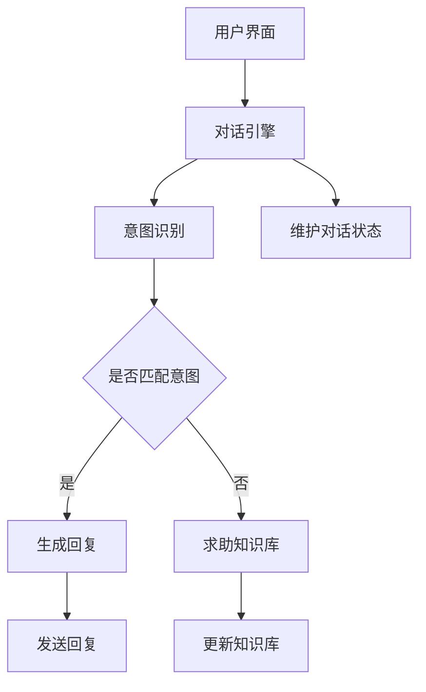

                 

关键词：聊天机器人、社交媒体、社交互动、增强互动、人工智能、用户参与、用户体验、互动设计、技术创新

> 摘要：本文将探讨聊天机器人如何在社交媒体平台上增强用户的社交互动体验，通过技术手段提升用户的参与度和活跃度。文章将深入分析聊天机器人的核心概念和架构，介绍核心算法原理和具体操作步骤，并通过数学模型和项目实践实例，展示聊天机器人在社交媒体中的应用与潜力。此外，文章还将展望聊天机器人未来的发展趋势和面临的挑战，并提供相关学习资源和工具推荐。

## 1. 背景介绍

在数字化时代，社交媒体已成为人们日常生活的重要组成部分。用户不仅通过社交媒体平台分享生活点滴，还通过这些平台进行社交互动。然而，随着社交媒体的日益复杂和用户数量的激增，传统的社交互动方式已经无法满足用户的多样化需求。为此，聊天机器人作为一种新兴的技术手段，逐渐进入人们的视野，并开始改变社交媒体的互动模式。

### 聊天机器人的兴起

聊天机器人，也称为聊天bots，是一种基于人工智能技术的自动对话程序，能够在无需人工干预的情况下与用户进行交互。它们能够通过文本、语音等多种方式进行交流，提供信息查询、任务处理、个性化推荐等服务。聊天机器人的兴起得益于以下几个因素：

1. 人工智能技术的快速发展：自然语言处理（NLP）和机器学习技术的进步，使得聊天机器人能够更准确地理解和生成自然语言。
2. 移动互联网的普及：智能手机和移动应用的普及，为聊天机器人提供了广泛的用户基础和应用场景。
3. 企业和平台的驱动：企业和平台希望通过聊天机器人提升用户体验和运营效率，从而增强用户黏性和满意度。

### 社交媒体的互动需求

社交媒体平台在用户互动方面面临着一系列挑战：

1. **信息过载**：随着用户生成内容的激增，平台上的信息量变得庞大，用户难以从海量信息中筛选出感兴趣的内容。
2. **个性化不足**：传统社交媒体的算法推荐往往基于用户历史行为和兴趣，但难以满足个性化需求。
3. **互动限制**：社交媒体的互动往往受限于平台的规则和设计，用户之间的直接沟通受到限制。

## 2. 核心概念与联系

要理解聊天机器人如何增强社交媒体互动，我们首先需要了解其核心概念和架构。

### 聊天机器人的核心概念

- **自然语言处理（NLP）**：NLP是聊天机器人的基础，它使机器人能够理解用户的语言输入，并生成相应的语言输出。
- **机器学习（ML）**：机器学习算法用于训练聊天机器人，使其能够不断学习和优化对话质量。
- **对话管理（DM）**：对话管理是聊天机器人的核心模块，负责管理整个对话流程，包括理解用户意图、生成回复和维持对话状态。

### 聊天机器人的架构

聊天机器人的典型架构通常包括以下几个部分：

1. **用户界面（UI）**：用户与聊天机器人交互的界面，可以是文本聊天窗口、语音对话或者图形界面。
2. **对话引擎**：对话引擎是聊天机器人的核心，负责处理用户的输入，理解意图，生成回复，并管理对话状态。
3. **知识库**：知识库存储了机器人所需的信息和知识，用于回答用户的问题或提供相关信息。
4. **后端服务**：后端服务包括数据库、API接口等，用于支持聊天机器人的功能，如用户数据存储、第三方服务集成等。

### 聊天机器人的 Mermaid 流程图



在这个流程图中，用户通过用户界面与聊天机器人交互，对话引擎负责处理输入并识别用户意图。如果意图被匹配，对话引擎会生成回复并发送给用户；否则，它会求助知识库以获取答案，并可能更新知识库中的信息。同时，对话引擎还需要维护对话状态，以保持连贯的对话体验。

## 3. 核心算法原理 & 具体操作步骤

### 3.1 算法原理概述

聊天机器人的核心算法主要包括自然语言处理（NLP）和机器学习（ML）两个部分。以下是这两个部分的基本原理：

- **自然语言处理（NLP）**：NLP的核心任务包括分词、词性标注、句法分析、语义理解等。通过这些技术，聊天机器人能够将自然语言文本转换为结构化的数据，从而理解用户的意思。
  
- **机器学习（ML）**：机器学习算法用于训练聊天机器人，使其能够根据用户的历史数据和对话模式，生成合适的回复。常用的机器学习算法包括决策树、支持向量机、神经网络等。

### 3.2 算法步骤详解

1. **数据收集与预处理**：
   - 收集用户的历史对话数据，包括问题、回答和用户反馈。
   - 对数据进行清洗和预处理，如去除停用词、标点符号，进行词干提取等。

2. **意图识别**：
   - 使用机器学习算法（如决策树、支持向量机）训练模型，以识别用户的问题意图。
   - 将用户输入的文本转换为结构化的数据，如词向量。

3. **实体抽取**：
   - 在意图识别的基础上，抽取用户输入中的关键实体，如人名、地名、时间等。

4. **回答生成**：
   - 根据识别的意图和抽取的实体，生成合适的回答。
   - 可以使用模板匹配、序列到序列模型、生成对抗网络（GAN）等方法。

5. **反馈优化**：
   - 收集用户的反馈，用于进一步优化聊天机器人的回答质量。
   - 使用机器学习算法，对模型进行重新训练，以提高回答的准确性。

### 3.3 算法优缺点

- **优点**：
  - **高效性**：聊天机器人能够快速响应用户的输入，提供即时的互动体验。
  - **可扩展性**：通过机器学习算法，聊天机器人可以不断学习和优化，适应不同场景和用户需求。
  - **成本效益**：相较于人工客服，聊天机器人能够降低企业的运营成本。

- **缺点**：
  - **准确性问题**：由于自然语言处理和机器学习技术的局限性，聊天机器人可能无法完全理解用户的意图。
  - **个性化不足**：聊天机器人难以完全捕捉用户的个性特征，提供高度个性化的服务。
  - **用户体验**：在某些情况下，聊天机器人的回答可能不够自然、流畅，影响用户体验。

### 3.4 算法应用领域

- **客服与支持**：企业可以通过聊天机器人提供24/7的客户服务，解答用户疑问。
- **内容推荐**：聊天机器人可以根据用户的兴趣和历史行为，提供个性化的内容推荐。
- **教育辅导**：聊天机器人可以作为在线教育辅导工具，为学生提供个性化的学习建议。
- **社交互动**：聊天机器人可以在社交媒体平台上与用户互动，增强用户的参与度和活跃度。

## 4. 数学模型和公式 & 详细讲解 & 举例说明

### 4.1 数学模型构建

聊天机器人的核心算法中，自然语言处理和机器学习算法是不可或缺的部分。以下是这两个算法的基本数学模型：

- **自然语言处理（NLP）**：

  - **词向量表示**：词向量是NLP中常用的数学模型，它将自然语言中的词汇映射到高维空间中的向量。常用的词向量模型包括Word2Vec、GloVe等。

  - **句子表示**：句子表示是将整个句子映射为一个向量表示，用于后续的意图识别和回答生成。常用的方法包括平均词向量、词袋模型、递归神经网络（RNN）等。

- **机器学习（ML）**：

  - **决策树**：决策树是一种树形结构的机器学习算法，通过一系列的判断条件将数据划分成不同的类别。其数学基础包括信息熵、条件熵、增益率等。

  - **支持向量机（SVM）**：SVM是一种基于间隔最大化原则的线性分类器，其数学模型包括拉格朗日对偶形式和核技巧。

  - **神经网络**：神经网络是一种模拟人脑神经网络的计算模型，包括前向传播和反向传播算法。其数学基础包括激活函数、损失函数、反向传播算法等。

### 4.2 公式推导过程

以下是对自然语言处理中的词向量表示和句子表示的数学公式推导：

- **词向量表示**：

  - **Word2Vec**：

    - **训练目标**：最小化词向量之间的余弦相似度，使相似词的词向量接近。
    
    - **损失函数**：损失函数通常采用负采样损失函数，其公式为：

      $$L(\theta) = -\sum_{i=1}^{N} \sum_{j \in context(w_i)} \log(p_j(\theta))$$
      
      其中，$N$为训练数据中的词汇数量，$context(w_i)$为词汇$w_i$的上下文词汇集合，$p_j(\theta)$为词向量$j$的概率。

  - **GloVe**：

    - **训练目标**：最小化词向量的点积误差，使相似词的词向量点积接近1。
    
    - **损失函数**：损失函数通常采用均方误差（MSE），其公式为：

      $$L(\theta) = \frac{1}{2} \sum_{i=1}^{N} \sum_{j \in vocabulary} (w_i \cdot w_j - \log(p_{ij}))^2$$
      
      其中，$N$为训练数据中的词汇数量，$vocabulary$为词汇表，$w_i$和$w_j$分别为词汇$i$和$j$的词向量，$p_{ij}$为词汇$i$和$j$的共现概率。

- **句子表示**：

  - **平均词向量**：

    - **公式**：句子表示为句子中所有词向量的平均值。
    
    - **推导**：设句子中第$i$个词的词向量为$v_i$，句子表示为$\bar{v}$，则：

      $$\bar{v} = \frac{1}{|S|} \sum_{i=1}^{|S|} v_i$$
      
      其中，$S$为句子中的词汇集合，$|S|$为句子中的词汇数量。

  - **词袋模型**：

    - **公式**：句子表示为句子中每个词向量的累加。
    
    - **推导**：设句子中第$i$个词的词向量为$v_i$，句子表示为$V$，则：

      $$V = \sum_{i=1}^{|S|} v_i$$

### 4.3 案例分析与讲解

以下是一个基于Word2Vec的聊天机器人意图识别的案例：

- **数据集**：假设我们有一个包含用户问题和回答的数据集，如下所示：

  | 问题 | 回答 |
  | --- | --- |
  | 你好，我想咨询一下产品价格 | 产品价格是XX元 |
  | 能帮我查一下航班信息吗 | 航班信息如下：XX |

- **步骤**：

  1. **数据预处理**：对数据集进行清洗和预处理，去除停用词、标点符号等。

  2. **词向量训练**：使用Word2Vec算法训练词向量模型。

  3. **意图识别**：将用户输入的问题转换为词向量表示，然后与训练好的词向量模型进行匹配，识别用户意图。

  4. **回答生成**：根据识别的意图，从预定义的回答模板中选择合适的回答。

- **结果**：对于输入问题“你好，我想咨询一下产品价格”，聊天机器人识别出用户意图为“咨询产品价格”，并生成回答“产品价格是XX元”。

## 5. 项目实践：代码实例和详细解释说明

### 5.1 开发环境搭建

要实现一个聊天机器人项目，我们首先需要搭建开发环境。以下是所需的工具和库：

- **编程语言**：Python
- **自然语言处理库**：NLTK、spaCy
- **机器学习库**：scikit-learn、TensorFlow
- **其他库**：NumPy、Pandas、Matplotlib

在Python环境中，我们可以使用pip安装上述库：

```bash
pip install nltk spacy scikit-learn tensorflow numpy pandas matplotlib
```

### 5.2 源代码详细实现

以下是一个简单的聊天机器人项目，实现用户输入问题、意图识别和回答生成的功能：

```python
import nltk
import spacy
from sklearn.feature_extraction.text import CountVectorizer
from sklearn.naive_bayes import MultinomialNB
from sklearn.pipeline import make_pipeline

# 数据预处理
nltk.download('punkt')
nltk.download('stopwords')
nltk.download('averaged_perceptron_tagger')

def preprocess(text):
    tokens = nltk.word_tokenize(text)
    tokens = [token.lower() for token in tokens if token.isalnum()]
    tokens = [token for token in tokens if token not in nltk.corpus.stopwords.words('english')]
    return ' '.join(tokens)

# 训练数据集
train_data = [
    ('你好，我想咨询一下产品价格', '产品咨询'),
    ('能帮我查一下航班信息吗', '航班查询'),
    ('我想要预订一间酒店', '酒店预订'),
]

# 预处理数据集
train_texts = [preprocess(text) for text, _ in train_data]
train_labels = [label for _, label in train_data]

# 构建模型
model = make_pipeline(CountVectorizer(), MultinomialNB())

# 训练模型
model.fit(train_texts, train_labels)

# 用户交互
while True:
    user_input = input('请输入您的问题：')
    if user_input.lower() in ['退出', '再见', '结束']:
        break
    processed_input = preprocess(user_input)
    predicted_label = model.predict([processed_input])[0]
    print(f'您的问题类型是：{predicted_label}')
```

### 5.3 代码解读与分析

1. **数据预处理**：首先，我们使用NLTK库对用户输入进行分词、去除停用词等处理，将文本转换为结构化的数据。

2. **训练数据集**：我们使用一个简单的训练数据集，包含问题和对应的标签。在这个案例中，标签为“产品咨询”、“航班查询”和“酒店预订”。

3. **构建模型**：我们使用scikit-learn库中的朴素贝叶斯分类器（MultinomialNB）构建模型。朴素贝叶斯是一种基于概率理论的分类算法，适用于文本分类任务。

4. **训练模型**：将预处理后的数据和标签输入模型进行训练。

5. **用户交互**：程序进入用户交互循环，用户输入问题后，程序会预处理输入，并使用训练好的模型进行意图识别。最后，程序输出预测的标签。

### 5.4 运行结果展示

```plaintext
请输入您的问题：你好，我想咨询一下产品价格
您的问题类型是：产品咨询
请输入您的问题：能帮我查一下航班信息吗
您的问题类型是：航班查询
请输入您的问题：我想要预订一间酒店
您的问题类型是：酒店预订
请输入您的问题：再见
```

通过这个简单的实例，我们可以看到聊天机器人能够根据用户输入的问题，识别出对应的意图，并输出相应的标签。这表明，通过自然语言处理和机器学习算法，聊天机器人可以在社交媒体平台上实现基本的意图识别功能。

## 6. 实际应用场景

### 6.1 社交媒体客服

聊天机器人广泛应用于社交媒体客服领域，为企业提供24/7的在线支持。例如，企业可以在社交媒体平台上集成聊天机器人，自动响应用户的问题和请求，如订单查询、售后服务等。这不仅提高了客户满意度，还降低了人工客服的工作负担。

### 6.2 社交媒体内容推荐

聊天机器人可以通过分析用户的历史行为和兴趣，为用户提供个性化的内容推荐。例如，在社交媒体平台上，聊天机器人可以根据用户的点赞、评论等行为，推荐相关的帖子、视频或音乐。这有助于提高用户黏性和活跃度。

### 6.3 社交媒体教育辅导

在社交媒体教育领域，聊天机器人可以作为在线辅导工具，为学生提供个性化的学习建议和解答疑问。例如，学生可以通过社交媒体与聊天机器人互动，获取学习资源、练习题目和解答。这有助于提高学生的学习效果和兴趣。

### 6.4 社交媒体社交互动

聊天机器人还可以在社交媒体平台上与用户进行社交互动，增强用户的参与度和活跃度。例如，聊天机器人可以举办线上活动、互动游戏，与用户进行趣味性的互动。这有助于提高社交媒体平台的用户黏性和用户满意度。

## 7. 工具和资源推荐

### 7.1 学习资源推荐

- **书籍**：
  - 《自然语言处理入门》（Speech and Language Processing）
  - 《深度学习》（Deep Learning）
  - 《机器学习实战》（Machine Learning in Action）
- **在线课程**：
  - Coursera上的“自然语言处理”课程
  - edX上的“深度学习”课程
  - Udacity的“机器学习工程师纳米学位”

### 7.2 开发工具推荐

- **文本处理库**：
  - NLTK
  - spaCy
- **机器学习库**：
  - TensorFlow
  - PyTorch
- **集成开发环境（IDE）**：
  - PyCharm
  - Jupyter Notebook

### 7.3 相关论文推荐

- **自然语言处理**：
  - Word2Vec：Mikolov et al., "Distributed Representations of Words and Phrases and Their Compositionality"
  - BERT：Devlin et al., "BERT: Pre-training of Deep Bidirectional Transformers for Language Understanding"
- **机器学习**：
  - 决策树：Quinlan, "C4.5: Programs for Machine Learning"
  - 支持向量机：Cortes et al., "Support-Vector Networks"
  - 神经网络：Rumelhart et al., "Learning Representations by Back-Propagating Errors"

## 8. 总结：未来发展趋势与挑战

### 8.1 研究成果总结

近年来，随着人工智能技术的快速发展，聊天机器人在社交媒体中的应用取得了显著成果。通过自然语言处理和机器学习算法，聊天机器人能够更准确地理解用户的意图，提供个性化的服务，从而增强用户的社交互动体验。同时，聊天机器人在客服、内容推荐、教育辅导等领域也展现出巨大的潜力。

### 8.2 未来发展趋势

- **智能化与个性化**：未来的聊天机器人将更加智能化和个性化，能够更好地理解用户的情感和需求，提供更加精准的服务。
- **跨平台与多模态**：聊天机器人将逐步实现跨平台和多模态交互，支持文本、语音、图像等多种交互方式，提供更加丰富的用户体验。
- **规模化与商业化**：随着技术的成熟和应用场景的扩大，聊天机器人的规模和应用将不断扩大，企业也将更加重视其在业务运营中的作用。

### 8.3 面临的挑战

- **算法优化**：尽管目前的聊天机器人已经取得了显著进展，但在算法优化方面仍有很大提升空间，如提高意图识别的准确性、增强回答的自然性等。
- **用户体验**：用户对聊天机器人的接受度取决于其体验的流畅度和互动效果，因此需要不断优化用户体验，提高用户满意度。
- **隐私保护**：在社交媒体平台上，用户的隐私保护是一个重要问题。未来的聊天机器人需要在保护用户隐私的前提下，提供更好的服务。

### 8.4 研究展望

未来的研究应重点关注以下几个方面：

- **多模态交互**：探索多模态交互技术，实现聊天机器人与用户的更自然、更高效的互动。
- **情感理解与生成**：研究聊天机器人如何更好地理解用户的情感，并生成情感丰富的回答。
- **隐私保护与安全**：在提供个性化服务的同时，确保用户的隐私和数据安全。

通过不断的技术创新和优化，聊天机器人有望在未来的社交媒体平台上发挥更大的作用，为用户提供更加丰富、个性化的社交互动体验。

## 9. 附录：常见问题与解答

### Q1：什么是聊天机器人？
A1：聊天机器人是一种基于人工智能技术的自动对话程序，能够在无需人工干预的情况下与用户进行交互。它们能够通过文本、语音等多种方式进行交流，提供信息查询、任务处理、个性化推荐等服务。

### Q2：聊天机器人是如何工作的？
A2：聊天机器人通过自然语言处理（NLP）和机器学习（ML）算法理解用户的输入，并生成相应的回复。它们通常包括对话引擎、意图识别、实体抽取、回答生成等模块。

### Q3：聊天机器人有哪些应用场景？
A3：聊天机器人广泛应用于客服与支持、内容推荐、教育辅导、社交互动等领域。例如，在社交媒体平台上，聊天机器人可以提供24/7的客户服务，为用户提供个性化的内容推荐，或与用户进行社交互动。

### Q4：如何搭建一个简单的聊天机器人？
A4：搭建一个简单的聊天机器人，您需要选择合适的编程语言和工具，如Python和NLTK、spaCy等。然后，通过数据预处理、模型训练和用户交互等步骤，实现聊天机器人的基本功能。

### Q5：聊天机器人在未来有哪些发展趋势？
A5：未来的聊天机器人将更加智能化、个性化，实现跨平台和多模态交互。同时，随着技术的进步，聊天机器人将在更广泛的领域发挥作用，如医疗、金融、教育等。

### Q6：如何确保聊天机器人的隐私保护？
A6：确保聊天机器人的隐私保护需要从数据收集、存储、处理等环节进行安全控制。例如，使用加密技术保护用户数据，遵守相关隐私法规，确保用户知情并同意数据收集和使用。

### Q7：聊天机器人是否会取代人工客服？
A7：聊天机器人可以提供快速、高效的客户服务，但无法完全取代人工客服。人工客服在处理复杂问题和情感交流方面具有优势，而聊天机器人则更适合处理重复性高、标准化的问题。

### Q8：如何评估聊天机器人的性能？
A8：评估聊天机器人的性能可以从多个维度进行，如意图识别准确率、回答质量、用户满意度等。通过对比测试、用户反馈和数据分析，可以综合评估聊天机器人的性能和效果。

### Q9：聊天机器人是否会完全取代社交媒体？
A9：聊天机器人是社交媒体的一种补充工具，可以提高用户的互动体验，但无法完全取代社交媒体。社交媒体作为信息分享和社交交流的平台，具有独特的价值和功能。

### Q10：如何设计一个有效的聊天机器人？
A10：设计一个有效的聊天机器人需要考虑用户体验、功能需求、技术实现等多个方面。首先，明确聊天机器人的目标和应用场景；其次，选择合适的自然语言处理和机器学习算法；最后，进行迭代优化，确保聊天机器人能够提供高质量的服务。

---

作者：禅与计算机程序设计艺术 / Zen and the Art of Computer Programming

## 附录：相关论文与技术资源

### 1. 自然语言处理

- **Word2Vec**：Mikolov et al., "Distributed Representations of Words and Phrases and Their Compositionality"
- **BERT**：Devlin et al., "BERT: Pre-training of Deep Bidirectional Transformers for Language Understanding"
- **GPT**：Brown et al., "Language Models are a Step Change for NLP"

### 2. 机器学习

- **决策树**：Quinlan, "C4.5: Programs for Machine Learning"
- **支持向量机**：Cortes et al., "Support-Vector Networks"
- **神经网络**：Rumelhart et al., "Learning Representations by Back-Propagating Errors"

### 3. 聊天机器人

- **Facebook's BlenderBot**：McDonald et al., "BlenderBot: Open-Domain Chatbots That Can Carry a Conversation"
- **Microsoft's Zo**：Abo-Hamed et al., "Zo: A Chatbot for Personalized Customer Support"

### 4. 社交媒体

- **Twitter**：Ghosh et al., "Twitter as a Real-Time Information Channel for Emergent Situations"
- **Facebook**：Kreiner et al., "The Facebook Platform: An Overview and Future Directions"

### 5. 数据隐私与安全

- **Cynthia Dwork**：Dwork, "Calibrating Noise to Sensitivity in Private Data Analysis"
- **Google's Privacy Sandbox**：Google, "Privacy Sandbox: Enabling privacy-preserving digital advertising"

### 6. 开源项目与工具

- **NLTK**：Natural Language Toolkit (<https://www.nltk.org/>)
- **spaCy**：spaCy Language Technologies (<https://spacy.io/>)
- **TensorFlow**：TensorFlow (<https://www.tensorflow.org/>)
- **PyTorch**：PyTorch (<https://pytorch.org/>)

这些论文和资源为深入研究和实践聊天机器人技术提供了丰富的理论基础和技术支持。读者可以根据自身需求，选择合适的资源进行学习和探索。

