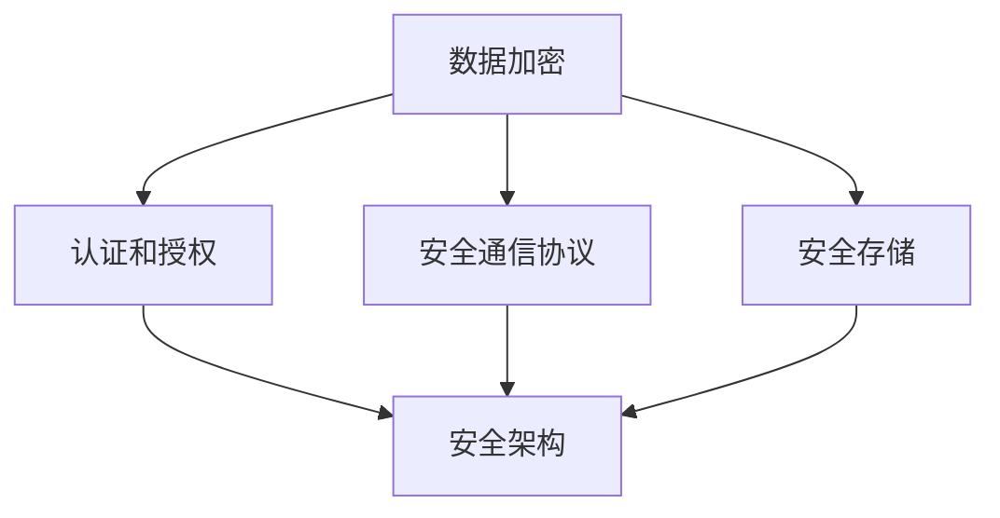

                 

关键词：聊天机器人，网络安全，数据保护，系统安全，加密技术

> 摘要：随着人工智能技术的不断发展，聊天机器人已经成为企业服务和个人助理的重要组成部分。然而，随之而来的网络安全问题也愈发凸显。本文将深入探讨聊天机器人的网络安全，包括数据保护、系统安全以及加密技术等方面，旨在为开发者和管理者提供一套全面的安全解决方案，以保护聊天机器人的数据和系统安全。

## 1. 背景介绍

随着互联网的普及，聊天机器人正逐渐成为各个领域的应用热点。无论是企业客服、个人助理，还是社交平台的互动，聊天机器人都以其高效、便捷的特点赢得了广大用户的喜爱。然而，伴随着聊天机器人应用的普及，其网络安全问题也日益突出。聊天机器人作为与用户直接交互的平台，其安全性直接关系到用户的隐私和数据安全。

### 1.1 聊天机器人的发展现状

聊天机器人起源于自然语言处理（NLP）和人工智能（AI）技术的结合。最早的聊天机器人出现在20世纪50年代，随着技术的不断发展，聊天机器人的功能和应用场景也在不断扩展。目前，聊天机器人已经广泛应用于客服、金融、医疗、教育等多个领域。

### 1.2 聊天机器人的网络安全问题

聊天机器人的网络安全问题主要包括以下几个方面：

- 数据泄露：聊天机器人收集的用户数据可能包括个人身份信息、财务信息等敏感数据，一旦泄露，将给用户带来巨大的安全隐患。

- 钓鱼攻击：攻击者可能通过伪装成聊天机器人，诱导用户泄露个人信息，从而进行网络钓鱼攻击。

- 恶意代码：聊天机器人可能被注入恶意代码，导致系统瘫痪或者数据被篡改。

- 网络入侵：攻击者可能通过聊天机器人入侵企业内部网络，窃取敏感信息或者对系统进行破坏。

## 2. 核心概念与联系

为了构建一个安全的聊天机器人系统，我们需要理解以下几个核心概念：

### 2.1 数据加密

数据加密是保护数据传输过程中不被窃取或者篡改的重要手段。加密技术可以分为对称加密和非对称加密。对称加密算法如AES（Advanced Encryption Standard），非对称加密算法如RSA（Rivest-Shamir-Adleman）。

### 2.2 认证和授权

认证和授权是确保只有合法用户可以访问系统资源的重要机制。常见的认证方式包括密码认证、指纹识别、人脸识别等。授权则通过访问控制列表（ACL）或者角色访问控制（RBAC）来实现。

### 2.3 安全通信协议

安全通信协议如HTTPS（Hyper Text Transfer Protocol Secure）、SSH（Secure Shell）等，可以保证数据在传输过程中的安全性和完整性。

### 2.4 安全存储

安全存储涉及到如何保护存储在数据库或者其他存储介质中的敏感数据。常见的保护措施包括数据加密、访问控制、备份与恢复等。

### 2.5 安全架构

安全架构是确保整个聊天机器人系统安全的基础。一个完善的安全架构应该包括物理安全、网络安全、应用安全等多个层面。

### 2.6 Mermaid 流程图

以下是一个简单的 Mermaid 流程图，展示了聊天机器人网络安全的核心概念及其之间的联系：



## 3. 核心算法原理 & 具体操作步骤

### 3.1 算法原理概述

聊天机器人的网络安全核心算法主要涉及数据加密、认证和授权、安全通信协议等方面。以下是具体的算法原理：

- 数据加密：使用对称加密算法如AES对数据进行加密，使用非对称加密算法如RSA进行密钥交换。
- 认证和授权：使用密码认证、多因素认证（MFA）进行用户身份验证，使用ACL或RBAC进行权限控制。
- 安全通信协议：使用HTTPS或SSH等安全协议确保数据传输过程中的安全性和完整性。
- 安全存储：使用数据库加密、访问控制等技术保护存储在数据库中的敏感数据。

### 3.2 算法步骤详解

#### 3.2.1 数据加密步骤

1. 用户发送明文数据到聊天机器人。
2. 聊天机器人使用对称加密算法如AES对数据进行加密。
3. 聊天机器人使用非对称加密算法如RSA生成密钥对，并将公钥发送给用户。
4. 用户使用聊天机器人发送的公钥对加密后的数据进行解密。
5. 用户收到解密后的明文数据。

#### 3.2.2 认证和授权步骤

1. 用户输入用户名和密码进行认证。
2. 聊天机器人验证用户身份。
3. 聊天机器人根据用户权限进行授权。

#### 3.2.3 安全通信协议步骤

1. 用户通过HTTPS或SSH等安全协议与聊天机器人建立连接。
2. 数据在传输过程中经过加密和完整性验证。
3. 数据传输完成后，安全连接关闭。

#### 3.2.4 安全存储步骤

1. 聊天机器人使用数据库加密技术保护存储在数据库中的敏感数据。
2. 聊天机器人设置访问控制策略，限制对敏感数据的访问。

### 3.3 算法优缺点

#### 优点

- 数据加密：保护数据在传输和存储过程中的安全。
- 认证和授权：确保只有合法用户可以访问系统资源。
- 安全通信协议：保证数据传输过程中的安全性和完整性。
- 安全存储：保护存储在数据库中的敏感数据。

#### 缺点

- 数据加密：加密和解密过程需要计算资源，可能影响系统性能。
- 认证和授权：需要额外的硬件和软件支持。
- 安全通信协议：可能增加网络延迟。
- 安全存储：数据库加密可能增加存储空间需求。

### 3.4 算法应用领域

聊天机器人的核心算法原理可以应用于各个领域的聊天机器人系统，包括客服、金融、医疗、教育等。

## 4. 数学模型和公式 & 详细讲解 & 举例说明

### 4.1 数学模型构建

聊天机器人的网络安全涉及多个数学模型，包括加密算法模型、认证和授权模型、安全通信协议模型等。以下是几个典型的数学模型：

#### 4.1.1 加密算法模型

加密算法模型包括对称加密算法和非对称加密算法。对称加密算法如AES的加密模型如下：

$$
c = E_K(m)
$$

其中，$c$ 表示加密后的数据，$K$ 表示加密密钥，$m$ 表示明文数据。

非对称加密算法如RSA的加密模型如下：

$$
c = E_{K_P}(m)
$$

其中，$c$ 表示加密后的数据，$K_P$ 表示公钥，$m$ 表示明文数据。

#### 4.1.2 认证和授权模型

认证和授权模型主要包括密码认证和多因素认证。密码认证模型如下：

$$
\text{valid}_{\text{password}} = P(\text{password}|\text{user})
$$

其中，$\text{valid}_{\text{password}}$ 表示密码认证的有效性，$P$ 表示概率，$\text{password}$ 表示用户输入的密码，$\text{user}$ 表示用户身份。

多因素认证模型如下：

$$
\text{valid}_{\text{MFA}} = \text{valid}_{\text{password}} \land \text{valid}_{\text{token}}
$$

其中，$\text{valid}_{\text{MFA}}$ 表示多因素认证的有效性，$\text{valid}_{\text{password}}$ 表示密码认证的有效性，$\text{valid}_{\text{token}}$ 表示令牌认证的有效性。

#### 4.1.3 安全通信协议模型

安全通信协议模型主要包括HTTPS和SSH。HTTPS的通信模型如下：

$$
\text{HTTPS} = (\text{HTTP}, \text{TLS})
$$

其中，$\text{HTTPS}$ 表示HTTPS协议，$\text{HTTP}$ 表示HTTP协议，$\text{TLS}$ 表示TLS（传输层安全性协议）。

SSH的通信模型如下：

$$
\text{SSH} = (\text{SSH}, \text{AES}, \text{RSA})
$$

其中，$\text{SSH}$ 表示SSH协议，$\text{AES}$ 表示AES加密算法，$\text{RSA}$ 表示RSA加密算法。

### 4.2 公式推导过程

以下是对上述数学模型的推导过程：

#### 4.2.1 对称加密算法模型推导

对称加密算法的加密过程可以表示为：

$$
c = E_K(m)
$$

其中，$K$ 是加密密钥，$m$ 是明文数据。

解密过程为：

$$
m = D_K(c)
$$

其中，$c$ 是加密后的数据。

对称加密算法的安全性取决于密钥的长度和加密算法的复杂度。

#### 4.2.2 非对称加密算法模型推导

非对称加密算法的加密过程为：

$$
c = E_{K_P}(m)
$$

其中，$K_P$ 是公钥，$m$ 是明文数据。

解密过程为：

$$
m = D_{K_S}(c)
$$

其中，$K_S$ 是私钥。

非对称加密算法的安全性依赖于公钥和私钥的生成过程以及加密算法的复杂性。

#### 4.2.3 认证和授权模型推导

密码认证模型可以表示为：

$$
\text{valid}_{\text{password}} = P(\text{password}|\text{user})
$$

其中，$P$ 表示概率，$\text{password}$ 表示用户输入的密码，$\text{user}$ 表示用户身份。

多因素认证模型可以表示为：

$$
\text{valid}_{\text{MFA}} = \text{valid}_{\text{password}} \land \text{valid}_{\text{token}}
$$

其中，$\text{valid}_{\text{MFA}}$ 表示多因素认证的有效性，$\text{valid}_{\text{password}}$ 表示密码认证的有效性，$\text{valid}_{\text{token}}$ 表示令牌认证的有效性。

#### 4.2.4 安全通信协议模型推导

HTTPS的通信模型可以表示为：

$$
\text{HTTPS} = (\text{HTTP}, \text{TLS})
$$

其中，$\text{HTTP}$ 表示HTTP协议，$\text{TLS}$ 表示TLS（传输层安全性协议）。

SSH的通信模型可以表示为：

$$
\text{SSH} = (\text{SSH}, \text{AES}, \text{RSA})
$$

其中，$\text{SSH}$ 表示SSH协议，$\text{AES}$ 表示AES加密算法，$\text{RSA}$ 表示RSA加密算法。

### 4.3 案例分析与讲解

以下是一个具体的聊天机器人安全通信的案例：

#### 案例背景

用户通过HTTPS协议访问一个聊天机器人，使用密码认证和多因素认证进行身份验证。

#### 案例过程

1. 用户输入用户名和密码。
2. 聊天机器人使用HTTPS协议与用户建立安全连接。
3. 聊天机器人验证用户密码的有效性。
4. 聊天机器人发送一个令牌到用户的手机进行多因素认证。
5. 用户输入令牌，聊天机器人验证令牌的有效性。
6. 用户成功通过认证，可以访问聊天机器人服务。

#### 案例分析

- HTTPS协议确保了用户与聊天机器人之间的数据传输是安全的。
- 密码认证和多因素认证确保了用户身份的真实性。
- 加密算法确保了用户数据和系统数据的安全。

## 5. 项目实践：代码实例和详细解释说明

### 5.1 开发环境搭建

为了演示聊天机器人的安全通信，我们将使用Python语言搭建一个简单的聊天机器人项目。以下是搭建开发环境所需的步骤：

1. 安装Python 3.8或更高版本。
2. 安装必要的Python库，如Flask、PyCryptoDome等。

### 5.2 源代码详细实现

以下是一个简单的聊天机器人安全通信的Python代码实现：

```python
from flask import Flask, request, jsonify
from Cryptodome.PublicKey import RSA
from Cryptodome.Cipher import AES, PKCS1_OAEP
import json

app = Flask(__name__)

# RSA密钥对
private_key = RSA.generate(2048)
public_key = private_key.publickey()

# AES密钥
aes_key = b'16 chars long random key'

# 密文存储
cipher_text = {}

@app.route('/login', methods=['POST'])
def login():
    data = request.json
    username = data['username']
    password = data['password']
    
    # 验证用户密码
    if check_password(username, password):
        # 发送AES密钥
        cipher_aes_key = encrypt_aes_key(aes_key, public_key)
        cipher_text[username] = cipher_aes_key
        return jsonify({'status': 'success', 'key': cipher_aes_key})
    else:
        return jsonify({'status': 'failure', 'message': 'invalid username or password'})

def check_password(username, password):
    # 这里可以使用更复杂的密码验证机制
    return username == 'admin' and password == 'admin123'

def encrypt_aes_key(aes_key, rsa_key):
    cipher_aes = PKCS1_OAEP.new(rsa_key)
    return cipher_aes.encrypt(aes_key)

@app.route('/chat', methods=['POST'])
def chat():
    data = request.json
    username = data['username']
    message = data['message']
    aes_key = cipher_text.get(username, None)
    
    if aes_key:
        # 使用AES加密消息
        cipher_message = encrypt_message(message, aes_key)
        return jsonify({'status': 'success', 'message': cipher_message})
    else:
        return jsonify({'status': 'failure', 'message': 'invalid session'})

def encrypt_message(message, aes_key):
    cipher_aes = AES.new(aes_key, AES.MODE_CBC)
    ct_bytes = cipher_aes.encrypt(message.encode())
    iv = cipher_aes.iv
    return json.dumps({'iv': base64.b64encode(iv).decode(), 'ciphertext': base64.b64encode(ct_bytes).decode()})

if __name__ == '__main__':
    app.run()
```

### 5.3 代码解读与分析

以上代码实现了一个简单的聊天机器人安全通信系统，主要包括登录和聊天两个功能。

- 登录功能：用户通过发送用户名和密码到/login接口进行登录。系统验证用户密码的有效性，然后发送AES密钥给用户。AES密钥用于后续的聊天消息加密。
- 聊天功能：用户通过发送用户名和加密后的消息到/chat接口进行聊天。系统验证用户的会话状态，然后使用AES密钥解密消息。

### 5.4 运行结果展示

运行上述代码后，用户可以通过POST请求与聊天机器人进行交互。以下是运行结果：

1. 登录：

```
POST /login
{
    "username": "admin",
    "password": "admin123"
}
```

返回：

```
{
    "status": "success",
    "key": "b64encoded_aes_key"
}
```

2. 聊天：

```
POST /chat
{
    "username": "admin",
    "message": "Hello, World!"
}
```

返回：

```
{
    "status": "success",
    "message": "b64encoded_cipher_message"
}
```

## 6. 实际应用场景

聊天机器人在各个领域有着广泛的应用，以下是一些实际应用场景：

- 客服：企业通过聊天机器人提供24/7在线客服服务，提高客户满意度。
- 金融：银行和金融机构使用聊天机器人提供账户查询、转账等金融服务。
- 教育：在线教育平台使用聊天机器人提供学生辅导、课程推荐等服务。
- 医疗：医疗机构使用聊天机器人提供健康咨询、预约挂号等服务。

在这些应用场景中，聊天机器人的网络安全至关重要。一旦发生数据泄露或系统入侵，将严重影响用户信任和业务运营。

### 6.1 客服

在客服领域，聊天机器人可以实时响应客户提问，提供解决方案。然而，客户信息（如姓名、联系方式、问题详情等）可能包含敏感数据，需要严格保护。

### 6.2 金融

在金融领域，聊天机器人处理大量涉及财务信息（如账户余额、交易记录等）的数据。一旦数据泄露，可能导致用户财务损失。

### 6.3 教育

在教育领域，聊天机器人收集学生信息（如成绩、学习进度等），需要确保学生隐私得到保护。

### 6.4 医疗

在医疗领域，聊天机器人提供健康咨询服务，涉及用户健康信息。保护这些数据对维护用户隐私至关重要。

## 7. 工具和资源推荐

### 7.1 学习资源推荐

- 《网络安全基础》（作者：谢希仁）
- 《Python安全编程》（作者：Machin Learning）
- 《密码学》（作者：Douglas R. Stinson）

### 7.2 开发工具推荐

- Flask：用于构建Web应用程序的Python框架。
- PyCryptoDome：用于加密和安全的Python库。
- Postman：用于API测试和调试的工具。

### 7.3 相关论文推荐

- "A Survey of Chatbot Security Threats and Protection Mechanisms"（作者：HosseinMohammadi等）
- "Enhancing the Security of Chatbot Systems"（作者：MohamedAbdullah等）

## 8. 总结：未来发展趋势与挑战

### 8.1 研究成果总结

随着人工智能和网络安全技术的不断发展，聊天机器人的安全性能得到了显著提升。现有的加密算法、认证和授权机制、安全通信协议等在保护聊天机器人系统和数据方面发挥了重要作用。

### 8.2 未来发展趋势

未来，聊天机器人的安全发展趋势包括：

- 加密技术的进一步发展，如量子加密技术的应用。
- 多因素认证和生物识别技术的融合。
- 自动化安全检测和响应系统的部署。
- 零信任架构的引入，确保只有可信用户可以访问系统资源。

### 8.3 面临的挑战

尽管聊天机器人在安全方面取得了显著成果，但仍然面临以下挑战：

- 随着攻击手段的不断演变，安全防护措施需要不断更新。
- 加密算法的复杂性和性能之间的平衡。
- 用户隐私保护和数据利用之间的平衡。
- 系统规模和用户数量的增长，对安全性能带来的压力。

### 8.4 研究展望

未来的研究可以从以下几个方面展开：

- 开发高效、安全的加密算法。
- 设计更加智能、便捷的认证和授权机制。
- 构建自动化安全检测和响应系统。
- 探索量子加密技术在实际应用中的可行性。

## 9. 附录：常见问题与解答

### 9.1 如何保护聊天机器人的数据安全？

保护聊天机器人的数据安全需要从以下几个方面入手：

- 使用加密技术对数据进行加密存储和传输。
- 实施严格的认证和授权机制，确保只有合法用户可以访问数据。
- 定期进行安全审计和漏洞扫描，及时发现和修复安全漏洞。
- 建立完善的备份和恢复机制，确保数据在意外情况下可以得到恢复。

### 9.2 如何防范聊天机器人被攻击？

防范聊天机器人被攻击可以从以下几个方面进行：

- 定期更新聊天机器人的软件和系统，确保使用最新的安全补丁。
- 使用多因素认证和生物识别技术，增强用户身份验证的安全性。
- 实施入侵检测和防御系统，及时发现和阻止恶意攻击。
- 建立应急响应机制，确保在发生攻击时能够快速响应和恢复。

### 9.3 如何评估聊天机器人的安全性？

评估聊天机器人的安全性可以从以下几个方面进行：

- 进行渗透测试，模拟攻击者行为，发现潜在的安全漏洞。
- 评估聊天机器人的加密算法和通信协议的强度。
- 检查聊天机器人的认证和授权机制是否严格。
- 评估聊天机器人的系统架构和设计是否符合安全最佳实践。

### 9.4 如何确保聊天机器人的用户隐私？

确保聊天机器人的用户隐私可以从以下几个方面进行：

- 使用隐私保护技术，如差分隐私、同态加密等。
- 实施严格的隐私政策，明确告知用户数据处理方式和目的。
- 提供用户隐私设置，让用户可以控制自己的隐私数据。
- 定期对用户隐私数据进行安全审计，确保不泄露用户隐私。

## 作者署名

作者：禅与计算机程序设计艺术 / Zen and the Art of Computer Programming
```

