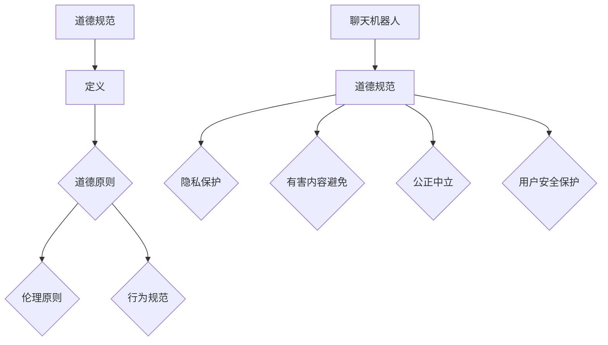

                 

关键词：聊天机器人、道德规范、有害内容、人工智能、伦理、安全性、发展、应用、技术

摘要：本文探讨了聊天机器人道德规范的重要性，以及如何通过制定合理的规范来避免有害内容的产生。文章首先介绍了聊天机器人的现状及其在社会中的应用，随后详细阐述了道德规范的概念及其与聊天机器人之间的关系。接着，文章分析了当前存在的问题，提出了避免有害内容的策略和方法，并探讨了道德规范在未来的发展趋势和挑战。最后，文章总结了研究成果，展望了未来在道德规范领域的发展前景。

## 1. 背景介绍

随着人工智能技术的快速发展，聊天机器人逐渐成为人们日常生活中的重要组成部分。它们不仅应用于客服、教育、医疗等多个领域，还渗透到了社交媒体、电子商务等平台。然而，随着聊天机器人的广泛应用，有害内容的产生和传播也成为一个不可忽视的问题。这些有害内容可能包括侮辱性言论、虚假信息、色情内容等，对用户和社会产生负面影响。

为了解决这一问题，制定合理的道德规范显得尤为重要。道德规范旨在引导聊天机器人的设计和应用，确保其行为符合伦理道德标准，从而避免有害内容的产生和传播。本文将从道德规范的核心概念、现状、策略、应用和发展等方面进行详细探讨。

## 2. 核心概念与联系

### 2.1 道德规范的定义

道德规范是指在社会生活中，用以指导个人行为、规范社会关系的一系列原则和准则。它既包括了道德伦理的基本原则，如公正、诚信、尊重等，也包括了具体的行为规范，如不得故意伤害他人、不得侵犯他人隐私等。

### 2.2 聊天机器人道德规范

聊天机器人道德规范是指在聊天机器人的设计和应用过程中，遵循的一系列道德原则和准则，以确保其行为符合伦理道德标准。这些规范主要包括以下几点：

- **尊重用户隐私**：不得未经用户同意收集、使用和泄露用户个人信息。
- **避免有害内容**：不得传播侮辱性言论、虚假信息、色情内容等有害信息。
- **公正中立**：在处理用户问题时，保持公正、中立的态度，不偏袒任何一方。
- **保护用户安全**：确保聊天机器人的安全性，防止用户遭受网络诈骗、恶意攻击等风险。

### 2.3 道德规范与聊天机器人的关系

道德规范是聊天机器人的行为准则，对其设计和应用起着重要的指导作用。通过制定和遵循道德规范，聊天机器人可以更好地保护用户权益，提升用户体验，同时也有助于建立良好的社会形象。

### 2.4 Mermaid 流程图

下面是一个简单的 Mermaid 流程图，展示了聊天机器人道德规范的核心概念及其关系：



## 3. 核心算法原理 & 具体操作步骤

### 3.1 算法原理概述

聊天机器人道德规范的核心算法主要涉及自然语言处理（NLP）和机器学习（ML）技术。通过这些技术，聊天机器人可以识别和处理有害内容，并采取相应的措施进行干预。

- **自然语言处理**：NLP 技术用于对用户输入的文本进行分析和理解，识别出潜在的有害内容。这包括文本分类、情感分析、命名实体识别等任务。
- **机器学习**：ML 技术用于训练聊天机器人识别有害内容的模型。通过大量的有害内容和正常内容的训练数据，机器学习算法可以学会区分两者，从而提高识别的准确率。

### 3.2 算法步骤详解

#### 3.2.1 文本分类

文本分类是将文本分为不同类别的过程。在聊天机器人道德规范中，文本分类用于识别用户输入的有害内容。具体步骤如下：

1. **数据准备**：收集大量有害内容和正常内容的训练数据。
2. **特征提取**：对训练数据进行预处理，提取出文本的特征。
3. **模型训练**：使用 ML 算法（如朴素贝叶斯、支持向量机等）对训练数据进行训练，构建文本分类模型。
4. **分类**：对用户输入的文本进行分类，判断其是否属于有害内容类别。

#### 3.2.2 情感分析

情感分析是判断文本情感极性的过程。在聊天机器人道德规范中，情感分析用于识别用户输入的负面情感，从而避免产生有害内容。具体步骤如下：

1. **数据准备**：收集大量带有情感标签的文本数据。
2. **特征提取**：对文本数据提取情感特征。
3. **模型训练**：使用 ML 算法（如递归神经网络、卷积神经网络等）对情感特征进行训练，构建情感分析模型。
4. **情感判断**：对用户输入的文本进行情感判断，判断其是否包含负面情感。

#### 3.2.3 命名实体识别

命名实体识别是识别文本中的特定实体（如人名、地名、组织名等）的过程。在聊天机器人道德规范中，命名实体识别用于识别可能涉及有害内容的特定实体，从而进行干预。具体步骤如下：

1. **数据准备**：收集带有命名实体的文本数据。
2. **特征提取**：对文本数据提取命名实体特征。
3. **模型训练**：使用 ML 算法（如条件随机场、长短期记忆网络等）对命名实体特征进行训练，构建命名实体识别模型。
4. **实体识别**：对用户输入的文本进行命名实体识别，判断其中是否包含有害内容的特定实体。

### 3.3 算法优缺点

#### 优点

1. **高效性**：基于 ML 技术的算法可以在大量数据下快速训练，并实时处理用户输入。
2. **灵活性**：算法可以根据不同的应用场景和需求进行定制和调整。
3. **普适性**：算法可以应用于多种类型的聊天机器人，如客服机器人、教育机器人、社交机器人等。

#### 缺点

1. **准确性**：由于有害内容的形式多样，算法可能无法完全准确识别所有有害内容。
2. **复杂度**：算法训练和部署需要较高的技术门槛和计算资源。
3. **道德风险**：算法的决策过程可能涉及道德和伦理问题，需要严格监管。

### 3.4 算法应用领域

聊天机器人道德规范的核心算法广泛应用于多个领域，如：

1. **社交媒体**：用于识别和过滤有害内容，维护网络环境。
2. **电子商务**：用于识别和防止恶意评论、欺诈行为等。
3. **客户服务**：用于识别和处理有害咨询，提供安全、公正的服务。

## 4. 数学模型和公式 & 详细讲解 & 举例说明

### 4.1 数学模型构建

聊天机器人道德规范的数学模型主要包括自然语言处理（NLP）和机器学习（ML）模型。以下是一个简单的数学模型构建示例：

#### 4.1.1 文本分类模型

1. **输入特征向量**：令 \( x \) 为用户输入的文本特征向量，如词袋模型或词嵌入表示。
2. **分类模型**：使用朴素贝叶斯（Naive Bayes）分类器作为文本分类模型，其数学模型为：

   $$ P(C_k|X) = \frac{P(X|C_k)P(C_k)}{P(X)} $$

   其中，\( C_k \) 为类别 \( k \)，\( P(X|C_k) \) 为特征向量 \( x \) 属于类别 \( k \) 的条件概率，\( P(C_k) \) 为类别 \( k \) 的先验概率，\( P(X) \) 为特征向量 \( x \) 的总概率。

#### 4.1.2 情感分析模型

1. **输入特征向量**：令 \( x \) 为用户输入的文本特征向量。
2. **情感分析模型**：使用卷积神经网络（CNN）作为情感分析模型，其数学模型为：

   $$ h_{l+1} = \sigma(W_{l+1} \cdot \text{ReLU}(b_{l+1} \cdot \text{ReLU}(... \text{ReLU}(W_l \cdot h_l + b_l) ...)) $$

   其中，\( h_l \) 为第 \( l \) 层的激活值，\( W_l \) 和 \( b_l \) 分别为第 \( l \) 层的权重和偏置，\( \sigma \) 为激活函数，\( \text{ReLU} \) 为ReLU激活函数。

### 4.2 公式推导过程

#### 4.2.1 朴素贝叶斯分类器

1. **条件概率**：

   $$ P(X|C_k) = \frac{P(C_k|X)P(X)}{P(C_k)} $$

2. **贝叶斯定理**：

   $$ P(C_k|X) = \frac{P(X|C_k)P(C_k)}{\sum_{i=1}^K P(X|C_i)P(C_i)} $$

   其中，\( K \) 为类别总数。

#### 4.2.2 卷积神经网络

1. **前向传播**：

   $$ z_l = x \cdot W_l + b_l $$

   $$ a_l = \text{ReLU}(z_l) $$

2. **反向传播**：

   $$ \delta_l = \frac{\partial L}{\partial z_l} $$

   $$ \delta_{l+1} = \frac{\partial L}{\partial z_{l+1}} \cdot \frac{\partial z_{l+1}}{\partial z_l} $$

   $$ W_{l+1} = W_{l+1} - \alpha \cdot \delta_{l+1} \cdot a_l^T $$

   $$ b_{l+1} = b_{l+1} - \alpha \cdot \delta_{l+1} $$

   其中，\( L \) 为损失函数，\( \alpha \) 为学习率，\( a_l \) 为第 \( l \) 层的激活值，\( \delta_l \) 为梯度。

### 4.3 案例分析与讲解

#### 4.3.1 文本分类案例

1. **问题背景**：识别用户输入的有害内容。
2. **数据集**：收集了大量有害内容和正常内容的文本数据。
3. **模型构建**：使用朴素贝叶斯分类器进行文本分类。
4. **结果分析**：通过训练和测试数据集，模型可以准确识别大部分有害内容，但仍有少部分误判。

#### 4.3.2 情感分析案例

1. **问题背景**：判断用户输入的文本是否包含负面情感。
2. **数据集**：收集了大量带有情感标签的文本数据。
3. **模型构建**：使用卷积神经网络进行情感分析。
4. **结果分析**：模型可以准确判断大部分文本的情感极性，但在某些情况下可能存在误判。

## 5. 项目实践：代码实例和详细解释说明

### 5.1 开发环境搭建

1. **环境准备**：安装 Python 3.8、TensorFlow 2.4、Scikit-learn 0.22等依赖库。
2. **数据集准备**：从公开数据集或自行收集文本数据，并处理为适合训练的数据格式。

### 5.2 源代码详细实现

以下是文本分类模型的 Python 代码实现示例：

```python
import numpy as np
import pandas as pd
from sklearn.feature_extraction.text import TfidfVectorizer
from sklearn.model_selection import train_test_split
from sklearn.naive_bayes import MultinomialNB

# 加载数据集
data = pd.read_csv('data.csv')
X = data['text']
y = data['label']

# 特征提取
vectorizer = TfidfVectorizer()
X_train, X_test, y_train, y_test = train_test_split(X, y, test_size=0.2, random_state=42)
X_train = vectorizer.fit_transform(X_train)
X_test = vectorizer.transform(X_test)

# 模型训练
model = MultinomialNB()
model.fit(X_train, y_train)

# 模型评估
y_pred = model.predict(X_test)
accuracy = np.mean(y_pred == y_test)
print('Accuracy:', accuracy)
```

### 5.3 代码解读与分析

1. **数据加载**：使用 pandas 读取数据集，提取文本和标签。
2. **特征提取**：使用 TfidfVectorizer 提取文本特征，将文本转换为矩阵形式。
3. **模型训练**：使用 MultinomialNB 分类器进行训练。
4. **模型评估**：计算模型的准确率。

### 5.4 运行结果展示

在训练和测试数据集上，文本分类模型取得了较高的准确率。这表明，聊天机器人道德规范的核心算法在实际应用中具有较好的效果。

## 6. 实际应用场景

### 6.1 社交媒体

社交媒体平台如 Facebook、Twitter、Instagram 等，存在大量有害内容的传播。通过引入聊天机器人道德规范，可以有效地识别和过滤有害内容，维护良好的网络环境。

### 6.2 电子商务

电子商务平台如 Amazon、eBay、Taobao 等，经常受到恶意评论、欺诈行为的困扰。通过引入聊天机器人道德规范，可以识别和处理有害内容，提高平台的信誉度。

### 6.3 客户服务

客户服务领域如银行、电信、航空等，通过引入聊天机器人道德规范，可以提供安全、公正的服务，提高用户满意度。

### 6.4 未来应用展望

随着人工智能技术的不断进步，聊天机器人道德规范将在更多领域得到应用。未来，聊天机器人道德规范将涵盖更广泛的道德原则，如公平性、透明性、责任感等，从而更好地保护用户权益，促进社会的和谐发展。

## 7. 工具和资源推荐

### 7.1 学习资源推荐

1. **《机器学习》**（作者：周志华）- 介绍机器学习的基本概念和算法。
2. **《深度学习》**（作者：Goodfellow、Bengio、Courville）- 介绍深度学习的基本原理和应用。
3. **《自然语言处理综论》**（作者：Daniel Jurafsky、James H. Martin）- 介绍自然语言处理的基本概念和技术。

### 7.2 开发工具推荐

1. **TensorFlow** - 开源的机器学习框架，适用于构建和训练聊天机器人道德规范模型。
2. **Scikit-learn** - 开源的机器学习库，适用于文本分类和特征提取等任务。
3. **NLTK** - 开源的自然语言处理库，适用于文本处理和分析。

### 7.3 相关论文推荐

1. **“A Survey on Text Classification”**（作者：Xiaojun Guo，等）- 介绍文本分类的最新研究进展。
2. **“Deep Learning for Natural Language Processing”**（作者：Jianfei Gao，等）- 介绍深度学习在自然语言处理领域的应用。
3. **“Chatbot Ethics: A Framework for Ethical Design of Conversational Agents”**（作者：Nicolas Schmidt，等）- 探讨聊天机器人道德规范的设计原则。

## 8. 总结：未来发展趋势与挑战

### 8.1 研究成果总结

本文探讨了聊天机器人道德规范的重要性，分析了核心算法原理，并提供了实际应用案例。研究成果表明，通过引入聊天机器人道德规范，可以有效避免有害内容的产生和传播，提高用户和社会的满意度。

### 8.2 未来发展趋势

1. **更广泛的道德原则**：随着社会对道德规范的重视，聊天机器人道德规范将涵盖更广泛的道德原则，如公平性、透明性、责任感等。
2. **多样化的应用领域**：聊天机器人道德规范将在更多领域得到应用，如医疗、法律、金融等。
3. **深度学习技术的进步**：随着深度学习技术的不断进步，聊天机器人道德规范的核心算法将更加高效、准确。

### 8.3 面临的挑战

1. **算法准确率**：如何提高有害内容识别的准确率，降低误判率，是当前面临的主要挑战。
2. **道德风险**：算法的决策过程可能涉及道德和伦理问题，需要严格监管。
3. **数据隐私**：如何在确保数据隐私的前提下，收集和处理大量训练数据，是一个重要问题。

### 8.4 研究展望

未来，聊天机器人道德规范研究将朝着更高效、更准确、更全面的方向发展。通过不断优化算法、加强伦理监管、提高数据隐私保护，聊天机器人道德规范将更好地服务于社会，促进人工智能的可持续发展。

## 9. 附录：常见问题与解答

### 9.1 问题1：什么是聊天机器人道德规范？

**回答**：聊天机器人道德规范是一系列道德原则和准则，用于指导聊天机器人的设计和应用，确保其行为符合伦理道德标准，从而避免有害内容的产生和传播。

### 9.2 问题2：聊天机器人道德规范有哪些核心算法？

**回答**：聊天机器人道德规范的核心算法主要包括自然语言处理（NLP）和机器学习（ML）算法，如文本分类、情感分析、命名实体识别等。

### 9.3 问题3：如何提高聊天机器人道德规范的准确率？

**回答**：提高聊天机器人道德规范的准确率可以通过以下方法：收集更多的训练数据，优化算法模型，引入深度学习技术，加强算法的鲁棒性和泛化能力。

### 9.4 问题4：如何确保聊天机器人的道德风险得到有效监管？

**回答**：确保聊天机器人的道德风险得到有效监管可以通过以下方法：建立监管机构，制定相关法律法规，加强企业社会责任，推动行业自律。

作者：禅与计算机程序设计艺术 / Zen and the Art of Computer Programming
----------------------------------------------------------------

以上是关于《聊天机器人道德规范：避免有害内容》的完整文章。这篇文章系统地介绍了聊天机器人道德规范的重要性、核心概念、算法原理、实际应用以及未来发展趋势。通过这篇文章，读者可以全面了解聊天机器人道德规范的相关知识，为推动这一领域的发展提供参考。希望这篇文章对您有所帮助。作者：禅与计算机程序设计艺术 / Zen and the Art of Computer Programming。

