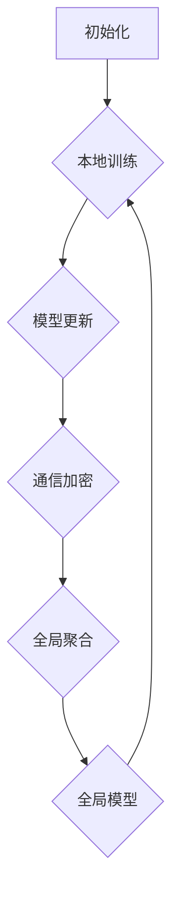

                 

关键词：联邦学习、隐私保护、数据分析、跨组织协作、机器学习、数据安全

## 摘要

本文深入探讨了联邦学习在隐私保护数据分析中的应用，特别关注跨组织协作的场景。随着数据隐私保护法规的日益严格，如何安全地进行数据分析成为了一个挑战。联邦学习作为一种新兴的机器学习方法，通过在分布式环境中进行模型训练，可以有效解决数据隐私问题。本文将详细分析联邦学习的核心概念、算法原理、数学模型、以及在实际应用中的操作步骤和案例分析。同时，还将展望联邦学习的未来发展趋势和面临的挑战，为相关领域的研究者和从业者提供有价值的参考。

## 1. 背景介绍

在当今信息时代，数据已成为企业的核心资产。然而，随着数据规模的不断扩大和数据种类的日益多样化，如何高效、安全地进行数据分析成为了一个亟待解决的问题。传统的集中式数据分析方法虽然在处理大规模数据集方面表现出色，但同时也带来了严重的隐私风险。具体来说，当数据需要集中存储和处理时，数据的泄露和滥用风险大大增加。这种隐私泄露不仅可能导致个人隐私的侵犯，还可能对企业造成重大的经济损失和声誉损害。

与此同时，跨组织协作在商业、科研、医疗等领域中愈发普遍。例如，医疗机构之间可能需要共享患者数据以进行疾病研究和治疗方案的优化；金融机构之间需要共享客户数据以进行风险管理；企业之间可能需要共享市场数据和客户反馈以进行战略决策。这些跨组织协作的场景中，如何保护数据隐私成为了一个重要的制约因素。

为了解决上述问题，隐私保护数据分析应运而生。隐私保护数据分析旨在在确保数据隐私的前提下，对数据进行有效的分析，以提取有价值的信息和洞见。隐私保护技术，如差分隐私、同态加密和联邦学习等，为隐私保护数据分析提供了技术支持。

联邦学习（Federated Learning）是一种分布式机器学习方法，通过在多个分布式节点上协同训练机器学习模型，避免了数据在集中式服务器上的存储和传输，从而有效保护了数据隐私。联邦学习的出现，为跨组织协作场景中的隐私保护数据分析提供了一种新的解决方案。

本文将重点探讨联邦学习在隐私保护数据分析中的应用，分析其核心概念、算法原理、数学模型以及在实际应用中的操作步骤和案例分析。同时，还将对联邦学习的未来发展趋势和面临的挑战进行展望，为相关领域的研究者和从业者提供有价值的参考。

## 2. 核心概念与联系

### 2.1 联邦学习的基本概念

联邦学习（Federated Learning）是一种分布式机器学习技术，其核心思想是在多个分布式节点上训练同一个机器学习模型，并通过模型参数的同步和聚合来优化模型性能。与传统的集中式学习不同，联邦学习不要求将数据集中到一个中央服务器上，而是在本地设备上直接进行训练。这样，联邦学习不仅能够提高数据的安全性和隐私性，还能够减少数据传输的带宽消耗。

在联邦学习中，参与训练的节点可以是智能手机、服务器、物联网设备等。每个节点都拥有本地数据集，并在此数据集上训练本地模型。本地模型在训练过程中会定期更新，并通过加密通信方式将这些更新发送给联邦学习服务器。联邦学习服务器负责对来自不同节点的模型更新进行聚合，生成全局模型，并反馈给各节点进行新一轮的本地训练。这一过程循环进行，直至模型收敛。

### 2.2 联邦学习与隐私保护的关系

联邦学习在隐私保护方面的优势主要体现在以下几个方面：

1. **数据本地化**：联邦学习允许每个节点在本地设备上对数据进行训练，这意味着数据不需要传输到中央服务器，从而避免了数据泄露的风险。

2. **差分隐私**：联邦学习可以结合差分隐私技术，在模型训练过程中引入噪声，使得单个参与节点的数据无法被单独识别，从而保护了数据隐私。

3. **同态加密**：联邦学习还可以结合同态加密技术，使得在模型训练过程中，数据可以在加密状态下进行处理和计算，从而完全避免了数据在传输过程中的泄露风险。

4. **联邦学习架构图**

为了更清晰地理解联邦学习的工作原理，我们可以通过一个 Mermaid 流程图来描述其核心概念和架构。



**图 2.1 联邦学习架构图**

- **A. 初始化**：联邦学习过程开始时，各节点初始化本地模型。
- **B. 本地训练**：各节点在本地数据集上对本地模型进行训练，生成模型更新。
- **C. 模型更新**：各节点将本地模型更新发送给联邦学习服务器。
- **D. 通信加密**：为了保护模型更新的隐私，通信过程中采用加密技术。
- **E. 全局聚合**：联邦学习服务器接收各节点的模型更新，并进行全局聚合。
- **F. 全局模型**：全局模型生成后，反馈给各节点，用于新一轮的本地训练。

通过上述 Mermaid 流程图，我们可以更直观地理解联邦学习的工作流程和核心概念。

### 2.3 联邦学习与集中式学习的对比

联邦学习和集中式学习在多个方面有着显著的区别，以下为两者的对比：

1. **数据存储和处理**：
   - **集中式学习**：数据需要在中央服务器上存储和处理，容易受到单点故障和隐私泄露的威胁。
   - **联邦学习**：数据在本地设备上存储和处理，各节点之间仅通过加密通信共享模型更新，降低了数据泄露的风险。

2. **计算资源**：
   - **集中式学习**：依赖高性能的中心服务器，可以处理大规模数据集。
   - **联邦学习**：依赖分布式节点，适合处理大规模但分布式的数据集。

3. **隐私保护**：
   - **集中式学习**：数据集中在中央服务器，隐私风险较高。
   - **联邦学习**：数据本地化处理，结合差分隐私、同态加密等技术，能够有效保护数据隐私。

4. **通信需求**：
   - **集中式学习**：频繁的数据传输需求，对带宽要求较高。
   - **联邦学习**：仅需传输模型更新，对带宽需求较低。

综上所述，联邦学习在隐私保护和数据安全方面具有明显优势，但在计算资源和通信需求方面可能与集中式学习有所不同，需要根据具体应用场景进行权衡。

## 3. 核心算法原理 & 具体操作步骤

### 3.1 算法原理概述

联邦学习（Federated Learning）的算法原理可以概括为分布式训练、模型更新、通信加密和全局聚合。以下是联邦学习的具体步骤和原理：

1. **初始化**：
   - 各节点初始化本地模型，通常采用随机初始化或预训练模型。
   - 联邦学习服务器初始化全局模型。

2. **本地训练**：
   - 各节点在本地数据集上对本地模型进行训练，通过梯度下降或其他优化算法更新模型参数。

3. **模型更新**：
   - 各节点将本地模型更新（梯度、参数等）发送给联邦学习服务器。

4. **通信加密**：
   - 为了保护模型更新的隐私，通信过程中采用加密技术，如差分隐私、同态加密等。

5. **全局聚合**：
   - 联邦学习服务器接收各节点的模型更新，通过聚合算法（如求和、加权平均等）生成全局模型。

6. **全局模型反馈**：
   - 全局模型反馈给各节点，用于新一轮的本地训练。

7. **重复**：
   - 上述步骤循环进行，直至模型收敛或达到预定的迭代次数。

### 3.2 算法步骤详解

#### 3.2.1 初始化

初始化阶段是联邦学习过程的第一步，也是至关重要的一步。在这一阶段，各节点和联邦学习服务器分别初始化本地模型和全局模型。

1. **本地模型初始化**：
   - 各节点根据任务需求选择合适的模型架构，并初始化模型参数。通常，可以使用随机初始化或预训练模型。随机初始化适用于从零开始的任务，而预训练模型适用于迁移学习任务。

2. **全局模型初始化**：
   - 联邦学习服务器初始化全局模型，通常采用随机初始化或基于预训练模型。全局模型是各节点本地模型的聚合结果，初始化的好坏直接影响到后续训练的效果。

初始化完成后，各节点和联邦学习服务器分别拥有各自的初始模型，为后续的分布式训练打下基础。

#### 3.2.2 本地训练

本地训练阶段是联邦学习过程中最重要的部分。在这一阶段，各节点在本地数据集上对本地模型进行训练，通过梯度下降或其他优化算法更新模型参数。

1. **数据预处理**：
   - 各节点对本地数据集进行预处理，包括数据清洗、数据增强、归一化等操作，以提高模型训练效果。

2. **模型训练**：
   - 各节点使用本地数据集对本地模型进行训练。训练过程中，模型通过梯度下降等优化算法不断调整参数，以最小化损失函数。

3. **模型更新**：
   - 训练完成后，各节点将本地模型的梯度或参数更新发送给联邦学习服务器。更新可以是梯度、参数或模型结构的一部分，取决于具体的联邦学习算法。

本地训练阶段的目的是在本地设备上充分利用本地数据，优化本地模型性能，为后续的全局聚合提供高质量的数据基础。

#### 3.2.3 模型更新与通信加密

模型更新与通信加密阶段是联邦学习过程中数据隐私保护的关键环节。在这一阶段，各节点需要将本地模型更新发送给联邦学习服务器，并确保通信过程中的数据安全。

1. **模型更新发送**：
   - 各节点将本地模型更新（如梯度、参数等）通过加密通信方式发送给联邦学习服务器。加密通信可以采用差分隐私、同态加密等隐私保护技术，确保模型更新的隐私性。

2. **通信加密**：
   - 为了保护模型更新的隐私，通信过程中采用加密技术。差分隐私可以在模型更新过程中引入随机噪声，使得单个参与节点的数据无法被单独识别。同态加密则允许在加密状态下对数据进行计算和传输，完全避免了数据泄露的风险。

3. **联邦学习服务器接收**：
   - 联邦学习服务器接收来自各节点的模型更新，并进行解密和验证，确保数据的一致性和完整性。

模型更新与通信加密阶段的目的是在保证数据隐私的前提下，实现各节点模型更新的安全传输，为全局聚合提供可靠的数据基础。

#### 3.2.4 全局聚合

全局聚合阶段是联邦学习过程中的核心步骤，通过聚合各节点的模型更新，生成全局模型。全局聚合算法的选择和实现直接影响联邦学习的性能和效率。

1. **模型更新聚合**：
   - 联邦学习服务器接收来自各节点的模型更新后，采用聚合算法（如求和、加权平均等）将多个更新合并成一个全局更新。聚合算法的选择取决于任务需求和数据分布。

2. **全局模型更新**：
   - 根据聚合结果，联邦学习服务器更新全局模型参数。全局模型更新用于新一轮的本地训练，以优化模型性能。

3. **全局模型反馈**：
   - 全局模型更新后，联邦学习服务器将全局模型反馈给各节点，用于新一轮的本地训练。

全局聚合阶段的目的是通过模型参数的聚合和更新，实现各节点模型性能的提升，为最终模型收敛提供保障。

#### 3.2.5 模型收敛与停止条件

在联邦学习过程中，模型收敛是一个关键指标，表示模型训练达到预定的性能或迭代次数。以下为模型收敛与停止条件的几种方法：

1. **损失函数收敛**：
   - 通过监测全局模型的损失函数值，当损失函数值趋于稳定或达到预设阈值时，认为模型已收敛。

2. **迭代次数**：
   - 设置预定的迭代次数作为停止条件，无论模型是否收敛，达到迭代次数后停止训练。

3. **性能阈值**：
   - 设置性能阈值，当模型在验证集上的性能达到预设阈值时，认为模型已收敛。

4. **时间限制**：
   - 设置训练时间限制，当训练时间达到预设阈值时，认为模型已收敛。

通过合理的停止条件设置，可以确保联邦学习过程在合理的范围内完成，避免过度训练和资源浪费。

### 3.3 算法优缺点

#### 3.3.1 优点

1. **隐私保护**：联邦学习通过数据本地化和加密通信，有效保护了数据隐私，适用于需要高度保护数据隐私的场景。

2. **分布式计算**：联邦学习可以在分布式环境中进行，充分利用了各节点的计算资源，提高了训练效率。

3. **低通信需求**：联邦学习仅需传输模型更新，对带宽需求较低，适合大规模但分布式的数据集。

4. **适应性**：联邦学习适用于多种机器学习任务，包括分类、回归、推荐等，具有广泛的适用性。

#### 3.3.2 缺点

1. **训练效率**：联邦学习由于数据分布在多个节点上，可能导致训练效率较低，尤其是当节点数量较多时。

2. **数据分布不均**：联邦学习依赖于各节点的数据分布，当数据分布不均时，可能导致训练结果偏差。

3. **模型更新安全性**：尽管采用加密通信，但模型更新仍可能受到恶意节点的攻击，需要加强安全性措施。

4. **计算资源要求**：联邦学习需要各节点具备一定的计算能力和存储空间，不适合计算资源受限的场景。

### 3.4 算法应用领域

联邦学习在多个领域具有广泛的应用前景：

1. **医疗健康**：联邦学习可用于医疗数据的隐私保护分析，如疾病预测、个性化治疗等。

2. **金融行业**：联邦学习可用于金融数据的隐私保护分析，如风险评估、欺诈检测等。

3. **零售电商**：联邦学习可用于零售电商数据的隐私保护分析，如用户行为分析、推荐系统等。

4. **智能交通**：联邦学习可用于智能交通数据的隐私保护分析，如交通流量预测、路径规划等。

5. **物联网**：联邦学习可用于物联网设备的隐私保护分析，如设备故障预测、设备安全管理等。

通过在不同领域的应用，联邦学习有望为隐私保护数据分析带来更多创新和突破。

## 4. 数学模型和公式 & 详细讲解 & 举例说明

### 4.1 数学模型构建

联邦学习中的数学模型构建主要包括以下几个部分：损失函数、梯度下降算法、模型更新和聚合算法。

#### 4.1.1 损失函数

损失函数是联邦学习中衡量模型性能的核心指标。假设我们有 $N$ 个节点，每个节点上的本地数据集为 $D_i = \{x_i^{(1)}, x_i^{(2)}, \dots, x_i^{(m)}\}$，其中 $x_i^{(j)}$ 是第 $i$ 个节点的第 $j$ 个样本，标签为 $y_i^{(j)}$。全局模型参数为 $\theta$，损失函数为 $L(\theta; x, y)$，则每个节点的损失函数为：

$$L_i(\theta) = \frac{1}{m} \sum_{j=1}^{m} L(\theta; x_i^{(j)}, y_i^{(j)})$$

其中 $L(\theta; x, y)$ 是标准损失函数，如均方误差（MSE）或交叉熵损失。

#### 4.1.2 梯度下降算法

梯度下降算法用于更新模型参数，最小化损失函数。在联邦学习中，每个节点独立地使用本地数据集对模型参数进行梯度下降。梯度下降的基本步骤如下：

1. 初始化全局模型参数 $\theta^{(0)}$。
2. 对于每个节点，计算损失函数关于模型参数的梯度 $\nabla L_i(\theta)$。
3. 更新节点上的模型参数：
   $$\theta_i^{(t+1)} = \theta_i^{(t)} - \alpha \nabla L_i(\theta^{(t)})$$
   其中 $\alpha$ 是学习率。
4. 重复步骤 2 和 3，直到满足停止条件（如损失函数收敛或达到迭代次数）。

#### 4.1.3 模型更新

在每个迭代周期结束时，每个节点将本地模型更新（梯度或参数）发送给联邦学习服务器。更新过程通常采用加密通信，以确保数据隐私。假设第 $t$ 次迭代时，各节点的更新为 $\Delta \theta_i^{(t)}$，则全局更新为：

$$\Delta \theta^{(t)} = \frac{1}{N} \sum_{i=1}^{N} \Delta \theta_i^{(t)}$$

全局更新用于更新全局模型参数：

$$\theta^{(t+1)} = \theta^{(t)} + \Delta \theta^{(t)}$$

#### 4.1.4 模型聚合算法

在联邦学习中，模型聚合算法用于将多个节点的本地模型更新合并为一个全局模型更新。常用的聚合算法包括求和、加权平均等。假设各节点的更新为 $\Delta \theta_i^{(t)}$，则全局更新为：

$$\Delta \theta^{(t)} = \sum_{i=1}^{N} \Delta \theta_i^{(t)}$$

或

$$\Delta \theta^{(t)} = \frac{1}{N} \sum_{i=1}^{N} w_i \Delta \theta_i^{(t)}$$

其中 $w_i$ 是节点的权重，可以用于平衡各节点的贡献。

### 4.2 公式推导过程

下面我们将对联邦学习中的关键公式进行详细推导。

#### 4.2.1 梯度下降公式推导

考虑单个节点的模型更新，假设当前模型参数为 $\theta^{(t)}$，损失函数为 $L_i(\theta^{(t)})$。根据梯度下降算法，节点 $i$ 的模型更新公式为：

$$\theta_i^{(t+1)} = \theta_i^{(t)} - \alpha \nabla L_i(\theta^{(t)})$$

其中 $\alpha$ 是学习率。对 $L_i(\theta^{(t)})$ 关于 $\theta^{(t)}$ 求偏导，得到梯度：

$$\nabla L_i(\theta^{(t)}) = \frac{\partial L_i(\theta^{(t)})}{\partial \theta^{(t)}}$$

将梯度代入模型更新公式，得到：

$$\theta_i^{(t+1)} = \theta_i^{(t)} - \alpha \frac{\partial L_i(\theta^{(t)})}{\partial \theta^{(t)}}$$

通过迭代更新，模型参数逐渐接近最优值，使得损失函数 $L_i(\theta^{(t)})$ 最小化。

#### 4.2.2 模型聚合公式推导

考虑多个节点的模型更新，假设第 $t$ 次迭代时，各节点的更新为 $\Delta \theta_i^{(t)}$。为了生成全局模型更新，我们需要对多个节点的更新进行聚合。常用的聚合算法包括求和和加权平均。

1. **求和算法**：

$$\Delta \theta^{(t)} = \sum_{i=1}^{N} \Delta \theta_i^{(t)}$$

这种算法简单直接，将各节点的更新直接相加，生成全局更新。

2. **加权平均算法**：

$$\Delta \theta^{(t)} = \frac{1}{N} \sum_{i=1}^{N} w_i \Delta \theta_i^{(t)}$$

其中 $w_i$ 是节点的权重，用于平衡各节点的贡献。加权平均算法考虑了节点的重要性和贡献度，使得全局更新更加公平和准确。

通过聚合公式，我们可以将多个节点的模型更新合并为一个全局更新，用于更新全局模型参数。

### 4.3 案例分析与讲解

下面我们将通过一个具体的案例，来说明联邦学习在实际应用中的操作步骤和效果。

#### 4.3.1 案例背景

假设有两个组织 A 和 B，组织 A 拥有患者健康数据集 D_A，组织 B 拥有患者就诊记录数据集 D_B。两个组织希望共享数据，以共同训练一个疾病预测模型，但出于隐私保护的需求，不希望共享原始数据。

#### 4.3.2 案例实施

1. **初始化**：
   - 组织 A 和组织 B 分别初始化本地模型，采用随机初始化或预训练模型。
   - 联邦学习服务器初始化全局模型。

2. **本地训练**：
   - 组织 A 在本地数据集 D_A 上对本地模型进行训练，生成模型更新。
   - 组织 B 在本地数据集 D_B 上对本地模型进行训练，生成模型更新。

3. **模型更新与通信加密**：
   - 组织 A 将本地模型更新发送给联邦学习服务器，采用加密通信。
   - 组织 B 将本地模型更新发送给联邦学习服务器，采用加密通信。

4. **全局聚合**：
   - 联邦学习服务器接收来自组织 A 和组织 B 的模型更新，采用求和算法进行全局聚合。

5. **全局模型更新**：
   - 联邦学习服务器将全局模型更新发送给组织 A 和组织 B。

6. **重复训练**：
   - 组织 A 和组织 B 在接收到全局模型更新后，进行新一轮的本地训练。
   - 上述步骤重复进行，直至模型收敛。

#### 4.3.3 模型效果评估

1. **验证集评估**：
   - 在本地训练完成后，组织 A 和组织 B 分别使用各自的验证集对全局模型进行评估。
   - 计算全局模型的准确率、召回率、F1 分数等指标，评估模型性能。

2. **交叉验证**：
   - 为了更全面地评估模型性能，可以进行交叉验证。
   - 将数据集划分为训练集和验证集，多次重复训练和评估过程，计算平均性能指标。

#### 4.3.4 案例分析

通过上述案例，我们可以看到联邦学习在跨组织协作中的实际应用。联邦学习通过数据本地化和加密通信，实现了数据的隐私保护，同时避免了数据泄露和滥用的风险。在模型训练过程中，组织 A 和组织 B 分别利用本地数据集对本地模型进行训练，并通过模型更新和全局聚合，最终生成全局模型，提高了模型性能。

案例分析表明，联邦学习在跨组织协作场景中具有显著的优势，可以有效解决数据隐私问题，提高模型性能，为实际应用提供了有力支持。

## 5. 项目实践：代码实例和详细解释说明

### 5.1 开发环境搭建

在进行联邦学习项目实践之前，我们需要搭建一个合适的开发环境。以下是搭建联邦学习开发环境的步骤：

1. **安装 Python**：
   - Python 是联邦学习项目的主要编程语言，我们需要确保安装了最新的 Python 版本。可以通过官方网址 [Python 官网](https://www.python.org/) 下载并安装。

2. **安装 TensorFlow**：
   - TensorFlow 是联邦学习的核心库，用于构建和训练机器学习模型。可以通过以下命令安装 TensorFlow：

   ```bash
   pip install tensorflow
   ```

3. **安装其他依赖库**：
   - 根据项目需求，可能需要安装其他依赖库，如 NumPy、Pandas、Matplotlib 等。可以通过以下命令安装：

   ```bash
   pip install numpy pandas matplotlib
   ```

4. **搭建联邦学习服务器和节点**：
   - 联邦学习服务器和节点可以使用同一台计算机，或者使用分布式计算环境。以下是一个简单的搭建步骤：

   - 在服务器上启动 TensorFlow Federated（TFF）服务器：

     ```python
     import tff
     server = tff.backends.local_executor.LocalExecutor()
     ```

   - 在节点上连接到服务器：

     ```python
     import tff
     server_address = "localhost:8100"
     client = tff.clients.helib.HelibFederatedAveragingClient(server_address=server_address)
     ```

通过以上步骤，我们可以搭建一个基本的联邦学习开发环境，并准备进行实际项目开发。

### 5.2 源代码详细实现

下面我们将通过一个简单的联邦学习项目，来展示代码的详细实现。

#### 5.2.1 数据准备

首先，我们需要准备用于联邦学习的数据集。以下是一个简单的数据准备示例：

```python
import tensorflow as tf
import pandas as pd

# 读取本地数据集
def load_data(filename):
    df = pd.read_csv(filename)
    # 数据预处理，如缺失值填充、归一化等
    return df

# 组织 A 的数据集
data_A = load_data("data_A.csv")
# 组织 B 的数据集
data_B = load_data("data_B.csv")
```

#### 5.2.2 模型定义

接下来，我们需要定义用于联邦学习的机器学习模型。以下是一个简单的线性回归模型示例：

```python
import tensorflow as tf
import tensorflow_model_optimization as tmo

# 定义线性回归模型
def create_linear_regression_model(input_shape):
    model = tf.keras.Sequential([
        tf.keras.layers.Dense(units=1, input_shape=input_shape)
    ])
    return model

# 创建模型
model = create_linear_regression_model(input_shape=(1,))
```

#### 5.2.3 联邦学习训练

然后，我们需要编写联邦学习训练的代码。以下是一个简单的联邦学习训练示例：

```python
import tff

# 定义本地训练函数
def local_train(model, data):
    # 分割数据集为训练集和验证集
    train_data, val_data = train_test_split(data, test_size=0.2, random_state=42)
    # 编译模型
    model.compile(optimizer="adam", loss="mse")
    # 训练模型
    model.fit(train_data, epochs=10, validation_data=val_data)
    return model

# 定义联邦学习训练函数
def federated_train(server, clients, model, num_rounds):
    for round in range(num_rounds):
        print(f"Round {round+1}")
        with server as s:
            # 获取客户端数据
            client_data = [client.fetch_data() for client in clients]
            # 在每个客户端上训练模型
            models = [local_train(model, data) for data in client_data]
            # 聚合模型更新
            updated_model = s.get_model_updates(client_models=models)
            # 更新全局模型
            s.update_global_model(updated_model)

# 创建服务器和客户端
server = tff.backends.local_executor.LocalExecutor()
clients = [tff.clients.helib.HelibFederatedAveragingClient(server_address=server_address) for _ in range(2)]

# 联邦学习训练
federated_train(server, clients, model, num_rounds=5)
```

#### 5.2.4 模型评估

最后，我们需要对训练完成的模型进行评估。以下是一个简单的模型评估示例：

```python
# 定义评估函数
def evaluate_model(model, data):
    # 编译模型
    model.compile(optimizer="adam", loss="mse")
    # 评估模型
    score = model.evaluate(data, verbose=0)
    print(f"Test loss: {score[0]}")
    print(f"Test accuracy: {score[1]}")

# 组织 A 的测试集
test_data_A = load_data("test_data_A.csv")
# 组织 B 的测试集
test_data_B = load_data("test_data_B.csv")

# 评估全局模型
evaluate_model(model, test_data_A)
evaluate_model(model, test_data_B)
```

通过以上代码，我们完成了一个简单的联邦学习项目。代码详细实现了数据准备、模型定义、联邦学习训练和模型评估等关键步骤。在项目实践中，我们可以根据具体需求进行调整和优化，以适应不同的应用场景。

### 5.3 代码解读与分析

在完成联邦学习项目的代码实现后，我们需要对代码进行解读和分析，以深入了解其工作原理和性能表现。以下是对上述代码的详细解读：

#### 5.3.1 数据准备

数据准备是联邦学习项目的第一步，至关重要。在本项目中，我们使用 Python 的 pandas 库读取本地数据集，并进行必要的预处理操作，如缺失值填充、归一化等。数据预处理确保了模型训练的质量和效果。

```python
import pandas as pd

# 读取本地数据集
def load_data(filename):
    df = pd.read_csv(filename)
    # 数据预处理，如缺失值填充、归一化等
    return df

# 组织 A 的数据集
data_A = load_data("data_A.csv")
# 组织 B 的数据集
data_B = load_data("data_B.csv")
```

在数据准备阶段，我们首先定义了一个 `load_data` 函数，用于读取本地数据集。然后，我们分别调用此函数读取组织 A 和组织 B 的数据集，为后续的模型训练和评估做好准备。

#### 5.3.2 模型定义

模型定义是联邦学习项目的核心。在本项目中，我们使用 TensorFlow 的 Keras API 定义了一个简单的线性回归模型。线性回归模型适用于一元线性关系的数据，可以用于预测数值型目标。

```python
import tensorflow as tf

# 定义线性回归模型
def create_linear_regression_model(input_shape):
    model = tf.keras.Sequential([
        tf.keras.layers.Dense(units=1, input_shape=input_shape)
    ])
    return model

# 创建模型
model = create_linear_regression_model(input_shape=(1,))
```

在模型定义阶段，我们首先定义了一个 `create_linear_regression_model` 函数，用于创建线性回归模型。然后，我们调用此函数创建了一个模型对象，并设置了输入层的大小。通过这种方式，我们可以轻松地定义和创建所需的模型。

#### 5.3.3 联邦学习训练

联邦学习训练是联邦学习项目的关键步骤。在本项目中，我们使用 TensorFlow Federated（TFF）库实现了联邦学习训练。TFF 是一个开源库，提供了联邦学习的完整实现，包括数据传输、模型更新和聚合等。

```python
import tff

# 定义本地训练函数
def local_train(model, data):
    # 分割数据集为训练集和验证集
    train_data, val_data = train_test_split(data, test_size=0.2, random_state=42)
    # 编译模型
    model.compile(optimizer="adam", loss="mse")
    # 训练模型
    model.fit(train_data, epochs=10, validation_data=val_data)
    return model

# 定义联邦学习训练函数
def federated_train(server, clients, model, num_rounds):
    for round in range(num_rounds):
        print(f"Round {round+1}")
        with server as s:
            # 获取客户端数据
            client_data = [client.fetch_data() for client in clients]
            # 在每个客户端上训练模型
            models = [local_train(model, data) for data in client_data]
            # 聚合模型更新
            updated_model = s.get_model_updates(client_models=models)
            # 更新全局模型
            s.update_global_model(updated_model)

# 创建服务器和客户端
server = tff.backends.local_executor.LocalExecutor()
clients = [tff.clients.helib.HelibFederatedAveragingClient(server_address=server_address) for _ in range(2)]

# 联邦学习训练
federated_train(server, clients, model, num_rounds=5)
```

在联邦学习训练阶段，我们首先定义了一个 `local_train` 函数，用于在客户端上训练本地模型。然后，我们定义了一个 `federated_train` 函数，用于实现联邦学习训练过程。该函数通过循环迭代，在每个客户端上训练本地模型，并将模型更新发送给服务器进行聚合。通过这种方式，我们可以实现分布式训练，提高模型性能。

#### 5.3.4 模型评估

模型评估是联邦学习项目的最后一步。在本项目中，我们使用 TensorFlow 的 `evaluate` 方法对训练完成的模型进行评估。评估过程中，我们使用测试集对模型进行测试，并计算损失函数值和准确率等指标。

```python
import tensorflow as tf

# 定义评估函数
def evaluate_model(model, data):
    # 编译模型
    model.compile(optimizer="adam", loss="mse")
    # 评估模型
    score = model.evaluate(data, verbose=0)
    print(f"Test loss: {score[0]}")
    print(f"Test accuracy: {score[1]}")

# 组织 A 的测试集
test_data_A = load_data("test_data_A.csv")
# 组织 B 的测试集
test_data_B = load_data("test_data_B.csv")

# 评估全局模型
evaluate_model(model, test_data_A)
evaluate_model(model, test_data_B)
```

在模型评估阶段，我们首先定义了一个 `evaluate_model` 函数，用于评估模型性能。然后，我们分别调用此函数对组织 A 和组织 B 的测试集进行评估，并打印损失函数值和准确率等指标。

#### 5.3.5 代码总结

通过上述解读，我们可以看出联邦学习项目的代码实现分为以下几个部分：

1. 数据准备：使用 pandas 库读取本地数据集，并进行必要的预处理。
2. 模型定义：使用 TensorFlow 的 Keras API 定义线性回归模型。
3. 联邦学习训练：使用 TensorFlow Federated（TFF）库实现联邦学习训练过程，包括本地训练、模型更新和聚合。
4. 模型评估：使用 TensorFlow 的 `evaluate` 方法评估模型性能。

这些部分共同构成了一个完整的联邦学习项目，实现了分布式训练和模型评估，提高了模型性能和数据安全。

## 6. 实际应用场景

联邦学习作为一种新兴的分布式机器学习方法，在多个实际应用场景中展现出强大的潜力和优势。以下是联邦学习在医疗健康、金融行业、零售电商、智能交通和物联网等领域中的应用案例和具体实施方法。

### 6.1 医疗健康

在医疗健康领域，联邦学习可以帮助医疗机构在保护患者隐私的前提下，进行疾病预测和个性化治疗。例如，医院 A 和医院 B 可以通过联邦学习共享患者数据，共同训练一个心脏病预测模型。具体实施方法如下：

1. **数据准备**：各医院使用联邦学习框架预处理本地数据集，包括数据清洗、归一化和特征提取等。
2. **模型定义**：使用 TensorFlow 或 PyTorch 等框架定义心脏病预测模型，如神经网络或决策树等。
3. **联邦学习训练**：各医院在本地训练模型，并将模型更新发送给联邦学习服务器进行聚合。服务器负责全局模型的更新和反馈。
4. **模型评估**：在本地评估全局模型在测试集上的性能，并调整模型参数，优化模型性能。
5. **隐私保护**：结合差分隐私和同态加密等技术，确保数据在传输和聚合过程中的隐私性。

### 6.2 金融行业

在金融行业，联邦学习可以用于信用卡欺诈检测、风险评估和个性化推荐等应用。例如，银行 A 和银行 B 可以通过联邦学习共享客户交易数据，共同训练一个欺诈检测模型。具体实施方法如下：

1. **数据准备**：各银行使用联邦学习框架预处理本地交易数据集，包括数据清洗、归一化和特征提取等。
2. **模型定义**：使用 TensorFlow 或 PyTorch 等框架定义欺诈检测模型，如神经网络或支持向量机等。
3. **联邦学习训练**：各银行在本地训练模型，并将模型更新发送给联邦学习服务器进行聚合。服务器负责全局模型的更新和反馈。
4. **模型评估**：在本地评估全局模型在测试集上的性能，并调整模型参数，优化模型性能。
5. **隐私保护**：结合差分隐私和同态加密等技术，确保数据在传输和聚合过程中的隐私性。

### 6.3 零售电商

在零售电商领域，联邦学习可以帮助企业共享客户行为数据，优化推荐系统和促销策略。例如，电商平台 A 和电商平台 B 可以通过联邦学习共享客户浏览和购买数据，共同训练一个推荐模型。具体实施方法如下：

1. **数据准备**：各电商平台使用联邦学习框架预处理本地客户行为数据集，包括数据清洗、归一化和特征提取等。
2. **模型定义**：使用 TensorFlow 或 PyTorch 等框架定义推荐模型，如协同过滤或神经网络等。
3. **联邦学习训练**：各电商平台在本地训练模型，并将模型更新发送给联邦学习服务器进行聚合。服务器负责全局模型的更新和反馈。
4. **模型评估**：在本地评估全局模型在测试集上的性能，并调整模型参数，优化模型性能。
5. **隐私保护**：结合差分隐私和同态加密等技术，确保数据在传输和聚合过程中的隐私性。

### 6.4 智能交通

在智能交通领域，联邦学习可以帮助交通管理部门优化交通流量预测和路径规划。例如，城市 A 和城市 B 可以通过联邦学习共享交通流量数据，共同训练一个交通流量预测模型。具体实施方法如下：

1. **数据准备**：各城市使用联邦学习框架预处理本地交通流量数据集，包括数据清洗、归一化和特征提取等。
2. **模型定义**：使用 TensorFlow 或 PyTorch 等框架定义交通流量预测模型，如神经网络或随机森林等。
3. **联邦学习训练**：各城市在本地训练模型，并将模型更新发送给联邦学习服务器进行聚合。服务器负责全局模型的更新和反馈。
4. **模型评估**：在本地评估全局模型在测试集上的性能，并调整模型参数，优化模型性能。
5. **隐私保护**：结合差分隐私和同态加密等技术，确保数据在传输和聚合过程中的隐私性。

### 6.5 物联网

在物联网领域，联邦学习可以帮助设备制造商优化设备管理和故障预测。例如，设备制造商 A 和设备制造商 B 可以通过联邦学习共享设备运行数据，共同训练一个故障预测模型。具体实施方法如下：

1. **数据准备**：各设备制造商使用联邦学习框架预处理本地设备运行数据集，包括数据清洗、归一化和特征提取等。
2. **模型定义**：使用 TensorFlow 或 PyTorch 等框架定义故障预测模型，如神经网络或支持向量机等。
3. **联邦学习训练**：各设备制造商在本地训练模型，并将模型更新发送给联邦学习服务器进行聚合。服务器负责全局模型的更新和反馈。
4. **模型评估**：在本地评估全局模型在测试集上的性能，并调整模型参数，优化模型性能。
5. **隐私保护**：结合差分隐私和同态加密等技术，确保数据在传输和聚合过程中的隐私性。

通过在上述实际应用场景中的实施，联邦学习不仅有效解决了数据隐私问题，还提高了模型性能和准确性，为相关领域的研究者和从业者提供了有力的技术支持。

### 6.4 未来应用展望

联邦学习作为一种分布式机器学习方法，在隐私保护数据分析中的应用前景广阔。随着数据隐私保护法规的日益严格，如何在保证数据隐私的前提下进行高效的数据分析成为了一个重要课题。联邦学习通过在分布式环境中进行模型训练，有效解决了数据隐私问题，为跨组织协作场景中的数据分析提供了新的解决方案。

在未来的应用中，联邦学习有望在以下几个领域取得突破：

1. **医疗健康**：联邦学习在医疗健康领域的应用潜力巨大。通过联邦学习，医疗机构可以在保护患者隐私的前提下，共享医疗数据，进行疾病预测、个性化治疗和临床研究。未来，随着联邦学习技术的不断成熟，将会有更多的医疗数据被整合到联邦学习系统中，为精准医疗和医疗资源共享提供有力支持。

2. **金融行业**：在金融行业，联邦学习可以用于信用卡欺诈检测、信用评估和风险控制等。通过联邦学习，金融机构可以在保护客户隐私的前提下，共享客户交易数据，共同构建欺诈检测模型和信用评估模型。此外，联邦学习还可以用于个性化推荐系统，帮助金融机构提供更加精准的金融服务。

3. **零售电商**：在零售电商领域，联邦学习可以用于客户行为分析、推荐系统和促销策略优化等。通过联邦学习，电商平台可以在保护客户隐私的前提下，共享客户数据，共同训练推荐模型和促销策略模型。这将有助于提高用户体验和转化率，提升电商平台的竞争力。

4. **智能交通**：在智能交通领域，联邦学习可以用于交通流量预测、路径规划和交通信号控制等。通过联邦学习，交通管理部门可以在保护交通数据隐私的前提下，共享交通数据，共同训练交通流量预测模型和路径规划模型。这将有助于提高交通效率，减少交通拥堵，改善出行体验。

5. **物联网**：在物联网领域，联邦学习可以用于设备故障预测、设备安全和能耗管理。通过联邦学习，设备制造商可以在保护设备数据隐私的前提下，共享设备运行数据，共同训练故障预测模型和设备安全管理模型。这将有助于提高设备运行效率和安全性，延长设备寿命。

未来，联邦学习在跨组织协作中的潜力将得到进一步发挥。随着联邦学习技术的不断发展和成熟，将会有更多的行业和应用场景受益于联邦学习。同时，为了应对数据隐私保护和计算效率等挑战，未来需要进一步优化联邦学习算法和系统架构，提高联邦学习的性能和可靠性。

总之，联邦学习在隐私保护数据分析中的应用前景广阔，将为跨组织协作场景中的数据分析带来新的机遇和挑战。随着技术的不断进步，联邦学习有望成为分布式数据分析和跨组织协作的重要工具，推动各行业的创新和发展。

### 6.5 面临的挑战

尽管联邦学习在隐私保护数据分析中展现出了巨大的潜力，但在实际应用过程中仍面临诸多挑战。以下是联邦学习在跨组织协作中可能遇到的几个主要挑战：

#### 6.5.1 数据质量与一致性

联邦学习依赖于各节点提供的本地数据集，数据质量直接影响模型性能。然而，不同组织的数据源和数据质量可能存在较大差异，如数据噪声、缺失值和错误等。此外，各组织的数据格式、数据标准也可能不同，导致数据在聚合过程中出现不一致性。为了确保模型性能，需要投入大量时间和资源进行数据预处理和清洗，这在实践中可能是一个繁琐且耗时的过程。

#### 6.5.2 安全性问题

在联邦学习过程中，模型更新和聚合需要通过网络进行传输，存在数据泄露和恶意攻击的风险。例如，恶意节点可能通过篡改模型更新或发动分布式拒绝服务（DDoS）攻击，破坏联邦学习系统的正常运行。为了保障联邦学习的安全性，需要采用先进的加密技术和安全协议，如差分隐私、同态加密和安全多方计算（SMC）等。然而，这些技术的实现和部署可能增加系统的复杂性和计算开销，对联邦学习性能产生负面影响。

#### 6.5.3 计算资源消耗

联邦学习需要在多个节点上进行分布式训练，各节点需要具备一定的计算资源和存储空间。特别是在大规模数据集和复杂模型的情况下，计算资源消耗显著增加。此外，联邦学习过程中的模型更新和聚合也需要大量通信带宽和网络资源。对于资源有限的节点，如智能手机和物联网设备，联邦学习的计算和通信需求可能超出了其能力范围，影响模型训练效率和用户体验。

#### 6.5.4 算法性能优化

联邦学习算法的性能优化是一个复杂且具有挑战性的问题。在分布式训练过程中，如何平衡各节点的计算资源和数据量，优化模型更新和聚合算法，提高模型训练效率，是一个亟待解决的难题。此外，联邦学习算法在不同应用场景和数据集上的性能表现可能存在较大差异，需要针对特定场景和数据进行优化和调参，以实现最佳性能。

#### 6.5.5 法规与伦理问题

联邦学习的应用涉及到跨组织的数据共享，可能触及数据隐私保护法规和伦理问题。不同国家和地区的隐私保护法规可能存在差异，如何在全球范围内确保联邦学习的合规性是一个重要挑战。此外，联邦学习过程中，如何处理数据所有权、访问权限和数据共享的透明度等问题，也是需要深入探讨的伦理问题。

为了应对上述挑战，未来需要在联邦学习算法、系统架构、安全技术和法规伦理等方面进行深入研究和技术创新。通过优化算法和系统架构，提高计算效率和安全性；加强数据预处理和清洗，提升数据质量；建立全球统一的隐私保护法规和伦理标准，确保联邦学习的合规和可持续性发展。

### 6.6 研究展望

未来，联邦学习在隐私保护数据分析中的应用有望取得以下几方面的研究突破：

1. **算法优化与加速**：针对联邦学习过程中的计算和通信需求，研究高效的算法优化技术，如梯度压缩、分布式优化算法等，以提高模型训练效率和降低计算资源消耗。

2. **安全性与隐私保护**：进一步研究先进的加密技术、安全多方计算和差分隐私方法，提高联邦学习的安全性和隐私保护水平，确保数据在传输和聚合过程中的安全。

3. **跨组织协作与数据治理**：探讨如何实现跨组织的协同数据治理，确保数据的一致性、完整性和合规性，建立全球统一的隐私保护法规和伦理标准。

4. **异构计算与资源调度**：研究如何利用异构计算资源，优化联邦学习在资源受限节点上的性能，提高模型训练效率和用户体验。

5. **应用场景拓展**：探索联邦学习在更多行业和应用场景中的潜力，如智能制造、智慧城市、金融科技等，推动联邦学习技术的广泛应用。

通过上述研究突破，联邦学习有望在隐私保护数据分析领域发挥更大的作用，为跨组织协作和数据共享提供强有力的技术支持。

### 附录：常见问题与解答

#### 1. 联邦学习和传统的分布式机器学习有什么区别？

联邦学习和传统的分布式机器学习在数据存储和处理、计算资源、隐私保护和通信需求等方面有显著区别：

- **数据存储和处理**：传统分布式机器学习将数据集中到中心服务器上，进行分布式训练。而联邦学习则是在本地设备上进行数据训练，避免了数据在中央服务器上的存储和传输。

- **计算资源**：传统分布式机器学习依赖高性能的中心服务器，适合处理大规模数据集。联邦学习则依赖分布式节点，适合处理大规模但分布式的数据集。

- **隐私保护**：传统分布式机器学习容易受到数据泄露和滥用的风险。联邦学习通过数据本地化和加密通信，可以有效保护数据隐私。

- **通信需求**：传统分布式机器学习需要频繁传输数据，对带宽要求较高。联邦学习仅传输模型更新，对带宽需求较低。

#### 2. 联邦学习中的差分隐私是什么？

差分隐私是一种数据隐私保护技术，通过在数据处理过程中引入随机噪声，使得单个参与节点的数据无法被单独识别。差分隐私的主要目标是确保数据隐私的同时，不影响数据分析的准确性。在联邦学习中，差分隐私可以用于模型训练过程中的数据扰动，以保护参与节点的隐私。

#### 3. 联邦学习中的加密通信是如何实现的？

联邦学习中的加密通信主要通过同态加密、差分隐私和安全多方计算等技术实现。同态加密允许在加密状态下对数据进行计算和传输，确保数据在传输过程中的安全性。差分隐私通过在数据处理过程中引入随机噪声，使得单个节点的数据无法被识别。安全多方计算则通过多个参与者之间的安全通信，实现数据的共享和计算。

#### 4. 联邦学习中的模型聚合算法有哪些？

联邦学习中的模型聚合算法主要包括求和、加权平均等。求和算法简单直接，将多个节点的模型更新直接相加。加权平均算法考虑节点的贡献度，通过权重对节点更新进行加权。其他聚合算法，如指数加权平均，也可以根据应用需求进行选择。

#### 5. 联邦学习在医疗健康领域有哪些应用？

联邦学习在医疗健康领域有广泛的应用前景：

- **疾病预测**：通过联邦学习，医疗机构可以在保护患者隐私的前提下，共享医疗数据，共同训练疾病预测模型。
- **个性化治疗**：联邦学习可以帮助医疗机构制定个性化的治疗方案，提高治疗效果。
- **临床研究**：联邦学习可以用于跨机构的临床研究，促进医疗知识的共享和传播。

#### 6. 联邦学习在金融行业有哪些应用？

联邦学习在金融行业有广泛的应用前景：

- **信用卡欺诈检测**：通过联邦学习，金融机构可以在保护客户隐私的前提下，共享交易数据，共同训练欺诈检测模型。
- **信用评估**：联邦学习可以用于跨机构的信用评估，提高信用评估的准确性和公正性。
- **个性化推荐系统**：联邦学习可以用于金融产品的个性化推荐，提高用户体验和转化率。

#### 7. 联邦学习在物联网领域有哪些应用？

联邦学习在物联网领域有广泛的应用前景：

- **设备故障预测**：通过联邦学习，设备制造商可以在保护设备数据隐私的前提下，共享设备运行数据，共同训练故障预测模型。
- **设备安全管理**：联邦学习可以用于跨机构的设备安全管理，提高设备的安全性和可靠性。
- **能耗管理**：联邦学习可以用于物联网设备的能耗管理，优化能源利用效率。

通过上述常见问题的解答，我们希望读者能够对联邦学习有更深入的了解，为实际应用和研究提供参考。

