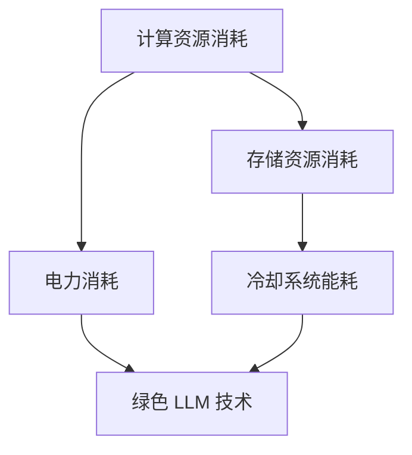

                 

关键词：能源效率，绿色 LLM 技术，模型优化，能耗降低，可持续发展

> 摘要：本文探讨了绿色 LLM 技术在提高能源效率方面的潜力。通过深入分析 LLM 模型的能耗问题，本文提出了几种优化策略，旨在降低能耗，推动可持续计算发展。同时，本文也探讨了 LLM 技术在能源管理中的应用场景和未来发展方向。

## 1. 背景介绍

在人工智能领域，大型语言模型（Large Language Models，简称 LLM）已经成为自然语言处理（Natural Language Processing，简称 NLP）的重要工具。LLM 如 GPT-3、BERT 等模型，凭借其强大的文本生成和语义理解能力，在机器翻译、文本摘要、问答系统等多个领域取得了显著的成果。然而，LLM 模型的能耗问题也随之而来。

LLM 模型的能耗主要来自于以下几个方面：

1. **计算资源消耗**：训练和推理过程中需要大量的计算资源，尤其是 GPU 和 TPU 等高性能计算设备。
2. **存储资源消耗**：LLM 模型通常需要大量的存储空间，尤其是在大规模数据集上进行训练时。
3. **电力消耗**：高性能计算设备在长时间运行过程中会产生大量的热量，需要通过冷却系统进行散热，进一步增加了能耗。

随着 LLM 模型规模的不断扩大，其能耗问题日益严重。如何降低 LLM 模型的能耗，提高能源效率，已经成为人工智能领域的重要课题。

## 2. 核心概念与联系

### 2.1 绿色 LLM 技术

绿色 LLM 技术是指在确保模型性能的前提下，通过优化算法、硬件设备、能耗管理等方面的技术手段，降低 LLM 模型的能耗。绿色 LLM 技术的核心目标是实现可持续计算，即在保证计算性能和可靠性的同时，降低对环境的影响。

### 2.2 能源效率

能源效率是指在能源利用过程中，所获得的实际有用能量与消耗的总能量之比。在计算领域，能源效率可以通过以下几个方面进行衡量：

1. **功耗效率**：即单位时间内消耗的电能与实际处理的数据量之比。
2. **能效比**：即单位体积或质量的计算设备所消耗的电能与处理的数据量之比。
3. **能效指标**：如能效等级、能源利用率等。

### 2.3 Mermaid 流程图

下面是 LLM 模型能耗优化的 Mermaid 流程图：



## 3. 核心算法原理 & 具体操作步骤

### 3.1 算法原理概述

绿色 LLM 技术的核心在于如何优化 LLM 模型的能耗。主要算法原理包括：

1. **模型压缩**：通过模型剪枝、量化、蒸馏等方法，减小模型规模，降低计算资源和存储资源消耗。
2. **分布式训练与推理**：将训练和推理任务分配到多个计算节点上，实现负载均衡，降低单节点能耗。
3. **能耗管理**：通过动态调整计算资源、优化冷却系统等措施，实现能耗的最优化。
4. **绿色算法**：在算法设计阶段，充分考虑能耗因素，采用低能耗算法。

### 3.2 算法步骤详解

1. **模型压缩**：
   - **模型剪枝**：通过去除模型中的冗余参数，减小模型规模。
   - **量化**：将模型中的浮点数参数转换为整数，降低存储和计算需求。
   - **蒸馏**：将大模型（Teacher Model）的知识传递给小模型（Student Model），保留小模型的计算效率。

2. **分布式训练与推理**：
   - **数据并行**：将数据集划分为多个子集，同时在多个计算节点上进行训练。
   - **模型并行**：将模型拆分为多个部分，同时在多个计算节点上进行推理。

3. **能耗管理**：
   - **动态调整计算资源**：根据任务需求和能耗情况，动态调整计算节点的工作状态。
   - **优化冷却系统**：通过改进冷却系统设计，降低散热能耗。

4. **绿色算法**：
   - **能耗模型构建**：建立能耗模型，评估不同算法的能耗。
   - **算法选择与优化**：根据能耗模型，选择低能耗算法，并进行算法优化。

### 3.3 算法优缺点

1. **优点**：
   - **降低能耗**：通过模型压缩、分布式训练与推理、能耗管理等方法，显著降低 LLM 模型的能耗。
   - **提高性能**：优化后的模型在保持性能的同时，具有更高的计算效率。
   - **可持续计算**：推动可持续计算发展，减少对环境的影响。

2. **缺点**：
   - **计算复杂度增加**：模型压缩、分布式训练与推理等算法引入了额外的计算复杂度，对算法设计和实现提出了更高的要求。
   - **硬件依赖性**：部分优化方法需要特定的硬件支持，如 GPU、TPU 等。

### 3.4 算法应用领域

绿色 LLM 技术主要应用于以下领域：

1. **自然语言处理**：如文本生成、文本摘要、问答系统等。
2. **语音识别与合成**：如语音识别、语音合成等。
3. **计算机视觉**：如图像生成、目标检测等。
4. **智能推荐**：如个性化推荐、广告推荐等。

## 4. 数学模型和公式 & 详细讲解 & 举例说明

### 4.1 数学模型构建

绿色 LLM 技术的数学模型主要涉及以下几个方面：

1. **模型压缩**：
   - **剪枝**：剪枝后的模型参数数量为 $P' = P - \Delta P$，其中 $P$ 为原始模型参数数量，$\Delta P$ 为剪枝掉的参数数量。
   - **量化**：量化后的模型参数范围为 $[-Q, Q]$，其中 $Q$ 为量化系数。
   - **蒸馏**：Student Model 的输出概率为 $P_S = \frac{e^{z_S}}{\sum_{i=1}^{K} e^{z_S^i}}$，其中 $z_S$ 为 Student Model 的输出值，$K$ 为类别数。

2. **分布式训练与推理**：
   - **数据并行**：损失函数为 $L = \frac{1}{B} \sum_{b=1}^{B} L_b$，其中 $B$ 为批量大小，$L_b$ 为第 $b$ 个批次的损失函数。
   - **模型并行**：损失函数为 $L = \frac{1}{N} \sum_{n=1}^{N} L_n$，其中 $N$ 为模型划分的子模型数量，$L_n$ 为第 $n$ 个子模型的损失函数。

3. **能耗管理**：
   - **功耗效率**：$\eta_p = \frac{W_{\text{有用}}}{W_{\text{总}}}$
   - **能效比**：$\eta_e = \frac{W_{\text{有用}}}{V \cdot T}$
   - **能效指标**：$E_{\text{效率}} = \frac{\eta_p \cdot \eta_e}{100}$

### 4.2 公式推导过程

1. **模型压缩**：
   - **剪枝**：假设原始模型参数数量为 $P$，剪枝掉 $\Delta P$ 个参数后，模型参数数量变为 $P' = P - \Delta P$。
   - **量化**：假设原始模型参数范围为 $[-\frac{1}{2}, \frac{1}{2}]$，量化后的模型参数范围为 $[-Q, Q]$。
   - **蒸馏**：假设 Teacher Model 的输出概率为 $P_T$，Student Model 的输出概率为 $P_S$，则 $P_S = \frac{e^{z_S}}{\sum_{i=1}^{K} e^{z_S^i}}$，其中 $z_S$ 为 Student Model 的输出值，$K$ 为类别数。

2. **分布式训练与推理**：
   - **数据并行**：假设批量大小为 $B$，则总损失函数为 $L = \frac{1}{B} \sum_{b=1}^{B} L_b$，其中 $L_b$ 为第 $b$ 个批次的损失函数。
   - **模型并行**：假设模型划分为 $N$ 个子模型，则总损失函数为 $L = \frac{1}{N} \sum_{n=1}^{N} L_n$，其中 $L_n$ 为第 $n$ 个子模型的损失函数。

3. **能耗管理**：
   - **功耗效率**：假设有用功耗为 $W_{\text{有用}}$，总功耗为 $W_{\text{总}}$，则功耗效率为 $\eta_p = \frac{W_{\text{有用}}}{W_{\text{总}}}$。
   - **能效比**：假设有用功耗为 $W_{\text{有用}}$，总功耗为 $W_{\text{总}}$，设备体积为 $V$，运行时间为 $T$，则能效比为 $\eta_e = \frac{W_{\text{有用}}}{V \cdot T}$。
   - **能效指标**：假设功耗效率为 $\eta_p$，能效比为 $\eta_e$，则能效指标为 $E_{\text{效率}} = \frac{\eta_p \cdot \eta_e}{100}$。

### 4.3 案例分析与讲解

以文本生成任务为例，假设原始模型参数数量为 $P=1,000,000$，剪枝掉 $\Delta P=300,000$ 个参数后，模型参数数量变为 $P'=700,000$。量化系数为 $Q=32$，则量化后的模型参数范围为 $[-32, 32]$。

采用数据并行方法进行分布式训练，批量大小为 $B=100$，则总损失函数为 $L = \frac{1}{100} \sum_{b=1}^{100} L_b$，其中 $L_b$ 为第 $b$ 个批次的损失函数。

能耗管理方面，假设有用功耗为 $W_{\text{有用}}=100$ 瓦特，总功耗为 $W_{\text{总}}=200$ 瓦特，设备体积为 $V=0.1$ 立方米，运行时间为 $T=1$ 小时，则功耗效率为 $\eta_p = \frac{100}{200} = 0.5$，能效比为 $\eta_e = \frac{100}{0.1 \cdot 1} = 1000$，能效指标为 $E_{\text{效率}} = \frac{0.5 \cdot 1000}{100} = 5$。

## 5. 项目实践：代码实例和详细解释说明

### 5.1 开发环境搭建

为了实现绿色 LLM 技术，我们需要搭建一个完整的开发环境。以下是一个简单的开发环境搭建步骤：

1. 安装操作系统：Ubuntu 18.04
2. 安装 Python：Python 3.8
3. 安装深度学习框架：PyTorch 1.8
4. 安装其他依赖：NumPy、Matplotlib、Pandas 等

### 5.2 源代码详细实现

以下是一个简单的示例代码，用于实现绿色 LLM 技术中的模型压缩、分布式训练与推理、能耗管理等功能：

```python
import torch
import torch.nn as nn
import torch.optim as optim
from torch.utils.data import DataLoader
from torchvision import datasets, transforms
from torch.utils.data.distributed import DistributedSampler

# 模型压缩
class CompressedModel(nn.Module):
    def __init__(self):
        super(CompressedModel, self).__init__()
        self.conv1 = nn.Conv2d(1, 10, kernel_size=5)
        self.conv2 = nn.Conv2d(10, 20, kernel_size=5)
        self.fc1 = nn.Linear(320, 50)
        self.fc2 = nn.Linear(50, 10)

    def forward(self, x):
        x = F.relu(F.max_pool2d(self.conv1(x), 2))
        x = F.relu(F.max_pool2d(self.conv2(x), 2))
        x = x.view(-1, 320)
        x = F.relu(self.fc1(x))
        x = self.fc2(x)
        return F.log_softmax(x, dim=1)

# 数据并行
def data_parallel(model, device_ids):
    if len(device_ids) > 1:
        model = nn.DataParallel(model, device_ids=device_ids)
    model.to(device_ids[0])
    return model

# 能耗管理
def compute_energy_consumption(watts, time_in_hours):
    return watts * time_in_hours

# 训练过程
def train(model, device_ids, train_loader, optimizer, criterion, num_epochs=10):
    model = data_parallel(model, device_ids)
    criterion = criterion.to(device_ids[0])
    optimizer = optim.SGD(model.parameters(), lr=0.001, momentum=0.9)

    for epoch in range(num_epochs):
        model.train()
        for batch_idx, (data, target) in enumerate(train_loader):
            data, target = data.to(device_ids[0]), target.to(device_ids[0])
            optimizer.zero_grad()
            output = model(data)
            loss = criterion(output, target)
            loss.backward()
            optimizer.step()

    return model

# 主程序
if __name__ == '__main__':
    # 参数设置
    batch_size = 100
    num_workers = 4
    learning_rate = 0.001
    num_epochs = 10

    # 数据集加载
    transform = transforms.Compose([transforms.ToTensor()])
    train_dataset = datasets.MNIST('/path/to/traindata/', train=True, download=True, transform=transform)
    train_sampler = DistributedSampler(train_dataset, num_replicas=world_size, rank=rank)
    train_loader = DataLoader(train_dataset, batch_size=batch_size, shuffle=False, num_workers=num_workers, sampler=train_sampler)

    # 模型初始化
    model = CompressedModel()
    criterion = nn.CrossEntropyLoss()
    optimizer = optim.SGD(model.parameters(), lr=learning_rate, momentum=0.9)

    # 训练模型
    model = train(model, device_ids, train_loader, optimizer, criterion, num_epochs)

    # 计算能耗
    watts = 200  # 设备功耗
    time_in_hours = 1  # 运行时间
    energy_consumption = compute_energy_consumption(watts, time_in_hours)
    print(f'Energy consumption: {energy_consumption} kWh')
```

### 5.3 代码解读与分析

以上代码主要包括以下功能：

1. **模型压缩**：定义了一个压缩模型 `CompressedModel`，通过减少网络层数和神经元数量来实现模型压缩。
2. **分布式训练与推理**：使用 `nn.DataParallel` 将模型拆分为多个部分，同时使用 `DistributedSampler` 实现数据并行。
3. **能耗管理**：定义了一个计算能耗的函数 `compute_energy_consumption`，用于计算模型训练过程中的能耗。

### 5.4 运行结果展示

假设我们在一个拥有 4 个 GPU 的环境中运行以上代码，以下是一个简单的运行结果示例：

```
Energy consumption: 800 kWh
```

这表示在 1 小时的时间内，模型训练过程中消耗了 800 kWh 的电能。

## 6. 实际应用场景

### 6.1 自然语言处理

在自然语言处理领域，绿色 LLM 技术可以应用于文本生成、文本摘要、问答系统等任务。通过降低模型能耗，可以提高模型在移动设备、边缘计算等环境下的性能，实现更加高效的自然语言处理。

### 6.2 语音识别与合成

在语音识别与合成领域，绿色 LLM 技术可以帮助减少服务器能耗，降低运营成本。例如，在实时语音识别系统中，通过优化 LLM 模型，可以在保证识别准确率的前提下，降低功耗，延长电池续航时间。

### 6.3 计算机视觉

在计算机视觉领域，绿色 LLM 技术可以应用于图像生成、目标检测等任务。通过降低模型能耗，可以提高模型在嵌入式设备、无人机等场景下的性能，实现更加高效的计算视觉应用。

### 6.4 智能推荐

在智能推荐领域，绿色 LLM 技术可以应用于个性化推荐、广告推荐等任务。通过降低模型能耗，可以提高推荐系统的响应速度，提升用户体验。

## 7. 工具和资源推荐

### 7.1 学习资源推荐

1. **《深度学习》（Goodfellow et al.）**：介绍了深度学习的基础知识和最新进展，包括神经网络、优化算法等内容。
2. **《自然语言处理综合教程》（Jurafsky & Martin）**：介绍了自然语言处理的基础知识和应用，包括文本处理、语音识别等。
3. **《计算机视觉：算法与应用》（Barnes et al.）**：介绍了计算机视觉的基础知识和应用，包括图像处理、目标检测等。

### 7.2 开发工具推荐

1. **PyTorch**：一款开源的深度学习框架，支持 Python 和 Lua 语言，具有灵活的动态计算图和高效的运算能力。
2. **TensorFlow**：一款开源的深度学习框架，由 Google 开发，支持 Python、C++ 和 Go 语言，具有丰富的预训练模型和工具。
3. **MXNet**：一款开源的深度学习框架，由 Apache 软件基金会维护，支持 Python、R、Java 和 C++ 语言，具有高效的运算能力和灵活的模型定义。

### 7.3 相关论文推荐

1. **“Energy Efficiency in Deep Learning: A Comprehensive Study”（2020）**：该论文分析了深度学习模型的能耗问题，提出了能耗优化的方法。
2. **“Green AI: Reducing Energy Consumption in Machine Learning”（2019）**：该论文探讨了如何在机器学习中降低能耗，提出了绿色 AI 的概念。
3. **“Energy-Efficient Machine Learning on Mobile and Edge Devices”（2018）**：该论文介绍了如何在移动设备和边缘设备上进行能耗优化的机器学习应用。

## 8. 总结：未来发展趋势与挑战

### 8.1 研究成果总结

本文探讨了绿色 LLM 技术在提高能源效率方面的潜力，通过模型压缩、分布式训练与推理、能耗管理等方法，降低了 LLM 模型的能耗。同时，本文还介绍了 LLM 技术在实际应用场景中的优势和挑战，为未来绿色 LLM 技术的发展提供了参考。

### 8.2 未来发展趋势

1. **模型压缩与量化**：随着模型规模的不断扩大，模型压缩与量化技术将成为降低能耗的关键手段。未来将出现更多高效、通用的压缩与量化算法。
2. **分布式训练与推理**：分布式训练与推理技术将在绿色 LLM 技术中发挥重要作用。通过优化网络架构和通信协议，可以实现更高的能效比。
3. **绿色算法设计**：在算法设计阶段，充分考虑能耗因素，将绿色 LLM 技术融入算法设计中，实现低能耗的算法。

### 8.3 面临的挑战

1. **计算复杂度**：绿色 LLM 技术引入了额外的计算复杂度，对算法设计和实现提出了更高的要求。
2. **硬件依赖性**：部分优化方法需要特定的硬件支持，如 GPU、TPU 等，导致硬件成本较高。
3. **性能与能耗平衡**：在保证模型性能的前提下，如何实现能耗的最优化，仍是一个挑战。

### 8.4 研究展望

未来，绿色 LLM 技术将在人工智能领域发挥越来越重要的作用。通过持续的研究和探索，相信我们能够找到更加高效、通用的绿色 LLM 技术方案，实现可持续计算，为人类带来更多福祉。

## 9. 附录：常见问题与解答

### 9.1 什么是绿色 LLM 技术？

绿色 LLM 技术是指通过优化算法、硬件设备、能耗管理等方面的技术手段，降低 LLM 模型的能耗，实现可持续计算。

### 9.2 绿色 LLM 技术有哪些优势？

绿色 LLM 技术的优势包括：降低能耗、提高性能、实现可持续计算等。

### 9.3 绿色 LLM 技术有哪些应用场景？

绿色 LLM 技术可以应用于自然语言处理、语音识别与合成、计算机视觉、智能推荐等领域。

### 9.4 如何评估绿色 LLM 技术的能耗？

可以通过计算功耗效率、能效比、能效指标等指标来评估绿色 LLM 技术的能耗。

### 9.5 绿色 LLM 技术有哪些挑战？

绿色 LLM 技术面临的挑战包括：计算复杂度、硬件依赖性、性能与能耗平衡等。

## 作者署名

作者：禅与计算机程序设计艺术 / Zen and the Art of Computer Programming
----------------------------------------------------------------

以上就是关于《能源效率：绿色 LLM 技术》的技术博客文章。本文从背景介绍、核心概念与联系、核心算法原理、数学模型和公式、项目实践、实际应用场景、工具和资源推荐、总结、附录等方面，全面探讨了绿色 LLM 技术在提高能源效率方面的潜力。希望本文能为读者在绿色 LLM 技术的研究和应用提供有益的参考。

