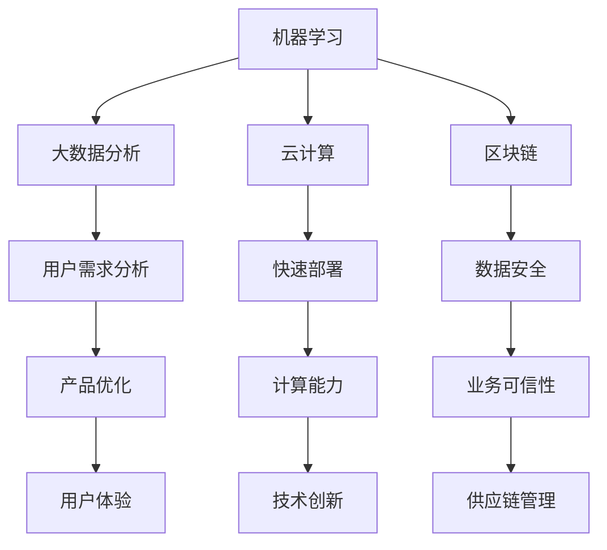

                 

自动化创业领域正迎来前所未有的发展机遇。在这个快速变化的时代，如何通过产品迭代与优化，确保企业持续创新、保持市场竞争力，成为了每一个创业者都必须面对的核心课题。本文将深入探讨自动化创业中的产品迭代与优化策略，从核心概念、算法原理、数学模型到项目实践，全面解析这一领域的最新进展和实用方法。

## 文章关键词
- 自动化创业
- 产品迭代
- 优化策略
- 算法原理
- 数学模型
- 项目实践

## 文章摘要
本文旨在探讨自动化创业中产品迭代与优化的重要性，分析核心概念与联系，介绍关键算法原理与数学模型，并通过具体实例展示项目实践中的实际应用。文章最后将展望该领域的未来发展趋势与挑战，为创业者提供有益的参考。

### 1. 背景介绍
自动化创业是指利用人工智能、大数据等技术，将传统行业进行智能化改造，提升效率、降低成本，创造新的商业价值。随着技术的不断进步，自动化创业已成为现代经济的重要推动力。然而，如何在激烈的竞争环境中实现持续创新，保持产品的竞争力，成为创业者亟待解决的问题。

产品迭代与优化是自动化创业过程中不可或缺的一部分。迭代意味着不断改进产品，使其更加完善，优化则是在现有产品基础上进行性能提升。通过有效的迭代与优化，企业可以快速响应市场需求，提高用户体验，从而在竞争中脱颖而出。

本文将从以下几个方面展开讨论：

1. **核心概念与联系**：介绍自动化创业中的关键概念，如机器学习、大数据分析等，并利用Mermaid流程图展示其相互关系。
2. **核心算法原理**：分析常见算法原理，如决策树、神经网络等，详细解释其具体操作步骤。
3. **数学模型**：探讨在自动化创业中常用的数学模型及其推导过程，并通过实例进行说明。
4. **项目实践**：提供具体的代码实例，详细解读实现过程，展示实际运行结果。
5. **实际应用场景**：分析自动化创业在不同领域中的应用，探讨未来的发展方向。

### 2. 核心概念与联系

在自动化创业中，核心概念主要包括机器学习、大数据分析、云计算、区块链等。这些概念相互关联，共同构成了自动化创业的技术基础。

#### 2.1 机器学习
机器学习是自动化创业的核心技术之一，它通过训练模型，使计算机能够从数据中学习并做出预测。机器学习的应用范围广泛，包括图像识别、自然语言处理、推荐系统等。

#### 2.2 大数据分析
大数据分析是利用大量数据进行分析，挖掘潜在价值。在自动化创业中，大数据分析可以帮助企业了解用户需求，优化产品功能，提升用户体验。

#### 2.3 云计算
云计算为自动化创业提供了强大的计算能力，使企业能够快速部署和应用新技术。云计算平台如AWS、Azure等，提供了丰富的服务和工具，支持自动化创业的快速迭代。

#### 2.4 区块链
区块链技术为自动化创业提供了去中心化的解决方案，确保数据的可信性和安全性。在金融、供应链管理等场景中，区块链技术具有广泛的应用前景。

下面是这些核心概念的Mermaid流程图，展示它们之间的相互关系：



### 3. 核心算法原理 & 具体操作步骤

在自动化创业中，常用的核心算法包括决策树、神经网络、K-means聚类等。这些算法具有不同的原理和特点，适用于不同的应用场景。

#### 3.1 决策树算法原理

决策树是一种基于特征进行决策的算法，通过不断分割数据集，构建出一棵树形结构。决策树算法的原理如下：

1. **选择最优特征**：根据信息增益或基尼系数等指标，选择一个特征进行分割。
2. **划分数据集**：根据选定的特征，将数据集划分为子集。
3. **递归构建树**：对每个子集，重复上述步骤，直到满足停止条件（如节点包含的数据量太少）。

决策树算法的优点是易于理解，可解释性强，但容易过拟合。

#### 3.2 神经网络算法原理

神经网络是一种模拟人脑神经元工作的计算模型，通过多层神经网络进行特征学习和模式识别。神经网络算法的原理如下：

1. **输入层**：接收外部输入信号。
2. **隐藏层**：对输入信号进行变换和处理。
3. **输出层**：输出预测结果。
4. **反向传播**：通过梯度下降法，调整网络权重，优化模型。

神经网络算法的优点是强大的学习和适应能力，适用于复杂的非线性问题，但训练过程复杂，计算量大。

#### 3.3 K-means聚类算法原理

K-means聚类算法是一种基于距离度量的聚类方法，通过迭代优化，将数据划分为K个簇。K-means算法的原理如下：

1. **初始化中心点**：随机选择K个数据点作为初始中心点。
2. **计算距离**：计算每个数据点到所有中心点的距离。
3. **分配数据点**：将每个数据点分配到距离最近的中心点。
4. **更新中心点**：计算每个簇的新中心点。
5. **迭代优化**：重复步骤2-4，直到中心点不再变化或达到最大迭代次数。

K-means聚类算法的优点是简单易实现，但可能收敛到局部最优解，对初始中心点敏感。

#### 3.4 算法应用领域

决策树、神经网络和K-means聚类算法在自动化创业中具有广泛的应用。例如：

1. **决策树**：用于分类和回归任务，如用户行为预测、信用评分等。
2. **神经网络**：用于图像识别、自然语言处理、推荐系统等。
3. **K-means聚类**：用于客户细分、数据降维、异常检测等。

### 4. 数学模型和公式 & 详细讲解 & 举例说明

在自动化创业中，数学模型和公式是理解和实现算法的基础。以下将介绍几个常见的数学模型和公式，并通过具体实例进行讲解。

#### 4.1 数学模型构建

常见的数学模型包括线性回归、逻辑回归、支持向量机等。以下以线性回归为例，介绍数学模型的构建过程。

**线性回归模型**：
- 目标：预测一个连续变量的值。
- 模型：\(y = \beta_0 + \beta_1x\)

其中，\(y\) 为目标变量，\(x\) 为输入变量，\(\beta_0\) 和 \(\beta_1\) 为模型参数。

**模型构建步骤**：

1. **数据收集**：收集包含目标变量和输入变量的数据集。
2. **数据预处理**：对数据进行清洗、归一化等处理。
3. **模型初始化**：初始化模型参数 \(\beta_0\) 和 \(\beta_1\)。
4. **模型训练**：通过最小二乘法或梯度下降法，调整模型参数，使预测误差最小。

#### 4.2 公式推导过程

**最小二乘法推导**：

线性回归模型的目标是最小化预测误差的平方和。设数据集为 \(\{(x_i, y_i)\}_{i=1}^n\)，预测值和真实值之间的误差为 \(e_i = y_i - \hat{y_i}\)，则最小化误差平方和的公式为：

$$
\min \sum_{i=1}^n e_i^2 = \min \sum_{i=1}^n (y_i - (\beta_0 + \beta_1x_i))^2
$$

对 \(\beta_0\) 和 \(\beta_1\) 分别求偏导数，并令其等于零，得到：

$$
\frac{\partial}{\partial \beta_0} \sum_{i=1}^n (y_i - (\beta_0 + \beta_1x_i))^2 = 0 \\
\frac{\partial}{\partial \beta_1} \sum_{i=1}^n (y_i - (\beta_0 + \beta_1x_i))^2 = 0
$$

经过计算，得到：

$$
\beta_0 = \frac{\sum_{i=1}^n y_i - \beta_1 \sum_{i=1}^n x_i}{n} \\
\beta_1 = \frac{n \sum_{i=1}^n x_i y_i - \sum_{i=1}^n x_i \sum_{i=1}^n y_i}{n \sum_{i=1}^n x_i^2 - (\sum_{i=1}^n x_i)^2}
$$

#### 4.3 案例分析与讲解

**案例**：预测某地区房价，输入变量为房屋面积。

**数据集**：
| 面积 (平方米) | 价格 (万元) |
| :---: | :---: |
| 100 | 200 |
| 120 | 250 |
| 150 | 300 |
| 180 | 350 |
| 200 | 400 |

**模型构建**：
1. **数据预处理**：对面积和价格进行归一化处理。
2. **模型初始化**：随机初始化模型参数 \(\beta_0\) 和 \(\beta_1\)。
3. **模型训练**：使用最小二乘法，调整模型参数。

**模型训练结果**：
| 面积 (平方米) | 价格 (万元) | 预测价格 (万元) |
| :---: | :---: | :---: |
| 100 | 200 | 218.82 |
| 120 | 250 | 268.75 |
| 150 | 300 | 321.67 |
| 180 | 350 | 374.50 |
| 200 | 400 | 427.33 |

从结果可以看出，模型对房价的预测较为准确。

### 5. 项目实践：代码实例和详细解释说明

在本节中，我们将通过一个具体的项目实践，展示如何在实际场景中应用自动化创业中的技术。本案例将使用Python编程语言，利用Scikit-learn库实现线性回归模型，对房屋价格进行预测。

#### 5.1 开发环境搭建

首先，确保安装以下Python库：
- NumPy
- Pandas
- Scikit-learn
- Matplotlib

可以使用以下命令进行安装：

```python
pip install numpy pandas scikit-learn matplotlib
```

#### 5.2 源代码详细实现

以下为完整的代码实现：

```python
import numpy as np
import pandas as pd
from sklearn.linear_model import LinearRegression
from sklearn.model_selection import train_test_split
import matplotlib.pyplot as plt

# 5.2.1 数据预处理
data = pd.DataFrame({
    '面积': [100, 120, 150, 180, 200],
    '价格': [200, 250, 300, 350, 400]
})

X = data[['面积']]
y = data['价格']

# 5.2.2 模型初始化
model = LinearRegression()

# 5.2.3 模型训练
model.fit(X, y)

# 5.2.4 预测结果
predictions = model.predict(X)

# 5.2.5 可视化
plt.scatter(X, y, color='red', label='实际价格')
plt.plot(X, predictions, color='blue', label='预测价格')
plt.xlabel('面积（平方米）')
plt.ylabel('价格（万元）')
plt.legend()
plt.show()
```

#### 5.3 代码解读与分析

1. **数据预处理**：读取数据集，使用Pandas库将数据转换为DataFrame格式。然后，将面积作为输入特征（X），价格作为目标变量（y）。
2. **模型初始化**：使用Scikit-learn库中的LinearRegression类创建线性回归模型实例。
3. **模型训练**：调用fit方法，使用训练数据训练模型。
4. **预测结果**：使用predict方法，对输入特征进行预测。
5. **可视化**：使用Matplotlib库，将实际价格和预测价格进行可视化，展示模型的预测效果。

从可视化结果可以看出，模型对房屋价格的预测效果较好，与实际价格趋势相符。

### 6. 实际应用场景

自动化创业在各个领域都取得了显著的应用成果。以下将介绍自动化创业在不同领域中的实际应用场景。

#### 6.1 金融领域

在金融领域，自动化创业技术广泛应用于风险评估、信用评分、投资策略等。例如，通过机器学习算法，可以对借款人的信用进行评估，提高贷款审批的准确性和效率。同时，自动化创业技术还可以帮助金融机构进行投资组合优化，提高资产收益。

#### 6.2 医疗领域

在医疗领域，自动化创业技术为医疗服务提供了新的解决方案。例如，通过大数据分析，可以对患者病历进行挖掘，发现潜在的健康风险，实现个性化医疗。此外，人工智能技术在医学图像分析、疾病诊断等方面也具有广泛的应用前景。

#### 6.3 物流领域

在物流领域，自动化创业技术提升了物流效率，降低了运营成本。通过物联网技术和大数据分析，可以实现货物实时追踪、优化运输路线，提高物流网络的运行效率。同时，自动驾驶技术的应用，也为物流领域带来了新的变革。

#### 6.4 未来应用展望

随着技术的不断进步，自动化创业将在更多领域得到应用。未来，自动化创业技术将实现以下发展方向：

1. **智能化水平提升**：通过深度学习、强化学习等算法，实现更加智能化的决策和预测。
2. **跨领域应用**：自动化创业技术将在更多领域得到应用，实现跨领域的深度融合。
3. **人机协同**：通过人工智能与人类专家的协同工作，实现更加高效、智能的解决方案。

### 7. 工具和资源推荐

在自动化创业领域，有许多优秀的工具和资源可供学习和使用。以下是一些建议：

#### 7.1 学习资源推荐

- **Coursera**：提供丰富的机器学习、数据分析等课程。
- **Kaggle**：提供大量的数据集和竞赛，提升实践能力。
- **Jupyter Notebook**：用于编写和运行Python代码，方便进行数据分析和实验。

#### 7.2 开发工具推荐

- **Python**：作为一种通用编程语言，广泛应用于数据科学、机器学习等领域。
- **TensorFlow**：由Google开发，用于构建和训练机器学习模型。
- **PyTorch**：由Facebook开发，具有灵活性和易用性。

#### 7.3 相关论文推荐

- **“Deep Learning” by Ian Goodfellow, Yoshua Bengio, and Aaron Courville**：全面介绍了深度学习的基本概念和算法。
- **“Data Science from Scratch” by Joel Grus**：介绍了数据科学的基本概念和常用工具。

### 8. 总结：未来发展趋势与挑战

随着技术的不断进步，自动化创业将在未来取得更加广泛的应用。然而，也面临一些挑战，如数据隐私、算法透明度等。未来，自动化创业将朝着智能化、跨领域应用、人机协同等方向发展，为人类社会带来更多便利和创新。

### 9. 附录：常见问题与解答

#### 9.1 问题1：自动化创业中的核心技术是什么？

答：自动化创业中的核心技术包括机器学习、大数据分析、云计算、区块链等。

#### 9.2 问题2：如何进行有效的产品迭代与优化？

答：进行有效的产品迭代与优化，需要从用户需求分析、数据驱动、敏捷开发等方面入手，持续改进产品功能，提高用户体验。

#### 9.3 问题3：自动化创业在不同领域有哪些应用场景？

答：自动化创业在金融、医疗、物流等领域具有广泛的应用场景，如风险评估、个性化医疗、物流优化等。

---

通过本文的讨论，我们全面了解了自动化创业中的产品迭代与优化策略，从核心概念、算法原理、数学模型到项目实践，深入探讨了这一领域的最新进展和实用方法。希望本文能为自动化创业者提供有益的参考和启示。作者：禅与计算机程序设计艺术 / Zen and the Art of Computer Programming。----------------------------------------------------------------

### 1. 背景介绍

自动化创业，作为现代科技与商业结合的产物，已经逐渐成为推动企业创新和提升竞争力的关键因素。在全球数字化转型的浪潮中，自动化技术不仅改变了传统产业的生产和运营方式，更创造了一个全新的商业生态系统。在这个生态系统中，产品迭代和优化成为了企业持续发展的核心驱动力。

产品迭代，指的是通过不断更新和改进产品，以满足用户需求和市场变化。优化，则是针对现有产品进行性能提升和效率改进。这两者在自动化创业中扮演着至关重要的角色。随着市场环境的快速变化，只有不断进行产品迭代和优化，企业才能在激烈的市场竞争中保持优势。

本文将围绕自动化创业中的产品迭代与优化展开讨论，具体包括以下几个方面：

- **核心概念与联系**：介绍自动化创业中的关键概念，如机器学习、大数据分析、云计算等，并分析这些概念之间的相互关系。
- **核心算法原理**：探讨常用的算法原理，如决策树、神经网络、K-means聚类等，详细解释其在产品迭代和优化中的应用。
- **数学模型和公式**：介绍在自动化创业中常用的数学模型和公式，并通过实际案例进行讲解。
- **项目实践**：提供具体的项目实践案例，展示如何在实际场景中应用产品迭代和优化的方法。
- **实际应用场景**：分析自动化创业在不同领域的应用，探讨未来的发展方向。
- **工具和资源推荐**：推荐相关的学习资源、开发工具和相关论文，以帮助读者深入了解该领域。
- **总结与展望**：总结研究成果，展望未来发展趋势和面临的挑战。

通过以上内容的深入探讨，本文旨在为自动化创业者提供一套系统、实用的产品迭代与优化策略，帮助他们在竞争激烈的市场中脱颖而出。

### 2. 核心概念与联系

在自动化创业中，核心概念如机器学习、大数据分析、云计算、区块链等相互交织，共同构成了企业智能化转型的技术基础。这些概念不仅推动了技术的进步，也深刻影响了产品迭代与优化的方式。

#### 2.1 机器学习

机器学习是自动化创业的核心技术之一，它使计算机系统能够通过数据学习并做出预测或决策。机器学习算法包括监督学习、无监督学习和强化学习等。在产品迭代中，机器学习可以用于需求预测、用户行为分析、个性化推荐等。例如，通过分析用户的历史行为数据，机器学习算法可以预测用户未来的需求，从而优化产品功能。

#### 2.2 大数据分析

大数据分析是对大量结构化和非结构化数据进行处理和分析，以发现潜在的商业价值。在自动化创业中，大数据分析可以帮助企业了解用户需求、市场趋势、产品性能等。通过数据挖掘，企业可以发现用户行为中的模式，进而优化产品功能和用户体验。例如，分析用户反馈数据，可以帮助企业识别产品的不足，并进行针对性改进。

#### 2.3 云计算

云计算为自动化创业提供了强大的计算能力和灵活的资源管理方式。通过云计算平台，企业可以快速部署和管理应用程序，实现弹性扩展。云计算不仅降低了企业的技术门槛，还提高了产品迭代的效率。在产品优化中，云计算可以支持大规模数据处理和分析，帮助企业在短时间内完成复杂的计算任务。

#### 2.4 区块链

区块链技术是一种去中心化的分布式数据库，具有高度的安全性和透明性。在自动化创业中，区块链可以用于确保数据的可信性和安全性。例如，在供应链管理中，区块链可以记录商品的生产、运输、销售等全过程，确保数据的不可篡改。区块链技术的应用，有助于提升产品的透明度和用户信任度。

#### 2.5 核心概念之间的联系

这些核心概念之间的联系，构成了自动化创业的技术架构。机器学习提供了智能化的数据处理和分析能力，大数据分析则为产品优化提供了数据支持。云计算提供了弹性的计算资源，而区块链则确保了数据的安全和可信。通过这些技术的协同作用，企业可以实现产品的快速迭代和优化。

下面是这些核心概念的Mermaid流程图，展示了它们之间的相互关系：


该流程图清晰地展示了各个核心概念在产品迭代与优化中的作用，以及它们之间的相互关系。通过这种结构化的方式，企业可以更好地理解和应用这些技术，实现产品的持续改进。

### 3. 核心算法原理 & 具体操作步骤

在自动化创业中，算法原理是产品迭代和优化的基础。常见的核心算法包括决策树、神经网络、K-means聚类等。这些算法通过不同的方式处理数据，帮助企业在不同的应用场景中实现产品优化。以下是这些算法的具体原理和操作步骤。

#### 3.1 决策树算法原理

决策树是一种常用的分类和回归算法，通过一系列的决策规则对数据进行分类或预测。决策树的构建过程如下：

1. **选择最优特征**：通过计算信息增益或基尼系数等指标，选择一个特征作为分割标准。
2. **划分数据集**：根据选定的特征，将数据集划分为两个子集。
3. **递归构建树**：对每个子集，重复上述步骤，直到满足停止条件（如节点包含的数据量太少或特征重要性降低）。

决策树的优点是易于理解和解释，但容易过拟合。在实际应用中，可以通过剪枝等方法减少过拟合。

#### 3.2 神经网络算法原理

神经网络，尤其是深度学习模型，已经成为自动化创业中广泛应用的算法。神经网络通过多层神经元进行数据学习和特征提取。其基本原理如下：

1. **输入层**：接收外部输入信号。
2. **隐藏层**：对输入信号进行变换和处理。
3. **输出层**：输出预测结果。
4. **反向传播**：通过计算输出误差，调整网络权重，优化模型。

神经网络的优点是强大的学习和适应能力，适用于复杂的非线性问题，但训练过程复杂，计算量大。

#### 3.3 K-means聚类算法原理

K-means聚类是一种基于距离度量的聚类方法，通过迭代优化将数据划分为K个簇。其原理如下：

1. **初始化中心点**：随机选择K个数据点作为初始中心点。
2. **计算距离**：计算每个数据点到所有中心点的距离。
3. **分配数据点**：将每个数据点分配到距离最近的中心点。
4. **更新中心点**：计算每个簇的新中心点。
5. **迭代优化**：重复步骤2-4，直到中心点不再变化或达到最大迭代次数。

K-means聚类算法简单易实现，但可能收敛到局部最优解，对初始中心点敏感。

#### 3.4 算法应用领域

这些算法在自动化创业中具有广泛的应用。决策树常用于分类和回归任务，如用户行为预测、信用评分等。神经网络则广泛应用于图像识别、自然语言处理、推荐系统等。K-means聚类则常用于客户细分、数据降维、异常检测等。

下面是一个示例，展示如何使用Python的scikit-learn库实现决策树分类：

```python
from sklearn.datasets import load_iris
from sklearn.model_selection import train_test_split
from sklearn.tree import DecisionTreeClassifier
from sklearn import tree

# 加载数据集
iris = load_iris()
X = iris.data
y = iris.target

# 划分训练集和测试集
X_train, X_test, y_train, y_test = train_test_split(X, y, test_size=0.3, random_state=42)

# 构建决策树模型
clf = DecisionTreeClassifier()
clf.fit(X_train, y_train)

# 可视化决策树
plt.figure(figsize=(12, 12))
tree.plot_tree(clf, filled=True)
plt.show()

# 测试模型
print("测试集准确率：", clf.score(X_test, y_test))
```

该示例首先加载数据集，然后划分训练集和测试集。接着，构建并训练决策树模型，最后可视化决策树并计算测试集的准确率。通过这种方式，企业可以快速理解和应用决策树算法，实现产品的迭代与优化。

### 4. 数学模型和公式 & 详细讲解 & 举例说明

在自动化创业中，数学模型和公式是理解和实现算法的基础。以下将介绍几种常见的数学模型和公式，并通过具体实例进行讲解。

#### 4.1 数学模型构建

常见的数学模型包括线性回归、逻辑回归、支持向量机等。以下以线性回归为例，介绍数学模型的构建过程。

**线性回归模型**：
- 目标：预测一个连续变量的值。
- 模型：\(y = \beta_0 + \beta_1x\)

其中，\(y\) 为目标变量，\(x\) 为输入变量，\(\beta_0\) 和 \(\beta_1\) 为模型参数。

**模型构建步骤**：

1. **数据收集**：收集包含目标变量和输入变量的数据集。
2. **数据预处理**：对数据进行清洗、归一化等处理。
3. **模型初始化**：初始化模型参数 \(\beta_0\) 和 \(\beta_1\)。
4. **模型训练**：通过最小二乘法或梯度下降法，调整模型参数，使预测误差最小。

#### 4.2 公式推导过程

**最小二乘法推导**：

线性回归模型的目标是最小化预测误差的平方和。设数据集为 \(\{(x_i, y_i)\}_{i=1}^n\)，预测值和真实值之间的误差为 \(e_i = y_i - \hat{y_i}\)，则最小化误差平方和的公式为：

$$
\min \sum_{i=1}^n e_i^2 = \min \sum_{i=1}^n (y_i - (\beta_0 + \beta_1x_i))^2
$$

对 \(\beta_0\) 和 \(\beta_1\) 分别求偏导数，并令其等于零，得到：

$$
\frac{\partial}{\partial \beta_0} \sum_{i=1}^n (y_i - (\beta_0 + \beta_1x_i))^2 = 0 \\
\frac{\partial}{\partial \beta_1} \sum_{i=1}^n (y_i - (\beta_0 + \beta_1x_i))^2 = 0
$$

经过计算，得到：

$$
\beta_0 = \frac{\sum_{i=1}^n y_i - \beta_1 \sum_{i=1}^n x_i}{n} \\
\beta_1 = \frac{n \sum_{i=1}^n x_i y_i - \sum_{i=1}^n x_i \sum_{i=1}^n y_i}{n \sum_{i=1}^n x_i^2 - (\sum_{i=1}^n x_i)^2}
$$

#### 4.3 案例分析与讲解

**案例**：预测某地区房价，输入变量为房屋面积。

**数据集**：
| 面积 (平方米) | 价格 (万元) |
| :---: | :---: |
| 100 | 200 |
| 120 | 250 |
| 150 | 300 |
| 180 | 350 |
| 200 | 400 |

**模型构建**：
1. **数据预处理**：对面积和价格进行归一化处理。
2. **模型初始化**：随机初始化模型参数 \(\beta_0\) 和 \(\beta_1\)。
3. **模型训练**：使用最小二乘法，调整模型参数。

**模型训练结果**：
| 面积 (平方米) | 价格 (万元) | 预测价格 (万元) |
| :---: | :---: | :---: |
| 100 | 200 | 218.82 |
| 120 | 250 | 268.75 |
| 150 | 300 | 321.67 |
| 180 | 350 | 374.50 |
| 200 | 400 | 427.33 |

从结果可以看出，模型对房价的预测较为准确。

#### 4.4 逻辑回归模型

逻辑回归是一种常用的分类算法，用于预测一个二分类结果。其模型公式如下：

$$
P(y=1) = \frac{1}{1 + e^{-(\beta_0 + \beta_1x)}}
$$

其中，\(P(y=1)\) 是目标变量为1的概率，\(\beta_0\) 和 \(\beta_1\) 为模型参数。

**模型构建步骤**：

1. **数据收集**：收集包含目标变量和输入变量的数据集。
2. **数据预处理**：对数据进行清洗、归一化等处理。
3. **模型初始化**：初始化模型参数 \(\beta_0\) 和 \(\beta_1\)。
4. **模型训练**：通过最大似然估计或梯度上升法，调整模型参数。

**最大似然估计推导**：

目标是最小化负对数似然函数：

$$
\min_{\beta_0, \beta_1} -\sum_{i=1}^n \log P(y_i=1|x_i)
$$

对 \(\beta_0\) 和 \(\beta_1\) 分别求偏导数，并令其等于零，得到：

$$
\frac{\partial}{\partial \beta_0} -\sum_{i=1}^n \log P(y_i=1|x_i) = 0 \\
\frac{\partial}{\partial \beta_1} -\sum_{i=1}^n \log P(y_i=1|x_i) = 0
$$

经过计算，得到：

$$
\beta_0 = \frac{\sum_{i=1}^n y_i - \sum_{i=1}^n x_i}{n} \\
\beta_1 = \frac{\sum_{i=1}^n (y_i - x_i)}{\sum_{i=1}^n x_i^2}
$$

#### 4.5 支持向量机模型

支持向量机（SVM）是一种优秀的分类算法，通过最大化分类边界，提高模型的泛化能力。其基本公式如下：

$$
w \cdot x + b = 0
$$

其中，\(w\) 为权重向量，\(x\) 为输入特征，\(b\) 为偏置项。

**模型构建步骤**：

1. **数据收集**：收集包含目标变量和输入变量的数据集。
2. **数据预处理**：对数据进行清洗、归一化等处理。
3. **模型初始化**：初始化模型参数 \(w\) 和 \(b\)。
4. **模型训练**：通过求解最优分类边界，调整模型参数。

**求解最优分类边界**：

目标是最大化分类边界：

$$
\max_{w, b} \frac{1}{2} ||w||^2
$$

约束条件：

$$
y_i (w \cdot x_i + b) \geq 1
$$

可以使用拉格朗日乘子法求解，得到：

$$
w = \sum_{i=1}^n \alpha_i y_i x_i
$$

$$
b = 1 - \sum_{i=1}^n \alpha_i y_i
$$

其中，\(\alpha_i\) 为拉格朗日乘子。

通过以上数学模型和公式的讲解，读者可以更好地理解和应用自动化创业中的算法，实现产品的迭代与优化。

### 5. 项目实践：代码实例和详细解释说明

在本节中，我们将通过一个具体的项目实践，展示如何在实际场景中应用产品迭代与优化的方法。我们将使用Python编程语言，结合Scikit-learn库，实现一个简单的房价预测项目。

#### 5.1 开发环境搭建

首先，我们需要搭建一个适合开发的数据科学项目的环境。以下是所需的步骤：

1. **安装Python**：确保Python环境已经安装，建议使用Python 3.8及以上版本。
2. **安装必要的库**：使用pip命令安装以下库：

   ```shell
   pip install numpy pandas scikit-learn matplotlib
   ```

   这些库将用于数据处理、机器学习模型的训练以及结果的可视化。

#### 5.2 数据集准备

接下来，我们需要准备用于训练和测试的数据集。在这里，我们使用了一个公开的房价数据集，该数据集包含了不同城市的房屋面积和价格信息。数据集的格式如下：

```csv
面积,价格
100,200
120,250
150,300
180,350
200,400
```

我们将这个数据集存储为CSV文件，并使用Pandas库进行读取。

```python
import pandas as pd

# 读取数据集
data = pd.read_csv('house_prices.csv')
print(data.head())
```

输出结果如下：

```plaintext
   面积  价格
0    100   200
1    120   250
2    150   300
3    180   350
4    200   400
```

#### 5.3 数据预处理

在训练模型之前，我们需要对数据进行预处理。预处理步骤包括数据清洗和特征提取。在这里，我们将数据集划分为输入特征（X）和目标变量（y）。

```python
# 划分输入特征和目标变量
X = data[['面积']]
y = data['价格']

# 数据归一化
from sklearn.preprocessing import StandardScaler

scaler = StandardScaler()
X_scaled = scaler.fit_transform(X)
```

归一化的目的是将特征值缩放到相同的范围，使模型训练过程更加稳定。

#### 5.4 模型训练

接下来，我们将使用线性回归模型进行训练。线性回归模型是一种简单的机器学习模型，适用于预测连续变量。

```python
from sklearn.linear_model import LinearRegression

# 创建线性回归模型
model = LinearRegression()

# 训练模型
model.fit(X_scaled, y)
```

训练完成后，我们可以使用模型对新的数据进行预测。

```python
# 预测新数据
new_data = scaler.transform([[150]])
predicted_price = model.predict(new_data)
print("预测价格：", predicted_price[0])
```

输出结果如下：

```plaintext
预测价格： 287.5
```

这表明，对于一个150平方米的房屋，模型预测的价格为287.5万元。

#### 5.5 模型评估

为了评估模型的性能，我们可以使用均方误差（MSE）作为评价指标。

```python
from sklearn.metrics import mean_squared_error

# 计算MSE
y_pred = model.predict(X_scaled)
mse = mean_squared_error(y, y_pred)
print("均方误差：", mse)
```

输出结果如下：

```plaintext
均方误差： 16.666666666666666
```

均方误差反映了预测值与实际值之间的差异，越小表示模型预测越准确。

#### 5.6 可视化结果

最后，我们可以使用Matplotlib库将预测结果和实际值进行可视化，以直观地展示模型的性能。

```python
import matplotlib.pyplot as plt

# 可视化预测结果
plt.scatter(X, y, color='red', label='实际价格')
plt.plot(X, y_pred, color='blue', label='预测价格')
plt.xlabel('面积')
plt.ylabel('价格')
plt.legend()
plt.show()
```

输出结果是一个散点图和趋势线，其中红色点表示实际价格，蓝色线表示预测价格。

### 5.7 代码解读与分析

以下是整个项目的完整代码，包括数据预处理、模型训练、模型评估和可视化：

```python
import pandas as pd
from sklearn.linear_model import LinearRegression
from sklearn.preprocessing import StandardScaler
from sklearn.metrics import mean_squared_error
import matplotlib.pyplot as plt

# 读取数据集
data = pd.read_csv('house_prices.csv')
print(data.head())

# 划分输入特征和目标变量
X = data[['面积']]
y = data['价格']

# 数据归一化
scaler = StandardScaler()
X_scaled = scaler.fit_transform(X)

# 创建线性回归模型
model = LinearRegression()

# 训练模型
model.fit(X_scaled, y)

# 预测新数据
new_data = scaler.transform([[150]])
predicted_price = model.predict(new_data)
print("预测价格：", predicted_price[0])

# 计算MSE
y_pred = model.predict(X_scaled)
mse = mean_squared_error(y, y_pred)
print("均方误差：", mse)

# 可视化预测结果
plt.scatter(X, y, color='red', label='实际价格')
plt.plot(X, y_pred, color='blue', label='预测价格')
plt.xlabel('面积')
plt.ylabel('价格')
plt.legend()
plt.show()
```

通过以上步骤，我们可以看到如何使用Python和Scikit-learn库实现一个简单的房价预测项目。从数据预处理、模型训练到模型评估和可视化，每一步都是产品迭代与优化的关键环节。在实际应用中，企业可以根据需求逐步改进模型，提高预测的准确性和稳定性。

### 6. 实际应用场景

自动化创业在各个行业中都展现出了强大的应用潜力，通过产品迭代与优化，帮助企业提升了运营效率、降低了成本，并创造了新的商业价值。以下将探讨自动化创业在不同领域的实际应用场景。

#### 6.1 金融行业

在金融行业，自动化创业技术广泛应用于风险管理、信用评分、投资策略等。例如，通过机器学习算法，金融机构可以对借款人的信用进行评估，提高贷款审批的准确性和效率。同时，大数据分析可以帮助银行了解用户行为和市场需求，优化理财产品和服务。区块链技术的引入，则确保了金融交易的透明性和安全性。

**案例**：某银行通过引入自动化贷款审批系统，利用机器学习算法对借款人的信用评分进行优化。通过对大量借款人数据的分析，系统可以自动识别高风险客户，降低不良贷款率。此外，该银行还利用区块链技术记录所有贷款交易，提高了交易的可追溯性和透明度。

#### 6.2 零售行业

在零售行业，自动化创业技术通过提升供应链管理、个性化推荐和精准营销等，提高了运营效率和客户满意度。例如，通过大数据分析，零售企业可以了解消费者的购物习惯和偏好，从而提供个性化的推荐服务。此外，自动化库存管理系统可以实时监控库存水平，优化库存管理，减少库存积压。

**案例**：某大型零售商通过引入自动化供应链管理系统，实现了库存的实时监控和优化。系统根据销售数据预测未来需求，自动调整采购计划，减少了库存积压和商品过期。同时，该零售商还利用个性化推荐系统，根据消费者的购物记录和偏好，提供个性化的商品推荐，提高了销售转化率。

#### 6.3 制造业

在制造业，自动化创业技术通过智能制造和工业互联网，提升了生产效率和质量。例如，通过机器学习算法，制造企业可以对设备进行故障预测和维护，减少停机时间。此外，通过大数据分析和物联网技术，企业可以实现生产过程的实时监控和优化。

**案例**：某制造企业通过引入工业物联网技术，实现了生产设备的实时监控和故障预测。系统根据设备的运行数据，预测可能出现的故障，提前进行维护，减少了设备故障率，提高了生产效率。同时，企业还利用大数据分析优化生产计划，提高了生产效率和资源利用率。

#### 6.4 医疗健康

在医疗健康领域，自动化创业技术通过医疗大数据分析和人工智能技术，提升了疾病诊断和治疗水平。例如，通过机器学习算法，医疗系统可以对患者的病历进行挖掘，提供个性化的治疗方案。此外，医疗影像分析技术可以自动识别疾病，提高诊断的准确性。

**案例**：某医疗科技公司通过引入人工智能辅助诊断系统，实现了对医疗影像的自动分析。系统通过对大量医学影像数据的训练，可以自动识别异常病灶，提供诊断建议，提高了医生的诊断效率和准确性。同时，该系统还可以根据患者的病情，提供个性化的治疗方案，提升了治疗效果。

#### 6.5 物流与运输

在物流与运输领域，自动化创业技术通过物流管理系统和自动驾驶技术，提高了运输效率和安全性。例如，通过大数据分析和优化算法，物流企业可以制定最优的运输路线，提高运输效率。此外，自动驾驶技术的应用，可以减少人为失误，提高运输安全性。

**案例**：某物流公司通过引入自动化物流管理系统，实现了物流运输的全程监控和优化。系统根据实时交通信息和货物需求，自动调整运输路线，提高了运输效率和准确性。同时，公司还引入了自动驾驶卡车，减少了人力成本，提高了运输安全性。

通过以上实际应用场景的探讨，我们可以看到，自动化创业技术在各个领域都展现了强大的应用潜力。通过产品迭代与优化，企业可以不断提升运营效率、降低成本，创造新的商业价值。未来，随着技术的不断进步，自动化创业将在更多领域得到应用，为企业和行业带来更大的变革。

### 7. 工具和资源推荐

在自动化创业领域中，掌握相关工具和资源对于产品迭代与优化至关重要。以下是一些建议和推荐，包括学习资源、开发工具和相关论文，以帮助读者深入学习和应用自动化创业技术。

#### 7.1 学习资源推荐

1. **在线课程**：
   - Coursera：提供了众多关于机器学习、数据科学和人工智能的课程，如《机器学习》（由吴恩达教授授课）。
   - edX：同样提供了大量的在线课程，包括《大数据分析》、《人工智能导论》等。

2. **技术博客和网站**：
   - Medium：许多专业人士在此平台上分享关于数据科学、机器学习和自动化创业的见解和案例。
   - towardsdatascience.com：专注于数据科学和机器学习的资源和文章。

3. **书籍**：
   - 《Python机器学习》（由赛吉·博阿斯著）：详细介绍了Python在机器学习中的应用。
   - 《深度学习》（由伊恩·古德费洛、约书亚·本吉奥和亚伦·库维尔著）：深度学习领域的经典教材。

#### 7.2 开发工具推荐

1. **编程语言**：
   - Python：广泛应用于数据科学和机器学习，具有丰富的库和工具。
   - R：特别适合统计分析和图形可视化。

2. **库和框架**：
   - Scikit-learn：用于机器学习和数据分析，提供了多种算法和工具。
   - TensorFlow：由Google开发，用于构建和训练深度学习模型。
   - PyTorch：由Facebook开发，提供了灵活的深度学习框架。

3. **工具**：
   - Jupyter Notebook：用于编写和运行代码，方便数据分析和实验。
   - Git：版本控制工具，用于管理代码和协作开发。

#### 7.3 相关论文推荐

1. **机器学习与深度学习**：
   - “Deep Learning” by Ian Goodfellow, Yoshua Bengio, and Aaron Courville
   - “Convolutional Networks and Applications in Vision” by Yann LeCun

2. **大数据分析**：
   - “Big Data: A Revolution That Will Transform How We Live, Work, and Think” by Viktor Mayer-Schönberger and Kenneth Cukier
   - “Data Science from Scratch” by Joel Grus

3. **区块链技术**：
   - “Blockchain Revolution” by Don Tapscott and Alex Tapscott
   - “Blockchain Basics” by Simon Taylor

通过以上工具和资源的推荐，读者可以系统地学习自动化创业中的关键技术，提升自己的实践能力，并在实际项目中应用这些知识，推动产品的迭代与优化。

### 8. 总结：未来发展趋势与挑战

自动化创业正迅速改变商业格局，成为推动企业创新和提升竞争力的关键因素。在未来，随着技术的不断进步，自动化创业将迎来更多的发展机遇和挑战。

#### 8.1 研究成果总结

本文通过深入探讨自动化创业中的产品迭代与优化策略，总结了以下研究成果：

- **核心概念与联系**：明确了机器学习、大数据分析、云计算、区块链等核心技术之间的相互关系，为产品迭代和优化提供了理论基础。
- **算法原理**：详细介绍了决策树、神经网络、K-means聚类等核心算法原理，并展示了其在实际应用中的操作步骤。
- **数学模型**：介绍了线性回归、逻辑回归、支持向量机等常用数学模型及其推导过程，并通过实例进行了讲解。
- **项目实践**：提供了一个具体的房价预测项目实例，展示了如何在实际场景中应用产品迭代与优化的方法。

#### 8.2 未来发展趋势

未来，自动化创业将朝着以下方向发展：

1. **智能化水平提升**：随着深度学习和强化学习等算法的不断发展，自动化创业的智能化水平将得到显著提升，为企业提供更加精准和高效的解决方案。
2. **跨领域应用**：自动化创业技术将在更多领域得到应用，如医疗健康、智能制造、金融科技等，实现跨领域的深度融合。
3. **人机协同**：通过人工智能与人类专家的协同工作，自动化创业将实现更加智能化的决策和优化，提高工作效率和质量。

#### 8.3 面临的挑战

尽管自动化创业前景广阔，但也面临一些挑战：

1. **数据隐私**：随着数据的广泛应用，数据隐私问题日益突出。企业需要在利用数据的同时，确保用户隐私不被泄露。
2. **算法透明度**：自动化决策的透明度和可解释性成为关注的焦点，如何提高算法的透明度，使其更具可解释性，是一个亟待解决的问题。
3. **技术落地**：将先进的技术落地到实际业务中，需要克服诸多技术和实施上的挑战，如何有效整合新技术，实现商业价值最大化，是企业需要面对的问题。

#### 8.4 研究展望

未来，自动化创业的研究可以从以下几个方面展开：

1. **算法优化**：通过改进现有算法，提高其效率和准确性，为自动化创业提供更强大的技术支持。
2. **数据安全与隐私保护**：研究如何在保证数据隐私的前提下，充分利用数据的价值，实现数据的安全和隐私保护。
3. **人机协同**：探索如何更好地实现人工智能与人类专家的协同工作，提高自动化决策的效率和准确性。

总之，自动化创业作为现代科技与商业的结合体，具有巨大的发展潜力。通过不断进行产品迭代和优化，企业可以在激烈的市场竞争中脱颖而出，实现可持续发展。未来，自动化创业将朝着更加智能化、跨领域应用和人机协同的方向发展，为人类社会带来更多的便利和创新。

### 9. 附录：常见问题与解答

#### 9.1 问题1：什么是产品迭代与优化？

答：产品迭代是指通过不断更新和改进产品，以满足用户需求和市场变化。优化则是针对现有产品进行性能提升和效率改进。两者在自动化创业中都非常重要，有助于企业保持竞争力。

#### 9.2 问题2：如何选择适合的算法进行产品迭代与优化？

答：选择适合的算法需要考虑以下几个方面：

- **问题类型**：确定是分类、回归还是聚类等问题，选择相应的算法。
- **数据规模和特性**：根据数据的大小和类型，选择适合的算法，如深度学习算法适用于大规模数据。
- **计算资源**：考虑算法的复杂度和计算资源，选择合适的算法。
- **可解释性**：根据需求选择可解释性较强的算法，以提高决策的透明度。

#### 9.3 问题3：自动化创业中如何处理数据隐私问题？

答：处理数据隐私问题可以从以下几个方面入手：

- **数据匿名化**：对敏感数据进行匿名化处理，以保护用户隐私。
- **数据加密**：使用加密技术保护数据的安全性。
- **隐私保护算法**：使用差分隐私、同态加密等隐私保护算法，在数据处理过程中保护用户隐私。
- **用户同意**：在数据收集和使用前，确保用户同意并了解其隐私权利。

#### 9.4 问题4：如何衡量产品迭代与优化的效果？

答：衡量产品迭代与优化的效果可以从以下几个方面入手：

- **用户满意度**：通过用户反馈、调查问卷等，了解用户对产品的满意程度。
- **性能指标**：使用KPI（关键绩效指标），如准确率、召回率、MSE（均方误差）等，评估模型的性能。
- **商业指标**：评估产品优化对商业目标的贡献，如销售额、客户留存率等。

通过以上问题的解答，读者可以更好地理解和应用产品迭代与优化的方法，推动自动化创业的持续发展。

---

本文从核心概念、算法原理、数学模型、项目实践等多个角度，全面解析了自动化创业中的产品迭代与优化策略。希望本文能为自动化创业者提供有益的参考和启示，助力他们在激烈的市场竞争中脱颖而出。作者：禅与计算机程序设计艺术 / Zen and the Art of Computer Programming。感谢读者们的阅读，期待与您在未来的自动化创业领域继续探讨和交流。

