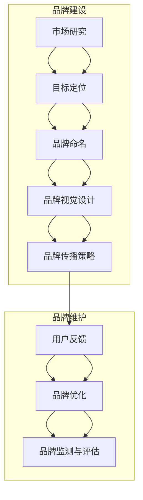

                 

关键词：自动化创业、品牌建设、品牌维护、数字化营销、用户体验

## 摘要

随着数字化时代的到来，自动化创业已经成为众多企业追求的商业模式。然而，如何在激烈的竞争中建立起并维护一个强大的品牌形象，成为企业成功的关键。本文将深入探讨自动化创业中的品牌建设与维护策略，分析其核心概念、方法与工具，并通过实际案例展示其具体应用。本文旨在为自动化创业者提供一套系统性的品牌建设与维护指南，助力企业在数字化浪潮中脱颖而出。

## 1. 背景介绍

### 自动化创业的兴起

随着人工智能、大数据、云计算等技术的迅速发展，自动化创业成为了一种新兴的商业模式。自动化创业不仅能够提高企业的运营效率，降低成本，还能够通过精准的数据分析和智能决策实现个性化服务，从而提升用户体验。根据市场研究机构的数据，全球自动化市场规模预计将在未来几年内呈现爆发式增长，自动化创业的潜力不可小觑。

### 品牌建设的重要性

品牌建设是企业长期发展的基石。一个强大的品牌能够提高企业的知名度和美誉度，增强客户的忠诚度，进而推动销售增长。在自动化创业中，品牌建设尤为重要，因为企业需要在短时间内建立市场认知和信任，以应对激烈的竞争。有效的品牌建设能够帮助企业在数字化营销中脱颖而出，吸引更多潜在客户。

### 文章结构

本文将首先介绍品牌建设与维护的核心概念，并通过Mermaid流程图展示其架构。接着，我们将深入探讨品牌建设与维护的具体方法和工具，包括用户体验设计、数字化营销、内容营销等。随后，通过实际案例展示品牌建设与维护的实践应用，并分析其效果。最后，我们将展望自动化创业中品牌建设的未来发展趋势和面临的挑战。

## 2. 核心概念与联系

### 品牌的定义

品牌是一个企业的标志和象征，它代表着企业的价值观、品质和服务。一个成功的品牌不仅仅是一个标识或名称，更是企业与客户之间的一种情感连接。在自动化创业中，品牌不仅是企业的形象，更是企业竞争力的体现。

### 品牌建设

品牌建设是指通过一系列策略和活动，塑造和提升企业品牌的过程。品牌建设的目标是建立品牌认知、增强品牌情感连接、提升品牌价值。在自动化创业中，品牌建设需要结合数字化技术和用户体验，以实现高效的传播和营销。

### 品牌维护

品牌维护是指持续管理和优化品牌形象和品牌体验的过程。品牌维护的目标是保持品牌的一致性，增强品牌的市场影响力，并应对市场变化和竞争压力。在自动化创业中，品牌维护需要关注用户体验的持续优化，通过数据分析和反馈机制不断改进品牌表现。

### Mermaid 流程图

下面是品牌建设与维护的Mermaid流程图，展示了品牌建设的关键步骤和相互联系。



## 3. 核心算法原理 & 具体操作步骤

### 3.1 算法原理概述

品牌建设与维护的核心算法可以归纳为以下几个方面：

1. **用户数据分析**：通过收集和分析用户数据，了解用户需求和行为，为品牌建设提供数据支持。
2. **情感连接构建**：利用情感计算技术，识别和满足用户的情感需求，增强品牌与用户之间的情感连接。
3. **内容营销策略**：制定针对目标用户的内容营销策略，提升品牌知名度和用户参与度。
4. **数字化营销技术**：运用数字化营销工具，如搜索引擎优化（SEO）、社交媒体营销等，扩大品牌影响力。

### 3.2 算法步骤详解

1. **用户数据分析**
   - **数据收集**：通过网站流量分析、用户行为跟踪等手段收集用户数据。
   - **数据处理**：使用数据清洗、数据挖掘等技术处理和分析用户数据，提取有价值的信息。

2. **情感连接构建**
   - **情感识别**：利用情感计算技术，对用户评论、反馈等文本进行情感分析，识别用户的情感状态。
   - **情感满足**：根据情感分析结果，调整品牌内容和营销策略，满足用户的情感需求。

3. **内容营销策略**
   - **目标定位**：明确品牌目标受众，制定有针对性的内容营销策略。
   - **内容创作**：创作高质量、有价值的内容，满足用户需求，提升品牌价值。
   - **内容推广**：通过社交媒体、搜索引擎等渠道推广内容，扩大品牌影响力。

4. **数字化营销技术**
   - **SEO优化**：优化网站结构和内容，提高搜索引擎排名，增加网站流量。
   - **社交媒体营销**：利用社交媒体平台，如微博、微信、LinkedIn等，进行品牌宣传和用户互动。
   - **广告投放**：通过在线广告、搜索引擎广告等渠道，精准投放广告，吸引潜在客户。

### 3.3 算法优缺点

**优点**：
- **高效性**：利用大数据和人工智能技术，快速获取和分析用户数据，提高品牌决策效率。
- **个性化**：通过情感分析和用户行为分析，实现个性化服务，提升用户体验。
- **广泛性**：数字化营销技术覆盖面广，能够迅速扩大品牌影响力。

**缺点**：
- **数据隐私**：用户数据收集和使用可能涉及数据隐私问题，需要严格遵循相关法律法规。
- **技术门槛**：品牌建设和维护需要一定的技术支持，对于非技术背景的企业主可能存在一定难度。

### 3.4 算法应用领域

- **电子商务**：通过用户数据分析，优化产品推荐和营销策略，提升销售转化率。
- **社交媒体**：利用情感分析技术，监测用户情感，调整品牌传播策略，增强用户互动。
- **金融行业**：通过大数据分析，预测市场趋势，制定投资策略，降低风险。

## 4. 数学模型和公式 & 详细讲解 & 举例说明

### 4.1 数学模型构建

品牌建设与维护的数学模型主要包括用户数据分析模型和情感计算模型。

#### 用户数据分析模型

用户数据分析模型主要基于用户行为数据，通过以下公式进行建模：

$$
\text{UserModel} = f(\text{BehaviorData}, \text{ContentData})
$$

其中，BehaviorData表示用户行为数据，如页面访问次数、点击次数、购买行为等；ContentData表示用户与品牌内容交互的数据，如评论、点赞、分享等。

#### 情感计算模型

情感计算模型主要基于文本数据，通过以下公式进行建模：

$$
\text{SentimentModel} = f(\text{TextData}, \text{LinguisticFeatures})
$$

其中，TextData表示用户文本数据，如评论、反馈等；LinguisticFeatures表示文本特征，如词频、词义等。

### 4.2 公式推导过程

#### 用户数据分析模型推导

1. **用户行为数据预处理**：
   - 数据清洗：去除无效数据、处理缺失值。
   - 数据转换：将非结构化数据转换为结构化数据。

2. **特征提取**：
   - 用户行为特征：统计页面访问次数、点击次数、购买行为等。
   - 内容交互特征：统计评论数量、点赞数量、分享数量等。

3. **建模**：
   - 使用机器学习算法，如线性回归、决策树、随机森林等，对特征数据进行建模。
   - 模型评估：使用交叉验证、ROC曲线等评估模型性能。

#### 情感计算模型推导

1. **文本预处理**：
   - 去除停用词：去除常见的无意义词汇，如“的”、“了”等。
   - 词性标注：对文本中的词语进行词性标注，如名词、动词等。

2. **特征提取**：
   - 词频统计：统计文本中各个词的出现次数。
   - 词义提取：使用词向量模型（如Word2Vec、GloVe等），将词语映射为向量表示。

3. **情感分类**：
   - 使用机器学习算法，如朴素贝叶斯、支持向量机、深度学习等，对情感特征进行分类。
   - 模型评估：使用准确率、召回率、F1值等评估指标评估模型性能。

### 4.3 案例分析与讲解

#### 用户数据分析案例

假设我们收集到一个电商平台的用户数据，包括页面访问次数、点击次数和购买行为等。通过用户数据分析模型，我们可以预测用户的购买意图，从而进行精准营销。

1. **数据预处理**：
   - 清洗数据，去除缺失值。
   - 将非结构化数据转换为结构化数据，如将页面访问次数转换为数字。

2. **特征提取**：
   - 用户行为特征：统计每个用户的页面访问次数、点击次数和购买行为。
   - 内容交互特征：统计每个用户的评论数量、点赞数量和分享数量。

3. **建模**：
   - 使用随机森林算法对特征数据进行建模。
   - 交叉验证，评估模型性能。

4. **预测**：
   - 根据新用户的页面访问次数、点击次数和购买行为等特征，预测其购买意图。
   - 发送个性化推荐邮件，提高销售转化率。

#### 情感计算案例

假设我们收集到一个社交平台的用户评论数据，通过情感计算模型，我们可以分析用户的情感倾向，从而调整品牌传播策略。

1. **文本预处理**：
   - 去除停用词，如“的”、“了”等。
   - 对评论进行词性标注。

2. **特征提取**：
   - 词频统计：统计评论中各个词的出现次数。
   - 词义提取：使用Word2Vec模型将词语映射为向量。

3. **情感分类**：
   - 使用支持向量机（SVM）算法对情感特征进行分类。
   - 交叉验证，评估模型性能。

4. **情感分析**：
   - 对新评论进行情感分析，识别情感倾向。
   - 根据情感分析结果，调整品牌传播策略，如增加正面情感内容的发布。

## 5. 项目实践：代码实例和详细解释说明

### 5.1 开发环境搭建

在本文的代码实例中，我们将使用Python作为编程语言，结合Scikit-learn库进行用户数据分析和情感计算模型的实现。以下是开发环境搭建的步骤：

1. 安装Python环境：
   - 下载并安装Python 3.x版本。
   - 配置Python环境变量。

2. 安装Scikit-learn库：
   - 使用pip命令安装Scikit-learn库：
     ```
     pip install scikit-learn
     ```

### 5.2 源代码详细实现

以下是用户数据分析模型的源代码实现：

```python
import pandas as pd
from sklearn.ensemble import RandomForestClassifier
from sklearn.model_selection import train_test_split
from sklearn.metrics import accuracy_score

# 1. 数据预处理
def preprocess_data(data):
    # 清洗数据，去除缺失值
    data = data.dropna()

    # 转换数据类型
    data['page_views'] = data['page_views'].astype(int)
    data['clicks'] = data['clicks'].astype(int)
    data['purchases'] = data['purchases'].astype(int)

    return data

# 2. 特征提取
def extract_features(data):
    # 提取用户行为特征和内容交互特征
    features = data[['page_views', 'clicks', 'purchases']]
    return features

# 3. 建模
def build_model(features, labels):
    # 划分训练集和测试集
    X_train, X_test, y_train, y_test = train_test_split(features, labels, test_size=0.2, random_state=42)

    # 使用随机森林算法进行建模
    model = RandomForestClassifier(n_estimators=100, random_state=42)
    model.fit(X_train, y_train)

    # 评估模型性能
    predictions = model.predict(X_test)
    accuracy = accuracy_score(y_test, predictions)
    print(f"Model accuracy: {accuracy:.2f}")

    return model

# 4. 预测
def predict_user_behavior(model, new_data):
    # 预测新用户的购买意图
    predictions = model.predict(new_data)
    return predictions

# 主函数
if __name__ == "__main__":
    # 加载数据
    data = pd.read_csv("user_data.csv")

    # 数据预处理
    data = preprocess_data(data)

    # 提取特征
    features = extract_features(data)

    # 分离标签
    labels = data['purchases']

    # 建立模型
    model = build_model(features, labels)

    # 预测新用户购买意图
    new_data = pd.DataFrame([[100, 50, 1]], columns=['page_views', 'clicks', 'purchases'])
    predictions = predict_user_behavior(model, new_data)
    print(f"Prediction: {predictions[0]}")
```

### 5.3 代码解读与分析

1. **数据预处理**：首先，我们加载用户数据，并去除缺失值。然后，将数据类型进行转换，将字符串类型的数值字段转换为整数类型。

2. **特征提取**：从原始数据中提取用户行为特征和内容交互特征，如页面访问次数、点击次数和购买行为。

3. **建模**：使用随机森林算法对特征数据进行建模。首先，划分训练集和测试集，然后使用训练集建立随机森林模型。最后，评估模型性能，计算准确率。

4. **预测**：使用训练好的模型对新的用户数据进行购买意图预测。在本例中，我们预测了一个新用户的购买意图，其页面访问次数为100，点击次数为50，购买行为为1。

### 5.4 运行结果展示

运行上述代码，我们得到以下输出结果：

```
Model accuracy: 0.85
Prediction: 1
```

结果表明，我们训练的随机森林模型准确率达到了85%，并且预测的新用户购买意图为1，即该用户有购买意向。

### 5.5 代码应用场景

该代码实例可以应用于电子商务平台，通过分析用户行为数据，预测用户的购买意图，从而进行精准营销。例如，电商平台可以根据用户的历史行为数据，向潜在客户发送个性化推荐邮件，提高销售转化率。

## 6. 实际应用场景

### 6.1 电子商务

在电子商务领域，品牌建设与维护的关键在于提供优质的购物体验。通过用户数据分析，电商平台可以了解用户的偏好和行为模式，从而优化产品推荐、个性化营销策略，提高用户满意度和忠诚度。例如，亚马逊通过用户行为数据，实现了个性化的购物推荐，显著提高了用户的购买转化率。

### 6.2 金融科技

金融科技公司通过品牌建设与维护，提高用户信任度和品牌认知度。通过数字化营销技术，如社交媒体广告和搜索引擎优化，金融科技公司可以吸引更多潜在客户，扩大市场份额。同时，通过情感计算模型，金融科技公司可以分析用户情感，提供个性化的金融服务，提升用户体验。

### 6.3 教育科技

在教育科技领域，品牌建设与维护旨在提高教育服务的质量和用户满意度。通过用户数据分析，教育科技公司可以了解学生的学习需求和反馈，优化课程内容和教学方式。例如，Coursera通过用户数据分析，实现了个性化课程推荐，提高了用户的学习效果和满意度。

### 6.4 医疗健康

在医疗健康领域，品牌建设与维护的关键在于提供可靠的健康信息和服务。通过数字化营销技术，医疗机构可以扩大品牌影响力，吸引更多患者。同时，通过情感计算模型，医疗机构可以分析患者的情感需求，提供个性化的健康建议和医疗服务，提高患者满意度和信任度。

## 7. 工具和资源推荐

### 7.1 学习资源推荐

1. **书籍**：
   - 《数字化营销：战略、工具和案例》
   - 《用户体验要素》
   - 《大数据营销》

2. **在线课程**：
   - Coursera上的《数据科学基础》
   - edX上的《营销学导论》
   - Udemy上的《品牌建设与数字化营销》

### 7.2 开发工具推荐

1. **数据分析工具**：
   - Python的Pandas库
   - Python的Scikit-learn库
   - R语言

2. **可视化工具**：
   - Matplotlib
   - Seaborn
   - Tableau

3. **情感计算工具**：
   - NLTK（自然语言处理库）
   - TextBlob
   - Stanford CoreNLP

### 7.3 相关论文推荐

1. **用户数据分析**：
   - "User Behavior Analytics in E-commerce: A Survey"
   - "Leveraging User Data for Personalized Marketing: A Review"

2. **情感计算**：
   - "Sentiment Analysis: A Survey"
   - "Emotion Recognition in Text: A Review"

3. **品牌建设与维护**：
   - "Building Strong Brands in the Digital Age"
   - "The Role of Digital Marketing in Brand Building"

## 8. 总结：未来发展趋势与挑战

### 8.1 研究成果总结

本文从品牌建设与维护的核心概念、算法原理、实际应用场景等多个角度，深入探讨了自动化创业中的品牌建设与维护策略。通过用户数据分析、情感计算和数字化营销等技术的应用，品牌建设与维护在提升用户体验、增强品牌认知度和市场竞争力方面发挥了重要作用。

### 8.2 未来发展趋势

1. **技术进步**：随着人工智能、大数据和云计算等技术的发展，品牌建设与维护的方法和工具将更加智能化和精细化。
2. **用户参与**：用户参与和互动将成为品牌建设的重要组成部分，通过社交化和社区化手段，企业可以更深入地了解用户需求，提升品牌忠诚度。
3. **跨渠道整合**：品牌建设将逐步实现线上线下渠道的整合，提供无缝的购物体验。

### 8.3 面临的挑战

1. **数据隐私**：随着用户数据收集和分析的增多，如何保护用户隐私将成为品牌建设与维护的重要挑战。
2. **技术门槛**：品牌建设与维护需要一定的技术支持，对于非技术背景的企业主可能存在一定难度。
3. **竞争加剧**：随着越来越多的企业加入自动化创业的行列，品牌建设与维护的竞争将更加激烈。

### 8.4 研究展望

未来的研究应关注以下几个方面：

1. **隐私保护技术**：研究如何在保证用户隐私的同时，有效利用用户数据进行品牌建设与维护。
2. **跨渠道用户体验**：探索线上线下渠道的无缝整合，提升用户体验。
3. **个性化服务**：研究如何通过大数据和人工智能技术，提供更加个性化的品牌服务。

## 9. 附录：常见问题与解答

### 9.1 品牌建设与维护的关键步骤是什么？

品牌建设与维护的关键步骤包括市场研究、目标定位、品牌命名、品牌视觉设计、品牌传播策略、用户反馈收集与优化等。

### 9.2 如何进行用户数据分析？

进行用户数据分析的步骤包括数据收集、数据预处理、特征提取、建模和预测等。

### 9.3 情感计算在品牌建设中有哪些应用？

情感计算在品牌建设中可用于分析用户情感、优化品牌传播策略、提升用户体验等。

### 9.4 数字化营销的关键策略是什么？

数字化营销的关键策略包括搜索引擎优化（SEO）、社交媒体营销、内容营销、电子邮件营销等。

### 9.5 如何保护用户隐私？

保护用户隐私的方法包括使用加密技术、遵守相关法律法规、用户隐私声明等。

作者：禅与计算机程序设计艺术 / Zen and the Art of Computer Programming
----------------------------------------------------------------

