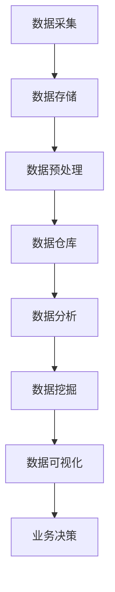

                 

关键词：自动化创业、商业智能、大数据分析、机器学习、预测建模

> 摘要：本文深入探讨了自动化创业中的商业智能应用，通过分析大数据、机器学习和预测建模等核心技术，阐述了如何利用商业智能提升创业项目的竞争力。本文旨在为创业者提供一种新的视角，以帮助他们在激烈的市场竞争中取得优势。

## 1. 背景介绍

随着信息技术的飞速发展，数据已经成为企业最宝贵的资产之一。在商业环境中，数据的获取、存储、分析和应用已经成为企业运营和决策过程中的重要组成部分。商业智能（Business Intelligence，简称BI）正成为企业管理者获取洞察力、提高决策效率的关键工具。

自动化创业则是在当今数字化时代中一种新兴的企业模式。创业者通过利用自动化工具和平台，快速搭建起一个灵活、高效的业务系统，以应对市场变化和客户需求。商业智能在自动化创业中的应用，不仅能够帮助企业实现数据的可视化、分析，还可以通过预测模型帮助企业做出更加精准的决策。

本文将从以下几个方面展开讨论：首先介绍商业智能的基本概念和主要应用领域；其次分析大数据、机器学习和预测建模等核心技术；接着探讨商业智能在自动化创业中的应用场景；最后展望未来商业智能在自动化创业中的发展趋势。

## 2. 核心概念与联系

### 2.1 商业智能基本概念

商业智能是一种利用数据分析、数据挖掘和可视化技术，帮助企业从海量数据中提取有价值信息，用于业务决策和管理的方法。商业智能主要包括以下核心概念：

1. **数据仓库**：用于存储和管理企业历史数据的数据仓库，是企业进行数据分析的基础。
2. **数据挖掘**：通过统计分析和机器学习算法，从海量数据中挖掘出潜在的模式和规律。
3. **数据可视化**：将复杂的数据分析结果以图形化的方式展示，便于企业决策者理解和应用。
4. **业务流程管理**：通过自动化和优化业务流程，提高企业运营效率。

### 2.2 商业智能主要应用领域

商业智能在多个领域有着广泛的应用，包括：

1. **市场营销**：通过数据分析，帮助企业识别目标客户，优化营销策略。
2. **客户关系管理**：通过客户数据分析和行为分析，提升客户满意度，增加客户忠诚度。
3. **供应链管理**：通过供应链数据分析和预测，优化库存管理，降低运营成本。
4. **财务分析**：通过财务数据分析，帮助企业管理财务风险，提高财务绩效。

### 2.3 大数据、机器学习和预测建模

1. **大数据**：大数据是指数据量巨大、数据类型多样、数据价值密度低的数据集合。大数据技术能够高效地处理和存储海量数据，为企业提供更丰富的数据资源。
2. **机器学习**：机器学习是一种通过数据训练模型，实现数据自动分析和决策的技术。机器学习在商业智能中有着广泛的应用，如客户细分、市场预测等。
3. **预测建模**：通过历史数据和机器学习算法，预测未来的业务趋势和结果。预测建模可以帮助企业做出更加精准的决策，降低风险。

### 2.4 商业智能架构的 Mermaid 流程图



## 3. 核心算法原理 & 具体操作步骤

### 3.1 算法原理概述

商业智能中的核心算法主要包括数据挖掘算法、预测建模算法和优化算法。这些算法通过分析数据，提取有价值的信息，为企业决策提供支持。

1. **数据挖掘算法**：常见的算法包括关联规则挖掘、分类算法、聚类算法等。这些算法用于发现数据中的潜在模式和关联关系。
2. **预测建模算法**：常见的算法包括线性回归、决策树、神经网络等。这些算法通过历史数据预测未来的业务趋势。
3. **优化算法**：常见的算法包括遗传算法、模拟退火算法等。这些算法用于优化业务流程和资源配置。

### 3.2 算法步骤详解

1. **数据采集**：通过数据采集工具，从企业内外部获取数据。
2. **数据存储**：将采集到的数据存储在数据仓库中，进行数据清洗、转换和整合。
3. **数据预处理**：对数据进行去重、补全、归一化等处理，提高数据质量。
4. **数据分析**：使用数据挖掘算法，分析数据中的潜在模式和关联关系。
5. **预测建模**：使用预测建模算法，建立预测模型，对未来的业务趋势进行预测。
6. **数据可视化**：将分析结果以图表、报表等形式进行可视化展示，便于企业决策者理解。
7. **业务决策**：根据数据分析结果和预测模型，制定相应的业务策略和决策。

### 3.3 算法优缺点

1. **数据挖掘算法**：优点是能够发现数据中的潜在模式和关联关系，提高决策效率；缺点是算法复杂度较高，计算时间较长。
2. **预测建模算法**：优点是能够对未来的业务趋势进行预测，降低决策风险；缺点是需要大量的历史数据支持，且预测精度受数据质量影响。
3. **优化算法**：优点是能够优化业务流程和资源配置，提高企业效率；缺点是算法复杂度较高，需要大量的计算资源。

### 3.4 算法应用领域

1. **市场营销**：通过数据挖掘和预测建模，帮助企业识别目标客户，优化营销策略。
2. **客户关系管理**：通过数据分析，提升客户满意度，增加客户忠诚度。
3. **供应链管理**：通过供应链数据分析，优化库存管理，降低运营成本。
4. **财务分析**：通过财务数据分析，帮助企业管理财务风险，提高财务绩效。

## 4. 数学模型和公式 & 详细讲解 & 举例说明

### 4.1 数学模型构建

商业智能中的数学模型主要包括预测模型和优化模型。以下是一个简单的线性回归预测模型的构建过程：

1. **数据准备**：收集历史数据，包括自变量 \(X\) 和因变量 \(Y\)。
2. **模型假设**：假设 \(Y\) 与 \(X\) 存在线性关系，即 \(Y = \beta_0 + \beta_1 X + \epsilon\)，其中 \(\beta_0\) 和 \(\beta_1\) 是模型参数，\(\epsilon\) 是误差项。
3. **模型估计**：使用最小二乘法估计模型参数，即求解 \(\beta_0\) 和 \(\beta_1\) 使得预测误差最小。
4. **模型评估**：使用交叉验证等方法评估模型性能，调整模型参数。

### 4.2 公式推导过程

线性回归模型的公式推导如下：

1. **目标函数**：最小化预测误差的平方和，即
   $$
   J(\theta) = \frac{1}{2m} \sum_{i=1}^{m} (h_\theta(x^{(i)}) - y^{(i)})^2
   $$
   其中 \(m\) 是样本数量，\(h_\theta(x)\) 是预测函数，\(\theta\) 是模型参数。
2. **梯度下降**：求解目标函数的最小值，即
   $$
   \theta_j := \theta_j - \alpha \frac{\partial J(\theta)}{\partial \theta_j}
   $$
   其中 \(\alpha\) 是学习率。

### 4.3 案例分析与讲解

假设一家电商公司希望预测未来的销售额。我们收集了过去一年的月销售额数据，包括月份 \(X\) 和销售额 \(Y\)。

1. **数据准备**：将数据分为训练集和测试集，用于模型训练和评估。
2. **模型构建**：使用线性回归模型，将月份作为自变量，销售额作为因变量。
3. **模型训练**：使用训练集数据，使用梯度下降法训练模型。
4. **模型评估**：使用测试集数据评估模型性能，调整模型参数。
5. **模型应用**：使用训练好的模型预测未来的销售额。

## 5. 项目实践：代码实例和详细解释说明

### 5.1 开发环境搭建

在Python环境中，我们需要安装以下库：numpy、pandas、scikit-learn、matplotlib。

```python
pip install numpy pandas scikit-learn matplotlib
```

### 5.2 源代码详细实现

以下是一个简单的线性回归预测项目的代码实现：

```python
import numpy as np
import pandas as pd
from sklearn.linear_model import LinearRegression
from sklearn.model_selection import train_test_split
import matplotlib.pyplot as plt

# 数据准备
data = pd.read_csv('sales_data.csv')
X = data['month'].values.reshape(-1, 1)
y = data['sales'].values

# 数据划分
X_train, X_test, y_train, y_test = train_test_split(X, y, test_size=0.2, random_state=42)

# 模型训练
model = LinearRegression()
model.fit(X_train, y_train)

# 模型评估
y_pred = model.predict(X_test)
mse = np.mean((y_pred - y_test) ** 2)
print(f'MSE: {mse}')

# 模型应用
future_months = np.array([12, 13, 14]).reshape(-1, 1)
future_sales = model.predict(future_months)
print(f'Future sales: {future_sales}')

# 可视化展示
plt.scatter(X_test, y_test, color='red', label='Actual')
plt.plot(X_test, y_pred, color='blue', label='Predicted')
plt.xlabel('Month')
plt.ylabel('Sales')
plt.legend()
plt.show()
```

### 5.3 代码解读与分析

1. **数据准备**：读取销售数据，将月份和销售额分别存储在X和y中。
2. **数据划分**：将数据划分为训练集和测试集，用于模型训练和评估。
3. **模型训练**：使用线性回归模型进行训练。
4. **模型评估**：计算测试集的均方误差，评估模型性能。
5. **模型应用**：使用训练好的模型预测未来的销售额。
6. **可视化展示**：将实际销售额和预测销售额进行可视化展示，便于分析。

## 6. 实际应用场景

商业智能在自动化创业中有着广泛的应用场景，以下是一些典型的应用案例：

1. **市场营销**：通过商业智能分析客户数据，识别潜在客户，制定精准营销策略，提高转化率。
2. **客户关系管理**：通过商业智能分析客户行为，提高客户满意度，增加客户忠诚度，降低客户流失率。
3. **供应链管理**：通过商业智能分析供应链数据，优化库存管理，降低运营成本，提高供应链效率。
4. **财务分析**：通过商业智能分析财务数据，帮助企业管理财务风险，提高财务绩效。

## 7. 未来应用展望

随着人工智能和大数据技术的不断发展，商业智能在自动化创业中的应用将越来越广泛。未来，商业智能有望在以下领域取得突破：

1. **个性化服务**：通过深度学习和自然语言处理技术，实现更加个性化的客户服务。
2. **实时预测**：通过实时数据处理和预测模型，实现实时业务监控和预测。
3. **智能决策**：通过智能算法和决策支持系统，帮助创业者实现更加智能化的决策。

## 8. 工具和资源推荐

### 8.1 学习资源推荐

- 《Python数据科学手册》
- 《机器学习实战》
- 《大数据技术导论》

### 8.2 开发工具推荐

- Jupyter Notebook：用于编写和运行Python代码，支持交互式编程。
- Tableau：用于数据可视化，支持多种数据源和分析工具。
- Hadoop和Spark：用于大数据处理和存储，支持分布式计算和机器学习。

### 8.3 相关论文推荐

- 《数据挖掘：实用机器学习技术》
- 《深度学习》
- 《大数据时代的商业智能》

## 9. 总结：未来发展趋势与挑战

商业智能在自动化创业中的应用，将有助于创业者提高决策效率、降低运营成本、提升客户满意度。然而，随着技术的不断发展，商业智能也面临着一系列挑战，如数据隐私、算法透明度等。未来，创业者需要不断学习和适应新技术，以应对这些挑战。

## 10. 附录：常见问题与解答

### Q：商业智能需要大量的数据支持，如何获取这些数据？
A：数据来源可以包括企业内部数据、外部公开数据、第三方数据提供商等。此外，还可以通过数据采集工具和API接口获取数据。

### Q：商业智能项目实施需要哪些技术栈？
A：商业智能项目需要的技术栈包括：Python、R、SQL、Hadoop、Spark、Tableau等。创业者可以根据项目需求选择合适的技术。

### Q：商业智能项目如何保证数据隐私和安全？
A：商业智能项目应遵守数据保护法规，如GDPR等。此外，应采取数据加密、访问控制等安全措施，确保数据安全和隐私。

作者：禅与计算机程序设计艺术 / Zen and the Art of Computer Programming
----------------------------------------------------------------
### 完成摘要 ###
### 总结：商业智能在自动化创业中的应用，不仅能够帮助企业实现数据的可视化、分析，还可以通过预测模型帮助企业做出更加精准的决策。本文探讨了商业智能的核心概念、核心技术、算法原理、数学模型以及实际应用场景，为创业者提供了实用的技术指南。未来，随着人工智能和大数据技术的发展，商业智能在自动化创业中的应用前景将更加广阔。###

