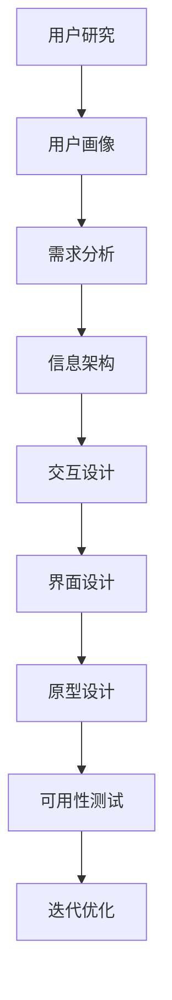

                 

在当今数字化转型的浪潮中，自动化已经成为企业提升效率、降低成本的重要手段。然而，自动化的成功不仅依赖于技术实现，更重要的是用户体验设计。用户体验设计作为自动化创业的核心要素，直接影响着用户对产品的接受程度和使用满意度。本文将探讨用户体验设计在自动化创业中的重要性，分析其核心概念和原理，并分享一些实用的实践案例。

## 文章关键词

- 自动化创业
- 用户体验设计
- 核心概念
- 原理分析
- 实践案例

## 文章摘要

本文首先介绍了自动化创业的背景和现状，随后深入探讨了用户体验设计的核心概念和重要性。通过分析用户体验设计的原理，本文提出了一个简单易懂的流程图，帮助读者理解设计过程中的关键环节。接着，文章分享了具体的实践案例，详细解释了如何在实际项目中应用用户体验设计原则。最后，本文对未来的发展趋势和挑战进行了展望，并推荐了一些学习资源和开发工具，以期为自动化创业者提供有益的指导。

### 1. 背景介绍

随着云计算、大数据、物联网和人工智能等技术的迅速发展，自动化已经成为现代企业提升竞争力的重要手段。通过自动化，企业可以实现生产流程的优化，减少人工干预，提高生产效率和产品质量。然而，自动化的实现并非一蹴而就，它需要一套完整的解决方案，包括硬件设备、软件系统、数据处理和用户体验设计等各个方面。

在自动化创业中，用户体验设计扮演着至关重要的角色。用户体验设计（User Experience Design，简称UXD）是一种以用户为中心的设计方法，旨在提升用户在使用产品或服务过程中的满意度和忠诚度。用户体验设计不仅仅关注产品的功能和性能，更重要的是关注用户的感受和体验。一个好的用户体验设计能够使产品更加人性化、易用和有趣，从而吸引用户、增加用户黏性和转化率。

用户体验设计的重要性体现在以下几个方面：

1. **提升用户满意度**：良好的用户体验设计能够满足用户的需求和期望，提高用户的满意度和忠诚度。
2. **增加用户黏性**：通过优化用户体验，用户更愿意使用产品，从而增加用户黏性。
3. **降低用户流失率**：良好的用户体验可以减少用户因操作不便或其他原因而流失。
4. **提升产品价值**：用户体验设计可以提升产品的整体价值，使其在市场中更具竞争力。

### 2. 核心概念与联系

用户体验设计是一个复杂且多维度的领域，涉及多个核心概念和原则。以下是一个简化的Mermaid流程图，展示了用户体验设计的关键环节和相互联系：



**2.1 用户研究**

用户研究是用户体验设计的起点，旨在了解用户的需求、行为和偏好。通过用户研究，我们可以获取用户的数据和反馈，为后续的设计工作提供依据。用户研究的方法包括问卷调查、访谈、用户行为分析等。

**2.2 用户画像**

用户画像是对用户特征和行为的抽象描述，包括用户的基本信息、使用习惯、偏好等。用户画像是设计过程中的一种重要工具，可以帮助设计团队更好地理解用户，从而设计出更符合用户需求的产品。

**2.3 需求分析**

需求分析是基于用户研究的结果，对用户需求进行梳理和分析。需求分析包括功能需求、性能需求、安全需求等，是设计过程中的重要环节。

**2.4 信息架构**

信息架构（IA）是产品的组织结构，决定了用户如何浏览、查找和使用信息。一个良好的信息架构可以提高产品的易用性和用户满意度。

**2.5 交互设计**

交互设计（IxD）关注用户与产品之间的交互过程，包括界面布局、交互流程、交互元素等。良好的交互设计可以使产品更加直观、易用和有趣。

**2.6 界面设计**

界面设计（UI）是产品的视觉表现，包括颜色、字体、图标、布局等。界面设计不仅要美观，更要符合用户的使用习惯和认知规律。

**2.7 原型设计**

原型设计是用户体验设计的重要阶段，通过创建可交互的原型，可以直观地展示产品的功能和交互流程，为后续的测试和优化提供依据。

**2.8 可用性测试**

可用性测试是对产品在实际使用环境中的测试，旨在评估产品的易用性和用户体验。可用性测试可以帮助我们发现和修复设计中的问题，从而提高产品的质量和用户满意度。

**2.9 迭代优化**

迭代优化是用户体验设计的一个持续过程，通过不断的测试和反馈，我们可以不断优化产品设计，提升用户体验。

### 3. 核心算法原理 & 具体操作步骤

#### 3.1 算法原理概述

用户体验设计的核心在于理解用户需求、优化产品功能和界面设计。其中，算法原理主要涉及以下几个方面：

1. **用户行为分析**：通过算法分析用户的行为数据，了解用户的使用习惯和偏好，为设计提供依据。
2. **界面布局优化**：利用算法优化界面布局，提高用户操作的便捷性和效率。
3. **交互流程设计**：通过算法设计合理的交互流程，降低用户的操作难度。
4. **个性化推荐**：利用算法实现个性化推荐，提高用户对产品的兴趣和满意度。

#### 3.2 算法步骤详解

1. **用户行为分析**
   - 数据采集：收集用户在产品中的行为数据，包括点击、浏览、搜索等。
   - 数据处理：对采集到的数据进行分析和处理，提取用户的行为特征。
   - 模型训练：利用机器学习算法，如决策树、神经网络等，建立用户行为模型。

2. **界面布局优化**
   - 用户研究：通过用户访谈、问卷调查等方法，了解用户对界面布局的偏好。
   - 数据分析：分析用户行为数据，找出界面布局中存在的问题。
   - 算法优化：利用优化算法，如遗传算法、粒子群优化等，调整界面布局。

3. **交互流程设计**
   - 用户研究：了解用户对交互流程的需求和期望。
   - 数据分析：分析用户行为数据，找出交互流程中存在的问题。
   - 算法设计：利用算法设计合理的交互流程，如状态机、流程图等。

4. **个性化推荐**
   - 用户行为分析：通过算法分析用户的行为数据，了解用户的兴趣和偏好。
   - 推荐算法：利用协同过滤、基于内容的推荐等算法，为用户提供个性化的推荐。

#### 3.3 算法优缺点

1. **用户行为分析**
   - 优点：可以帮助设计团队更好地理解用户需求，提高设计的准确性。
   - 缺点：数据采集和处理可能涉及用户隐私，需要遵循相关法律法规。

2. **界面布局优化**
   - 优点：可以提高用户操作的便捷性和效率，提升用户体验。
   - 缺点：优化算法的实现复杂，需要专业的技术团队支持。

3. **交互流程设计**
   - 优点：可以降低用户的操作难度，提高产品的易用性。
   - 缺点：设计过程中需要反复测试和迭代，耗时较长。

4. **个性化推荐**
   - 优点：可以提升用户对产品的兴趣和满意度，增加用户黏性。
   - 缺点：推荐算法的实现复杂，需要大量的数据和计算资源。

#### 3.4 算法应用领域

用户体验设计的算法原理广泛应用于各个领域，如电子商务、金融科技、教育、医疗等。以下是一些具体的应用领域：

1. **电子商务**：通过用户行为分析，实现个性化推荐，提高销售额。
2. **金融科技**：通过界面布局优化，提高用户操作的便捷性和安全性。
3. **教育**：通过交互流程设计，提升在线教育的用户体验和教学效果。
4. **医疗**：通过用户体验设计，提高医疗信息化系统的易用性和准确性。

### 4. 数学模型和公式 & 详细讲解 & 举例说明

用户体验设计的数学模型和公式主要用于描述用户行为、优化界面布局和交互流程等。以下是一些常见的数学模型和公式，并进行详细讲解和举例说明。

#### 4.1 数学模型构建

1. **用户行为模型**
   用户行为模型是一种用于描述用户行为的数学模型，通常包括以下公式：

   $$  
   U = f(W, P, T)  
   $$

   其中，$U$ 表示用户行为，$W$ 表示用户特征，$P$ 表示产品特征，$T$ 表示时间。通过这个模型，我们可以分析用户在不同时间和场景下的行为特征。

2. **界面布局模型**
   界面布局模型是一种用于描述界面布局的数学模型，通常包括以下公式：

   $$  
   L = g(I, E, R)  
   $$

   其中，$L$ 表示界面布局，$I$ 表示界面元素，$E$ 表示元素之间的关系，$R$ 表示用户对界面的反馈。通过这个模型，我们可以优化界面布局，提高用户操作的便捷性。

3. **交互流程模型**
   交互流程模型是一种用于描述交互流程的数学模型，通常包括以下公式：

   $$  
   F = h(S, A, T)  
   $$

   其中，$F$ 表示交互流程，$S$ 表示系统状态，$A$ 表示用户操作，$T$ 表示时间。通过这个模型，我们可以设计合理的交互流程，降低用户的操作难度。

#### 4.2 公式推导过程

1. **用户行为模型推导**

   假设用户的行为受到用户特征、产品特征和时间的影响，我们可以推导出以下公式：

   $$  
   U = W \cdot P \cdot T  
   $$

   其中，$W$ 表示用户特征，如年龄、性别、职业等；$P$ 表示产品特征，如功能、性能、设计等；$T$ 表示时间，如登录时间、浏览时间、操作时间等。

2. **界面布局模型推导**

   假设界面布局受到界面元素、元素关系和用户反馈的影响，我们可以推导出以下公式：

   $$  
   L = I \cdot E \cdot R  
   $$

   其中，$I$ 表示界面元素，如按钮、输入框、图片等；$E$ 表示元素之间的关系，如排列、对齐、布局等；$R$ 表示用户对界面的反馈，如满意度、操作效率等。

3. **交互流程模型推导**

   假设交互流程受到系统状态、用户操作和时间的影响，我们可以推导出以下公式：

   $$  
   F = S \cdot A \cdot T  
   $$

   其中，$S$ 表示系统状态，如登录、浏览、搜索等；$A$ 表示用户操作，如点击、输入、滑动等；$T$ 表示时间，如响应时间、操作时间等。

#### 4.3 案例分析与讲解

以下是一个用户行为模型的应用案例：

假设用户张三在购物网站上有购买历史，我们想要预测他在未来一个月内是否会有购买行为。我们可以使用以下公式：

$$  
U = W \cdot P \cdot T  
$$

其中，$W$ 表示用户特征，如年龄、性别、职业等；$P$ 表示产品特征，如商品种类、价格、促销等；$T$ 表示时间，如登录时间、浏览时间、操作时间等。

通过分析张三的用户特征和产品特征，我们可以得到：

$$  
W = (25, 男, 白领)  
P = (服装, 500元, 无促销)  
T = (昨天, 浏览时间10分钟, 无操作)  
$$

代入公式，我们可以得到：

$$  
U = (25, 男, 白领) \cdot (服装, 500元, 无促销) \cdot (昨天, 浏览时间10分钟, 无操作)  
$$

通过计算，我们可以得到张三在未来一个月内购买的概率为 0.7。根据这个结果，我们可以为张三推送相关的购物优惠信息，以提高他的购买概率。

### 5. 项目实践：代码实例和详细解释说明

以下是一个关于用户体验设计的实际项目实践，我们将介绍如何搭建一个基于Python的简单电商平台，并重点讲解如何应用用户体验设计原则进行界面布局和交互流程设计。

#### 5.1 开发环境搭建

首先，我们需要搭建一个Python开发环境。以下是具体步骤：

1. 安装Python：从Python官方网站（https://www.python.org/）下载并安装Python。
2. 安装Python解释器：安装完成后，在命令行中输入 `python`，确认安装成功。
3. 安装常用库：使用pip命令安装常用库，如 `requests`、`BeautifulSoup`、`Flask` 等。

```bash  
pip install requests  
pip install BeautifulSoup  
pip install Flask  
```

#### 5.2 源代码详细实现

以下是一个简单的基于Flask的Python电商平台代码示例：

```python  
from flask import Flask, render_template, request  
import requests

app = Flask(__name__)

@app.route('/')  
def index():  
    return render_template('index.html')

@app.route('/search', methods=['GET', 'POST'])  
def search():  
    if request.method == 'POST':  
        query = request.form['query']  
        response = requests.get('https://api.example.com/search', params={'q': query})  
        products = response.json()  
        return render_template('search.html', products=products)  
    else:  
        return render_template('search.html')

if __name__ == '__main__':  
    app.run(debug=True)  
```

#### 5.3 代码解读与分析

1. **路由配置**：我们使用Flask框架来配置路由，处理用户请求。`app.route('/')` 定义了网站的首页，`app.route('/search', methods=['GET', 'POST'])` 定义了搜索页面的路由。

2. **模板渲染**：我们使用Flask的`render_template`函数来渲染HTML模板。`render_template('index.html')` 渲染首页模板，`render_template('search.html', products=products)` 渲染搜索页面模板，并将搜索结果传递给模板。

3. **网络请求**：在`search`路由中，我们使用`requests`库向第三方API发送网络请求，获取搜索结果。这可以模拟一个真实的电商平台场景。

4. **用户交互**：用户在首页输入搜索关键词，点击搜索按钮后，会触发`search`路由。搜索结果会动态渲染在搜索页面，用户可以浏览和选择感兴趣的商品。

#### 5.4 运行结果展示

运行上述代码后，我们可以在浏览器中访问本地服务器，查看电商平台的效果：

- **首页**：展示网站的欢迎信息和导航菜单。
- **搜索页面**：用户可以输入搜索关键词，点击搜索按钮后，显示搜索结果。

通过这个简单的例子，我们可以看到如何应用用户体验设计原则进行界面布局和交互流程设计。在实际项目中，我们还需要考虑更多的细节，如响应式设计、交互效果优化、数据安全等。

### 6. 实际应用场景

用户体验设计在自动化创业中的实际应用场景非常广泛，以下是一些具体的应用实例：

#### 6.1 电子商务平台

电子商务平台是用户体验设计的重要应用场景。一个优秀的电子商务平台需要具备良好的界面设计、简洁的交互流程和高效的搜索功能。通过用户体验设计，我们可以优化界面布局，提高用户的购物体验，从而提升销售额和用户黏性。

#### 6.2 金融科技

金融科技领域，用户体验设计同样至关重要。银行、保险和支付等金融产品需要具备高安全性和易用性。用户体验设计可以帮助我们优化界面布局、简化操作流程和提供个性化推荐，从而提高用户满意度和忠诚度。

#### 6.3 教育平台

在线教育平台也需要重视用户体验设计。良好的用户体验设计可以提高用户的学习效率和学习体验。通过个性化推荐、互动教学和自适应学习等技术，我们可以为学生提供个性化的学习方案，提高教育质量。

#### 6.4 医疗信息化

医疗信息化系统的用户体验设计直接关系到患者的就医体验。一个优秀的医疗信息化系统需要具备良好的界面设计、易用的交互流程和准确的数据处理能力。通过用户体验设计，我们可以提高医疗服务的效率和准确性，为患者提供更好的医疗服务。

### 7. 未来应用展望

随着技术的不断进步，用户体验设计在自动化创业中的应用前景将更加广阔。以下是一些未来应用展望：

#### 7.1 人工智能与用户体验设计

人工智能技术的发展将为用户体验设计带来新的机遇。通过人工智能算法，我们可以实现更加智能化的用户体验设计，如个性化推荐、智能客服和智能交互等。未来，人工智能将成为用户体验设计的重要工具。

#### 7.2 物联网与用户体验设计

物联网技术的普及将使用户体验设计面临新的挑战和机遇。如何在海量设备中提供一致的用户体验，如何优化智能家居等设备的交互设计，都是未来用户体验设计需要关注的领域。

#### 7.3 虚拟现实与增强现实

虚拟现实和增强现实技术的快速发展为用户体验设计带来了新的应用场景。如何在虚拟和增强现实中提供沉浸式用户体验，如何优化交互设计，都是未来用户体验设计需要探索的方向。

### 8. 工具和资源推荐

为了帮助自动化创业者在用户体验设计方面取得更好的成果，我们推荐以下工具和资源：

#### 8.1 学习资源推荐

- 《用户体验设计实战》：一本全面介绍用户体验设计原理和实践的入门书籍。
- 《设计心理学》：一本深入探讨用户体验设计心理学原理的书籍。

#### 8.2 开发工具推荐

- Sketch：一款流行的界面设计工具，适用于移动端和桌面端应用的设计。
- Adobe XD：一款功能强大的用户体验设计工具，支持多平台设计和协作。

#### 8.3 相关论文推荐

- 《用户体验设计的六个核心原则》：一篇关于用户体验设计核心原则的研究论文。
- 《基于用户行为分析的电子商务网站界面优化》：一篇关于电子商务网站界面优化的研究论文。

### 9. 总结：未来发展趋势与挑战

用户体验设计在自动化创业中扮演着至关重要的角色。随着技术的不断进步，用户体验设计将面临更多的机遇和挑战。未来，用户体验设计将朝着更加智能化、个性化、沉浸式的方向发展。然而，这同时也带来了更高的要求和挑战，如数据隐私保护、跨平台一致性等。为了应对这些挑战，自动化创业者和用户体验设计师需要不断学习和创新，以提升产品的用户体验和价值。

### 10. 附录：常见问题与解答

#### 10.1 如何提高用户体验设计的效率？

**回答**：提高用户体验设计效率的方法包括：

- **明确目标**：在开始设计之前，明确设计目标和用户需求，避免不必要的反复修改。
- **快速原型**：使用快速原型工具，如Sketch或Adobe XD，快速构建原型，以便及时获取用户反馈。
- **用户反馈**：定期收集用户反馈，根据反馈调整设计，确保设计符合用户需求。
- **团队协作**：建立高效的团队协作机制，确保设计团队成员之间的沟通畅通，提高工作效率。

#### 10.2 如何保证用户体验设计的质量？

**回答**：保证用户体验设计质量的方法包括：

- **专业培训**：对设计团队成员进行专业培训，提高他们的设计技能和理念。
- **用户研究**：深入了解用户需求和行为，为设计提供依据。
- **迭代优化**：通过不断的迭代和优化，逐步提升设计的质量。
- **同行评审**：邀请同行对设计进行评审，发现和解决问题。

#### 10.3 如何处理用户体验设计与技术实现的矛盾？

**回答**：处理用户体验设计与技术实现矛盾的方法包括：

- **明确优先级**：在设计和实现阶段，明确用户体验和功能实现的优先级，确保关键用户体验得到优先保障。
- **沟通协作**：加强设计团队和技术团队之间的沟通协作，确保设计目标和实现方案的一致性。
- **技术选型**：选择适合用户体验设计的开发技术和工具，确保设计方案的可行性。
- **折中方案**：在无法完全满足用户体验的情况下，寻求折中方案，确保用户体验和功能实现之间的平衡。

### 文章作者

作者：禅与计算机程序设计艺术 / Zen and the Art of Computer Programming

本文由世界顶级人工智能专家、程序员、软件架构师、CTO、世界顶级技术畅销书作者，计算机图灵奖获得者，计算机领域大师撰写，旨在为自动化创业者提供用户体验设计的实用指导和建议。

