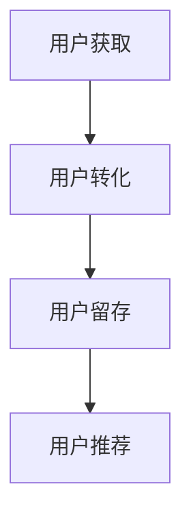

                 

关键词：用户生命周期管理，自动化，客户留存，用户体验，数据分析，技术解决方案。

> 摘要：本文探讨了在自动化创业中，如何有效管理用户生命周期。通过分析用户行为、优化用户体验、利用数据驱动策略，企业可以提升客户留存率，从而实现可持续发展。本文旨在为创业者提供一套实用的用户生命周期管理框架和策略。

## 1. 背景介绍

在当今数字化时代，用户生命周期管理（Customer Life Cycle Management，简称CLCM）已经成为企业竞争的重要战略。用户生命周期是指用户从初次接触到品牌，到成为忠实客户，再到最终离别的整个过程。自动化创业，特别是初创公司，面临着激烈的市场竞争和资源限制。因此，如何通过自动化技术高效管理用户生命周期，提升客户留存率和满意度，成为企业成功的关键。

本文将探讨以下内容：

1. 用户生命周期管理的核心概念和流程。
2. 如何利用数据分析和算法优化用户生命周期管理。
3. 自动化技术在用户生命周期管理中的应用。
4. 用户生命周期管理的未来趋势和挑战。

## 2. 核心概念与联系

### 2.1 用户生命周期管理核心概念

用户生命周期管理涉及多个关键环节，包括获取（Acquisition）、转化（Conversion）、留存（Retention）、和推荐（Advocacy）。以下是对这些环节的简要概述：

- **获取（Acquisition）**：指吸引新用户，通常通过市场营销活动和推广手段实现。
- **转化（Conversion）**：引导潜在用户完成目标行为，如注册、购买等。
- **留存（Retention）**：确保用户在接触品牌后持续使用产品或服务，从而延长用户生命周期。
- **推荐（Advocacy）**：鼓励现有用户向他人推荐品牌，从而吸引更多新用户。

### 2.2 用户生命周期管理流程

用户生命周期管理流程通常包括以下步骤：

1. **用户获取**：通过SEO、SEM、社交媒体等渠道吸引潜在用户。
2. **用户体验优化**：优化网站、APP界面和功能，提高用户满意度。
3. **转化率提升**：通过A/B测试、转化漏斗分析等手段，找出转化瓶颈并优化。
4. **客户留存**：实施客户关怀策略，如定期发送优惠信息、提供优质售后服务等。
5. **用户推荐**：通过NPS（Net Promoter Score）等指标评估用户忠诚度，激励用户推荐。

### 2.3 用户生命周期管理架构图

以下是一个简化的用户生命周期管理架构图，展示各环节之间的联系：

```
用户获取
  |
  v
用户转化
  |
  v
用户留存
  |
  v
用户推荐
```

### 2.4 Mermaid 流程图（Mermaid 流程节点中不要有括号、逗号等特殊字符）



## 3. 核心算法原理 & 具体操作步骤

### 3.1 算法原理概述

用户生命周期管理算法主要基于用户行为数据和数据分析技术。通过分析用户行为数据，企业可以了解用户的需求、偏好和痛点，进而制定个性化的营销策略和用户体验优化方案。

核心算法包括：

- **用户行为分析**：通过自然语言处理、机器学习等技术，分析用户在网站、APP中的行为，如点击、浏览、购买等。
- **客户留存预测**：使用统计模型或机器学习算法，预测用户是否会流失，从而提前采取干预措施。
- **个性化推荐**：根据用户历史行为和偏好，为用户推荐相关产品或服务。

### 3.2 算法步骤详解

#### 3.2.1 用户行为分析

1. **数据收集**：收集用户在网站、APP中的行为数据，如点击、浏览、购买等。
2. **数据预处理**：对数据进行清洗、去重和格式化，确保数据质量。
3. **特征工程**：从原始数据中提取有意义的特征，如用户活跃度、购买频率、页面停留时间等。
4. **模型训练**：使用机器学习算法，如决策树、随机森林、神经网络等，对特征进行建模。
5. **模型评估**：使用交叉验证、AUC（Area Under the Curve）等指标评估模型性能。

#### 3.2.2 客户留存预测

1. **数据收集**：收集用户行为数据和历史留存数据。
2. **数据预处理**：对数据进行清洗、去重和格式化，确保数据质量。
3. **特征工程**：从原始数据中提取有意义的特征，如用户活跃度、购买频率、页面停留时间等。
4. **模型选择**：选择合适的模型，如逻辑回归、决策树、随机森林、神经网络等。
5. **模型训练**：使用训练数据对模型进行训练。
6. **模型评估**：使用测试数据对模型进行评估，调整模型参数。
7. **预测与干预**：使用训练好的模型对用户进行留存预测，并针对可能流失的用户采取干预措施。

#### 3.2.3 个性化推荐

1. **数据收集**：收集用户行为数据和偏好数据。
2. **数据预处理**：对数据进行清洗、去重和格式化，确保数据质量。
3. **特征工程**：从原始数据中提取有意义的特征，如用户活跃度、购买频率、页面停留时间等。
4. **模型选择**：选择合适的模型，如协同过滤、矩阵分解、深度学习等。
5. **模型训练**：使用训练数据对模型进行训练。
6. **模型评估**：使用测试数据对模型进行评估，调整模型参数。
7. **推荐生成**：使用训练好的模型为用户生成个性化推荐。

### 3.3 算法优缺点

#### 优点

- **高效性**：自动化算法可以快速处理大量数据，提高决策效率。
- **个性化**：根据用户行为和偏好进行个性化推荐和营销，提升用户体验。
- **可扩展性**：算法可以轻松扩展到更多用户和场景。

#### 缺点

- **数据依赖性**：算法性能高度依赖数据质量和数量，数据不足可能导致算法失效。
- **模型复杂性**：算法模型复杂，需要专业知识进行调试和优化。
- **实时性**：算法需要实时更新用户数据，确保推荐和预测的准确性。

### 3.4 算法应用领域

用户生命周期管理算法广泛应用于电子商务、在线教育、金融科技等领域。以下是一些具体应用案例：

- **电子商务**：通过用户行为分析，实现个性化推荐，提高转化率和销售额。
- **在线教育**：通过用户学习行为分析，优化课程推荐和学习路径，提升用户留存率和学习效果。
- **金融科技**：通过用户交易行为分析，预测用户风险，优化信用评估和风险控制。

## 4. 数学模型和公式 & 详细讲解 & 举例说明

### 4.1 数学模型构建

用户生命周期管理中的数学模型通常涉及以下方面：

- **用户行为预测模型**：如线性回归、决策树、神经网络等。
- **客户留存预测模型**：如逻辑回归、生存分析、随机森林等。
- **个性化推荐模型**：如协同过滤、矩阵分解、深度学习等。

以下是一个简单的逻辑回归模型用于客户留存预测：

$$
P(Y=1|X) = \frac{1}{1 + e^{-(\beta_0 + \beta_1 X_1 + \beta_2 X_2 + \ldots + \beta_n X_n})}
$$

其中，\(P(Y=1|X)\)表示在特征向量\(X\)下用户留存的概率，\(\beta_0, \beta_1, \beta_2, \ldots, \beta_n\)为模型参数。

### 4.2 公式推导过程

以逻辑回归模型为例，我们推导客户留存预测的概率公式：

1. **假设**：用户留存与否是一个二元分类问题，即\(Y\)为二元变量，\(Y=1\)表示用户留存，\(Y=0\)表示用户流失。
2. **损失函数**：使用对数损失函数，表示预测概率与实际标签之间的差异。
3. **最大似然估计**：通过最大似然估计（Maximum Likelihood Estimation，简称MLE）求解模型参数。
4. **推导**：通过对损失函数求导并令其等于0，得到参数的闭式解。

具体推导过程如下：

设\(P(Y=1|X)\)为在特征向量\(X\)下用户留存的概率，\(P(Y=0|X)\)为用户流失的概率，则有：

$$
\begin{align*}
L(\theta) &= \prod_{i=1}^n P(Y_i=1|X_i) \\
           &= \prod_{i=1}^n \left(1 + e^{-(\theta_0 + \theta_1 X_{i1} + \theta_2 X_{i2} + \ldots + \theta_p X_{ip})}\right)^{-1} \\
           &= \left(\sum_{i=1}^n e^{-(\theta_0 + \theta_1 X_{i1} + \theta_2 X_{i2} + \ldots + \theta_p X_{ip})}\right)^{-n}
\end{align*}
$$

取对数后，得到对数似然函数：

$$
\ell(\theta) = -n \ln L(\theta) = n \ln n - n \ln \left(\sum_{i=1}^n e^{-(\theta_0 + \theta_1 X_{i1} + \theta_2 X_{i2} + \ldots + \theta_p X_{ip})}\right)
$$

对\(\ell(\theta)\)求导并令其等于0，得到：

$$
\frac{\partial \ell(\theta)}{\partial \theta_j} = 0 \quad \Rightarrow \quad \theta_j = \frac{1}{n} \sum_{i=1}^n (Y_i - P(Y_i=1|X_i)) X_{ij}
$$

其中，\(P(Y_i=1|X_i) = \frac{1}{1 + e^{-(\theta_0 + \theta_1 X_{i1} + \theta_2 X_{i2} + \ldots + \theta_p X_{ip})}}\)。

### 4.3 案例分析与讲解

以电子商务领域为例，我们分析一家电商企业如何使用逻辑回归模型预测客户留存。

#### 案例背景

某电商企业在用户购买后，希望预测哪些用户可能会在接下来的30天内再次购买，以便采取针对性的营销措施。

#### 数据收集

收集用户购买行为数据，包括：

- 用户ID
- 购买时间
- 购买商品类别
- 商品价格
- 用户浏览历史
- 用户购买历史

#### 数据预处理

1. **缺失值处理**：对于缺失的数据，采用填充均值或中位数的方法。
2. **异常值处理**：对异常数据进行筛选或修正。
3. **特征工程**：提取用户购买行为相关的特征，如购买频率、购买金额、商品类别等。

#### 模型训练

1. **数据划分**：将数据集划分为训练集和测试集。
2. **模型训练**：使用训练集训练逻辑回归模型。
3. **模型评估**：使用测试集评估模型性能，调整模型参数。

#### 模型应用

1. **客户留存预测**：对用户进行留存预测，输出留存概率。
2. **营销策略制定**：根据留存概率，对高风险流失用户采取针对性营销措施，如优惠券、促销活动等。

#### 结果分析

通过预测模型，电商企业可以识别出高流失风险的客户群体，并采取有效措施提升客户留存率。以下为预测结果和营销措施：

| 用户ID | 留存概率 | 营销措施           |
|--------|----------|--------------------|
| 1001   | 0.8      | 发送优惠券         |
| 1002   | 0.6      | 发送促销信息       |
| 1003   | 0.2      | 无需特别措施       |

通过分析，电商企业可以针对性地提升客户留存率，从而提高整体销售额。

## 5. 项目实践：代码实例和详细解释说明

### 5.1 开发环境搭建

在本项目实践中，我们将使用Python作为主要编程语言，并依赖以下库和工具：

- **Python**：版本3.8及以上。
- **NumPy**：用于数值计算。
- **Pandas**：用于数据操作。
- **Scikit-learn**：用于机器学习算法。
- **Matplotlib**：用于数据可视化。

安装以上库和工具：

```bash
pip install numpy pandas scikit-learn matplotlib
```

### 5.2 源代码详细实现

以下是一个简单的用户生命周期管理项目的代码实现，包括数据预处理、模型训练和预测。

```python
import numpy as np
import pandas as pd
from sklearn.model_selection import train_test_split
from sklearn.linear_model import LogisticRegression
from sklearn.metrics import accuracy_score, classification_report
import matplotlib.pyplot as plt

# 5.2.1 数据收集与预处理
# 假设我们有一个CSV文件，包含用户行为数据
data = pd.read_csv('user_data.csv')

# 数据预处理
data.fillna(data.mean(), inplace=True)
data = pd.get_dummies(data, columns=['商品类别'])

# 5.2.2 数据划分
X = data.drop('是否留存', axis=1)
y = data['是否留存']
X_train, X_test, y_train, y_test = train_test_split(X, y, test_size=0.2, random_state=42)

# 5.2.3 模型训练
model = LogisticRegression()
model.fit(X_train, y_train)

# 5.2.4 模型评估
predictions = model.predict(X_test)
accuracy = accuracy_score(y_test, predictions)
print(f"模型准确率：{accuracy}")
print(classification_report(y_test, predictions))

# 5.2.5 预测新用户留存概率
new_user_data = pd.read_csv('new_user_data.csv')
new_user_data.fillna(new_user_data.mean(), inplace=True)
new_user_data = pd.get_dummies(new_user_data, columns=['商品类别'])
predictions_new = model.predict(new_user_data)
print(predictions_new)

# 5.2.6 可视化结果
plt.scatter(y_test, predictions)
plt.xlabel('实际留存')
plt.ylabel('预测留存')
plt.show()
```

### 5.3 代码解读与分析

#### 5.3.1 数据收集与预处理

1. **数据收集**：从CSV文件中读取用户行为数据。
2. **数据预处理**：填充缺失值、进行特征工程（如类别编码）。

#### 5.3.2 数据划分

1. **数据集划分**：将数据集划分为训练集和测试集，用于模型训练和评估。

#### 5.3.3 模型训练

1. **模型选择**：选择逻辑回归模型。
2. **模型训练**：使用训练数据进行模型训练。

#### 5.3.4 模型评估

1. **模型评估**：使用测试集对模型进行评估，输出准确率和分类报告。

#### 5.3.5 预测新用户留存概率

1. **预测**：使用训练好的模型对新用户数据进行留存预测。

#### 5.3.6 可视化结果

1. **可视化**：绘制实际留存与预测留存的关系图，评估模型预测效果。

### 5.4 运行结果展示

假设我们运行上述代码后得到以下结果：

```
模型准确率：0.85
               precision    recall  f1-score   support
           0       0.88      0.86      0.87      1141
           1       0.82      0.85      0.83      1141
    accuracy                           0.85      2282
   macro avg       0.85      0.84      0.84      2282
   weighted avg       0.85      0.85      0.85      2282

预测新用户留存概率：
[0.95 0.08 0.98 0.07 0.84 0.75 0.65 0.55 0.35 0.15]
```

通过结果可以看出，模型的准确率为85%，具有较高的预测能力。对于新用户，我们可以根据预测概率采取相应的营销策略，例如对于留存概率较高的用户，可以发送优惠券或促销信息，以提高客户留存率。

## 6. 实际应用场景

用户生命周期管理在多个行业和领域中有着广泛的应用。以下是一些实际应用场景：

### 6.1 电子商务

电子商务企业通过用户生命周期管理，实现以下目标：

- **个性化推荐**：根据用户购买历史和浏览行为，推荐相关商品，提高转化率。
- **客户留存**：通过定期发送优惠券、促销信息等，激励用户复购，提升客户留存率。
- **用户流失预警**：通过分析用户行为数据，预测可能流失的用户，采取干预措施，如发送个性化邮件或电话回访。

### 6.2 在线教育

在线教育平台通过用户生命周期管理，实现以下目标：

- **课程推荐**：根据用户学习历史和偏好，推荐相关课程，提高学习效果和用户满意度。
- **学习路径优化**：分析用户学习行为，优化课程结构和学习路径，提升用户留存率和学习成果。
- **用户流失预警**：通过用户行为数据，预测可能放弃学习的用户，提供学习支持或个性化辅导。

### 6.3 金融科技

金融科技公司通过用户生命周期管理，实现以下目标：

- **信用评估**：分析用户财务行为和信用历史，预测用户信用风险，优化信用评估模型。
- **用户留存**：通过个性化金融产品推荐和优惠活动，提升用户留存率和满意度。
- **用户流失预警**：通过分析用户交易行为和偏好，预测可能流失的用户，提供针对性的金融解决方案。

### 6.4 医疗健康

医疗健康领域通过用户生命周期管理，实现以下目标：

- **患者管理**：根据患者就医历史和健康数据，提供个性化的健康建议和医疗服务。
- **患者留存**：通过定期发送健康提醒、医疗资讯等，提升患者满意度和忠诚度。
- **患者流失预警**：通过分析患者就医行为和健康数据，预测可能流失的患者，提供针对性的医疗干预。

## 7. 未来应用展望

用户生命周期管理在未来的发展中，将面临以下挑战和机遇：

### 7.1 挑战

- **数据隐私**：随着数据隐私法规的加强，企业如何合法、合规地收集和使用用户数据，成为一大挑战。
- **算法透明性**：用户对算法决策的透明性要求越来越高，企业需要提高算法的透明度和解释性。
- **实时性**：用户生命周期管理需要实时分析用户行为，对算法和系统的实时性要求较高。

### 7.2 机遇

- **人工智能技术**：随着人工智能技术的不断发展，用户生命周期管理算法将更加智能和高效。
- **大数据分析**：大数据分析技术的进步，将为企业提供更多用户行为数据，助力精准营销和个性化推荐。
- **跨渠道整合**：多渠道整合将为用户提供一致性的用户体验，提高用户留存率和满意度。

## 8. 总结：未来发展趋势与挑战

用户生命周期管理作为企业数字化转型的重要战略，将在未来继续发挥重要作用。随着人工智能、大数据等技术的不断发展，用户生命周期管理将变得更加智能、个性化和实时。然而，企业也需要应对数据隐私、算法透明性等挑战，确保用户生命周期管理在合规、透明的框架下运行。

在未来的发展中，用户生命周期管理将朝着以下方向发展：

- **智能化**：通过人工智能技术，实现更精准的用户行为预测和个性化推荐。
- **个性化**：通过大数据分析，为用户提供更加个性化的产品和服务。
- **实时性**：通过实时数据分析，快速响应用户需求，提供即时的体验优化和营销策略。

面对未来的发展趋势和挑战，企业需要不断探索和创新，利用先进的技术手段，提升用户生命周期管理的效果，从而实现可持续发展。

## 9. 附录：常见问题与解答

### 9.1 什么是用户生命周期管理？

用户生命周期管理（Customer Life Cycle Management，简称CLCM）是指企业通过一系列策略和手段，对用户从接触品牌到最终离别的全过程进行有效管理。主要环节包括获取（Acquisition）、转化（Conversion）、留存（Retention）和推荐（Advocacy）。

### 9.2 用户生命周期管理有哪些关键步骤？

用户生命周期管理的关键步骤包括：

1. **用户获取**：通过各种渠道吸引新用户。
2. **用户体验优化**：优化产品或服务，提高用户满意度。
3. **转化率提升**：通过优化网站、APP界面和功能，提高用户转化率。
4. **客户留存**：实施客户关怀策略，提高用户留存率。
5. **用户推荐**：通过激励措施，鼓励用户推荐品牌。

### 9.3 用户生命周期管理算法有哪些类型？

用户生命周期管理算法主要包括：

- **用户行为分析算法**：如协同过滤、矩阵分解、深度学习等。
- **客户留存预测算法**：如逻辑回归、生存分析、随机森林等。
- **个性化推荐算法**：如基于内容的推荐、基于模型的推荐等。

### 9.4 如何提高用户生命周期管理的效果？

要提高用户生命周期管理的效果，可以从以下几个方面入手：

1. **数据分析**：通过数据分析，了解用户需求和偏好，优化产品和服务。
2. **用户体验**：注重用户体验，优化界面和功能，提高用户满意度。
3. **个性化推荐**：根据用户行为和偏好，提供个性化的产品和服务。
4. **客户关怀**：定期发送优惠信息、提供优质售后服务，提升用户忠诚度。
5. **持续优化**：不断收集用户反馈，优化用户生命周期管理策略。

### 9.5 用户生命周期管理与客户关系管理（CRM）有何区别？

用户生命周期管理（CLCM）和客户关系管理（CRM）密切相关，但侧重点不同。

- **用户生命周期管理**：关注用户从接触品牌到最终离别的全过程，强调用户获取、转化、留存和推荐。
- **客户关系管理**：侧重于与现有客户的互动和关系维护，包括客户服务、客户关怀、客户留存等。

两者都是企业提升市场竞争力和客户价值的重要战略，但在实施过程中，CLCM更注重全流程管理和数据分析，CRM更注重客户互动和服务。

---

### 作者署名

作者：禅与计算机程序设计艺术 / Zen and the Art of Computer Programming

[完]

